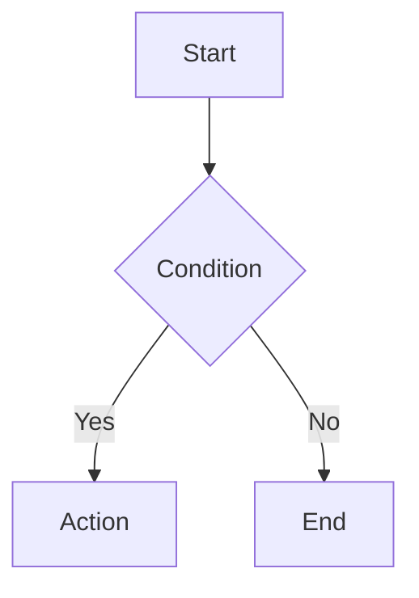

# SPEC-XXX: [Title]

## TLDR

**Key Points:**
- [Brief description of what is being built - 1-2 sentences]
- [Primary purpose/goal]

**Major Features:**
- [Feature 1 - one line]
- [Feature 2 - one line]

**Key Concerns (Optional):**
- [Significant risks or constraints - omit if none]

## Overview

[Briefly describe what this module/feature does and why it is being implemented. Mention target audience and key benefits.]

## Problem Statement

[Describe the specific pain points, existing limitations, or gaps that this specification aims to solve.]

## Proposed Solution

[Describe the high-level technical approach and how it addresses the problem statement.]

## User Stories

- **As a [persona]**, I want to [action], so that [value].
- **As a [persona]**, I want to [action], so that [value].

## Design Logic & Research

- **Market Research**: [Learn from market leaders (Open Source market leader in the same tech stack and domain) to challenge your requirements with their approach before modeling any business domain.]
- **Phasing**: 
  - **Phase 1 (MVP)**: [List core features included in the first release.]
  - **Phase 2+**: [List complex features deferred for later.]

## Architecture

[Describe high-level design, component relationships, and how it fits into the existing system.]



## Data Models

### [Entity Name] (Singular)

[Define fields, types, and relationships. Use snake_case for DB columns.]

- `id`: UUID (Primary Key)
- `organization_id`: UUID (Tenant scoping)
- `tenant_id`: UUID (Tenant scoping)
- `created_at`: Datetime
- `updated_at`: Datetime
- `deleted_at`: Datetime (Soft delete)
- ...

## API Contracts

### [Endpoint Name]

- **Method**: `POST` | `GET` | `PUT` | `DELETE`
- **Path**: `/api/[module]/[path]`
- **RBAC**: `requireAuth`, `requireFeatures: ['module.action']`
- **Request Schema**: [Zod schema summary]
- **Response Example**: 

```json
{
  "success": true,
  "data": { ... }
}
```

## Internalization (i18n)

[List every new translation key required for the UI, emails, or status labels.]

| Key | Default English Value | Context |
|-----|-----------------------|---------|
| `module.entity.label` | "Default" | Field label |
| `module.entity.error.exists` | "Already exists" | Error message |

## Internal Migration & Compatibility

[Describe how existing data or users will be migrated. Address backward compatibility.]

- **Breaking Changes**: [List any breaking changes to APIs or data structures.]
- **Migration Script**: [mikro-orm migration or custom script?]
- **Rollback Plan**: [How to revert if the migration fails?]

## UI/UX

[Describe components, forms, tables, and interactions.]

- **Standard Components**: [Mention use of CrudForm, DataTable, FormHeader, FormFooter.]
- **Visuals (Optional)**: [Describe any premium design elements. Recommended for **frontend-facing** or **headless-consumer** interfaces.]

## Configuration

- **Environment Variables**: [Any new .env variables needed?]
- **Feature Toggles**: [Flags to enable/disable this feature.]
- **Tenant Settings**: [Configurable options per organization.]

## Commands & Events

### Command: [module].[entity].[action] (Singular)

- **Undo Behavior**: [Describe how state is restored.]
- **Audit Log Integration (Optional)**: [Define the `buildLog` handler and `parentResourceKind`/`parentResourceId` if applicable. Required for business-critical state changes tracked in Version History.]
- **Side Effects**: [Events emitted, cache invalidation, search re-indexing.]

### Event: [module].[entity].[past_tense_verb] (Singular)

- **Fields**: `id`, `label`, `category`, ...

## Risks & Impact Review

### Data Integrity
- **Scenario**: [What if operation is interrupted?]
- **Severity**: [Critical | High | Medium | Low]
- **Mitigation**: [e.g., withAtomicFlush, transactions]

### Isolation
- **Scenario**: [Can data leak between tenants?]
- **Severity**: Critical
- **Mitigation**: [e.g., strict organization_id filtering]

## Security & PII (Optional)

[Explicitly address security requirements and PII handling.]

- **Encryption**: [Which fields are encrypted at rest?]
- **Rate Limiting**: [Which endpoints need protection?]
- **Cookie Security**: [HttpOnly, Secure, SameSite?]
- **PII Leakage**: [Are sensitive fields excluded from search indices/logs?]

## Final Compliance Report

| Rule Source | Rule | Status | Notes |
|-------------|------|--------|-------|
| Root AGENTS.md | No direct ORM relationships | [Compliant/NA] | |
| Root AGENTS.md | Filter by organization_id | [Compliant/NA] | |
| ... | ... | ... | ... |

## Changelog

### [YYYY-MM-DD]
- Initial specification
