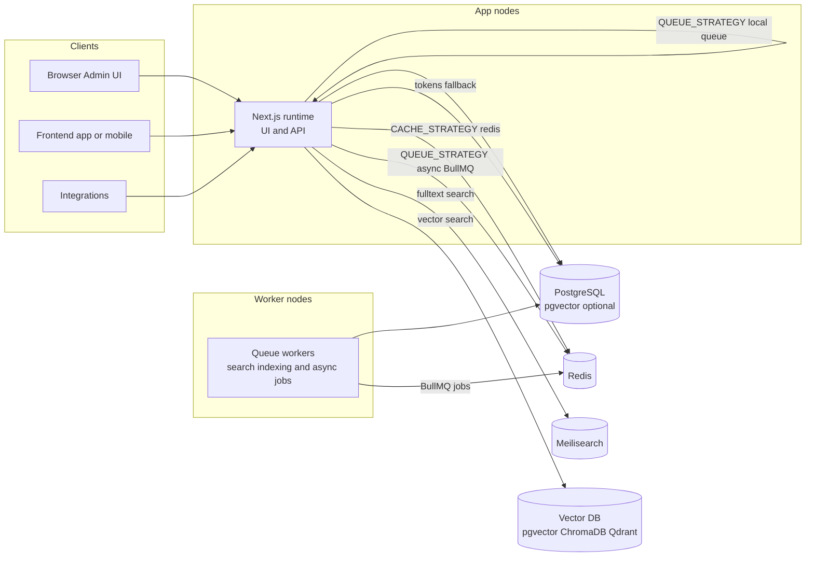

# Deployment & Building Blocks

## Core runtime (always there)

- Next.js app (monolith runtime)
- Serves UI (backend + frontend) and API (`/api/*`) in one deployable unit
- PostgreSQL (system tables + custom entities/fields)
- Common default: pgvector-enabled Postgres (see `pgvector/pgvector` in `docker-compose.yml`)

## Optional infra services (plug-in, scale-out)

- Cache layer (`CACHE_STRATEGY`)
  - `memory` (default/dev)
  - `redis` (multi-node / distributed cache) via ioredis
  - `sqlite` (local persistent cache) via better-sqlite3
  - `jsonfile` (local/debug)
- Queue layer (`QUEUE_STRATEGY`)
  - `local` (file-based in `.queue`)
  - `async` (BullMQ on Redis)
- Search layer (multi-strategy)
  - `tokens` (Postgres-backed, works with encrypted data)
  - `fulltext` (Meilisearch)
  - `vector` (embeddings)
  - Default preference: `fulltext` → `vector` → `tokens`
- Vector database drivers
  - `pgvector`, `ChromaDB`, `Qdrant`
  - Embeddings providers are configurable

## Can be deployed on different machines

- Web/API nodes: Next.js app behind a load balancer
- Worker nodes: queue workers (search indexers, async jobs)
- Shared services: Postgres, Redis, Meilisearch, optional vector DB

:::notes
This diagram shows Open Mercato as a clean set of building blocks. At the center is the Next.js runtime, which can run as a single app or scale horizontally. Postgres is the main system of record, and we commonly run it with pgvector enabled. From there you can add optional infrastructure: Redis for a distributed cache and for BullMQ queues, Meilisearch for fast typo-tolerant full-text search, and a vector store for semantic search—either pgvector, ChromaDB, or Qdrant. The queue and indexing workers can move to separate machines in production: app nodes handle requests, worker nodes process async jobs, and all nodes share Postgres plus any external search services.
:::
