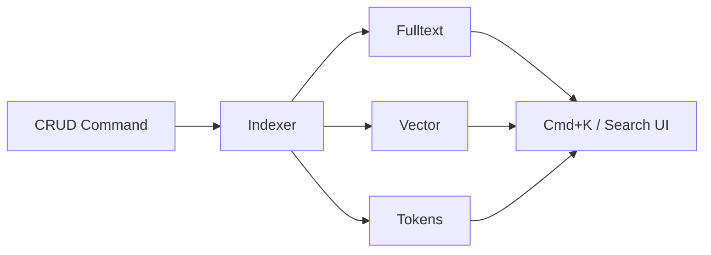

# Search, Indexing, and Events

Search is modular and supports fulltext, vector, and token strategies.

- Search configs live at `src/modules/<module>/search.ts`
- Indexing runs sync or via queues and workers
- Presenters are defined per entity for human-readable results

:::notes
Cover the idea that search is a first-class module with multiple strategies. Indexing is an evented side effect, not an afterthought.
:::
