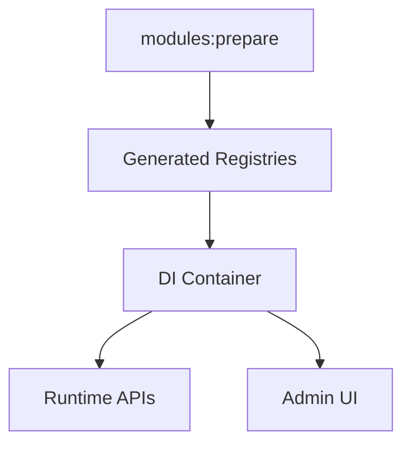

# Runtime Boot and Guardrails

The runtime bootstraps modules, entities, and DI registrars from generated files.

- Registries: modules, entities, DI, widgets, and CLIs
- Multi-tenant scope is enforced in APIs and queries
- Encryption helpers protect sensitive fields at rest
- Workers and subscribers handle async work safely

:::notes
Highlight how bootstrapping keeps the system consistent and secure. Mention guardrails: tenant scope, encryption helpers, and queue workers.
:::
