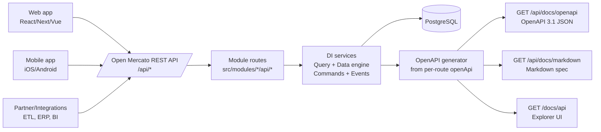

# Headless Deployment

## What “headless” means in Open Mercato

- Run Open Mercato as a pure backend platform
- Web/mobile/partner portals use the same APIs as the admin
- Modules expose REST handlers under `src/modules/<module>/api/...`
- A catch-all API router wires everything together
- Swap UI layers without forking backend logic (RBAC, scoping, events, indexing)

## Why it’s easy (platform guarantees)

- Consistent REST APIs via CRUD factory (`makeCrudRoute`)
- Standardized GET/POST/PUT/DELETE behaviors
- Built-in tenant + organization scoping
- Built-in RBAC metadata (`requireAuth`, `requireFeatures`)
- Hooks into commands, events, indexing, and custom fields
- Same runtime for admin UI and headless clients

## OpenAPI & docs (contract + automation)

- Every API route exports `openApi` (required)
- Zod schemas keep validation and docs aligned
- CRUD endpoints use `createCrudOpenApiFactory(...)`
- Live documentation endpoints:
  - `GET /api/docs/openapi` → OpenAPI 3.1 JSON
  - `GET /api/docs/markdown` → Markdown spec
  - `GET /docs/api` → interactive explorer

## Typical headless consumers (examples)

- Web storefront / mobile app / partner portal
- Integration layer (ERP sync, warehouse, billing)
- External automations (Zapier/n8n-style scripts) with OpenAPI + bearer tokens

:::notes
Headless is straightforward in Open Mercato because the platform is API-first. Modules expose their APIs under src/modules/<module>/api, and both the admin UI and any external client use the same /api/* endpoints. Those routes are usually built with the CRUD factory, so you automatically get consistent method handling, tenant/org scoping, RBAC guards, and integration with commands and events. On top of that, every route exports an openApi definition, so we can generate a live OpenAPI 3.1 document and also export it as Markdown. That makes client generation, contract testing, and external integrations much easier.
:::
