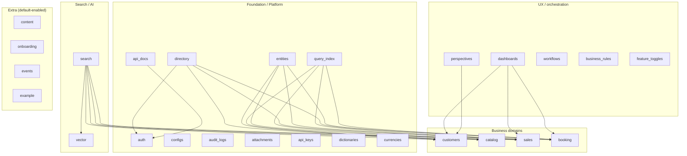

# Default Modules Map

## Foundation / Platform

- auth (logins, sessions, roles, user ACL overrides)
- directory (tenants + organizations, multi-tenant scope)
- configs (system configuration)
- entities (custom entities + custom fields (EAV) + encryption maps)
- query_index (query/index layer for fast filtering/search support)
- audit_logs (audit trail)
- attachments (files/attachments)
- api_keys (integration keys)
- api_docs (OpenAPI explorer + OpenAPI JSON/Markdown endpoints)
- dictionaries (shared dictionaries/value sets)
- currencies (currency primitives)

## Business domains

- customers (CRM: companies/people/deals/activities/todos/tags)
- catalog (products/catalog)
- sales (orders/quotes and related sales docs)
- booking (resources/team/availability/scheduling)

## UX / orchestration

- dashboards (dashboard widgets + layout)
- perspectives (saved table/list views)
- workflows (workflow orchestration)
- business_rules (rules engine + logs)
- feature_toggles (feature flags)

## Search / AI

- search (multi-strategy search + indexing pipeline)
- vector (vector infra used by semantic search)

## Extra modules enabled by default

- content (content module)
- onboarding (self-serve onboarding)
- events (events primitives)
- example (reference/demo module)

**Key message:** Everything above is modular: disable in `src/modules.ts`, override via `src/modules/<module>/...`, or add your own package module.

:::notes
This slide shows what Open Mercato ships with by default. The foundation modules give you multi-tenancy (directory), identity and permissions (auth), configuration (configs), dynamic data modeling (entities), and performance/indexing (query_index), plus operational modules like audit_logs, attachments, and API key support. On top of that are the core business domains—customers, catalog, sales, and booking. Then there are UX and orchestration modules like dashboards, perspectives, workflows, and business rules. Finally, search and AI are included with the search and vector modules. The important part: these are all modules—so you can disable, replace, or override them without forking the platform.
:::
