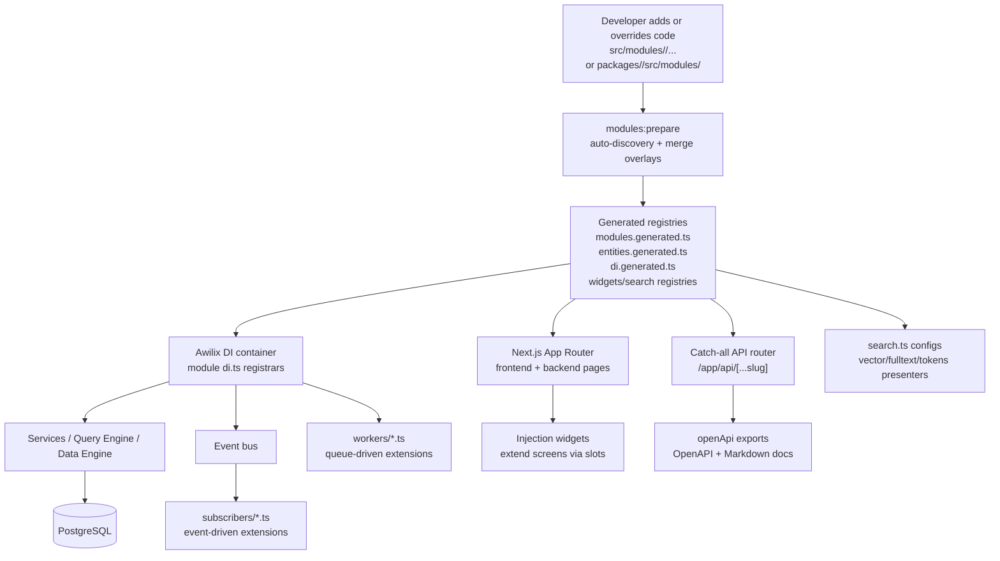

# Extensibility (Developer Surface Area)

## Extensible by design: Overlay + Modules + Generators + DI

- Module-first architecture: every capability is a module (UI + API + data + DI + events), enabled/disabled in `src/modules.ts`
- Overlay overrides (no forks): drop files into `src/modules/<module>/...` to override package behavior with the same relative path
- Auto-discovery → generated registries: `npm run modules:prepare` scans enabled modules and emits glue (`generated/*`)
- Multiple extension surfaces, same runtime:
  - Pages: `frontend/*` → `/<path>`, `backend/*` → `/backend/<path>`
  - API: `api/<method>/<path>.ts` → `/api/<path>` (each route exports `openApi`)
  - Data: `data/entities.ts`, `data/extensions.ts` (links/extensions)
  - Behavior: `di.ts`, `subscribers`, `workers`, `cli.ts`
- Composable UI via injection widgets: extend screens through slots
- Runtime schema extensibility: custom entities/fields via `ce.ts` + Entities module (EAV)
- Search extensibility: per-module `search.ts` config (fulltext/vector/token presenters)

:::notes
Open Mercato is designed to be extended without forking core packages. The main mechanism is the module system, plus an overlay: anything you put in src/modules/<module> overrides the package module file with the same path. At build time, modules:prepare scans enabled modules from modules.ts, merges overrides, and generates registries that drive routing, APIs, DI, entities, widgets, and search configs. From there, extension points are consistent: add pages under frontend/ or backend/, add APIs under api/<method>/... (and always export openApi so docs stay automatic), register services via di.ts, react to domain events via subscribers, and run async jobs via workers. For UI composition, injection widgets let modules extend existing screens through stable slots instead of tight coupling. And for data model evolution, custom entities + fields via ce.ts enable runtime schemas while still flowing through the same CRUD / indexing / search patterns.
:::
