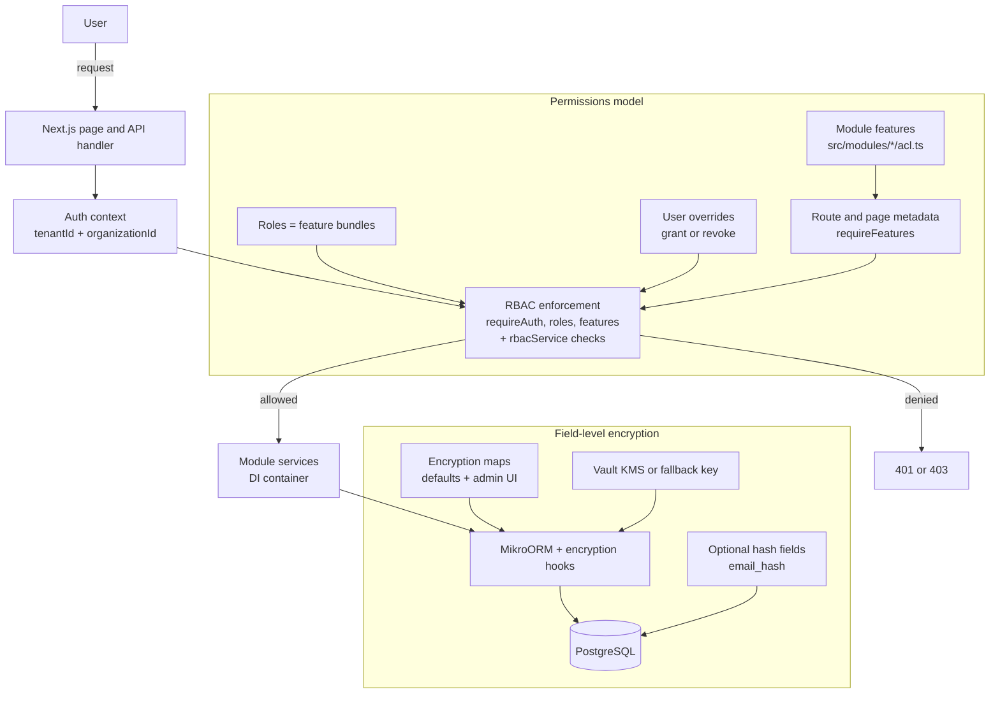

# Security Model — RBAC, ACLs, and Field-Level Encryption

## RBAC + ACLs (who can do what, where)

- Two-layer RBAC with role bundles + user overrides
- Features are the unit of permission
- Declared per module in `src/modules/<module>/acl.ts`
- Naming: `<module>.<action>` (e.g. `auth.users.edit`)
- Enforcement:
  - Declarative guards: `requireAuth`, `requireRoles`, `requireFeatures`
  - Imperative checks: `rbacService.userHasAllFeatures(userId, features, { tenantId, organizationId })`
- Tenant safety: `tenantId` + `organizationId`, optional org visibility, super admin override

## Field-level encryption (protect data at rest)

- Tenant-scoped encryption with per-tenant DEKs
- Vault KMS (`VAULT_ADDR`, `VAULT_TOKEN`, `VAULT_KV_PATH`) or fallback key
- Feature flag: `TENANT_DATA_ENCRYPTION=yes|no`
- Encryption maps define protected fields (`encryptionDefaults.ts`)
- Admin UI can toggle encrypted fields per entity
- Custom fields (EAV) can be encrypted too
- Deterministic lookups use hash columns (e.g. `email_hash`)
- Rotation/backfill supported via CLI
- For unsafe relations, use `findWithDecryption`

:::notes
Open Mercato security has two complementary layers. First is RBAC with feature flags: modules declare their capabilities as static feature strings in acl.ts, then pages and APIs declare requireAuth, requireRoles, and requireFeatures. Roles bundle features, and user-level ACL overrides can fine-tune access without role explosion. Every check is scoped by tenantId and organizationId, so multi-tenant boundaries are enforced by default.

Second is tenant data encryption: selected columns (and even custom fields) are encrypted at rest with tenant-scoped keys—preferably from Vault, with safe fallback modes for development. Where deterministic lookup is needed, we store a hash column (like email_hash) so the encrypted value stays protected but queries remain fast and reliable. Together, RBAC controls access while field-level encryption reduces blast radius if the database is ever exposed.
:::
