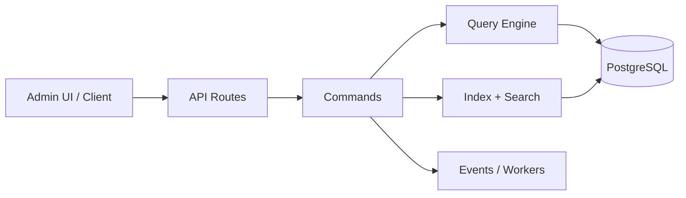

# Open Mercato Architecture

**Modular, auto-discovered, and multi-tenant by default.**

- Modules live under `src/modules/<module>` with frontend, backend, API, data, and DI
- Generators build registries so runtime bootstraps the right modules and entities
- CRUD routes use commands, side effects, and indexing for consistent flows
- Data is tenant scoped and safely extended via custom fields and links

:::notes
Focus on the single-system view: UI and API routes drive commands, commands own side effects, and data flows through the query engine and indexer. Emphasize that modules are isolated and discovered automatically.
:::
