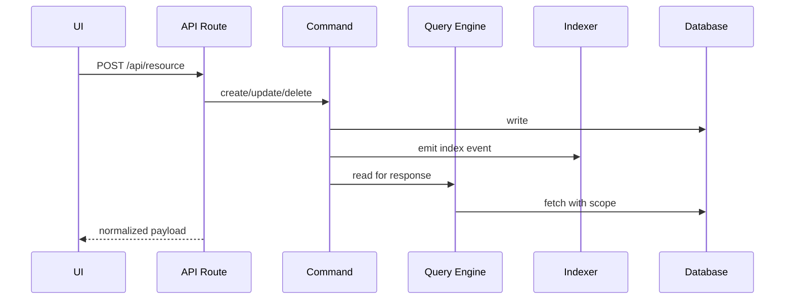

# Request Flow and Commands

Every CRUD action is routed through a command and emits side effects.

- Commands are undoable and track side effects
- Indexing keeps search and list views fast
- Query engine enforces tenant and org scope

:::notes
Stress the command pattern as the source of truth. The query engine reads data with scope, and indexing keeps lists, search, and widgets responsive.
:::
