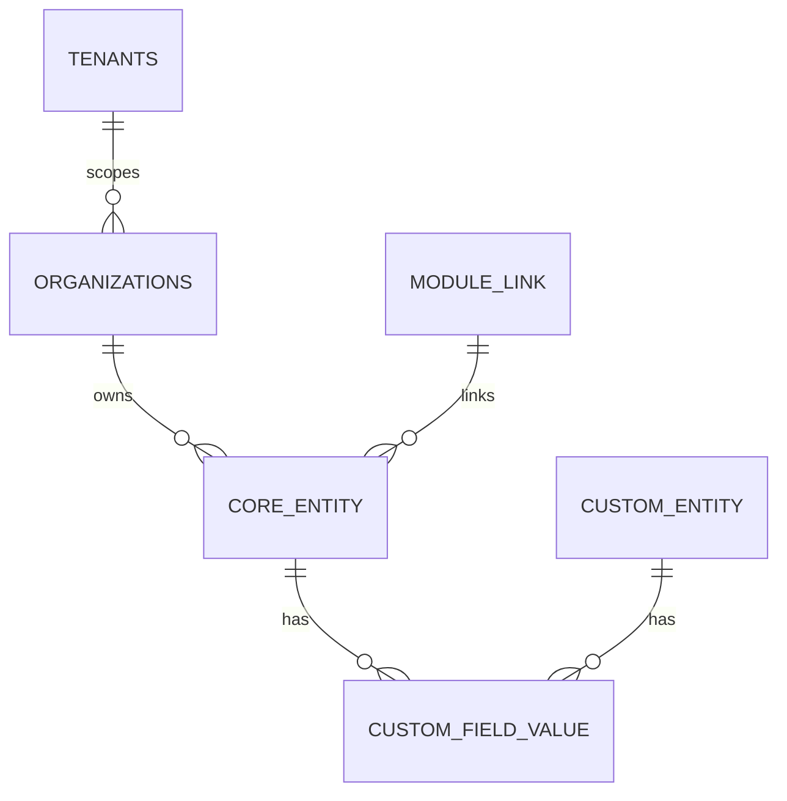

# Data Model and Extensibility

Entities are per-module, with custom fields and links for cross-module data.

- No cross-module ORM relations; use foreign key IDs
- Custom fields live in the entities module (EAV)
- Extensions are declared via `data/extensions.ts`

:::notes
Explain how module isolation is maintained by design, and how custom fields and extension links let teams add data without rewriting core tables.
:::
