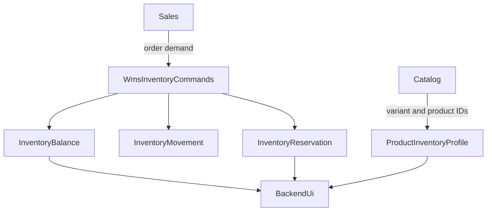

# WMS Phase 1 Specification — Core Inventory

| Field | Value |
|-------|-------|
| **Status** | Draft |
| **Author** | Cursor Agent |
| **Created** | 2026-04-15 |
| **Related** | 2026-04-15-wms-roadmap, Issue #388, SPEC-047, ANALYSIS-009 |

## TLDR
**Key Points:**
- Phase 1 creates the minimum durable inventory core: warehouse topology, product inventory profiles, lot-aware stock ledger, balances, reservations, allocations, and adjustment workflows.
- It establishes the first direct contracts with `catalog` and `sales`, including product-level inventory settings and sales-order availability/reservation integration.
- The phase is intentionally backend-first and stops short of receiving, putaway, picking, or packing execution.

**Scope:**
- `Warehouse`, `WarehouseZone`, `WarehouseLocation`
- `ProductInventoryProfile`, `InventoryLot`, `InventoryBalance`, `InventoryReservation`, `InventoryMovement`
- Core CRUD, zod validation, command handlers, admin UI, search config, events, ACL, and i18n
- Direct `catalog` and `sales` integration contracts needed to make inventory useful from day one

**Concerns:**
- Balance and reservation updates are concurrency-sensitive and must be transaction-safe.
- The phase must replace "inventory as metadata" behavior without taking over shipment or commercial return ownership from `sales`.

---

## Overview

Phase 1 turns Open Mercato from a platform with product records and shipment snapshots into a platform with a real inventory engine. It does this by introducing an append-only movement ledger and a derived balance model keyed by warehouse, location, variant, and optional lot/serial buckets. The result is a source of truth that other modules can query and extend safely.

The phase is targeted at warehouse administrators, sales operations users who need availability visibility, and integration authors who require a stable inventory contract.

> **Market Reference**: This phase adopts the "stock ledger + bin/location balance" foundation used by ERPNext and Odoo, along with OpenBoxes-style lot and expiry discipline. It rejects phase-1 adoption of advanced execution logic such as directed putaway or wave planning because those need the inventory core first.

## Problem Statement

Open Mercato currently lacks all of the following:

1. A warehouse/location model that supports multi-warehouse stock segregation.
2. A traceable stock ledger explaining why quantity changed.
3. Reservation semantics that can support sales-order demand without mutating catalog records directly.
4. Product-level inventory behavior settings such as lot tracking, serial tracking, FEFO, safety stock, and reorder points.
5. A stable, additive way to expose inventory state inside `catalog` and `sales`.

Without these pieces:
- integrations cannot map external stock engines safely
- sales users cannot see trustworthy availability
- later execution phases would have no durable stock source to act on

## Proposed Solution

Phase 1 introduces a WMS-owned inventory core with six parts:

1. **Warehouse topology** for warehouses, zones, and hierarchical locations.
2. **Product inventory profile** for variant-level tracking behavior.
3. **Lot and serial-aware inventory buckets** using derived balances.
4. **Append-only movement ledger** as the auditable write model.
5. **Reservation and allocation engine** that can bind demand to stock.
6. **Cross-module projections** into `catalog` and `sales` via widgets and response enrichers.

### Design Decisions

| Decision | Rationale |
|----------|-----------|
| Use `InventoryMovement` as append-only truth and `InventoryBalance` as transactional read model | Supports auditability, replay, and low-latency availability queries |
| Keep reservations separate from balances | Preserves source traceability (`order`, `transfer`, `manual`) and supports lifecycle transitions |
| Store tracking rules on `ProductInventoryProfile` | Prevents catalog schema pollution while keeping product-specific behavior explicit |
| Expose sales inventory data via `_wms.*` enrichments | Matches SPEC-047 and keeps `sales` route ownership intact |
| Keep barcode support API-only in this phase | Allows later scanner/mobile UX without overextending phase 1 |

### Alternatives Considered

| Alternative | Why Rejected |
|-------------|-------------|
| Store quantities directly on `catalog` variants | Cannot support multiple locations, lots, or reservations |
| Derive availability from reservations only without a balance table | Too expensive for operational reads and hard to scale on large ledgers |
| Add warehouse fields directly into `sales_orders` | Violates module-isolation rules and makes WMS a passenger inside `sales` |

## User Stories / Use Cases

- **Warehouse admin** wants to create warehouses and bins so that inventory can be segregated physically.
- **Inventory controller** wants to adjust stock with reasons so that discrepancies are auditable.
- **Sales user** wants to see available quantity and assigned warehouse context on orders so that fulfillment promises are realistic.
- **Catalog admin** wants to mark a variant as FEFO + lot-tracked so that future receiving and picking enforce the correct constraints.
- **Integrator** wants `GET /api/wms/inventory/balances` and reservation APIs so that external systems can read and orchestrate stock safely.

## Architecture



### Command Flow

```text
API / injected UI action
  -> zod validation
  -> command execute()
  -> withAtomicFlush transaction
  -> append InventoryMovement rows
  -> update InventoryBalance and Reservation rows
  -> emit WMS events
  -> invalidate query index / caches
```

### Commands & Events

Commands introduced in phase 1:
- `createWarehouse`
- `updateWarehouse`
- `createWarehouseZone`
- `updateWarehouseZone`
- `createLocation`
- `updateLocation`
- `createProductInventoryProfile`
- `updateProductInventoryProfile`
- `receiveInventory`
- `reserveInventory`
- `releaseReservation`
- `allocateReservation`
- `moveInventory`
- `adjustInventory`
- `cycleCountReconcile`

Primary events emitted in phase 1:
- `wms.warehouse.created`
- `wms.warehouse.updated`
- `wms.location.created`
- `wms.location.updated`
- `wms.inventory.received`
- `wms.inventory.adjusted`
- `wms.inventory.reserved`
- `wms.inventory.released`
- `wms.inventory.allocated`
- `wms.inventory.moved`
- `wms.inventory.reconciled`
- `wms.inventory.low_stock`

Events consumed by WMS (subscribers):

| Event | Source Module | WMS Action |
|-------|-------------|------------|
| `sales.order.confirmed` | Sales | Create inventory reservation for order line items (`source_type = order`) |
| `sales.order.cancelled` | Sales | Release all active reservations linked to the cancelled order |

Undo expectations:
- CRUD-style configuration commands are undoable by reverting fields or soft-deleting the created row.
- Primary warehouse reassignment captures `demotedPrimariesBefore` in warehouse create/update undo payloads and restores sibling `isPrimary` flags on undo.
- Inventory mutations must write inverse movement entries rather than mutating historical ledger rows.
- Reconcile/adjust commands must preserve before/after bucket snapshots for reversal.

## Data Models

### Warehouse
- `id`: UUID
- `name`: string
- `code`: string, unique per organization
- `is_active`: boolean
- `is_primary`: boolean, at most one `true` per organization (partial unique index)
- `address_line1`, `city`, `postal_code`, `country`, `timezone`
- standard tenant/org/lifecycle columns

### WarehouseZone
- `id`: UUID
- `warehouse_id`: UUID
- `code`: string
- `name`: string
- `priority`: number

### WarehouseLocation
- `id`: UUID
- `warehouse_id`: UUID
- `code`: string, unique per warehouse
- `type`: `zone | aisle | rack | bin | slot | dock | staging`
- `parent_id`: UUID nullable
- `is_active`: boolean
- `capacity_units`, `capacity_weight`: numeric nullable
- `constraints`: jsonb for temperature/hazmat/size rules

### ProductInventoryProfile
- `id`: UUID
- `catalog_product_id`: UUID
- `catalog_variant_id`: UUID nullable
- `default_uom`: string
- `track_lot`: boolean
- `track_serial`: boolean
- `track_expiration`: boolean
- `default_strategy`: `fifo | lifo | fefo`
- `reorder_point`: numeric
- `safety_stock`: numeric

All entities include the global columns: `id (uuid)`, `created_at`, `updated_at`, `deleted_at`, `tenant_id`, `organization_id`, `metadata (jsonb)`.

### InventoryLot
- `id`: UUID
- `catalog_variant_id`: UUID
- `sku`: string snapshot
- `lot_number`: string
- `batch_number`: string nullable
- `manufactured_at`, `best_before_at`, `expires_at`
- `status`: `available | hold | quarantine | expired`

### InventoryBalance
- `id`: UUID
- `warehouse_id`: UUID
- `location_id`: UUID
- `catalog_variant_id`: UUID
- `lot_id`: UUID nullable
- `serial_number`: string nullable
- `quantity_on_hand`: numeric
- `quantity_reserved`: numeric
- `quantity_allocated`: numeric
- computed `quantity_available`

Indexes required:
- `(organization_id, warehouse_id, catalog_variant_id)`
- `(organization_id, location_id, catalog_variant_id)`
- `(organization_id, lot_id)` when `lot_id` is not null
- partial unique index on serial-number buckets where `serial_number is not null`

### InventoryReservation
- `id`: UUID
- `warehouse_id`: UUID
- `catalog_variant_id`: UUID
- `lot_id`: UUID nullable
- `serial_number`: string nullable
- `quantity`: numeric
- `source_type`: `order | transfer | manual`
- `source_id`: UUID
- `expires_at`: timestamp nullable
- `status`: `active | released | fulfilled`

Indexes required:
- `(organization_id, source_type, source_id)`
- `(organization_id, warehouse_id, catalog_variant_id, status)`

### InventoryMovement
- `id`: UUID
- `warehouse_id`: UUID
- `location_from_id`: UUID nullable
- `location_to_id`: UUID nullable
- `catalog_variant_id`: UUID
- `lot_id`: UUID nullable
- `serial_number`: string nullable
- `quantity`: numeric
- `type`: `receipt | putaway | pick | pack | ship | adjust | transfer | cycle_count | return_receive`
- `reference_type`: `po | so | transfer | manual | qc | rma`
- `reference_id`: UUID
- `performed_by`: UUID
- `performed_at`: timestamp
- `received_at`: timestamp (stock-rotation timestamp inherited from the original inbound receipt; equals `performed_at` on direct receipt rows)
- `reason`: string nullable

Indexes required:
- `(organization_id, catalog_variant_id, received_at desc)`
- `(organization_id, reference_type, reference_id)`
- `(organization_id, warehouse_id, performed_at desc)`

## API Contracts

### CRUD Resources

Collection routes:
- `GET|POST /api/wms/warehouses`
- `GET|POST /api/wms/zones`
- `GET|POST /api/wms/locations`
- `GET|POST /api/wms/inventory-profiles`
- `GET|POST /api/wms/lots`

Member routes:
- `GET|PUT|DELETE /api/wms/warehouses/:id`
- `GET|PUT|DELETE /api/wms/zones/:id`
- `GET|PUT|DELETE /api/wms/locations/:id`
- `GET|PUT|DELETE /api/wms/inventory-profiles/:id`
- `GET|PUT|DELETE /api/wms/lots/:id`

Read-only collection routes:
- `GET /api/wms/inventory/balances`
- `GET /api/wms/inventory/movements`
- `GET /api/wms/inventory/reservations`

#### Operational dashboard
- `GET /api/wms/dashboard/operational`
- Optional query: `warehouseId` (UUID) scopes KPIs, expiry rows, trends, and activity to one warehouse; omit for tenant-wide aggregation
- Response fields:
  - `lastUpdatedAt`: ISO timestamp when the payload was assembled
  - `warehouseId`: selected warehouse id or `null` for all warehouses
  - `kpis`: six KPI cards (`lowStock`, `reorderCritical`, `expiringSoon`, `pastDue`, `agingReservations`, `todaysMoves`) with `count`, `deltaSinceYesterday`, and 7-day `sparkline`
  - `expiryLots`: up to five expiring-soon and five past-due lot preview rows with `id`, `lotNumber`, `sku`, `expiresAt`, `availableQuantity`, and `category` (`expiringSoon` | `pastDue`); only lots with available on-hand stock in the selected scope
  - `monthlyTrends`: six-month receive vs allocate movement counts
  - `recentActivity`: latest inventory movements with SKU, location label, and reference metadata
- Errors: `401` unauthorized, `404` unknown `warehouseId`

All list routes:
- accept `page`, `pageSize`, `search`, and entity-specific filters
- default to `pageSize = 25`
- reject `pageSize > 100`
- must opt into query index coverage where entity types are indexable

### Custom Action Endpoints

#### Reserve inventory
- `POST /api/wms/inventory/reserve`
- Request:
```json
{
  "warehouseId": "uuid",
  "catalogVariantId": "uuid",
  "quantity": "5",
  "sourceType": "order",
  "sourceId": "uuid",
  "strategy": "fifo"
}
```
- Response:
```json
{
  "ok": true,
  "reservationId": "uuid",
  "allocatedBuckets": [
    { "locationId": "uuid", "lotId": "uuid", "quantity": "3" }
  ]
}
```
- Errors: `409 insufficient_stock`, `422 invalid_tracking_state`

#### Release reservation
- `POST /api/wms/inventory/release`
- Request: `{ "reservationId": "uuid", "reason": "order_cancelled" }`
- Response: `{ "ok": true }`

#### Allocate reservation
- `POST /api/wms/inventory/allocate`
- Request: `{ "reservationId": "uuid" }`
- Response: `{ "ok": true, "allocationState": "allocated" }`

#### Adjust inventory
- `POST /api/wms/inventory/adjust`
- Request: `{ "warehouseId": "uuid", "locationId": "uuid", "catalogVariantId": "uuid", "delta": "-2", "reason": "damage" }`
- Response: `{ "ok": true, "movementId": "uuid" }`

#### Move inventory
- `POST /api/wms/inventory/move`
- Request: `{ "warehouseId": "uuid", "fromLocationId": "uuid", "toLocationId": "uuid", "catalogVariantId": "uuid", "lotId": "uuid", "quantity": "5", "reason": "replenishment" }`
- Response: `{ "ok": true, "movementId": "uuid" }`
- Errors: `409 insufficient_stock`, `422 invalid_location`

#### Cycle count
- `POST /api/wms/inventory/cycle-count`
- Request: `{ "warehouseId": "uuid", "locationId": "uuid", "catalogVariantId": "uuid", "countedQuantity": "12", "reason": "cycle_count" }`
- Response: `{ "ok": true, "adjustmentDelta": "1" }`

### Inventory Strategy Rules

Reservation and allocation commands consume stock buckets according to the variant's `ProductInventoryProfile.default_strategy`:

| Strategy | Ordering Rule |
|----------|--------------|
| FIFO | Oldest `InventoryMovement.received_at` first |
| LIFO | Newest `InventoryMovement.received_at` first |
| FEFO | Earliest `InventoryLot.expires_at` first; fallback to FIFO when expiry is missing |

Respect `track_lot` / `track_serial` / `track_expiration` flags on the variant profile. If `track_expiration = true`, FEFO is mandatory regardless of `default_strategy`. `received_at` is the canonical stock-rotation timestamp for a bucket and is inherited from the original receipt-side movement even when later operational movements occur.

**Lot eligibility (ledger integrity):** Only lots with `status = available` and (`expires_at` null or `expires_at > now`) are eligible for reservation across all strategies. See [2026-06-13-wms-ledger-integrity.md](2026-06-13-wms-ledger-integrity.md).

### Ledger Integrity (follow-up spec)

See [2026-06-13-wms-ledger-integrity.md](2026-06-13-wms-ledger-integrity.md) for:
- Idempotency keys on movements and reservations
- Ledger↔balance reconciliation (`mercato wms verify-balances`)
- Auto-reserve per-variant isolation and `wms.inventory.reservation_shortfall`
- `GET /api/wms/inventory/movements?locationId=`

### Validation Rules

All validators live in `data/validators.ts`:

- `warehouseCreateSchema`: `name` required, `code` required and unique per organization, `isPrimary` optional with at-most-one enforcement per organization in commands (sibling primaries demoted org-wide via `enforcePrimaryWarehouse`; undo restores demoted siblings from `demotedPrimariesBefore`); rejects `isPrimary=true` when `isActive=false`; deactivating a primary warehouse auto-clears `isPrimary`
- `locationCreateSchema`: validate hierarchy (`parent_id` must belong to same warehouse), capacity constraints (`capacity_units` / `capacity_weight` non-negative when provided)
- `inventoryAdjustSchema`: `reason` required, `delta` must be non-zero
- `reservationCreateSchema`: `quantity` must be positive, must not exceed `quantity_available` in target buckets
- `lotCreateSchema`: `expires_at >= best_before_at >= manufactured_at` when dates are provided
- `movementCreateSchema`: enforce valid `type` and `reference_type` combinations
- `cycleCountCreateSchema`: `countedQuantity` and `reason` required; used by `POST /api/wms/inventory/cycle-count` / `cycleCountReconcile`

### Catalog Integration Contracts

WMS owns inventory behavior while `catalog` remains the system of record for product master data.

Phase-1 direct integrations:
- WMS injects inventory-profile fields into product or variant edit forms rather than modifying catalog ORM entities.
- `catalog` detail/list surfaces may receive `_wms.inventoryProfile`, `_wms.stockSummary`, and `_wms.reorderStatus` additive fields via enrichers.
- The incomplete catalog-side low-stock concept is replaced by WMS-owned event emission: `wms.inventory.low_stock`.

Proposed injected fields:
- `manageInventory`
- `defaultStrategy`
- `trackLot`
- `trackSerial`
- `trackExpiration`
- `reorderPoint`
- `safetyStock`

### Sales Integration Contracts

Phase 1 is the first direct `sales` integration and uses the patterns described in SPEC-047.

Direct contracts:
- `InventoryReservation.source_type = "order"` with `source_id = sales_order_id`
- sales detail pages opt into WMS enrichers exposing `_wms.stockSummary`, `_wms.reservationSummary`, `_wms.assignedWarehouseId` (falls back to org primary warehouse when no active reservations exist)
- sales items tables may receive an injected "Warehouse Stock" column using `data-table:sales.order.items:*`
- optional warehouse assignment on sales documents is WMS-owned via an additive extension entity or WMS-specific command route, not a `sales` schema change

Example enriched payload fragment:
```json
{
  "id": "sales-order-id",
  "_wms": {
    "assignedWarehouseId": "warehouse-id",
    "stockSummary": [
      { "catalogVariantId": "variant-id", "available": "14", "reserved": "5" }
    ],
    "reservationSummary": {
      "status": "fully_reserved",
      "reservationIds": ["reservation-id"]
    }
  }
}
```

Out of scope for phase 1:
- creating or updating `SalesShipment`
- carrier label purchase
- pick/pack execution

## Internationalization (i18n)

Required key families:
- `wms.warehouses.*`
- `wms.locations.*`
- `wms.inventoryProfiles.*`
- `wms.inventoryBalances.*`
- `wms.inventoryMovements.*`
- `wms.inventoryReservations.*`
- `wms.errors.insufficientStock`
- `wms.errors.invalidLot`
- `wms.errors.serialConflict`
- `wms.widgets.sales.stockSummary.*`
- `wms.widgets.catalog.inventoryProfile.*`

## UI/UX

Backend pages introduced in phase 1:
- `/backend/wms` operational dashboard
- `/backend/wms/warehouses`
- `/backend/wms/locations`
- `/backend/wms/inventory`
- `/backend/wms/movements`
- `/backend/wms/reservations`

UI patterns:
- `CrudForm` for warehouse, zone, location, and inventory-profile maintenance
- `DataTable` for balances, movements, and reservations
- `StatusBadge` for lot, reservation, and availability states
- injected sales and catalog widgets must use existing extension points rather than fork host pages

## Migration & Compatibility

- This phase adds new WMS tables and `/api/wms/**` routes only.
- No existing `catalog` or `sales` route is removed or renamed.
- All foreign-module enrichments remain additive under `_wms`.
- Event IDs introduced here become frozen contracts; naming must remain singular and stable.
- If current product forms already show placeholder inventory flags, WMS becomes the owner of the data behind those flags via injected UI and command-backed APIs rather than direct catalog schema mutation.

## Implementation Plan

### Story 1: Module foundation
1. Scaffold `wms` with `index.ts`, `acl.ts`, `setup.ts`, `events.ts`, `search.ts`, `translations.ts`, `notifications.ts`, `data/entities.ts`, `data/validators.ts`, `api/openapi.ts`.
2. Register default ACL features:
   - `wms.view` — read-only access to all WMS pages
   - `wms.manage_warehouses` — create/edit warehouses
   - `wms.manage_locations` — create/edit locations and zones
   - `wms.manage_zones` — create/edit warehouse zones
   - `wms.manage_inventory` — general inventory management
   - `wms.manage_reservations` — create/release/allocate reservations
   - `wms.adjust_inventory` — adjust inventory and execute moves
   - `wms.cycle_count` — perform cycle count reconciliation
   - `wms.import` — validate and apply CSV inventory imports
3. Seed WMS-specific default roles in `setup.ts` (`operator`, `supervisor`) with ACL grants via `defaultRoleFeatures`. Roles are created idempotently in `seedDefaults`; ACL rows are merged by `ensureCustomRoleAcls` after seeding and by `yarn mercato auth sync-role-acls` for existing tenants.
4. Add search and i18n generation hooks.

#### Default role matrix (Month 1)

| Role | Intended user | WMS features |
|------|---------------|--------------|
| `operator` | Floor staff — adjust stock, run simple cycle counts, read operational views | `wms.view`, `wms.adjust_inventory`, `wms.receive_inventory`, `wms.cycle_count` |
| `supervisor` | Warehouse lead — operator flows plus master-data maintenance and CSV import | operator features + `wms.import` + all `wms.manage_*` (`manage_warehouses`, `manage_zones`, `manage_locations`, `manage_inventory`, `manage_reservations`) |
| `employee` | General back-office user (built-in) | `wms.view` only |
| `admin` | Tenant administrator (built-in) | `wms.*` |

`wms.receive_inventory` (Phase 2 addition, see `.ai/specs/2026-04-15-wms-phase-2-inbound-putaway.md`) is an operator-level, day-to-day receiving task and is granted to `operator` alongside the Month-1 features above; `wms.manage_warehouses` and `wms.manage_locations` are master-data changes reserved for `supervisor` only (issue #4102).

**Existing tenants:** run `yarn mercato seed:defaults` (creates missing `operator`/`supervisor` roles) then `yarn mercato auth sync-role-acls` to merge new default grants without removing custom ACL edits. Because the sync is additive-only, a tenant whose `operator` role already drifted to include `wms.manage_warehouses`/`wms.manage_locations` (e.g. from before this fix) must have those boxes unchecked manually on the role edit page — the sync command will not revoke previously granted features.

#### Reserved role names

The tenant role slugs `operator` and `supervisor` are **reserved by the WMS module**. WMS seeds them idempotently in `setup.ts` (`seedDefaults` → `ensureRoles`) and maps ACL grants through `defaultRoleFeatures` in `packages/core/src/modules/wms/lib/roleFeatures.ts`. Display labels live under `auth.roles.operator` / `auth.roles.supervisor` in auth i18n.

Other modules MUST NOT create or depend on tenant roles named `operator` or `supervisor` without coordinating with WMS — reuse would collide with WMS seeding, ACL sync, and backoffice role labels. Prefer module-specific role slugs (for example `pos_cashier`) or document a shared convention before introducing overlapping names.

#### Inventory bootstrap import decision (2026-06-01)

**Decision:** Month 1 onboarding starts with a **thin CSV MVP** import path — **validate → report → apply** — wired to `wms.import` and the inventory console import UI. This is an **active deliverable**, not deferred or waived.

**Rationale:** The WMS roadmap treats CSV bootstrap as a hard blocker for large catalogs (10k+ SKUs) and a must-have for first merchants above ~2k SKUs. A thin MVP unblocks opening balances without waiting for ERP-grade integration.

**Scope (MVP):** CSV upload, column mapping, validation report, apply via adjustment ledger. Full ERP sync adapters remain out of scope for Phase 1. The `quantity` column supports two explicit, mutually exclusive modes selected via a Step 1 checkbox ("Reconcile to exact balance"), because merchants need both bootstrap paths (issue #4105):
- **Additive (default, unchecked):** `quantity` is the amount received into that warehouse/location bucket, added to whatever on-hand quantity already exists there (`delta = quantity`). Never reduces stock.
- **Reconcile (opt-in, checked):** `quantity` is the absolute target on-hand balance for that bucket (`delta = quantity - currentOnHand`); this can reduce stock and surfaces an explicit "will change existing stock levels" warning banner on the Step 3 preview, listing the current → new quantity per affected row, before the user commits. Intended for full stocktakes / initial opening-balance loads.

The apply endpoint recalculates the reconcile-mode delta against the live balance (not the client-submitted value) to guard against staleness between validate and apply.

**Alternative considered:** API-only bulk bootstrap — rejected for Month 1 because operations teams expect spreadsheet-based cutover for initial stock loads.

### Story 2: Core data model and write engine
1. Implement entities and migrations for phase-1 tables.
2. Add zod validators for create/update and action routes.
3. Implement inventory commands with `withAtomicFlush`.
4. Emit CRUD and inventory events after successful commits.

### Story 3: Backend UI
1. Build warehouse/location/profile forms and list pages.
2. Build balances, movements, and reservations tables with filters.
3. Add empty/loading/error states consistent with `@open-mercato/ui`.

### Story 4: Catalog and sales integration
1. Add response enrichers for `sales` and `catalog`.
2. Add injected widgets for catalog inventory profile fields and sales stock context.
3. Add reservation APIs and host-module opt-in wiring.

### Testing Strategy

### Integration Coverage

| ID | Type | Scenario | Primary assertions |
|----|------|----------|--------------------|
| WMS-P1-INT-01 | API | Create warehouse, zone, and location hierarchy | records persist with tenant/org scoping and parent-child hierarchy validation |
| WMS-P1-INT-02 | API | Create inventory profile for a tracked variant | profile stores FEFO/lot/serial configuration and rejects invalid combinations |
| WMS-P1-INT-03 | API | Reserve inventory successfully from available balance | reservation row created, balance buckets updated, `_wms.reservationSummary` eligible for enrichment |
| WMS-P1-INT-04 | API | Release reservation | reservation status becomes `released`, reserved quantity returns to availability |
| WMS-P1-INT-05 | API | Adjust and cycle-count inventory | movement rows appended, balances updated, no historical movement mutation |
| WMS-P1-INT-06 | API | Reject reservation when stock is insufficient | route returns `409 insufficient_stock` and balances remain unchanged |
| WMS-P1-INT-07 | API | Enrich opted-in sales order response with `_wms.*` payload | additive namespace only, no sales-owned field mutation |
| WMS-P1-INT-08 | UI | Manage warehouses and locations from backend | CRUD flow works via `CrudForm`/`DataTable`, validation and success states visible |
| WMS-P1-INT-13 | UI | Adjust and cycle-count from inventory console (`/backend/wms/inventory`) | ACL-gated actions visible; adjust dialog posts `POST /api/wms/inventory/adjust`; 3-step cycle-count wizard posts `POST /api/wms/inventory/cycle-count`; balances/movements refresh after success |
| WMS-P1-INT-09 | API/Concurrency | Competing reservations on the same hot SKU | only one reservation succeeds, no negative availability or duplicate bucket consumption |
| WMS-P1-INT-10 | API/Auth | Deny inventory mutation without WMS feature grant | request is rejected and no side effects are persisted |
| WMS-P1-INT-11 | API | Primary warehouse create/update enforces at-most-one invariant | sibling primaries demoted org-wide; undo restores demoted siblings; enricher falls back to primary when unreserved |
| WMS-P1-INT-12 | API | Reject inactive warehouse as primary | create/update return `422` with `isPrimary` field error; deactivating primary auto-clears `isPrimary` |

### Unit Coverage

- reservation strategy ordering (`fifo`, `lifo`, `fefo`)
- availability math and over-reservation prevention
- low-stock threshold evaluation from profile + balance state
- serial bucket uniqueness enforcement
- primary warehouse policy (`resolvePrimaryWarehouseId`, primary-first reservation ordering)
- warehouse primary demotion undo round-trip (`demotedPrimariesBefore`)
- inactive-primary validation and deactivation auto-clear behavior

### Integration Test Notes

- Fixtures should create catalog product/variant records through supported APIs, then create WMS-owned state on top.
- The sales enrichment test must use an opted-in `sales` route and assert that only `_wms.*` fields are added.
- The concurrency scenario should run with separate requests or transactions, not sequential stubbing.

### Coverage Status Notes

- Implemented targeted Playwright specs `TC-WMS-018` through `TC-WMS-021` to cover hierarchy/profile validation, cycle-count and allocation, ACL denial plus backend UI CRUD, and competing reservation concurrency.
- Implemented targeted Jest coverage for `fifo`/`lifo`/`fefo` ordering, low-stock threshold evaluation, and validator rules under `packages/core/src/modules/wms/lib/__tests__/inventoryPolicy.test.ts` and `packages/core/src/modules/wms/data/__tests__/validators.test.ts`.
- Targeted Jest verification passes locally for the WMS unit subset (`inventoryPolicy`, `validators`, `enrichers`, `primaryWarehousePolicy`, `configuration.primaryWarehouse`, `configuration.undo`).
- API verification confirmed the phase-1 gaps materially covered by the new specs, including the allocation regression fixed during this pass (`reserve` now persists reserved quantity before `allocate` transitions it to allocated state).
- Fresh-session Playwright verification now passes for the full WMS phase-1 subset: `TC-WMS-018`, `TC-WMS-019`, `TC-WMS-020`, and `TC-WMS-021` completed green in one run (`7 passed`, `35.6s`) after restarting the app runtime.
- The only rerun-only fix needed during verification was stabilizing the warehouse CRUD dialog locators in `TC-WMS-020` to target the rendered textbox controls inside the modal instead of inaccessible label bindings.
- **2026-05-27 — Inventory console mutation UI**: `WmsInventoryConsolePage` ships production adjust (dialog) and simple 3-step cycle-count (count → variance → post) flows gated by `wms.adjust_inventory` / `wms.cycle_count`. API paths remain covered by `TC-WMS-019` and adjust-related specs.
- **2026-06-01 — Playwright UI coverage**: `TC-WMS-INVENTORY-UI-001.spec.ts` covers `WMS-P1-INT-13` (inventory console adjust + cycle-count flows). `TC-WMS-DASHBOARD-UI-001.spec.ts` and `TC-WMS-IMPORT-UI-001.spec.ts` add operational dashboard and import UI smoke coverage respectively.

## Risks & Impact Review

#### Double Reservation Under Concurrency
- **Scenario**: Two requests reserve the same last available quantity before either transaction commits.
- **Severity**: Critical
- **Affected area**: Reservation APIs, sales availability UI, future picking
- **Mitigation**: Lock the candidate balance buckets in deterministic order and commit ledger + balance + reservation updates atomically.
- **Residual risk**: Contention retries may surface as transient 409 responses; acceptable for operational systems.

#### Catalog and WMS Drift
- **Scenario**: Product inventory settings are stored partially in catalog placeholders and partially in WMS profiles.
- **Severity**: High
- **Affected area**: Product forms, future receiving and picking behavior
- **Mitigation**: WMS becomes the sole owner of inventory behavior data; catalog only renders WMS-owned injected fields.
- **Residual risk**: Legacy UI labels may still reference "inventory controls" generically; acceptable if the source-of-truth stays singular.

#### Sales Promise Mismatch
- **Scenario**: Sales pages show stale availability because enrichers or cache invalidation are incomplete after inventory writes.
- **Severity**: High
- **Affected area**: Order planning, customer promise dates
- **Mitigation**: Every inventory mutation invalidates related WMS and enriched sales cache aliases; enrichers must batch-read balances to avoid N+1 lag.
- **Residual risk**: Short-lived read-after-write lag can still occur under cache failure; acceptable if the API falls back to live queries.

#### Ledger Growth
- **Scenario**: High-volume tenants create very large movement tables that slow operational reads.
- **Severity**: Medium
- **Affected area**: Movement history, analytics, reconciliation
- **Mitigation**: Derived balances serve operational reads; movement APIs use filtered pagination and supporting indexes.
- **Residual risk**: Long-range history queries may later need archival or partitioning; acceptable for phase 1.

## Final Compliance Report — 2026-04-15

### AGENTS.md Files Reviewed
- `AGENTS.md`
- `.ai/specs/AGENTS.md`
- `packages/core/AGENTS.md`
- `packages/core/src/modules/sales/AGENTS.md`

### Compliance Matrix

| Rule Source | Rule | Status | Notes |
|-------------|------|--------|-------|
| root AGENTS.md | No direct ORM relationships between modules | Compliant | Catalog and sales integrations use FK IDs, enrichers, and widgets only |
| root AGENTS.md | Validate all inputs with zod | Compliant | Validators are required for CRUD and action routes |
| root AGENTS.md | Use command pattern for writes | Compliant | Every mutation is command-backed |
| root AGENTS.md | Every dialog/form path must use shared UI patterns | Compliant | CrudForm/DataTable mandated for backend surfaces |
| packages/core/AGENTS.md | `makeCrudRoute` with `indexer: { entityType }` | Compliant | Required for CRUD resources |
| packages/core/AGENTS.md | Response enrichers must namespace fields | Compliant | All foreign projections use `_wms.*` |
| packages/core/src/modules/sales/AGENTS.md | Sales owns shipments and returns | Compliant | Phase 1 stops at reservations and availability projection |

### Internal Consistency Check

| Check | Status | Notes |
|-------|--------|-------|
| Data models match API contracts | Pass | Each action route maps to concrete phase-1 entities |
| API contracts match UI/UX section | Pass | Backend pages correspond to CRUD and action APIs |
| Risks cover all write operations | Pass | Reservation, balance, cache, and growth risks covered |
| Commands defined for all mutations | Pass | Configuration and stock mutations all have commands |
| Cache strategy covers all read APIs | Pass | Enrichment invalidation rules are explicit |

### Non-Compliant Items

None.

### Verdict

- **Fully compliant**: Approved — ready for implementation

## Changelog

### 2026-07-11
- Follow-up to #4105: reintroduced the opening-balance reconciliation import path as an explicit, opt-in mode instead of removing it outright. The import wizard's Step 1 now has a "Reconcile to exact balance" checkbox (default off = additive, matching the #4105 fix); checking it restores the pre-#4105 `delta = quantity - currentOnHand` semantics for that import, including the `overwriting_existing_balance`/`insufficient_available_for_negative_delta` warnings and a dedicated Step 3 banner listing each affected row's current → new quantity before the user commits. `inventoryImportValidateSchema`/`inventoryImportApplySchema` gained a `mode: 'additive' | 'reconcile'` field (default `additive`); the apply endpoint recalculates the reconcile-mode delta against the live balance to guard against staleness.
- Fixed issue #4105: the CSV inventory import computed `delta = quantity - currentOnHand`, so importing a `quantity` smaller than what was already on hand silently reduced stock and posted it as a plain `adjust` (Korekta) movement — indistinguishable from a manual correction, with no warning anywhere in the 3-step wizard. `quantity` is now additive by default (`delta = quantity`, independent of the current balance); the default reason and CSV template/column docs were reworded from "opening balance" to "inventory receipt", and the Step 1 upload screen now states explicitly that quantity adds to existing stock rather than replacing it. (The reconciliation semantics were restored as an opt-in mode in the follow-up above.)
- Fixed issue #4102: `WMS_OPERATOR_FEATURES` in `packages/core/src/modules/wms/lib/roleFeatures.ts` incorrectly included `wms.manage_warehouses`/`wms.manage_locations`, letting the floor-staff `operator` role create/edit warehouses and locations — a supervisor-only privilege per the Default role matrix. Removed both from `operator`'s defaults (still granted to `supervisor` via `WMS_MANAGE_FEATURES`); clarified that `wms.receive_inventory` staying on `operator` is intentional (Phase 2 receiving task) and updated the role matrix table accordingly. Existing tenants whose `operator` role already drifted must have the boxes unchecked manually, since `sync-role-acls` only merges additive grants.
- Fixed issue #4096: `wms.warehouses.create` inserted the new row with `isPrimary=true` before demoting the sibling primary, racing the `wms_warehouses_org_primary_unique_idx` partial unique index and failing with a raw 500 instead of demoting the sibling (WMS-P1-INT-11). Create now inserts as non-primary, demotes siblings, then promotes inside a single `withAtomicFlush({ transaction: true })` sequence; update was hardened the same way as defense against the identity-map query-before-flush footgun. A residual concurrent-race unique-violation is now translated to a `409` (`wms.validation.warehouse.primaryConflict`) instead of a generic 500.

### 2026-06-01
- Added **Expiry watch** section on the operational dashboard: compact expiring-soon and past-due lot lists sourced from `GET /api/wms/dashboard/operational` (`expiryLots` payload field)
- Documented **CSV MVP import** as the Month 1 inventory bootstrap decision (validate → report → apply; active deliverable, not waived)
- Synced Polish i18n for cycle-count scope estimate and dashboard expiry card keys

### 2026-06-01 (earlier)
- Added WMS default roles `operator` and `supervisor` in `setup.ts` with `defaultRoleFeatures` matrix; roles seed idempotently via `seedDefaults`, ACL grants sync via `ensureCustomRoleAcls` / `yarn mercato auth sync-role-acls`
- Documented role vs feature matrix in Story 1; auth i18n labels for `auth.roles.operator` / `auth.roles.supervisor`
- Playwright UI integration tests: `TC-WMS-INVENTORY-UI-001` (`WMS-P1-INT-13` adjust + cycle count), `TC-WMS-DASHBOARD-UI-001` (operational dashboard KPIs/filter), `TC-WMS-IMPORT-UI-001` (import UI smoke)

### 2026-05-27
- Inventory console (`/backend/wms/inventory`): production **Adjust** dialog and 3-step **cycle count** wizard (count → variance → post), ACL-gated via `wms.adjust_inventory` / `wms.cycle_count`; unit helpers in `inventoryMutationUi.ts`
- Added `Warehouse.is_primary` with org-scoped partial unique index, warehouse CRUD/UI support, and primary-first reservation automation for sales order inventory subscribers
- Warehouse create/update undo payloads now capture `demotedPrimariesBefore` so undo restores sibling primary flags after reassignment
- Sales order enricher falls back `_wms.assignedWarehouseId` to the org primary warehouse when no active reservations exist
- Aligned `enforcePrimaryWarehouse` and `resolvePrimaryWarehouseId` with org-scoped primary uniqueness (demotion/resolution no longer tenant-filtered)
- Reject `isPrimary=true` on inactive warehouses; deactivating a primary warehouse auto-clears `isPrimary`

### 2026-04-15 (rev 5)
- Aligned stock-rotation semantics with issue #388: FIFO/LIFO now use `received_at` as the canonical receipt timestamp; `InventoryMovement` documents `received_at` explicitly
- Expanded CRUD API section into explicit `collection` vs `member` routes to remove shorthand ambiguity

### 2026-04-15 (rev 4)
- `GET /api/wms/inventory-movements` → `GET /api/wms/inventory/movements`; `GET /api/wms/inventory-reservations` → `GET /api/wms/inventory/reservations` (nested `inventory/` segments)

### 2026-04-15 (rev 3)
- `GET /api/wms/inventory-balances` → `GET /api/wms/inventory/balances` (nested `inventory/` resource)
- `POST /api/wms/inventory/reconcile` → `POST /api/wms/inventory/cycle-count`; validation: `cycleCountCreateSchema`

### 2026-04-15 (rev 2)
- Added consumed events (subscribers): `sales.order.confirmed`, `sales.order.cancelled`
- Added explicit inventory strategy rules with `performed_at`/`expires_at` sorting keys
- Added named validation schemas with specific rules (lot date ordering, capacity constraints)
- Expanded ACL features to match #388 granularity (8 features)
- Added `POST /api/wms/inventory/move` endpoint
- Added global `metadata (jsonb)` column note to data models

### 2026-04-15
- Initial phase-1 specification for WMS core inventory

### Review — 2026-04-15
- **Reviewer**: Agent
- **Security**: Passed
- **Performance**: Passed
- **Cache**: Passed
- **Commands**: Passed
- **Risks**: Passed
- **Verdict**: Approved
