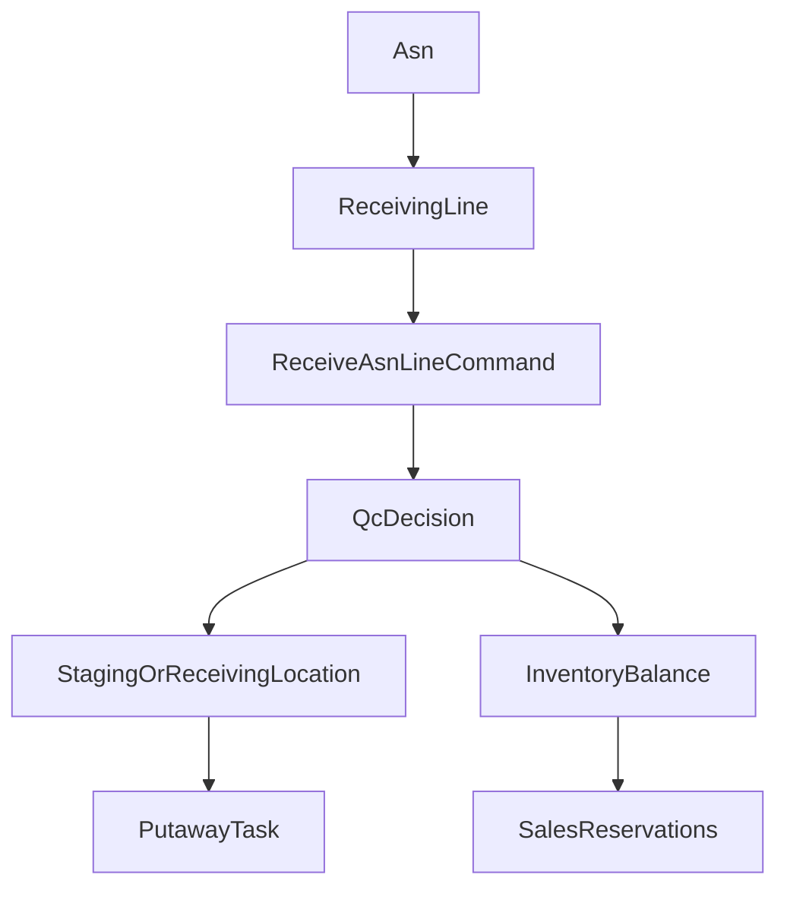

# WMS Phase 2 Specification — Inbound and Putaway

| Field | Value |
|-------|-------|
| **Status** | Draft |
| **Author** | Cursor Agent |
| **Created** | 2026-04-15 |
| **Related** | 2026-04-15-wms-roadmap, 2026-04-15-wms-phase-1-core-inventory, Issue #388 |

## TLDR
**Key Points:**
- Phase 2 adds the first warehouse-execution workflows: ASN intake, receiving, QC-aware acceptance, and directed putaway.
- It turns phase-1 stock models into operational inbound flows without yet introducing outbound pick/pack execution.
- The phase adds the inbound contracts needed for `customers`-based vendor references, `catalog` tracking enforcement, and `sales` reservation re-evaluation after receipts.

**Scope:**
- `Asn`, `ReceivingLine`, `PutawayTask`
- Receiving and putaway commands, APIs, backend UI, and lifecycle events
- Barcode-scan-ready receiving and putaway action endpoints
- Inbound integrations with `catalog`, `customers`, and `sales`

**Concerns:**
- The phase must not treat expected ASN quantity as on-hand stock until receipt acceptance succeeds.
- QC failure, quarantine, and staging behavior must be explicit so that later picking never consumes unapproved goods.

---

## Overview

Phase 2 is where the WMS stops being an inventory database and becomes an execution system. It introduces expected inbound stock through ASNs, records what was physically received, captures QC outcomes, and creates putaway tasks that move accepted inventory from receiving/staging locations into storage locations.

The audience is receiving teams, warehouse supervisors, and implementers building vendor or purchase-order adjacent workflows.

> **Market Reference**: This phase adopts the staged receiving pattern common in Odoo and OpenBoxes: inbound notice -> receipt capture -> quarantine or staging -> putaway into pickable storage. It explicitly rejects direct receipt-to-pickable-stock shortcuts because they hide quality-control and location assignment decisions.

## Problem Statement

Phase 1 knows how much stock exists, but not how stock gets there. Without an inbound workflow:

1. There is no distinction between expected inbound quantity and physically accepted quantity.
2. Lot, serial, and expiration tracking rules cannot be enforced at the moment inventory first enters the system.
3. Warehouse operators cannot route received stock into the correct target locations.
4. Sales reservations remain blind to newly received stock until manual adjustments occur.

This creates traceability gaps and makes future automation unreliable.

## Proposed Solution

Phase 2 introduces a structured inbound pipeline:

1. Create or import an ASN representing expected inbound stock.
2. Receive lines against the ASN into a staging or receiving location.
3. Validate quantities, lot/serial/expiry rules, and QC state.
4. Only accepted quantity updates phase-1 inventory balances.
5. Generate putaway tasks to move accepted stock into storage locations.

### Design Decisions

| Decision | Rationale |
|----------|-----------|
| Keep `Asn` and `ReceivingLine` inside WMS rather than piggybacking on future purchasing modules | Inbound physical execution must exist even before a full procurement module does |
| Treat receipt and putaway as separate operations | Reflects real warehouse staging, QC, and workload management |
| Barcode support is API-first | Keeps scanner/mobile compatibility without blocking the backend workflow |
| QC outcome drives stock state before putaway | Prevents quarantined or failed goods from entering available stock |

### Alternatives Considered

| Alternative | Why Rejected |
|-------------|-------------|
| Directly create stock from ASN expected quantity | Expected quantity is not trustworthy enough to represent physical stock |
| Skip receiving lines and only store an ASN header | Line-level data is required for quantity discrepancies and tracking rules |
| Put away automatically on receipt with no task record | Removes operator accountability and blocks later optimization/assignment rules |

## User Stories / Use Cases

- **Receiving clerk** wants to receive an ASN line into a staging location so that stock is recorded only after physical confirmation.
- **QC operator** wants to mark a line as passed or failed so that bad stock does not enter available inventory.
- **Warehouse supervisor** wants the system to generate putaway tasks so that received goods move to correct storage bins.
- **Sales operator** wants newly received stock to re-trigger reservation checks so that backordered demand can become fulfillable.
- **Vendor coordinator** wants inbound records linked to a vendor/company so that receiving history is traceable.

## Architecture



### Commands & Events

Commands introduced in phase 2:
- `createAsn`
- `updateAsn`
- `receiveAsnLine`
- `closeAsn`
- `createPutawayTask`
- `assignPutawayTask`
- `startPutawayTask`
- `completePutawayTask`
- `cancelPutawayTask`

Events emitted in phase 2:
- `wms.asn.created`
- `wms.asn.updated`
- `wms.asn.receiving_started`
- `wms.asn.line_received`
- `wms.asn.received`
- `wms.putaway.created`
- `wms.putaway.assigned`
- `wms.putaway.completed`
- `wms.inventory.receipt_qc_failed`

Events consumed by WMS (subscribers):

| Event | Source Module | WMS Action |
|-------|-------------|------------|
| `procurement.goods_receipt.created` | Procurement | Create ASN or trigger receiving workflow for the referenced goods receipt |

Undo expectations:
- ASN header updates are standard CRUD undo.
- Receipt undo writes inverse movement rows and restores the pre-receipt quantity snapshots.
- Completed putaway undo moves stock back to staging and reopens the task.

## Data Models

All phase-2 entities include the global columns: `id (uuid)`, `created_at`, `updated_at`, `deleted_at`, `tenant_id`, `organization_id`, `metadata (jsonb)`.

### Asn
- `id`: UUID
- `warehouse_id`: UUID
- `vendor_id`: UUID nullable
- `status`: `draft | in_transit | received | closed`
- `expected_at`: timestamp
- `reference_number`: string nullable
- `notes`: string nullable

Indexes required:
- `(organization_id, warehouse_id, status, expected_at)`
- `(organization_id, vendor_id, expected_at desc)`

### ReceivingLine
- `id`: UUID
- `asn_id`: UUID
- `catalog_variant_id`: UUID
- `expected_qty`: numeric
- `received_qty`: numeric
- `lot_number`: string nullable
- `serial_numbers`: jsonb array
- `qc_status`: `pending | passed | failed`
- `target_staging_location_id`: UUID nullable
- `rejection_reason`: string nullable

Indexes required:
- `(organization_id, asn_id)`
- `(organization_id, catalog_variant_id, qc_status)`

### PutawayTask
- `id`: UUID
- `warehouse_id`: UUID
- `source_location_id`: UUID
- `target_location_id`: UUID
- `catalog_variant_id`: UUID
- `lot_id`: UUID nullable
- `quantity`: numeric
- `status`: `open | in_progress | done | cancelled`
- `assigned_to`: UUID nullable
- `priority`: numeric default 5

Indexes required:
- `(organization_id, warehouse_id, status, priority)`
- `(organization_id, assigned_to, status)`

### Validation Rules

All validators live in `data/validators.ts`:

- `asnCreateSchema`: `warehouse_id` required, `expected_at` required, `vendor_id` must reference valid customers record when provided
- `receivingLineSchema`: `catalog_variant_id` required, `expected_qty` positive; if `ProductInventoryProfile.track_lot = true`, lot number is required; if `track_serial = true`, serial count must match received quantity; if `track_expiration = true`, expiry-related dates must satisfy lot date ordering (`expires_at >= best_before_at >= manufactured_at`)

### ACL Features (Phase 2 additions)

- `wms.manage_asn` — create/edit ASNs
- `wms.receive_inventory` — receive ASN lines and perform QC actions
- `wms.manage_putaway` — create/assign/complete putaway tasks

### Data Integrity Rules

1. `ReceivingLine.received_qty` may be lower or higher than `expected_qty`, but over-receipts must be explicit.
2. Passed quantity updates `InventoryMovement` and `InventoryBalance`.
3. Failed quantity creates a receipt/QC audit trail but does not increase available stock.
4. Putaway moves stock between staging and storage locations through explicit movement rows.
5. A location marked `type = staging` or `type = dock` may hold inbound stock, but later phases must not treat that stock as pick-preferred unless configured.

## API Contracts

### CRUD Resources

Collection routes:
- `GET|POST /api/wms/asns`
- `GET|POST /api/wms/receiving-lines`
- `GET|POST /api/wms/putaway-tasks`

Member routes:
- `GET|PUT|DELETE /api/wms/asns/:id`
- `GET|PUT|DELETE /api/wms/receiving-lines/:id`
- `GET|PUT|DELETE /api/wms/putaway-tasks/:id`

### Custom Action Endpoints

#### Receive ASN line
- `POST /api/wms/asns/:id/receive`
- Request:
```json
{
  "lineId": "uuid",
  "receivedQty": "10",
  "targetStagingLocationId": "uuid",
  "lotNumber": "LOT-2026-04",
  "serialNumbers": [],
  "qcStatus": "passed"
}
```
- Response:
```json
{
  "ok": true,
  "movementIds": ["uuid"],
  "putawayTaskIds": ["uuid"]
}
```
- Errors: `409 invalid_receipt_state`, `422 tracking_required`, `422 invalid_qc_transition`

#### Complete ASN
- `POST /api/wms/asns/:id/complete`
- Request: `{ "closeWhenShort": true }`
- Response: `{ "ok": true, "status": "received" }`

#### Create putaway task manually
- `POST /api/wms/putaway-tasks/create-from-balance`
- Request: `{ "warehouseId": "uuid", "sourceLocationId": "uuid", "targetLocationId": "uuid", "catalogVariantId": "uuid", "quantity": "5" }`
- Response: `{ "ok": true, "taskId": "uuid" }`

#### Complete putaway
- `POST /api/wms/putaway-tasks/:id/complete`
- Request: `{ "confirmedQuantity": "5", "targetLocationId": "uuid" }`
- Response: `{ "ok": true, "movementId": "uuid" }`

### Barcode-Scan-Ready Endpoints

Phase 2 standardizes action endpoints that accept scanned values without requiring a browser-specific session format:

- `POST /api/wms/scan/resolve-location`
- `POST /api/wms/scan/resolve-lot`
- `POST /api/wms/scan/receive`
- `POST /api/wms/scan/putaway`

These routes:
- validate payloads with zod
- return canonical IDs plus human-readable labels
- remain UI-agnostic for future mobile clients

## Cross-Module Integration Contracts

### Catalog

Receiving must enforce phase-1 inventory-profile rules:
- if `track_lot = true`, receiving requires a lot number or generated lot
- if `track_serial = true`, serial counts must match received quantity
- if `track_expiration = true`, expiry-related fields must satisfy profile rules
- `default_uom` governs quantity interpretation and future UoM conversions

### Customers

`vendor_id` references a company/person record in `customers` by UUID only. WMS does not own supplier master data.

Vendor data used in UI should be snapshot or enrichment-based:
- vendor name for ASN list/detail views
- contact references for receiving issues

### Sales

Phase 2 does not yet create picks, but it does affect sales demand:

- when receipt acceptance increases available stock, WMS emits events that sales-reservation orchestration can consume
- `wms.asn.line_received` and `wms.putaway.completed` may trigger reservation re-evaluation for waiting orders
- sales detail enrichers may show inbound ETA or recently received status via `_wms.inboundSummary`

Example additive sales payload fragment:
```json
{
  "_wms": {
    "inboundSummary": {
      "openAsnCount": 2,
      "nextExpectedAt": "2026-04-18T12:00:00.000Z"
    }
  }
}
```

Out of scope for phase 2:
- purchase-order ownership
- carrier appointment scheduling
- outbound picking or shipment creation

## Internationalization (i18n)

Required key families:
- `wms.asns.*`
- `wms.receiving.*`
- `wms.putaway.*`
- `wms.scan.*`
- `wms.errors.invalidReceiptState`
- `wms.errors.trackingRequired`
- `wms.errors.invalidQcTransition`
- `wms.widgets.sales.inboundSummary.*`

## UI/UX

Backend pages introduced in phase 2:
- `/backend/wms/asns`
- `/backend/wms/asns/[id]`
- `/backend/wms/receiving`
- `/backend/wms/putaway`

UX expectations:
- receiving detail page groups ASN header, expected lines, discrepancy state, and receipt actions
- putaway queue page prioritizes open tasks, assignee, source, target, and aging
- scanner-ready actions can be triggered from normal backend forms now and mobile workflows later
- QC-failed lines must show inline `Alert` state and must not silently disappear

## Migration & Compatibility

- Phase 2 adds new tables and routes without altering phase-1 contract surfaces.
- `InventoryMovement.type = receipt | putaway` becomes active in this phase, but remains additive to the enum space already reserved by the roadmap.
- Existing phase-1 balance and reservation APIs remain stable; inbound writes only increase their producer set.
- Sales-facing `_wms.*` enrichments remain additive.

## Implementation Plan

### Story 1: ASN and receiving models
1. Add `Asn` and `ReceivingLine` entities plus validators and CRUD APIs.
2. Build receipt action routes and movement generation.
3. Support discrepancy handling and close/received transitions.

### Story 2: Putaway engine
1. Add `PutawayTask` entity and lifecycle commands.
2. Generate tasks automatically for accepted staged stock.
3. Complete putaway through explicit movement rows.

### Story 3: Backend receiving UI
1. Add ASN list/detail pages.
2. Add receiving work queue and line-action UX.
3. Add putaway queue and task-completion UX.

### Story 4: Cross-module handoffs
1. Enforce catalog inventory-profile constraints during receipt.
2. Resolve vendor references through `customers`.
3. Emit inbound events and add optional sales inbound enrichments.

### Testing Strategy

### Integration Coverage

| ID | Type | Scenario | Primary assertions |
|----|------|----------|--------------------|
| WMS-P2-INT-01 | API | Create ASN with vendor reference and expected lines | ASN and lines persist with correct status and vendor linkage |
| WMS-P2-INT-02 | API | Receive line with QC pass into staging | receipt movement created, accepted quantity updates balance, putaway task generated |
| WMS-P2-INT-03 | API | Receive line with QC fail | receipt audit trail persists, available stock does not increase |
| WMS-P2-INT-04 | API | Over-receipt against ASN | discrepancy is recorded explicitly and ASN does not silently normalize expected quantity |
| WMS-P2-INT-05 | API | Complete putaway task | stock moves from staging to target location via explicit movement row |
| WMS-P2-INT-06 | API | Scan endpoint resolves location/lot and supports receive flow | canonical IDs returned and scan action remains UI-agnostic |
| WMS-P2-INT-07 | API | Sales reservation re-evaluation after accepted receipt | receipt/putaway event path makes previously waiting order eligible for reservation |
| WMS-P2-INT-08 | UI | Receive ASN and complete putaway from backend queues | receiving and putaway pages expose correct status transitions and alerts |
| WMS-P2-INT-09 | API/Auth | Deny receipt or putaway action without inbound feature grant | request rejected with no inventory mutation |

### Unit Coverage

- tracking-rule enforcement from `ProductInventoryProfile`
- QC outcome mapping to stock-state behavior
- target-location constraint validation for putaway completion
- ASN closeability logic for short and complete receipts

### Integration Test Notes

- Fixtures must create phase-1 inventory profile and locations first, because phase 2 builds on those contracts.
- The sales re-evaluation test should assert event-driven or subscriber-driven effect, not direct inline mutation of sales documents.
- QC-fail tests must assert that staging/available quantities remain correct even when receipt metadata exists.

## Risks & Impact Review

#### Premature Stock Availability
- **Scenario**: Received quantity is treated as available before QC approval or before the stock reaches a valid staging bucket.
- **Severity**: Critical
- **Affected area**: Availability APIs, sales promise logic, future picking
- **Mitigation**: Receipt logic distinguishes accepted vs failed quantity and writes only accepted quantity into balances; staging location state remains explicit.
- **Residual risk**: Some businesses may want configurable staging availability later; acceptable because the first contract is conservative.

#### Putaway Misrouting
- **Scenario**: A task moves stock to an invalid or capacity-breaching location.
- **Severity**: High
- **Affected area**: Location accuracy, later picks, utilization analytics
- **Mitigation**: Validate target location type, active status, and constraints before task completion.
- **Residual risk**: Manual overrides may still allow non-optimal placements; acceptable if they remain auditable.

#### Sales Reservation Lag After Receipt
- **Scenario**: Stock is received, but sales reservations remain stale and do not consume the new availability promptly.
- **Severity**: Medium
- **Affected area**: Order promise accuracy, backorder clearing
- **Mitigation**: Emit inbound lifecycle events and define reservation re-evaluation subscribers/worker hooks.
- **Residual risk**: Re-evaluation may be asynchronous for scale; acceptable if UI communicates eventual update timing.

#### ASN Drift Against External Source
- **Scenario**: Vendor changes expected quantities after ASN creation and operators receive against outdated expectations.
- **Severity**: Medium
- **Affected area**: Receiving discrepancy handling, vendor trust, analytics
- **Mitigation**: Keep ASN status transitions explicit and allow over/short receipts with discrepancy audit trails rather than forcing silent sync.
- **Residual risk**: External procurement sync may still lag; acceptable because receiving remains grounded in physical reality.

## Final Compliance Report — 2026-04-15

### AGENTS.md Files Reviewed
- `AGENTS.md`
- `.ai/specs/AGENTS.md`
- `packages/core/AGENTS.md`
- `packages/core/src/modules/sales/AGENTS.md`

### Compliance Matrix

| Rule Source | Rule | Status | Notes |
|-------------|------|--------|-------|
| root AGENTS.md | No direct ORM relationships between modules | Compliant | Vendor and sales links are UUID references only |
| root AGENTS.md | Validate all inputs with zod | Compliant | Receipt, scan, and putaway endpoints require validators |
| root AGENTS.md | Use command pattern for writes | Compliant | Receipt and putaway workflows are command-based |
| root AGENTS.md | Keep page size at or below 100 | Compliant | All list APIs retain the WMS max page size contract |
| packages/core/AGENTS.md | API routes MUST export `openApi` | Compliant | CRUD and action routes require `openApi` |
| packages/core/AGENTS.md | Workers for heavy processing | Compliant | Reservation re-evaluation may move to workers as scale grows |
| packages/core/src/modules/sales/AGENTS.md | Sales owns shipments and returns | Compliant | Phase 2 limits integration to reservation re-evaluation and enrichments |

### Internal Consistency Check

| Check | Status | Notes |
|-------|--------|-------|
| Data models match API contracts | Pass | ASN, receiving, and putaway APIs map directly to entities |
| API contracts match UI/UX section | Pass | Receiving and putaway pages reflect the route families |
| Risks cover all write operations | Pass | Receipt, QC, putaway, and sync lag covered |
| Commands defined for all mutations | Pass | Every inbound state change has a command |
| Cache strategy covers all read APIs | Pass | Additive `_wms.*` projections remain cache-safe and invalidatable |

### Non-Compliant Items

None.

### Verdict

- **Fully compliant**: Approved — ready for implementation

## Changelog

### 2026-04-15 (rev 3)
- Added explicit global entity columns note for phase-2 models to match roadmap guarantees
- Expanded CRUD API section into explicit `collection` vs `member` routes

### 2026-04-15 (rev 2)
- Added consumed event: `procurement.goods_receipt.created`
- Added explicit validation rules for ASN and receiving lines (tracking enforcement)
- Added ACL features: `wms.manage_asn`, `wms.receive_inventory`, `wms.manage_putaway`

### 2026-04-15
- Initial phase-2 specification for WMS inbound receiving and putaway

### Review — 2026-04-15
- **Reviewer**: Agent
- **Security**: Passed
- **Performance**: Passed
- **Cache**: Passed
- **Commands**: Passed
- **Risks**: Passed
- **Verdict**: Approved
