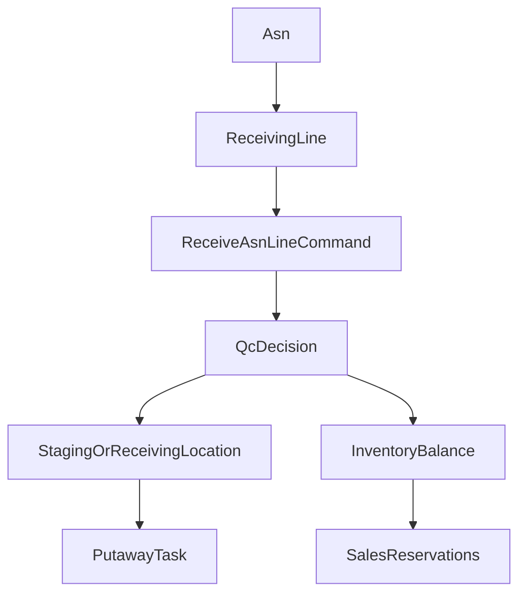

# WMS Phase 2 Specification — Inbound and Putaway

| Field | Value |
|-------|-------|
| **Status** | Draft (rev 4 — pre-implement remediations applied 2026-08-12) |
| **Author** | Cursor Agent |
| **Created** | 2026-04-15 |
| **Related** | 2026-04-15-wms-roadmap, 2026-04-15-wms-phase-1-core-inventory, Issue #388, ANALYSIS-2026-08-12-wms-phase-2-inbound-putaway |

## TLDR
**Key Points:**
- Phase 2 adds the first warehouse-execution workflows: ASN intake, receiving, QC-aware acceptance, and directed putaway tasks.
- It turns phase-1 stock models into operational inbound flows without yet introducing outbound pick/pack execution.
- Phase 1 already shipped ad-hoc `wms.inventory.receive`, move-typed `putaway`, `wms.receive_inventory` ACL, and sales reservation automation — Phase 2 is **additive** and must coexist with those surfaces.
- Inbound integrations use `customers` vendor UUID refs, `catalog` tracking enforcement (already used by ad-hoc receive), and sales re-evaluation via existing automation hooks.

**Scope:**
- `Asn`, `ReceivingLine`, `PutawayTask`
- Receiving and putaway commands, APIs, backend UI, and lifecycle events
- Barcode-scan-ready receiving and putaway action endpoints
- Inbound integrations with `catalog`, `customers`, and `sales`
- Net-new ACL: `wms.manage_asn`, `wms.manage_putaway` (extend existing `wms.receive_inventory`)

**Concerns:**
- The phase must not treat expected ASN quantity as on-hand stock until QC-accepted receipt succeeds.
- QC failure must not increase available balances or spawn putaway tasks.
- Dual paths (ad-hoc receive vs ASN receive; manual move-putaway vs `PutawayTask`) must stay consistent at the ledger layer.

---

## Overview

Phase 2 is where the WMS stops being an inventory database and becomes an execution system. It introduces expected inbound stock through ASNs, records what was physically received, captures QC outcomes, and creates putaway tasks that move accepted inventory from receiving/staging locations into storage locations.

The audience is receiving teams, warehouse supervisors, and implementers building vendor or purchase-order adjacent workflows.

> **Market Reference**: This phase adopts the staged receiving pattern common in Odoo and OpenBoxes: inbound notice -> receipt capture -> quarantine or staging -> putaway into pickable storage. It explicitly rejects direct receipt-to-pickable-stock shortcuts because they hide quality-control and location assignment decisions.

## Problem Statement

Phase 1 delivers a durable inventory core (topology, ledger, balances, reservations) plus **ad-hoc** receive/move shortcuts. It still lacks a structured inbound execution pipeline:

1. There is no distinction between **expected** inbound quantity (ASN) and **physically accepted** quantity (receiving lines + QC).
2. Operators cannot run QC-gated intake that keeps failed goods out of available stock while preserving an audit trail.
3. There is no putaway **task queue** — only a manual move labeled `putaway`, with no assignment, aging, or directed completion workflow.
4. Sales can already auto-reserve / re-run reservations, but nothing ties those hooks to ASN/putaway lifecycle events or inbound ETA projections (`_wms.inboundSummary`).

Without Phase 2, inbound remains operator folklore on top of adjust/receive dialogs, and later pick/pack phases have no staging/QC contract to trust.

## Proposed Solution

Phase 2 introduces a structured inbound pipeline:

1. Create or import an ASN representing expected inbound stock.
2. Receive lines against the ASN into a staging or receiving location.
3. Validate quantities, lot/serial/expiry rules, and QC state.
4. Only accepted quantity updates phase-1 inventory balances.
5. Generate putaway tasks to move accepted stock into storage locations.

### Design Decisions

| Decision | Rationale |
|----------|-----------|
| Keep `Asn` and `ReceivingLine` inside WMS rather than piggybacking on future purchasing modules | Inbound physical execution must exist even before a full procurement module does |
| Treat receipt and putaway as separate operations | Reflects real warehouse staging, QC, and workload management |
| Barcode support is API-first | Keeps scanner/mobile compatibility without blocking the backend workflow |
| QC outcome drives stock state before putaway | Prevents failed goods from entering available stock |
| Keep Phase 1 ad-hoc receive + manual move-`putaway` | Avoid breaking shipped APIs/UI; ASN/`PutawayTask` are the structured paths |
| Reuse Phase 1 ledger helpers for stock writes | One balance/idempotency model; ASN commands compose rather than fork the ledger |
| Inventory stock mutations stay `isUndoable: false` | Matches Phase 1 append-only ledger policy; reverse via explicit counter-actions |

### Phase 1 coexistence (as of 2026-08 / `develop`)

| Existing Phase 1 surface | Phase 2 rule |
|--------------------------|--------------|
| `POST /api/wms/inventory/receive` + `wms.inventory.receive` | **Keep.** Ad-hoc / no-ASN receive into a location. Continues to emit `wms.inventory.received`. |
| `POST /api/wms/inventory/move` with `type: putaway` + Move dialog | **Keep.** Manual bin-to-bin putaway shortcut without a task record. |
| ACL `wms.receive_inventory` | **Keep and extend** to ASN line receive + QC actions (already on operator/supervisor). |
| Sales auto-reserve / `re-run-reservation` | **Reuse.** ASN/putaway subscribers call existing automation when sales integration toggle is on. |
| Toggle `wms_integration_procurement_goods_receipt` (default `false`) | **Gate** optional `procurement.goods_receipt.created` subscriber; no-op when disabled or module absent. |

ASN receive (`receiveAsnLine`) MUST share the same tracking enforcement and movement/balance write patterns as ad-hoc receive (via shared helpers), but MUST NOT remove or rename the ad-hoc command/route.

### Alternatives Considered

| Alternative | Why Rejected |
|-------------|-------------|
| Directly create stock from ASN expected quantity | Expected quantity is not trustworthy enough to represent physical stock |
| Skip receiving lines and only store an ASN header | Line-level data is required for quantity discrepancies and tracking rules |
| Put away automatically on receipt with no task record | Removes operator accountability and blocks later optimization/assignment rules |

## User Stories / Use Cases

- **Receiving clerk** wants to receive an ASN line into a staging location so that stock is recorded only after physical confirmation.
- **QC operator** wants to mark a line as passed or failed so that bad stock does not enter available inventory.
- **Warehouse supervisor** wants the system to generate putaway tasks so that received goods move to correct storage bins.
- **Sales operator** wants newly received stock to re-trigger reservation checks so that backordered demand can become fulfillable.
- **Vendor coordinator** wants inbound records linked to a vendor/company so that receiving history is traceable.

## Architecture


```mermaid
flowchart TD
    asn[Asn]
    lines[ReceivingLine]
    receive[ReceiveAsnLineCommand]
    qc[QcDecision]
    stage[StagingOrReceivingLocation]
    putaway[PutawayTask]
    balances[InventoryBalance]
    sales[SalesReservations]

    asn --> lines
    lines --> receive
    receive --> qc
    qc --> stage
    qc --> balances
    stage --> putaway
    balances --> sales
```

### Commands & Events

Commands introduced in phase 2:
- `createAsn`
- `updateAsn`
- `receiveAsnLine`
- `closeAsn`
- `createPutawayTask`
- `assignPutawayTask`
- `startPutawayTask`
- `completePutawayTask`
- `cancelPutawayTask`

Events emitted in phase 2:
- `wms.asn.created`
- `wms.asn.updated`
- `wms.asn.receiving_started`
- `wms.asn.line_received`
- `wms.asn.received`
- `wms.putaway.created`
- `wms.putaway.assigned`
- `wms.putaway.completed`
- `wms.inventory.receipt_qc_failed`

Events consumed by WMS (subscribers):

| Event | Source Module | Gate | WMS Action |
|-------|---------------|------|------------|
| `procurement.goods_receipt.created` | Procurement (optional) | `wms_integration_procurement_goods_receipt` (default false) | Create/update draft ASN when enabled; otherwise no-op |

Undo expectations (aligned with Phase 1 inventory mutation policy):
- ASN header / line metadata CRUD may use standard command undo when no stock ledger rows were written.
- Stock-affecting commands (`receiveAsnLine` with QC pass, `completePutawayTask`) are **`isUndoable: false`**.
- Reversal is an explicit counter-action (e.g. adjust/move back to staging, cancel remaining putaway qty) with full audit via `buildLog` / movements — same rationale as Phase 1 `inventory-actions.ts` undo policy comment.
- Do **not** implement generic undo that rewrites historical ledger rows.

## Data Models

All phase-2 entities include the global columns: `id (uuid)`, `created_at`, `updated_at`, `deleted_at`, `tenant_id`, `organization_id`, `metadata (jsonb)`.

### Asn
- `id`: UUID
- `warehouse_id`: UUID
- `vendor_id`: UUID nullable
- `status`: `draft | in_transit | received | closed`
- `expected_at`: timestamp
- `reference_number`: string nullable
- `notes`: string nullable

Indexes required:
- `(organization_id, warehouse_id, status, expected_at)`
- `(organization_id, vendor_id, expected_at desc)`

### ReceivingLine
- `id`: UUID
- `asn_id`: UUID
- `catalog_variant_id`: UUID
- `expected_qty`: numeric
- `received_qty`: numeric
- `lot_number`: string nullable
- `serial_numbers`: jsonb array
- `qc_status`: `pending | passed | failed`
- `target_staging_location_id`: UUID nullable
- `rejection_reason`: string nullable

Indexes required:
- `(organization_id, asn_id)`
- `(organization_id, catalog_variant_id, qc_status)`

### PutawayTask
- `id`: UUID
- `warehouse_id`: UUID
- `source_location_id`: UUID
- `target_location_id`: UUID
- `catalog_variant_id`: UUID
- `lot_id`: UUID nullable
- `quantity`: numeric
- `status`: `open | in_progress | done | cancelled`
- `assigned_to`: UUID nullable
- `priority`: numeric default 5

Indexes required:
- `(organization_id, warehouse_id, status, priority)`
- `(organization_id, assigned_to, status)`

### Validation Rules

All validators live in `data/validators.ts`:

- `asnCreateSchema`: `warehouse_id` required, `expected_at` required, `vendor_id` must reference valid customers record when provided
- `receivingLineSchema`: `catalog_variant_id` required, `expected_qty` positive; if `ProductInventoryProfile.track_lot = true`, lot number is required; if `track_serial = true`, serial count must match received quantity; if `track_expiration = true`, expiry-related dates must satisfy lot date ordering (`expires_at >= best_before_at >= manufactured_at`)

### ACL Features

| Feature | Status | Purpose | Default roles |
|---------|--------|---------|---------------|
| `wms.receive_inventory` | **Already shipped (Phase 1)** | Ad-hoc receive + ASN line receive + QC actions | `operator`, `supervisor`, `admin` (`wms.*`) |
| `wms.manage_asn` | **Net-new Phase 2** | Create/edit/close ASNs and receiving lines (master inbound docs) | `supervisor` (+ `admin`) |
| `wms.manage_putaway` | **Net-new Phase 2** | Assign/start/complete/cancel putaway tasks; manual create-from-balance | `supervisor` (+ `admin`); operators may complete assigned tasks if granted |

Mirror new IDs in `setup.ts` / `lib/roleFeatures.ts` and run `yarn mercato auth sync-role-acls` for existing tenants.

### Optimistic locking

`Asn`, `ReceivingLine`, and `PutawayTask` include `updated_at`. List/detail APIs return `updatedAt`. `CrudForm` pages auto-derive lock headers. Custom action endpoints that mutate these aggregates MUST enforce command-level optimistic lock on the parent ASN or task (same pattern as other WMS/command endpoints).

### Data Integrity Rules

1. `ReceivingLine.received_qty` may be lower or higher than `expected_qty`, but over-receipts must be explicit.
2. **QC `passed` only:** write `InventoryMovement` (`type: receipt`) + update `InventoryBalance` at the staging/dock location; then auto-create an open `PutawayTask` (MVP: target may be null until complete confirms it).
3. **QC `failed`:** persist line QC state + emit `wms.inventory.receipt_qc_failed`; **do not** increase available balances; **do not** create putaway tasks. Dedicated quarantine location routing is **deferred**.
4. Putaway completion moves stock staging → storage via explicit `InventoryMovement` (`type: putaway`).
5. Locations with `type = staging` or `type = dock` may hold inbound stock; later phases must not treat that stock as pick-preferred unless configured.
6. Directed putaway **rules** (fixed/dynamic slotting from #388) are **out of MVP** — operators confirm `targetLocationId` on complete; rules engine is a follow-up.

## API Contracts

### CRUD Resources

Collection routes:
- `GET|POST /api/wms/asns`
- `GET|POST /api/wms/receiving-lines`
- `GET|POST /api/wms/putaway-tasks`

Member routes:
- `GET|PUT|DELETE /api/wms/asns/:id`
- `GET|PUT|DELETE /api/wms/receiving-lines/:id`
- `GET|PUT|DELETE /api/wms/putaway-tasks/:id`

### Custom Action Endpoints

#### Receive ASN line
- `POST /api/wms/asns/:id/receive`
- Request:
```json
{
  "lineId": "uuid",
  "receivedQty": "10",
  "targetStagingLocationId": "uuid",
  "lotNumber": "LOT-2026-04",
  "serialNumbers": [],
  "qcStatus": "passed"
}
```
- Response:
```json
{
  "ok": true,
  "movementIds": ["uuid"],
  "putawayTaskIds": ["uuid"]
}
```
- Errors: `409 invalid_receipt_state`, `422 tracking_required`, `422 invalid_qc_transition`

#### Complete ASN
- `POST /api/wms/asns/:id/complete`
- Request: `{ "closeWhenShort": true }`
- Response: `{ "ok": true, "status": "received" }`

#### Create putaway task manually
- `POST /api/wms/putaway-tasks/create-from-balance`
- Request: `{ "warehouseId": "uuid", "sourceLocationId": "uuid", "targetLocationId": "uuid", "catalogVariantId": "uuid", "quantity": "5" }`
- Response: `{ "ok": true, "taskId": "uuid" }`

#### Complete putaway
- `POST /api/wms/putaway-tasks/:id/complete`
- Request: `{ "confirmedQuantity": "5", "targetLocationId": "uuid" }`
- Response: `{ "ok": true, "movementId": "uuid" }`

### Barcode-Scan-Ready Endpoints

Phase 2 standardizes action endpoints that accept scanned values without requiring a browser-specific session format. Minimal contracts (Story 1–2):

#### `POST /api/wms/scan/resolve-location`
- Request: `{ "warehouseId": "uuid", "code": "string" }` (+ scope)
- Response: `{ "ok": true, "locationId": "uuid", "code": "string", "type": "staging|dock|bin|…" }`
- Errors: `404 not_found`

#### `POST /api/wms/scan/resolve-lot`
- Request: `{ "catalogVariantId": "uuid", "lotNumber": "string" }` (+ scope)
- Response: `{ "ok": true, "lotId": "uuid", "lotNumber": "string", "expiresAt": "date|null" }`
- Errors: `404 not_found`

#### `POST /api/wms/scan/receive`
- Request: ASN receive fields plus scanned codes resolved server-side (`asnId`, `lineId`, `locationCode`, `lotNumber`, `receivedQty`, `qcStatus`)
- Behavior: resolve → same command path as `POST /api/wms/asns/:id/receive`
- Response: same as ASN receive (`movementIds`, `putawayTaskIds`)

#### `POST /api/wms/scan/putaway`
- Request: `{ "taskId": "uuid", "targetLocationCode": "string", "confirmedQuantity": "string" }`
- Behavior: resolve location → `completePutawayTask`
- Response: `{ "ok": true, "movementId": "uuid" }`

These routes validate with zod, return canonical IDs plus labels, remain UI-agnostic for future mobile clients, and use the same ACL as the non-scan action they wrap.

## Cross-Module Integration Contracts

### Catalog

Receiving must enforce phase-1 inventory-profile rules:
- if `track_lot = true`, receiving requires a lot number or generated lot
- if `track_serial = true`, serial counts must match received quantity
- if `track_expiration = true`, expiry-related fields must satisfy profile rules
- `default_uom` governs quantity interpretation and future UoM conversions

### Customers

`vendor_id` references a company/person record in `customers` by UUID only. WMS does not own supplier master data.

Vendor data used in UI should be snapshot or enrichment-based:
- vendor name for ASN list/detail views
- contact references for receiving issues

### Sales

Phase 2 does not create picks, but it feeds sales demand orchestration already present in Phase 1:

- On QC-pass receipt that increases available stock, emit `wms.asn.line_received` (and **also** emit `wms.inventory.received` so existing listeners stay consistent — dual-emit is intentional and additive).
- Subscribers on `wms.asn.line_received` and `wms.putaway.completed` SHOULD invoke the existing sales-order inventory automation / re-run reservation path when `wms_integration_sales_order_inventory` is enabled.
- Sales detail enrichers MAY add additive `_wms.inboundSummary` (open ASN count, next expected ETA).

Example additive sales payload fragment:
```json
{
  "_wms": {
    "inboundSummary": {
      "openAsnCount": 2,
      "nextExpectedAt": "2026-04-18T12:00:00.000Z"
    }
  }
}
```

### Procurement (optional)

| Event | Gate | Behavior |
|-------|------|----------|
| `procurement.goods_receipt.created` | `wms_integration_procurement_goods_receipt` (default **false**) | When enabled and procurement module is present, create/update a draft ASN from the goods receipt reference. When toggle off or module absent, subscriber **no-ops** (`tryResolve` / early return). |

Do not hard-require procurement in WMS module load.

Out of scope for phase 2:
- purchase-order ownership
- carrier appointment scheduling
- outbound picking or shipment creation
- directed putaway slotting rules engine
- quarantine location automation beyond QC-fail audit

## Internationalization (i18n)

Required key families:
- `wms.asns.*`
- `wms.receiving.*`
- `wms.putaway.*`
- `wms.scan.*`
- `wms.errors.invalidReceiptState`
- `wms.errors.trackingRequired`
- `wms.errors.invalidQcTransition`
- `wms.widgets.sales.inboundSummary.*`

## UI/UX

Backend pages introduced in phase 2:
- `/backend/wms/asns` — ASN list
- `/backend/wms/asns/[id]` — ASN detail = **primary** receiving console (lines, QC, discrepancies, receive actions)
- `/backend/wms/receiving` — optional work queue filtering open/in-progress ASNs (may MVP as redirect/filter on ASN list)
- `/backend/wms/putaway` — putaway task queue

UX expectations:
- ASN detail groups header, expected lines, discrepancy state, and receipt actions (`Cmd/Ctrl+Enter` / `Escape` on dialogs)
- Putaway queue prioritizes open tasks, assignee, source, target, and aging
- Scanner-ready actions can be triggered from backend forms now and mobile workflows later
- QC-failed lines show inline `Alert` / status tokens and must not silently disappear
- Keep Phase 1 **Receive inventory** dialog available for ad-hoc (no ASN) intake; label ASN flow distinctly
- Manual Move “put away” remains available alongside the putaway task queue

## Migration & Compatibility

- Phase 2 adds new tables and routes **without** altering Phase 1 contract surfaces.
- MUST NOT remove or rename: `POST /api/wms/inventory/receive`, `wms.inventory.receive`, `wms.inventory.received`, move-with-`putaway`, or `wms.receive_inventory`.
- `InventoryMovement.type = receipt | putaway` already exist in Phase 1 enum space; ASN/putaway commands reuse them.
- Existing Phase 1 balance and reservation APIs remain stable; inbound writes only increase their producer set.
- Sales-facing `_wms.*` enrichments remain additive (`inboundSummary` optional).
- Net-new ACL IDs (`wms.manage_asn`, `wms.manage_putaway`) are additive; sync via `auth sync-role-acls`.
- New editable entities require `updated_at` / optimistic-lock headers per platform default.
- Search/indexer: register ASN (and putaway tasks as needed) in `search.ts` with `checksumSource`.
- Custom write routes follow existing WMS pattern (`executeWmsCustomPostRoute` / command bus + mutation guards).

## Implementation Plan

### Story 1: ASN and receiving models
1. Add `Asn` and `ReceivingLine` entities (+ migration), validators, CRUD APIs, search, ACL `wms.manage_asn`.
2. Implement `receiveAsnLine` / complete ASN using shared ledger helpers with ad-hoc receive; dual-emit `wms.asn.line_received` + `wms.inventory.received` on QC pass.
3. Support discrepancy handling, QC fail (no stock / no putaway), and close/received transitions.
4. Cover WMS-P2-INT-01…04 and INT-09 (receive feature).

### Story 2: Putaway engine
1. Add `PutawayTask` entity + lifecycle commands + ACL `wms.manage_putaway`.
2. Auto-create open tasks after QC-pass receive; complete via putaway movement.
3. Keep manual move-`putaway` shortcut intact.
4. Cover WMS-P2-INT-05 and putaway auth cases.

### Story 3: Backend receiving UI
1. ASN list/detail as primary receiving console.
2. Putaway queue + task completion UX (dialogs with keyboard shortcuts).
3. Optional receiving queue page or ASN list filters.
4. Cover WMS-P2-INT-08.

### Story 4: Cross-module handoffs
1. Catalog tracking already enforced via shared helpers — verify on ASN path.
2. Vendor UUID resolution via `customers` (enrichment/snapshot for display).
3. Wire ASN/putaway events into existing sales reservation automation; add `_wms.inboundSummary`.
4. Optional procurement subscriber behind `wms_integration_procurement_goods_receipt`.
5. Cover WMS-P2-INT-06…07.

### Testing Strategy

### Integration Coverage

| ID | Type | Scenario | Primary assertions |
|----|------|----------|--------------------|
| WMS-P2-INT-01 | API | Create ASN with vendor reference and expected lines | ASN and lines persist with correct status and vendor linkage |
| WMS-P2-INT-02 | API | Receive line with QC pass into staging | receipt movement created, accepted quantity updates balance, putaway task generated |
| WMS-P2-INT-03 | API | Receive line with QC fail | receipt audit trail persists, available stock does not increase |
| WMS-P2-INT-04 | API | Over-receipt against ASN | discrepancy is recorded explicitly and ASN does not silently normalize expected quantity |
| WMS-P2-INT-05 | API | Complete putaway task | stock moves from staging to target location via explicit movement row |
| WMS-P2-INT-06 | API | Scan endpoint resolves location/lot and supports receive flow | canonical IDs returned and scan action remains UI-agnostic |
| WMS-P2-INT-07 | API | Sales reservation re-evaluation after accepted receipt | receipt/putaway event path makes previously waiting order eligible for reservation |
| WMS-P2-INT-08 | UI | Receive ASN and complete putaway from backend queues | receiving and putaway pages expose correct status transitions and alerts |
| WMS-P2-INT-09 | API/Auth | Deny receipt or putaway action without inbound feature grant | request rejected with no inventory mutation |

### Unit Coverage

- tracking-rule enforcement from `ProductInventoryProfile`
- QC outcome mapping to stock-state behavior
- target-location constraint validation for putaway completion
- ASN closeability logic for short and complete receipts

### Integration Test Notes

- Fixtures must create phase-1 inventory profile and locations first, because phase 2 builds on those contracts.
- The sales re-evaluation test should assert event-driven or subscriber-driven effect, not direct inline mutation of sales documents.
- QC-fail tests must assert that staging/available quantities remain correct even when receipt metadata exists.

## Risks & Impact Review

#### Premature Stock Availability
- **Scenario**: Received quantity is treated as available before QC approval or before the stock reaches a valid staging bucket.
- **Severity**: Critical
- **Affected area**: Availability APIs, sales promise logic, future picking
- **Mitigation**: Receipt logic distinguishes accepted vs failed quantity and writes only accepted quantity into balances; staging location state remains explicit.
- **Residual risk**: Some businesses may want configurable staging availability later; acceptable because the first contract is conservative.

#### Putaway Misrouting
- **Scenario**: A task moves stock to an invalid or capacity-breaching location.
- **Severity**: High
- **Affected area**: Location accuracy, later picks, utilization analytics
- **Mitigation**: Validate target location type, active status, and constraints before task completion.
- **Residual risk**: Manual overrides may still allow non-optimal placements; acceptable if they remain auditable.

#### Sales Reservation Lag After Receipt
- **Scenario**: Stock is received, but sales reservations remain stale and do not consume the new availability promptly.
- **Severity**: Medium
- **Affected area**: Order promise accuracy, backorder clearing
- **Mitigation**: Emit inbound lifecycle events and define reservation re-evaluation subscribers/worker hooks.
- **Residual risk**: Re-evaluation may be asynchronous for scale; acceptable if UI communicates eventual update timing.

#### ASN Drift Against External Source
- **Scenario**: Vendor changes expected quantities after ASN creation and operators receive against outdated expectations.
- **Severity**: Medium
- **Affected area**: Receiving discrepancy handling, vendor trust, analytics
- **Mitigation**: Keep ASN status transitions explicit and allow over/short receipts with discrepancy audit trails rather than forcing silent sync.
- **Residual risk**: External procurement sync may still lag; acceptable because receiving remains grounded in physical reality.

## Final Compliance Report — 2026-04-15

### AGENTS.md Files Reviewed
- `AGENTS.md`
- `.ai/specs/AGENTS.md`
- `packages/core/AGENTS.md`
- `packages/core/src/modules/sales/AGENTS.md`

### Compliance Matrix

| Rule Source | Rule | Status | Notes |
|-------------|------|--------|-------|
| root AGENTS.md | No direct ORM relationships between modules | Compliant | Vendor and sales links are UUID references only |
| root AGENTS.md | Validate all inputs with zod | Compliant | Receipt, scan, and putaway endpoints require validators |
| root AGENTS.md | Use command pattern for writes | Compliant | Receipt and putaway workflows are command-based |
| root AGENTS.md | Keep page size at or below 100 | Compliant | All list APIs retain the WMS max page size contract |
| packages/core/AGENTS.md | API routes MUST export `openApi` | Compliant | CRUD and action routes require `openApi` |
| packages/core/AGENTS.md | Workers for heavy processing | Compliant | Reservation re-evaluation may move to workers as scale grows |
| packages/core/src/modules/sales/AGENTS.md | Sales owns shipments and returns | Compliant | Phase 2 limits integration to reservation re-evaluation and enrichments |

### Internal Consistency Check

| Check | Status | Notes |
|-------|--------|-------|
| Data models match API contracts | Pass | ASN, receiving, and putaway APIs map directly to entities |
| API contracts match UI/UX section | Pass | Receiving and putaway pages reflect the route families |
| Risks cover all write operations | Pass | Receipt, QC, putaway, and sync lag covered |
| Commands defined for all mutations | Pass | Every inbound state change has a command |
| Cache strategy covers all read APIs | Pass | Additive `_wms.*` projections remain cache-safe and invalidatable |

### Non-Compliant Items

None.

### Verdict

- **Fully compliant after rev 4 remediations**: Ready to implement Story 1 on `feat/388-wms-phase-2`
- See pre-implement analysis: `.ai/specs/analysis/ANALYSIS-2026-08-12-wms-phase-2-inbound-putaway.md`

## Changelog

### 2026-08-12 (rev 4) — pre-implement remediations
- Reconciled spec with Phase 1 on `develop`: coexistence for ad-hoc `wms.inventory.receive`, move-`putaway`, and existing `wms.receive_inventory` ACL
- Clarified net-new ACL only: `wms.manage_asn`, `wms.manage_putaway`
- Aligned stock-mutation undo with Phase 1 (`isUndoable: false` + counter-actions)
- Specified QC-fail semantics (no balance, no putaway task; quarantine deferred)
- Dual-emit `wms.asn.line_received` + `wms.inventory.received` on QC-pass ASN receive
- Gated procurement subscriber on `wms_integration_procurement_goods_receipt` (default false) + absent-module no-op
- Added minimal scan endpoint request/response contracts
- Wired sales re-eval to existing automation/toggles; documented optimistic lock, search/indexer, mutation-guard expectations
- Softened Problem Statement; expanded Migration & Compatibility and implementation stories
- Analysis: `.ai/specs/analysis/ANALYSIS-2026-08-12-wms-phase-2-inbound-putaway.md`

### 2026-04-15 (rev 3)
- Added explicit global entity columns note for phase-2 models to match roadmap guarantees
- Expanded CRUD API section into explicit `collection` vs `member` routes

### 2026-04-15 (rev 2)
- Added consumed event: `procurement.goods_receipt.created`
- Added explicit validation rules for ASN and receiving lines (tracking enforcement)
- Added ACL features: `wms.manage_asn`, `wms.receive_inventory`, `wms.manage_putaway`

### 2026-04-15
- Initial phase-2 specification for WMS inbound receiving and putaway

### Review — 2026-08-12 (pre-implement)
- **Reviewer**: Agent (om-pre-implement-spec)
- **Verdict**: Remediations applied in rev 4 — **ready to implement Story 1** on `feat/388-wms-phase-2`
- Prior April review remains historical; do not treat pre-rev-4 undo/ACL text as authoritative

### Review — 2026-04-15
- **Reviewer**: Agent
- **Security**: Passed
- **Performance**: Passed
- **Cache**: Passed
- **Commands**: Passed
- **Risks**: Passed
- **Verdict**: Approved (superseded in detail by 2026-08-12 rev 4)
