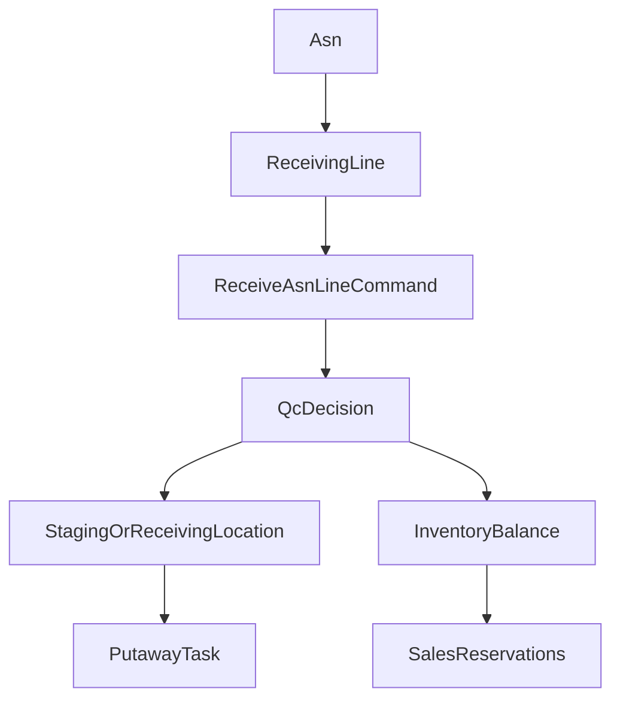

# WMS Phase 2 Specification — Inbound and Putaway

| Field | Value |
|-------|-------|
| **Status** | Ready for Review (rev 43 — OM Medium: QC one-way recovery + vendor lookup fail-closed + template note 2026-08-25) |
| **Author** | Cursor Agent |
| **Created** | 2026-04-15 |
| **Related** | 2026-04-15-wms-roadmap, 2026-04-15-wms-phase-1-core-inventory, Issue #388, ANALYSIS-2026-08-12-wms-phase-2-inbound-putaway |

## TLDR
**Key Points:**
- Phase 2 adds the first warehouse-execution workflows: ASN intake, receiving, QC-aware acceptance, and directed putaway tasks.
- It turns phase-1 stock models into operational inbound flows without yet introducing outbound pick/pack execution.
- Phase 1 already shipped ad-hoc `wms.inventory.receive`, move-typed `putaway`, `wms.receive_inventory` ACL, and sales reservation automation — Phase 2 is **additive** and must coexist with those surfaces.
- Inbound integrations use `customers` vendor UUID refs, `catalog` tracking enforcement (already used by ad-hoc receive), and sales re-evaluation via existing automation hooks.

**Scope:**
- `Asn`, `ReceivingLine`, `PutawayTask`
- Receiving and putaway commands, APIs, backend UI, and lifecycle events
- Barcode-scan-ready receiving and putaway action endpoints
- Inbound integrations with `catalog`, `customers`, and `sales`
- Net-new ACL: `wms.manage_asn`, `wms.manage_putaway` (extend existing `wms.receive_inventory`)

**Concerns:**
- The phase must not treat expected ASN quantity as on-hand stock until QC-accepted receipt succeeds.
- QC failure must not increase available balances or spawn putaway tasks.
- Dual paths (ad-hoc receive vs ASN receive; manual move-putaway vs `PutawayTask`) must stay consistent at the ledger layer.

---

## Overview

Phase 2 is where the WMS stops being an inventory database and becomes an execution system. It introduces expected inbound stock through ASNs, records what was physically received, captures QC outcomes, and creates putaway tasks that move accepted inventory from receiving/staging locations into storage locations.

The audience is receiving teams, warehouse supervisors, and implementers building vendor or purchase-order adjacent workflows.

> **Market Reference**: This phase adopts the staged receiving pattern common in Odoo and OpenBoxes: inbound notice -> receipt capture -> quarantine or staging -> putaway into pickable storage. It explicitly rejects direct receipt-to-pickable-stock shortcuts because they hide quality-control and location assignment decisions.

## Problem Statement

Phase 1 delivers a durable inventory core (topology, ledger, balances, reservations) plus **ad-hoc** receive/move shortcuts. It still lacks a structured inbound execution pipeline:

1. There is no distinction between **expected** inbound quantity (ASN) and **physically accepted** quantity (receiving lines + QC).
2. Operators cannot run QC-gated intake that keeps failed goods out of available stock while preserving an audit trail.
3. There is no putaway **task queue** — only a manual move labeled `putaway`, with no assignment, aging, or directed completion workflow.
4. Sales can already auto-reserve / re-run reservations, but nothing ties those hooks to ASN/putaway lifecycle events or inbound ETA projections (`_wms.inboundSummary`).

Without Phase 2, inbound remains operator folklore on top of adjust/receive dialogs, and later pick/pack phases have no staging/QC contract to trust.

## Proposed Solution

Phase 2 introduces a structured inbound pipeline:

1. Create or import an ASN representing expected inbound stock.
2. Receive lines against the ASN into a staging or receiving location.
3. Validate quantities, lot/serial/expiry rules, and QC state.
4. Only accepted quantity updates phase-1 inventory balances.
5. Generate putaway tasks to move accepted stock into storage locations.

### Design Decisions

| Decision | Rationale |
|----------|-----------|
| Keep `Asn` and `ReceivingLine` inside WMS rather than piggybacking on future purchasing modules | Inbound physical execution must exist even before a full procurement module does |
| Treat receipt and putaway as separate operations | Reflects real warehouse staging, QC, and workload management |
| Barcode support is API-first | Keeps scanner/mobile compatibility without blocking the backend workflow |
| QC outcome drives stock state before putaway | Prevents failed goods from entering available stock |
| Keep Phase 1 ad-hoc receive + manual move-`putaway` | Avoid breaking shipped APIs/UI; ASN/`PutawayTask` are the structured paths |
| Reuse Phase 1 ledger helpers for stock writes | One balance/idempotency model; ASN commands compose rather than fork the ledger |
| Inventory stock mutations stay `isUndoable: false` | Matches Phase 1 append-only ledger policy; reverse via explicit counter-actions |

### Phase 1 coexistence (as of 2026-08 / `develop`)

| Existing Phase 1 surface | Phase 2 rule |
|--------------------------|--------------|
| `POST /api/wms/inventory/receive` + `wms.inventory.receive` | **Keep.** Ad-hoc / no-ASN receive into a location. Continues to emit `wms.inventory.received`. |
| `POST /api/wms/inventory/move` with `type: putaway` + Move dialog | **Keep.** Manual bin-to-bin putaway shortcut without a task record. |
| ACL `wms.receive_inventory` | **Keep and extend** to ASN line receive + QC actions (already on operator/supervisor). |
| Sales auto-reserve / `re-run-reservation` | **Reuse.** ASN/putaway subscribers call existing automation when sales integration toggle is on. |
| Toggle `wms_integration_procurement_goods_receipt` (default `false`) | **Gate** optional `procurement.goods_receipt.created` subscriber; no-op when disabled or module absent. |

ASN receive (`receiveAsnLine`) MUST share the same tracking enforcement and movement/balance write patterns as ad-hoc receive (via shared helpers), but MUST NOT remove or rename the ad-hoc command/route.

### Alternatives Considered

| Alternative | Why Rejected |
|-------------|-------------|
| Directly create stock from ASN expected quantity | Expected quantity is not trustworthy enough to represent physical stock |
| Skip receiving lines and only store an ASN header | Line-level data is required for quantity discrepancies and tracking rules |
| Put away automatically on receipt with no task record | Removes operator accountability and blocks later optimization/assignment rules |

## User Stories / Use Cases

- **Receiving clerk** wants to receive an ASN line into a staging location so that stock is recorded only after physical confirmation.
- **QC operator** wants to mark a line as passed or failed so that bad stock does not enter available inventory.
- **Warehouse supervisor** wants the system to generate putaway tasks so that received goods move to correct storage bins.
- **Sales operator** wants newly received stock to re-trigger reservation checks so that backordered demand can become fulfillable.
- **Vendor coordinator** wants inbound records linked to a vendor/company so that receiving history is traceable.

## Architecture


```mermaid
flowchart TD
    asn[Asn]
    lines[ReceivingLine]
    receive[ReceiveAsnLineCommand]
    qc[QcDecision]
    stage[StagingOrReceivingLocation]
    putaway[PutawayTask]
    balances[InventoryBalance]
    sales[SalesReservations]

    asn --> lines
    lines --> receive
    receive --> qc
    qc --> stage
    qc --> balances
    stage --> putaway
    balances --> sales
```

### Commands & Events

Commands introduced in phase 2:
- `createAsn`
- `updateAsn`
- `receiveAsnLine`
- `closeAsn`
- `createPutawayTask`
- `assignPutawayTask`
- `startPutawayTask`
- `completePutawayTask`
- `cancelPutawayTask`

Events emitted in phase 2:
- `wms.asn.created`
- `wms.asn.updated`
- `wms.asn.receiving_started`
- `wms.asn.line_received`
- `wms.asn.received`
- `wms.putaway.created`
- `wms.putaway.assigned`
- `wms.putaway.completed`
- `wms.inventory.receipt_qc_failed`

Events consumed by WMS (subscribers):

| Event | Source Module | Gate | WMS Action |
|-------|---------------|------|------------|
| `procurement.goods_receipt.created` | Procurement (optional) | `wms_integration_procurement_goods_receipt` (default false) | Create/update draft ASN when enabled; otherwise no-op |

Undo expectations (aligned with Phase 1 inventory mutation policy):
- ASN header / line metadata CRUD may use standard command undo when no stock ledger rows were written.
- Stock-affecting commands (`receiveAsnLine` with QC pass, `completePutawayTask`) are **`isUndoable: false`**.
- Reversal is an explicit counter-action (e.g. adjust/move back to staging, cancel remaining putaway qty) with full audit via `buildLog` / movements — same rationale as Phase 1 `inventory-actions.ts` undo policy comment.
- Do **not** implement generic undo that rewrites historical ledger rows.

## Data Models

All phase-2 entities include the global columns: `id (uuid)`, `created_at`, `updated_at`, `deleted_at`, `tenant_id`, `organization_id`, `metadata (jsonb)`.

### Asn
- `id`: UUID
- `warehouse_id`: UUID
- `vendor_id`: UUID nullable
- `status`: `draft | in_transit | received | closed`
- `expected_at`: timestamp
- `reference_number`: string nullable (display / free-form; not uniqueness-enforced)
- `source_key`: string nullable — stable external linkage key (e.g. `procurement.goods_receipt:{id}`) for find-or-create; unique per org when set. **Server/system only** on create (procurement subscriber / `auth: null` command path); public `POST /api/wms/asns` does not accept client `sourceKey`
- `notes`: string nullable

Indexes required:
- `(organization_id, warehouse_id, status, expected_at)`
- `(organization_id, vendor_id, expected_at desc)`
- unique `(organization_id, source_key)` where `source_key is not null and deleted_at is null`

### ReceivingLine
- `id`: UUID
- `asn_id`: UUID
- `catalog_variant_id`: UUID
- `expected_qty`: numeric
- `received_qty`: numeric
- `lot_number`: string nullable
- `serial_numbers`: jsonb array
- `qc_status`: `pending | passed | failed`
- `target_staging_location_id`: UUID nullable
- `rejection_reason`: string nullable

Indexes required:
- `(organization_id, asn_id)`
- `(organization_id, catalog_variant_id, qc_status)`

### PutawayTask
- `id`: UUID
- `warehouse_id`: UUID
- `source_location_id`: UUID
- `target_location_id`: UUID
- `catalog_variant_id`: UUID
- `lot_id`: UUID nullable
- `quantity`: numeric
- `status`: `open | in_progress | done | cancelled`
- `assigned_to`: UUID nullable
- `priority`: numeric default 5
- `putaway_key`: text nullable — stable ASN-receive attempt key for find-or-create (unique per org when set)

Indexes required:
- `(organization_id, warehouse_id, status, priority)`
- `(organization_id, assigned_to, status)`
- unique `(organization_id, putaway_key)` where `putaway_key is not null and deleted_at is null`

### Validation Rules

All validators live in `data/validators.ts`:

- `asnCreateSchema`: `warehouse_id` required, `expected_at` required, `vendor_id` must reference valid customers record when provided
- `receivingLineSchema`: `catalog_variant_id` required, `expected_qty` positive; if `ProductInventoryProfile.track_lot = true`, lot number is required; if `track_serial = true`, serial count must match received quantity; if `track_expiration = true`, expiry-related dates must satisfy lot date ordering (`expires_at >= best_before_at >= manufactured_at`)

### ACL Features

| Feature | Status | Purpose | Default roles |
|---------|--------|---------|---------------|
| `wms.receive_inventory` | **Already shipped (Phase 1)** | Ad-hoc receive + ASN line receive + QC actions | `operator`, `supervisor`, `admin` (`wms.*`) |
| `wms.manage_asn` | **Net-new Phase 2** | Create/edit/close ASNs and receiving lines (master inbound docs) | `supervisor` (+ `admin`) |
| `wms.manage_putaway` | **Net-new Phase 2** | Assign/start/cancel putaway tasks; manual create-from-balance; complete any task | `supervisor` (+ `admin`) |
| `wms.adjust_inventory` | **Already shipped (Phase 1)** | Operators may **complete assigned** putaway tasks (HTTP floor on complete + scan/putaway); managers with `wms.manage_putaway` override assignee | `operator`, `supervisor`, `admin` |

Mirror new IDs in `setup.ts` / `lib/roleFeatures.ts` and run `yarn mercato auth sync-role-acls` for existing tenants.

### Optimistic locking

`Asn`, `ReceivingLine`, and `PutawayTask` include `updated_at`. List/detail APIs return `updatedAt`. `CrudForm` pages auto-derive lock headers. Custom action endpoints that mutate these aggregates MUST enforce command-level optimistic lock on the parent ASN or task (same pattern as other WMS/command endpoints).

### Data Integrity Rules

1. `ReceivingLine.received_qty` may be lower or higher than `expected_qty`, but over-receipts must be explicit.
2. **QC `passed` only:** write `InventoryMovement` (`type: receipt`) + update `InventoryBalance` at the staging/dock location; then auto-create an open `PutawayTask` (MVP: target may be null until complete confirms it).
3. **QC `failed`:** persist line QC state + emit `wms.inventory.receipt_qc_failed`; **do not** increase available balances; **do not** create putaway tasks. Dedicated quarantine location routing is **deferred**.
4. **QC transitions are one-way after the first decision** (`assertAsnQcTransition`): `pending → passed|failed` and same-status re-entry (idempotent retry) are allowed; `passed ↔ failed` is rejected with `422 invalid_qc_transition`. This is intentional for MVP so a QC-fail cannot silently become stock and a QC-pass cannot be quietly demoted after ledger/putaway side effects.
   - **Operator recovery (mistaken QC fail):** do not flip the line — physically rework/quarantine as needed, then create a **new** receiving line (or a new ASN) for re-inspection and receive that line with QC pass. Close the original ASN with `closeWhenShort` when short/failed qty should not block close.
   - **Operator recovery (mistaken QC pass):** stock/putaway may already exist — reverse via inventory adjust / putaway cancel+complete residual paths; do not attempt to rewrite QC on the original line.
5. Putaway completion moves stock staging → storage via explicit `InventoryMovement` (`type: putaway`).
6. Locations with `type = staging` or `type = dock` may hold inbound stock; later phases must not treat that stock as pick-preferred unless configured.
7. Directed putaway **rules** (fixed/dynamic slotting from #388) are **out of MVP** — operators confirm `targetLocationId` on complete; rules engine is a follow-up.

## API Contracts

### CRUD Resources

Collection routes:
- `GET|POST /api/wms/asns`
  - POST body uses public create schema (no client `sourceKey`; server-only via procurement subscriber)
  - GET `status` may be a single value or comma-separated (`draft,in_transit`) for multi-status pagination (open receiving queue)
- `GET|POST /api/wms/receiving-lines`
- `GET|POST /api/wms/putaway-tasks`
  - GET `status` may be a single value or comma-separated (`open,in_progress`) for multi-status pagination (active queue)
  - POST create verifies staging availability (same floor as create-from-balance)
  - PUT update forbids `status` / `assignedTo` — use lifecycle assign/start/complete/cancel

Member routes:
- `GET|PUT|DELETE /api/wms/asns/:id`
- `GET|PUT|DELETE /api/wms/receiving-lines/:id`
- `GET|PUT|DELETE /api/wms/putaway-tasks/:id`

### Custom Action Endpoints

#### Receive ASN line
- `POST /api/wms/asns/:id/receive`
- Request:
```json
{
  "lineId": "uuid",
  "receivedQty": "10",
  "targetReceivedQty": "10",
  "targetStagingLocationId": "uuid",
  "lotNumber": "LOT-2026-04",
  "serialNumbers": [],
  "qcStatus": "passed"
}
```
- QC-pass and QC-fail require absolute `targetReceivedQty` (optional `idempotencyKey` is an extra stabilizer; attempt keys always include absolute target so same key + higher target cannot reuse the first movement/putaway while advancing line qty; identical key+target retries after success must not double stock or audit qty).
- Response:
```json
{
  "ok": true,
  "movementIds": ["uuid"],
  "putawayTaskIds": ["uuid"],
  "receivedQty": 10,
  "asnUpdatedAt": "2026-08-22T12:00:00.000Z"
}
```
- Errors: `409 invalid_receipt_state`, `422 tracking_required`, `422 invalid_qc_transition`, `422 target_received_qty_required`

#### Complete ASN
- `POST /api/wms/asns/:id/complete`
- Request: `{ "closeWhenShort": true }` — `closeWhenShort` only applies after receipt activity (at least one line with `receivedQty > 0`); header-only / all-zero receipt ASNs stay `409 invalid_receipt_state`
- Response: `{ "ok": true, "status": "received" }`

#### Create putaway task manually
- `POST /api/wms/putaway-tasks/create-from-balance`
- Request: `{ "warehouseId": "uuid", "sourceLocationId": "uuid", "targetLocationId": "uuid", "catalogVariantId": "uuid", "quantity": "5" }`
- Response: `{ "ok": true, "taskId": "uuid" }`

#### Complete putaway
- `POST /api/wms/putaway-tasks/:id/complete`
- ACL: `wms.adjust_inventory` (HTTP floor); command allows `wms.manage_putaway` for any task, or adjust + task `assigned_to` equals actor
- Request: `{ "confirmedQuantity": "5", "targetLocationId": "uuid" }`
- Response: `{ "ok": true, "movementId": "uuid" }`
- Idempotent status-finish when putaway movement already exists does **not** re-emit `wms.putaway.completed`

#### Soft-delete putaway
- `DELETE /api/wms/putaway-tasks` (CRUD): only when status is `cancelled` (`409 putaway_delete_requires_terminal_status` for open/in_progress; `409 putaway_delete_done_forbidden` for done). Done is permanent history — soft-deleting it would free `putaway_key` uniqueness (partial index excludes deleted rows) and let idempotent ASN receive recreate an open putaway for already-moved stock. Cancel first for open/in_progress (cancel clears `putaway_key`).

#### Update ASN
- `PUT /api/wms/asns` (CRUD) / `wms.asns.update`: only when ASN is still mutable (`draft`/`in_transit`) **and** no receiving line has receipt/QC activity (`hasAsnDeleteBlockingLineActivity`, same floor as delete). `assertAsnMutable` rejects `received`/`closed` with `409 invalid_receipt_state`; line activity also returns `409` so PUT cannot change `warehouseId`/header after partial QC-pass while still `in_transit`. Writable `status` values are `draft`|`in_transit` only; terminal statuses are set via receive/complete flows.

#### Soft-delete ASN
- `DELETE /api/wms/asns` (CRUD) / `wms.asns.delete`: only when ASN is still mutable (`draft`/`in_transit`), every receiving line has `receivedQty = 0` and `qcStatus = pending`, and no open/`in_progress` putaway references the ASN (`metadata.asnId`). Errors: `409 invalid_receipt_state` (received/closed status or line receipt/QC activity — same floor as receiving-line delete), `409 asn_has_open_putaway`. Soft-delete frees `source_key` uniqueness; never allow delete after receipt activity so procurement cannot recreate a duplicate ASN against already-staged stock. Execute holds `PESSIMISTIC_WRITE` on ASN and re-queries all active lines under that lock before soft-delete; `wms.receiving-lines.create` takes the same ASN lock so create/delete cannot leave an orphan line. Delete **undo** refuses undelete when another active ASN in the same org already holds the same `source_key` (`409 asn_source_key_conflict`, including unique-constraint race on flush).

#### Create / update / delete receiving line
- `POST /api/wms/receiving-lines` (CRUD) / `wms.receiving-lines.create`: locks parent ASN (`PESSIMISTIC_WRITE`) through mutable assert + insert (serializes with ASN delete).
- `PUT /api/wms/receiving-lines` (CRUD) / `wms.receiving-lines.update`: only when parent ASN is mutable and the line has no receipt/QC activity (`receivedQty = 0` and `qcStatus = pending`) — same floor as receiving-line delete (`409 invalid_receipt_state`). Execute locks ASN then line and re-checks activity under locks.
- `DELETE /api/wms/receiving-lines` (CRUD) / `wms.receiving-lines.delete`: same mutability/activity floor; locks ASN then line and re-checks activity under locks before soft-delete.

### Barcode-Scan-Ready Endpoints

Phase 2 standardizes action endpoints that accept scanned values without requiring a browser-specific session format. Minimal contracts (Story 1–2):

#### `POST /api/wms/scan/resolve-location`
- Request: `{ "warehouseId": "uuid", "code": "string" }` (+ scope)
- Response: `{ "ok": true, "locationId": "uuid", "code": "string", "type": "staging|dock|bin|…" }`
- Errors: `404 not_found`

#### `POST /api/wms/scan/resolve-lot`
- Request: `{ "catalogVariantId": "uuid", "lotNumber": "string" }` (+ scope)
- Response: `{ "ok": true, "lotId": "uuid", "lotNumber": "string", "expiresAt": "date|null" }`
- Errors: `404 not_found`

#### `POST /api/wms/scan/receive`
- Request: ASN receive fields plus scanned codes resolved server-side (`asnId`, `lineId`, `locationCode`, `lotNumber`, `receivedQty`, absolute `targetReceivedQty` for QC-pass and QC-fail, optional `idempotencyKey`, `qcStatus`)
- Behavior: resolve → same command path as `POST /api/wms/asns/:id/receive`; organization from auth/session scope (body `organizationId` ignored for ASN/location resolve, same as resolve-location/lot); both QC outcomes require client absolute `targetReceivedQty` (scan resolve must not derive `prior + delta` — that doubles stock/audit qty on identical retry after success); optional `idempotencyKey` is stabilizer only and is always combined with absolute target in the attempt key
- Response: same as ASN receive (`movementIds`, `putawayTaskIds`, `receivedQty`, `asnUpdatedAt`)

#### `POST /api/wms/scan/putaway`
- Request: `{ "taskId": "uuid", "targetLocationCode": "string", "confirmedQuantity": "string" }`
- Behavior: resolve location → `completePutawayTask`; organization from auth/session scope (body `organizationId` ignored for task/location resolve, same as scan/receive and resolve-location/lot)
- Response: `{ "ok": true, "movementId": "uuid" }`

These routes validate with zod, return canonical IDs plus labels, remain UI-agnostic for future mobile clients, and use the same ACL as the non-scan action they wrap.

## Cross-Module Integration Contracts

### Catalog

Receiving must enforce phase-1 inventory-profile rules:
- if `track_lot = true`, receiving requires a lot number or generated lot
- if `track_serial = true`, serial counts must match received quantity
- if `track_expiration = true`, expiry-related fields must satisfy profile rules
- `default_uom` governs quantity interpretation and future UoM conversions

### Customers

`vendor_id` references a company/person record in `customers` by UUID only. WMS does not own supplier master data.

Vendor data used in UI should be snapshot or enrichment-based:
- vendor name for ASN list/detail views
- contact references for receiving issues

### Sales

Phase 2 does not create picks, but it feeds sales demand orchestration already present in Phase 1:

- On QC-pass receipt that increases available stock, emit `wms.asn.line_received` (and **also** emit `wms.inventory.received` so existing listeners stay consistent — dual-emit is intentional and additive).
- Subscribers on `wms.asn.line_received` and `wms.putaway.completed` SHOULD invoke the existing sales-order inventory automation / re-run reservation path when `wms_integration_sales_order_inventory` is enabled.
- Sales detail enrichers MAY add additive `_wms.inboundSummary` (open ASN count, next expected ETA) via a scoped SQL aggregate (`count` + `min(expected_at)`), not by loading all open ASN rows.

Example additive sales payload fragment:
```json
{
  "_wms": {
    "inboundSummary": {
      "openAsnCount": 2,
      "nextExpectedAt": "2026-04-18T12:00:00.000Z"
    }
  }
}
```

### Procurement (optional)

| Event | Gate | Behavior |
|-------|------|----------|
| `procurement.goods_receipt.created` | `wms_integration_procurement_goods_receipt` (default **false**) | When enabled and procurement module is present, create/update a draft ASN keyed by `source_key = procurement.goods_receipt:{id}` (unique per org). When toggle off or module absent, subscriber **no-ops** (`tryResolve` / early return). |

Do not hard-require procurement in WMS module load.

Out of scope for phase 2:
- purchase-order ownership
- carrier appointment scheduling
- outbound picking or shipment creation
- directed putaway slotting rules engine
- quarantine location automation beyond QC-fail audit

## Internationalization (i18n)

Required key families:
- `wms.asns.*`
- `wms.receiving.*`
- `wms.putaway.*`
- `wms.scan.*`
- `wms.errors.invalidReceiptState`
- `wms.errors.trackingRequired`
- `wms.errors.invalidQcTransition`
- `wms.widgets.sales.inboundSummary.*`

## UI/UX

Backend pages introduced in phase 2:
- `/backend/wms/asns` — ASN list
- `/backend/wms/asns/[id]` — ASN detail = **primary** receiving console (lines, QC, discrepancies, receive actions)
- `/backend/wms/receiving` — optional work queue filtering open/in-progress ASNs (may MVP as redirect/filter on ASN list)
- `/backend/wms/putaway` — putaway task queue

UX expectations:
- ASN detail groups header, expected lines, discrepancy state, and receipt actions (`Cmd/Ctrl+Enter` / `Escape` on dialogs)
- Putaway queue prioritizes open tasks, assignee, source, target, and aging
- Scanner-ready actions can be triggered from backend forms now and mobile workflows later
- QC-failed lines show inline `Alert` / status tokens and must not silently disappear
- Keep Phase 1 **Receive inventory** dialog available for ad-hoc (no ASN) intake; label ASN flow distinctly
- Manual Move “put away” remains available alongside the putaway task queue

## Migration & Compatibility

- Phase 2 adds new tables and routes **without** altering Phase 1 contract surfaces.
- MUST NOT remove or rename: `POST /api/wms/inventory/receive`, `wms.inventory.receive`, `wms.inventory.received`, move-with-`putaway`, or `wms.receive_inventory`.
- `InventoryMovement.type = receipt | putaway` already exist in Phase 1 enum space; ASN/putaway commands reuse them.
- Existing Phase 1 balance and reservation APIs remain stable; inbound writes only increase their producer set.
- Sales-facing `_wms.*` enrichments remain additive (`inboundSummary` optional).
- Net-new ACL IDs (`wms.manage_asn`, `wms.manage_putaway`) are additive; sync via `auth sync-role-acls`.
- New editable entities require `updated_at` / optimistic-lock headers per platform default.
- Search/indexer: register ASN (and putaway tasks as needed) in `search.ts` with `checksumSource`.
- Custom write routes follow existing WMS pattern (`executeWmsCustomPostRoute` / command bus + mutation guards).
- **create-app template:** `{ id: 'wms', from: '@open-mercato/core' }` is already present in both `apps/mercato/src/modules.ts` and `packages/create-app/template/src/modules.ts`. Do not treat residual `yarn template:sync` DIFF on `modules.ts` as WMS drift — remaining differences are intentional monorepo-only (`design_system`, enabled `channel_discord`, app `example` override probe).

## Implementation Plan

### Story 1: ASN and receiving models
1. Add `Asn` and `ReceivingLine` entities (+ migration), validators, CRUD APIs, search, ACL `wms.manage_asn`.
2. Implement `receiveAsnLine` / complete ASN using shared ledger helpers with ad-hoc receive; dual-emit `wms.asn.line_received` + `wms.inventory.received` on QC pass.
3. Support discrepancy handling, QC fail (no stock / no putaway), and close/received transitions.
4. Cover WMS-P2-INT-01…04 and INT-09 (receive feature).

### Story 2: Putaway engine
1. Add `PutawayTask` entity + lifecycle commands + ACL `wms.manage_putaway`.
2. Auto-create open tasks after QC-pass receive; complete via putaway movement.
3. Keep manual move-`putaway` shortcut intact.
4. Cover WMS-P2-INT-05 and putaway auth cases.

### Story 3: Backend receiving UI
1. ASN list/detail as primary receiving console.
2. Putaway queue + task completion UX (dialogs with keyboard shortcuts).
3. Optional receiving queue page or ASN list filters.
4. Cover WMS-P2-INT-08.

### Story 4: Cross-module handoffs
1. Catalog tracking already enforced via shared helpers — verify on ASN path.
2. Vendor UUID resolution via `customers` (enrichment/snapshot for display).
3. Wire ASN/putaway events into existing sales reservation automation; add `_wms.inboundSummary`.
4. Optional procurement subscriber behind `wms_integration_procurement_goods_receipt`.
5. Cover WMS-P2-INT-06…07.

### Testing Strategy

### Integration Coverage

| ID | Type | Scenario | Primary assertions |
|----|------|----------|--------------------|
| WMS-P2-INT-01 | API | Create ASN with vendor reference and expected lines | ASN and lines persist with correct status and vendor linkage |
| WMS-P2-INT-02 | API | Receive line with QC pass into staging | receipt movement created, accepted quantity updates balance, putaway task generated |
| WMS-P2-INT-03 | API | Receive line with QC fail | receipt audit trail persists, available stock does not increase |
| WMS-P2-INT-04 | API | Over-receipt against ASN | discrepancy is recorded explicitly and ASN does not silently normalize expected quantity |
| WMS-P2-INT-05 | API | Complete putaway task | stock moves from staging to target location via explicit movement row |
| WMS-P2-INT-06 | API | Scan endpoint resolves location/lot and supports receive flow | canonical IDs returned and scan action remains UI-agnostic |
| WMS-P2-INT-07 | API | Sales reservation re-evaluation after accepted receipt | receipt/putaway event path makes previously waiting order eligible for reservation |
| WMS-P2-INT-08 | UI | Receive ASN and complete putaway from backend queues | receiving and putaway pages expose correct status transitions and alerts |
| WMS-P2-INT-09 | API/Auth | Deny receipt or putaway action without inbound feature grant | request rejected with no inventory mutation |

### Unit Coverage

- tracking-rule enforcement from `ProductInventoryProfile`
- QC outcome mapping to stock-state behavior
- target-location constraint validation for putaway completion
- ASN closeability logic for short and complete receipts
- Putaway list multi-status filter (`open,in_progress`) for active-queue pagination
- ASN create undo soft-deletes co-created receiving lines and emits `deleted` indexer side effects when ASN is still mutable and lines have no receipt/QC activity; ASN delete undo restores them
- ASN update / receiving-line create|update|delete undo emit indexer side effects (`updated` / `deleted`) after DB restore or soft-delete; update/create undos refuse after receipt or terminal putaway (see rev 34)
- ASN update/delete (and create/update undo) hold `PESSIMISTIC_WRITE` on ASN through activity re-check + mutate (see rev 37)
- Receiving-line create locks ASN through mutable assert + insert; receiving-line delete locks ASN then line and re-checks activity under locks (see rev 39)
- Receiving-line create/update **undo** lock ASN then line and re-check activity under locks (see rev 40)
- ASN detail receive: `asnReceiveLockRef` + query-cache `updated_at` from receive success so next openReceive does not send a stale If-Match (see rev 40)

### Integration Test Notes

- Fixtures must create phase-1 inventory profile and locations first, because phase 2 builds on those contracts.
- The sales re-evaluation test should assert event-driven or subscriber-driven effect, not direct inline mutation of sales documents.
- QC-fail tests must assert that staging/available quantities remain correct even when receipt metadata exists.

## Risks & Impact Review

#### Premature Stock Availability
- **Scenario**: Received quantity is treated as available before QC approval or before the stock reaches a valid staging bucket.
- **Severity**: Critical
- **Affected area**: Availability APIs, sales promise logic, future picking
- **Mitigation**: Receipt logic distinguishes accepted vs failed quantity and writes only accepted quantity into balances; staging location state remains explicit.
- **Residual risk**: Some businesses may want configurable staging availability later; acceptable because the first contract is conservative.

#### Putaway Misrouting
- **Scenario**: A task moves stock to an invalid or capacity-breaching location.
- **Severity**: High
- **Affected area**: Location accuracy, later picks, utilization analytics
- **Mitigation**: Validate target location type, active status, and constraints before task completion.
- **Residual risk**: Manual overrides may still allow non-optimal placements; acceptable if they remain auditable.

#### Sales Reservation Lag After Receipt
- **Scenario**: Stock is received, but sales reservations remain stale and do not consume the new availability promptly.
- **Severity**: Medium
- **Affected area**: Order promise accuracy, backorder clearing
- **Mitigation**: Emit inbound lifecycle events and define reservation re-evaluation subscribers/worker hooks.
- **Residual risk**: Re-evaluation may be asynchronous for scale; acceptable if UI communicates eventual update timing.

#### ASN Drift Against External Source
- **Scenario**: Vendor changes expected quantities after ASN creation and operators receive against outdated expectations.
- **Severity**: Medium
- **Affected area**: Receiving discrepancy handling, vendor trust, analytics
- **Mitigation**: Keep ASN status transitions explicit and allow over/short receipts with discrepancy audit trails rather than forcing silent sync.
- **Residual risk**: External procurement sync may still lag; acceptable because receiving remains grounded in physical reality.

## Final Compliance Report — 2026-04-15

### AGENTS.md Files Reviewed
- `AGENTS.md`
- `.ai/specs/AGENTS.md`
- `packages/core/AGENTS.md`
- `packages/core/src/modules/sales/AGENTS.md`

### Compliance Matrix

| Rule Source | Rule | Status | Notes |
|-------------|------|--------|-------|
| root AGENTS.md | No direct ORM relationships between modules | Compliant | Vendor and sales links are UUID references only |
| root AGENTS.md | Validate all inputs with zod | Compliant | Receipt, scan, and putaway endpoints require validators |
| root AGENTS.md | Use command pattern for writes | Compliant | Receipt and putaway workflows are command-based |
| root AGENTS.md | Keep page size at or below 100 | Compliant | All list APIs retain the WMS max page size contract |
| packages/core/AGENTS.md | API routes MUST export `openApi` | Compliant | CRUD and action routes require `openApi` |
| packages/core/AGENTS.md | Workers for heavy processing | Compliant | Reservation re-evaluation may move to workers as scale grows |
| packages/core/src/modules/sales/AGENTS.md | Sales owns shipments and returns | Compliant | Phase 2 limits integration to reservation re-evaluation and enrichments |

### Internal Consistency Check

| Check | Status | Notes |
|-------|--------|-------|
| Data models match API contracts | Pass | ASN, receiving, and putaway APIs map directly to entities |
| API contracts match UI/UX section | Pass | Receiving and putaway pages reflect the route families |
| Risks cover all write operations | Pass | Receipt, QC, putaway, and sync lag covered |
| Commands defined for all mutations | Pass | Every inbound state change has a command |
| Cache strategy covers all read APIs | Pass | Additive `_wms.*` projections remain cache-safe and invalidatable |

### Non-Compliant Items

None.

### Verdict

- **Fully compliant after rev 4 remediations**: Ready to implement Story 1 on `feat/388-wms-phase-2`
- See pre-implement analysis: `.ai/specs/analysis/ANALYSIS-2026-08-12-wms-phase-2-inbound-putaway.md`

## Changelog

### 2026-08-25 (rev 44) — Bugbot Medium: already-at-target putaway oversubscribe + inboundSummary isolation
- Medium: QC-pass already-at-target receive retry no longer recreates putaway when staging stock is already fully committed by other open/in_progress putaways; prefers covering open task (shared uncommitted staging floor helpers)
- Medium: sales-order inventory enricher isolates `inboundSummary` ASN aggregate failures so stock/reservation summaries still resolve (best-effort inbound)
- Unit: `shouldRecreatePutawayOnAlreadyAtTarget`; uncommitted putaway quantity + covering task selection; enricher inboundSummary failure isolation

### 2026-08-25 (rev 43) — OM Medium: Ready for Review + QC recovery + vendor fail-closed + template note
- Status promoted from Draft → **Ready for Review** (still under `.ai/specs/` root until deployed/`implemented/`)
- Documented intentional one-way QC transitions + operator recovery (new line/ASN for re-QC; adjust/putaway reverse for mistaken pass)
- `requireVendorIfPresent`: only skip when customers peer/QE is absent; map transient lookup failures to `503 vendor_lookup_unavailable` (no silent accept of invalid `vendorId`)
- Template sync: `wms` is already enabled in both `apps/mercato/src/modules.ts` and `packages/create-app/template/src/modules.ts`. Remaining `yarn template:sync` DIFF on `modules.ts` is intentional monorepo-only drift (`design_system`, enabled `channel_discord`, app `example` override) — not WMS-related; do not blind-sync those into the scaffold

### 2026-08-25 (rev 42) — OM High: ACL catalog i18n + command lock guards + RBAC putaway auth
- High: add `auth.acl.features.wms.manage_asn` / `auth.acl.features.wms.manage_putaway` to auth ACL catalog i18n (`en`/`pl`/`es`/`de`/`ko`)
- High: migrate `commands/asn.ts` + `commands/putaway.ts` from synchronous `enforceCommandOptimisticLock` to `enforceCommandOptimisticLockWithGuards`
- High: putaway complete authorization uses RBAC-only (`rbacService.userHasAllFeatures`); drop low-level `hasFeature` auth-token fallback

### 2026-08-22 (rev 41) — OM High/Medium: ASN open-queue pagination + inbound lock/assign hardening
- High: `GET /api/wms/asns` `status` accepts comma-separated values (`draft,in_transit`) via `$in`; receiving queue (`?queue=open`) requests that filter with real `total`/`totalPages` (drops client page filter / `totalPages: 1` hack)
- Medium: `wms.receiving-lines.delete` undo holds ASN then line `PESSIMISTIC_WRITE` through mutability + undelete (matches create/update undo)
- Medium: `wms.putaway-tasks.create` reuses `requireAvailableBalanceQuantity` with balance row lock (same staging floor as create-from-balance)
- Medium: putaway CRUD update forbids `assignedTo`/`assigned_to` (`422 lifecycle_field_forbidden`); assign via `POST .../assign` only
- Medium: putaway queue UI adds Assign dialog (Combobox user picker via `loadAssigneeOptions`) calling assign API; keeps Assign to me shortcut
- Verified still present (prior Highs): receiving-line create/update undo ASN+line locks; ASN detail `asnReceiveLockRef` for second receive If-Match
- Unit: `buildAsnStatusFilter`; delete undo lock order; putaway create insufficient stock; lifecycle `assignedTo` forbid; validators strip `assignedTo`

### 2026-08-22 (rev 40) — Bugbot High/Medium: receiving-line undo race + stale receive If-Match
- High: `wms.receiving-lines.update` undo holds ASN then line `PESSIMISTIC_WRITE` and re-checks receipt/QC under locks before restoring the `before` snapshot (blocks concurrent receive → undo demote)
- Medium: `wms.receiving-lines.create` undo takes the same ASN+line locks + under-lock activity re-check before soft-delete (matches delete execute)
- Medium: ASN detail `openReceive` seeds If-Match from `asnReceiveLockRef` (updated on receive success + query cache) so a second receive before header refetch does not 409
- Unit: lock order + under-lock race refusal in `asn-delete-undo.test.ts`; receive lock helpers in `asnCompleteOptimisticLock.test.ts`

### 2026-08-22 (rev 39) — Bugbot Medium: receiving-line delete stale guard + ASN delete orphan lines
- `wms.receiving-lines.delete` execute: `transactional` + `PESSIMISTIC_WRITE` on ASN then line (same order as update/receive), re-check receipt/QC activity under locks before soft-delete
- `wms.receiving-lines.create` execute: `withLockedAsn` through mutable assert + insert so create serializes with ASN delete (no orphan line on soft-deleted ASN)
- `wms.asns.delete` execute: keep under-lock re-query of all active lines before soft-delete (paired with create lock)
- Unit: delete lock order + under-lock activity re-check; create ASN lock; delete soft-deletes all re-queried lines in `asn-delete-undo.test.ts`

### 2026-08-22 (rev 38) — OM Critical: WMS typecheck cleanups
- `wms.asns.create` / `wms.asns.update`: drop dead `received`/`closed` status checks already rejected by `asnWritableStatusSchema` (TS2367)
- `WmsAsnDetailPage` lines loader: branch on `loaded.ok` so TypeScript narrows before reading `.items` (TS2339)

### 2026-08-22 (rev 37) — Bugbot High: ASN update/delete stale guard race
- `wms.asns.update` / `wms.asns.delete` execute: `transactional` + `PESSIMISTIC_WRITE` on ASN (same serialization as receive-line), then re-assert mutability + line activity (and open putaway for delete) under the lock before header mutate / soft-delete
- Undo aligned: `wms.asns.update` undo and `wms.asns.create` undo hold the same ASN row lock through activity re-check + restore / soft-delete
- Unit: lock mode + under-lock activity re-check in `asn-delete-undo.test.ts`

### 2026-08-22 (rev 36) — OM High: ASN header after receipt + update TOCTOU + dialog lock refs
- `wms.asns.update` execute/undo: refuse when any line has receipt/QC activity (`hasAsnDeleteBlockingLineActivity`, same floor as delete) — blocks `warehouseId`/header edits while still `in_transit` after partial receive
- `wms.putaway-tasks.update` execute: run under `withLockedPutawayTask` + re-assert status; qty increase checks staging availability (excludes self from open commitments)
- `wms.receiving-lines.update` execute: PESSIMISTIC_WRITE on ASN then line (receive lock order), re-check activity under locks
- Receive ASN line / Complete putaway dialogs: If-Match via lock ref so `retryLastMutation` reads refreshed token after 409
- Medium: cancelled putaway recovery queries `metadata->>'putawayKey'` (no 50-row scan); custom POST helper forces session tenant/org; drop unused `asnId` from `receivingLineUpdateSchema`
- Unit: ASN update activity refuse; putaway update lock; receiving-line lock; dialog retry-via-ref

### 2026-08-22 (rev 35) — Bugbot Medium: receiving-line update + ASN delete undo source_key
- `wms.receiving-lines.update` execute: refuse when line has `receivedQty > 0` or non-pending QC (`409 invalid_receipt_state`) — same floor as receiving-line delete (undo already refused)
- `wms.asns.delete` undo: before undelete, if ASN has `source_key`, refuse when another active org ASN holds it (`409 asn_source_key_conflict`); map unique-constraint race on flush to the same 409
- Unit: update execute refuse matrix + delete undo source_key clash / unique race in `asn-delete-undo.test.ts`

### 2026-08-22 (rev 34) — Bugbot High: ASN/putaway update undo integrity
- `wms.asns.update` undo: `assertAsnMutable` before restoring header snapshot — refuses demoting received/closed → draft/in_transit
- `wms.receiving-lines.update` undo: refuse when current (or restore) line has receipt/QC activity (`409 invalid_receipt_state`); also require mutable parent ASN
- `wms.putaway-tasks.update` undo: pessimistic lock + refuse when current/restore status is `done`/`cancelled` (`409 invalid_putaway_state`)
- Sibling create undos hardened: ASN create / receiving-line create refuse after receipt; putaway create undo only soft-deletes still-`open` tasks; receiving-line delete undo refuses received/closed parent
- Unit: refuse matrices in `asn-delete-undo.test.ts` + `putaway-lifecycle-lock.test.ts`

### 2026-08-22 (rev 33) — Bugbot High: received ASN immutable via update
- `wms.asns.update` prepare/execute use `assertAsnMutable` (same floor as receive / line CRUD / delete) so `received` and `closed` return `409 invalid_receipt_state` — blocks status demotion and `warehouseId` changes after receipt/complete
- Validators: create/update `status` limited to `draft`|`in_transit`; OpenAPI update description documents the mutability floor
- Unit: ASN update mutability matrix (received/closed refuse; draft→in_transit still allowed)

### 2026-08-22 (rev 32) — Bugbot Medium: closeWhenShort requires receipt activity
- `isAsnCloseable` with `closeWhenShort` still requires receipt activity (`hasAsnReceiptActivity`: ≥1 line with `receivedQty > 0`) — zero-receipt draft/in_transit ASNs cannot complete via API with `closeWhenShort: true`
- Shared `hasAsnReceiptActivity` used by `resolveAsnCompleteGate` / `wms.asns.close`; OpenAPI Complete ASN description aligned
- Unit: `asnReceiving` zero-receipt + `closeWhenShort`; `inboundStatusUi` untouched lines with `closeWhenShort`

### 2026-08-22 (rev 31) — Bugbot Medium: empty ASN not closeable without receipt
- `isAsnCloseable` requires ≥1 receiving line (empty `[]` is never closeable, including `closeWhenShort`) — closes API/automation bypass that marked header-only ASNs received via vacuous `[].every`
- `resolveAsnCompleteGate` / `wms.asns.close` stay aligned via the shared helper; UI already hid Complete for no receipt activity
- Unit: `asnReceiving` empty-lines cases; `inboundStatusUi` empty-lines Complete gate

### 2026-08-22 (rev 30) — Bugbot Medium: Complete ASN UI closeability gate
- `WmsAsnDetailPage` Complete ASN enablement uses `resolveAsnCompleteGate` aligned with `isAsnCloseable`: default Complete only when QC-passed accepted qty meets expected on every line; short / QC-fail exposes “Allow close when short” and enables submit only after that opt-in (avoids default Complete that always 409s `invalid_receipt_state`)
- Unit: `inboundStatusUi.test.ts` gate matrix (full / short / QC-fail / no activity)

### 2026-08-22 (rev 30) — Bugbot Medium: ASN delete guards + inbound summary aggregate
- `wms.asns.delete`: refuse when ASN is received/closed, any line has `receivedQty > 0` or non-pending QC (`409 invalid_receipt_state`), or open/`in_progress` putaway linked via `metadata.asnId` (`409 asn_has_open_putaway`) — keeps `source_key` uniqueness from freeing while staging stock remains
- Sales-order enricher `inboundSummary`: SQL `count(*)` + `min(expected_at)` for draft/`in_transit` ASNs instead of loading all open ASN entities (avoids enricher timeout on large inbound backlog)
- Tests: ASN delete guard matrix; `hasAsnDeleteBlockingLineActivity`; inbound summary aggregate SQL

### 2026-08-22 (rev 29) — Bugbot Medium: ASN detail receiving-lines truncation
- `WmsAsnDetailPage` loads receiving lines via `loadAllAsnReceivingLines` (pageSize ≤100, short-page loop) so table, QC alerts, receive actions, and Complete ASN gate see **all** lines — not only the first page
- Unit: `asnReceivingLinesLoader.test.ts` multi-page + capped-`totalPages` termination

### 2026-08-22 (rev 28) — Bugbot Medium: ASN complete stale lock retry
- `WmsAsnDetailPage` Complete ASN: on 409, refresh If-Match from `currentUpdatedAt` immediately (token ref + ASN query `updated_at` + conflict-banner `onRefresh`) so guarded retry / re-click does not reuse the original ASN `updated_at`
- Unit: `asnCompleteOptimisticLock.test.ts` asserts token refresh after optimistic-lock conflict

### 2026-08-22 (rev 27) — Bugbot Medium: stale lock retries + done putaway delete
- Putaway queue assign/start/cancel: on 409, refresh If-Match from `currentUpdatedAt` immediately (token map + row override + conflict-banner `onRefresh`) so guarded retry / re-click does not reuse the original row `updated_at`
- `ReceiveAsnLineDialog`: apply ASN lock token from 409 immediately (mirror `CompletePutawayTaskDialog`), not only via banner click
- Putaway soft-delete: refuse `done` (`409 putaway_delete_done_forbidden`); only `cancelled` is deletable — keeps receipt `putaway_key` uniqueness so ASN receive cannot recreate an open task for already-moved stock
- Tests: putaway queue lock helper; ASN receive dialog lock retry; putaway deletable / lifecycle delete of done

### 2026-08-22 (rev 26) — Bugbot Medium: putaway complete stale lock retry
- `CompletePutawayTaskDialog` mirrors receive: keep local `lockUpdatedAt`, refresh from 409 `currentUpdatedAt` (immediate + conflict-banner `onRefresh`) so Cmd/Ctrl+Enter retry sends a fresh If-Match without reopening
- Unit: `CompletePutawayTaskDialog.test.tsx` asserts retry header after optimistic-lock conflict

### 2026-08-22 (rev 25) — Bugbot Medium: putaway Complete UI ACL + re-eval continue-on-error
- Putaway queue Complete action (and complete dialog mount): requires `wms.adjust_inventory` HTTP floor plus manage-or-assignee (hides Complete for manage-only without adjust — avoids 403); `canShowPutawayCompleteAction` helper + tests
- `reevaluateReservationsAfterStockIncrease`: per-page sales-order lookup failure logs and continues to later line pages instead of aborting the whole re-eval
- Tests: continue-on-error across pages; Complete visibility matrix

### 2026-08-22 (rev 24) — Bugbot Medium: ASN/receiving-line undo indexer side effects
- `wms.asns.update` undo: after restoring prior ASN snapshot, emits `emitAsnSideEffects` with `updated`
- `wms.receiving-lines.create` undo: after soft-delete, emits `deleted` (mirrors ASN create / putaway create undo)
- `wms.receiving-lines.update` / `delete` undo: emit `updated` after restore (mirrors putaway update/delete undo)
- Tests: ASN update + receiving-line create/update/delete undo assert `emitCrudSideEffects`

### 2026-08-22 (rev 24) — Bugbot Medium: reservation re-eval line pagination
- `reevaluateReservationsAfterStockIncrease`: paginates `sales_order_line` queries (pageSize 500) until exhausted so >500 lines for the same catalog variant still get confirmed-order reservation re-eval; processes page-by-page (bounded memory; reserve remains idempotent)
- Tests: multi-page line fetch covers page 1 + page 2 order lookup

### 2026-08-22 (rev 23) — Bugbot Medium: ASN create undo indexer side effects
- `wms.asns.create` undo: after soft-deleting ASN header + co-created lines, emits `emitAsnSideEffects` with `deleted` actions (same indexer/cache path as `wms.asns.delete` execute)
- Tests: create undo asserts `emitCrudSideEffects` `deleted` for ASN + lines

### 2026-08-22 (rev 22) — Bugbot Medium: putaway active queue pagination + ASN create undo lines
- `GET /api/wms/putaway-tasks`: `status` accepts comma-separated values (`open,in_progress`) via `$in` so the active queue is one server-paginated list
- Putaway queue UI “Open + in progress”: single multi-status request with real `total` / `totalPages` (no client merge forcing `totalPages: 1`)
- `wms.asns.create` undo: soft-deletes receiving lines created with the ASN (`lineIds` in undo payload; falls back to active lines on ASN) — mirrors delete undo symmetry
- Tests: `buildPutawayTaskStatusFilter`; ASN create undo soft-deletes lines

### 2026-08-22 (rev 21) — OM re-review Medium remediation (2–6)
- Putaway delete: refuse soft-delete unless status is `cancelled` or `done` (cancel-first for open/in_progress) so soft-delete cannot free `putaway_key` while staging stock still needs a task; cancel remains the path that clears `putawayKey`
- ASN delete undo: restore soft-deleted receiving lines (tenant/org scoped, line ids captured at delete) with the header
- ASN create: public HTTP/OpenAPI uses `asnCreatePublicSchema` (no `sourceKey`); command applies `sourceKey` only when `ctx.auth == null` (procurement/system subscriber path)
- Putaway complete ACL: route floor `wms.adjust_inventory`; command allows `wms.manage_putaway` (any task) OR `wms.adjust_inventory` + task assigned to actor; UI complete action matches; OpenAPI documents assignee semantics
- Putaway complete: status-finish retry when movement already exists does not emit `wms.putaway.completed` (`emitCompletedEvent: false`); fresh complete still emits
- Tests: putaway delete/complete-auth/emit, ASN public sourceKey strip, ASN delete undo line restore
- Medium #1 (scan putaway session org) remains closed (rev 20) — no regression

### 2026-08-22 (rev 20) — Bugbot Medium: scan putaway session org
- `POST /api/wms/scan/putaway`: organization from auth/session scope for task/location resolve (body `organizationId` ignored), matching scan/receive and resolve-location/lot — closes cross-org probe before mutating command
- OpenAPI notes session-scoped organization; tests: scanResolve putaway org scoping

### 2026-08-22 (rev 19) — Bugbot Medium: scan receive session org + putaway recreate
- `POST /api/wms/scan/receive`: organization from auth/session scope for ASN/location resolve (body `organizationId` ignored), matching resolve-location/lot — closes cross-org probe before mutating command
- QC-pass already-at-target retry (`applyQty=0`): still find-or-create putaway when no open/in_progress/done task for the receipt key (cancelled putaway cleared `putaway_key`); quantity prefers cancelled-task metadata, else absolute target
- Tests: scanResolve org scoping; asnReceiving ensure/recreate helpers

### 2026-08-22 (rev 18) — Critical/High re-review: putaway lifecycle lock + adjust/cycle-count idempotency
- Putaway `cancel` / `start` / `assign` / `delete`: same as complete — `transactional` + `PESSIMISTIC_WRITE`, re-assert status after lock, then mutate (stops cancel overwriting `done` + clearing `putawayKey` under READ COMMITTED)
- `wms.inventory.adjust` / cycle-count: persist movement before balance mutation; on `idempotentReplay` skip on-hand change (mirrors receive/move)
- Tests: putaway lifecycle lock + cancel-vs-done; adjust/cycle-count unique-race balance

### 2026-08-22 (rev 17) — Critical/High review: putaway concurrency + inbound hardening
- Putaway complete: single TX with `PESSIMISTIC_WRITE` on task + inlined `applyInventoryMoveInTransaction` (no nested unlocked `commandBus` move); qty-independent `buildPutawayCompleteReferenceId(taskId)`; existing reference with different confirmed qty → `putaway_complete_quantity_conflict`
- Cancel clears `putawayKey`; unique org+key index excludes `status = cancelled` (`Migration20260822120000` / entity expression) so ASN receive can recreate after cancel without stranding staging stock
- `applyInventoryReceiveInTransaction` / move: persist movement before balance bump so unique-constraint replay cannot inflate on-hand while reporting a fresh write
- Scan `resolve-location` / `resolve-lot`: organization from auth/session scope (body `organizationId` ignored for scope)
- `executeWmsCustomPostRoute` uses `runRouteMutationGuards` (registry + legacy bridge), not deprecated `validateCrudMutationGuard`
- ASN close: pessimistic ASN row lock through status transition; create-from-balance: lock balance + subtract open/in-progress putaway commitments (TOCTOU)
- Tests: putaway reference id; receive unique-race balance; scanResolve org scoping note

### 2026-08-22 (rev 16) — Bugbot Medium: procurement ASN create race
- `Asn.source_key` + unique org partial index (`Migration20260822130000`); procurement subscriber keys idempotency on `procurement.goods_receipt:{id}` (not free-form `reference_number`)
- Concurrent duplicate `procurement.goods_receipt.created` events: unique violation treated as idempotent success; legacy ASNs still matched by `referenceNumber = goodsReceiptId`
- Tests: procurement subscriber unique-race + sourceKey coverage

### 2026-08-22 (rev 15) — Idempotency key includes absolute target; QC-fail event gated
- `resolveAsnReceiveAttempt` always folds absolute `targetReceivedQty` into `attemptKey` even when `idempotencyKey` is supplied — same key + higher target gets a new movement `referenceId` / `putaway_key` (and `applyQty` > 0); identical key + same absolute target still no-ops (`applyQty=0`, reused keys)
- QC-fail `wms.inventory.receipt_qc_failed` emits only when `lineUpdated` (identical absolute-target retry no longer re-fires the event)
- Tests: asnReceiving covers same-key higher-target key divergence vs identical retry key reuse

### 2026-08-22 (rev 14) — QC-fail retry must not inflate audit qty
- QC-fail ASN receive + scan receive **require** absolute `targetReceivedQty` (same zod + `resolveAsnReceiveAttempt` contract as QC-pass); removed `prior + delta` fallback that advanced `receivedQty` again on identical HTTP retry
- Optional `idempotencyKey` remains stabilizer only (now always combined with absolute target in `attemptKey`); identical retry yields `applyQty=0` (no audit qty inflation, no stock write)
- OpenAPI / INT fixtures updated; UI already posted absolute target for both QC outcomes
- Tests: asnReceiving QC-fail retry applyQty=0; validators reject QC-fail without target

### 2026-08-22 (rev 13) — Scan receive retry must not double stock
- QC-pass `POST /api/wms/scan/receive` **requires** absolute `targetReceivedQty` (same zod rule as ASN receive); optional `idempotencyKey` remains stabilizer only
- Removed `resolveScanReceiveCommandInput` prior+delta fill outside the receive-line lock (identical retry was re-deriving a higher absolute target and applying stock again)
- Tests: scanResolve passes absolute target through and shows applyQty=0 on identical retry; validators reject QC-pass scan without target / with idempotencyKey alone

### 2026-08-22 (rev 12) — Concurrent ASN receive + absolute target
- QC-pass `wms.asns.receive-line` keeps ASN/line pessimistic locks through a **single transactional boundary** that inlines inventory receive (`applyInventoryReceiveInTransaction`) + line qty + putaway create — concurrent overlapping receives cannot both see prior=0 and double stock (second waits on row lock, then sees advanced `receivedQty` / `applyQty=0`)
- QC-pass **requires** absolute `targetReceivedQty` always (zod + `resolveAsnReceiveAttempt`); `idempotencyKey` optional stabilizer only — no `prior + delta` derivation for stock writes
- Medium: bump `asn.updatedAt` only on final successful line/ASN write after stock (failure leaves version unchanged for same If-Match retry)
- Tests: asnReceiving / validators / scanResolve unit coverage for target-required + idempotency-only rejection

### 2026-08-22 (rev 11) — Bugbot High/Medium remediation
- QC-pass ASN receive + scan receive **require** `targetReceivedQty` and/or `idempotencyKey` (zod + command); remove unsafe `prior + delta` fallback for stock-writing receives
- Putaway find-or-create uses indexed `PutawayTask.putaway_key` (migration `Migration20260822120000`) instead of newest-50 metadata scan; unique org+key constraint + race recovery
- Receive response returns `receivedQty` + `asnUpdatedAt`; `ReceiveAsnLineDialog` refreshes absolute-target baseline from response before re-submit / parent refetch
- Tests: validators/asnReceiving/scan unit coverage; INT fixtures send `targetReceivedQty` on QC-pass

### 2026-08-22 (rev 10) — High review remediation (optimistic lock / idempotency / putaway race)
- `wms.asns.receive-line`: optimistic lock on **parent ASN only** (UI sends ASN `updatedAt`); line keeps pessimistic row lock
- Receive idempotency via absolute `targetReceivedQty` (and optional `idempotencyKey`) so post-success retries with the same absolute target no-op (`applyQty=0`) and reuse the same movement/putaway keys
- Putaway auto-create is find-or-create under ASN/line pessimistic lock after stock writes (prevents duplicate open tasks for the same `putawayKey`)
- Medium: receive dialog refreshes lock token from 409; putaway assign/start/cancel send optimistic-lock headers; receiving-line/putaway CRUD reject lifecycle fields with 422 before zod strip

### 2026-08-12 (rev 9) — Review remediation (High + quick Medium)
- Receiving-line / putaway-task CRUD no longer accept lifecycle fields (`qcStatus`/`receivedQty`/`rejectionReason`; putaway `status`); commands reject those keys
- ASN QC-pass receive: row-lock + version bump, stable movement `referenceId` / putaway key for retry idempotency (no double stock), line qty applied after putaway
- UI: Receive ASN / Complete putaway / Complete ASN send `buildOptimisticLockHeader` from `updatedAt`
- Reservation re-eval after stock increase filters to confirmed (non-fulfilled) sales orders only
- Medium: `isAsnCloseable` uses QC-passed accepted qty; putaway complete rejects over-qty + staging/dock targets and leaves residual open task when under; procurement ASN match by `referenceNumber` any status; ASN create validates `vendorId` when customers peer present; create-from-balance checks available qty

### 2026-08-12 (rev 8) — Story 4 landed
- Scan APIs: `POST /api/wms/scan/resolve-location`, `resolve-lot`, `receive` (wraps ASN receive), `putaway` (wraps putaway complete); zod validators + openApi + ACL matching wrapped actions
- Sales enricher additive `_wms.inboundSummary` (`openAsnCount`, `nextExpectedAt`) on opted-in sales order responses
- Subscribers: `wms.asn.line_received` + `wms.putaway.completed` → reservation re-evaluation when `wms_integration_sales_order_inventory` is enabled (idempotent; try/catch absent peers)
- Procurement subscriber on `procurement.goods_receipt.created` gated by `wms_integration_procurement_goods_receipt` (default false); creates draft ASN from assumed payload fields; no-op when toggle off / peers absent
- ASN list vendor enrichment via `customers.customer_entity` UUID batch lookup (`vendor_name`)
- Catalog tracking: ASN receive continues to enforce via nested `wms.inventory.receive` + shared `enforceInventoryTrackingRequirements`; unit coverage added
- Tests: unit scan validators/helpers, enricher inboundSummary, procurement subscriber, tracking validation; integration `TC-WMS-P2-INT-06-scan.spec.ts`, `TC-WMS-P2-INT-07-sales-reeval.spec.ts`
- i18n: `wms.scan.*`, `wms.widgets.sales.inboundSummary.*` (en/de/es/pl/ko)
- **INT coverage:** WMS-P2-INT-06…07 marked landed with Story 4

### 2026-08-12 (rev 7) — Story 3 landed
- Backend pages: `/backend/wms/asns`, `/backend/wms/asns/[id]` (primary receiving console), `/backend/wms/putaway`, `/backend/wms/receiving` (redirect → ASN list `?queue=open`)
- Components: `WmsAsnsListPage`, `WmsAsnDetailPage`, `WmsPutawayQueuePage`, `CreateAsnDialog`, `ReceiveAsnLineDialog`, `CompletePutawayTaskDialog`; status helpers in `inboundStatusUi`
- Phase 1 coexistence: ad-hoc receive dialog labeled “(no ASN)”; inventory ops link to ASN receiving; manual Move putaway shortcut on putaway queue
- ACL UI gates: `useWmsInventoryMutationAccess` requests `wms.manage_asn` / `wms.manage_putaway`
- i18n keys for ASN/receiving/putaway UI (en/de/es/pl/ko)
- Tests: unit `inboundStatusUi` + `ReceiveAsnLineDialog`; integration `TC-WMS-P2-INT-08-receiving-putaway-ui.spec.ts`
- **Deferred to Story 4:** sales `inboundSummary` / procurement subscriber / scan endpoints

### 2026-08-12 (rev 6) — Story 2 landed
- Entity `PutawayTask` (+ migration `Migration20260812130000`, snapshot update); MVP allows null `target_location_id` until complete
- Validators/types for putaway create/update/assign/start/complete/cancel + create-from-balance
- CRUD APIs `/api/wms/putaway-tasks`; action routes `POST .../create-from-balance`, `.../:id/{assign,start,complete,cancel}`
- Commands: `wms.putaway-tasks.create|update|delete|create-from-balance|assign|start|complete|cancel` (`complete`/`assign`/`start`/`cancel` `isUndoable: false`; complete nests `wms.inventory.move` with `type: putaway`)
- QC-pass ASN receive auto-creates open putaway task and returns `putawayTaskIds`
- ACL net-new `wms.manage_putaway` (supervisor+ via `roleFeatures` / `setup.ts`); Phase 1 manual move-`putaway` unchanged
- Events: `wms.putaway.created|assigned|started|completed|cancelled`
- Search indexer entry for putaway tasks; i18n keys for putaway audit/errors (en/de/es/pl/ko)
- Tests: unit putaway lifecycle + validators; integration `TC-WMS-P2-INT-05-putaway.spec.ts` (INT-05 + putaway ACL denial); Story 1 INT-02 expects non-empty `putawayTaskIds`
- **Deferred to Story 3:** putaway queue UI; **Story 4:** sales re-eval subscribers / scan putaway endpoint

### 2026-08-12 (rev 5) — Story 1 landed
- Entities `Asn` + `ReceivingLine` (+ migration `Migration20260812120000`, snapshot update)
- Validators/types for ASN/receiving/receive/close; CRUD APIs `/api/wms/asns`, `/api/wms/receiving-lines`
- Commands: `wms.asns.create|update|delete`, `wms.receiving-lines.*`, `wms.asns.receive-line` (`isUndoable: false`), `wms.asns.close`
- Action routes: `POST /api/wms/asns/:id/receive`, `POST /api/wms/asns/:id/complete`
- QC pass reuses `wms.inventory.receive` (dual-emit `wms.asn.line_received` + `wms.inventory.received`); QC fail emits `wms.inventory.receipt_qc_failed` with no balance/putaway
- ACL net-new `wms.manage_asn` (supervisor+); Phase 1 `wms.receive_inventory` unchanged and used for ASN line receive
- Events: `wms.asn.created|updated|receiving_started|line_received|received`, `wms.inventory.receipt_qc_failed`
- Search indexer entry for ASN; i18n keys for ASN/receiving errors (en/de/es/pl/ko)
- Tests: unit validators + `asnReceiving` QC helpers; integration `TC-WMS-P2-INT-01-04-asn-receiving.spec.ts` (INT-01…04 + receive ACL denial)
- **Deferred to Story 2:** `PutawayTask` auto-create; receive response returns `putawayTaskIds: []` until then

### 2026-08-12 (rev 4) — pre-implement remediations
- Reconciled spec with Phase 1 on `develop`: coexistence for ad-hoc `wms.inventory.receive`, move-`putaway`, and existing `wms.receive_inventory` ACL
- Clarified net-new ACL only: `wms.manage_asn`, `wms.manage_putaway`
- Aligned stock-mutation undo with Phase 1 (`isUndoable: false` + counter-actions)
- Specified QC-fail semantics (no balance, no putaway task; quarantine deferred)
- Dual-emit `wms.asn.line_received` + `wms.inventory.received` on QC-pass ASN receive
- Gated procurement subscriber on `wms_integration_procurement_goods_receipt` (default false) + absent-module no-op
- Added minimal scan endpoint request/response contracts
- Wired sales re-eval to existing automation/toggles; documented optimistic lock, search/indexer, mutation-guard expectations
- Softened Problem Statement; expanded Migration & Compatibility and implementation stories
- Analysis: `.ai/specs/analysis/ANALYSIS-2026-08-12-wms-phase-2-inbound-putaway.md`

### 2026-04-15 (rev 3)
- Added explicit global entity columns note for phase-2 models to match roadmap guarantees
- Expanded CRUD API section into explicit `collection` vs `member` routes

### 2026-04-15 (rev 2)
- Added consumed event: `procurement.goods_receipt.created`
- Added explicit validation rules for ASN and receiving lines (tracking enforcement)
- Added ACL features: `wms.manage_asn`, `wms.receive_inventory`, `wms.manage_putaway`

### 2026-04-15
- Initial phase-2 specification for WMS inbound receiving and putaway

### Review — 2026-08-12 (pre-implement)
- **Reviewer**: Agent (om-pre-implement-spec)
- **Verdict**: Remediations applied in rev 4 — **ready to implement Story 1** on `feat/388-wms-phase-2`
- Prior April review remains historical; do not treat pre-rev-4 undo/ACL text as authoritative

### Review — 2026-04-15
- **Reviewer**: Agent
- **Security**: Passed
- **Performance**: Passed
- **Cache**: Passed
- **Commands**: Passed
- **Risks**: Passed
- **Verdict**: Approved (superseded in detail by 2026-08-12 rev 4)
