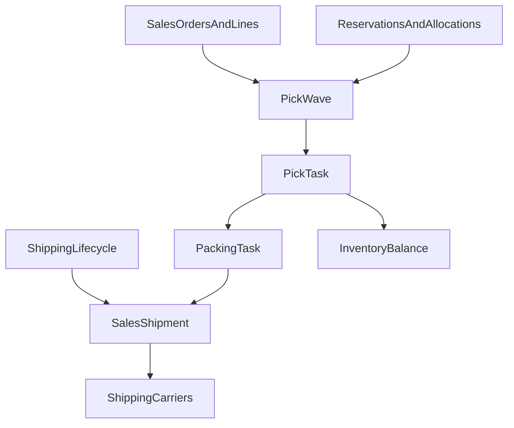

# WMS Phase 3 Specification — Picking and Packing

| Field | Value |
|-------|-------|
| **Status** | Draft |
| **Author** | Cursor Agent |
| **Created** | 2026-04-15 |
| **Related** | 2026-04-15-wms-roadmap, 2026-04-15-wms-phase-1-core-inventory, 2026-04-15-wms-phase-2-inbound-putaway, SPEC-047 |

## TLDR
**Key Points:**
- Phase 3 adds outbound warehouse execution through pick waves, pick tasks, and packing tasks.
- It is the first phase that physically consumes reserved stock against sales demand and hands the result back to `sales`, with optional downstream label/tracking handoff to `shipping_carriers`.
- WMS remains the owner of operational execution state, while `sales` and `shipping` remain the owners of commercial fulfillment and shipment-record lifecycle.

**Scope:**
- `PickWave`, `PickTask`, `PackingTask`
- Pick release, task assignment, short-pick handling, pack completion, and shipment handoff routes
- Direct integrations with `sales` order demand and shipment lifecycle plus `shipping_carriers` label/tracking workflows

**Concerns:**
- Pick execution must preserve inventory integrity when short picks or substitutions occur.
- Shipment ownership boundaries with `sales`, `shipping`, and `shipping_carriers` must remain explicit.

---

## Overview

Phase 3 turns reserved inventory into picked and packed goods ready for dispatch. It introduces work orchestration for warehouse operators and defines the contract by which WMS communicates completion back to shipment-owning sales/shipping flows and carrier-execution modules.

The audience is warehouse leads, pickers/packers, and developers implementing end-to-end order fulfillment.

> **Market Reference**: This phase adopts wave/batch/zone picking concepts common in Odoo WMS extensions and modern warehouse suites, while keeping pack/ship ownership separated from the commercial shipment document model as seen in modular platforms.

## Problem Statement

After phases 1 and 2:

1. Inventory can exist and be received, but there is no structured outbound execution.
2. Sales demand can reserve stock, but there is no physical picking work queue.
3. Short picks, operator assignment, and packing completion are not modeled.
4. Carrier labels and shipment dispatch cannot be orchestrated cleanly from warehouse actions or shipment-boundary handoffs.

Without these workflows, fulfillment remains manual and later carrier or SLA automation is impossible.

## Proposed Solution

Introduce three execution records:

1. `PickWave` to group outbound work.
2. `PickTask` to assign concrete warehouse picks against reserved/allocated stock.
3. `PackingTask` to verify picked goods, prepare cartons, and hand off to shipment creation/label purchase workflows.

### Design Decisions

| Decision | Rationale |
|----------|-----------|
| `PickWave` groups work separately from `sales` shipment records | Warehouse release strategy differs from sales-document lifecycle |
| Short picks are first-class outcomes | Physical execution regularly diverges from planned quantities and must remain auditable |
| Pack completion emits handoff data rather than owning commercial shipment records | Keeps the sales/shipping boundary authoritative for shipment records and `shipping_carriers` authoritative for carrier execution |
| WMS consumes allocated balances, not raw available balances | Preserves inventory integrity and planning discipline |
| Hybrid shipment-trigger model is supported | Some deployments create shipment records before warehouse work starts, while others create/update shipment boundary state only when packing completes |

### Alternatives Considered

| Alternative | Why Rejected |
|-------------|-------------|
| Generate picks directly from order lines with no wave/task layer | Too rigid for batching, assignment, and exception handling |
| Let WMS create and own shipment records fully | Conflicts with the existing sales/shipping shipment-ownership boundary |
| Allow pickers to consume any available stock without allocation linkage | Breaks reservation traceability and can starve higher-priority demand |

## User Stories / Use Cases

- **Warehouse supervisor** wants to release a set of orders into a pick wave so that the team can process outbound work efficiently.
- **Picker** wants assigned tasks with location, lot, and quantity so that stock is collected accurately.
- **Packer** wants to verify picked quantities and complete packing so that shipment handoff is reliable.
- **Sales user** wants order detail pages to reflect pick/pack progress so that customer communication stays accurate.
- **Carrier integration** wants a clear handoff moment when packed parcels are ready for label purchase or manifesting.

## Architecture



### Commands & Events

Commands introduced in phase 3:
- `createPickWave`
- `releasePickWave`
- `assignPickTask`
- `startPickTask`
- `confirmPickTask`
- `shortPickTask`
- `cancelPickTask`
- `createPackingTask`
- `startPackingTask`
- `completePackingTask`
- `handoffPackedShipment`

Events emitted in phase 3:
- `wms.pick_wave.released`
- `wms.pick_wave.completed` — emitted when all tasks in a wave reach `done` or `short`/`cancelled` status
- `wms.pick_task.created`
- `wms.pick_task.started`
- `wms.pick_task.completed`
- `wms.pick_task.shorted`
- `wms.pack_task.created`
- `wms.pack_task.completed`
- `wms.putaway.completed` — re-emitted when phase-2 putaway interleaves with outbound
- `wms.shipment.ready_for_label`
- `wms.shipment.handed_off`

Events consumed by WMS (subscribers):

| Event | Source Module | WMS Action |
|-------|-------------|------------|
| `shipping.shipment.created` | Shipping | Primary upstream-trigger path: allocate reserved inventory against the shipment's demand and bind/open WMS execution work for the referenced shipment |
| `shipping.shipment.dispatched` | Shipping | Final downstream confirmation: reduce on-hand inventory and mark pick tasks as complete for dispatched items |

Shipment lifecycle sequencing:
1. **Primary upstream path**: a shipment record may already exist before or during warehouse release; in that case `shipping.shipment.created` is the trigger that links reserved demand to shipment-scoped WMS execution.
2. **Alternative packing-boundary path**: WMS may start from reserved sales-order demand alone; when packing completes, WMS invokes sales/shipping-owned shipment create-or-update commands or dedicated integration routes so the shipment boundary is established at handoff time.
3. `shipping.shipment.dispatched` is always a post-handoff confirmation event and must not be treated as the creation trigger for picks or packing tasks.

### ACL Features (Phase 3 additions)

- `wms.manage_pick_waves` — create/release/manage pick waves
- `wms.execute_picks` — start/confirm/short individual pick tasks
- `wms.manage_packing` — create/complete packing tasks
- `wms.print_labels` — request carrier labels from packing context

Undo expectations:
- Releasing a wave is reversible until picks start.
- Completed picks reverse via compensating movement entries and reopened tasks.
- Pack completion may be undone only before downstream shipment/label actions cross an irreversible boundary; after label purchase, reversal becomes a forward-only exception flow.

## Data Models

All phase-3 entities include the global columns: `id (uuid)`, `created_at`, `updated_at`, `deleted_at`, `tenant_id`, `organization_id`, `metadata (jsonb)`.

### PickWave
- `id`: UUID
- `warehouse_id`: UUID
- `name`: string
- `strategy`: `single | batch | zone | wave`
- `status`: `draft | released | in_progress | completed | cancelled`
- `priority`: numeric
- `reference_snapshot`: jsonb for linked order/shipment IDs

Indexes:
- `(organization_id, warehouse_id, status, priority)`

### PickTask
- `id`: UUID
- `pick_wave_id`: UUID
- `warehouse_id`: UUID
- `catalog_variant_id`: UUID
- `location_id`: UUID
- `lot_id`: UUID nullable
- `quantity_requested`: numeric
- `quantity_picked`: numeric
- `status`: `open | in_progress | done | short | cancelled`
- `assigned_to`: UUID nullable
- `sales_order_id`: UUID nullable
- `sales_order_line_id`: UUID nullable

Indexes:
- `(organization_id, pick_wave_id, status)`
- `(organization_id, assigned_to, status)`
- `(organization_id, sales_order_id, status)`

### PackingTask
- `id`: UUID
- `warehouse_id`: UUID
- `sales_order_id`: UUID nullable
- `sales_shipment_id`: UUID nullable
- `carton_id`: UUID nullable
- `status`: `open | in_progress | done | cancelled`
- `label_status`: `pending | requested | printed | failed`
- `packed_snapshot`: jsonb

Indexes:
- `(organization_id, warehouse_id, status)`
- `(organization_id, sales_order_id, status)`

## API Contracts

### CRUD Resources

Collection routes:
- `GET|POST /api/wms/pick-waves`
- `GET|POST /api/wms/pick-tasks`
- `GET|POST /api/wms/packing-tasks`

Member routes:
- `GET|PUT|DELETE /api/wms/pick-waves/:id`
- `GET|PUT|DELETE /api/wms/pick-tasks/:id`
- `GET|PUT|DELETE /api/wms/packing-tasks/:id`

### Custom Action Endpoints

#### Release pick wave
- `POST /api/wms/pick-waves/:id/release`
- Request: `{ "strategy": "wave", "orderIds": ["uuid"], "warehouseId": "uuid" }`
- Response:
```json
{
  "ok": true,
  "pickTaskIds": ["uuid"],
  "packingTaskIds": []
}
```

#### Confirm pick
- `POST /api/wms/pick-tasks/:id/confirm`
- Request: `{ "quantityPicked": "4", "locationId": "uuid", "lotId": "uuid" }`
- Response: `{ "ok": true, "movementId": "uuid", "status": "done" }`

#### Short pick
- `POST /api/wms/pick-tasks/:id/short`
- Request: `{ "quantityPicked": "2", "reason": "stock_missing" }`
- Response: `{ "ok": true, "status": "short", "shortQuantity": "2" }`

#### Complete packing
- `POST /api/wms/packing-tasks/:id/complete`
- Request:
```json
{
  "packedLines": [
    { "catalogVariantId": "uuid", "quantity": "2" }
  ],
  "requestCarrierLabel": true
}
```
- Response:
```json
{
  "ok": true,
  "salesShipmentId": "uuid",
  "labelRequestState": "queued"
}
```

## Cross-Module Integration Contracts

### Sales

`sales` remains the owner of order state and commercial fulfillment totals. WMS owns execution detail.

Direct phase-3 contracts:
- WMS consumes reserved/allocated demand keyed by `sales_order_id` and optional `sales_order_line_id`
- WMS may begin execution from order-linked demand before a shipment record exists
- when pack completion reaches the shipment boundary, WMS invokes sales/shipping-owned shipment creation/update commands or dedicated integration routes if shipment state does not already exist upstream
- WMS may enrich order detail pages with `_wms.fulfillmentSummary`, `_wms.pickProgress`, `_wms.packProgress`
- WMS must never recalculate commercial document totals or mutate sales math inline

Example additive sales payload:
```json
{
  "_wms": {
    "fulfillmentSummary": {
      "waveStatus": "in_progress",
      "pickedQuantity": "3",
      "packedQuantity": "2"
    }
  }
}
```

### Shipping

`shipping` owns shipment lifecycle events and record-state transitions that WMS can subscribe to or call into.

Direct phase-3 contracts:
- `shipping.shipment.created` is the preferred upstream event when shipment records are established before warehouse execution begins
- shipment creation/update initiated from WMS at packing time must still flow through shipping/sales-owned commands or integration routes
- `shipping.shipment.dispatched` confirms downstream dispatch completion after WMS handoff, not before
- WMS must not become the source of truth for shipment lifecycle timestamps or commercial shipment status

### Shipping Carriers

Carrier workflows begin only once goods are packed and a shipment boundary exists through `shipping`/`sales`.

Direct phase-3 contracts:
- `wms.shipment.ready_for_label` event signals a packed shipment candidate
- carrier label purchase remains owned by `shipping_carriers`
- label/tracking responses are projected back to WMS packing tasks additively through `label_status`, snapshots, or enrichments
- carrier failures must not roll back completed picks; they create retryable shipment handoff exceptions

### Catalog

Catalog integration remains indirect:
- WMS uses variant references and profile tracking constraints
- no catalog schema changes are introduced in this phase

## Internationalization (i18n)

Required key families:
- `wms.pickWaves.*`
- `wms.pickTasks.*`
- `wms.packingTasks.*`
- `wms.fulfillment.*`
- `wms.errors.shortPick`
- `wms.errors.invalidAllocation`
- `wms.errors.labelRequestFailed`
- `wms.widgets.sales.fulfillmentSummary.*`

## UI/UX

Backend pages introduced in phase 3:
- `/backend/wms/pick-waves`
- `/backend/wms/picking`
- `/backend/wms/packing`

UX expectations:
- pick queue emphasizes assignee, source location, order, and aging
- short picks produce visible warning state and exception actions
- packing view shows order context, scanned/confirmed lines, and label handoff state
- sales detail views can surface fulfillment progress via `_wms.*` without becoming a WMS page

## Migration & Compatibility

- Phase 3 adds outbound execution tables and routes without changing phase-1 or phase-2 URLs.
- `InventoryMovement.type = pick | pack | ship` becomes active in this phase and remains additive.
- Shipment handoff uses additive integration routes/events, not sales table ownership changes.
- Carrier integration remains additive to `shipping_carriers`.

## Implementation Plan

### Story 1: Pick orchestration
1. Implement `PickWave` and `PickTask` entities, validators, and APIs.
2. Create wave release logic from reserved demand.
3. Support start/confirm/short task flows with movement updates.

### Story 2: Packing and shipment handoff
1. Implement `PackingTask` entity and APIs.
2. Complete packing into a handoff contract for `sales` shipment ownership.
3. Trigger carrier-label workflow events after packing.

### Story 3: UI and projections
1. Build pick and packing work queues.
2. Expose `_wms.fulfillmentSummary` on sales detail views.
3. Add operational exception surfaces for shorts and label failures.

### Testing Strategy

### Integration Coverage

| ID | Type | Scenario | Primary assertions |
|----|------|----------|--------------------|
| WMS-P3-INT-01 | API | Release pick wave from reserved order demand | wave created, tasks generated from allocated demand, statuses correct |
| WMS-P3-INT-02 | API | Confirm full pick task | actual picked quantity decrements the correct bucket and task completes |
| WMS-P3-INT-03 | API | Short pick task | only picked quantity moves, task status becomes `short`, shortage remains traceable |
| WMS-P3-INT-04 | API | Complete packing and hand off to shipment-owning sales/shipping flow | packing completes, shipment handoff payload emitted, `salesShipmentId` returned |
| WMS-P3-INT-05 | API | Carrier label request fails after packing | packing remains complete, label state becomes retryable failure, no rollback of picked stock |
| WMS-P3-INT-06 | API | Enrich sales detail with `_wms.fulfillmentSummary` | additive projection shows pick/pack progress without mutating sales-owned fields |
| WMS-P3-INT-07 | UI | Process pick and pack from backend queues | task progression, exception state, and success feedback work end to end |
| WMS-P3-INT-08 | API/Auth | Deny wave release or pack completion without WMS outbound feature grant | request rejected and no execution state changes persist |

### Unit Coverage

- task generation from reserved/allocated demand
- short-pick delta calculations
- pack-to-shipment handoff payload shaping
- label retry state transitions

### Integration Test Notes

- Fixtures should use phase-1 balances and phase-2 receipt/putaway outcomes instead of synthetic shortcuts where possible.
- Shipment-handoff assertions must verify ownership boundary: WMS emits or calls into sales, but does not become shipment owner.
- Carrier failure tests should assert forward recovery, not transaction rollback semantics.

## Risks & Impact Review

#### Short Pick Inventory Corruption
- **Scenario**: The system decrements the full requested quantity even when only part of the task was physically picked.
- **Severity**: Critical
- **Affected area**: Inventory accuracy, order fulfillment, customer promise logic
- **Mitigation**: Pick confirmation uses explicit `quantityPicked` and short state transitions, writing only the actual movement quantity.
- **Residual risk**: Manual operator error still exists; acceptable because the system records who confirmed the short.

#### Shipment Ownership Leakage
- **Scenario**: WMS starts persisting shipment status independently of `sales`, causing conflicting views.
- **Severity**: High
- **Affected area**: Sales shipments, carrier label orchestration, reporting
- **Mitigation**: WMS stores execution snapshots and task state only; shipment records remain owned by the sales/shipping boundary.
- **Residual risk**: Some denormalized status duplication may still appear in UI snapshots; acceptable if read-only.

#### Carrier Failure After Pack Completion
- **Scenario**: Goods are packed and inventory is consumed, but label purchase or tracking creation fails.
- **Severity**: High
- **Affected area**: Dispatch, warehouse exceptions, customer communication
- **Mitigation**: Make carrier handoff retryable and non-transactional relative to completed packing; surface exception queues.
- **Residual risk**: Manual intervention may still be required for failed carrier responses; acceptable for operational workflows.

## Final Compliance Report — 2026-04-15

### AGENTS.md Files Reviewed
- `AGENTS.md`
- `.ai/specs/AGENTS.md`
- `packages/core/AGENTS.md`
- `packages/core/src/modules/sales/AGENTS.md`

### Compliance Matrix

| Rule Source | Rule | Status | Notes |
|-------------|------|--------|-------|
| root AGENTS.md | No direct ORM relationships between modules | Compliant | Sales and carrier links remain ID-based |
| root AGENTS.md | Use command pattern for writes | Compliant | Picking and packing actions are command-driven |
| root AGENTS.md | Keep modules self-contained | Compliant | WMS owns execution; `sales` and carriers own their documents |
| packages/core/AGENTS.md | Response enrichers must namespace fields | Compliant | Sales projections remain under `_wms.*` |
| packages/core/src/modules/sales/AGENTS.md | Shipments follow sales workflow ownership | Compliant | Phase 3 uses handoff, not ownership transfer |

### Internal Consistency Check

| Check | Status | Notes |
|-------|--------|-------|
| Data models match API contracts | Pass | Wave/task APIs map directly to phase-3 entities |
| API contracts match UI/UX section | Pass | Pick and pack pages align with routes |
| Risks cover all write operations | Pass | Pick, pack, and carrier exception paths covered |
| Commands defined for all mutations | Pass | All execution transitions are command-backed |
| Cache strategy covers all read APIs | Pass | Sales projections stay additive and invalidatable |

### Non-Compliant Items

None.

### Verdict

- **Fully compliant**: Approved — ready for implementation

## Changelog

### 2026-04-15 (rev 4)
- Clarified hybrid phase-3 sequencing: shipment state may exist upstream via `shipping.shipment.created` or be created/updated at packing boundary through sales/shipping-owned commands
- Separated module boundaries explicitly: `shipping` owns shipment lifecycle, `shipping_carriers` owns labels/tracking/carrier execution

### 2026-04-15 (rev 3)
- Added explicit global entity columns note for phase-3 models to match roadmap guarantees
- Expanded CRUD API section into explicit `collection` vs `member` routes

### 2026-04-15 (rev 2)
- Added consumed events: `shipping.shipment.created`, `shipping.shipment.dispatched`
- Added `wms.pick_wave.completed` event (was missing, only `released` existed)
- Added ACL features: `wms.manage_pick_waves`, `wms.execute_picks`, `wms.manage_packing`, `wms.print_labels`

### 2026-04-15
- Initial phase-3 specification for WMS picking and packing

### Review — 2026-04-15
- **Reviewer**: Agent
- **Security**: Passed
- **Performance**: Passed
- **Cache**: Passed
- **Commands**: Passed
- **Risks**: Passed
- **Verdict**: Approved
