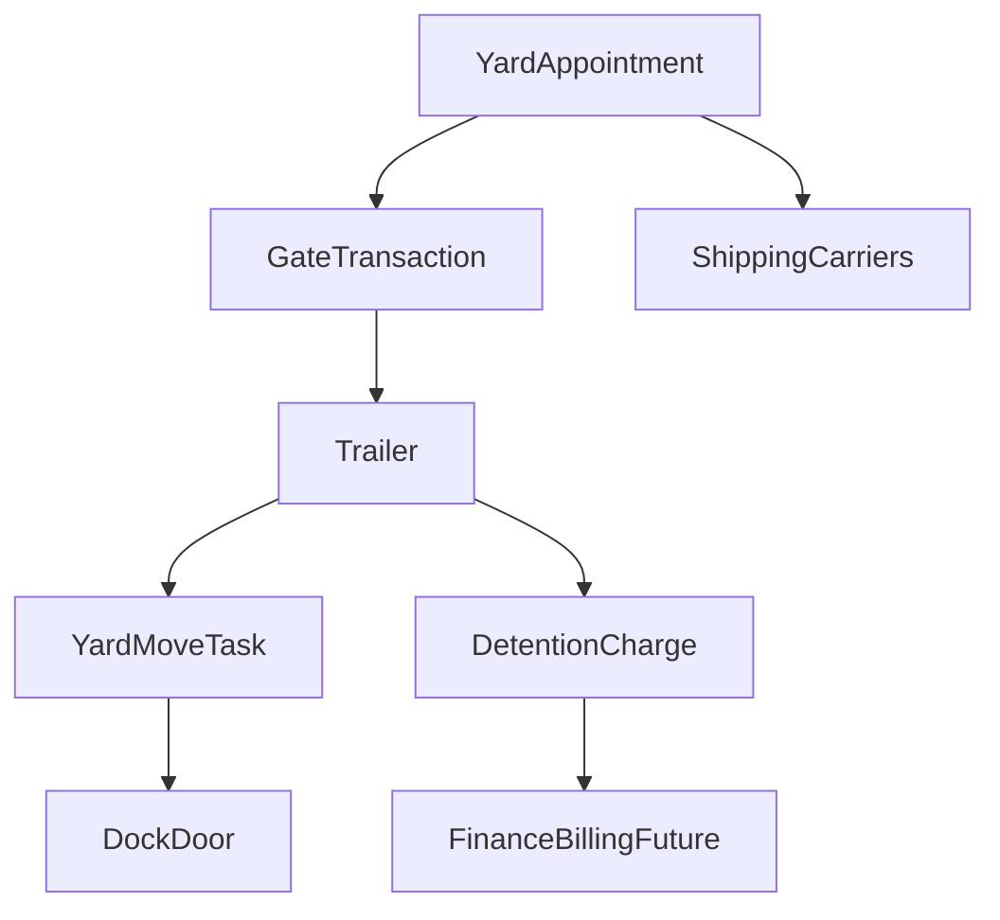

# WMS Phase 4 Specification — Yard Management

| Field | Value |
|-------|-------|
| **Status** | Draft |
| **Author** | Cursor Agent |
| **Created** | 2026-04-15 |
| **Related** | 2026-04-15-wms-roadmap, Issue #388 |

## TLDR
**Key Points:**
- Phase 4 extends WMS beyond the building interior to dock doors, yard slots, trailers, appointments, gate transactions, yard moves, and detention charging.
- It introduces operational visibility for inbound and outbound trailer flow while keeping carrier and billing master ownership outside WMS.
- The phase is only justified after inbound and outbound execution already exist in phases 2 and 3.

**Scope:**
- `DockDoorType`, `DockDoor`, `YardLocationType`, `YardLocation`, `Trailer`, `TrailerInventory`, `GateTransaction`, `YardAppointment`, `YardMoveTask`, `DetentionFeeRule`, `DetentionCharge`
- Dock scheduling, gate check-in/check-out, yard-move execution, trailer visibility, and detention fee calculation
- Direct integration points with `shipping` shipment references, `shipping_carriers` carrier execution, `customers`, and future `finance/billing`

**Concerns:**
- Yard data can create expensive real-time state changes if appointment, trailer, and detention logic are tightly coupled.
- Detention charging must stop short of becoming a billing engine.

---

## Overview

Phase 4 introduces the "outside the warehouse walls" layer. It models which trailers have arrived, where they are parked, which door they occupy, whether they have an appointment, and whether dwell time should result in a detention charge candidate.

The audience is yard coordinators, warehouse operations managers, and implementers integrating appointments or billing signals.

> **Market Reference**: This phase borrows from dedicated yard-management systems and advanced WMS suites: appointment scheduling, gate control, trailer visibility, and detention timing. It rejects phase-4 expansion into a full TMS or billing platform.

## Problem Statement

Phases 1-3 can manage stock and execution inside the warehouse, but they cannot answer:

1. Which trailer is at the facility and where it is currently parked.
2. Which dock door is reserved or occupied.
3. Whether an inbound or outbound appointment was approved and when a trailer actually arrived.
4. Which trailer move tasks are pending between gate, yard, and dock.
5. Whether excessive dwell time should trigger a charge candidate.

Without these capabilities, dock congestion and detention exposure remain invisible.

## Proposed Solution

Introduce a yard-management layer tied to the existing warehouse:

1. Configure dock doors and yard location types.
2. Track trailers and their current yard/dock/gate position.
3. Create and approve appointments linked to inbound or outbound references.
4. Record gate transactions and trailer condition/seal data.
5. Create yard-move tasks and calculate detention-charge candidates.

### Design Decisions

| Decision | Rationale |
|----------|-----------|
| Keep yard entities under `wms` rather than a transport module | They are tightly coupled to warehouse execution and dock readiness |
| `DetentionCharge` is a billing candidate, not an invoice | Prevents WMS from absorbing finance responsibilities |
| Trailer location is modeled explicitly on trailer and location/door state | Simplifies operational boards and conflict validation |
| Appointment references are generic (`po`, `so`, `asn`, `shipment`) | Supports inbound and outbound use cases without cross-module ORM dependencies |

## User Stories / Use Cases

- **Yard coordinator** wants to approve a dock appointment so that docks are scheduled predictably.
- **Gate operator** wants to record trailer check-in details so that seal, condition, and arrival time are auditable.
- **Yard jockey** wants move tasks from gate to yard or dock so that trailer positioning is controlled.
- **Operations manager** wants to see which trailers are incurring dwell charges so that action can be taken before costs grow.

## Architecture

### Commands & Events

Commands introduced in phase 4:

Configuration:
- `createDockDoorType`
- `updateDockDoorType`
- `createDockDoor`
- `updateDockDoor`
- `updateDockDoorStatus`
- `createYardLocationType`
- `updateYardLocationType`
- `createYardLocation`
- `updateYardLocation`
- `updateYardLocationStatus`

Trailer management:
- `createTrailer`
- `updateTrailer`
- `updateTrailerStatus`
- `updateTrailerContents`

Gate operations:
- `checkInTrailer` — creates GateTransaction (check_in), creates or updates Trailer, starts detention tracking if applicable, emits `wms.trailer.checked_in`
- `checkOutTrailer` — creates GateTransaction (check_out), updates Trailer status and timestamps, finalizes detention charge calculation, emits `wms.trailer.checked_out`

Appointments:
- `createYardAppointment`
- `updateYardAppointment`
- `approveYardAppointment`
- `rejectYardAppointment`
- `cancelYardAppointment`
- `markAppointmentNoShow`

Yard moves:
- `createYardMoveTask`
- `assignYardMoveTask`
- `startYardMoveTask`
- `completeYardMoveTask` — updates Trailer location, updates source/target location status, emits `wms.yard_move.completed`
- `cancelYardMoveTask`
- `optimizeYardMoveTasks` — analyzes pending tasks, suggests optimal sequence, returns optimized task order

Detention:
- `createDetentionFeeRule`
- `updateDetentionFeeRule`
- `calculateDetentionCharge`
- `waiveDetentionCharge`
- `markDetentionInvoiced`

Events emitted in phase 4:
- `wms.trailer.checked_in` — payload: `warehouse_id, trailer_id, appointment_id, carrier_id`
- `wms.trailer.checked_out` — payload: `warehouse_id, trailer_id, dwell_minutes`
- `wms.appointment.requested` — payload: `warehouse_id, appointment_id, type, carrier_id, scheduled_at`
- `wms.appointment.approved` — payload: `warehouse_id, appointment_id, dock_door_id`
- `wms.appointment.rejected` — payload: `warehouse_id, appointment_id, reason`
- `wms.yard_move.completed` — payload: `warehouse_id, trailer_id, from_location, to_location`
- `wms.detention.threshold_exceeded` — payload: `warehouse_id, trailer_id, dwell_minutes, estimated_charge`
- `wms.detention.charge_calculated` — payload: `warehouse_id, trailer_id, charge_id, amount, currency`

Events consumed by WMS (subscribers):

| Event | Source Module | WMS Action |
|-------|-------------|------------|
| `freight.shipment.eta_updated` | Freight | Update yard appointment expected arrival time |
| `billing.invoice.created` | Billing | Mark corresponding detention charge as invoiced |

## Data Models

All entities include the global columns: `id (uuid)`, `created_at`, `updated_at`, `deleted_at`, `tenant_id`, `organization_id`, `metadata (jsonb)`.

### DockDoorType
- `warehouse_id`: UUID required
- `code`: string, required, unique per warehouse
- `name`: string required
- `description`: string nullable
- `is_active`: boolean

### DockDoor
- `warehouse_id`: UUID required
- `dock_door_type_id`: UUID required
- `code`: string, required, unique per warehouse
- `name`: string
- `status`: `available | occupied | blocked | maintenance`
- `current_trailer_id`: UUID nullable
- `is_active`: boolean

### YardLocationType
- `warehouse_id`: UUID required
- `code`: string required
- `name`: string
- `is_powered`: boolean (for reefer trailers)
- `is_hazmat`: boolean
- `is_priority`: boolean (closer to docks)
- `is_active`: boolean

### YardLocation
- `warehouse_id`: UUID required
- `yard_location_type_id`: UUID required
- `code`: string, required, unique per warehouse
- `name`: string nullable
- `max_trailer_length_ft`: number nullable (capacity constraint)
- `max_trailer_weight_kg`: number nullable
- `is_powered`: boolean (electricity for reefers)
- `is_hazmat`: boolean
- `priority_zone`: number nullable (lower = closer to docks)
- `reserved_for_customer_id`: UUID nullable (for 3PL scenarios)
- `status`: `available | occupied | blocked | maintenance`
- `current_trailer_id`: UUID nullable
- `is_active`: boolean

### Trailer
- `warehouse_id`: UUID required
- `trailer_number`: string required
- `container_number`: string nullable
- `license_plate`: string nullable
- `carrier_id`: UUID nullable
- `owner_type`: `owned | carrier | customer`
- `trailer_type`: `dry_van | reefer | flatbed | container | other`
- `length_ft`: number nullable
- `status`: `empty | loaded | partial | sealed | ready_for_pickup`
- `contents_summary`: jsonb nullable (inventory manifest)
- `seal_number`: string nullable
- `current_location_type`: `yard | dock | gate | in_transit | offsite`
- `current_yard_location_id`: UUID nullable
- `current_dock_door_id`: UUID nullable
- `checked_in_at`: timestamp nullable
- `checked_out_at`: timestamp nullable

### TrailerInventory
- `trailer_id`: UUID required
- `catalog_variant_id`: UUID required
- `lot_id`: UUID nullable
- `quantity`: number required
- `status`: `expected | confirmed`

### GateTransaction
- `warehouse_id`: UUID required
- `transaction_type`: `check_in | check_out`
- `trailer_id`: UUID required
- `appointment_id`: UUID nullable
- `driver_name`: string nullable
- `driver_license`: string nullable
- `carrier_id`: UUID nullable
- `carrier_name`: string nullable
- `trailer_number`: string required
- `container_number`: string nullable
- `seal_number`: string nullable
- `seal_intact`: boolean nullable (for check-in)
- `shipment_reference`: string nullable (PO or SO number)
- `condition_notes`: string nullable
- `condition_photos`: jsonb (array of photo URLs)
- `performed_by`: UUID required
- `performed_at`: timestamp required

### YardAppointment
- `warehouse_id`: UUID required
- `appointment_type`: `inbound | outbound`
- `status`: `requested | approved | rejected | checked_in | in_progress | completed | cancelled | no_show`
- `requested_by_type`: `carrier | internal | automated`
- `requested_by_id`: UUID nullable
- `carrier_id`: UUID nullable
- `carrier_name`: string nullable
- `trailer_number`: string nullable
- `container_number`: string nullable
- `dock_door_id`: UUID nullable (assigned door)
- `scheduled_at`: timestamp required
- `scheduled_end_at`: timestamp nullable
- `actual_arrival_at`: timestamp nullable
- `actual_departure_at`: timestamp nullable
- `reference_type`: `po | so | asn | shipment`
- `reference_id`: UUID nullable
- `notes`: string nullable
- `approved_by`: UUID nullable
- `approved_at`: timestamp nullable

### YardMoveTask
- `warehouse_id`: UUID required
- `trailer_id`: UUID required
- `from_location_type`: `yard | dock | gate`
- `from_yard_location_id`: UUID nullable
- `from_dock_door_id`: UUID nullable
- `to_location_type`: `yard | dock | gate`
- `to_yard_location_id`: UUID nullable
- `to_dock_door_id`: UUID nullable
- `priority`: number (default 5)
- `status`: `pending | assigned | in_progress | completed | cancelled`
- `assigned_to`: UUID nullable (yard jockey)
- `assigned_at`: timestamp nullable
- `started_at`: timestamp nullable
- `completed_at`: timestamp nullable
- `completed_by`: UUID nullable

### DetentionFeeRule
- `warehouse_id`: UUID required
- `name`: string required
- `applies_to`: `all | carrier | customer`
- `applies_to_id`: UUID nullable (specific carrier or customer)
- `free_time_minutes`: number (grace period before fees start)
- `fee_per_hour`: decimal (rate after free time)
- `fee_currency`: string (default USD)
- `max_daily_fee`: decimal nullable (cap per day)
- `is_active`: boolean

### DetentionCharge
- `warehouse_id`: UUID required
- `trailer_id`: UUID required
- `carrier_id`: UUID nullable
- `customer_id`: UUID nullable
- `detention_fee_rule_id`: UUID required
- `check_in_at`: timestamp required
- `check_out_at`: timestamp nullable
- `total_dwell_minutes`: number nullable
- `billable_minutes`: number nullable (after free time)
- `calculated_fee`: decimal nullable
- `fee_currency`: string
- `status`: `accruing | calculated | invoiced | paid | waived`
- `invoice_reference`: string nullable
- `notes`: string nullable

### Validation Rules

All validators live in `data/validators.ts`:

- `dockDoorTypeCreateSchema`: `code` required, alphanumeric, max 20 chars; `name` required, max 100 chars
- `dockDoorCreateSchema`: `dock_door_type_id` required (must exist); `code` required, unique per warehouse
- `yardLocationCreateSchema`: `yard_location_type_id` required (must exist); `code` required, unique per warehouse; `max_trailer_length_ft` positive when provided; `max_trailer_weight_kg` positive when provided; `reserved_for_customer_id` must be a valid customer when provided
- `trailerCreateSchema`: `trailer_number` required; `status` must be valid enum; if `container_number` provided, validate format
- `gateTransactionCreateSchema`: `transaction_type` required; `trailer_number` required; `seal_number` required for check_in with sealed trailers; `condition_photos` array of valid URLs
- `yardAppointmentCreateSchema`: `appointment_type` required; `scheduled_at` required, must be in the future for new appointments; `scheduled_end_at` must be after `scheduled_at` when provided; `dock_door_id` must not conflict with existing approved appointments for the same time window
- `yardMoveTaskCreateSchema`: `trailer_id` required (must exist); from and to locations — at least one must be specified; cannot move to same location
- `detentionFeeRuleCreateSchema`: `free_time_minutes` non-negative; `fee_per_hour` positive; `max_daily_fee` must be >= `fee_per_hour` when provided

### ACL Features (Phase 4 additions)

- `wms.manage_yard` — manage dock doors, yard locations, and their types
- `wms.manage_trailers` — create/update trailers and trailer contents
- `wms.gate_operations` — perform gate check-in/check-out
- `wms.manage_appointments` — create/approve/reject/cancel yard appointments
- `wms.execute_yard_moves` — create/assign/start/complete yard move tasks
- `wms.manage_detention` — manage detention fee rules and calculate/waive charges

## API Contracts

### CRUD Resources

Collection routes:
- `GET|POST /api/wms/yard/dock-door-types`
- `GET|POST /api/wms/yard/dock-doors`
- `GET|POST /api/wms/yard/location-types`
- `GET|POST /api/wms/yard/locations`
- `GET|POST /api/wms/yard/trailers`
- `GET|POST /api/wms/yard/appointments`
- `GET|POST /api/wms/yard/move-tasks`
- `GET|POST /api/wms/yard/detention-rules`

Member routes:
- `GET|PUT|DELETE /api/wms/yard/dock-door-types/:id`
- `GET|PUT|DELETE /api/wms/yard/dock-doors/:id`
- `GET|PUT|DELETE /api/wms/yard/location-types/:id`
- `GET|PUT|DELETE /api/wms/yard/locations/:id`
- `GET|PUT|DELETE /api/wms/yard/trailers/:id`
- `GET|PUT|DELETE /api/wms/yard/appointments/:id`
- `GET|PUT|DELETE /api/wms/yard/move-tasks/:id`
- `GET|PUT|DELETE /api/wms/yard/detention-rules/:id`

Supplementary non-CRUD routes:
- `POST /api/wms/yard/dock-doors/:id/status`
- `GET /api/wms/yard/trailers/:id/inventory`
- `GET /api/wms/yard/gate/transactions`
- `GET /api/wms/yard/detention-charges`

### Custom Action Endpoints

- `POST /api/wms/yard/gate/check-in`
- `POST /api/wms/yard/gate/check-out`
- `POST /api/wms/yard/appointments/:id/approve`
- `POST /api/wms/yard/appointments/:id/reject`
- `POST /api/wms/yard/appointments/:id/cancel`
- `POST /api/wms/yard/move-tasks/:id/assign`
- `POST /api/wms/yard/move-tasks/:id/start`
- `POST /api/wms/yard/move-tasks/:id/complete`
- `POST /api/wms/yard/move-tasks/optimize`
- `POST /api/wms/yard/detention-charges/:id/calculate`
- `POST /api/wms/yard/detention-charges/:id/waive`
- `POST /api/wms/yard/detention-charges/:id/invoice`

## Cross-Module Integration Contracts

### Shipping

- shipment-facing appointment references should point to shipment records owned by `shipping`
- WMS may store shipment IDs/references for yard planning, but must not own shipment lifecycle state
- carrier ETA or dock-readiness side effects that depend on a shipment record should flow through shipping-owned identifiers/events rather than direct cross-module mutation

### Shipping Carriers

- `carrier_id` references a carrier/business partner record by UUID only
- outbound appointments may eventually result in carrier execution after the shipment lifecycle boundary is established in `shipping`
- carrier-facing dock readiness or ETA updates should emit events rather than mutate carrier module records directly

### Customers

- yard slots may be reserved for customer-specific 3PL scenarios via `reserved_for_customer_id`
- trailer ownership and appointment requesters may reference customer/company records by UUID

### Finance / Billing

Phase 4 creates detention billing inputs, not invoices.

Direct contracts:
- `wms.detention.charge_calculated` event carries charge candidate details
- future finance or billing modules may import/consume detention charges and turn them into invoices
- WMS stores invoice references additively but does not own invoice generation or payment collection

## Internationalization (i18n)

Required key families:
- `wms.dockDoors.*`
- `wms.yardLocations.*`
- `wms.trailers.*`
- `wms.gateTransactions.*`
- `wms.yardAppointments.*`
- `wms.detention.*`

## UI/UX

Backend pages introduced in phase 4:
- `/backend/wms/yard`
- `/backend/wms/docks`
- `/backend/wms/trailers`
- `/backend/wms/appointments`
- `/backend/wms/detention`

UX expectations:
- yard board emphasizes current trailer position and appointment state
- dock screens emphasize occupancy and conflicts
- detention list separates accruing, calculated, and invoiced states

## Migration & Compatibility

- Phase 4 is additive to prior WMS phases and introduces new routes/entities only.
- Appointment reference contracts are intentionally generic and remain future-compatible with purchase, sales, and shipment flows.
- Billing integration is event- and reference-based, avoiding new hard dependencies.

## Implementation Plan

### Story 1: Yard master data
1. Implement dock door and yard location configuration entities and pages.
2. Add validation for occupancy, capacity, and conflicting assignments.

### Story 2: Trailer and appointment flow
1. Add trailer, gate transaction, and appointment models/APIs.
2. Implement check-in/check-out and approval workflows.

### Story 3: Yard moves and detention
1. Add yard-move tasks and operator flows.
2. Add detention rule configuration and charge calculation.
3. Emit finance-facing charge events.

### Testing Strategy

### Integration Coverage

| ID | Type | Scenario | Primary assertions |
|----|------|----------|--------------------|
| WMS-P4-INT-01 | API | Check trailer in at gate | gate transaction persisted, trailer state updated, arrival timestamps captured |
| WMS-P4-INT-02 | API | Reject overlapping approved appointment for same dock window | conflicting appointment denied with no dock assignment corruption |
| WMS-P4-INT-03 | API | Move trailer gate -> yard -> dock | trailer and occupancy state stay mutually consistent across every step |
| WMS-P4-INT-04 | API | Check trailer out | departure transaction persists and detention window closes |
| WMS-P4-INT-05 | API | Calculate detention charge candidate | fee calculation honors free-time, caps, and status transitions |
| WMS-P4-INT-06 | API | Emit finance-facing detention event without generating invoice | WMS creates charge candidate only and preserves billing ownership boundary |
| WMS-P4-INT-07 | UI | Manage dock occupancy and appointments from backend yard views | conflicts, statuses, and assignment feedback are visible in UI |
| WMS-P4-INT-08 | API/Auth | Deny yard move or detention action without proper feature grant | no trailer, dock, or charge state changes persist |

### Unit Coverage

- detention fee math with free-time and daily cap rules
- appointment overlap detection
- trailer-location state transition validation
- dock and yard occupancy conflict validation

### Integration Test Notes

- Tests should assert both trailer state and location/door occupancy state after each move to prevent split-brain location bugs.
- Appointment tests need explicit time windows rather than implicit "now" comparisons to remain deterministic.
- Billing boundary tests must assert that only charge candidates and references are produced, never invoices.

## Risks & Impact Review

#### Conflicting Trailer Location State
- **Scenario**: A trailer appears simultaneously at a dock and a yard location due to partial updates.
- **Severity**: High
- **Affected area**: Yard board accuracy, dock planning, detention timing
- **Mitigation**: Single command transaction updates trailer and location occupancy together.
- **Residual risk**: External/manual corrections may still be needed after operator mistakes; acceptable if auditable.

#### Appointment Overbooking
- **Scenario**: Multiple appointments are approved for the same door/time range.
- **Severity**: High
- **Affected area**: Dock utilization, inbound/outbound delays
- **Mitigation**: Validation rejects overlapping approved appointments for the same door window.
- **Residual risk**: Intentional manual overrides may still produce congestion; acceptable if explicit.

#### Billing Boundary Creep
- **Scenario**: Detention-charge logic expands into invoice creation, payment state, or receivables.
- **Severity**: Medium
- **Affected area**: WMS scope, finance responsibilities
- **Mitigation**: Keep WMS output to charge candidates plus invoice references set by an external billing owner.
- **Residual risk**: UI stakeholders may ask for finance actions in WMS; acceptable if they remain links/handoffs only.

## Final Compliance Report — 2026-04-15

### AGENTS.md Files Reviewed
- `AGENTS.md`
- `.ai/specs/AGENTS.md`
- `packages/core/AGENTS.md`

### Compliance Matrix

| Rule Source | Rule | Status | Notes |
|-------------|------|--------|-------|
| root AGENTS.md | No direct ORM relationships between modules | Compliant | Carrier, customer, and billing links are ID- or event-based |
| root AGENTS.md | Use command pattern for writes | Compliant | Yard moves, gate, and appointments are command-backed |
| packages/core/AGENTS.md | API routes MUST export `openApi` | Compliant | Yard APIs follow standard WMS contract |
| packages/core/AGENTS.md | Keep modules self-contained | Compliant | Billing remains a handoff, not embedded logic |

### Internal Consistency Check

| Check | Status | Notes |
|-------|--------|-------|
| Data models match API contracts | Pass | Each resource has a matching entity family |
| API contracts match UI/UX section | Pass | Yard and detention pages align with route families |
| Risks cover all write operations | Pass | Location, appointment, and detention risks covered |
| Commands defined for all mutations | Pass | Operational transitions are command-modeled |
| Cache strategy covers all read APIs | Pass | Yard boards rely on additive read models and invalidation |

### Non-Compliant Items

None.

### Verdict

- **Fully compliant**: Approved — ready for implementation

## Changelog

### 2026-04-15 (rev 4)
- Clarified cross-module boundaries: `shipping` owns shipment references/lifecycle context, while `shipping_carriers` remains carrier execution only

### 2026-04-15 (rev 3)
- Expanded CRUD API section into explicit `collection` vs `member` routes and called out read-only endpoints separately

### 2026-04-15 (rev 2)
- Expanded commands from 15 to 37 to match #388 (added all update*, assign/start/cancel yard moves, optimize, waive/invoice detention, appointment lifecycle)
- Fixed event IDs: `wms.trailer.moved` → `wms.yard_move.completed`, added `wms.appointment.requested/rejected`, `wms.detention.threshold_exceeded`
- Added consumed events: `freight.shipment.eta_updated`, `billing.invoice.created`
- Expanded all entity field tables to match #388 column-for-column (GateTransaction, YardAppointment, DetentionFeeRule, DetentionCharge, DockDoor.is_active, YardMoveTask audit fields)
- Changed API URL namespace to `/api/wms/yard/*` matching #388
- Added missing endpoints: `/trailers/:id/inventory`, `/move-tasks/optimize`, `/detention-charges/:id/waive`, `/detention-charges/:id/invoice`, gate endpoints under `/yard/gate/*`
- Added validation rules for all entities
- Added ACL features: 6 granular yard permissions

### 2026-04-15
- Initial phase-4 specification for WMS yard management

### Review — 2026-04-15
- **Reviewer**: Agent
- **Security**: Passed
- **Performance**: Passed
- **Cache**: Passed
- **Commands**: Passed
- **Risks**: Passed
- **Verdict**: Approved
