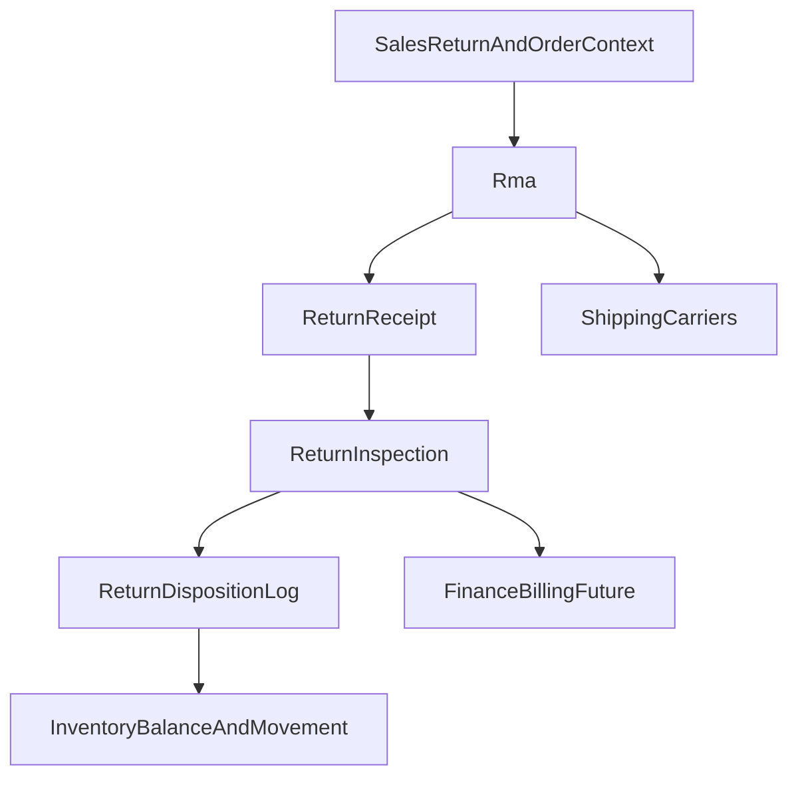

# WMS Phase 5 Specification — Returns and Reverse Logistics

| Field | Value |
|-------|-------|
| **Status** | Draft |
| **Author** | Cursor Agent |
| **Created** | 2026-04-15 |
| **Related** | 2026-04-15-wms-roadmap, Issue #388, packages/core/src/modules/sales/AGENTS.md |

## TLDR
**Key Points:**
- Phase 5 adds the physical reverse-logistics layer: RMA intake, return receiving, inspection, grading, disposition, and inventory re-entry or disposal.
- Returns remain inside the `wms` roadmap, but the phase explicitly avoids taking over commercial refund ownership from `sales` or future finance modules.
- The phase closes the WMS loop by linking outbound execution, inbound quality control, and disposition-driven stock outcomes.

**Scope:**
- `ReturnReason`, `DispositionType`, `ConditionGrade`, `DispositionRule`, `Rma`, `RmaLine`, `ReturnReceipt`, `ReturnReceiptLine`, `ReturnInspection`, `ReturnDispositionLog`
- RMA approval, return receipt, inspection, disposition, and refund handoff signals
- Direct integrations with `sales`, `shipping` shipment references, `shipping_carriers` return-label/tracking workflows, and `finance/billing`

**Concerns:**
- Open Mercato already has sales-side returns behavior; WMS must augment it with physical logistics instead of replacing it.
- Restock decisions can corrupt inventory if grade/disposition rules are not explicit.

---

## Overview

Phase 5 introduces structured reverse logistics. It tracks why items are being returned, whether they were actually received, what condition they are in, and what should happen next: restock, quarantine, scrap, vendor return, or customer replacement workflow.

The audience is returns coordinators, warehouse quality teams, customer-service operations, and implementers connecting warehouse outcomes to finance/refund logic.

> **Market Reference**: This phase borrows from enterprise WMS and OMS return flows where commercial return approval and physical inspection are related but distinct. It rejects the anti-pattern of collapsing RMA, refund, and inventory-restock decisions into a single opaque status change.

## Problem Statement

Even with phases 1-4 in place, the platform still lacks:

1. A warehouse-owned record of expected returned goods.
2. Physical receipt and verification of returned quantities, lots, serials, and package condition.
3. Inspection grading and rule-based disposition decisions.
4. A controlled way to return goods to inventory only when allowed.
5. A safe handoff from physical return completion to sales refund/accounting flows.

The current `sales` returns capability is commercial and document-centric. It does not fully model the warehouse reality of inspection and disposition.

## Proposed Solution

Add a reverse-logistics workflow under WMS:

1. Create an RMA with reasons and expected return lines.
2. Receive the returned package physically at a return-staging location.
3. Inspect each line, grade condition, and determine suggested disposition.
4. Execute the final disposition and write any inventory movements needed.
5. Emit refund/accounting handoff signals without owning the financial workflow.

### Design Decisions

| Decision | Rationale |
|----------|-----------|
| Keep physical reverse logistics in `wms`, not `sales` | The warehouse owns inspection and disposition execution |
| Preserve `sales` ownership of commercial refund adjustments | Existing sales return behavior must remain authoritative for commercial documents |
| Use disposition rules and explicit overrides | Prevents silent, unaudited restocking of damaged goods |
| Record both suggested and final disposition | Supports governance and later analytics on override behavior |

### Alternatives Considered

| Alternative | Why Rejected |
|-------------|-------------|
| Put all RMA logic in `sales` | Would conflate commercial return authorization with physical warehouse processing |
| Automatically restock every received return | Unsafe for damaged, incomplete, or non-saleable goods |
| Make WMS generate refunds directly | Violates module boundaries and finance ownership |

## User Stories / Use Cases

- **Customer-service agent** wants an approved RMA number so that the customer has a formal return authorization.
- **Returns clerk** wants to receive returned packages and note discrepancies so that actual arrivals are traceable.
- **Inspector** wants to assign a condition grade and final disposition so that stock re-entry is controlled.
- **Finance or sales ops** wants a clear refund-ready signal once inspection is complete so that commercial refund steps can proceed safely.

## Architecture



### Commands & Events

Commands introduced in phase 5:

Configuration:
- `createReturnReason`
- `updateReturnReason`
- `createDispositionType`
- `updateDispositionType`
- `createConditionGrade`
- `updateConditionGrade`
- `createDispositionRule`
- `updateDispositionRule`

RMA lifecycle:
- `createRma` — validates against original order if provided, checks return window if configured, emits `wms.rma.created`
- `updateRma`
- `addRmaLine`
- `removeRmaLine`
- `approveRma` — sets status to approved, sets `approved_by` and `approved_at`, emits `wms.rma.approved`
- `rejectRma` — sets status to rejected, requires `rejection_reason`, emits `wms.rma.rejected`
- `cancelRma`
- `markRmaInTransit`

Receiving:
- `createReturnReceipt` — updates RMA status to received, creates receipt lines, emits `wms.return.received`
- `addReturnReceiptLine` — validates against RMA line, updates `quantity_received`, checks for quantity/serial discrepancies

Inspection:
- `createReturnInspection` — evaluates disposition rules, sets `suggested_disposition_type_id`, emits `wms.return.inspected`
- `overrideDisposition` — requires override reason, sets `final_disposition_type_id`

Disposition:
- `executeDisposition` — if `returns_to_inventory`: creates InventoryMovement and updates InventoryBalance; creates ReturnDispositionLog; marks inspection as `disposition_completed`; emits `wms.return.dispositioned`

Completion:
- `completeRma` — validates all lines inspected and dispositioned, sets status to completed, sets `refund_flag` if applicable, emits `wms.rma.completed`

Events emitted in phase 5:
- `wms.rma.created` — payload: `warehouse_id, rma_id, rma_number, customer_id, order_id`
- `wms.rma.approved` — payload: `warehouse_id, rma_id, approved_by`
- `wms.rma.rejected` — payload: `warehouse_id, rma_id, rejection_reason`
- `wms.rma.completed` — payload: `warehouse_id, rma_id, refund_flag, refund_amount`
- `wms.return.received` — payload: `warehouse_id, rma_id, receipt_id, lines_count`
- `wms.return.inspected` — payload: `warehouse_id, rma_id, inspection_id, condition_grade, disposition`
- `wms.return.dispositioned` — payload: `warehouse_id, rma_id, inspection_id, disposition_type, quantity`
- `wms.return.refund_ready` — payload: `warehouse_id, rma_id, refund_amount, refund_currency`

Events consumed by WMS (subscribers):

| Event | Source Module | WMS Action |
|-------|-------------|------------|
| `finance.refund.processed` | Finance | Update RMA refund status and mark as financially settled |

Undo expectations:
- RMA header and configuration records are standard CRUD undo.
- Return receipt undo reverses any staging inventory effects and reopens receipt state.
- Disposition undo is only allowed when the downstream result is reversible; for scrapped or vendor-returned goods, reversal may require a forward corrective command rather than true undo.

## Data Models

All entities include the global columns: `id (uuid)`, `created_at`, `updated_at`, `deleted_at`, `tenant_id`, `organization_id`, `metadata (jsonb)`.

### ReturnReason
- `code`: string, required, unique per org
- `name`: string required
- `description`: string nullable
- `requires_photo`: boolean
- `is_active`: boolean

### DispositionType
- `code`: string, required, unique per org
- `name`: string required
- `description`: string nullable
- `returns_to_inventory`: boolean (does this disposition put items back in stock)
- `inventory_status`: enum nullable (`new`, `b_grade`, etc. — required when `returns_to_inventory = true`)
- `is_active`: boolean

### ConditionGrade
- `code`: string, required, unique per org (e.g., A, B, C, F)
- `name`: string required (e.g., Like New, Minor Wear, Damaged, Unsaleable)
- `rank`: number (for ordering, lower = better condition)
- `is_saleable`: boolean
- `is_active`: boolean

### DispositionRule
- `name`: string required
- `priority`: number (lower = evaluated first)
- `condition_grade_id`: UUID nullable (if specific grade)
- `return_reason_id`: UUID nullable (if specific reason)
- `product_category_id`: UUID nullable (if specific category)
- `catalog_product_id`: UUID nullable (if specific product)
- `suggested_disposition_type_id`: UUID required
- `is_active`: boolean

### Rma
- `warehouse_id`: UUID required
- `rma_number`: string, required, unique
- `status`: `requested | approved | rejected | in_transit | received | inspecting | completed | cancelled`
- `initiated_by_type`: `customer | internal | automated`
- `initiated_by_id`: UUID nullable
- `customer_id`: UUID nullable
- `original_order_id`: UUID nullable (link to original sale)
- `original_order_number`: string nullable
- `original_shipment_id`: UUID nullable
- `return_reason_id`: UUID nullable
- `return_reason_notes`: string nullable
- `requested_at`: timestamp required
- `approved_by`: UUID nullable
- `approved_at`: timestamp nullable
- `rejection_reason`: string nullable
- `expected_arrival_at`: timestamp nullable
- `received_at`: timestamp nullable
- `completed_at`: timestamp nullable
- `refund_flag`: boolean (default false)
- `refund_amount`: decimal nullable
- `refund_currency`: string nullable
- `tracking_number`: string nullable (return shipment tracking)
- `carrier_id`: UUID nullable

### RmaLine
- `rma_id`: UUID required
- `catalog_variant_id`: UUID required
- `original_lot_id`: UUID nullable (from original sale)
- `original_serial_number`: string nullable
- `quantity_expected`: number required
- `quantity_received`: number (default 0)
- `quantity_inspected`: number (default 0)
- `return_reason_id`: UUID nullable (line-level override)
- `return_reason_notes`: string nullable
- `status`: `pending | received | inspecting | dispositioned`

### ReturnReceipt
- `warehouse_id`: UUID required
- `rma_id`: UUID required
- `receipt_number`: string, required, unique
- `received_by`: UUID required
- `received_at`: timestamp required
- `location_id`: UUID required (receiving/staging location)
- `tracking_number`: string nullable
- `carrier_id`: UUID nullable
- `package_condition`: string nullable
- `package_photos`: jsonb (array of photo URLs)
- `notes`: string nullable

### ReturnReceiptLine
- `return_receipt_id`: UUID required
- `rma_line_id`: UUID required
- `catalog_variant_id`: UUID required
- `quantity_received`: number required
- `lot_number_received`: string nullable
- `serial_number_received`: string nullable
- `matches_expected`: boolean
- `discrepancy_notes`: string nullable

### ReturnInspection
- `warehouse_id`: UUID required
- `rma_line_id`: UUID required
- `return_receipt_line_id`: UUID required
- `inspected_by`: UUID required
- `inspected_at`: timestamp required
- `quantity_inspected`: number required
- `condition_grade_id`: UUID required
- `defects`: jsonb (array of defect codes/descriptions)
- `inspection_photos`: jsonb (array of photo URLs)
- `serial_verified`: boolean nullable
- `lot_verified`: boolean nullable
- `suggested_disposition_type_id`: UUID nullable (from rules)
- `final_disposition_type_id`: UUID nullable (after override)
- `disposition_override_reason`: string nullable
- `disposition_completed`: boolean (default false)
- `disposition_completed_at`: timestamp nullable
- `notes`: string nullable

### ReturnDispositionLog
- `return_inspection_id`: UUID required
- `disposition_type_id`: UUID required
- `quantity`: number required
- `target_location_id`: UUID nullable (if restocked)
- `target_lot_id`: UUID nullable (if restocked)
- `performed_by`: UUID required
- `performed_at`: timestamp required
- `notes`: string nullable

### Validation Rules

All validators live in `data/validators.ts`:

- `returnReasonCreateSchema`: `code` required, alphanumeric, max 20 chars; `name` required, max 100 chars
- `dispositionTypeCreateSchema`: `code` required, alphanumeric, max 20 chars; if `returns_to_inventory = true`, `inventory_status` is required
- `conditionGradeCreateSchema`: `code` required, max 10 chars; `rank` required, positive integer
- `dispositionRuleCreateSchema`: `priority` required, positive; `suggested_disposition_type_id` required (must exist); at least one condition (`condition_grade_id`, `return_reason_id`, `product_category_id`, or `catalog_product_id`) should be specified
- `rmaCreateSchema`: `warehouse_id` required; `initiated_by_type` required; if `original_order_id` provided, must exist and belong to customer; at least one RMA line required; check return window if configured
- `rmaLineCreateSchema`: `catalog_variant_id` required (must exist); `quantity_expected` required, positive; if `original_serial_number` provided, verify against original order
- `returnReceiptCreateSchema`: `rma_id` required (must exist and be in `approved` or `in_transit` status); `location_id` required (must be valid receiving location)
- `returnInspectionCreateSchema`: `rma_line_id` required; `return_receipt_line_id` required; `condition_grade_id` required (must exist); `quantity_inspected` positive, <= quantity received; if `serial_verified`, serial must match RMA line expectation
- `dispositionOverrideSchema`: `final_disposition_type_id` required (must exist); `disposition_override_reason` required when overriding suggestion

### ACL Features (Phase 5 additions)

- `wms.manage_returns_config` — manage return reasons, disposition types, condition grades, disposition rules
- `wms.manage_rmas` — create/update/approve/reject/cancel RMAs
- `wms.receive_returns` — receive return packages and add receipt lines
- `wms.inspect_returns` — perform inspections and override dispositions
- `wms.execute_dispositions` — execute disposition decisions (restock/scrap/RTV)

## API Contracts

### CRUD Resources

Collection routes:
- `GET|POST /api/wms/returns/reasons`
- `GET|POST /api/wms/returns/disposition-types`
- `GET|POST /api/wms/returns/condition-grades`
- `GET|POST /api/wms/returns/disposition-rules`
- `GET|POST /api/wms/returns/rmas`
- `GET|POST /api/wms/returns/rmas/:id/lines`
- `GET|POST /api/wms/returns/receipts`
- `GET|POST /api/wms/returns/inspections`

Member routes:
- `GET|PUT /api/wms/returns/reasons/:id`
- `GET|PUT /api/wms/returns/disposition-types/:id`
- `GET|PUT /api/wms/returns/condition-grades/:id`
- `GET|PUT /api/wms/returns/disposition-rules/:id`
- `GET|PUT /api/wms/returns/rmas/:id`
- `GET /api/wms/returns/receipts/:id`
- `GET|PUT /api/wms/returns/inspections/:id`

Subordinate routes:
- `POST /api/wms/returns/receipts/:id/lines`

### Custom Action Endpoints

#### Approve RMA
- `POST /api/wms/returns/rmas/:id/approve`
- Request: `{ "approvedBy": "uuid" }`
- Response: `{ "ok": true, "status": "approved" }`

#### Reject RMA
- `POST /api/wms/returns/rmas/:id/reject`
- Request: `{ "rejectionReason": "outside return window" }`
- Response: `{ "ok": true, "status": "rejected" }`

#### Cancel RMA
- `POST /api/wms/returns/rmas/:id/cancel`
- Response: `{ "ok": true, "status": "cancelled" }`

#### Mark RMA in transit
- `POST /api/wms/returns/rmas/:id/in-transit`
- Request: `{ "trackingNumber": "TRACK123", "carrierId": "uuid" }`
- Response: `{ "ok": true, "status": "in_transit" }`

#### Receive return
- `POST /api/wms/returns/receipts`
- Request:
```json
{
  "rmaId": "uuid",
  "locationId": "uuid",
  "trackingNumber": "TRACK123",
  "lines": [
    { "rmaLineId": "uuid", "quantityReceived": "1", "serialNumberReceived": "SN-1" }
  ]
}
```
- Response: `{ "ok": true, "returnReceiptId": "uuid" }`

#### Add receipt line
- `POST /api/wms/returns/receipts/:id/lines`
- Request: `{ "rmaLineId": "uuid", "quantityReceived": "1", "lotNumberReceived": "LOT-123" }`
- Response: `{ "ok": true, "receiptLineId": "uuid" }`

#### Create inspection
- `POST /api/wms/returns/inspections`
- Request:
```json
{
  "rmaLineId": "uuid",
  "returnReceiptLineId": "uuid",
  "conditionGradeId": "uuid",
  "quantityInspected": "1"
}
```
- Response: `{ "ok": true, "inspectionId": "uuid", "suggestedDispositionTypeId": "uuid" }`

#### Override disposition
- `POST /api/wms/returns/inspections/:id/override`
- Request: `{ "finalDispositionTypeId": "uuid", "dispositionOverrideReason": "customer VIP — upgrade grade" }`
- Response: `{ "ok": true }`

#### Execute disposition
- `POST /api/wms/returns/inspections/:id/execute`
- Request: `{ "targetLocationId": "uuid", "notes": "restock to returns bin" }`
- Response: `{ "ok": true, "dispositionLogId": "uuid", "inventoryMovementIds": ["uuid"] }`

#### Complete RMA
- `POST /api/wms/returns/rmas/:id/complete`
- Response: `{ "ok": true, "status": "completed", "refundFlag": true }`

## Cross-Module Integration Contracts

### Sales

This is the most important boundary in phase 5.

Rules:
- `sales` remains the owner of commercial return records, order adjustments, and refund math
- WMS may reference `original_order_id`, `original_shipment_id`, and optionally a sales-return identifier by UUID only
- WMS emits `wms.return.refund_ready` when physical inspection/disposition reaches a state safe for refund processing
- WMS may enrich sales order return views additively using `_wms.returnLogistics`

Example additive sales payload:
```json
{
  "_wms": {
    "returnLogistics": {
      "rmaStatus": "inspecting",
      "receivedQuantity": "1",
      "finalDisposition": "restock"
    }
  }
}
```

### Shipping

- `shipping` remains the owner of outbound shipment records referenced by `original_shipment_id`
- when return logistics needs shipment-context lookups, WMS should resolve them through shipping-owned identifiers or additive integrations rather than carrier-module state
- WMS must not treat `shipping_carriers` as the source of truth for commercial shipment lifecycle state

### Shipping Carriers

Carrier integration is optional but direct where applicable:
- RMA may store return-label or inbound-tracking references
- WMS can emit events for return-shipment creation or tracking updates
- carrier label ownership still belongs to `shipping_carriers`

### Finance / Billing

Finance handoff is event-driven:
- `wms.return.refund_ready` signals that inspection/disposition conditions for refund have been met
- `refund_flag`, `refund_amount`, and `refund_currency` are advisory coordination fields, not finance-owned settlements
- future finance modules may respond with refund outcome events or references

## Internationalization (i18n)

Required key families:
- `wms.returns.*`
- `wms.rmas.*`
- `wms.returnReceipts.*`
- `wms.returnInspections.*`
- `wms.dispositions.*`
- `wms.errors.invalidDisposition`
- `wms.errors.serialMismatch`
- `wms.errors.refundNotReady`

## UI/UX

Backend pages introduced in phase 5:
- `/backend/wms/rmas`
- `/backend/wms/rmas/[id]`
- `/backend/wms/returns/receiving`
- `/backend/wms/returns/inspection`
- `/backend/wms/returns/disposition`

UX expectations:
- RMA detail shows original order context, expected items, package receipt history, inspection outcomes, and refund-readiness state
- inspection views must make suggested vs final disposition visually distinct
- restock flows require explicit target location selection
- refund actions in WMS are links or handoff status only, not finance-owned execution buttons

## Migration & Compatibility

- Phase 5 is additive and introduces WMS-owned return logistics records only.
- Existing `sales` return APIs remain intact and are not renamed or replaced.
- Inventory re-entry uses additive movement types such as `return_receive`.
- Future extraction of reverse logistics to its own module remains possible but is not part of this phase.

## Implementation Plan

### Story 1: Return master data
1. Implement reasons, dispositions, grades, and rules.
2. Add configuration UI and validators.

### Story 2: RMA and receipt flow
1. Implement RMA and RMA-line models/APIs.
2. Add receipt header/line flows and package discrepancy capture.

### Story 3: Inspection and disposition
1. Add inspection workflow with suggested and final disposition.
2. Execute restock/scrap/RTV flows through WMS movement logic.
3. Emit refund-ready handoff signals.

### Testing Strategy

### Integration Coverage

| ID | Type | Scenario | Primary assertions |
|----|------|----------|--------------------|
| WMS-P5-INT-01 | API | Create and approve RMA linked to original order/shipment | RMA state changes correctly and foreign references persist without sales ownership leakage |
| WMS-P5-INT-02 | API | Receive returned package with matching expected line | receipt persisted with package and line-level traceability |
| WMS-P5-INT-03 | API | Reject or flag lot/serial mismatch on return receipt/inspection | mismatch is surfaced explicitly and unsafe restock path is blocked |
| WMS-P5-INT-04 | API | Inspect return and accept suggested disposition | condition grade, suggestion, and final disposition are persisted with audit data |
| WMS-P5-INT-05 | API | Override disposition with required reason | override reason is mandatory and final disposition differs from suggestion audibly |
| WMS-P5-INT-06 | API | Execute restock disposition | inventory movement written back into WMS and target location recorded |
| WMS-P5-INT-07 | API | Execute non-restock disposition (scrap/RTV) | no available-stock increase occurs and disposition log captures outcome |
| WMS-P5-INT-08 | API | Emit `wms.return.refund_ready` only after required logistics states | refund-ready signal is gated by receipt + inspection/disposition completeness |
| WMS-P5-INT-09 | UI | Process RMA through receiving, inspection, and disposition pages | workflow state and suggested/final disposition are visible end to end |
| WMS-P5-INT-10 | API/Auth | Deny disposition execution without reverse-logistics feature grant | no inventory or refund-handoff side effects persist |

### Unit Coverage

- disposition rule prioritization and matcher evaluation
- refund-ready gating logic
- restock vs non-restock inventory movement branching
- serial and lot verification logic

### Integration Test Notes

- Fixtures should create the original sales order/shipment context explicitly and link RMA references by ID.
- Restock tests must assert both `InventoryMovement` creation and resulting `InventoryBalance` changes.
- Non-restock tests must prove the absence of available-stock increases, not just the presence of a disposition row.

## Risks & Impact Review

#### Unsafe Restock
- **Scenario**: Damaged or incorrect items are returned directly to available inventory.
- **Severity**: Critical
- **Affected area**: Inventory quality, resale risk, customer trust
- **Mitigation**: Require inspection and disposition before any inventory-returning movement is written.
- **Residual risk**: Manual override remains possible for urgent cases; acceptable if override reason is mandatory.

#### Sales/WMS Return Duplication
- **Scenario**: The same return is processed independently in `sales` and WMS with no shared references, causing mismatched status and refund timing.
- **Severity**: High
- **Affected area**: Customer service, refund workflows, reporting
- **Mitigation**: Keep explicit foreign references and event-based coordination; do not duplicate financial ownership in WMS.
- **Residual risk**: Legacy returns may still require manual linking; acceptable during rollout.

#### Disposition Rule Misclassification
- **Scenario**: A rule suggests the wrong disposition because it is too broad or mis-prioritized.
- **Severity**: Medium
- **Affected area**: Restock quality, scrap cost, vendor-return accuracy
- **Mitigation**: Suggested and final disposition are separate, with override reasons tracked for governance.
- **Residual risk**: Human reviewers can still choose incorrectly; acceptable because the workflow remains auditable.

## Final Compliance Report — 2026-04-15

### AGENTS.md Files Reviewed
- `AGENTS.md`
- `.ai/specs/AGENTS.md`
- `packages/core/AGENTS.md`
- `packages/core/src/modules/sales/AGENTS.md`

### Compliance Matrix

| Rule Source | Rule | Status | Notes |
|-------------|------|--------|-------|
| root AGENTS.md | No direct ORM relationships between modules | Compliant | Sales, carrier, and finance integrations use IDs/events only |
| root AGENTS.md | Use command pattern for writes | Compliant | Receipt, inspection, and disposition are command-backed |
| root AGENTS.md | Validate all inputs with zod | Compliant | RMA, receipt, and inspection routes require schemas |
| packages/core/AGENTS.md | API routes MUST export `openApi` | Compliant | Phase-5 APIs follow WMS route standards |
| packages/core/src/modules/sales/AGENTS.md | Sales owns returns with line-level adjustments | Compliant | WMS owns physical logistics only and emits refund-ready signals |

### Internal Consistency Check

| Check | Status | Notes |
|-------|--------|-------|
| Data models match API contracts | Pass | RMA, receipt, inspection, and disposition APIs map to entities |
| API contracts match UI/UX section | Pass | Returns pages align with workflow stages |
| Risks cover all write operations | Pass | Restock, duplication, and rule-risk scenarios covered |
| Commands defined for all mutations | Pass | All logistics state transitions are command-driven |
| Cache strategy covers all read APIs | Pass | Additive `_wms.*` projections remain safe to invalidate |

### Non-Compliant Items

None.

### Verdict

- **Fully compliant**: Approved — ready for implementation

## Changelog

### 2026-04-15 (rev 4)
- Clarified cross-module boundaries: `shipping` owns shipment references/lifecycle context, while `shipping_carriers` stays limited to return-label/tracking workflows

### 2026-04-15 (rev 3)
- Expanded CRUD API section into explicit `collection` vs `member` routes and separated subordinate line-action routes

### 2026-04-15 (rev 2)
- Expanded commands from 12 to 25 to match #388 (added all update* config commands, updateRma, addRmaLine, removeRmaLine, cancelRma, markRmaInTransit, createReturnReceipt, addReturnReceiptLine, completeRma)
- Fixed event IDs: added `wms.rma.created/approved/rejected/completed` alongside `wms.return.*` events
- Added consumed event: `finance.refund.processed`
- Expanded all entity field tables to match #388 column-for-column (Rma, RmaLine, ReturnReceipt, ReturnReceiptLine, ReturnInspection all with explicit fields)
- Changed API URL namespace to `/api/wms/returns/*` matching #388
- Added missing endpoints: `/rmas/:id/reject`, `/rmas/:id/cancel`, `/rmas/:id/in-transit`, `/rmas/:id/lines`, `/receipts/:id/lines`, `/inspections/:id/override`, `/inspections/:id/execute`, `/rmas/:id/complete`
- Added validation rules for all entities with specific business rules
- Added ACL features: 5 granular returns permissions

### 2026-04-15
- Initial phase-5 specification for WMS returns and reverse logistics

### Review — 2026-04-15
- **Reviewer**: Agent
- **Security**: Passed
- **Performance**: Passed
- **Cache**: Passed
- **Commands**: Passed
- **Risks**: Passed
- **Verdict**: Approved
