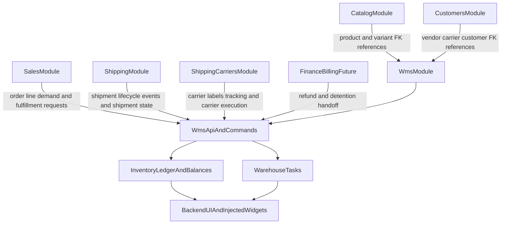

# WMS Roadmap Specification

| Field | Value |
|-------|-------|
| **Status** | Draft |
| **Author** | Cursor Agent |
| **Created** | 2026-04-15 |
| **Related** | Issue #388, SPEC-047, SPEC-022, ANALYSIS-009 |

## TLDR
**Key Points:**
- Build a new OSS `wms` module in `packages/core/src/modules/wms/` as the platform inventory and warehouse execution layer currently missing in Open Mercato.
- Deliver the module in five additive phases: core inventory, inbound/putaway, picking/packing, yard management, and returns/reverse logistics.
- Optional **consumed** upstream events are gated by tenant `wms_integration_*` feature toggles so WMS boots and core APIs work when Procurement/Freight/Billing/Finance are absent; subscribers no-op when disabled.
- **Ledger archival** (retention, tiering, purge-safe checkpoints) is deferred past phases 1–5 — see Deferred backlog in this document.
- Keep all cross-module integration contract-safe: FK IDs only, no direct ORM relations to `catalog`, `sales`, `shipping`, `shipping_carriers`, `customers`, or future finance modules.

**Scope:**
- Shared roadmap and architectural contract for phases 1-5 derived from issue `#388`
- Shared invariants for inventory balances, reservations, ledger, task orchestration, and cross-module APIs
- Direct integration boundaries for `catalog`, `sales`, `shipping`, `shipping_carriers`, `customers`, and `finance/billing`

**Concerns:**
- `sales` and `shipping` already own commercial fulfillment and shipment lifecycle concerns, so WMS must own physical execution without duplicating financial or document-calculation logic.
- Inventory writes are concurrency-sensitive and must define atomic mutation boundaries before implementation starts.

---

## Overview

Open Mercato currently has strong sales-document and shipment records, but no first-class warehouse or inventory engine. This blocks multi-location stock, reservation accuracy, inbound receiving, operational picking, yard orchestration, and reliable reverse logistics. The WMS roadmap introduces those capabilities as a dedicated core module while preserving the existing modularity rules of the monorepo.

The audience is platform contributors implementing the initial WMS foundation and later module developers extending or integrating with warehouse behavior. The document intentionally defines stable contracts early so that future connectors, UI widgets, and other business modules can integrate without schema rewrites.

> **Market Reference**: This roadmap borrows the phased maturity model from Odoo and ERPNext, the traceability and expiry discipline from OpenBoxes, and the integration-boundary discipline from OpenWMS-style modular systems. It explicitly rejects a monolithic "ERP-only" warehouse design that tightly couples warehouse records to sales and catalog ORM entities.

For shipment-facing integrations, this roadmap distinguishes two external boundaries:
- `shipping` owns shipment lifecycle records and events such as `shipping.shipment.created` / `shipping.shipment.dispatched`
- `shipping_carriers` owns carrier-facing execution such as labels, tracking, and carrier handoff workflows

## Problem Statement

The current platform gap is broader than "missing stock quantity":

1. There is no durable stock ledger that can answer where a quantity exists, why it changed, and which business process consumed it.
2. Sales fulfillment records track shipped and reserved quantities at the document level, but do not model physical warehouse execution such as putaway, picking, packing, yard movement, or returns inspection.
3. External integrations such as Magento MSI are blocked because Open Mercato has no source-of-truth inventory model.
4. The current codebase already anticipates future warehouse data injection into sales pages, but lacks the module that owns that data.

Without a roadmap-level contract, piecemeal implementation risks introducing:
- duplicate "stock" logic across `catalog`, `sales`, and integrations
- cross-module ORM coupling
- unstable event IDs and ad hoc APIs
- incompatible assumptions between early and late phases

## Proposed Solution

Introduce a new core module:

- **Module id**: `wms`
- **Package path**: `packages/core/src/modules/wms/`
- **Delivery model**: one module, five additive implementation phases

The module will own:
- physical warehouse topology
- product inventory profiles
- stock ledger and derived balances
- reservation and allocation orchestration
- inbound receiving and putaway execution
- outbound picking and packing execution
- yard operations
- reverse logistics and disposition workflows

The module will not own:
- catalog product pricing or product master data
- sales document math, tax calculation, or commercial order lifecycle
- carrier rate shopping, carrier execution, or primary shipment record ownership
- refund accounting or invoice creation

### Design Decisions

| Decision | Rationale |
|----------|-----------|
| One `wms` module for phases 1-5 | Matches the source issue, keeps early OSS implementation coherent, and avoids premature fragmentation before stable contracts exist |
| FK-only cross-module references | Required by platform rules and prevents hard coupling to `sales`, `catalog`, and `customers` schemas |
| Immutable movement ledger plus derived balances | Supports auditability, undoability, and future replays/backfills |
| Phase-specific APIs but shared invariants | Allows implementation to ship incrementally without redefining quantity semantics each time |
| WMS owns physical returns, `sales` keeps commercial returns/refunds | Avoids duplicating return-adjustment logic that already exists in `sales` |

### Deferred backlog (TODO — after phases 1–5)

Work intentionally **not** scheduled in the initial WMS roadmap; track in a follow-up specification when operational scale or compliance requires it.

| Item | Notes |
|------|--------|
| **Inventory ledger archival** | Long-running tenants will accumulate immutable `InventoryMovement` (and related) rows. **Archival** (retention policies, cold/offline storage, optional summary “checkpoint” rows, read path for historical queries, and safe purge of superseded detail) is **deferred**. Initial phases assume full ledger availability in the primary store; no breaking change to movement immutability semantics is implied by deferring archival mechanics. |

### Alternatives Considered

| Alternative | Why Rejected |
|-------------|-------------|
| Add stock fields directly to `catalog` variants | Too narrow; cannot support locations, movements, or warehouse execution |
| Put warehouse execution inside `sales` | Violates module separation and would overload sales with physical operations |
| Split returns into a separate module immediately | User requested phase 5 remain inside `wms`; separate extraction can remain a future option once contracts stabilize |

## User Stories / Use Cases

- **Warehouse manager** wants to configure warehouses, zones, and locations so that stock can be routed and counted accurately.
- **Operations user** wants to receive, store, pick, and pack physical inventory so that sales documents can be fulfilled with auditability.
- **Sales user** wants warehouse availability and assignment context on order pages so that fulfillment planning is visible without leaving the sales module.
- **Integrator** wants a stable inventory API and event model so that marketplaces, ERPs, or carrier services can react to warehouse activity safely.
- **Returns operator** wants to inspect returned goods and execute disposition decisions so that inventory, customer service, and finance stay aligned.

## Architecture

### Shared Architectural Rules

1. All WMS tables are tenant- and organization-scoped and include standard lifecycle columns.
2. Cross-module data is linked by IDs only; lookups happen in services, enrichers, or API composition layers.
3. Every mutation is modeled as a command with explicit undo behavior.
4. Long-running or high-cardinality operations move to workers once they exceed safe synchronous thresholds.
5. All route files export `openApi`.
6. UI integration into other modules uses response enrichers and widget injection rather than direct page edits where a stable injection surface exists.

### Commands & Events

#### Events Emitted by WMS

Inventory events:

| Event | Payload | Phase |
|-------|---------|-------|
| `wms.inventory.received` | warehouse_id, variant_id, quantity, lot_id, location_id | 1 |
| `wms.inventory.adjusted` | warehouse_id, variant_id, quantity_delta, reason | 1 |
| `wms.inventory.reserved` | warehouse_id, variant_id, quantity, source_type, source_id | 1 |
| `wms.inventory.released` | warehouse_id, variant_id, quantity, reservation_id | 1 |
| `wms.inventory.allocated` | warehouse_id, variant_id, quantity, reservation_id | 1 |
| `wms.inventory.moved` | warehouse_id, variant_id, from_location, to_location, quantity | 1 |
| `wms.inventory.low_stock` | warehouse_id, variant_id, quantity_available, reorder_point | 1 |

Task events:

| Event | Payload | Phase |
|-------|---------|-------|
| `wms.putaway.completed` | warehouse_id, task_id, variant_id, location_id | 2 |
| `wms.pick_wave.completed` | warehouse_id, pick_wave_id, lines_count | 3 |

Yard events:

| Event | Payload | Phase |
|-------|---------|-------|
| `wms.trailer.checked_in` | warehouse_id, trailer_id, appointment_id, carrier_id | 4 |
| `wms.trailer.checked_out` | warehouse_id, trailer_id, dwell_minutes | 4 |
| `wms.appointment.requested` | warehouse_id, appointment_id, type, carrier_id, scheduled_at | 4 |
| `wms.appointment.approved` | warehouse_id, appointment_id, dock_door_id | 4 |
| `wms.appointment.rejected` | warehouse_id, appointment_id, reason | 4 |
| `wms.yard_move.completed` | warehouse_id, trailer_id, from_location, to_location | 4 |
| `wms.detention.threshold_exceeded` | warehouse_id, trailer_id, dwell_minutes, estimated_charge | 4 |
| `wms.detention.charge_calculated` | warehouse_id, trailer_id, charge_id, amount, currency | 4 |

Returns events:

| Event | Payload | Phase |
|-------|---------|-------|
| `wms.rma.created` | warehouse_id, rma_id, rma_number, customer_id, order_id | 5 |
| `wms.rma.approved` | warehouse_id, rma_id, approved_by | 5 |
| `wms.rma.rejected` | warehouse_id, rma_id, rejection_reason | 5 |
| `wms.rma.completed` | warehouse_id, rma_id, refund_flag, refund_amount | 5 |
| `wms.return.received` | warehouse_id, rma_id, receipt_id, lines_count | 5 |
| `wms.return.inspected` | warehouse_id, rma_id, inspection_id, condition_grade, disposition | 5 |
| `wms.return.dispositioned` | warehouse_id, rma_id, inspection_id, disposition_type, quantity | 5 |

#### Events Consumed by WMS

| Event | Source Module | WMS Action | Phase |
|-------|-------------|------------|-------|
| `sales.order.confirmed` | Sales | Create inventory reservation for order items | 1 |
| `sales.order.cancelled` | Sales | Release all active reservations linked to the order | 1 |
| `procurement.goods_receipt.created` | Procurement | Create ASN or trigger receiving workflow | 2 |
| `shipping.shipment.created` | Shipping | Allocate reserved inventory against shipment demand | 3 |
| `shipping.shipment.dispatched` | Shipping | Reduce on-hand inventory, complete pick tasks | 3 |
| `freight.shipment.eta_updated` | Freight | Update yard appointment expected arrival | 4 |
| `billing.invoice.created` | Billing | Mark detention charge as invoiced | 4 |
| `finance.refund.processed` | Finance | Update RMA refund status | 5 |

#### Feature flags for consumed-event integrations

Some source modules or event streams may not exist yet on a given deployment (e.g. Procurement, Freight, Billing, Finance). WMS must **not** fail to boot, register routes, or run core flows when those subscribers would otherwise be no-ops or throw. Optional side effects driven by **consumed events** are therefore gated behind **feature toggles** from the platform `feature_toggles` module (boolean identifiers, tenant-scoped resolution via `FeatureTogglesService`).

**Design rules**

1. **Subscriber handlers stay registered** (predictable wiring, one code path). The **first step** in each handler resolves the toggle for the current tenant; if disabled, **return immediately** without error and without mutating WMS state.
2. **Missing toggle record** resolves like other platform toggles: treat as **disabled** (safe default for optional integrations) unless product explicitly seeds defaults otherwise.
3. **Core OSS path**: toggles for integrations that already exist in core (`sales`, `shipping`) default to **enabled** so out-of-the-box behavior matches the spec. Toggles for **not-yet-shipped** upstream modules default to **disabled** until those modules exist and operators enable them.
4. **Identifiers** use a single prefix `wms_integration_` and a stable suffix per integration *surface* (not per HTTP route). One flag may cover **multiple events** from the same logical integration.

**Toggle matrix (initial)**

| Toggle identifier | Events gated | Default | Notes |
|-------------------|--------------|---------|--------|
| `wms_integration_sales_order_inventory` | `sales.order.confirmed`, `sales.order.cancelled` | `true` | Disable only if reservations must be API-only (e.g. migration window). |
| `wms_integration_procurement_goods_receipt` | `procurement.goods_receipt.created` | `false` | Enable when Procurement emits this event. |
| `wms_integration_shipping_shipment_lifecycle` | `shipping.shipment.created`, `shipping.shipment.dispatched` | `true` | Disable if outbound handoff is manual or phased rollout. |
| `wms_integration_freight_shipment_eta` | `freight.shipment.eta_updated` | `false` | Enable when Freight module exists and emits ETAs. |
| `wms_integration_billing_invoice_sink` | `billing.invoice.created` | `false` | Enable when Billing links detention charges to invoices. |
| `wms_integration_finance_refund_sink` | `finance.refund.processed` | `false` | Enable when Finance confirms refund processing for RMA coordination. |

**Setup and operations**

- `setup.ts` (or tenant init): **seed** these toggle definitions with typed defaults; document env overrides only if the platform already uses env for feature toggles (prefer DB-backed toggles for per-tenant control).
- **Monitoring**: optional debug log at `debug` level when a handler exits early due to a disabled toggle (no user-facing error).
- **Tests**: integration tests for optional subscribers **mock or omit** upstream modules when the relevant toggle is off; with toggle on, assert WMS side effects only when the event payload contract is stable.

**Backward compatibility**: toggle **identifiers** are additive contract strings; do not rename once shipped. New integrations add **new** identifiers rather than overloading semantics of existing ones.

### Shared command families

Introduced across phases:

- Topology and inventory profile: `createWarehouse`, `updateWarehouse`, `createWarehouseZone`, `updateWarehouseZone`, `createLocation`, `updateLocation`, `createProductInventoryProfile`, `updateProductInventoryProfile`
- Inventory execution: `receiveInventory`, `reserveInventory`, `releaseReservation`, `allocateReservation`, `moveInventory`, `adjustInventory`, `cycleCountReconcile`
- Inbound and putaway: `createAsn`, `updateAsn`, `receiveAsnLine`, `closeAsn`, `createPutawayTask`, `assignPutawayTask`, `startPutawayTask`, `completePutawayTask`, `cancelPutawayTask`
- Outbound execution: `createPickWave`, `releasePickWave`, `assignPickTask`, `startPickTask`, `confirmPickTask`, `shortPickTask`, `cancelPickTask`, `createPackingTask`, `startPackingTask`, `completePackingTask`, `handoffPackedShipment`
- Yard configuration and trailer state: `createDockDoorType`, `updateDockDoorType`, `createDockDoor`, `updateDockDoor`, `updateDockDoorStatus`, `createYardLocationType`, `updateYardLocationType`, `createYardLocation`, `updateYardLocation`, `updateYardLocationStatus`, `createTrailer`, `updateTrailer`, `updateTrailerStatus`, `updateTrailerContents`
- Gate, appointments, and yard moves: `checkInTrailer`, `checkOutTrailer`, `createYardAppointment`, `updateYardAppointment`, `approveYardAppointment`, `rejectYardAppointment`, `cancelYardAppointment`, `markAppointmentNoShow`, `createYardMoveTask`, `assignYardMoveTask`, `startYardMoveTask`, `completeYardMoveTask`, `cancelYardMoveTask`, `optimizeYardMoveTasks`
- Detention: `createDetentionFeeRule`, `updateDetentionFeeRule`, `calculateDetentionCharge`, `waiveDetentionCharge`, `markDetentionInvoiced`
- Returns configuration and RMA lifecycle: `createReturnReason`, `updateReturnReason`, `createDispositionType`, `updateDispositionType`, `createConditionGrade`, `updateConditionGrade`, `createDispositionRule`, `updateDispositionRule`, `createRma`, `updateRma`, `addRmaLine`, `removeRmaLine`, `approveRma`, `rejectRma`, `cancelRma`, `markRmaInTransit`
- Returns receipt, inspection, and disposition: `createReturnReceipt`, `addReturnReceiptLine`, `createReturnInspection`, `overrideDisposition`, `executeDisposition`, `completeRma`

## Data Models

### Shared Entity Families

All WMS entities include the global columns: `id (uuid)`, `created_at`, `updated_at`, `deleted_at`, `tenant_id`, `organization_id`, `metadata (jsonb)`.

#### Warehouse topology
- `Warehouse`
- `WarehouseZone`
- `WarehouseLocation`

#### Inventory control
- `ProductInventoryProfile`
- `InventoryLot`
- `InventoryBalance`
- `InventoryReservation`
- `InventoryMovement`

#### Inbound execution
- `Asn`
- `ReceivingLine`
- `PutawayTask`

#### Outbound execution
- `PickWave`
- `PickTask`
- `PackingTask`

#### Yard operations
- `DockDoorType`
- `DockDoor`
- `YardLocationType`
- `YardLocation`
- `Trailer`
- `TrailerInventory`
- `GateTransaction`
- `YardAppointment`
- `YardMoveTask`
- `DetentionFeeRule`
- `DetentionCharge`

#### Reverse logistics
- `ReturnReason`
- `DispositionType`
- `ConditionGrade`
- `DispositionRule`
- `Rma`
- `RmaLine`
- `ReturnReceipt`
- `ReturnReceiptLine`
- `ReturnInspection`
- `ReturnDispositionLog`

### ACL Feature Matrix

| Feature ID | Phase | Description |
|------------|-------|-------------|
| `wms.view` | 1 | Read-only access to all WMS pages |
| `wms.manage_warehouses` | 1 | Create/edit warehouses |
| `wms.manage_locations` | 1 | Create/edit locations |
| `wms.manage_zones` | 1 | Create/edit warehouse zones |
| `wms.manage_inventory` | 1 | General inventory management |
| `wms.manage_reservations` | 1 | Create/release/allocate reservations |
| `wms.adjust_inventory` | 1 | Adjust inventory and execute moves |
| `wms.cycle_count` | 1 | Perform cycle count reconciliation |
| `wms.manage_asn` | 2 | Create/edit ASNs |
| `wms.receive_inventory` | 2 | Receive ASN lines and perform QC actions |
| `wms.manage_putaway` | 2 | Create/assign/complete putaway tasks |
| `wms.manage_pick_waves` | 3 | Create/release/manage pick waves |
| `wms.execute_picks` | 3 | Start/confirm/short individual pick tasks |
| `wms.manage_packing` | 3 | Create/complete packing tasks |
| `wms.print_labels` | 3 | Request carrier labels from packing context |
| `wms.manage_yard` | 4 | Manage dock doors, yard locations, and their types |
| `wms.manage_trailers` | 4 | Create/update trailers and trailer contents |
| `wms.gate_operations` | 4 | Perform gate check-in/check-out |
| `wms.manage_appointments` | 4 | Create/approve/reject/cancel yard appointments |
| `wms.execute_yard_moves` | 4 | Create/assign/start/complete yard move tasks |
| `wms.manage_detention` | 4 | Manage detention fee rules and calculate/waive charges |
| `wms.manage_returns_config` | 5 | Manage return reasons, disposition types, condition grades, rules |
| `wms.manage_rmas` | 5 | Create/update/approve/reject/cancel RMAs |
| `wms.receive_returns` | 5 | Receive return packages and add receipt lines |
| `wms.inspect_returns` | 5 | Perform inspections and override dispositions |
| `wms.execute_dispositions` | 5 | Execute disposition decisions (restock/scrap/RTV) |

### Inventory Strategy Rules

Reservation and allocation commands consume stock buckets according to the variant's `ProductInventoryProfile.default_strategy`:

| Strategy | Ordering Rule |
|----------|--------------|
| FIFO | Oldest `InventoryMovement.received_at` first |
| LIFO | Newest `InventoryMovement.received_at` first |
| FEFO | Earliest `InventoryLot.expires_at` first; fallback to FIFO when expiry is missing |

Respect `track_lot` / `track_serial` / `track_expiration` flags on the variant profile. `received_at` is the canonical stock-rotation timestamp for bucket ordering and is inherited from the original inbound receipt event/movement even when later operational movements occur.

### Shared Inventory Invariants

These rules apply in every phase:

1. `quantity_on_hand` is physical stock physically present and accepted by WMS.
2. `quantity_reserved` is demand earmarked for a source such as a sales order.
3. `quantity_allocated` is reserved quantity that has been bound to a concrete stock bucket for execution.
4. `quantity_available = quantity_on_hand - quantity_reserved - quantity_allocated`.
5. Lots, serials, and expiration constraints are enforced by `ProductInventoryProfile`.
6. `InventoryMovement` is append-only and is the auditable source of truth; `InventoryBalance` is a derived read model maintained transactionally.
7. Reservation and allocation commands must never drive available quantity below zero unless an explicit over-commit policy is introduced in a future spec.

### Shared Cross-Module Reference Rules

- `catalog_product_id`, `catalog_variant_id` reference `catalog` records by UUID only
- `source_id`, `reference_id`, `original_order_id`, `original_shipment_id` reference `sales` documents by UUID only
- `vendor_id`, `customer_id`, `carrier_id`, `requested_by_id` reference `customers` or future directory entities by UUID only
- No WMS entity stores embedded copies of foreign module documents beyond snapshots needed for operational UX or external document retention

## API Contracts

### Namespace and Route Strategy

All WMS APIs live under `/api/wms/**`.

- CRUD resources use `makeCrudRoute` with `indexer: { entityType }`
- CRUD resources should document **collection** and **member** paths explicitly (for example `GET|POST /api/wms/warehouses` plus `GET|PUT|DELETE /api/wms/warehouses/:id`) rather than shorthand `GET|POST|PUT|DELETE` on a single line
- custom write routes use mutation guards plus explicit command handlers
- all list APIs must default to `pageSize <= 100`
- exported response shapes may grow additively across phases, but existing fields and route URLs must remain stable

**Phase 1–3 REST alignment (canonical paths):**

- Balances listing: `GET /api/wms/inventory/balances` (nested under `inventory/`, consistent with `inventory/reserve`, `inventory/adjust`, etc.).
- Ledger and reservations lists: `GET /api/wms/inventory/movements`, `GET /api/wms/inventory/reservations` (same nested pattern; not `inventory-movements` / `inventory-reservations` as separate top-level segments).
- Cycle count: `POST /api/wms/inventory/cycle-count` (command `cycleCountReconcile`).
- ASN collection: `GET|POST /api/wms/asns`; receive: `POST /api/wms/asns/:id/receive`.
- Pick orchestration: `POST /api/wms/pick-waves/:id/release`; physical picks: `POST /api/wms/pick-tasks/:id/confirm` and `.../short` (not legacy `pick-waves/:id/assign|complete` only).
- Packing: collection `GET|POST /api/wms/packing-tasks`, member `GET|PUT|DELETE /api/wms/packing-tasks/:id`, and `POST /api/wms/packing-tasks/:id/complete`.

### Shared API Families by Phase

| Phase | API Families | URL Namespace |
|-------|--------------|---------------|
| 1 | warehouses, zones, locations, inventory-profiles, lots, balances, reservations, movements, adjustments | `/api/wms/*` |
| 2 | asns, receiving-lines, receiving actions, putaway tasks, barcode-scan-ready action routes | `/api/wms/*` |
| 3 | pick-waves, pick-tasks, packing-tasks, outbound ship confirmation routes | `/api/wms/*` |
| 4 | dock-door types, dock-doors, yard-location types, yard-locations, trailers, gate-transactions, appointments, yard-move tasks, detention charges | `/api/wms/yard/*` |
| 5 | return-reasons, disposition types, condition grades, disposition rules, rmas, return receipts, inspections, disposition execution | `/api/wms/returns/*` |

### Response Enrichment Contracts

The roadmap standardizes that WMS may enrich foreign CRUD responses when the target module opts in:

- `sales.order` and `sales.quote` detail/list APIs may expose `_wms.*` fields through response enrichers
- `sales.order.items` and `sales.quote.items` data tables may expose WMS stock context through injected columns
- `catalog.product` and `catalog.product_variant` edit/detail pages may surface WMS profile fields via injected form groups owned by WMS

## Internationalization (i18n)

WMS must ship its own locale keys for:
- warehouse topology labels and statuses
- inventory movement types and reservation states
- inbound, picking, packing, yard, and returns workflows
- all injected UI labels on `sales` and `catalog` pages
- operational errors such as insufficient stock, invalid lot, blocked dock door, or disposition mismatch

## UI/UX

The roadmap assumes a backend-first UI:

- use `CrudForm` for entity maintenance pages
- use `DataTable` for list/detail collections
- use response enrichers and injection widgets to expose WMS context inside `sales` and `catalog`
- keep mobile/scanner-ready APIs in scope before mobile-optimized UI shells

Primary backend areas by phase:
- phase 1: warehouses, locations, balances, movements, reservations
- phase 2: receiving console and putaway queue
- phase 3: picking and packing work queues
- phase 4: yard board, appointment list, dock and trailer views
- phase 5: RMA desk, return receipt, inspection, disposition workbench

## Migration & Compatibility

- This roadmap introduces a new module and additive APIs only; it does not rename or remove existing platform contracts.
- Existing `sales` and `catalog` APIs remain owners of their current records.
- All WMS enrichments must be additive (`_wms.*`) and opt-in on target CRUD routes.
- Public event IDs, ACL feature IDs, widget spot IDs, and API routes introduced by WMS become long-lived contracts on first release.
- Future extraction of returns into a separate module is explicitly out of scope for phases 1-5 and would require a dedicated migration spec.

## Implementation Plan

### Phase 1: Core Inventory
1. Create the module scaffold, ACL/setup/events/search/i18n foundations.
2. Implement warehouse topology and core inventory entities.
3. Implement the movement ledger, derived balances, reservations, and adjustment commands.
4. Add baseline admin UI and opt-in enrichers for sales/catalog surfaces.

### Phase 2: Inbound + Putaway
1. Add ASN and receiving models with QC-aware commands.
2. Add putaway tasks and rules.
3. Add receiving and putaway backend UI.
4. Emit inbound completion events that can trigger downstream reservation re-evaluation.

### Phase 3: Picking + Packing
1. Add pick waves/tasks and packing tasks.
2. Integrate outbound task execution with the sales/shipping shipment-ownership boundary.
3. Add carrier handoff hooks for labels and tracking.
4. Add operational dashboards for exceptions such as shorts.

### Phase 4: Yard Management
1. Add dock, yard, trailer, gate, appointment, and detention models.
2. Expose scheduling and yard-move workflows.
3. Emit detention and appointment lifecycle events for billing and carrier integrations.

### Phase 5: Returns / Reverse Logistics
1. Add RMA, receipt, inspection, and disposition models.
2. Integrate physical returns with sales return and finance refund workflows.
3. Support restock, scrap, RTV, and quarantine dispositions.

## Testing Strategy

This roadmap requires both module-local automated coverage and spec-level QA coverage. The target implementation should create module-local integration tests under `packages/core/src/modules/wms/__integration__/` and keep cross-module scenarios isolated by phase.

### Shared Coverage Rules

- Prefer API-backed fixture setup over seeded/demo data.
- Keep tests phase-local where possible; only add cross-phase scenarios when the contract explicitly spans phases.
- Every phase must have at least:
  - one happy-path API test for each custom action endpoint family
  - one UI test for the primary backend work queue or CRUD surface
  - one regression test derived from the highest-severity risk in that phase
  - one authorization test proving WMS ACL boundaries on the primary backend page or action route

### Planned Integration Coverage by Phase

| Phase | Minimum integration coverage |
|-------|------------------------------|
| 1 | warehouse/location CRUD, reserve/release/adjust/cycle-count happy paths, `_wms.*` enrichment on opted-in `sales`/`catalog`, insufficient-stock rejection, ACL denial |
| 2 | ASN create/receive/complete, QC fail path, putaway completion, scan endpoint resolution, sales reservation re-evaluation signal |
| 3 | pick-wave release, pick confirm, short pick, pack completion, shipment handoff, carrier-label failure retry path |
| 4 | trailer check-in/check-out, appointment approval conflict rejection, yard move completion, detention charge calculation, non-billing ownership boundary |
| 5 | RMA approve/receive/inspect/disposition, restock vs non-restock outcomes, refund-ready signal gating, serial/lot mismatch rejection |

### Cross-Phase Regression Coverage

The final implementation set should also include end-to-end regressions spanning multiple phases:

1. receive inventory -> reserve to order -> pick -> pack -> shipment handoff
2. receive inventory with lot tracking -> return same lot -> inspect -> restock with disposition log
3. inbound increase or return restock updates `_wms.*` projections on sales detail routes

## Risks & Impact Review

#### Inventory Race Conditions
- **Scenario**: Two concurrent reserve or allocate commands target the same balance bucket and both believe quantity is available.
- **Severity**: Critical
- **Affected area**: Phase 1 reservations, Phase 3 picking, all downstream availability APIs
- **Mitigation**: Use transactional command execution, deterministic lock order per balance bucket, and post-write balance assertions before commit.
- **Residual risk**: Hot SKUs may still require retry behavior under contention; acceptable because retries are simpler than eventual consistency corrections.

#### Sales and WMS Ownership Drift
- **Scenario**: WMS starts persisting commercial shipment or return state that conflicts with `sales` ownership.
- **Severity**: High
- **Affected area**: `sales` order detail pages, shipment reporting, return accounting
- **Mitigation**: Keep WMS as the physical execution layer only, with explicit integration tables/events and additive `_wms.*` enrichment on sales APIs.
- **Residual risk**: Some implementers may still try to shortcut via direct sales entity mutation; acceptable if phase specs keep ownership rules explicit.

#### Ledger and Balance Divergence
- **Scenario**: A command writes an `InventoryMovement` row but fails before the derived `InventoryBalance` update is persisted.
- **Severity**: Critical
- **Affected area**: Availability APIs, reservation validation, replenishment triggers
- **Mitigation**: Commands update ledger and derived balances inside the same atomic transaction; reconciliation tooling is planned from phase 1 onward.
- **Residual risk**: Manual DB tampering or failed migrations can still create drift; acceptable because reconciliation remains available as an operator repair tool.
- **Ledger growth / retention**: Archiving old ledger detail to secondary storage is **out of scope** for phases 1–5; see **Deferred backlog — Inventory ledger archival**.

#### Event Storms From Operational Automation
- **Scenario**: High-volume receives, picks, or yard moves emit cascades of events that overwhelm notifications, indexers, or integrations.
- **Severity**: Medium
- **Affected area**: Event bus, workers, integrations, UI freshness
- **Mitigation**: Keep event payloads lean, batch non-critical subscribers, and use workers for heavy fan-out tasks rather than synchronous hooks.
- **Residual risk**: Very high throughput tenants may need later throttling or partitioning; acceptable for initial OSS rollout.

#### Returns Scope Creep
- **Scenario**: Phase 5 starts absorbing refund, credit memo, or accounting logic already handled by `sales` and future finance modules.
- **Severity**: High
- **Affected area**: WMS returns UX, sales returns APIs, finance integration expectations
- **Mitigation**: Phase 5 owns only physical reverse logistics plus refund handoff signals and references.
- **Residual risk**: Business stakeholders may request all-in-one returns UX; acceptable if orchestration remains cross-module rather than duplicative.

## Final Compliance Report — 2026-04-15

### AGENTS.md Files Reviewed
- `AGENTS.md`
- `.ai/specs/AGENTS.md`
- `packages/core/AGENTS.md`
- `packages/core/src/modules/sales/AGENTS.md`

### Compliance Matrix

| Rule Source | Rule | Status | Notes |
|-------------|------|--------|-------|
| root AGENTS.md | No direct ORM relationships between modules | Compliant | Roadmap mandates FK IDs only |
| root AGENTS.md | Always filter by organization_id for tenant-scoped entities | Compliant | Declared for all WMS tables and APIs |
| root AGENTS.md | Validate all inputs with zod | Compliant | Each phase requires validators in `data/validators.ts` |
| root AGENTS.md | Writes must use command pattern | Compliant | Commands are first-class in every phase |
| packages/core/AGENTS.md | API routes MUST export `openApi` | Compliant | Standardized as a shared WMS rule |
| packages/core/AGENTS.md | Response enrichers must namespace fields | Compliant | Foreign responses use additive `_wms.*` fields |
| packages/core/src/modules/sales/AGENTS.md | Sales owns shipments and returns records | Compliant | WMS roadmap keeps physical execution separate from commercial ownership |

### Internal Consistency Check

| Check | Status | Notes |
|-------|--------|-------|
| Data models match API contracts | Pass | API families map directly to entity families |
| API contracts match UI/UX section | Pass | Backend areas correspond to phase APIs |
| Risks cover all write operations | Pass | Inventory, orchestration, and cross-module writes covered |
| Commands defined for all mutations | Pass | All mutation families are command-driven |
| Cache strategy covers all read APIs | Pass | Query/index expectations are standardized for CRUD APIs and enrichers |

### Non-Compliant Items

None.

### Verdict

- **Fully compliant**: Approved — ready for implementation

## Changelog

### 2026-04-15 (rev 9)
- Clarified external boundaries: `shipping` owns shipment lifecycle/events, while `shipping_carriers` owns carrier execution (labels, tracking, handoff)
- Expanded `Shared command families` into a fuller cross-phase index so the roadmap no longer under-represents phase 4-5 and return-lifecycle commands

### 2026-04-15 (rev 8)
- Clarified that phase specs should document CRUD APIs as explicit `collection` and `member` routes, not shorthand
- Aligned roadmap inventory strategy wording with issue #388: FIFO/LIFO use `received_at` as the canonical stock-rotation timestamp

### 2026-04-15 (rev 7)
- Added **Deferred backlog**: inventory **ledger archival** explicitly TODO for a post-roadmap spec (retention, cold storage, read path); linked from Ledger risk

### 2026-04-15 (rev 6)
- Added **Feature flags for consumed-event integrations**: `wms_integration_*` toggles (via `feature_toggles`), subscriber contract (early return when disabled), defaults for optional upstream modules, setup/testing notes

### 2026-04-15 (rev 5)
- Aligned return command names with phase 5 / issue #388: `createReturnReceipt`, `addReturnReceiptLine`, `createReturnInspection` (replaced roadmap shorthand `receiveReturn`, `inspectReturn`)

### 2026-04-15 (rev 4)
- Phase 1 list APIs unified: `GET /api/wms/inventory/movements`, `GET /api/wms/inventory/reservations` (nested under `inventory/`, same pattern as `inventory/balances`); documented in REST alignment block

### 2026-04-15 (rev 3)
- Documented canonical phase 1–3 REST paths: `inventory/balances`, `inventory/cycle-count`, `asns` + `:id/receive`, pick-wave `release` + `pick-tasks` actions, `packing-tasks`
- Testing strategy wording: cycle-count instead of generic “reconcile” for phase 1 coverage

### 2026-04-15 (rev 2)
- Added full event registry (emitted + consumed) with payloads and phase mapping
- Added ACL feature matrix (26 features across all phases)
- Added inventory strategy rules (FIFO/LIFO/FEFO with `performed_at`/`expires_at` ordering)
- Added `metadata (jsonb)` global entity column note
- Updated API namespace: `/api/wms/yard/*` for phase 4, `/api/wms/returns/*` for phase 5
- Expanded shared command families with ~15 additional commands from phases 4-5

### 2026-04-15
- Initial roadmap specification for the WMS module phases 1-5

### Review — 2026-04-15
- **Reviewer**: Agent
- **Security**: Passed
- **Performance**: Passed
- **Cache**: Passed
- **Commands**: Passed
- **Risks**: Passed
- **Verdict**: Approved
