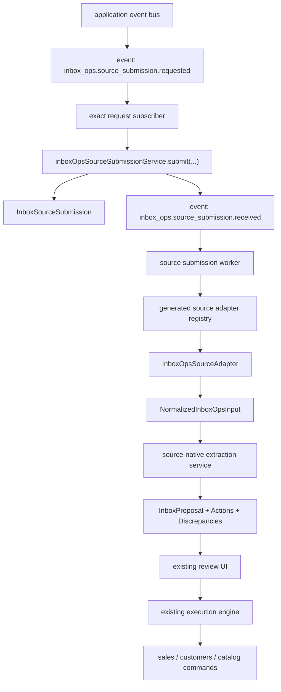

# InboxOps Source-Oriented Input

| Field | Value |
|-------|-------|
| **Status** | Implemented |
| **Created** | 2026-04-18 |
| **Module** | `inbox_ops` |
| **Related** | `AGENTS.md`, `packages/core/AGENTS.md`, `packages/shared/AGENTS.md`, `packages/events/AGENTS.md`, `.ai/specs/AGENTS.md`, `SPEC-037-2026-02-15-inbox-ops-agent.md`, `SPEC-053-2026-03-03-inbox-ops-phase-2.md`, `2026-04-17-inbox-ops-multi-channel-ingestion.md`, `2026-04-18-phone-calls-module.md`, `SPEC-045d-communication-notification-hubs.md` |

## TLDR
**Key Points:**
- Refactor `inbox_ops` intake around a source-native contract so proposal extraction no longer assumes `InboxEmail` as the universal source record.
- Introduce a generic source linkage model from day one: `sourceEntityType` + `sourceEntityId` + optional `sourceArtifactId`, plus a new internal intake entity `InboxSourceSubmission`.
- Keep proposal review, discrepancy handling, and action execution intact; this first step is an internal `inbox_ops` foundation for future `communication_channels`, `phone_calls`, and other source modules.

**Scope:**
- Define source-oriented shared contracts, generated registries, and internal intake orchestration for `inbox_ops`.
- Add a new `InboxSourceSubmission` entity and source-link fields on proposals.
- Preserve legacy email ingress and current proposal pages/APIs while moving extraction to a source-native path.
- Do **not** connect real non-email source modules yet; future specs will register concrete adapters and emit the public InboxOps request event from `communication_channels`, `phone_calls`, and others.

**Concerns:**
- The current `inbox_ops` extraction pipeline is explicitly email-shaped, so the first step must avoid breaking existing email tenants.
- A poorly designed intake seam would force another major refactor once `phone_calls` and `communication_channels` become first-class sources.

**Resolved Decisions:**

| Decision | Choice | Rationale |
|----------|--------|-----------|
| Compatibility strategy | Introduce a source-native extraction contract immediately; keep `InboxEmail` only for legacy email compatibility ingress | Avoids baking email assumptions into the new core |
| Canonical source identity | `sourceEntityType` + `sourceEntityId` + optional `sourceArtifactId` from day one | Supports message, call, and future non-message sources without a second refactor |
| First-step scope | Internal `inbox_ops` refactor only | Keeps blast radius controlled; future specs can connect concrete upstream modules |
| Event handling model | One explicit `inbox_ops.source_submission.requested` event submits source descriptors into InboxOps | Keeps ingestion explicit and avoids wildcard/event-name coupling in `inbox_ops` |
| Extension seam | Source modules emit the request event and export source adapters; `inbox_ops` consumes only the adapter registry | Keeps source-specific loading/mapping logic outside `inbox_ops` |

## Implementation Status

| Phase | Status | Date | Notes |
|-------|--------|------|-------|
| Phase 1 — Shared contracts and registry generation | Done | 2026-04-18 | Added `@open-mercato/shared/modules/inbox-ops-sources`, CLI generator support, and generated `inbox-ops-sources.generated.ts` |
| Phase 2 — Source submission persistence and lifecycle | Done | 2026-04-18 | Added `InboxSourceSubmission`, submission service, lifecycle events, and migration `Migration20260418132408.ts` |
| Phase 3 — Source-native extraction core | Done | 2026-04-18 | Moved extraction onto source submissions, normalized input, and source-context-aware prompt building |
| Phase 4 — Explicit request event and legacy email adapter | Done | 2026-04-19 | Replaced wildcard trigger dispatch with `inbox_ops.source_submission.requested` and kept legacy email/manual adapters |
| Phase 5 — Proposal source linkage and API compatibility | Done | 2026-04-18 | Proposal read APIs expose additive source linkage; manual extract now returns `sourceSubmissionId` with deprecated `emailId` alias |
| Phase 6 — Hardening and regression coverage | Done | 2026-04-19 | Updated unit/regression coverage for request subscriber, submission service, extract route, legacy email ingress, and generator output |

### 2026-04-18
- Implemented source-native InboxOps contracts in `packages/shared`, including descriptors, request payloads, adapters, normalized input, and prompt-hint schemas.
- Added CLI generation support for `inbox-ops-sources.ts` and verified the new generated registry contract in snapshot/structural/module-subset tests.
- Added `InboxSourceSubmission`, proposal source-link fields, and the InboxOps migration/snapshot updates required for source-native persistence.
- Reworked InboxOps extraction to claim `InboxSourceSubmission` rows, resolve source adapters, persist normalized snapshots, and preserve legacy email side effects only when a legacy email source exists.
- Updated `POST /api/inbox_ops/extract`, proposal list/detail reads, email reprocess, and inbound webhook emissions to preserve compatibility while carrying source-native linkage.
- Verified the change with targeted Jest suites, `yarn generate`, and package-level typechecks via `yarn exec tsc --noEmit -p packages/{core,shared,events,cli}/tsconfig.json`.
- Finalized the adapter contract with resolver context injection (`loadSource/buildInput/buildPromptHints/buildSnapshot(..., ctx)`) so source-owned adapters can load their own data without InboxOps importing source-module internals.

### 2026-04-19
- Simplified InboxOps ingestion by replacing wildcard trigger dispatch with one public request event: `inbox_ops.source_submission.requested`.
- Removed trigger definitions from the shared/source-generator contract; `inbox-ops-sources.generated.ts` now aggregates adapters only.
- Updated manual extract, inbound email webhook, and email reprocess flows to emit the explicit request event while preserving legacy email events for backward compatibility.
- Added a dedicated request subscriber that validates the request payload and delegates idempotent persistence to `submitSourceSubmission(...)`.

## Overview

`inbox_ops` currently bundles source ingestion, normalization, extraction, review, and execution inside one email-first workflow. A forwarded email becomes `InboxEmail`, a persistent subscriber extracts business intent from the email thread, and operators review the resulting actions before they mutate business modules.

That design shipped the initial InboxOps MVP successfully, but it does not scale cleanly to new source types. A communication-hub message, a phone-call transcript, or a future operational artifact should enter InboxOps through a stable source contract, not by pretending to be an email record.

This specification introduces that contract as the first architectural step:

- source modules can emit one explicit InboxOps request event
- source modules can define how their records are loaded and normalized
- `inbox_ops` gains a generic intake entity and a source-native worker
- legacy email remains supported through a legacy adapter rather than as the permanent core abstraction

> **Market Reference**: Front, Intercom, Zendesk, and Gong all separate source ingestion from workflow/execution state. Open Mercato should adopt the same separation while preserving its human-in-the-loop proposal review model. We adopt source-specific adapters plus a normalized intake contract. We reject source-specific AI engines and we reject keeping email as the permanent universal abstraction.

## Problem Statement

The current InboxOps architecture has five concrete limitations:

1. `InboxProposal` is anchored to `InboxEmail`, so email is the only first-class persisted source.
2. The extraction worker listens only to `inbox_ops.email.received`, forcing every future source either to duplicate the pipeline or to materialize a fake email.
3. The extraction prompt and schemas are explicitly email-centric, including assumptions about thread shape and participant email addresses.
4. Future source modules such as `communication_channels` and `phone_calls` would require `inbox_ops` to know their internals unless a formal adapter seam exists.
5. The current event-driven story does not define one stable ingestion contract that future sources can target without adding source-specific branches in `inbox_ops`.

If these issues are not solved first, every future source integration will drift toward one of three bad outcomes:

- duplicated extraction/orchestration logic
- permanent compatibility hacks around synthetic `InboxEmail`
- a later breaking refactor touching proposals, APIs, and review UI all at once

## Proposed Solution

Introduce a source-native intake layer that sits between upstream module events and the existing InboxOps proposal engine.

The first step consists of seven parts:

1. **Shared source contracts**
   Add narrow shared interfaces and zod schemas for descriptors, request payloads, adapters, and normalized input.
2. **Generated source registries**
   Allow modules to export `inbox-ops-sources.ts`, then generate a runtime registry of source adapters.
3. **Explicit request event**
   Add one public event, `inbox_ops.source_submission.requested`, that source modules and legacy InboxOps entrypoints emit with a source descriptor plus optional normalized seed data.
4. **New intake entity**
   Add `InboxSourceSubmission` as the canonical internal record for source submissions, idempotency, processing state, and normalized snapshots.
5. **Source-native extraction worker**
   Add a new worker path that claims `InboxSourceSubmission`, resolves the source adapter, builds `NormalizedInboxOpsInput`, and creates proposals/actions/discrepancies.
6. **Legacy email adapter**
   Keep `InboxEmail` only for legacy email compatibility ingress. Email records are converted into source submissions via the same new path.
7. **Central prompt builder with source hints**
   Keep final prompt construction inside `inbox_ops`, while allowing source adapters to return small declarative prompt hints that help render source-specific context safely.

### Design Decisions

| Decision | Rationale |
|----------|-----------|
| `InboxSourceSubmission` becomes the canonical extraction intake record | Provides one internal lifecycle for all future source types |
| `InboxEmail` remains only as a legacy source record | Preserves current email workflows without forcing future sources into email shape |
| Explicit request event is the public ingress contract | Keeps source-to-InboxOps coupling obvious and removes wildcard/event-name dependence from `inbox_ops` |
| Adapter registry remains separate from event ingress | Source loading/normalization is still a different responsibility from event emission |
| Source adapters are source-owned and InboxOps-consumed | `inbox_ops` must not import source-module internals directly |
| Final prompt ownership stays in `inbox_ops` | Source modules may return structured prompt hints, but they must not generate full prompts |
| Source semantics use open vocabulary strings, not closed core enums | New source kinds, participant roles, channels, and evidence labels must not require core edits |
| This step does not add `SourcePolicy` or `InboxCandidate` | Candidate/policy rollout belongs to a later integration spec, not the internal seam spec |

### Alternatives Considered

| Alternative | Why Rejected |
|-------------|-------------|
| Keep InboxOps email-only and let each source build its own proposal engine | Duplicates review/execution logic and weakens consistency |
| Make `communication_channels` the universal mandatory source contract immediately | Does not cover `phone_calls` and future non-message sources cleanly enough |
| Add one subscriber per upstream event directly in the extraction worker | Couples the worker to source-specific events and scales poorly |
| Use a wildcard `inbox_ops` subscriber plus trigger lookup map | Adds avoidable event-name coupling and requires `inbox_ops` to observe unrelated traffic |
| Keep synthetic `InboxEmail` as the compatibility bridge for all future sources | Creates long-term technical debt and blocks source-native extraction |
| Replace the whole review UI/API in the same release | Too much BC risk for a first step |

## User Stories / Use Cases

- **Platform engineer** wants InboxOps to support future sources without rewriting the extraction worker each time.
- **Source module developer** wants to expose an InboxOps adapter from `phone_calls` or `communication_channels` without importing `@open-mercato/core/src/modules/inbox_ops`.
- **Existing InboxOps tenant** wants current email forwarding to keep working while the internal architecture becomes source-native.
- **Future phone-calls implementation** wants a call transcript to enter InboxOps through a typed adapter, not through a fake email thread.
- **Future communication-hub implementation** wants inbound messages to submit descriptors into InboxOps through events, not through hardcoded message-specific branches.

## Architecture



### Ownership Boundary

**`packages/shared` owns:**
- source contract interfaces and zod schemas
- no domain logic, only reusable infrastructure contracts

**Source modules own:**
- emitting `inbox_ops.source_submission.requested` when a source becomes extraction-ready
- source adapters for their own entity types
- loading and normalizing their own entities/artifacts

**`inbox_ops` owns:**
- request subscriber and source submission service
- source submission service and worker lifecycle
- normalized extraction pipeline
- proposal/action/discrepancy lifecycle
- review UI and business action execution

### Event Handling Model

The event handling model is deliberately two-stage:

1. **Event -> descriptor**
   A source-aware entrypoint emits `inbox_ops.source_submission.requested` with an `InboxOpsSourceDescriptor` and optional seed data.
2. **Descriptor -> normalized input**
   The source submission worker resolves the source adapter by `sourceEntityType` and asks it to load and normalize source data.

This means `inbox_ops` does **not** iterate all adapters on every event and does **not** need wildcard/event-name logic just to ingest sources.

Request subscriber rules:

- `metadata = { event: 'inbox_ops.source_submission.requested', persistent: true, id: 'inbox_ops:source-submission-requested' }`
- validate the payload against the shared request schema
- create or get a source submission; do not call the LLM in the request subscriber
- remain idempotent under retries

### Source Submission Request Contract

Every source-aware entrypoint emits a payload shaped like:

```ts
interface InboxOpsSourceSubmissionRequested {
  submissionId?: string
  descriptor: InboxOpsSourceDescriptor
  legacyInboxEmailId?: string | null
  metadata?: Record<string, unknown> | null
  initialNormalizedInput?: NormalizedInboxOpsInput | null
  initialSourceSnapshot?: Record<string, unknown> | null
}
```

Expected usage:

- manual text submitters may provide `initialNormalizedInput` and `initialSourceSnapshot`
- legacy email ingress typically provides only `descriptor` plus `legacyInboxEmailId`
- future source modules emit this event when their own record is extraction-ready

### Source Adapter Contract

Each source module may export source adapters:

```ts
export interface InboxOpsSourceAdapter<TLoaded = unknown> {
  sourceEntityType: string
  loadSource(args: InboxOpsSourceDescriptor): Promise<TLoaded>
  assertReady?(loaded: TLoaded, args: InboxOpsSourceDescriptor): Promise<void>
  getVersion?(loaded: TLoaded, args: InboxOpsSourceDescriptor): string | null
  buildInput(loaded: TLoaded, args: InboxOpsSourceDescriptor): Promise<NormalizedInboxOpsInput>
  buildPromptHints?(loaded: TLoaded, args: InboxOpsSourceDescriptor): Promise<InboxOpsSourcePromptHints | null>
  buildSnapshot?(loaded: TLoaded, args: InboxOpsSourceDescriptor): Promise<Record<string, unknown> | null>
}
```

Adapter responsibilities:

- load source-owned entities and artifacts
- verify source readiness for extraction
- map source data into `NormalizedInboxOpsInput`
- optionally describe source-specific prompt semantics through `InboxOpsSourcePromptHints`
- optionally create a small source snapshot for audit/UI

Adapter non-responsibilities:

- calling the LLM
- building full system or user prompts
- creating proposals
- executing business actions
- mutating target business modules

### Submission and Extraction Flow

1. Some source-aware entrypoint emits `inbox_ops.source_submission.requested`.
2. The exact-match request subscriber validates the payload.
3. `inboxOpsSourceSubmissionService.submit(...)` computes a dedup key and upserts `InboxSourceSubmission`.
4. If the submission is new, InboxOps emits `inbox_ops.source_submission.received`.
5. A dedicated source submission worker claims the row (`received -> processing`).
6. The worker resolves the source adapter from the generated adapter registry.
7. The adapter loads the source, checks readiness, computes source version, builds normalized input, and returns a source snapshot.
8. The worker persists normalized input, normalized source metadata, and snapshot on the submission row.
9. The worker optionally resolves `InboxOpsSourcePromptHints` from the adapter.
10. The worker calls the source-native extraction service.
11. The extraction service builds central prompts from normalized input, prompt hints, and inbox-action metadata, then creates `InboxProposal`, `InboxProposalAction`, and `InboxDiscrepancy`.
12. The worker stores `proposalId` on the submission row, marks it `processed`, and emits `inbox_ops.source_submission.processed`.

### Prompt Construction Model

Prompt construction remains a central `inbox_ops` responsibility.

The worker flow is:

1. Source adapter builds `NormalizedInboxOpsInput`.
2. Source adapter may optionally return `InboxOpsSourcePromptHints`.
3. `inbox_ops` builds an internal extraction context from:
   - normalized source input
   - prompt hints
   - allowed actions from generated `inbox-actions`
   - matched contacts, catalog/product hints, and other existing deterministic enrichments
4. `inbox_ops` renders one `systemPrompt` and one `userPrompt` for the LLM.

Responsibilities are strict:

- source modules own source loading and normalization
- source modules may provide only structured prompt hints
- `inbox_ops` owns final prompt rendering, safety rules, output schema instructions, and action availability
- `inbox-actions` modules continue to contribute payload schemas and action-specific prompt rules, not full prompts

This keeps prompt safety and behavior centralized while still letting different source types describe their semantics.

Open-vocabulary rule:

- `NormalizedInboxOpsInput` and `InboxOpsSourcePromptHints` must not use closed enums for source-owned semantics
- `inbox_ops` may interpret a few conventional values when present, but it must accept and preserve unknown strings
- adding a new participant role, source kind, channel type, evidence label, or direction label must not require editing `inbox_ops`
- zod validators should enforce only shape, length, and serializability bounds for these fields, not exhaustive value sets

Recommended convention:

- keep shared conventional values short and lowercase where practical, for example `text`, `markdown`, `html`, `inbound`, `outbound`, `email`, `message`
- for module-specific semantics, prefer namespaced tokens when ambiguity is possible, for example `phone_calls:voicemail` or `communication_channels:thread_summary`

Example rendered `source_context` block:

```txt
<source_context>
Source type: phone_calls:phone_call
Source label: phone call
Source kind: call transcript
Primary evidence: timeline, body
Participant identity mode: phone-first
Reply support: none
- Do not assume email-specific fields are available.
- Prefer transcript timeline over inferred summaries when reconstructing intent.
</source_context>
```

That block is rendered by the central prompt builder from `InboxOpsSourcePromptHints`; it is not raw prompt text owned by the source module.

### Registry Generation

This step introduces a new optional module file:

- `src/modules/<module>/inbox-ops-sources.ts`

Exports:

```ts
export const inboxOpsSourceAdapters: InboxOpsSourceAdapter[] = [...]
```

The generator aggregates these into:

- `apps/mercato/.mercato/generated/inbox-ops-sources.generated.ts`

This follows the same general pattern as generated inbox-action registries:

- source modules declare local configuration
- the generator produces a central registry
- `inbox_ops` consumes the generated output without importing source-module internals directly

Run `yarn generate` after adding or modifying any `inbox-ops-sources.ts` export.

### Commands & Events

Internal commands:

- `inbox_ops.source_submission.submit`
- `inbox_ops.source_submission.mark_processing`
- `inbox_ops.source_submission.mark_processed`
- `inbox_ops.source_submission.mark_failed`

Legacy compatibility commands/events remain unchanged:

- `inbox_ops.email.received`
- `inbox_ops.email.processed`
- `inbox_ops.email.failed`
- proposal/action/reply events

New internal events:

- `inbox_ops.source_submission.requested`
- `inbox_ops.source_submission.received`
- `inbox_ops.source_submission.processed`
- `inbox_ops.source_submission.failed`
- `inbox_ops.source_submission.deduplicated`

Undo contract:

- source submission creation is additive and not user-undoable; duplicates are prevented through idempotent submit
- source submission lifecycle transitions are system operations; failed submissions are recoverable by retry/requeue, not by business undo
- target business mutations remain governed by existing action execution and target-module command undo rules

## Data Models

### Shared Contracts

These contracts live in `@open-mercato/shared` because source modules must be able to implement them without importing domain logic from `@open-mercato/core`.

```ts
interface InboxOpsSourceDescriptor {
  sourceEntityType: string
  sourceEntityId: string
  sourceArtifactId?: string
  sourceVersion?: string
  tenantId: string
  organizationId: string
  requestedByUserId?: string | null
  triggerEventId?: string
}

interface NormalizedInboxOpsInput {
  sourceEntityType: string
  sourceEntityId: string
  sourceArtifactId?: string
  sourceVersion?: string
  title?: string
  body: string
  bodyFormat: string
  participants: Array<{
    identifier: string
    displayName?: string
    email?: string
    phoneNumber?: string
    role?: string
  }>
  timeline?: Array<{
    timestamp?: string
    actorIdentifier: string
    actorLabel?: string
    direction?: string
    text: string
  }>
  attachments?: Array<{
    kind?: string
    fileName?: string
    mimeType?: string
    url?: string
    extractedText?: string
  }>
  capabilities: {
    canDraftReply: boolean
    replyChannelType?: string
    canUseTimelineContext: boolean
  }
  facts?: Record<string, string | number | boolean | null>
  sourceMetadata?: Record<string, unknown>
}

interface InboxOpsSourcePromptHints {
  sourceLabel: string
  sourceKind: string
  primaryEvidence: string[]
  participantIdentityMode: string
  replySupport: string
  extraInstructions?: string[]
}
```

Bounds enforced in zod validators:

- `body` limited by `INBOX_OPS_MAX_TEXT_SIZE` and hard-capped at 200KB
- `bodyFormat`, participant `role`, timeline `direction`, `replyChannelType`, `sourceKind`, `participantIdentityMode`, and `replySupport` are open strings with length caps rather than closed enums
- `participants` max 50
- `timeline` max 200 entries
- `attachments` max 50 entries
- `primaryEvidence` max 10 entries and each label max 100 chars
- `facts` and `sourceMetadata` must remain shallow serializable objects, not unbounded nested blobs
- `extraInstructions` max 10 entries and each entry max 300 chars

### InboxSourceSubmission

New table: `inbox_source_submissions`

- `id`: UUID
- `sourceEntityType`: text, format `module:entity`, singular entity
- `sourceEntityId`: UUID
- `sourceArtifactId`: UUID nullable
- `sourceVersion`: text nullable
- `sourceDedupKey`: text unique
- `triggerEventId`: text nullable
- `status`: `'received' | 'processing' | 'processed' | 'failed' | 'deferred'`
- `legacyInboxEmailId`: UUID nullable
- `normalizedTitle`: text nullable
- `normalizedBody`: text nullable
- `normalizedBodyFormat`: text nullable
- `normalizedParticipants`: JSON nullable
- `normalizedTimeline`: JSON nullable
- `normalizedAttachments`: JSON nullable
- `normalizedCapabilities`: JSON nullable
- `facts`: JSON nullable
- `normalizedSourceMetadata`: JSON nullable
- `sourceSnapshot`: JSON nullable
- `processingError`: text nullable
- `proposalId`: UUID nullable
- `requestedByUserId`: UUID nullable
- `metadata`: JSON nullable
- `isActive`: boolean
- `organizationId`: UUID
- `tenantId`: UUID
- standard timestamps and soft delete

Persistence rule:

- `normalizedSourceMetadata` stores the normalized copy of `NormalizedInboxOpsInput.sourceMetadata` for audit and retry/debug purposes
- `sourceSnapshot` remains a smaller source-owned UI/audit snapshot and does not replace normalized source metadata

Indexes:

- unique on `sourceDedupKey`
- index on `(organizationId, tenantId, status, createdAt)`
- index on `(organizationId, tenantId, sourceEntityType, sourceEntityId)`
- index on `proposalId`
- index on `legacyInboxEmailId`

Dedup key:

- computed from `sourceEntityType`, `sourceEntityId`, `sourceArtifactId`, and effective `sourceVersion`
- when `sourceVersion` is absent, the adapter must provide a stable fallback or the service must derive one from persisted normalized input hash

### InboxProposal Additions

`InboxProposal` gains additive nullable fields:

- `sourceSubmissionId`: UUID nullable
- `sourceEntityType`: text nullable
- `sourceEntityId`: UUID nullable
- `sourceArtifactId`: UUID nullable
- `sourceVersion`: text nullable
- `sourceSnapshot`: JSON nullable

`InboxProposal.inboxEmailId` becomes nullable for new source-native proposals. It remains populated for:

- existing legacy proposals
- future legacy email proposals

Indexes:

- index on `sourceSubmissionId`
- index on `(organizationId, tenantId, sourceEntityType, sourceEntityId)`

### InboxProposalAction

No new top-level action fields are required in this first step.

Existing fields remain the execution truth:

- `actionType`
- `payload`
- `requiredFeature`
- `createdEntityId`
- `createdEntityType`
- `matchedEntityId`
- `matchedEntityType`

Action metadata may include additive source trace fields when useful, but proposal-level linkage remains canonical.

### InboxEmail Compatibility Role

`InboxEmail` remains:

- the raw email persistence model for legacy email ingress
- the legacy source entity behind `sourceEntityType = 'inbox_ops:inbox_email'`

`InboxEmail` is no longer the canonical extraction intake abstraction for future source types.

## API Contracts

### Legacy Email Webhook

`POST /api/inbox_ops/webhook/inbound`

External contract:

- unchanged request and response behavior
- unchanged signature validation and dedup logic

Internal behavior change:

- still persists `InboxEmail`
- emits `inbox_ops.source_submission.requested` for the extraction pipeline
- still emits `inbox_ops.email.received`
- the request event carries a descriptor equivalent to:

```ts
{
  descriptor: {
    sourceEntityType: 'inbox_ops:inbox_email',
    sourceEntityId: emailId,
  },
  legacyInboxEmailId: emailId,
}
```

### Manual Text Extraction

`POST /api/inbox_ops/extract`

Request:

```json
{
  "text": "string",
  "title": "string?",
  "metadata": {}
}
```

Phase-1 behavior:

- does **not** need to create `InboxEmail`
- creates `InboxSourceSubmission` directly
- uses internal source identity:

```ts
{
  sourceEntityType: 'inbox_ops:source_submission',
  sourceEntityId: submissionId
}
```

Response:

```json
{
  "ok": true,
  "sourceSubmissionId": "uuid",
  "emailId": "uuid"
}
```

Compatibility note:

- `emailId` is retained as a deprecated opaque tracking alias for one minor version
- for this route only, `emailId` aliases `sourceSubmissionId`
- callers must migrate to `sourceSubmissionId`

### Proposal Read APIs

`GET /api/inbox_ops/proposals`

Additive response fields per item:

- `sourceEntityType: string | null`
- `sourceEntityId: string | null`
- `sourceSubmissionId: string | null`

`GET /api/inbox_ops/proposals/:id`

Additive response block:

```json
{
  "source": {
    "sourceSubmissionId": "uuid | null",
    "sourceEntityType": "string | null",
    "sourceEntityId": "uuid | null",
    "sourceArtifactId": "uuid | null",
    "sourceVersion": "string | null",
    "sourceSnapshot": {}
  },
  "legacyInboxEmailId": "uuid | null"
}
```

Backward compatibility:

- existing consumers relying on `inboxEmailId` continue to work for legacy email proposals
- new source-native proposals may have `legacyInboxEmailId = null`

### Internal Source Submission API

No new operator-facing source-submission API is required in this first step.

Internal services and commands own:

- idempotent submit
- claim for processing
- mark processed
- mark failed

## Internationalization (i18n)

This step intentionally avoids new operator-facing screens.

Minimal additions:

- internal status labels under `inbox_ops.source_submission.*` for future diagnostics/admin tooling
- deprecation/compatibility error strings for `/api/inbox_ops/extract`

All user-facing strings must still go through InboxOps locale files.

## UI/UX

There is no new InboxOps operator UI in this first step.

UI compatibility rules:

- existing proposal list and detail pages must keep working for legacy email proposals
- the email thread panel remains email-only in Phase 1
- source-native proposal rendering for non-email sources is deferred to later specs

Read-model changes in this step are additive only:

- list/detail APIs expose source linkage
- existing pages may ignore those new fields until future source-specific UI work lands

## Configuration

No new environment variables are required in this first step.

Existing InboxOps limits still apply:

- `INBOX_OPS_MAX_TEXT_SIZE`
- `INBOX_OPS_LLM_TIMEOUT_MS`
- `INBOX_OPS_CONFIDENCE_THRESHOLD`
- existing provider/model resolution envs

## Migration & Compatibility

### Database Migration

Required migration steps:

1. Create `inbox_source_submissions`
2. Add additive nullable source-link fields to `inbox_proposals`
3. Make `inbox_proposals.inbox_email_id` nullable
4. Add new indexes and unique constraint on `sourceDedupKey`

A follow-up compatibility migration covers only legacy records that could get stuck during rollout:

- existing `InboxSourceSubmission` rows for legacy email sources in `received` / `processing` are marked failed with an explicit retry message
- orphan legacy `InboxEmail` rows still in `received` / `processing` get a minimal failed `InboxSourceSubmission` only when they have none yet
- historical `InboxProposal` rows are left unchanged; read layers continue to use `inboxEmailId` fallback for pre-source-submission history

### Backward Compatibility Strategy

- `InboxEmail` routes remain intact
- legacy `inbox_ops.email.*` events remain declared for contract stability, but new runtime processing no longer emits them
- proposal read APIs are additive-only
- `POST /api/inbox_ops/extract` keeps its URL and retains deprecated `emailId` in the response for one minor version
- new optional module file `inbox-ops-sources.ts` is additive and does not affect existing modules

### Generator Compatibility

Adding source adapters requires:

- generator support for the new optional export file
- `yarn generate` after every registry change

Existing modules without `inbox-ops-sources.ts` remain unaffected.

## Implementation Plan

### Phase 1: Shared Contracts And Registry Generation
1. Add shared interfaces and zod schemas for source descriptors, request payloads, adapters, and normalized input in `@open-mercato/shared`.
2. Add support for `inbox-ops-sources.ts` optional module exports.
3. Generate `inbox-ops-sources.generated.ts`.
4. Register only legacy InboxOps-owned source adapters in the first iteration.

**Testable**: Generator output contains legacy email/manual adapters and can be imported without domain-package cycles.

### Phase 2: Source Submission Persistence And Lifecycle
1. Add `InboxSourceSubmission` entity, validators, migration, and indexes.
2. Add internal commands/events for submission lifecycle.
3. Add `inboxOpsSourceSubmissionService.submit(...)` with dedup-key upsert semantics.
4. Add one source-submission worker that claims rows atomically and updates lifecycle states.

**Testable**: Submitting the same descriptor twice yields one row and one processing path.

### Phase 3: Source-Native Extraction Core
1. Extract the current email-specific worker logic into a reusable source-native extraction service.
2. Add central prompt building from normalized input + prompt hints + inbox-action metadata.
3. Add support for normalized participants without requiring email addresses.
4. Update prompts and output validators to remove email-only assumptions.
5. Persist normalized snapshots on `InboxSourceSubmission` before proposal creation.

**Testable**: The worker can build a proposal from a normalized submission without reading `InboxEmail` directly.

### Phase 4: Explicit Request Event And Legacy Email Adapter
1. Add `inbox_ops.source_submission.requested` as the public InboxOps ingress event.
2. Add an exact-match request subscriber in `inbox_ops`.
3. Keep legacy email and manual submission adapters inside `inbox_ops`.
4. Wire manual extract, legacy email ingress, and email reprocess into the request event and the new worker path.

**Testable**: Current email webhook flow still produces proposals through the new source-native pipeline.

### Phase 5: Proposal Source Linkage And API Compatibility
1. Add source-link fields to `InboxProposal`.
2. Keep `inboxEmailId` compatibility for legacy reads.
3. Expose additive source fields on proposal list/detail APIs.
4. Update `/api/inbox_ops/extract` to submit source-native records and return `sourceSubmissionId`.

**Testable**: Existing proposal pages still work for legacy email, and new source linkage is visible in API responses.

### Phase 6: Hardening, Documentation, And Regression Tests
1. Add unit tests for request payload validation, dedup key generation, and adapter contract enforcement.
2. Add integration tests for legacy email ingress through the source-native path.
3. Add a synthetic non-email test adapter to prove that `InboxEmail` is no longer structurally required.
4. Update changelogs and release notes for extract-route response deprecation.

**Testable**: One integration test creates a proposal without any `InboxEmail` row.

### File Manifest

| File | Action | Purpose |
|------|--------|---------|
| `packages/shared/src/modules/inbox-ops-sources/*` | Create | Shared contracts and validators |
| `packages/core/src/modules/inbox_ops/data/entities.ts` | Modify | Add `InboxSourceSubmission` and proposal source fields |
| `packages/core/src/modules/inbox_ops/data/validators.ts` | Modify | Source-native normalized input/output schemas |
| `packages/core/src/modules/inbox_ops/events.ts` | Modify | Add source-submission events |
| `packages/core/src/modules/inbox_ops/subscribers/source-submission-requested.ts` | Create | Explicit source-submission request subscriber |
| `packages/core/src/modules/inbox_ops/subscribers/source-submission-worker.ts` | Create | Source-native worker |
| `packages/core/src/modules/inbox_ops/lib/source-submission-service.ts` | Create | Idempotent submit orchestration |
| `packages/core/src/modules/inbox_ops/lib/source-registry.ts` | Create | Runtime lookup around generated registry |
| `packages/core/src/modules/inbox_ops/lib/extractionPrompt.ts` | Modify | Build central prompts from normalized input, source prompt hints, and inbox-action metadata |
| `packages/core/src/modules/inbox_ops/inbox-ops-sources.ts` | Create | Legacy email and manual submission adapters |
| `packages/core/src/modules/inbox_ops/api/extract/route.ts` | Modify | Submit source-native records |
| generator files in `packages/cli` / generation pipeline | Modify | Aggregate source adapters |

### Testing Strategy

- Unit: request payload validation and exact subscriber dispatch
- Unit: source submission dedup key generation and idempotent upsert
- Unit: adapter contract validation (`assertReady`, `buildInput`, bounds)
- Unit: prompt builder renders source-context blocks from `buildPromptHints(...)`, preserves unknown/open-vocabulary string values, and works without required email fields
- Integration: legacy email webhook path still creates proposals
- Integration: manual extract path creates source submission and proposal without `InboxEmail`
- Integration: duplicate events do not produce duplicate source submissions or proposals
- Integration: proposal APIs expose source linkage additively

## Risks & Impact Review

#### Duplicate submissions from repeated or overlapping events
- **Scenario**: the same source entity emits multiple upstream events or the persistent subscriber retries, creating duplicate submissions and duplicate proposals.
- **Severity**: High
- **Affected area**: source submission pipeline, proposal creation, AI cost
- **Mitigation**: unique `sourceDedupKey`, idempotent `submit(...)`, atomic claim updates on `InboxSourceSubmission`, one proposal per submission row
- **Residual risk**: if upstream modules emit genuinely distinct source versions without stable versioning, duplicates may still appear; future source adapters must define stable version semantics

#### Explicit request contract is skipped by a future source module
- **Scenario**: a future source module persists its own record but forgets to emit `inbox_ops.source_submission.requested`, so InboxOps never sees the source.
- **Severity**: Medium
- **Affected area**: source integration completeness, operational automation
- **Mitigation**: the public request event is explicit in the contract, legacy entrypoints use the same path, and integration tests should assert event emission for every new source adapter
- **Residual risk**: future integrations still need discipline; missing emission will fail silently unless covered by tests/monitoring

#### Cross-tenant leakage through source adapters
- **Scenario**: an adapter loads source data without enforcing trusted `tenantId` and `organizationId`, exposing one tenant's source content to another.
- **Severity**: Critical
- **Affected area**: source loading, proposal generation, PII
- **Mitigation**: `InboxOpsSourceDescriptor` always carries trusted scope, adapters must query with tenant/org filters, the submission service and worker pass only trusted scope from the event bus or route context
- **Residual risk**: a buggy future source adapter can still violate the contract; adapter review and regression tests remain necessary

#### Source not ready when the trigger fires
- **Scenario**: an upstream event such as call finalization arrives before the transcript or other artifact needed for extraction is actually available.
- **Severity**: Medium
- **Affected area**: future phone call and multi-stage source integrations
- **Mitigation**: adapters can `assertReady(...)`; worker can mark the submission `deferred` instead of failing hard; later source versions or later trigger events can re-submit safely
- **Residual risk**: source modules must still choose sensible “extraction-ready” events or trigger too early too often

#### Backward compatibility regression in proposal reads
- **Scenario**: making `inboxEmailId` nullable or adding source-native read fields breaks existing proposal pages or integrations that assume every proposal has an email.
- **Severity**: High
- **Affected area**: proposal APIs, proposal detail page, existing InboxOps tenants
- **Mitigation**: additive API fields only, `inboxEmailId` remains present for legacy rows, non-email proposal UI is deferred, extract-route deprecation is explicit
- **Residual risk**: internal code paths that were never written defensively around nullable `inboxEmailId` must still be audited during implementation

#### Source-native storage growth
- **Scenario**: normalized source snapshots, timelines, and large transcripts cause storage growth and slow processing over time.
- **Severity**: Medium
- **Affected area**: database size, worker throughput, backup size
- **Mitigation**: hard size limits on body/timeline/attachments, shallow metadata only, no unbounded nested JSON, keep raw source artifacts in source modules rather than duplicating everything inside `inbox_ops`
- **Residual risk**: transcript-heavy future sources may still require archival or retention rules in later specs

#### Hidden coupling between InboxOps and source modules
- **Scenario**: `inbox_ops` starts importing source-module entities or services directly, violating module isolation and making optional-module behavior fragile.
- **Severity**: High
- **Affected area**: module isolation, generator/runtime coupling
- **Mitigation**: adapters are exported by source modules, contracts live in `packages/shared`, registries are generated, and `inbox_ops` consumes only generated definitions plus DI
- **Residual risk**: implementation shortcuts can still reintroduce direct imports if not reviewed carefully

## Final Compliance Report — 2026-04-18

### AGENTS.md Files Reviewed
- `AGENTS.md` (root)
- `packages/core/AGENTS.md`
- `packages/shared/AGENTS.md`
- `packages/events/AGENTS.md`
- `.ai/specs/AGENTS.md`

### Compliance Matrix

| Rule Source | Rule | Status | Notes |
|-------------|------|--------|-------|
| root `AGENTS.md` | No direct ORM relationships between modules | Compliant | Source links use IDs and adapters; no cross-module ORM relations are introduced |
| root `AGENTS.md` | Always filter by `organization_id` for tenant-scoped entities | Compliant | Descriptor, submission, and adapter flows all require trusted tenant/org scope |
| root `AGENTS.md` | Use DI to inject services; avoid direct `new` | Compliant | Registries and services are resolved through generated registries and DI |
| root `AGENTS.md` | Event IDs use `module.entity.action` | Compliant | New events use `inbox_ops.source_submission.*` |
| root `AGENTS.md` | API route URLs stable; response fields additive-only | Compliant | Existing routes stay; proposal APIs add fields only; extract route keeps deprecated alias |
| `packages/core/AGENTS.md` | API routes MUST export `openApi` | Compliant | Spec keeps this requirement for touched routes |
| `packages/core/AGENTS.md` | Subscribers export `metadata` and stay focused | Compliant | Wildcard dispatcher and source worker are separate focused subscribers |
| `packages/core/AGENTS.md` | Run `yarn generate` after generator-discovered changes | Compliant | Required for new `inbox-ops-sources.ts` exports and event changes |
| `packages/shared/AGENTS.md` | MUST NOT add domain-specific logic to shared | Compliant | Shared package contains only contracts and validators, no InboxOps domain behavior |
| `packages/shared/AGENTS.md` | Export narrow interfaces | Compliant | Contracts are narrow (`Descriptor`, `TriggerDefinition`, `Adapter`, `NormalizedInput`) |
| `packages/events/AGENTS.md` | Persistent subscribers must be idempotent | Compliant | Dedup key + atomic claim semantics are specified |
| `packages/events/AGENTS.md` | MUST keep subscribers focused | Compliant | Wildcard subscriber only dispatches; worker handles source loading and extraction |
| `.ai/specs/AGENTS.md` | Spec must include TLDR, Overview, Problem Statement, Proposed Solution, Architecture, Data Models, API Contracts, Risks, Compliance, Changelog | Compliant | All required sections are present |

### Internal Consistency Check

| Check | Status | Notes |
|-------|--------|-------|
| Data models match API contracts | Pass | `InboxSourceSubmission` and proposal source fields align with new and additive API responses |
| API contracts match UI/UX section | Pass | No new operator UI is promised; read-model changes are additive only |
| Risks cover all write operations | Pass | Submit, process, and compatibility ingress risks are covered |
| Commands defined for all mutations | Pass | Source submission lifecycle commands are explicitly defined |
| Cache strategy covers all read APIs | Pass | No new read-heavy endpoints are introduced in this step; existing caches remain valid |

### Non-Compliant Items

None.

### Verdict

- **Fully compliant**: Approved — ready for implementation

## Changelog
### 2026-04-19
- Replaced wildcard trigger dispatch with the explicit `inbox_ops.source_submission.requested` ingress event.
- Simplified the generator/shared contract so `inbox-ops-sources.ts` exports only source adapters.
- Updated the legacy email webhook, email reprocess flow, and manual extract flow to publish the request event while preserving legacy email events for backward compatibility.

### 2026-04-18
- Initial skeleton created for the first-step InboxOps source-oriented input refactor.
- Resolved the architecture toward source-native input, generic source linkage, source adapter registries, and `InboxSourceSubmission`.
- Added `InboxOpsSourcePromptHints` and `buildPromptHints(...)` so source modules can supply declarative source semantics while final prompt construction remains centralized in `inbox_ops`.
- Replaced closed enums in `NormalizedInboxOpsInput` and `InboxOpsSourcePromptHints` with open-vocabulary string fields so new source kinds, roles, channels, and evidence labels do not require core edits.

### Review — 2026-04-18
- **Reviewer**: Agent
- **Security**: Passed
- **Performance**: Passed
- **Cache**: Passed
- **Commands**: Passed
- **Risks**: Passed
- **Verdict**: Approved
