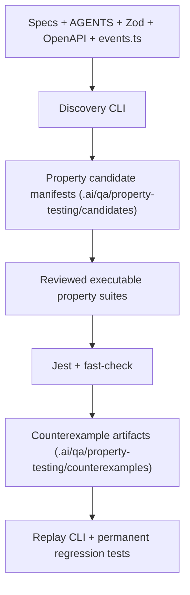

# Agentic Property-Based Testing for Open Mercato

**Date:** 2026-04-24  
**Status:** Draft  
**Scope:** OSS QA and developer tooling  
**Related:** `.ai/qa/AGENTS.md`, `.ai/specs/implemented/SPEC-027-2026-02-08-integration-testing-automation.md`, `.ai/specs/SPEC-050-2026-02-20-catalog-unit-tests.md`, `.ai/specs/2026-04-14-llm-provider-ports-and-adapters.md`

## TLDR

**Key Points:**

- Add a property-based testing layer for Open Mercato using `fast-check`, starting with deterministic domain logic and state-machine-heavy infrastructure.
- Introduce a spec-informed discovery workflow that mines invariants from `AGENTS.md`, `.ai/specs/`, Zod schemas, OpenAPI metadata, typed events, and module guides, but keep CI deterministic and independent from AI.
- Convert minimized failing counterexamples into stable Jest regressions so property testing improves the permanent test suite instead of becoming a one-off experiment.

**Scope:**

- Property-testing foundation for Jest-based packages
- First-party invariant suites for `shared`, `catalog`, `sales`, `currencies`, and `workflows`
- CLI tooling for replaying seeds, targeting scopes, and generating candidate property manifests
- Counterexample artifact format and promotion workflow

**Concerns:**

- Poorly chosen generators can create noisy failures and slow CI
- Agent-generated properties can overfit docs or infer the wrong semantics
- Stateful domains like workflows need model-based testing, not only input fuzzing

## Overview

Open Mercato already documents many business and platform invariants more explicitly than a typical codebase. The root `AGENTS.md`, module guides, `.ai/specs/`, Zod validators, typed events, `openApi` exports, ACL declarations, and backward-compatibility contract together form a large body of structured intent. This spec proposes turning that intent into executable invariants.

The feature is intentionally split into two layers:

1. A deterministic property-testing foundation that runs in local development and CI.
2. An agent-assisted discovery workflow that proposes candidate invariants and produces replayable artifacts, without making CI depend on an LLM.

> **Market Reference**: Studied Hypothesis, `fast-check`, jqwik, and the stateful-testing patterns used in property-heavy ecosystems such as smart-contract fuzzers. Adopted seed replay, shrinking, model-based command testing, and artifact capture. Rejected an AI-only design where the model both invents and judges correctness, because Open Mercato needs deterministic, reviewable tests with low false-positive cost.

## Problem Statement

Open Mercato already has strong example-based unit tests and integration tests, but several high-value bug classes remain awkward to cover with hand-written examples:

1. **Priority and specificity bugs** in pricing and selection logic where one extra row or a different row order can change the outcome.
2. **Accounting and totals regressions** in sales calculations where edge-case inputs interact in non-obvious ways.
3. **Wildcard RBAC and query-filter regressions** where helper behavior should satisfy algebraic properties, not just a handful of examples.
4. **Workflow state-machine regressions** where retries, pauses, compensation, and async resumes create a large combinatorial space.
5. **Contract-surface drift** where code remains internally valid but violates documented invariants in specs, guides, or backward-compatibility rules.

The repo also lacks a standard way to capture and reuse minimized counterexamples. When a randomized or agent-assisted test finds a failure, the result should become a durable regression, not a transient debug artifact.

## Proposed Solution

Introduce a repository-wide property-testing system called **spec-informed property testing**.

### Core principles

| Decision | Rationale |
|----------|-----------|
| Use `fast-check` + `@fast-check/jest` as the runtime engine | TypeScript-native, Jest-friendly; `it.prop()` is the canonical suite style for this repo to prevent stylistic drift |
| Keep CI deterministic | CI runs checked-in property suites only, with fixed budgets and replayable seeds |
| Property bodies must be pure over declared inputs | All time, randomness, and external I/O MUST flow through explicit generators or injected fakes — otherwise seed replay is not reproducible |
| Run property suites in the Jest pipeline only | No browser-level fuzzing in Phase 1-4; Playwright coverage stays on the existing integration-test flow |
| Treat AI as discovery, not oracle | Agent-generated candidate properties require human review before promotion, and must route through the approved LLM provider layer (`2026-04-14-llm-provider-ports-and-adapters`) |
| Start with pure and service-level logic | Highest signal and lowest flake risk compared to browser-first fuzzing |
| Store counterexamples as artifacts | Failures should be reproducible, reviewable, and promotable to permanent tests |

### What gets built

1. **Property test foundation**
   - Shared helpers for seeded execution, domain arbitraries, failure reporting, and replay commands
   - A dedicated `yarn test:properties` entry point with scope filtering

2. **Curated invariant suites**
   - `shared`: feature matching, boolean and ID parsing, query narrowing
   - `catalog`: pricing selection and specificity ordering
   - `sales`: line and document totals, adjustment behavior, monotonic totals
   - `currencies`: exchange-rate constraints and amount precision invariants
   - `workflows`: model-based state transitions, idempotent resume/retry behavior, event-log consistency

3. **Discovery pipeline**
   - A CLI command that reads specs, guides, Zod schemas, event declarations, and selected code to propose candidate properties
   - Candidate manifests stored in the repo for review before becoming executable tests

4. **Counterexample promotion**
   - A standard JSON artifact for minimized failures
   - A developer workflow (via `mercato test:properties:promote`) to replay a failing seed, confirm intent, and convert it into a stable Jest regression — Playwright promotion is out of scope because property suites are Jest-only in this spec

### Alternatives Considered

| Alternative | Why Rejected |
|-------------|--------------|
| Example-based tests only | Cannot efficiently cover the combinatorics of pricing, totals, and workflow transitions |
| Full AI-generated test suite in CI | Too much false-positive risk and too little determinism |
| Browser-level fuzzing as Phase 1 | High flake risk and weak shrinkability compared to service-level properties |
| Module-specific ad hoc fuzz scripts | Would fragment conventions and prevent seed replay, artifact reuse, and shared helper adoption |

## User Stories / Use Cases

- **Core maintainer** wants to **change pricing or totals logic** so that **priority and arithmetic regressions are caught by generated inputs instead of customer reports**.
- **Platform maintainer** wants to **change RBAC or CRUD filtering helpers** so that **wildcard and narrowing rules are validated algebraically, not only with examples**.
- **Workflow maintainer** wants to **refactor execution internals** so that **state-machine properties detect illegal transitions and duplicate side effects**.
- **Spec author** wants to **turn written architectural rules into executable invariants** so that **the docs and the test suite reinforce each other**.
- **Developer investigating a failure** wants to **replay a counterexample from a saved seed or artifact** so that **debugging is deterministic and fast**.

## Architecture

The system is divided into four layers.



### Layer 1: Property runtime

- Add `fast-check` to the workspace dev dependencies.
- Provide shared helpers under `packages/shared/src/lib/testing/property/`.
- Reuse Jest as the execution runner to avoid parallel test infrastructure.

### Layer 2: Domain arbitraries and assertions

- Add focused arbitraries next to domains or in shared testing helpers.
- Prefer small, composable generators over giant “valid document” generators.
- Keep generators aligned with documented invariants, not accidental implementation details.

### Layer 3: Curated property suites

Executable suites live with the code they protect:

- `packages/shared/src/**/__tests__/*.property.test.ts`
- `packages/core/src/modules/<module>/**/__tests__/*.property.test.ts`

Each suite:

- declares the invariant in prose at the top of the test file
- uses deterministic seeds and bounded run counts in CI
- emits replay instructions when a counterexample is found

#### Test-runner isolation

Property suites MUST NOT run as part of the default `yarn test` invocation, to keep the normal feedback loop fast and to isolate property-specific flake budgets.

- Root Jest config (or per-package overrides) MUST add `"**/*.property.test.ts"` to `testPathIgnorePatterns` for the default `test` project.
- A dedicated Jest project invoked by `yarn test:properties` MUST set `testMatch: ["**/*.property.test.ts"]` and apply bounded run-count configuration.
- The distinction MUST be documented in `.ai/qa/AGENTS.md` alongside the existing unit/integration guidance.

### Layer 4: Discovery and artifacts

The discovery CLI reads repo intent and proposes candidate properties. It does not directly mutate the executable test suite. Instead it writes candidate manifests for human review.

Expected inputs:

- `AGENTS.md` files
- `.ai/specs/` and `.ai/specs/enterprise/`
- `data/validators.ts`
- `events.ts`
- route `openApi` exports and schema metadata
- targeted implementation files for context

Expected outputs:

- candidate property manifest
- supporting evidence list
- suggested generator strategy (optional — omitted in heuristics-only fallback mode)
- suggested target test file

#### LLM integration

Discovery MUST route all LLM calls through the approved provider layer defined in `.ai/specs/2026-04-14-llm-provider-ports-and-adapters.md`. It MUST NOT hard-code provider SDKs, bake in API keys, or call external services directly. A discovery run with no configured provider MUST degrade to a heuristics-only mode that still scans specs/validators/events and emits candidate skeletons without generator strategies.

#### Candidate ranking heuristic

Candidates are ranked by a scoring function combining these signals (descending priority):

1. **Evidence density** — number of distinct `sourceKind` citations backing the invariant (spec + validator + event + code > code only).
2. **Invariant determinism** — pure-function and service-layer invariants rank above model-based suggestions.
3. **Blast radius** — invariants citing pricing, totals, RBAC narrowing, or workflow transitions rank above cosmetic rules.
4. **Generator tractability** — invariants whose inputs already have arbitraries in `packages/shared/src/lib/testing/property/` rank above those needing new generators.

The ranking implementation MUST be a checked-in pure function so reviewers can reproduce rankings offline.

#### Evidence rules

Each `evidence[].excerptSummary` MUST be a direct excerpt of the source (quoted lines, Zod schema fragment, event ID string, or `AGENTS.md` rule line) — never a paraphrase. The CLI MUST reject a candidate whose evidence cannot be re-located in the cited `sourcePath` at discovery time. This guards against AI paraphrase drift (Risks §Noisy Candidate Properties).

#### Manifest validation

Candidate manifests and counterexample artifacts MUST be validated with a zod schema before being written or read. Schemas live in `packages/shared/src/lib/testing/property/schemas.ts` and are the single source of truth — the TypeScript types in the Data Models section are `z.infer` derivations.

### Initial invariant catalog

Every invariant below MUST cite a source rule in the evidence of the resulting candidate manifest. The `Source` column points to the authoritative contract.

| Area | Example invariants | Source |
|------|--------------------|--------|
| `shared/security/features` | Access is monotonic as grants are added; `*` grants everything; `module.*` matches `module` and nested members but not partial prefixes | `packages/shared/AGENTS.md` (feature matching) + `packages/core/src/modules/auth/AGENTS.md` |
| `shared/lib/crud/ids` | `mergeIdFilter()` never widens results; parsing is idempotent; duplicates and junk input cannot create extra IDs | `packages/shared/src/lib/crud/ids.ts` + existing `ids.test.ts` |
| `catalog/lib/pricing` | Adding non-matching rows does not change the selected price; permutations of candidate rows do not change the winner when one row is strictly most specific | `packages/core/src/modules/catalog/AGENTS.md` → `selectBestPrice` contract |
| `sales/lib/calculations` | Increasing discount cannot increase grand total; return adjustments cannot increase grand total; `outstandingAmount = max(grand - paid + refunded, 0)` | `packages/core/src/modules/sales/AGENTS.md` → document math contract |
| `currencies/services` | `exchangeRateService.getRate({ from: X, to: X })` throws "Cannot get exchange rate for the same currency"; future-date lookup is rejected; recorded amounts preserve 4-decimal precision | `packages/core/src/modules/currencies/services/exchangeRateService.ts:63` + `packages/core/src/modules/currencies/AGENTS.md` |
| `workflows/lib` (steps) | Step transitions MUST follow `PENDING → ACTIVE → COMPLETED\|FAILED\|SKIPPED\|CANCELLED`; out-of-order transitions are rejected | `packages/core/src/modules/workflows/AGENTS.md` rule 3 |
| `workflows/lib` (instances) | Instance transitions MUST follow `RUNNING → COMPLETED\|FAILED\|CANCELLED` with intermediate `PAUSED`, `WAITING_FOR_ACTIVITIES`, `COMPENSATING`; resume/retry is idempotent; every state mutation is preceded by an event log entry | `packages/core/src/modules/workflows/AGENTS.md` rules 4 & 6 |

### Commands & Events

This feature does not introduce domain commands or public business events in Phase 1-3.

Developer-facing CLI commands are introduced instead:

- `yarn test:properties`
- `yarn test:properties --scope <package-or-module>`
- `yarn mercato test:properties:discover --scope <target>`
- `yarn mercato test:properties:replay --artifact <path>`
- `yarn mercato test:properties:promote --artifact <path> --target <test-path>`

## Data Models

This feature does not add database entities. It adds file-based contracts for testing and artifact management.

### Property Candidate Manifest

Stored under `.ai/qa/property-testing/candidates/<date>-<slug>.json`.

```ts
type PropertyCandidateManifest = {
  id: string
  title: string
  status: 'candidate' | 'accepted' | 'rejected' | 'implemented'
  target: {
    package: string
    module?: string
    file?: string
  }
  invariant: string
  evidence: Array<{
    sourcePath: string
    sourceKind: 'agents' | 'spec' | 'validator' | 'event' | 'openapi' | 'code'
    excerptSummary: string
  }>
  generatorStrategy?: string
  suggestedTestPath: string
  notes?: string
}
```

### Counterexample Artifact

Stored under `.ai/qa/property-testing/counterexamples/<suite>/<timestamp>.json`.

**Lifecycle policy:**

- The `.ai/qa/property-testing/counterexamples/` directory is `.gitignore`d and is local-only by default.
- Counterexamples that need to travel between developers MUST be promoted to a permanent Jest regression via `mercato test:properties:promote` before leaving a developer's worktree. The promoted regression is the durable artifact; raw JSON is never committed.
- CI MUST NOT write counterexample artifacts by default; `--write-artifacts` is opt-in for local investigation only.
- The `.ai/qa/property-testing/candidates/` directory IS committed — candidate manifests are the review unit for Phase 4 and must be visible in PRs.

```ts
type CounterexampleArtifact = {
  suiteId: string
  propertyName: string
  seed: number
  path?: string
  failingInputSummary: string
  failingInputJson: unknown
  invariant: string
  createdAt: string
  sourceCommit?: string
  promotedRegressionPath?: string | null
}
```

### Property Suite Registry Entry

Optional generated metadata used by the CLI to list suites and replay targets.

```ts
type PropertySuiteRegistryEntry = {
  id: string
  package: string
  module?: string
  testPath: string
  category: 'pure' | 'service' | 'model'
  tags: string[]
}
```

## API Contracts

No HTTP API changes are required in Phase 1-3.

The public contracts for this feature are CLI and file-output based.

### `yarn test:properties`

- Purpose: Run checked-in property suites
- Inputs:
  - `--scope <string>` optional package or module filter
  - `--seed <number>` optional deterministic replay seed
  - `--path <string>` optional test path filter
- Outputs:
  - standard Jest output
  - replay instructions when a property fails
  - optional counterexample artifact when `--write-artifacts` is enabled

### `yarn mercato test:properties:discover`

- Purpose: Generate candidate property manifests from specs and code
- Inputs:
  - `--scope <string>` required target module, package, or file
  - `--sources <csv>` optional source kinds to include
  - `--limit <number>` optional max candidates
- Outputs:
  - candidate manifest files
  - markdown summary to stdout

### `yarn mercato test:properties:replay`

- Purpose: Replay a known failing seed or artifact
- Inputs:
  - `--artifact <path>` or `--seed <number> --path <test-path>`
- Outputs:
  - deterministic re-execution of the failing property

### `yarn mercato test:properties:promote`

- Purpose: Convert a local counterexample artifact into a permanent Jest regression
- Inputs:
  - `--artifact <path>` — path to the counterexample JSON
  - `--target <test-path>` — existing `.test.ts` file to append the regression to, or a new path to create
- Outputs:
  - Generated/appended Jest `it(...)` that asserts the invariant on the minimized input
  - Updated artifact with `promotedRegressionPath` filled in
- Notes:
  - MUST refuse to run if the artifact fails zod validation
  - MUST refuse to run if the suggested target is a `*.property.test.ts` file (regressions belong in example-based suites so they run inside default `yarn test`)

### CLI integration coverage

Per root `AGENTS.md` requirement that every new feature list integration coverage: the three new CLI commands are covered by CLI-level unit tests in `packages/cli/src/lib/testing/__tests__/properties.test.ts`, executing against fixture specs/validators/events. No HTTP or browser surface is introduced, so no Playwright integration tests are required for this spec.

## Internationalization (i18n)

No user-facing runtime strings are introduced in Phase 1-3. CLI output may remain English-only. If a future backend UI is added for browsing candidate properties or artifacts, that UI must use standard i18n patterns.

## UI/UX

No customer-facing UI changes are part of this spec.

Developer experience requirements:

- property failures must print the invariant in plain language
- replay instructions must be copy-pasteable
- candidate manifests must include evidence paths so review does not require rediscovery

Future work may surface candidate manifests or replay artifacts in the AI assistant or backend tooling, but that is explicitly out of scope for this spec.

## SDLC Integration

This feature changes the development lifecycle in a bounded way:

1. **Normal inner loop**
   - Developers continue to use `yarn test` for the default fast feedback loop.
   - `*.property.test.ts` suites are excluded from `yarn test` by design.

2. **Risk-targeted local validation**
   - When changing risky logic such as pricing, totals, RBAC helpers, query narrowing, or workflow execution, developers are expected to run targeted property suites locally with `yarn test:properties --scope <package-or-module>`.
   - A property failure should be replayed with the emitted `--seed` command before any fix is attempted.

3. **Counterexample handling**
   - If the failing case exposes a real product or platform bug, the developer fixes the bug and promotes the minimized counterexample into a permanent Jest regression via `mercato test:properties:promote`.
   - If the failing case proves the property was wrong, the property or its generator is corrected instead of changing runtime behavior.

4. **Pull request / CI**
   - CI runs `yarn test:properties` as a separate bounded job, distinct from the default `yarn test` job.
   - CI runs only checked-in property suites. It does not run AI discovery and does not write counterexample artifacts by default.

5. **Maintainer discovery workflow**
   - `mercato test:properties:discover` is a maintainer and test-authoring workflow, not a required step for every feature branch or pull request.
   - Candidate manifests are reviewed before promotion into executable suites; discovery output is never treated as an automatic test source.

This keeps the standard feedback loop fast while making property testing a deliberate tool for high-risk domains and regressions.

## Configuration

### New dependencies

- `fast-check` as a dev dependency
- `@fast-check/jest` as a dev dependency

### New scripts

- `test:properties` — runs the dedicated Jest project matching `*.property.test.ts`

### CI defaults

- bounded run counts for checked-in suites
- deterministic seeds for baseline runs
- artifact writing disabled by default in CI unless explicitly requested

### Recommended runtime flags

| Flag | Purpose |
|------|---------|
| `--seed` | Replay a deterministic failure |
| `--scope` | Limit runtime to a package or module |
| `--write-artifacts` | Persist counterexample artifacts for local investigation |

## Migration & Compatibility

This feature is additive.

- No database migration
- No route changes
- No event-ID changes
- No widget-spot changes
- No generated runtime contract changes required in Phase 1-3

Backward-compatibility impact is low because the feature lives in test and developer-tooling layers. If a future generated property-suite registry is added to `apps/mercato/.mercato/generated/`, it must follow the generated contract rules and be additive-only.

## Implementation Plan

### Phase 1: Foundation

**Goal:** establish deterministic, ergonomic property testing without touching runtime behavior.

1. Add `fast-check` and `@fast-check/jest` to the workspace and wire `yarn test:properties`.
2. Add `"**/*.property.test.ts"` to the default Jest `testPathIgnorePatterns` and add a dedicated Jest project with `testMatch: ["**/*.property.test.ts"]` bound to `yarn test:properties`.
3. Create shared helpers in `packages/shared/src/lib/testing/property/` for:
   - seeded execution
   - replay messaging
   - bounded CI configuration
   - optional artifact writing
   - zod schemas for candidate manifests and counterexample artifacts (`schemas.ts`)
4. Define repository conventions for `*.property.test.ts` placement and naming.
5. Add initial docs to `.ai/qa/AGENTS.md` explaining when to write property tests versus unit or integration tests, including the purity rule for property bodies.

**Exit criteria (Phase 1 done when):**
- `yarn test:properties` executes in CI and runs at least one shared-helper property green on a fixed seed.
- `yarn test` skips `*.property.test.ts` by configuration, verified by a smoke test.
- A forced property failure prints a copy-pasteable `--seed` replay line.

### Phase 2: First-party invariant suites

**Goal:** cover the highest ROI deterministic areas.

1. Add `shared` property suites for:
   - feature matching
   - `parseIdsParam()` and `mergeIdFilter()`
2. Add `catalog` property suites for:
   - `selectBestPrice()`
   - context matching and specificity ordering
3. Add `sales` property suites for:
   - line totals
   - document totals
   - monotonic discount and return behavior
4. Add `currencies` property suites for:
   - exchange-rate preconditions
   - precision invariants

**Exit criteria (Phase 2 done when):**
- Each of `shared`, `catalog`, `sales`, `currencies` has at least one green property suite running under `yarn test:properties`.
- Every suite cites its source invariant (AGENTS.md rule, existing test, or service-layer contract) in a file-level comment.
- CI runtime for `yarn test:properties` stays under an explicit wall-time budget (documented in `.ai/qa/AGENTS.md`, default 90s).

### Phase 3: Model-based and stateful suites

**Goal:** handle complex state transitions where example tests under-cover the state space.

1. Add workflow model-based tests using `fast-check` commands against the documented state graphs:
   - Step commands asserting `PENDING → ACTIVE → COMPLETED|FAILED|SKIPPED|CANCELLED` transitions and rejecting out-of-order moves.
   - Instance commands asserting `RUNNING → COMPLETED|FAILED|CANCELLED` with intermediate `PAUSED`, `WAITING_FOR_ACTIVITIES`, `COMPENSATING`.
   - Idempotence commands for retry and resume (applying the same command twice yields the same state and one event log entry per effect).
   - Event-log consistency commands (every state mutation is preceded by an `eventLogger.logWorkflowEvent()` call).
2. Add property-based RBAC and tenant-isolation test helpers for scoped APIs and guards, with varied tenant/org/role generators including wildcard and empty-grant cases.
3. Add counterexample artifact writing (opt-in via `--write-artifacts`) and `mercato test:properties:replay` support.
4. Add `mercato test:properties:promote` to convert a local artifact into a permanent Jest regression.

**Exit criteria (Phase 3 done when):**
- At least one model-based workflow suite is green against the documented state machines.
- `mercato test:properties:replay` deterministically reproduces a forced failure from an artifact fixture.
- `mercato test:properties:promote` turns a fixture artifact into a runnable example-based test that lives under default `yarn test`.

(The "three permanent regressions" target is tracked in Success Metrics, not exit criteria — it is an outcome of real bug discovery and cannot gate phase completion deterministically.)

### Phase 4: Spec-informed discovery

**Goal:** generate candidate properties from repository intent without allowing unreviewed candidates into CI.

1. Implement `mercato test:properties:discover`, routing all LLM calls through the provider layer from `.ai/specs/2026-04-14-llm-provider-ports-and-adapters.md`. Provide a heuristics-only fallback when no provider is configured.
2. Read and rank candidate invariants from:
   - specs
   - `AGENTS.md`
   - validators
   - event declarations
   - OpenAPI metadata

   Ranking uses the scoring function documented in Layer 4 (evidence density → determinism → blast radius → generator tractability), implemented as a pure checked-in function.
3. Validate every candidate manifest against the zod schema in `packages/shared/src/lib/testing/property/schemas.ts` before writing. Reject candidates whose evidence excerpts cannot be re-located in the cited source file.
4. Write candidate manifests under `.ai/qa/property-testing/candidates/` (directory IS committed).
5. Add a review checklist for promoting candidates into executable suites, documented in `.ai/qa/AGENTS.md`.
6. Wire `mercato test:properties:promote` into the documented counterexample → regression flow.

**Exit criteria (Phase 4 done when):**
- `mercato test:properties:discover --scope packages/shared/src/lib/crud/ids.ts` emits at least one valid candidate manifest with direct-excerpt evidence.
- The discovery heuristic is covered by unit tests on fixture inputs (ranking is reproducible offline).
- The review checklist is merged into `.ai/qa/AGENTS.md`.
- Running discovery without an LLM provider configured degrades gracefully and still emits heuristic-only skeletons.

### File Manifest

| File | Action | Purpose |
|------|--------|---------|
| `package.json` | Modify | Add `fast-check`, `@fast-check/jest`, and scripts |
| `jest.config.*` (root + affected packages) | Modify | Default project ignores `*.property.test.ts`; dedicated `properties` project matches it |
| `.gitignore` | Modify | Ignore `.ai/qa/property-testing/counterexamples/` |
| `packages/shared/src/lib/testing/property/*` | Create | Shared property-testing helpers |
| `packages/shared/src/lib/testing/property/schemas.ts` | Create | Zod schemas for candidate manifests and counterexample artifacts |
| `packages/shared/src/**/__tests__/*.property.test.ts` | Create | Shared invariant suites |
| `packages/core/src/modules/catalog/**/__tests__/*.property.test.ts` | Create | Pricing invariants |
| `packages/core/src/modules/sales/**/__tests__/*.property.test.ts` | Create | Totals invariants |
| `packages/core/src/modules/currencies/**/__tests__/*.property.test.ts` | Create | Currency invariants |
| `packages/core/src/modules/workflows/**/__tests__/*.property.test.ts` | Create | Model-based workflow suites |
| `packages/cli/src/lib/testing/properties.ts` | Create | CLI discovery, replay, promote, and suite selection |
| `packages/cli/src/lib/testing/__tests__/properties.test.ts` | Create | Unit coverage for discovery ranking, replay, and promote |
| `.ai/qa/AGENTS.md` | Modify | Testing guidance, purity rule, suite wall-time budget, review checklist |
| `.ai/qa/property-testing/candidates/` | Create | Committed candidate manifest storage |
| `.ai/qa/property-testing/counterexamples/` | Create | Local-only counterexample artifact storage (gitignored) |

### Testing Strategy

- Unit-test the shared helper layer directly.
- Run property suites in CI with bounded execution budgets.
- For each accepted counterexample, add at least one permanent Jest regression via `mercato test:properties:promote`.
- Keep model-based suites smaller and more focused than pure-function suites to avoid runaway runtime.
- Track seed replay in failure output so flaky reproduction is not acceptable.

### Success Metrics

- At least one curated property suite in each of `shared`, `catalog`, `sales`, and `workflows` (measured at end of Phase 3).
- Zero nondeterministic failures across 10 consecutive CI runs on the same seed.
- At least three new permanent regressions promoted from counterexamples by end of Phase 3.
- Tangible bug findings in domains with documented invariants, not only synthetic helper failures (measured at end of Phase 4).

## Risks & Impact Review

### Data Integrity Failures

This spec does not change production write paths. The relevant integrity risk is false confidence: a weak property may pass while leaving a real production bug undetected.

#### Weak Generator Coverage
- **Scenario**: Generators under-sample the high-risk space, so property suites appear healthy while missing important edge cases.
- **Severity**: Medium
- **Affected area**: QA confidence for pricing, totals, and workflows
- **Mitigation**: Start from explicit invariants in specs and guides, review generators alongside properties, and promote discovered counterexamples to fixed regressions.
- **Residual risk**: Some semantic corners will still be missed until maintainers expand the arbitraries.

### Cascading Failures & Side Effects

The main operational risk is noisy output and developer distrust if the system produces too many low-value failures.

#### Noisy Candidate Properties
- **Scenario**: Discovery mode proposes properties derived from docs or names that are not true system invariants.
- **Severity**: High
- **Affected area**: Developer trust in candidate manifests and the rollout of Phase 4
- **Mitigation**: Keep discovery output out of CI, require human review, include evidence links, and track rejection reasons to improve prompts and heuristics.
- **Residual risk**: Review still costs time, especially early in adoption.

#### Slow Test Runs
- **Scenario**: Property suites use expensive generators or too many runs, causing `yarn test` and CI times to grow sharply.
- **Severity**: High
- **Affected area**: Local developer feedback loop and CI duration
- **Mitigation**: Separate `test:properties`, cap default run counts, scope large suites, and keep model-based suites opt-in or narrowly budgeted.
- **Residual risk**: Some domains may remain too expensive for default PR runs and need selective gating.

### Tenant & Data Isolation Risks

Property tests for API scoping and RBAC are meant to reduce isolation bugs, but poor fixtures could accidentally normalize unsafe assumptions.

#### Overfitted Isolation Fixtures
- **Scenario**: Property tests model only “happy” tenant layouts and miss leakage patterns caused by unusual tenant, org, or role combinations.
- **Severity**: Medium
- **Affected area**: Auth, shared scoping helpers, guarded APIs
- **Mitigation**: Use varied tenant and role generators, include wildcard and empty-grant cases, and preserve existing integration coverage for real API flows.
- **Residual risk**: Isolation bugs in rarely used module combinations may still evade Phase 2 coverage.

### Migration & Deployment Risks

No production migration is required. The compatibility risk sits in conventions and generated contracts if a registry is later added.

#### Future Generated Registry Drift
- **Scenario**: A later phase introduces generated property-suite metadata with unstable exports or breaking rename behavior.
- **Severity**: Low
- **Affected area**: Developer tooling, generated-file contract surface
- **Mitigation**: Keep Phase 1-4 file-based and additive; if generation is introduced later, treat it as a separate spec with explicit contract review.
- **Residual risk**: Future expansion could still accidentally create a contract surface if not handled carefully.

### Operational Risks

#### Counterexample Artifact Sprawl
- **Scenario**: Artifact directories grow quickly and accumulate low-value or duplicate failures.
- **Severity**: Medium
- **Affected area**: Repository hygiene and debugging workflow
- **Mitigation**: Default artifact writing off in CI, add naming conventions, and require promotion or cleanup during investigation.
- **Residual risk**: Local worktrees may still collect stale artifacts unless pruning is documented.

#### Misuse as a Bug Oracle
- **Scenario**: Teams treat every minimized failure as a product bug even when the property is wrong.
- **Severity**: Medium
- **Affected area**: Triage quality and developer time
- **Mitigation**: Require property evidence, candidate review, and maintainer validation before filing issues or changing behavior.
- **Residual risk**: Some false positives will still consume review time.

## Final Compliance Report — 2026-04-24

### AGENTS.md Files Reviewed
- `AGENTS.md`
- `.ai/specs/AGENTS.md`
- `.ai/qa/AGENTS.md`
- `packages/shared/AGENTS.md`
- `packages/core/AGENTS.md`
- `packages/core/src/modules/auth/AGENTS.md`
- `packages/core/src/modules/catalog/AGENTS.md`
- `packages/core/src/modules/sales/AGENTS.md`
- `packages/core/src/modules/currencies/AGENTS.md`
- `packages/core/src/modules/workflows/AGENTS.md`
- `packages/cli/AGENTS.md`
- `packages/ai-assistant/AGENTS.md`

### Compliance Matrix

| Rule Source | Rule | Status | Notes |
|-------------|------|--------|-------|
| `AGENTS.md` | Simplicity first; impact minimal code | Compliant | Scope starts in test/tooling layers before any runtime integration |
| `AGENTS.md` | Spec-first for non-trivial work | Compliant | This document precedes implementation |
| `AGENTS.md` | No direct ORM relationships between modules | Compliant | No new runtime entities or cross-module ORM links |
| `AGENTS.md` | Integration tests defined in the spec should be implemented with the feature | Compliant | CLI commands are covered by unit tests in `packages/cli/src/lib/testing/__tests__/properties.test.ts`; no HTTP/UI surface requires Playwright coverage; permanent regressions are required for accepted counterexamples |
| `.ai/specs/AGENTS.md` | Include TLDR, Overview, Problem Statement, Proposed Solution, Architecture, Data Models, API Contracts, Risks & Impact Review, Final Compliance Report, Changelog | Compliant | All required sections included |
| `packages/shared/AGENTS.md` | Shared package must stay infrastructure-only | Compliant | Shared additions are testing infrastructure and typed helpers |
| `packages/core/AGENTS.md` | API routes must export `openApi` | N/A | No new API routes in this spec |
| `packages/core/src/modules/catalog/AGENTS.md` | Must use `selectBestPrice` for pricing logic | Compliant | Property suites target the existing pricing contract rather than bypassing it |
| `packages/core/src/modules/sales/AGENTS.md` | Must not reimplement document math inline | Compliant | Sales properties target `salesCalculationService` and calculation helpers as the contract surface |
| `packages/core/src/modules/currencies/AGENTS.md` | Must store amounts with 4 decimal precision and use date-based exchange rates | Compliant | These rules are elevated into explicit properties |
| `packages/core/src/modules/workflows/AGENTS.md` | Must follow workflow and step state machines, idempotent activities, event sourcing | Compliant | Phase 3 model-based suites test these invariants directly |
| `packages/cli/AGENTS.md` | CLI changes should fit generated/testing conventions | Compliant | Spec uses CLI for targeting, discovery, and replay rather than inventing separate tooling |
| `packages/ai-assistant/AGENTS.md` | AI functionality should route through approved layers | Compliant | Discovery LLM calls are explicitly required to go through the provider layer from `2026-04-14-llm-provider-ports-and-adapters.md`; no direct SDK/API-key usage |

### Internal Consistency Check

| Check | Status | Notes |
|-------|--------|-------|
| Data models match API contracts | Pass | File-based manifests and CLI contracts align |
| API contracts match UI/UX section | Pass | No runtime UI or HTTP API introduced |
| Risks cover all write operations | Pass | Production writes are not changed; testing artifact writes are covered |
| Commands defined for all mutations | Pass | No domain mutations introduced |
| Cache strategy covers all read APIs | Pass | No runtime read APIs are introduced |

### Non-Compliant Items

None.

### Verdict

- **Fully compliant**: Approved — ready for implementation

## Changelog

### 2026-04-24
- Initial specification
- Review — 2026-04-24
  - **Reviewer**: Agent (om-spec-writing)
  - **Security**: Passed
  - **Performance**: Passed — added explicit wall-time budget for `yarn test:properties` and mandatory test-runner isolation so property suites do not slow default `yarn test`
  - **Cache**: N/A
  - **Commands**: Passed — added `mercato test:properties:promote` and tied the counterexample-to-regression workflow to a concrete CLI
  - **Risks**: Passed — artifact lifecycle now explicit (candidates committed, counterexamples gitignored); purity rule added to close the "seed replay not reproducible" gap
  - **Verdict**: Approved
- Applied third-pass review finding
  - [P2] Narrowed counterexample promotion wording to Jest-only in TLDR, Proposed Solution, and Testing Strategy — matches the `mercato test:properties:promote` flow and the explicit "no browser-level fuzzing in Phase 1-4" rule
- Applied second-pass review findings
  - [P1] Removed the "three permanent regressions" target from Phase 3 exit criteria — it is an outcome of bug discovery and lives in Success Metrics only
  - [P2] Made `generatorStrategy` optional on `PropertyCandidateManifest` so the heuristics-only discovery fallback can produce schema-valid manifests
  - [P3] Added `packages/core/src/modules/auth/AGENTS.md` to the reviewed-files list to match the invariant-catalog citation
- Applied review findings
  - Cited authoritative sources for every row in the Initial invariant catalog (fixed implicit "same-currency rejection" to point at `exchangeRateService.ts:63`)
  - Enumerated workflow step and instance state machines from `packages/core/src/modules/workflows/AGENTS.md` rules 3, 4, 6
  - Required LLM discovery calls to route through the approved provider layer (`2026-04-14-llm-provider-ports-and-adapters.md`) with a heuristics-only fallback
  - Added candidate ranking heuristic, direct-excerpt evidence rule, and zod validation for manifests/artifacts
  - Added test-runner isolation policy (`testPathIgnorePatterns` + dedicated Jest project)
  - Added property-body purity rule to guarantee seed replay determinism
  - Added counterexample artifact lifecycle policy (candidates committed, counterexamples gitignored, CI artifact-write off by default)
  - Added per-phase exit criteria to Phases 1-4
  - Added `mercato test:properties:promote` CLI and CLI unit-test coverage
  - Expanded File Manifest with `schemas.ts`, Jest config, `.gitignore`, CLI test file
  - Pinned success metrics to specific phases
