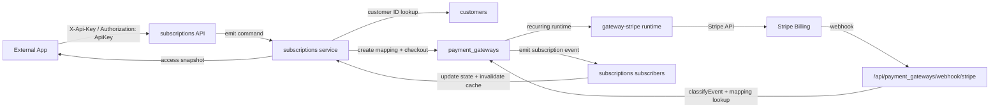

# Subscriptions Module For External App Billing

## TLDR
**Key Points:**
- Add a new core module `packages/core/src/modules/subscriptions` that makes Open Mercato the billing source of truth for an external product application while Stripe remains the recurring-payment execution layer.
- MVP is Stripe-only, API-first, and implemented by **extending** the existing `payment_gateways` core module and the `gateway-stripe` package — no new integration provider is introduced.
- The external app authenticates server-to-server through the existing `api_keys` module; ACL features gate every route.
- The plan catalog defaults to a repo-backed versioned manifest and auto-provisions Stripe Products and Prices during idempotent sync, but sync can be pointed at an app-owned manifest file.
- MVP stops at subscription state, local billing records, and access-state APIs. It does not write recurring renewals into `sales` invoices/payments yet.

**Scope:**
- Extend `payment_gateways` events, webhook routing, and runtime registry to handle recurring billing alongside one-off transactions.
- Extend `gateway-stripe` to register a Stripe recurring runtime and to classify subscription/invoice webhook events.
- New `subscriptions` core module owns the catalog manifest, sync command, lifecycle entities, access-state computation, command-based writes, and API endpoints.
- External-app integration through OM APIs: `plans`, `checkout`, `access`, `cancel`, and `portal`.
- Mapping-based webhook scope resolution: one Stripe endpoint per environment, scope resolved through a new `gateway_subscription_mappings` table.

**Concerns:**
- The current `payment_gateways` webhook route scopes by `GatewayTransaction.providerSessionId`; that lookup path must be extended (not replaced) to also resolve recurring events through subscription mappings.
- Stripe Prices are effectively immutable for amount/currency/interval. The spec enforces versioned price codes instead of in-place mutation.
- Plan switching through Stripe Customer Portal is locked in MVP — upgrades and downgrades go through a fresh `/checkout` call from the external app, so OM never has to reconcile mid-cycle proration semantics in the first release.

## Overview
Open Mercato already has a working payment-gateway hub and a real Stripe provider package, but that stack is centered on one-off payment sessions, captures, refunds, and transaction webhooks. The missing layer is the billing domain that sits above the processor: plans, subscription lifecycle, normalized access state, and a stable contract for an external application.

This spec adds the billing-domain layer as a new core module `subscriptions` and **extends** `payment_gateways` plus `gateway-stripe` to carry recurring lifecycle events alongside the existing transaction flow. The external product application authenticates through `api_keys` and reads a normalized access snapshot from OM instead of interpreting Stripe semantics directly.

> **Market Reference**:
> - **Kill Bill** adopts the correct architectural split: the billing system owns catalog, subscriptions, and lifecycle while the payment processor executes money movement. This spec adopts that separation of concerns.
> - **Stripe Billing** recommends handling subscription lifecycle from Stripe events and customer/billing-portal flows rather than inventing a local recurring charge scheduler. This spec adopts Stripe-driven renewals and customer portal.
> - This spec explicitly rejects a Kill Bill-sized billing engine, local recurring invoice generation, and scheduler-heavy dunning for MVP. OM will normalize state; Stripe will execute renewals.

## Problem Statement
The target integration model is an external product application that:
- stores commercial/customer records in Open Mercato,
- wants Open Mercato to handle recurring payments through Stripe,
- wants its own product application to ask OM whether the account currently has access.

Today OM can process one-off gateway flows, but recurring billing still has major gaps:
- plan definitions are not stored as a first-class repo-backed catalog,
- recurring lifecycle is not modeled as OM entities,
- the current gateway webhook route assumes a payment-session lookup model and cannot scope recurring events,
- external applications would need to interpret raw Stripe statuses directly,
- there is no stable OM API for "what plan is active and what access should this account have?"
- there is no documented server-to-server auth contract for an external billing consumer.

The problem is therefore not "add another payment provider hub." The problem is "add the subscription domain layer above the current gateway runtime, and extend the gateway runtime to carry recurring lifecycle alongside transactions."

## Proposed Solution
Extend the existing payment infrastructure rather than fork it:

1. **Extend `payment_gateways`** with a recurring-aware webhook router, a new mapping table for scope resolution, additional typed events, and an optional `classifyEvent` hook on the webhook handler registration. No breaking change to the existing transaction flow.

2. **Extend `gateway-stripe`** to implement the recurring runtime contract (checkout/portal/cancel/snapshot/catalog), to classify subscription and invoice events, and to map them to unified events. Same Stripe credentials, same Stripe endpoint URL — only the event subscription on the Stripe side widens.

3. **Add a new `subscriptions` core module** that owns plan catalog, lifecycle entities, access-state computation, command-based writes, API endpoints, backoffice diagnostics, and reactive subscribers that consume `payment_gateways.subscription.*` events.

4. **Reuse `api_keys`** for external-app authentication. The external app uses standard Open Mercato API-key auth minted by the admin and gated by ACL features.

The MVP is intentionally narrow:
- Stripe-only,
- no generic feature/capability matrix,
- no OM-hosted customer billing portal,
- no sync into `sales` invoices/payments,
- no local recurring charge scheduler,
- no usage billing, seat billing, or local coupon engine,
- no mid-cycle plan switching through Stripe Customer Portal (locked off in MVP),
- full refunds only; partial refunds and disputes are deferred.

Stripe-native promotion codes entered directly in hosted Stripe Checkout remain in scope because they do not require OM to own coupon lifecycle, redemption limits, or pricing math.

For MVP the repo-backed plan catalog is stored inside the module itself:

```text
packages/core/src/modules/subscriptions/plans.ts
```

This keeps the first release simple. A later phase may extract catalog injection if multiple app distributions need different offers from the same runtime.

### Design Decisions

| Decision | Rationale |
|----------|-----------|
| Place `subscriptions` inside `packages/core/src/modules/` | The module subscribes to `payment_gateways` events and writes through a mapping entity owned by `payment_gateways`. Same-package coupling is cleaner than cross-package imports. |
| Extend `payment_gateways` + `gateway-stripe` (no new integration) | Reuses existing credentials, single Stripe endpoint per env, single webhook signing secret, single integration registry entry. Operators do not configure billing as a separate provider. |
| Recurring events emitted from `payment_gateways` | `payment_gateways` already owns the webhook surface and idempotency. Domain logic in `subscriptions` reacts via persistent subscribers, keeping clear ownership. |
| Stripe-only MVP | Lowest abstraction cost and fastest path to a correct recurring flow. |
| Repo-first plan manifest with auto-provision | Matches the desired "plans in repo + seed/sync" workflow and removes dashboard drift. |
| Mapping-based webhook scope (single Stripe endpoint per env) | One operator step per environment instead of per tenant. Per-tenant endpoint variant is deferred. |
| API-first access checks gated by `api_keys` features | The external app should read OM's normalized state instead of Stripe semantics or outbound webhook payloads. `api_keys` already provides RBAC-bound machine-to-machine auth. |
| Locked plan switching in Customer Portal | Upgrades/downgrades start a fresh `/checkout`; the portal handles only payment method and cancellation. Avoids reconciling mid-cycle price changes in MVP. |
| Full refunds only in MVP | Partial refunds and disputes change `accessState` semantics in non-obvious ways. Out of scope. |
| No `sales` sync in MVP | Keeps scope aligned to "basic subscriptions for an external app" instead of full ERP-grade document orchestration. |

### Alternatives Considered

| Alternative | Why Rejected |
|-------------|-------------|
| Register `subscriptions_stripe` as a second integration provider | Doubles the credentials surface, doubles Stripe endpoint configuration per tenant, and forces operators to learn that "Stripe lives in two places." Extending `gateway_stripe` is simpler. |
| Build `subscriptions` as a separate workspace package | Adds coupling across `@open-mercato/core` → `@open-mercato/subscriptions` → `@open-mercato/gateway-stripe` without a distribution payoff in MVP. Core module placement keeps refactors atomic. |
| Add a dedicated `/api/subscriptions/webhook/stripe/[endpointId]` route | Forces a per-tenant endpoint provisioning model. With mapping-based scope on the existing route the operator step shrinks to one Stripe endpoint per environment. |
| Hardcode Stripe logic directly inside the module services with no recurring runtime seam | Fast initially, but creates a bad coupling point and makes later provider extraction more painful. |
| Use OM customer portal auth and pages in MVP | The external application already owns end-user auth and UX. OM only needs API endpoints plus Stripe Customer Portal handoff. |
| Sync renewals directly into `sales` on day one | Valuable later, but it substantially enlarges scope and couples MVP success to document/accounting semantics. |

## User Stories / Use Cases
- **Product backend** wants to **create or upsert a billable customer in OM** so that billing state is tied to the same customer master used elsewhere in OM.
- **Operator** wants to **declare plans and prices in repo code** so that billing catalog changes are reviewed, versioned, and repeatable across environments.
- **Operator** wants to **mint a per-environment API key with `subscriptions.access` and `subscriptions.manage`** so the external app can call OM without a user session.
- **External app** wants to **create a subscription checkout URL from a `priceCode`** so that signup/purchase flow is server-to-server and stable.
- **External app** wants to **query a single OM access endpoint** so that product gating does not depend on raw Stripe webhooks.
- **Operator** wants to **see subscription state, billing history, and trigger a reconcile** from the OM backoffice so support can resolve drift without database access.
- **Operator** wants to **cancel a subscription or open the billing portal through OM** so that support actions stay in the billing system boundary.
- **OM** wants to **process recurring Stripe webhooks idempotently and safely per tenant/org** so that cross-tenant leakage and duplicate webhook side effects are prevented.

## Architecture

### Module Placement And Ownership

```text
packages/core/src/modules/
  payment_gateways/        # EXTENDED — recurring runtime registry, mapping table, classify hook, new events
  subscriptions/           # NEW — domain layer (plans, lifecycle, /api/subscriptions/*, backoffice)

packages/gateway-stripe/   # EXTENDED — recurring runtime impl, subscription/invoice event mapping
packages/shared/
  src/modules/payment_gateways/types.ts   # EXTENDED — classifyEvent, readSubscriptionRef
  src/modules/subscriptions/runtime.ts    # NEW — narrow recurring runtime interface + registry
```

Ownership:

| Concern | Module |
|---|---|
| Plan catalog (repo manifest + local read model) | `subscriptions` |
| Subscription lifecycle state and `accessState` | `subscriptions` |
| Billing record history | `subscriptions` |
| Webhook ingestion, signature verification, idempotency | `payment_gateways` |
| Mapping `provider_subscription_id` → tenant scope | `payment_gateways` |
| Stripe API calls (checkout, portal, cancel, snapshot, catalog) | `gateway-stripe` |
| External-app authentication and RBAC | `api_keys` + `auth` (reused, no changes) |

### Component Interaction



### Runtime Split

1. **Subscriptions domain layer (`subscriptions` module)**
   - Plan catalog manifest + local read model
   - `Subscription`, `SubscriptionBillingRecord` entities
   - Access-state computation and caching
   - Command-backed writes (`checkout`, `cancel`, `refresh`, `sync-plans`)
   - API contracts for the external app
   - Persistent subscribers consuming `payment_gateways.subscription.*`

2. **Recurring provider runtime seam (`packages/shared/src/modules/subscriptions/runtime.ts`)**
   - `ensureCustomer({ scope, omCustomerId, externalAccountId, email? })`
   - `ensureCatalog({ scope, plans })`
   - `createCheckoutSession({ scope, customerRef, priceRef, successUrl, cancelUrl, allowPromotionCodes?, metadata })`
   - `createBillingPortalSession({ scope, customerRef, returnUrl, allowPlanSwitching: false })`
   - `cancelSubscription({ scope, providerSubscriptionId, atPeriodEnd })`
   - `fetchSubscriptionSnapshot({ scope, providerSubscriptionId })`

3. **Stripe Billing (`gateway-stripe` package)**
   - Implements the recurring runtime interface registered in DI under `paymentRecurringRuntime:stripe`.
   - Extends the existing webhook handler to classify `customer.subscription.*` and `invoice.*` events as `'subscription'` and to extract `providerSubscriptionId` / `providerCustomerId` for scope lookup.
   - Reuses the same `gateway_stripe` integration credentials (`apiKey`, `webhookSecret`).
   - Operator step in Stripe Dashboard widens the existing endpoint's event selection to include subscription/invoice events.

### Webhook Routing
The existing route `/api/payment_gateways/webhook/[provider]/route.ts` is kept and extended:

1. Read raw body and headers.
2. Call `registration.classifyEvent(payload)` → `'transaction' | 'subscription' | 'unknown'`.
3. Resolve scope:
   - **transaction** (existing path): find `GatewayTransaction` candidates by `providerSessionId`, verify signature against each candidate's `webhookSecret`, first match wins.
   - **subscription** (new path): call `registration.readSubscriptionRef(payload)` to get `providerSubscriptionId` / `providerCustomerId`; find `GatewaySubscriptionMapping` candidates; verify signature against each candidate's `webhookSecret`; first match wins.
   - **unknown**: log + 200 (ack) without side effects. Stripe must not retry forever.
4. Idempotency: persist into the existing `WebhookProcessedEvent` table (unique `(idempotencyKey, providerKey, organizationId, tenantId)`). For Stripe, `idempotencyKey = event.id`.
5. Enqueue or process the job. Recurring events go through queue `payment-gateways-subscription-webhook`; transactional events keep using `payment-gateways-webhook`. Worker emits the corresponding `payment_gateways.subscription.*` or `payment_gateways.payment.*` event.

`GatewaySubscriptionMapping` rows are created during `checkout` (before Stripe sends the first webhook), keyed by `(provider_key, provider_subscription_id)` unique, with a secondary index on `(provider_key, provider_customer_id)` for `customer.*`-keyed events.

The existing webhook URL is unchanged. The Stripe Dashboard endpoint is reconfigured (operator step, documented in `webhook-guide.ts`) to additionally emit subscription and invoice events.

### Event-Driven Domain Updates
`payment_gateways` worker emits typed events; `subscriptions` consumes them via persistent subscribers:

| Gateway event | Subscriptions subscriber side effect |
|---|---|
| `payment_gateways.subscription.created` | Insert/upsert `Subscription` from Stripe snapshot; mark `accessState`; emit `subscriptions.access.changed` |
| `payment_gateways.subscription.updated` | Recompute `accessState` from `providerStatus`; guarded by ordering rule (see below) |
| `payment_gateways.subscription.cancelled` | Set `cancelled_at`, `cancel_at_period_end`, recompute `accessState` |
| `payment_gateways.subscription.trial_will_end` | Operator notification (no state change) |
| `payment_gateways.invoice.paid` | Append `SubscriptionBillingRecord` with `status='paid'`; reset `accessState='granted'` if was `'grace'` |
| `payment_gateways.invoice.payment_failed` | Append `SubscriptionBillingRecord` with `status='failed'`; move `accessState` to `'grace'` |
| `payment_gateways.charge.refunded` (subscription-linked) | Append `SubscriptionBillingRecord` with `status='refunded'` |

Subscribers are `persistent: true` so they retry on failure via the events queue.

### Catalog Sync
The plan manifest resolved for a given sync run is the source of truth. Resolution order:
- explicit CLI / command `manifestPath`
- `OM_SUBSCRIPTIONS_PLANS_FILE`
- built-in fallback `packages/core/src/modules/subscriptions/plans.ts`

Sync rules:
- `SubscriptionPlan.code` and `SubscriptionPrice.code` are stable identifiers.
- Stripe `Product` and `Price` are ensured from repo-defined lookup keys (`productLookupKey`, `priceLookupKey`).
- Plan metadata such as title/description can be updated in place locally and in Stripe Product.
- Price amount/currency/interval changes MUST create a new `price.code` and a new Stripe Price; mutating an existing price is rejected by sync.
- Missing repo entries are soft-deactivated locally (`is_active = false`); they are not hard-deleted from Stripe or OM. Stripe Prices/Products remain archivable manually.
- A price soft-deactivated locally keeps serving existing subscriptions; `/api/subscriptions/checkout` rejects new checkouts against inactive prices.

### Checkout Flow
1. External app calls `POST /api/subscriptions/checkout` with `priceCode`, `externalAccountId`, `subjectEntityType`, `subjectEntityId`, `successUrl`, `cancelUrl`, and optional `allowPromotionCodes`.
2. OM resolves the OM customer, ensures a Stripe Customer through the recurring runtime, and resolves the price mapping.
3. OM **pre-creates** a `GatewaySubscriptionMapping` row keyed by `provider_customer_id` (Stripe subscription ID arrives later in `customer.subscription.created`). Webhook scope resolution falls back to `provider_customer_id` lookup when `provider_subscription_id` is not yet known.
4. OM creates a hosted Stripe Checkout Session in `subscription` mode with `client_reference_id = externalAccountId`, metadata including `tenantId`, `organizationId`, `subscriptionRequestId` (UUID for trace correlation), and `allow_promotion_codes = true` unless the request explicitly disables it.
5. OM returns the checkout URL.
6. After successful checkout, Stripe webhooks fire `customer.subscription.created` and `invoice.paid`. The subscriber writes `provider_subscription_id` back into the mapping and inserts the local `Subscription` row.

### Access-State Model
The external app should not read Stripe directly. It should call OM and receive a normalized snapshot.

MVP access states:
- `pending`
- `granted`
- `grace`
- `blocked`

Initial mapping:
- Stripe `trialing`, `active` → `granted`
- Stripe `past_due` → `grace`
- Stripe `incomplete` → `pending`
- Stripe `canceled`, `unpaid`, `incomplete_expired` → `blocked`

The external app uses `accessState` as the primary product-gating signal. The optional `subscriptions.access.changed` event is a propagation hint only — the external app SHOULD poll `/access` on session refresh and on high-value gated actions.

### Ordering And Race Conditions
Stripe does not guarantee webhook ordering. To prevent stale updates from overwriting newer state:

- Every status-changing subscriber compares `event.created` (or `event.occurred_at` from the unified event) against `Subscription.last_provider_event_at`.
- If the incoming event timestamp is strictly less than `last_provider_event_at`, the status update is dropped (but still ack'd in the webhook layer).
- `SubscriptionBillingRecord` writes are append-only and exempt from the ordering guard — duplicates are blocked by the `(provider_key, provider_invoice_id, status)` uniqueness contract instead.
- The reconcile worker periodically pulls Stripe snapshots and writes them with an "authoritative" flag that bypasses the timestamp guard.

### Caching `/api/subscriptions/access`
This endpoint is on the external app's hot path (called on login and on gated actions). Use `@open-mercato/cache` with:

- Cache key: `subscriptions:access:${tenantId}:${organizationId}:${externalAccountId}:${productCode}`
- TTL: 60 seconds (safe upper bound for product gating)
- Tags: `subscription:${subscriptionId}` and `external_account:${externalAccountId}` — invalidated by the `subscriptions.access.changed` subscriber
- Strategy: memory in dev/single-node, Redis in production

The subscriber that flushes cache is `persistent: false` (ephemeral) so it fires immediately; durability is provided by the next `/access` call falling through to the database when cache is cold.

### External App Authentication

| Concern | Decision |
|---|---|
| Header | `X-Api-Key: <secret>` (primary) or `Authorization: ApiKey <secret>` |
| Module | Existing `api_keys` (no changes) |
| Tenant/org scope | Carried by the api_key record; never accepted from request body or query |
| RBAC | Routes declare `requireFeatures: ['subscriptions.<feature>']` in `metadata`; api_keys flow through standard RBAC pipeline |
| Multi-tenant external app | One api_key per tenant; rotation through `/backend/api-keys` |
| Suggested operator role | `external-app-billing` with features `subscriptions.access`, `subscriptions.manage`, `subscriptions.view` |

There is no new auth code in this spec — the requirement is to declare features correctly and document the operator setup. The existing `auth` middleware already resolves API keys through `apiKeyService` and runs the standard `rbacService.userHasAllFeatures(...)` check.

### Commands & Events

Write operations use the command pattern. Command IDs:
- `subscriptions.plans.sync`
- `subscriptions.subscription.checkout`
- `subscriptions.subscription.cancel`
- `subscriptions.subscription.refresh`

Commands are placed under `subscriptions/commands/*.ts` following the customers module pattern: command-local validation, scoped EntityManager usage, and explicit side-effect emission after state changes. `checkout` remains non-reversible by definition.

`subscriptions` typed events (declared in `subscriptions/events.ts`):
- `subscriptions.access.changed` — primary event for cache invalidation and in-app follow-up flows
- `subscriptions.plan.synced` — emitted by the sync command, useful for audit/dashboard widgets

`payment_gateways` new typed events (declared in `payment_gateways/events.ts`):
- `payment_gateways.subscription.created`
- `payment_gateways.subscription.updated`
- `payment_gateways.subscription.cancelled`
- `payment_gateways.subscription.trial_will_end`
- `payment_gateways.invoice.paid`
- `payment_gateways.invoice.payment_failed`
- `payment_gateways.charge.refunded` (added if not present)

All events use `createModuleEvents` with `as const`. None are `clientBroadcast` — external propagation is API-pull.

### Reconcile Worker
- File: `subscriptions/workers/reconcile-subscriptions.ts`
- Queue: `subscriptions-reconcile`
- Schedule: every 30 minutes (registered in `setup.seedDefaults` via `schedulerService`, analogous to `integration-health-probe`)
- Behavior: iterate stale `Subscription` rows (`updated_at` older than the configured threshold), skip terminal provider states, and invoke the `subscriptions.subscription.refresh` command. The worker also deletes abandoned `GatewaySubscriptionMapping` rows whose `provider_subscription_id` is still `NULL` after the configured grace window.

This guarantees eventual consistency even when webhooks are dropped or out of order.

## Data Models

### Repo Manifest
The catalog source of truth lives in repo code:

```text
packages/core/src/modules/subscriptions/plans.ts
```

```ts
export const subscriptionPlans = [
  {
    code: 'starter',
    productCode: 'external-app',
    title: 'Starter',
    description: 'Basic plan for small teams getting started.',
    isActive: true,
    entitlements: {
      projectsLimit: 5,
      aiEnabled: false,
    },
    prices: [
      {
        code: 'starter-monthly-v1',
        providerKey: 'stripe',
        currencyCode: 'USD',
        interval: 'month',
        intervalCount: 1,
        unitAmountMinor: 1900,
        trialDays: 14,
        isDefault: true,
        isActive: true,
        stripe: {
          productLookupKey: 'external-app-starter',
          priceLookupKey: 'external-app-starter-monthly-v1',
          taxBehavior: 'exclusive',
        },
      },
    ],
  },
]
```

Rules:
- `code` values are stable and versioned.
- New price economics means a new `price.code` and a new `priceLookupKey`.
- `externalAccountId` values sent by the app MUST be opaque identifiers (validated against `/^[A-Za-z0-9_-]{1,128}$/` in `data/validators.ts`) and MUST NOT be emails or other PII.

### Entities Owned By `subscriptions`

#### SubscriptionPlan
- `id`: UUID
- `tenant_id`, `organization_id`: UUID
- `code`: string
- `product_code`: string
- `title`: string
- `description`: string nullable
- `entitlements_json`: JSON
- `is_active`: boolean
- `created_at`, `updated_at`, `deleted_at`

Composite unique: `(tenant_id, organization_id, code)`.

#### SubscriptionPrice
- `id`: UUID
- `tenant_id`, `organization_id`: UUID
- `plan_id`: FK
- `code`: string
- `provider_key`: `'stripe'`
- `currency_code`: string
- `interval`: `'month' | 'year'`
- `interval_count`: number
- `unit_amount_minor`: number
- `trial_days`: number nullable
- `provider_product_ref`: string nullable
- `provider_price_ref`: string nullable
- `product_lookup_key`: string
- `price_lookup_key`: string
- `is_default`: boolean
- `is_active`: boolean
- `created_at`, `updated_at`, `deleted_at`

Composite unique: `(tenant_id, organization_id, code)`.

#### Subscription
- `id`: UUID
- `tenant_id`, `organization_id`: UUID
- `external_account_id`: string
- `subject_entity_type`: string — populated from the entity ID registry (`E.customers.customer_person_profile`, `E.customers.customer_company_profile`), validated against the registry at write time
- `subject_entity_id`: UUID
- `plan_id`: FK
- `price_id`: FK
- `provider_key`: `'stripe'`
- `provider_customer_id`: string
- `provider_subscription_id`: string nullable until first `subscription.created` webhook
- `provider_status`: string
- `access_state`: `'pending' | 'granted' | 'grace' | 'blocked'`
- `current_period_start`, `current_period_end`: datetime nullable
- `trial_ends_at`: datetime nullable
- `cancel_at_period_end`: boolean
- `cancelled_at`: datetime nullable
- `last_provider_event_at`: datetime nullable
- `created_at`, `updated_at`, `deleted_at`

Constraints:
- `subject_entity_id` links by ID only; no cross-module ORM relation.
- Selection priority for `/access` is computed at read time from `access_state` + `updated_at`, not from an additional DB constraint.

#### SubscriptionBillingRecord
- `id`: UUID
- `tenant_id`, `organization_id`: UUID
- `subscription_id`: FK
- `provider_key`: `'stripe'`
- `provider_invoice_id`: string nullable
- `provider_payment_intent_id`: string nullable
- `provider_charge_id`: string nullable
- `status`: `'paid' | 'failed' | 'void' | 'refunded' | 'unknown'`
- `amount_minor`: number
- `currency_code`: string
- `period_start`, `period_end`: datetime nullable
- `event_type`: string
- `processed_at`: datetime
- `created_at`, `updated_at`, `deleted_at`

Composite unique: `(provider_key, provider_invoice_id, status) WHERE provider_invoice_id IS NOT NULL` — prevents duplicate billing rows from webhook replays while allowing distinct statuses for the same invoice (refund after paid).

### Entities Owned By `payment_gateways`

#### GatewaySubscriptionMapping (NEW)
- `id`: UUID
- `provider_key`: string
- `provider_subscription_id`: string nullable (NULL until first `customer.subscription.created` webhook)
- `provider_customer_id`: string
- `organization_id`, `tenant_id`: UUID
- `external_account_id`: string
- `subject_entity_type`: string nullable
- `subject_entity_id`: UUID nullable
- `subscription_id`: UUID nullable (FK to `subscriptions.subscriptions`, NULL until subscriber inserts the local row)
- `created_at`, `updated_at`

Indexes:
- Unique `(provider_key, provider_subscription_id)` (PostgreSQL still allows multiple `NULL` values)
- Index `(provider_key, provider_customer_id)`
- Index `(organization_id, tenant_id, external_account_id)`

Purpose: scope resolution for recurring webhooks. The webhook route reads `providerSubscriptionId` or `providerCustomerId` from the payload, looks up candidate mappings, and verifies the signature against each candidate's `webhookSecret`.

#### WebhookProcessedEvent (REUSED, NO CHANGE)
Existing entity in `payment_gateways/data/entities.ts`. Recurring events insert with `idempotencyKey = event.id`, `eventType = 'customer.subscription.created'`, etc. Same unique constraint applies.

### Entities Removed From The Original Draft
The original draft proposed `SubscriptionWebhookEndpoint` and `SubscriptionWebhookReceipt`. Both are dropped:
- `SubscriptionWebhookEndpoint` is replaced by mapping-based scope resolution (`GatewaySubscriptionMapping`).
- `SubscriptionWebhookReceipt` is replaced by reusing `WebhookProcessedEvent`.

### Sensitive Data Posture
- Customer emails stay on customer entities, not on subscription entities.
- Stripe secrets stay in the existing `gateway_stripe` integration credentials (encrypted at rest by `integrationCredentialsService`).
- Raw webhook payloads SHOULD NOT be stored in business entities. The existing webhook log JSON column on transactions is for transactions only; subscriptions diagnostics use `integrationLogService` from `integrations`.
- API key secrets are never logged in plaintext.

## API Contracts

All routes MUST export `openApi`. All non-webhook routes declare `metadata.<METHOD>: { requireAuth: true, requireFeatures: [...] }`. External-app calls authenticate via `api_keys` using `X-Api-Key` or `Authorization: ApiKey ...`; the same routes accept session-authenticated operators (e.g., for backoffice troubleshooting).

### List Plans
- `GET /api/subscriptions/plans`
- Auth: required
- Features: `subscriptions.view`

Response:

```json
{
  "items": [
    {
      "code": "starter",
      "productCode": "external-app",
      "title": "Starter",
      "description": "Basic plan for small teams getting started.",
      "entitlements": {
        "projectsLimit": 5,
        "aiEnabled": false
      },
      "prices": [
        {
          "code": "starter-monthly-v1",
          "currencyCode": "USD",
          "interval": "month",
          "intervalCount": 1,
          "unitAmountMinor": 1900,
          "trialDays": 14,
          "isDefault": true
        }
      ]
    }
  ]
}
```

### Create Checkout Session
- `POST /api/subscriptions/checkout`
- Auth: required
- Features: `subscriptions.manage`

Request:

```json
{
  "externalAccountId": "acct_123",
  "subjectEntityType": "customers:customer_company_profile",
  "subjectEntityId": "uuid",
  "priceCode": "starter-monthly-v1",
  "successUrl": "https://app.example.com/billing/success",
  "cancelUrl": "https://app.example.com/billing/cancel",
  "allowPromotionCodes": true
}
```

Response:

```json
{
  "checkoutUrl": "https://checkout.stripe.com/...",
  "provider": "stripe",
  "subscriptionRequestId": "uuid"
}
```

Pre-conditions:
- `priceCode` resolves to an active local `SubscriptionPrice`.
- Subject entity (`subjectEntityType` + `subjectEntityId`) exists in the current tenant.
- `externalAccountId` matches `/^[A-Za-z0-9_-]{1,128}$/`.

Side effects:
- Ensures Stripe Customer (via runtime `ensureCustomer`).
- Pre-creates `GatewaySubscriptionMapping` row with `provider_customer_id` populated and `provider_subscription_id` NULL.
- Creates Stripe Checkout Session with `client_reference_id = externalAccountId`.
- Enables Stripe-hosted promotion-code entry unless `allowPromotionCodes = false` is sent.

### Read Access Snapshot
- `GET /api/subscriptions/access?externalAccountId=acct_123&productCode=external-app`
- Auth: required
- Features: `subscriptions.access`
- Cached (see Architecture → Caching).

Response:

```json
{
  "subscriptionId": "uuid",
  "externalAccountId": "acct_123",
  "productCode": "external-app",
  "planCode": "starter",
  "priceCode": "starter-monthly-v1",
  "provider": "stripe",
  "providerStatus": "active",
  "accessState": "granted",
  "currentPeriodStart": "2026-05-22T10:00:00.000Z",
  "currentPeriodEnd": "2026-06-22T10:00:00.000Z",
  "cancelAtPeriodEnd": false,
  "entitlements": {
    "projectsLimit": 5,
    "aiEnabled": false
  },
  "updatedAt": "2026-05-22T10:30:00.000Z"
}
```

If no active subscription exists, returns:

```json
{
  "subscriptionId": null,
  "externalAccountId": "acct_123",
  "productCode": "external-app",
  "planCode": null,
  "priceCode": null,
  "provider": null,
  "providerStatus": null,
  "accessState": "blocked",
  "currentPeriodStart": null,
  "currentPeriodEnd": null,
  "trialEndsAt": null,
  "cancelAtPeriodEnd": false,
  "entitlements": null,
  "updatedAt": null
}
```

### Create Billing Portal Session
- `POST /api/subscriptions/portal`
- Auth: required
- Features: `subscriptions.manage`

Request:

```json
{
  "externalAccountId": "acct_123",
  "returnUrl": "https://app.example.com/settings/billing"
}
```

Response:

```json
{ "portalUrl": "https://billing.stripe.com/..." }
```

Server-side portal configuration:
- `features.subscription_update.enabled = false` (no mid-cycle plan switching in MVP)
- `features.subscription_update.proration_behavior = 'none'`
- `features.payment_method_update.enabled = true`
- `features.subscription_cancel.enabled = true` (mode: `at_period_end`, proration `none`)
- `features.invoice_history.enabled = true`
- `features.customer_update.enabled = false`
- `features.subscription_cancel.cancellation_reason.enabled = false`

### Cancel Subscription
- `POST /api/subscriptions/[id]/cancel`
- Auth: required
- Features: `subscriptions.manage`

Request:

```json
{ "atPeriodEnd": true }
```

Response:

```json
{
  "ok": true,
  "subscriptionId": "uuid",
  "providerStatus": "active",
  "accessState": "granted",
  "cancelAtPeriodEnd": true,
  "cancelledAt": null
}
```

### List Subscriptions (Admin)
- `GET /api/subscriptions/list`
- Auth: required
- Features: `subscriptions.admin`

Response includes a paged list with:
- `id`
- `externalAccountId`
- `planCode`, `priceCode`, `productCode`
- `provider`, `providerStatus`, `providerSubscriptionId`
- `accessState`
- `cancelAtPeriodEnd`
- `currentPeriodEnd`
- `updatedAt`

Supported filters:
- `page`
- `pageSize`
- `externalAccountId`
- `productCode`
- `accessState`

### Get Subscription Detail (Admin)
- `GET /api/subscriptions/detail/[id]`
- Auth: required
- Features: `subscriptions.admin`

Response includes:
- `subscription` object with provider refs, current period, trial window, cancel flags, and timestamps
- `billingRecords` array with the most recent billing events

### Force Refresh Subscription (Admin)
- `POST /api/subscriptions/[id]/refresh`
- Auth: required
- Features: `subscriptions.admin`

Response:

```json
{
  "ok": true,
  "subscriptionId": "uuid",
  "changed": true,
  "accessState": "granted",
  "providerStatus": "active"
}
```

### Sync Plans (Admin)
- `POST /api/subscriptions/plans/sync`
- Auth: required
- Features: `subscriptions.admin`

This HTTP route always syncs the resolved default manifest for the current scope. File-based manifest selection is exposed by the command and CLI, not by the route body.

Response includes:
- `plansUpserted`
- `pricesUpserted`
- `pricesDeactivated`
- `providerEnsured`
- `runId`
- `manifestSource`
- `manifestPath`

### Receive Stripe Webhook (Unified — Existing Route, Extended)
- `POST /api/payment_gateways/webhook/stripe`
- Auth: not required
- Verification: Stripe signature, scope-then-verify via `GatewayTransaction` (transactions) or `GatewaySubscriptionMapping` (subscriptions/invoices)

Newly handled events:
- `customer.subscription.created`
- `customer.subscription.updated`
- `customer.subscription.deleted`
- `customer.subscription.trial_will_end`
- `invoice.paid`
- `invoice.payment_failed`
- `charge.refunded` when subscription-linked

Response:

```json
{ "received": true, "queued": true }
```

## Internationalization (i18n)
MVP is API-first and does not ship a full OM-hosted customer UI. Required i18n surface:
- Backoffice operator pages (plan list, subscription list, subscription detail) — currently shipped with `i18n/en.json`, with the normal module dictionary expansion path for additional locales.
- Status labels for `accessState` and `providerStatus` in admin tables.
- Plan `title` and `description` — declared in `subscriptions/translations.ts` so tenant-level translations can override the manifest text.

No translatable catalog content is synthesized from Stripe. Repo manifest plus tenant translation overrides remain the canonical human text sources.

## UI/UX

### External App (Out Of OM Scope)
- Renders pricing pages, account screens, upgrade/downgrade CTAs, and paywall behavior.
- Redirects to `checkoutUrl` returned by OM.
- Redirects to `portalUrl` returned by OM.
- Reads `accessState` from OM on login/session refresh and on high-value gated actions.

### Stripe Hosted Surfaces
- **Stripe Checkout**: hosted subscription purchase UX.
- **Stripe Customer Portal**: saved payment method changes + cancellation. Plan switching disabled in MVP.

### OM Backoffice (In Scope)
Operator-facing pages, built with shared backend UI primitives (`Page`, `DataTable`, `Card`, `apiCall`, `useGuardedMutation`) from `@open-mercato/ui`:

| Page | Path | Purpose |
|---|---|---|
| Plans list | `/backend/subscriptions/plans` | Read-only view of synced plans/prices, "Sync now" action calling `subscriptions.plans.sync` |
| Subscriptions list | `/backend/subscriptions` | DataTable with filters by `accessState`, `productCode`, `externalAccountId` |
| Subscription detail | `/backend/subscriptions/[id]` | State, billing history, "Force reconcile", "Cancel" with confirm dialog |

All backoffice pages declare `requireFeatures: ['subscriptions.admin']` (gated to operators, not the external-app api_key role).

## Configuration

### Stripe Credentials
MVP reuses the existing `gateway_stripe` integration credentials:
- `secretKey` (Stripe API key)
- `publishableKey` (unused in MVP, kept for forward compatibility)
- `webhookSecret` (Stripe endpoint signing secret)

**Operator step** (documented in `gateway-stripe/src/modules/gateway_stripe/webhook-guide.ts`):
1. In the Stripe Dashboard, open the existing webhook endpoint configured for one-off payments.
2. Add the following events to the endpoint's event selection:
   - `customer.subscription.created`
   - `customer.subscription.updated`
   - `customer.subscription.deleted`
   - `customer.subscription.trial_will_end`
   - `invoice.paid`
   - `invoice.payment_failed`
   - `charge.refunded`
3. The signing secret does not change.

No additional credentials are required.

### External-App API Key
Operator steps in `/backend/api-keys`:
1. Create a role `external-app-billing` with features `subscriptions.access`, `subscriptions.manage`, `subscriptions.view`.
2. Create an API key bound to that role.
3. Hand the secret to the external app and send it as `X-Api-Key` (or `Authorization: ApiKey ...`) on every request.

### Local Bootstrap
The module provides:
- `setup.ts` with default role grants for `admin`, `superadmin`, and the new `external-app-billing` role hint.
- `seedDefaults()` calling `subscriptions.plans.sync` so a fresh tenant has the active manifest applied.
- CLI commands:
  - `yarn mercato subscriptions sync-plans --tenant <tenantId> --org <organizationId> [--manifest <path>]`
  - `yarn mercato subscriptions reconcile --tenant <tenantId> --org <organizationId> [--id <subscriptionId> | --all]`
  - `yarn mercato subscriptions cancel --tenant <tenantId> --org <organizationId> --id <subscriptionId> [--immediately]`
  - `yarn mercato subscriptions list-stale --tenant <tenantId> --org <organizationId> [--olderThanMinutes <n>]`
- Scheduled task `subscriptions-reconcile` (30 min interval) registered through `schedulerService` in `setup.seedDefaults`.

## Migration & Compatibility

### Schema Changes (Additive)
- New tables in `subscriptions`: `subscription_plans`, `subscription_prices`, `subscriptions`, `subscription_billing_records`.
- New table in `payment_gateways`: `gateway_subscription_mappings`.
- No schema changes on existing tables.

### Code Surface Changes (Additive)
- `packages/shared/src/modules/payment_gateways/types.ts`: `WebhookHandlerRegistration` gains optional `classifyEvent` and `readSubscriptionRef` fields. Existing registrations remain valid (default classification is `'transaction'`).
- `packages/shared/src/modules/subscriptions/runtime.ts`: new module defining the recurring runtime interface and registry. Additive.
- `packages/core/src/modules/payment_gateways/events.ts`: new event IDs. Additive.
- `packages/gateway-stripe`: new files (`lib/subscriptions-runtime.ts`), extended webhook handler. Existing exported types unchanged.

### API Compatibility
- `/api/payment_gateways/webhook/[provider]` accepts a wider set of events. Existing payloads still process through the transaction path.
- All new routes live under `/api/subscriptions/*` — no existing route is modified.

### Catalog Compatibility
- Changing a Stripe price economically means creating a new versioned price code; sync rejects in-place economic mutation.
- Existing subscriptions may remain on prior price versions until an explicit migration path is added later.

### Backward Compatibility Contract
Per `BACKWARD_COMPATIBILITY.md`:
- New ACL features (`subscriptions.*`) are ADDITIVE.
- New event IDs (`payment_gateways.subscription.*`, `payment_gateways.invoice.*`, `subscriptions.*`) are ADDITIVE.
- New entities and tables are ADDITIVE.
- Extended `WebhookHandlerRegistration` interface is ADDITIVE (new fields are optional).
- No FROZEN or STABLE surface is modified.

## Implementation Plan

### Phase 1: Payment Gateways Foundation Extensions
1. Add `classifyEvent` and `readSubscriptionRef` to `WebhookHandlerRegistration` in `packages/shared/src/modules/payment_gateways/types.ts`.
2. Add `GatewaySubscriptionMapping` entity + migration + snapshot in `packages/core/src/modules/payment_gateways/data/entities.ts`.
3. Add new event IDs to `packages/core/src/modules/payment_gateways/events.ts`.
4. Extend `packages/core/src/modules/payment_gateways/api/webhook/[provider]/route.ts` with branching scope resolution (transaction vs subscription path).
5. Add `packages/core/src/modules/payment_gateways/workers/subscription-webhook.ts` and queue name `payment-gateways-subscription-webhook`.
6. Extend `packages/core/src/modules/payment_gateways/lib/webhook-processor.ts` to dispatch subscription jobs and emit the new typed events.
7. Add `packages/shared/src/modules/subscriptions/runtime.ts` with the recurring runtime interface and DI registry helpers.

### Phase 2: Stripe Provider Extensions
1. Implement `packages/gateway-stripe/src/modules/gateway_stripe/lib/subscriptions-runtime.ts` (Stripe Billing calls).
2. Extend the existing Stripe webhook handler to classify subscription/invoice events and to map them to unified events.
3. Register the recurring runtime in `packages/gateway-stripe/src/modules/gateway_stripe/di.ts`.
4. Update `packages/gateway-stripe/src/modules/gateway_stripe/webhook-guide.ts` with the new Stripe Dashboard event list.

### Phase 3: Subscriptions Module Foundations
1. Scaffold `packages/core/src/modules/subscriptions/` with `index.ts`, `acl.ts`, `setup.ts`, `events.ts`, `translations.ts`, `cli.ts`, `di.ts`, and `notifications.ts`.
2. Add `data/entities.ts`, `data/validators.ts`, `plans.ts`, and `lib/plan-manifest.ts`.
3. Add migrations + snapshot for the four new tables.
4. Add `plans.ts` manifest and `lib/plan-sync.ts`.
5. Add `lib/subscription-service.ts`, `lib/access-service.ts`, `lib/access-state.ts`, and `lib/subject-entity.ts`.
6. Add commands under `commands/`.
7. Register module in `apps/mercato/src/modules.ts`.

### Phase 4: API Routes And Backoffice
1. Implement `GET /api/subscriptions/plans`.
2. Implement `POST /api/subscriptions/checkout`.
3. Implement `GET /api/subscriptions/access` with cache wiring.
4. Implement `POST /api/subscriptions/portal`.
5. Implement `POST /api/subscriptions/[id]/cancel`.
6. Add backoffice pages (`plans`, list, detail) with DataTable + CrudForm.

### Phase 5: Event Subscribers, Reconcile, Tests
1. Implement persistent subscribers under `subscribers/` for `payment_gateways.subscription.*` and `payment_gateways.invoice.*`.
2. Implement ephemeral subscriber for `subscriptions.access.changed` (cache invalidation).
3. Implement `workers/reconcile-subscriptions.ts` and schedule it in `setup.seedDefaults`.
4. Add unit tests (plan sync idempotency, access mapping, ordering guard, cache flush, command undo).
5. Add integration tests for all new API paths plus webhook flow.

## File Manifest

### Create — `packages/core/src/modules/subscriptions/`

| File | Purpose |
|------|---------|
| `index.ts`, `acl.ts`, `setup.ts`, `di.ts` | Module metadata, ACL, seed defaults, scheduler registration, DI |
| `cli.ts` | Operator commands for sync, reconcile, cancel, and stale inspection |
| `events.ts`, `translations.ts`, `notifications.ts` | Typed events, plan text translation registration, trial-ending notifications |
| `plans.ts`, `lib/plan-manifest.ts`, `lib/plan-sync.ts` | Built-in manifest, external-manifest resolution, idempotent catalog sync |
| `data/entities.ts`, `data/validators.ts` | Subscription entities and request validation schemas |
| `lib/access-state.ts`, `lib/access-service.ts` | Status mapping, access snapshot computation, cache key and tag policy |
| `lib/subject-entity.ts`, `lib/subscription-service.ts`, `lib/types.ts` | Subject validation, runtime helpers, shared local types |
| `commands/index.ts`, `commands/{sync-plans,checkout,cancel,refresh}.ts` | Command-backed write flows |
| `subscribers/shared.ts` | Shared webhook/subscriber helpers |
| `subscribers/on-gateway-*.ts`, `subscribers/on-access-changed-flush-cache.ts` | Persistent lifecycle handlers and ephemeral cache invalidation |
| `workers/reconcile-subscriptions.ts` | Scheduled provider reconcile and abandoned-mapping cleanup |
| `api/openapi.ts` | Shared OpenAPI tag helper |
| `api/subscriptions/plans/route.ts` | List active plans |
| `api/subscriptions/plans/sync/route.ts` | Trigger plan sync for the current scope |
| `api/subscriptions/checkout/route.ts` | Create subscription checkout session |
| `api/subscriptions/access/route.ts` | Read normalized access snapshot |
| `api/subscriptions/portal/route.ts` | Create Stripe Customer Portal session |
| `api/subscriptions/[id]/cancel/route.ts` | Cancel subscription |
| `api/subscriptions/[id]/refresh/route.ts` | Force provider refresh |
| `api/subscriptions/list/route.ts` | Admin list endpoint |
| `api/subscriptions/detail/[id]/route.ts` | Admin detail endpoint |
| `backend/subscriptions/page.tsx` + `page.meta.ts` | Subscriptions list page |
| `backend/subscriptions/[id]/page.tsx` + `page.meta.ts` | Subscription detail page |
| `backend/subscriptions/plans/page.tsx` + `page.meta.ts` | Plan catalog page |
| `i18n/en.json` | Admin labels and notification copy |
| `migrations/Migration20260522000002.ts` | Module schema migration |
| `__tests__/*.test.ts` | Current unit coverage (`access-state`, `billing-subscribers`, `plan-manifest`, `plan-sync`, `subject-entity`, `subscription-webhook-shared`, `validators`) |

### Modify — `packages/core/src/modules/payment_gateways/`

| File | Change |
|------|--------|
| `events.ts` | Add recurring subscription and invoice lifecycle events |
| `data/entities.ts` | Add `GatewaySubscriptionMapping` |
| `api/webhook/[provider]/route.ts` | Branch between transaction and subscription webhook flows |
| `lib/subscription-webhook-processor.ts` (new) | Map recurring provider events to typed gateway events |
| `workers/subscription-webhook.ts` (new) | Queue worker for recurring webhook payloads |
| `migrations/Migration20260522000001.ts`, `Migration20260522000003.ts` | Additive schema updates for recurring flow |

### Modify — `packages/gateway-stripe/`

| File | Change |
|------|--------|
| `src/modules/gateway_stripe/di.ts` | Register recurring runtime and extended webhook handler options |
| `src/modules/gateway_stripe/integration.ts` | Expose subscriptions-related integration metadata |
| `src/modules/gateway_stripe/lib/webhook-handler.ts` | Classify recurring events and extract subscription refs |
| `src/modules/gateway_stripe/lib/subscriptions-runtime.ts` (new) | Stripe recurring runtime for customer, catalog, checkout, portal, cancel, and snapshot |
| `src/modules/gateway_stripe/webhook-guide.ts` | Expand the Stripe Dashboard event list |
| `src/modules/gateway_stripe/__tests__/*.test.ts` | Runtime and webhook classification coverage |

### Modify — `packages/shared/`

| File | Change |
|------|--------|
| `src/modules/payment_gateways/types.ts` | Add optional webhook classification and subscription-ref hooks |
| `src/modules/subscriptions/runtime.ts` (new) | Recurring runtime contract and registry helpers |

### Modify — `apps/mercato/`

| File | Change |
|------|--------|
| `src/modules.ts` | Enable the `subscriptions` module |

### Modify — `apps/docs/`

| File | Change |
|------|--------|
| `docs/framework/modules/subscriptions.mdx` | Architecture and extensibility reference for the module |
| `docs/user-guide/subscriptions.mdx` | Operator guide for plans, API keys, access snapshots, backoffice, and troubleshooting |
| `docs/api/subscriptions.mdx` | HTTP contract for external-app and admin endpoints |
| `docs/cli/subscriptions.mdx` | CLI reference for sync, reconcile, cancel, and stale inspection |
| `docs/framework/modules/core-modules.mdx` | Add `subscriptions` to the built-in module catalog |
| `docs/framework/modules/payment-gateways.mdx`, `docs/user-guide/stripe-payments.mdx` | Cross-link recurring billing and expanded Stripe webhook event scope |
| `sidebars.ts` | Register the new docs pages in User Guide, REST API, CLI, and Framework navigation |

## Testing Strategy

### Current Unit Coverage

Shipped tests cover:

- status-to-access mapping
- plan manifest parsing and alternate manifest sources
- plan sync idempotency and economic-mutation rejection
- subject entity normalization and validation
- shared webhook-subscription helpers
- billing-record subscriber regressions
- validator contracts
- Stripe runtime and webhook classification behavior

### Integration Coverage

The module ships module-local Playwright integration specs under `packages/core/src/modules/subscriptions/__integration__/`:

| ID | Coverage |
|---|---|
| `TC-SUB-001` | `subscriptions sync-plans` provisions Stripe refs and is rerunnable; second run is no-op |
| `TC-SUB-002` | `POST /api/subscriptions/checkout` creates Stripe customer mapping and returns Checkout URL |
| `TC-SUB-003` | `customer.subscription.created` webhook resolves scope via mapping and inserts local subscription |
| `TC-SUB-004` | `GET /api/subscriptions/access` returns `granted` after webhook-confirmed activation; cache hit on second call |
| `TC-SUB-005` | `invoice.payment_failed` webhook moves subscription to `grace` and flushes cache |
| `TC-SUB-006` | `invoice.paid` after `grace` restores `granted` and appends billing record |
| `TC-SUB-007` | `POST /api/subscriptions/[id]/cancel` with `atPeriodEnd:true` updates state without immediate access loss |
| `TC-SUB-008` | Duplicate webhook (same Stripe `event.id`) is deduped by `WebhookProcessedEvent` |
| `TC-SUB-009` | Stale `customer.subscription.updated` is dropped without state regression |
| `TC-SUB-010` | `POST /api/subscriptions/portal` returns a restricted portal URL |
| `TC-SUB-011` | Reconcile worker detects drift and applies provider truth |
| `TC-SUB-012` | API key with `subscriptions.access` only is rejected by `/checkout` |
| `TC-SUB-013` | Valid Stripe signature plus unknown mapping returns `401` |
| `TC-SUB-014` | Plan economic mutation without a new versioned code is rejected |

Testing notes:

- Integration tests should create their own fixtures and avoid seeded/demo data.
- CI uses a test-only mock `paymentRecurringRuntime:stripe`, not live Stripe.
- Documentation changes must be validated by building `apps/docs`.

## Risks & Impact Review

### Data Integrity Failures
- Catalog sync can partially succeed remotely if OM persists local state before Stripe refs are ensured.
- Duplicate or out-of-order webhook delivery can overwrite newer subscription state if updates are not idempotent.
- Price changes can accidentally mutate the wrong logical plan if versioning discipline is not enforced.
- `GatewaySubscriptionMapping` pre-create can leave dangling rows if Checkout Session is abandoned by the user.

### Cascading Failures & Side Effects
- If Stripe webhooks fail or are delayed, the external app may continue seeing stale access state until retries or reconcile succeed.
- If `classifyEvent` misclassifies an event, scope resolution can fall through to the wrong path.

### Tenant & Data Isolation Risks
- Webhook scope resolution is the largest security risk. Resolving scope from payload metadata (without signature verification) would permit cross-tenant spoofing.
- `api_key` scope leakage (one key valid across tenants) would break tenant isolation.

### Migration & Deployment Risks
- Extending `WebhookHandlerRegistration` is additive but third-party registrations need to be re-checked.
- Catalog sync rollout must not deactivate existing one-off payment gateway behavior.

### Operational Risks
- Subscription state may drift from Stripe if a webhook is missed and the reconcile worker is disabled.
- Billing-record growth will increase over time and needs bounded query patterns and support tooling.
- Plan switching not yet handled means upgrades require external-app coordination (start new checkout, cancel old subscription).

### Risk Register

#### Webhook Scope Spoofing
- **Scenario**: An attacker posts a signed-looking request and attempts to force OM to apply a lifecycle update to the wrong tenant.
- **Severity**: Critical
- **Affected area**: Subscription status, access-state correctness, tenant isolation
- **Mitigation**: Two-phase scope resolution: read `providerSubscriptionId`/`providerCustomerId` from payload, look up `GatewaySubscriptionMapping` candidates, verify signature against each candidate's `webhookSecret`. Never trust payload metadata for scope without signature verification. Unknown mapping → 401 fail-closed.
- **Residual risk**: Secret leakage in operator configuration remains possible; acceptable for MVP because credentials stay encrypted in `integrationCredentialsService` and invalid signatures are rejected.

#### Duplicate Or Out-Of-Order Stripe Events
- **Scenario**: Stripe retries or reorders webhook events, causing repeated billing records or stale state rollback.
- **Severity**: High
- **Affected area**: Subscription lifecycle, billing record integrity, support diagnostics
- **Mitigation**:
  - Idempotency via `WebhookProcessedEvent` unique index on `(idempotencyKey, providerKey, organizationId, tenantId)`.
  - Ordering guard in subscribers: drop status updates whose `event.created` is older than `Subscription.last_provider_event_at`.
  - Billing records append-only with unique `(provider_invoice_id, status)` per subscription.
- **Residual risk**: Some non-critical event timing ambiguity remains for diagnostics, but the primary subscription snapshot stays correct.

#### Catalog Drift Between Repo And Stripe
- **Scenario**: A plan is changed in repo but an existing Stripe Price cannot be mutated, leading to mismatched local and remote catalog state.
- **Severity**: High
- **Affected area**: Checkout correctness, operator trust in catalog data
- **Mitigation**: Sync rejects economic mutation against an existing `priceLookupKey`. New economics require a new `price.code` and `priceLookupKey`. Old prices are soft-deactivated locally; existing subscriptions stay valid until explicit migration.
- **Residual risk**: Existing customers may remain on older price versions until a dedicated migration flow is added later.

#### Stale Access State After Webhook Failure
- **Scenario**: Stripe renews or fails a payment, but OM does not process the webhook promptly, so the external app reads stale access state.
- **Severity**: Medium
- **Affected area**: Product access gating in the external app
- **Mitigation**:
  - Scheduled `subscriptions-reconcile` worker (every 30 min) pulls Stripe snapshots and emits update events when drift is detected.
  - `/api/subscriptions/access` cache TTL capped at 60 seconds.
  - `subscriptions list-stale` CLI surfaces drift for ops investigation.
- **Residual risk**: Eventual consistency remains by design; acceptable because the external app reads OM as source of truth and not webhook payloads directly.

#### Over-Abstracted Provider Runtime
- **Scenario**: The first implementation tries to solve every future provider difference up front and produces a bloated shared contract.
- **Severity**: Medium
- **Affected area**: Maintainability, implementation speed, future refactors
- **Mitigation**: Keep the recurring runtime seam narrow and Stripe-focused in MVP. Add only operations actually used by the module. Place the runtime contract in `packages/shared/src/modules/subscriptions/runtime.ts`, not in `payment_gateways`, to keep concerns separated.
- **Residual risk**: A second provider may still require seam changes later; acceptable because the initial contract is intentionally small and additive.

#### API Key Misuse By External App
- **Scenario**: External app leaks its api_key, attacker calls OM directly.
- **Severity**: High
- **Affected area**: All `/api/subscriptions/*` endpoints
- **Mitigation**:
  - `api_keys` already supports rotation and revocation through `/backend/api-keys`.
  - Feature-gated routes: a leaked key bound to `subscriptions.access` only cannot call `/checkout` or `/cancel`.
  - All key activity flows through standard auth audit (existing `api_keys` instrumentation).
- **Residual risk**: Eventual consistency on key rotation; mitigated by short cache TTL on RBAC lookups (existing behavior).

#### Dangling Pre-Created Mappings
- **Scenario**: User abandons the Stripe Checkout Session; the pre-created `GatewaySubscriptionMapping` row with NULL `provider_subscription_id` is never finalized.
- **Severity**: Low
- **Affected area**: Storage growth, mapping table cleanliness
- **Mitigation**: Background cleanup in the reconcile worker: rows older than 24 hours with NULL `provider_subscription_id` and no matching Checkout Session in Stripe are soft-deleted.
- **Residual risk**: Negligible storage cost; rows are bounded by checkout volume.

#### Local Billing Record Growth
- **Scenario**: Renewal and failure records grow indefinitely and slow support queries.
- **Severity**: Low
- **Affected area**: Backoffice diagnostics, storage growth
- **Mitigation**: Records normalized and indexed by `subscription_id` + `provider_invoice_id`. Raw payloads not stored. Backoffice queries paginated.
- **Residual risk**: Long-term archival/reporting work is deferred to future phases.

## Final Compliance Report — 2026-05-22

### AGENTS.md Files Reviewed
- `AGENTS.md`
- `.ai/specs/AGENTS.md`
- `packages/core/AGENTS.md`
- `packages/shared/AGENTS.md`
- `packages/core/src/modules/customers/AGENTS.md`
- `packages/core/src/modules/integrations/AGENTS.md`
- `packages/cache/AGENTS.md`
- `packages/queue/AGENTS.md`
- `packages/events/AGENTS.md`
- `packages/cli/AGENTS.md`
- `BACKWARD_COMPATIBILITY.md`

### Compliance Matrix

| Rule Source | Rule | Status | Notes |
|-------------|------|--------|-------|
| root `AGENTS.md` | Modules use plural snake_case names | Compliant | Module id is `subscriptions` |
| root `AGENTS.md` | Core platform features go in `packages/<package>/src/modules/<module>/` | Compliant | Module placed in `packages/core/src/modules/subscriptions` |
| root `AGENTS.md` | Cross-module links use FK IDs only | Compliant | `subject_entity_id` stores customer IDs only; `subscription_id` on mapping is an opaque FK |
| root `AGENTS.md` | New non-trivial work needs a spec in `.ai/specs/` | Compliant | This file is the governing spec |
| root `AGENTS.md` | Event IDs `module.entity.action`, singular entity, past tense | Compliant | All new events follow the pattern |
| `packages/core/AGENTS.md` | API routes MUST export `openApi` | Compliant | All listed routes export `openApi` |
| `packages/core/AGENTS.md` | Use command pattern for writes | Compliant | Checkout, cancel, refresh, sync are command-backed |
| `packages/core/AGENTS.md` | `setup.ts` declares `defaultRoleFeatures` and seeds | Compliant | Includes role grants, sync seed, scheduled reconcile registration |
| `packages/core/AGENTS.md` | `acl.ts` declares features for guarded routes | Compliant | Four features declared |
| `packages/core/AGENTS.md` | Non-CRUD writes wire mutation guard | Compliant | `/checkout`, `/portal`, `/cancel` call `validateCrudMutationGuard` and `runCrudMutationGuardAfterSuccess` |
| `packages/core/AGENTS.md` | Translatable fields declared in `translations.ts` | Compliant | `subscription_plan.title`, `subscription_plan.description` declared |
| `packages/core/AGENTS.md` | Module setup and ACLs must be declared explicitly | Compliant | `setup.ts`, `acl.ts`, `translations.ts`, and notification definitions are present and wired |
| `packages/cache/AGENTS.md` | Tag-based invalidation, tenant-scoped | Compliant | `/access` cache keyed and tagged per (tenantId, organizationId, externalAccountId), flushed by event subscriber |
| `packages/queue/AGENTS.md` | Background workers via queue contract | Compliant | `payment-gateways-subscription-webhook`, `subscriptions-reconcile` queues |
| `packages/events/AGENTS.md` | Persistent subscribers for cross-module side effects | Compliant | All `payment_gateways.subscription.*` subscribers are `persistent: true` |
| `packages/shared/AGENTS.md` | Shared package exposes narrow infrastructure-only interfaces | Compliant | Recurring runtime contract is provider-runtime infrastructure only |
| `packages/shared/AGENTS.md` | No domain logic in shared | Compliant | Domain lives in `subscriptions`; shared only holds runtime interface + registry |
| `packages/core/src/modules/integrations/AGENTS.md` | Reuse `integrationCredentialsService` | Compliant | Stripe credentials remain in `gateway_stripe` integration |
| `packages/core/src/modules/customers/AGENTS.md` | CRUD/data modules copy customer patterns | Compliant | Command shape, validators, and subject-entity handling follow the same command-first reference style |
| `BACKWARD_COMPATIBILITY.md` | New surface areas additive | Compliant | New events, entities, ACL features, optional handler fields all additive |
| `BACKWARD_COMPATIBILITY.md` | Webhook handler registration extended additively | Compliant | New fields are optional; existing registrations keep working |

### Internal Consistency Check

| Check | Status | Notes |
|-------|--------|-------|
| Data models match API contracts | Pass | `planCode`, `priceCode`, `accessState` flow from local entities to API |
| API contracts match UI/UX section | Pass | OM is API-first; backoffice diagnostics scoped to `subscriptions.admin` |
| Risks cover all write operations | Pass | Sync, checkout, cancel, webhook processing, API key misuse, dangling mappings all covered |
| Commands defined for all mutations | Pass | Sync, checkout, cancel, refresh are command-backed |
| Cache strategy covers all read APIs | Pass | `/access` cache strategy explicit; `/plans` low cardinality, no cache needed |
| Ordering / race conditions addressed | Pass | `last_provider_event_at` guard documented |
| Reconcile path defined | Pass | Worker + CLI + scheduled task |
| External-app auth specified | Pass | `api_keys` contract, header, feature gating, multi-tenant note |
| Backoffice diagnostics included | Pass | Three pages, `subscriptions.admin` feature |

### Non-Compliant Items
- None at spec time.

### Verdict
- **Compliant**: implementation-complete, with module-local integration coverage and documentation now synchronized in `apps/docs`

## Implementation Status

| Phase | Status | Date | Notes |
|-------|--------|------|-------|
| Phase 1 — Payment Gateways foundation extensions | Done | 2026-05-22 | `WebhookHandlerRegistration` extended additively; `GatewaySubscriptionMapping` entity + migration; new typed events; webhook route branches on `classifyEvent`; subscription webhook processor + worker; shared subscriptions runtime registry. |
| Phase 2 — Stripe provider extensions | Done | 2026-05-22 | Stripe webhook handler gained `classifyStripeEvent` + `readStripeSubscriptionRef`; `stripeRecurringRuntime` (customer / catalog / checkout / portal / cancel / snapshot) registered in DI; Stripe Dashboard event list updated. |
| Phase 3 — Subscriptions module foundations | Done | 2026-05-22 | New `packages/core/src/modules/subscriptions/` with `index.ts`, `acl.ts`, `setup.ts`, `events.ts`, `cli.ts`, `di.ts`, `translations.ts`, repo plans manifest, four entities + migration, validators, plan-sync logic, access-state mapping, cache policy in the access service, and command bus commands (`sync-plans`, `checkout`, `cancel`, `refresh`). |
| Phase 4 — API routes + backoffice | Done | 2026-05-22 | `/api/subscriptions/plans`, `/checkout`, `/access`, `/portal`, `/[id]/cancel`, `/[id]/refresh`, `/list`, `/detail/[id]`, `/plans/sync`. Backoffice pages: subscriptions list, subscription detail (with reconcile / cancel), plans page (with sync button). |
| Phase 5 — Subscribers + reconcile + tests | Done | 2026-05-22 | Persistent subscribers for `payment_gateways.subscription.*`, `invoice.*`, `charge.refunded` + ephemeral cache-flush subscriber for `subscriptions.access.changed`. Reconcile worker (queue `subscriptions-reconcile`) refreshes stale subscriptions and cleans up abandoned mappings. Unit tests for access-state mapping, plan-sync idempotency / economic-mutation rejection, and Stripe event classification + subscription-ref extraction. |
| Phase 6 — Documentation delivery | Done | 2026-05-22 | Added `apps/docs` coverage for framework, user guide, REST API, and CLI, plus navigation and cross-links from payment/Stripe docs. |

### Notes & Deferrals

- Integration test scaffolding (`TC-SUB-001`..`TC-SUB-014`) is now implemented under `packages/core/src/modules/subscriptions/__integration__/` with a registered test-only Stripe recurring runtime for CI.
- Command / webhook subject integrity was repaired after the initial pass: checkout now validates `subjectEntityType` + `subjectEntityId` against the entity registry and persists them in `GatewaySubscriptionMapping`, and the `subscription.created` subscriber now reconstructs local `Subscription` rows from mapping / Stripe metadata instead of incorrectly writing `externalAccountId` into subject fields.
- The scheduled `subscriptions-reconcile` job is now registered via `schedulerService` during `seedDefaults` when the scheduler module is enabled.
- Trial ending now emits an operator-facing in-app notification type (`subscriptions.subscription.trial_will_end`) instead of console-only logging.
- Webhook ordering integrity was tightened after the initial pass: `subscription.created` now persists `last_provider_event_at` from the webhook timestamp instead of the later snapshot fetch time, so newer provider events are not incorrectly dropped as stale.
- Billing-record dedupe no longer drops the subsequent access-state transition: `invoice.paid` / `invoice.payment_failed` now re-load the `Subscription` after a unique-constraint collision instead of mutating a detached entity after `em.clear()`.
- Stripe Billing Portal enforcement now re-applies all MVP restrictions (`subscription_update=false`, no proration, invoice history on, customer profile edits off) when the managed configuration drifts.
- Subscription checkout now exposes Stripe-native promotion-code entry through `allowPromotionCodes` (default `true`) without introducing an OM-local coupon engine.
- Plan sync now supports app-owned manifest files through CLI `--manifest` or env `OM_SUBSCRIPTIONS_PLANS_FILE`, so standalone apps do not need to fork `@open-mercato/core` just to define plans.
- Documentation now lives in `apps/docs/docs/framework/modules/subscriptions.mdx`, `apps/docs/docs/user-guide/subscriptions.mdx`, `apps/docs/docs/api/subscriptions.mdx`, and `apps/docs/docs/cli/subscriptions.mdx`.

## Changelog

### 2026-05-22
- Initial skeleton specification.
- Resolved scope decisions: Stripe-only MVP, repo-first auto-provision, no `sales` sync, dedicated package placement in `packages/subscriptions`.
- Expanded skeleton into the full implementation specification.

### 2026-05-22 (revision 2)
- Architecture pivot: extend `payment_gateways` + `gateway-stripe` instead of introducing a new integration provider package.
- Module placement moved from a separate workspace package to `packages/core/src/modules/subscriptions/`.
- External-app authentication contract specified as `api_keys` with feature-gated routes.
- Webhook routing unified through the existing `/api/payment_gateways/webhook/[provider]` route, branching via `classifyEvent` on the registration.
- Scope resolution model switched to mapping-based: new `GatewaySubscriptionMapping` entity in `payment_gateways`; per-tenant `[endpointId]` URL variant dropped.
- Webhook idempotency reuses existing `WebhookProcessedEvent`; `SubscriptionWebhookReceipt` and `SubscriptionWebhookEndpoint` entities removed.
- Cache strategy for `/api/subscriptions/access` defined: 60s TTL, tag-based invalidation through `subscriptions.access.changed` subscriber.

### 2026-05-22 (revision 3)
- Fixed the checkout → mapping → webhook creation path so subject entity references are validated at checkout time and preserved through recurring webhook reconciliation.
- Added scheduler-backed registration for the `subscriptions-reconcile` worker in module setup.
- Replaced the `trial_will_end` console log with an operator notification type and subscriber flow.
- Corrected the admin subscriptions list `productCode` filter to apply at the query layer instead of post-pagination.
- Fixed webhook ordering persistence so `subscription.created` stores the provider event timestamp, not the snapshot fetch timestamp.
- Fixed duplicate invoice webhook handling so deduped billing records do not prevent `grace` / `granted` access-state transitions.
- Tightened Stripe Billing Portal drift correction to re-apply the full MVP restriction set when the managed portal configuration already exists.
- Ordering guard documented: `last_provider_event_at` comparison drops stale status updates.
- Reconcile worker scheduled every 30 minutes; CLI commands expanded (`reconcile`, `cancel`, `list-stale`).
- Plan switching in Stripe Customer Portal locked off in MVP; refunds limited to full refunds.
- File manifest expanded to cover the implemented module surface, queued webhook extensions, and `apps/docs` deliverables.
- Compliance report extended to cover `integrations`, `cache`, `queue`, `events`, `cli` AGENTS, and `BACKWARD_COMPATIBILITY.md`.
- New integration test cases added: `TC-SUB-008` through `TC-SUB-014` covering dedupe, ordering, portal config, api_key scope, unknown-mapping rejection, plan economic mutation rejection.
- Unit coverage expanded with subject-entity validation, webhook subject reconstruction, duplicate invoice dedupe regression tests, and Billing Portal restriction tests.

### 2026-05-22 (revision 4)
- Added the minimal Stripe-native discount path: `subscriptions.checkout` now accepts `allowPromotionCodes` and defaults it to `true`, enabling Stripe-hosted promotion-code entry on subscription checkout without adding an OM coupon engine.

### 2026-05-22 (revision 5)
- Relaxed the repo-only catalog assumption: `subscriptions.plans.sync` now resolves manifests from explicit `manifestPath`, then `OM_SUBSCRIPTIONS_PLANS_FILE`, then the built-in fallback manifest, which keeps standalone apps off the core fork path.
- Synchronized the spec with the actual code paths: API-key auth headers, implemented admin endpoints, real plan catalog defaults, and the currently shipped file manifest.
- Added `apps/docs` coverage for framework architecture, user operations, REST API usage, and CLI commands, and linked the new docs from existing payment and Stripe guides.

### 2026-05-22 (revision 6)
- Added module-local integration coverage for `TC-SUB-001` through `TC-SUB-014`.
- Added a test-only Stripe recurring runtime used when `OM_INTEGRATION_TEST=true` and `OM_SUBSCRIPTIONS_USE_REAL_STRIPE` is not set.
- Enabled `query_index` in the app module list so ephemeral initialization can rebuild search/query indexes consistently.
- Fixed subscription webhook integration logging to avoid writing provider subscription refs into UUID-scoped log columns.
- E2E validation passed against fresh ephemeral app `http://127.0.0.1:60401`: `14 passed`.
