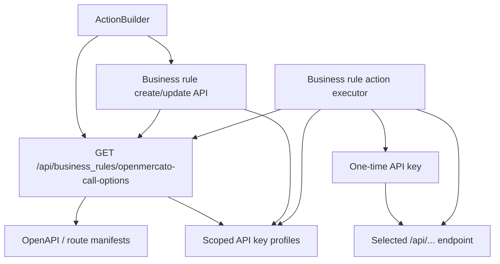

# Call OpenMercato Business Rule Action

## TLDR

Business rules gain an additive `CALL_OPEN_MERCATO` action that lets rule authors choose a safe internal API endpoint and an API key role profile from dropdowns. At runtime the rule creates a short-lived one-time API key from that profile, calls the selected relative `/api/...` endpoint, and soft-deletes the temporary key.

The existing `CALL_WEBHOOK` action is unchanged and continues to require a URL.

## Overview

Business rules already support generic webhooks, but internal Open Mercato automation should not require users to paste local application URLs or manually handle API-key secrets. This spec adds a first-party action type for internal API calls while keeping the action config in the existing JSONB action arrays.

The action is intentionally constrained:

- Endpoint choices come from current OpenAPI/route metadata.
- API key choices expose only safe metadata and role profile information.
- Runtime execution never recovers or reuses the selected API key secret.
- Execution logs and API responses expose only action type, success, and error summary for action results.

## Problem Statement

Rule authors need to trigger internal platform behavior from business rules without configuring external webhooks. A free-form webhook URL is too broad for this use case because it encourages hard-coded local URLs, duplicates internal route knowledge, and makes secret handling unclear.

The platform also cannot recover API key secrets after creation. Reusing a selected key secret is therefore both impossible and undesirable. The selected key must instead act as a role/profile source for a one-time credential created only for the rule execution.

## Proposed Solution

Add `CALL_OPEN_MERCATO` as a new business-rules action type.

Action config shape:

```json
{
  "type": "CALL_OPEN_MERCATO",
  "config": {
    "endpoint": "/api/example/path",
    "method": "POST",
    "apiKeyId": "00000000-0000-4000-8000-000000000000",
    "body": "{\"status\":\"{{status}}\"}"
  }
}
```

`body` is optional and keeps the existing action-body interpolation model. For `GET` requests it is ignored. For other methods, string bodies are interpolated and parsed as JSON when possible.

## Architecture



The options helper is shared by the editor, create/update validation, and runtime execution so the configured endpoint must remain available at execution time.

## Data Models

No database migration is required. Business rules already store `successActions` and `failureActions` as JSONB. The new action adds a JSON shape to those existing arrays.

The selected `apiKeyId` references an existing `ApiKey` row only as a role profile. Runtime execution creates a separate one-time `ApiKey` row using the selected profile's roles and immediately soft-deletes it after the internal call completes.

## API Contracts

### GET /api/business_rules/openmercato-call-options

Requires:

- `business_rules.manage`
- `api_keys.view`

Response:

```typescript
type OpenMercatoCallOptionsResponse = {
  endpoints: Array<{
    id: string
    path: string
    method: 'GET' | 'POST' | 'PUT' | 'PATCH' | 'DELETE'
    label: string
    summary: string | null
    operationId: string | null
  }>
  apiKeys: Array<{
    id: string
    name: string
    keyPrefix: string
    organizationId: string | null
    organizationName: string | null
    roles: Array<{ id: string; name: string | null }>
  }>
}
```

Endpoint filtering:

- Include only relative `/api/...` paths.
- Exclude API documentation routes.
- Exclude the options route itself.
- Exclude deprecated operations.
- Exclude parameterized routes until the action UI can collect path parameters.

API key filtering:

- Include only active, unexpired, non-deleted API keys in the current tenant and selected organization scope.
- Return metadata only; never return secrets, hashed secrets, or authorization headers.

### Business Rule Create/Update

Create/update validation remains backward-compatible for existing action types. When `CALL_OPEN_MERCATO` is present, the route additionally verifies:

- The caller can view API key profiles.
- The selected endpoint and method are currently available.
- The selected API key profile exists in the current tenant/organization scope.
- The selected API key profile has at least one role.

`CALL_WEBHOOK` validation remains unchanged and continues to require `config.url`.

## UI/UX

`ActionBuilder` fetches the OpenMercato call options once per builder via the shared `apiCall` helper. The action type dropdown includes `Call OpenMercato`.

When `CALL_OPEN_MERCATO` is selected:

- The URL, method, and headers inputs used by `CALL_WEBHOOK` are replaced with endpoint and API key selects.
- The endpoint select writes both `endpoint` and `method`.
- The API key select writes `apiKeyId`.
- The existing body field remains visible.
- Loading, empty, and error states render inline so other action types remain usable even when options are unavailable.

## Runtime Execution

The action executor:

1. Validates that the configured endpoint is a currently available relative `/api/...` path for the configured method.
2. Resolves the selected API key profile in the execution tenant and organization scope.
3. Rejects missing, deleted, expired, or role-less profiles.
4. Creates a one-time API key with the selected profile's roles.
5. Calls the selected internal endpoint using `Authorization: apikey ...`, tenant/org headers, and business-rule trace headers.
6. Parses the response body as JSON when possible.
7. Treats non-2xx responses as action failures and marks 5xx failures as retriable.
8. Soft-deletes the one-time key after the call.

## Security

- The selected API key secret is never recovered or reused.
- Generated one-time secrets are not stored in rule config or execution logs.
- Authorization headers are not persisted.
- Endpoint execution is allowlisted by current OpenAPI/route metadata and relative `/api/...` paths.
- API key profile resolution is scoped by tenant and organization.
- The options route requires both business-rule management and API-key viewing permissions.
- Rule execution logs persist only action type, success flag, and error summary for action results.

## Alternatives Considered

### Reuse CALL_WEBHOOK

Rejected. `CALL_WEBHOOK` intentionally supports free-form external HTTP targets. Internal API calls need stronger endpoint allowlisting, API-key profile selection, and no URL field requirement.

### Store and Reuse API Key Secrets

Rejected. API key secrets are not recoverable by design, and storing reusable secrets in business rule config would expand the blast radius of rule reads and logs.

### Add Path Parameter Support in Phase One

Rejected for the initial implementation. Parameterized routes need dedicated UI for path variables and stronger validation. They are excluded until that UX exists.

## Testing Strategy

- Unit validation accepts `CALL_OPEN_MERCATO` with `endpoint`, `method`, and `apiKeyId`.
- Unit validation rejects missing required `CALL_OPEN_MERCATO` fields.
- Existing `CALL_WEBHOOK` validation still rejects a missing `url`.
- Options route tests cover metadata trimming, endpoint exclusions, and feature guards.
- Rule create/update route tests reject malformed configs and unknown or unavailable API key profiles.
- Executor tests cover one-time key create/delete, request headers/body, non-2xx handling, and unsafe endpoint refusal.
- Integration coverage creates a rule with `CALL_OPEN_MERCATO`, verifies no webhook URL validation error, reloads the config, executes a harmless internal endpoint, and cleans up fixtures.

## Risks & Impact Review

### Endpoint Allowlist Drift

- Severity: Medium
- Scenario: A route is available when a rule is saved but removed or deprecated before execution.
- Mitigation: The executor validates against current endpoint options at runtime and fails closed.
- Residual risk: Rules may need reconfiguration after route changes.

### Privilege Amplification Through API Key Profiles

- Severity: High
- Scenario: A rule author selects a profile with broader roles than intended.
- Mitigation: Configuring this action requires `business_rules.manage` and `api_keys.view`. Runtime uses only roles already assigned to a scoped API key profile.
- Residual risk: Administrators must manage API key profiles carefully.

### Secret Exposure in Logs

- Severity: High
- Scenario: A generated one-time API key leaks through execution output or logging.
- Mitigation: Execution responses and logs are mapped to type/success/error summaries, and the executor never returns request headers or secrets.
- Residual risk: Endpoint response bodies may be visible to the in-memory caller, but they are not stored in rule execution logs.

### Missing Path Parameter Support

- Severity: Low
- Scenario: Useful internal endpoints with path parameters are not selectable.
- Mitigation: Parameterized routes are excluded until a typed parameter UI is available.
- Residual risk: Initial endpoint coverage is intentionally narrower.

## Final Compliance Report

- Additive action type; no migration required.
- Existing `CALL_WEBHOOK` behavior is preserved.
- Public API route exports OpenAPI metadata and route metadata.
- UI uses `apiCall`, shared primitives, and i18n keys.
- Tenant and organization scope are enforced on options, profile validation, and runtime execution.
- Spec, spec directory, changelog, unit tests, and integration coverage are included.

## Changelog

### 2026-06-18

- Added the `CALL_OPEN_MERCATO` business-rule action, options route, editor controls, scoped runtime execution, and test coverage.
