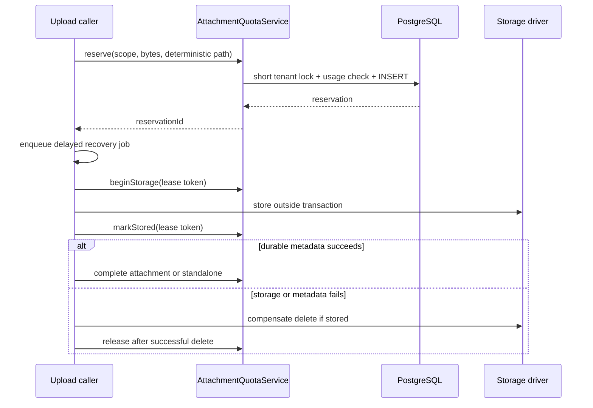

# Atomic storage quota reservations

## TLDR

Open Mercato will replace point-in-time storage-quota checks with a tenant-scoped, durable reservation ledger shared by attachment uploads and standalone S3 uploads. Admission is serialized only for the short database accounting transaction; object-storage I/O remains outside database locks.

The same lifecycle reserves capacity before storage, commits or releases it after durable completion, compensates stored objects when later persistence fails, and schedules durable stale-reservation recovery. The change covers the attachment route, standalone S3 multipart and signed uploads, and the DI `StorageService` while preserving existing route URLs and method signatures.

## Overview

Issue #4043 identified three related defects in the current upload lifecycle:

1. attachment and standalone S3 routes independently read usage and then upload, so concurrent requests can all pass the same snapshot;
2. attachment usage-query errors are converted to zero, making accounting fail open;
3. object storage completes before attachment metadata persistence, but later failures do not remove the object.

These are one deployable capability: a quota reservation has value only when every upload path participates in the same accounting and recovery lifecycle.

The implementation mirrors the checkout module's short, conditional database reservation pattern. It rejects holding a database lock across filesystem or S3 calls and rejects in-memory mutexes because they do not coordinate multiple application processes.

## Problem Statement

`POST /api/attachments` performs `SUM(attachments.file_size)`, then stores the object, then writes the attachment row. `POST /api/storage-providers/s3/upload` similarly lists existing objects before `putObject`. Both are check-then-act races. The signed-upload route and programmatic `StorageService.upload()` do not have a durable quota lifecycle.

The result is tenant quota oversubscription under concurrency, fail-open admission during database errors, and orphaned files after metadata failures or process crashes.

## Proposed Solution

Add an `AttachmentQuotaReservation` ledger and an additive DI service named `attachmentQuotaService`.

### Reservation lifecycle

1. The caller derives a deterministic, create-only target storage path.
2. `reserve` opens a short transaction, obtains a PostgreSQL tenant-keyed advisory transaction lock, evaluates `SUM(attachments.file_size) + SUM(pending.reserved_bytes) + SUM(committed_standalone.actual_bytes) + incoming_bytes`, and inserts a `reserved` row only when the result fits.
3. The caller enqueues a delayed, reservation-specific recovery job before object I/O. Queue failure releases the reservation and aborts the upload.
4. The caller uses its lease token to atomically transition `reserved → storing` and extend the lease beyond the bounded provider-operation timeout. The transaction commits before filesystem or S3 I/O begins.
5. After storage, the caller records `storing → stored` with the same lease token, then persists durable metadata/accounting.
6. Attachment uploads persist the attachment row and atomically remove their reservation because the row becomes authoritative usage. Standalone uploads atomically transition the row to `committed` and store actual bytes because no attachment row exists.
7. Completion is a compare-and-set on reservation ID, status, and lease token. If recovery has claimed the reservation, the caller cannot report success and must run idempotent compensation.
8. Any failed or ambiguous provider outcome is compensated at the deterministic key. The reservation is released only after deletion or a provider `not found` result proves the object is absent. Timeouts, unknown outcomes, and failed compensation retain counted capacity for recovery.

### Stale recovery policy

Reservation states are `reserved`, `storing`, `stored`, `recovering`, and `committed`. Every non-committed state continues to count toward quota until reconciliation succeeds.

- A delayed queue job is created for every reservation and processed idempotently in both local and async queue strategies. Core handles attachment reservations; storage-s3 handles multipart, signed, and programmatic S3 reservations.
- Recovery claims an expired row with `reserved|storing|stored → recovering` compare-and-set and a new lease token. A crashed recovery lease becomes claimable again.
- `reserved` with no started storage can release immediately. `storing` is not claimable until the hard expiry exceeds the maximum bounded provider timeout; recovery then deletes the deterministic key and confirms absence before release. A late original caller is fenced by the lost lease token and also compensates.
- `stored` attachment/multipart/programmatic reservations delete the object and release.
- Signed-proxy reservations inspect the exact key after their fenced storage lease expires. A missing object from a reservation that never started releases; an in-progress reservation gets a second absence check before release; an object within the reserved bound commits; a mismatch deletes and releases. Provider ambiguity retains the row and retries.

Because the recovery job is enqueued before storage, cleanup liveness does not depend on another request using the same source. Admission may re-enqueue expired jobs idempotently as a repair path, but it never ignores or deletes stale rows itself.

### Signed-upload compatibility

The signed-URL request gains optional `size`, ignored for downloads, and the response adds `reservationId`. Upload URLs always target a one-time application proxy so quota completion cannot race a provider request that outlives URL expiry. When `size` is present it is the exact upper bound; when omitted the proxy reserves the configured maximum. The proxy atomically consumes the token, enforces the bound while streaming the body, stores create-only, commits the actual size, and releases unused capacity. This preserves existing request/response shapes without preserving the quota bypass.

Standalone caller-supplied keys become create-only: multipart and signed upload return `409` when the target already exists. The ledger has a database unique constraint on `(tenant_id, storage_driver, storage_path)` across reserved and committed rows, so concurrent same-key reservations cannot both enter the lifecycle. Storage is also create-only at the provider boundary (`If-None-Match: *` for S3 and exclusive-create semantics for local files), covering races with legacy/untracked objects. Generated attachment and `StorageService.upload()` paths are already unique. Reservation IDs and completion/release operations are idempotent.

## Architecture

The core attachments module owns the ledger and service. `@open-mercato/storage-s3` already depends on `@open-mercato/core`, so the provider consumes the additive core service without creating a dependency cycle. Provider-specific object inspection remains in the provider package.

## Data Models

### AttachmentQuotaReservation

| Field | Type | Notes |
|---|---|---|
| `id` | UUID | Client-generated reservation/idempotency key |
| `tenant_id` | UUID | Required quota boundary |
| `organization_id` | UUID | Required audit/cleanup scope |
| `reserved_bytes` | bigint | Non-negative reserved capacity |
| `actual_bytes` | bigint nullable | Final standalone object size |
| `status` | text | `reserved`, `storing`, `stored`, `recovering`, or `committed` |
| `source` | text | Attachment, direct S3, signed S3, or storage service |
| `storage_driver` | text | Driver/provider key |
| `partition_code` | text nullable | Attachment partition when applicable |
| `storage_path` | text | Deterministic cleanup target |
| `lease_token` | UUID | Fences caller and recovery compare-and-set transitions |
| `upload_token_hash` | text nullable | One-time hash for the bounded signed-upload proxy; raw token is never stored |
| `expires_at` | timestamptz nullable | Required for non-committed rows; null for committed rows |
| `created_at` | timestamptz | Creation time |
| `updated_at` | timestamptz | Lifecycle change time |

Indexes support tenant/status accounting and expired-pending scans. A unique constraint on `(tenant_id, storage_driver, storage_path)` prevents duplicate same-key accounting under concurrent reservations. No ORM relationship crosses module boundaries. The table is operational accounting, not user-editable data, so optimistic locking UI requirements do not apply.

## API Contracts

### Existing upload routes

- `POST /api/attachments`: unchanged success schema; returns `413` for exhausted quota and `500` when accounting is unavailable.
- `POST /api/storage-providers/s3/upload`: unchanged success schema; uses the same service and compensates failures.
- `DELETE /api/storage-providers/s3/delete`: unchanged `204`; removes committed standalone accounting after object deletion.

### Signed URL

- `POST /api/storage-providers/s3/signed-url`
- Additive upload request: `size?: number`; downloads remain unchanged.
- Additive response: `reservationId?: string` for upload operations.
- With `size`, the proxy reserves and enforces that exact upper bound.
- Without `size`, the proxy reserves/enforces the configured maximum and commits actual bytes; the existing caller contract remains functional.
- A pre-existing upload key rejects with `409` rather than overwriting.

### Signed-upload compatibility proxy

- New internal route: `PUT /api/storage-providers/s3/signed-upload/{token}`.
- No authenticated session is required; the high-entropy, one-time token is stored only as a hash on the reservation and expires with it.
- The proxy validates the token, target scope/path, `Content-Length` when present, streamed/body bytes against the configured maximum, content security rules, and lease state before create-only storage.
- Success consumes the token and commits actual bytes. Replay, expiry, key conflict, or oversize fails closed.
- Existing download behavior is unchanged.

### Programmatic service

`StorageService.upload`, `delete`, and `getSignedUrl` retain their required parameters. Optional result fields and internal quota-coordinator configuration are additive. The DI registration always supplies the coordinator.

## Migration & Backward Compatibility

- Add one table and indexes; do not rename, remove, or narrow existing schema.
- Add the `attachmentQuotaService` DI key; do not rename existing keys.
- Add optional driver preparation members without changing existing method parameters. The signed-upload request and response only gain optional fields; upload URLs keep the same PUT behavior through the bounded proxy.
- Existing attachment rows remain authoritative and require no backfill.
- Newly committed standalone objects are represented in the ledger. Every S3 upload admission reconciles tenant-scoped provider objects while excluding paths already represented by attachment rows, so legacy standalone objects remain counted without double-counting attachments.
- Failing closed during accounting failures is the intentional security behavior change requested by #4043.

## Implementation Plan

### Phase 1: Red regression coverage and accounting primitive

1. Add route tests proving accounting failures reject and attachment persistence failures delete stored objects.
2. Add deterministic service tests for concurrent reservations, tenant isolation, lifecycle idempotency, and stale recovery.
3. Add the entity, migration, snapshot, quota service, and additive DI registration.

### Phase 2: Attachment lifecycle

1. Add deterministic path preparation to built-in local and S3 drivers through an optional interface member; unsupported external drivers fail closed before storage rather than creating an unrecoverable object.
2. Replace `SUM`/check/store in the attachment route with reserve/store/persist/complete.
3. Keep reservations when compensation fails and verify recovery retries.

### Phase 3: Standalone S3 lifecycle

1. Wire multipart upload, signed upload, the bounded compatibility proxy, programmatic `StorageService`, and delete through the same service.
2. Reconcile legacy direct-upload keys before first provider admission.
3. Add delayed core and provider recovery workers with lease-token compare-and-set transitions and bounded provider calls.
4. Add provider route/service tests for reserve, commit, release, signed reconciliation, overwrite rejection, and delete accounting.

### Phase 4: Verification

1. Generate and review the additive migration and snapshot.
2. Run focused core and storage-s3 tests.
3. Run `build:packages`, `generate`, `build:packages`, `i18n:check-sync`, `typecheck`, `test`, and `build:app`.

## Integration Test Coverage

- Concurrent attachment reservations near quota: exactly one succeeds.
- Attachment accounting failure: upload rejects before storage.
- Attachment metadata failure: stored object is deleted and reservation released; failed deletion remains recoverable.
- Standalone multipart upload and programmatic `StorageService.upload()`: reserve and commit through the common ledger.
- Signed upload with declared size enforces that bound; omitted size enforces the configured maximum; token replay cannot enter storage; missing proxy objects are rechecked before release, valid objects commit, and mismatched objects are removed.
- Standalone delete removes committed usage.
- Tenant and organization scopes never affect another tenant's accounting.

No UI changes are involved.

## Risks & Impact Review

#### Provider failure during compensation
- **Scenario**: metadata fails and the object provider also rejects deletion.
- **Severity**: High
- **Affected area**: attachment and standalone upload capacity
- **Mitigation**: retain the pending reservation and deterministic path; recovery retries before later admission.
- **Residual risk**: the tenant may have reduced available capacity until the provider recovers.

#### Signed upload never completes
- **Scenario**: a client requests a URL but never uploads.
- **Severity**: Medium
- **Affected area**: tenant quota availability
- **Mitigation**: reserve only until URL expiry, then release after confirming the object is absent.
- **Residual risk**: abandoned URLs temporarily reserve capacity.

#### Recovery races an in-flight upload
- **Scenario**: a lease expires while provider I/O or metadata persistence is still running.
- **Severity**: High
- **Affected area**: all upload entrypoints
- **Mitigation**: bounded provider timeout shorter than the hard lease, `reserved → storing → stored` states, lease-token fencing, compare-and-set recovery claim, and idempotent deterministic-key deletion. A caller that loses the lease cannot commit or report success.
- **Residual risk**: provider APIs can have ambiguous outcomes; capacity remains counted and recovery retries until absence is proven.

#### Existing-key overwrite
- **Scenario**: a caller reuses a standalone S3 key while prior accounting/object data exists.
- **Severity**: High
- **Affected area**: standalone multipart and signed S3 uploads
- **Mitigation**: upload targets are create-only; existing keys return `409`. Generated paths remain unique.
- **Mitigation detail**: the ledger unique constraint serializes same-key reservations, while S3 `If-None-Match: *` / local exclusive create covers untracked provider objects.
- **Residual risk**: clients that intentionally overwrote keys must delete first, then upload under quota control.

#### Legacy standalone objects
- **Scenario**: objects created before the ledger are absent from database accounting.
- **Severity**: High
- **Affected area**: standalone S3 quota
- **Mitigation**: preserve the current scoped listing and idempotently reconcile discovered direct-upload keys into committed rows before provider admission.
- **Residual risk**: a tenant using only attachment uploads after deployment is reconciled when a standalone provider entrypoint is next used.

#### Database or parsing failure
- **Scenario**: usage queries or numeric parsing fail.
- **Severity**: High
- **Affected area**: all uploads for the tenant
- **Mitigation**: propagate a typed accounting-unavailable error and reject before object I/O.
- **Residual risk**: uploads are unavailable while authoritative accounting is unavailable.

#### Advisory-lock contention
- **Scenario**: many concurrent uploads target one tenant.
- **Severity**: Low
- **Affected area**: upload admission latency for that tenant
- **Mitigation**: the lock covers only indexed accounting queries and one insert/update; object I/O is outside the transaction.
- **Residual risk**: a noisy tenant serializes its own admissions, which is intentional.

## Final Compliance Report — 2026-07-10

### AGENTS.md Files Reviewed

- `AGENTS.md`
- `packages/core/AGENTS.md`
- `packages/core/src/modules/attachments/AGENTS.md`
- `packages/queue/AGENTS.md`
- `packages/cli/AGENTS.md`
- `.ai/specs/AGENTS.md`

### Compliance Matrix

| Rule Source | Rule | Status | Notes |
|---|---|---|---|
| root and attachments guides | Tenant and organization scope every record/query | Compliant | Ledger requires both scope IDs; tenant lock and reads use tenant ID |
| `BACKWARD_COMPATIBILITY.md` | Schema is additive-only | Compliant | New table and indexes only |
| `BACKWARD_COMPATIBILITY.md` | Stable interfaces and DI keys are not broken | Compliant | New DI key and optional members/fields only |
| packages/core guide | No raw storage I/O inside DB transaction | Compliant | Transaction ends before provider call |
| packages/core guide | Migration and snapshot stay synchronized | Compliant | Required in Phase 1 and verification |
| attachments guide | Scope invariant remains fail-closed | Compliant | Reservation scope is always fully scoped |
| queue guide | Workers are idempotent and support both strategies | Compliant | Each reservation gets a delayed recovery job before storage; queue failure aborts admission |
| root guide | No generated files edited by hand | Compliant | Generator output is produced by commands |

### Internal Consistency Check

| Check | Status | Notes |
|---|---|---|
| Data models match API contracts | Pass | Reservation IDs and sizes map to lifecycle methods |
| API contracts match UI/UX | Pass | Backend-only; no UI changes |
| Risks cover all write operations | Pass | Storage, DB, signed upload, legacy and contention paths covered |
| Commands defined for all mutations | N/A | Internal operational ledger is not a user-domain mutation; service owns the short transactions |
| Cache strategy covers read APIs | N/A | No cached quota reads are introduced |

### Non-Compliant Items

None.

### Verdict

Fully compliant: approved for implementation.

## Changelog

### 2026-07-10
- Initial specification for issue #4043.
- Plan fusion selected a durable ledger plus short tenant lock over in-memory locking and lock-across-I/O alternatives; stale rows remain counted until successful recovery.

### Review — 2026-07-10
- **Reviewer**: fresh-context scope reviewer
- **Security**: revised for lease fencing, ambiguous provider outcomes, exact signed sizes, and overwrite semantics
- **Performance**: passed; tenant serialization is limited to indexed accounting writes
- **Cache**: N/A
- **Commands**: N/A for operational accounting rows
- **Risks**: passed after adding lease fencing, provider conditional create, and the bounded compatibility proxy
- **Verdict**: approved

### Implementation — 2026-07-10
- Added the generated `Migration20260709234741_attachments` reservation ledger and synchronized snapshot; a second `yarn db:generate` reported no schema drift.
- Routed attachment, S3 multipart, signed-upload, programmatic storage, and delete accounting through the shared quota lifecycle with delayed recovery workers.
- Added regression coverage for atomic concurrent admission, fail-closed accounting, orphan cleanup, and the S3 reservation lifecycle.
- Passed package builds, generation, i18n checks, full typecheck and test matrix, production app build, focused ESLint, and migration drift verification.
