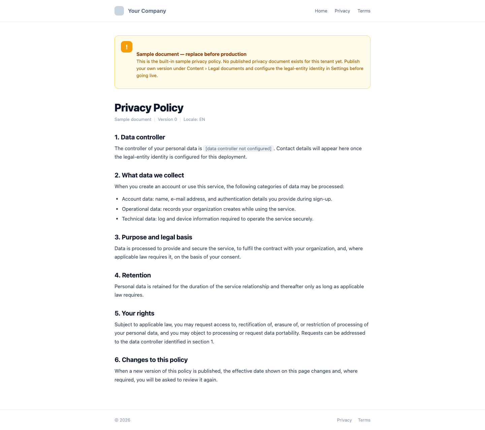
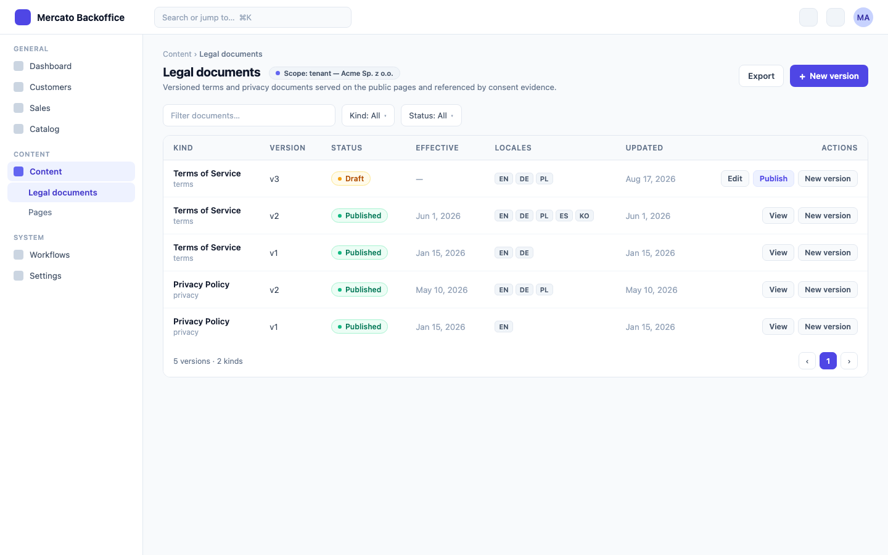

# Tenant Legal Documents and Consent Versioning

> Brief: [`.ai/specs/briefs/2026-08-18-tenant-legal-documents-and-consent-versioning.md`](briefs/2026-08-18-tenant-legal-documents-and-consent-versioning.md). The brief's Resolved-unknowns table pre-answers the module placement (extend `content`), the evidence model (append-only log), the identity storage (tenant-scoped configs), and the checkout stance (defaults + per-link override stays). This spec was authored in an autonomous run; everything the brief left open is resolved in [Resolved assumptions](#resolved-assumptions-autonomous-defaults) below.

## TLDR

**Key Points:**
- Legal documents (`/privacy`, `/terms`) become tenant-scoped, versioned, publishable data records in the `content` module. A fresh install renders a built-in neutral sample clearly banner-marked as a placeholder — never the vendor's legal identity. The vendor's own texts become deployment data of the vendor's own instance (instance-scope rows), not package code.
- Data-controller identity becomes tenant-scoped configuration (`module_configs`, owner `directory`, key `legal_entity`) consumed by `content` documents (token interpolation), `onboarding` consent labels, and the checkout pay-page footer. The next vendor/company rename is a data change, not a multi-module PR.
- `auth` gains an append-only `consent_events` ledger pinning document id, document version, and content hash per grant/withdraw, with a versioned consent-integrity hash payload that keeps every existing `user_consents` row verifiable forever.

**Scope:**
- `content`: module grows a data slice (entity, migrations, CRUD + publish API, admin pages, `acl.ts`, `setup.ts`, `i18n/`), page rendering from records, neutral fallback, AGENTS.md contract amendment.
- `directory`: `legal_entity` config key, resolver helper, settings API + settings page.
- `auth`: `consent_events` entity, `consentLogService`, integrity-hash payload v2 with self-describing version prefix, consent-type registry with document mapping, consent history in the admin user panel.
- `onboarding`: consent labels neutralized and tokenized in all five locales (including the drifted `ko`), terms acceptance finally recorded as consent evidence with a document snapshot.
- `checkout`: new pay links/templates prefill their legal documents from the tenant's published records; the per-link override is untouched.
- `create-app` template + `apps/mercato`: neutralized `DemoFeedbackWidget` fallbacks via the Template Sync Checklist.
- Identity-lock tests (`packages/content/src/__tests__/legal-entity.test.tsx`, `packages/onboarding/src/__tests__/consent-controller-locales.test.ts`) rewritten into neutral-default locks.

**Out of scope (deferred, tracked in Non-goals):** GDPR Art. 17 erasure orchestration (enterprise spec owns it), a `gdpr` umbrella module, a generic CMS, anything from PR #4561 (`documents` module name is claimed), removal of checkout's per-link documents, portal/end-user self-service consent UI, a withdraw UI (the ledger supports withdrawal; no surface ships it yet), anonymization.

**Concerns:**
- The consent-integrity hash payload has been through three security fixes (#2690, #2726, #2743). The versioning design below is explicitly additive (old rows keep verifying under the frozen v1 payload) but still touches that surface — flagged for human confirmation.
- `content`'s AGENTS.md today forbids exactly what this spec adds ("stateless components, no business logic, no API calls"). The amendment is a deliberate, in-scope contract change, not an oversight.

## Resolved assumptions (autonomous defaults)

The brief pre-answered the always-checked split question: this is **one OSS spec** by explicit user decision ("One OSS spec, owned by the `content` module, with the template-defaults neutralization as its independently shippable phase 1"), with rejected alternatives recorded in the brief. The table lists only what the brief left open, resolved per om-spec-writing's autonomous-defaults rules.

| # | Question left open by the brief | Autonomous default | Rationale | Flag |
|---|---|---|---|---|
| A1 | Does the append-only log replace `UserConsent`? | Coexist. New `consent_events` table is the evidence; `user_consents` stays as the mutable current-state projection, upserted by the same service in the same transaction. | Removing or repurposing `user_consents` would break the ADDITIVE-ONLY schema contract and the STABLE `GET /api/auth/users/consents` response; the projection keeps the existing admin panel working unchanged. | — |
| A2 | How do existing rows stay verifiable when the hash payload gains document fields? | Self-describing prefix on the stored hash. Legacy rows (bare hex) verify against the frozen v1 7-field payload forever; new projection writes store `v2:<hex>` over a JSON-array payload with an in-payload domain tag; ledger rows store `cev1:<hex>` over their own event payload. Golden-hash unit tests pin all three byte layouts. No re-hash migration, ever. | The only design that never flips `integrityValid` on stored rows. Still a change to a thrice-audited security surface, so a human should confirm the payload shapes before implementation. | ⚠ NEEDS HUMAN CONFIRMATION |
| A3 | How is the consentType→document mapping declared (marketing has none; terms/privacy do)? | A static registry in `auth`'s `lib/consentTypes.ts`: `consentTypeDefinitions` with `{ id, labelKey, documentKind? }`. `marketing_email` → no document; new types `terms` → kind `terms`, `privacy` → kind `privacy`. The link is a string kind, never an import of `content`. | Smallest declarative surface; replaces the hardcoded English label map in `UserConsentsPanel` with i18n keys; keeps auth decoupled from content (FK-id + string convention). | — |
| A4 | Controller-identity config: owner module, key, value shape? | Owner `directory` (tenant/organization master data), `moduleId: 'directory'`, `name: 'legal_entity'`, JSON value `{ name, email?, address?, registration? }`. Settings page and API live in `directory`. | The brief rules out `content` as owner; `directory` already owns tenant/org identity. A wrong owner costs a config-key migration and a moved settings page — bounded rework. | — |
| A5 | Legal-document locale/version shape? | One row per version; `locales` jsonb map `{ [locale]: { title, markdown } }`. A version covers all locales atomically. | Matches how legal documents version in practice (one effective text, N translations); fewest rows; single content hash per version. | — |
| A6 | Evidence fidelity vs. instant rename: are identity tokens interpolated live at render? | No — publish **bakes** tokens into an immutable `published_locales` snapshot; the content hash covers the baked text. A rename inside documents therefore requires a one-click republish; labels and footers (config-read surfaces) still update live. | The audit question this spec exists to answer is "which exact text was in force". A hash over un-interpolated templates cannot answer it because config rows keep no history. | — |
| A7 | Does Phase 1 need per-tenant seed rows for neutral defaults? | No. Neutral samples ship as package constants used as a render fallback when no published row resolves; nothing is seeded. | Zero migration and zero drift. The brief is internally inconsistent here — its Agreed-direction item 5 says "neutral sample seeds" while its Resolved-unknowns table says "fallback to built-in neutral sample text clearly marked as a placeholder"; this spec follows the Resolved-unknowns table (the brief's authoritative gate-answer section) and records the discrepancy. | — |
| A8 | Admin UI scope? | Document list/edit/publish pages (Phase 1), legal-entity settings page (Phase 2), read-only consent history inside the existing `UserConsentsPanel` (Phase 3). No withdraw UI, no portal self-service, no consent report/export. | Smallest surface that makes each phase operable without the CLI. | — |
| A9 | What happens to consent evidence when the data subject is erased (Art. 17 / enterprise `data_erasure`)? | Hard-deleting an `auth` user also hard-deletes that user's `user_consents` and `consent_events` rows (auth-side, keyed by `user_id`). No post-erasure consent-proof retention or anonymized stub. | Consistent with the enterprise erasure spec's privacy-maximal stance and keeps this spec collision-free with it (that spec never touches consent tables). Some DPO practices retain anonymized consent proof for Art. 7(1) defense — a compliance-policy call a human must make. | ⚠ NEEDS HUMAN CONFIRMATION |
| A10 | The demo-feedback route's hardcoded fallback admin address (`piotr@catchthetornado.com`)? | Removed. Unset `ADMIN_EMAIL` → the route skips the send and logs a warning instead of mailing a superseded vendor address. | Same vendor-identity-leak class Phase 1 exists to remove; two-line change in a file the phase already touches. | — |
| A11 | How does the checkout footer consume controller identity? | The public pay GET response gains an additive optional `legalEntity` field (`{ name: string }` or `null`); `PayPageFooter` renders one line when present. | The brief names the checkout footer as a consumer; an additive optional response field is the smallest mechanism. Checkout's Ask-First rule on public pay-page contracts is satisfied by this spec's review gate. | — |
| A12 | What do the neutral samples actually say? | English-only, jurisdiction-neutral sample terms/privacy derived from the current documents' structure with identity tokens; governing-law, jurisdiction, and liability-cap clauses are omitted (an operator must supply those); every render of a sample carries a visible "Sample document — replace before production" banner. | Placeholders must not fabricate legal specifics that no operator has adopted. | — |

## Overview

Every app scaffolded by `create-mercato-app` enables `content` and `onboarding` by default (`packages/create-app/template/src/modules.ts:87-88`; the brief's `:81-82` reference predates drift) and therefore serves Open Mercato sp. z o.o.'s privacy policy, terms of service, and marketing-consent labels as its own. The legal identity is baked into package code in two layers — JSX prose in `packages/content` and locale JSON plus English `translate()` fallbacks in `packages/onboarding` — which is why one vendor rename cost two PRs across two modules (#4755, #4751) and why the repo grew identity-lock tests to manage the coupling. Meanwhile `auth` records that consent happened but not against which document text: `user_consents` is a mutable singleton per `(user, tenant, consentType)`, terms acceptance is validated and discarded, and `checkout` carries its own immutable per-transaction consent proof that nothing else reuses.

This spec turns the mechanism into framework code and the identity into data: versioned legal-document records in `content` with a neutral built-in fallback, controller identity in tenant-scoped configuration, and an append-only consent ledger in `auth` that pins the document version and content hash in force at consent time.

> **Market Reference**: surveyed how leading open-source platforms ship legal pages and consent records. A widely deployed open-source community platform seeds editable terms/privacy templates that interpolate a configurable company name and treats an unconfigured identity as explicitly unconfigured rather than substituting the vendor's — adopted (neutral-unless-configured, identity as configuration). Open-source ERP/commerce suites keep the legal entity on the company/instance record and render policy pages from data — adopted (documents as tenant data). A common open-source identity provider records terms acceptance as a bare timestamp with no document version — the exact gap this spec closes. Consent-record standardization (ISO/IEC TS 27560, and GDPR Art. 7(1)'s burden of proof) prescribes append-only consent records referencing the notice version and content — adopted (event ledger with document id + version + hash). Rejected complexity: full consent-receipt exchange formats and user-facing cryptographic receipts; per-locale document versions (a version here covers all locales atomically).

## Problem Statement

1. **A fresh install impersonates the vendor.** `/privacy` and `/terms` are ~660 lines of hardcoded English JSX carrying the vendor's KRS/REGON/NIP, registered address, contact email, share capital, governing law, and liability cap (`packages/content/src/modules/content/frontend/{privacy,terms}/page.tsx`). Every scaffolded client app publishes legally false statements naming a data controller that does not process that app's data.
2. **Identity changes are code changes in N modules.** The controller name lives in content JSX, five onboarding locale files (`i18n/{en,pl,de,es,ko}.json:14,56,58`), English fallbacks inside `OnboardingPageClient.tsx` and two byte-identical `DemoFeedbackWidget.tsx` copies, plus repo documents. `ko.json` still names the superseded entity ("CT Tornado") because the identity-lock test only iterates `de,en,es,pl` — live proof the lock approach does not scale.
3. **Consent evidence cannot answer an auditor.** `user_consents` is unique per `(user_id, tenant_id, consent_type)` and mutable — re-consent overwrites prior evidence. No document id, version, or content hash is recorded. Terms acceptance (`termsAccepted: z.literal(true)`) is never persisted at all. The integrity HMAC payload is positional, unescaped, and unversioned, so it cannot gain fields without invalidating every stored row at the single verification site (`packages/core/src/modules/auth/api/users/consents/route.ts:115-123`).
4. **Three copies of the legal-documents concept.** Content ships static pages, checkout ships per-link `{ terms, privacyPolicy }` documents with an immutable acceptance proof, and onboarding links to `/terms` while recording nothing. There is no shared source pay links could default from.

## Proposed Solution

Four capabilities, one owning module each, coupled only through FK-id + snapshot, DI soft-resolution, and tenant-scoped configuration:

1. **`content` owns legal documents as data.** A `legal_documents` entity (one row = one version of one kind for one scope) with draft→published lifecycle, per-locale content, publish-time token baking, and a SHA-256 content hash over the baked text. `/privacy` and `/terms` resolve: tenant published rows → instance published rows (`tenant_id IS NULL`) → built-in neutral sample with a placeholder banner. This deliberately amends `content`'s AGENTS.md contract.
2. **`directory` owns controller identity as configuration.** One `module_configs` entry (`directory` / `legal_entity`) resolved through the existing tenant→instance fallback of `moduleConfigService`, exposed via a fail-open resolver helper (the `search` module's resolver pattern), a small settings API, and a settings page.
3. **`auth` owns consent evidence.** An append-only `consent_events` ledger plus a `consentLogService` that writes the event and upserts the `user_consents` projection in one transaction, with versioned integrity hashes and a consent-type registry mapping types to document kinds.
4. **`onboarding` and `checkout` consume, never own.** Onboarding records terms + marketing consent events with the instance document snapshot captured at submit; checkout prefills new links/templates from the tenant's published documents (client-side, degrade-to-empty) and renders the configured legal-entity name in the pay-page footer.

### Design Decisions

| Decision | Rationale |
|----------|-----------|
| Single `legal_documents` table (row = version) instead of document + versions tables | The version row's uuid is exactly the "document id" consent evidence needs; grouping is `(scope, kind)`; one table less to migrate, guard, and enrich. |
| Publish bakes identity tokens into `published_locales`; hash covers baked text | Evidence must pin what the user could actually read. Config has no history, so live interpolation would make the hash unreconstructible. See A6. |
| Published rows are immutable and undeletable; corrections are a new version | Anything consent evidence points at must never change. Draft CRUD is fully undoable; `publish` is the documented undoability exception (precedent: the enterprise erasure ledger). |
| Neutral fallback is code, not seed data | No per-tenant markdown blobs to seed, migrate, or drift; "explicitly unconfigured" beats "looks configured". See A7. |
| Instance scope = `tenant_id IS NULL` rows, mirroring `module_configs` | The vendor (or any operator) stores its real documents as deployment data of its own instance; every tenant without overrides inherits them; the platform-host `/privacy` page has a well-defined source without inventing a "default tenant". |
| Identity config in `directory`, not `content` and not a content entity | Four modules consume it; putting it in content would make onboarding depend on content for something that is not content (brief decision); `directory` already owns tenant/org master data. |
| `consent_events` + `user_consents` projection, written together | Evidence and current state have different shapes and different mutability. The projection preserves every existing contract (table, API, panel). See A1. |
| Hash version lives inside the stored value (`v2:`/`cev1:` prefix) and inside the signed payload | Self-describing rows need no schema flag and no backfill; the in-payload domain tag prevents cross-format collisions; absent prefix = frozen legacy v1 semantics forever. See A2. |
| Cross-module reads: onboarding→content and checkout→content via soft-optional resolution | Onboarding resolves `legalDocumentService` from DI in `try/catch` (absent content → consent events with null document fields); checkout prefills via authenticated `apiCall` (404/403 → empty form as today). No hard `requires`, no cross-module ORM, matching the decoupling test. |
| Consent writes go through a DI service, not command-bus commands | The ledger is deliberately not undoable (evidence), has no admin mutation route, and is written from system flows (provisioning). Draft-document CRUD, by contrast, uses regular undoable commands via `makeCrudRoute`. |

### Alternatives Considered

| Alternative | Why Rejected |
|-------------|-------------|
| Monolithic `gdpr` module | GDPR capabilities already have owners (content/auth/checkout/enterprise erasure); an umbrella needs cross-module reach the architecture forbids (brief). |
| Separate narrow `legal_documents` module | Hollows `content` into a renderer of another module's data; pages + data are one responsibility (brief). Module name `documents` is additionally claimed by PR #4561. |
| Pin document version on the mutable `user_consents` row | Re-consent overwrites prior evidence — defeats the audit purpose (brief). |
| Live token interpolation at render | Hash could not attest the rendered text; config history does not exist. |
| Re-hash existing consent rows to v2 in a migration | Requires the HMAC secret at migration time, rewrites evidence in place (an auditor's nightmare), and gains nothing over prefix dispatch. |
| Seeding neutral documents per tenant in `setup.ts` | Data to migrate and drift for zero benefit over a code fallback; complicates the "is this configured?" signal. |

## User Stories

- An **operator scaffolding a new app** wants `/privacy` and `/terms` to be visibly placeholder content so that the app never publishes another company's legal identity as its own.
- A **tenant admin** wants to author, translate, and publish versioned legal documents and set the data-controller identity so that public pages, consent labels, and checkout defaults reflect their company.
- A **DPO / auditor** wants every consent grant and withdrawal recorded immutably with the document version and content hash in force so that Art. 7(1) proof survives re-consent and document updates.
- A **platform vendor** wants its own legal texts to be deployment data of its own instance so that a company rename is a data change, not a multi-module release.
- A **checkout admin** wants new pay links to start from the tenant's published terms/privacy so that bespoke per-link documents remain possible but the default is right.

## Architecture

```
                    ┌────────────────────────────────────────────────────────┐
                    │ directory (owner: controller identity)                 │
                    │  module_configs: ('directory','legal_entity')          │
                    │  lib/legalEntity.ts: resolveLegalEntityIdentity(...)   │
                    │  GET/PUT /api/directory/legal-entity + settings page   │
                    └───────┬──────────────────┬──────────────────┬──────────┘
              config read   │                  │                  │  config read
             (bake at publish)                 │ (labels, disclosure)        (footer line)
                    ▼                          ▼                  ▼
┌───────────────────────────────┐   ┌──────────────────┐   ┌─────────────────────┐
│ content (owner: documents)    │   │ onboarding       │   │ checkout            │
│  entity: legal_documents      │   │  submit: snapshot│   │  form prefill via   │
│  CRUD + publish (commands +   │   │  instance terms  │   │  GET /legal-documents│
│  guarded action route)        │◄──┤  via DI try/resolve │  /current (apiCall,  │
│  /privacy /terms render:      │   │  verify: record  │   │  degrade to empty)  │
│  tenant → instance → sample   │   │  consent events  │   │  per-link jsonb copy│
│  event: content.legal_document│   └────────┬─────────┘   │  stays authoritative│
│  .published                   │            │             └─────────────────────┘
└───────────────────────────────┘            │ consentLogService.record(...)
                                             ▼
                              ┌────────────────────────────────────┐
                              │ auth (owner: consent evidence)     │
                              │  consent_events (append-only)      │
                              │  user_consents (projection, upsert)│
                              │  hash: cev1 / v2 / legacy dispatch │
                              │  events: auth.consent.granted /    │
                              │          auth.consent.withdrawn    │
                              └────────────────────────────────────┘
```

### Module boundaries and coupling

| Touchpoint | Mechanism | Glue owner | Peer-absent behavior |
|---|---|---|---|
| onboarding → content (document snapshot at submit) | soft-optional DI resolve of `legalDocumentService` in `try/catch` | onboarding | Consent events record null document fields; flow unaffected |
| onboarding → auth (record consent) | DI service `consentLogService` (auth is a hard platform dependency of onboarding already — it creates users) | onboarding | n/a (auth always present) |
| checkout → content (prefill defaults) | authenticated `apiCall` from the admin form to `GET /api/content/legal-documents/current` | checkout | 404/403/network error → empty defaults exactly as today |
| content / onboarding / checkout → directory (identity) | fail-open resolver helper over `moduleConfigService` (duck-typed `{ resolve }`), copied from the `search` global-search-config pattern | each consumer | Neutral fallback phrase / hidden disclosure / no footer line |
| content → customer_accounts (tenant for public pages on a custom domain) | soft-optional DI resolve of `domainMappingService` in `try/catch` | content | Platform host or module absent → instance-scope resolution (then sample) |
| auth → content | **none** — auth stores `document_id`/`document_kind`/`document_version`/`document_content_hash` as its own snapshot columns (FK-id + snapshot), callers pass them in | callers | Null document fields |
| enterprise `data_erasure` → consent tables | **none directly** — erasure calls `auth.users.delete`, whose hard-delete cascade this spec extends to consent rows | auth | n/a |

No new cross-module ORM relations. No core module names an enterprise identifier. Every identity consumer (content, onboarding, checkout, and directory's own settings surface) resolves `moduleConfigService` defensively.

### Commands & Events

- **Commands** (undoable, via `makeCrudRoute`): `content.legal_documents.create`, `content.legal_documents.update`, `content.legal_documents.delete` — drafts only; update/delete refuse published rows.
- **Guarded action** (not undoable, documented exception): `POST /api/content/legal-documents/[id]/publish` — mutation-guard registry + optimistic-lock header, bakes tokens, computes hash, flips status.
- **Events** (additive):
  - `content.legal_document.published` — payload `{ id, tenantId, organizationId, kind, version, contentHash }`. Consumed by content's own cache invalidation; the hook for a future re-consent flow.
  - `auth.consent.granted`, `auth.consent.withdrawn` — payload `{ id, userId, tenantId, organizationId, consentType, documentId?, documentVersion? }`.
- Naming note: event ids use the singular entity per the root convention (`auth.user.created` precedent); ACL features and command ids use the plural resource per in-repo reality (`customers.people.view`, `customers.tags.create` precedents).

## Data Models

### LegalDocument (`content`, table `legal_documents`) — NEW

One row is one version of one document kind in one scope. Rows with `tenant_id IS NULL` are instance-scope (inheritable by every tenant), mirroring `module_configs` semantics.

| Column | Type | Notes |
|---|---|---|
| `id` | uuid PK, `gen_random_uuid()` | The "document id" consent evidence references — identifies exactly one version |
| `tenant_id` | uuid NULL | NULL = instance scope |
| `organization_id` | uuid NULL | Always NULL in v1 (documents are tenant-wide); column present per platform convention |
| `kind` | text | `terms` \| `privacy`; open string for future kinds |
| `version` | int | Monotonic per `(scope, kind)`, assigned at creation (`max + 1`) |
| `status` | text | `draft` \| `published` |
| `locales` | jsonb | Authored source with identity tokens: `{ [locale]: { title, markdown } }` |
| `published_locales` | jsonb NULL | Token-baked snapshot, written once at publish, immutable |
| `content_hash` | text NULL | `sha256:<hex>` digest over the canonical JSON (sorted keys) of `{ kind, version, locales: published_locales }`, set at publish. Algorithm-prefixed format follows the digest convention the `documents` module introduces (PR #4561, `contentDigest`/`previewDigest` as `sha256:<64 hex>` with golden-vector tests); the same string is copied verbatim into every snapshot column (`auth.document_content_hash`, onboarding) and event payload |
| `effective_at` | timestamptz NULL | Set at publish (defaults to publish time; future dates allowed) |
| `published_at` | timestamptz NULL | |
| `created_at` / `updated_at` / `deleted_at` | timestamptz | `updated_at` powers optimistic locking (entity is user-editable → default ON, `updatedAt` returned in list/detail) |

Indexes: partial uniques `("tenant_id","kind","version") where tenant_id is not null and deleted_at is null` and `("kind","version") where tenant_id is null and deleted_at is null`; lookup index `(tenant_id, kind, status, effective_at)`.

Immutability rules (enforced in commands + publish route): `published` rows reject update and delete; drafts are fully editable and soft-deletable. Resolution for rendering: highest `version` among `status='published' AND effective_at <= now()` for `(tenant, kind)`, else same query at instance scope, else built-in sample (`document_id = null`, `version = 0`, hash computed over the resolved sample at evaluation time). For an unauthenticated public request, the tenant scope comes from the custom-domain mapping when one resolves (soft-optional `domainMappingService`, see the coupling table); on the platform host there is no ambient tenant, so resolution starts at instance scope.

New module infrastructure this entails: `packages/content/src/modules/content/{data/entities.ts, data/validators.ts, api/, backend/, lib/, i18n/, acl.ts, setup.ts, di.ts, events.ts, commands/, migrations/ + .snapshot-open-mercato.json}` — the module today has none of these (only `frontend/` + `index.ts`), and `package.json` gains the standard entity/CRUD dependencies.

### ConsentEvent (`auth`, table `consent_events`) — NEW, append-only

| Column | Type | Notes |
|---|---|---|
| `id` | uuid PK | |
| `user_id` | uuid | indexed |
| `tenant_id` / `organization_id` | uuid NULL | |
| `consent_type` | text | From the consent-type registry |
| `action` | text | `granted` \| `withdrawn` |
| `occurred_at` | timestamptz | |
| `source` | text NULL | e.g. `onboarding` |
| `ip_address` | text NULL | **Encrypted** via a new `auth` `defaultEncryptionMaps` entry; reads via `findWithDecryption`; hash computed over plaintext before encryption |
| `document_id` | uuid NULL | FK-id snapshot of `legal_documents.id` — no ORM relation |
| `document_kind` | text NULL | |
| `document_version` | int NULL | `0` = built-in sample |
| `document_content_hash` | text NULL | |
| `integrity_hash` | text | `cev1:<hex>` (see hash design) |
| `created_at` | timestamptz | Deliberately **no** `updated_at` / `deleted_at`: append-only; rows are never updated; the only delete path is subject erasure (A9). Not user-editable → optimistic-locking rule N/A. |

Index: `(user_id, tenant_id, consent_type, occurred_at)`.

### UserConsent (`auth`, table `user_consents`) — ADDITIVE changes only

Four new nullable columns mirroring the event snapshot: `document_id`, `document_kind`, `document_version`, `document_content_hash`. Everything existing (columns, unique constraint, soft delete) is untouched. New writes go exclusively through `consentLogService`, which upserts this row (insert or in-place update on the `(user_id, tenant_id, consent_type)` singleton) alongside the ledger insert in one transaction, and stores a `v2:`-prefixed integrity hash.

### OnboardingRequest (`onboarding`) — ADDITIVE changes only

Three new nullable columns capturing the terms document shown at submit time: `terms_document_id` (uuid), `terms_document_version` (int), `terms_document_content_hash` (text). Written by the submit route (soft-optional content resolution), copied into the terms consent event at verification.

### Consent-integrity hash — versioned payloads

```
stored value                 payload (HMAC-SHA256, secret chain unchanged:
                             CONSENT_INTEGRITY_SECRET → AUTH_SECRET → NEXTAUTH_SECRET → JWT_SECRET)
──────────────────────────── ─────────────────────────────────────────────────────────────
<bare hex>          (legacy) [userId, consentType, String(isGranted), iso(grantedAt),
                              iso(withdrawnAt), ipAddress ?? '', source ?? ''].join('|')
                             — FROZEN byte-for-byte; golden test pins it; never written again
v2:<hex>       (projection)  JSON.stringify(["om-consent-state.v2", userId, tenantId ?? null,
                              consentType, String(isGranted), iso(grantedAt) ?? null,
                              iso(withdrawnAt) ?? null, ipAddress ?? null, source ?? null,
                              documentId ?? null, documentKind ?? null,
                              documentVersion ?? null, documentContentHash ?? null])
cev1:<hex>         (ledger)  JSON.stringify(["om-consent-event.v1", userId, tenantId ?? null,
                              consentType, action, iso(occurredAt), ipAddress ?? null,
                              source ?? null, documentId ?? null, documentKind ?? null,
                              documentVersion ?? null, documentContentHash ?? null])
```

Properties: the JSON-array encoding closes the v1 field-collision gap (a `source` containing `|` can no longer bleed into an adjacent field); the in-payload domain tag prevents cross-format second-preimage games under one secret; `tenantId` enters the signed payload (v1 omitted it); `null` and `''` become distinguishable. Verification dispatches on the stored prefix; an unknown prefix verifies as `false`. `computeConsentIntegrityHash` keeps its exact signature and legacy behavior with a `@deprecated` JSDoc for at least one minor version; new exports `computeConsentStateIntegrityHash` and `computeConsentEventIntegrityHash` sit beside it. Unit tests add golden vectors for all three layouts (v1 currently has none — an accidental payload change is undetectable today).

### Controller identity (`module_configs`, no new table)

`('directory', 'legal_entity')`, JSON value validated by `legalEntityIdentitySchema`:

```ts
{ name: string (1..200), email?: string (email), address?: string (..500), registration?: string (..1000) }
```

Resolution: existing `moduleConfigService` tenant → instance fallback (reads are tenant-keyed only — `organizationId` does not participate, which is why this value is tenant-scoped by design). Resolver helper `resolveLegalEntityIdentity(resolver, { scope })` in `packages/core/src/modules/directory/lib/legalEntity.ts`: duck-typed resolver, `try/catch` fail-open to `null`, and a `source: 'tenant' | 'instance' | 'none'` discriminator for the settings UI.

## API Contracts

### content

- `GET/POST/PUT/DELETE /api/content/legal-documents` — `makeCrudRoute` (commands above, `indexer: { entityType }`, `softDeleteField: 'deletedAt'`). List: filters `kind?`, `status?`; `pageSize ≤ 100`; fields include `id, kind, version, status, effectiveAt, publishedAt, contentHash, updatedAt`. Detail returns `locales` (and `publishedLocales` when published). Guards: `GET → content.legal_documents.view`, writes → `content.legal_documents.manage`. Update/delete of a `published` row → 409 with `content.legalDocuments.errors.publishedImmutable`.
- `POST /api/content/legal-documents/[id]/publish` — custom write route: mutation-guard registry (`update` guard class, `bridgeLegacyGuard`, `runMutationGuards` with `userFeatures`, after-success callbacks), optimistic-lock header from `updatedAt`. Body `{ effectiveAt?: ISO }`. Bakes tokens, computes hash, sets status/publishedAt, emits `content.legal_document.published`, invalidates the render cache tag. Errors: 409 already published, 409 optimistic-lock conflict, 422 no locale content. Not undoable (documented).
- `GET /api/content/legal-documents/current?kinds=terms,privacy&locale=en` — `requireAuth: true`, `content.legal_documents.view`. Returns the resolved current documents for the caller's tenant (tenant → instance; **never** the built-in sample — callers prefill real data or nothing): `{ items: [{ id, kind, version, effectiveAt, contentHash, locale, title, markdown }] }` with per-item locale fallback `requested → en → first available`.
- All routes export `openApi`.

### directory

- `GET /api/directory/legal-entity` → `{ identity: LegalEntityIdentity | null, source: 'tenant' | 'instance' | 'none', updatedAt: string | null }`. `PUT` accepts `legalEntityIdentitySchema`, writes via `moduleConfigService.setValue` scoped to the auth tenant (a null-tenant super admin writes the instance row — the settings page labels this "instance defaults"), enforces optimistic lock from the config record's `updatedAt` (the `entities` settings-route pattern), then `invalidate`s the tenant-scoped cache key. Guards: both methods `directory.legal_entity.manage` (new feature, granted to admin in `directory` setup; note `yarn mercato auth sync-role-acls` for existing tenants).

### auth

- `GET /api/auth/users/consents` — **unchanged route, additive response**: items gain optional `documentId`, `documentKind`, `documentVersion`, `documentContentHash`. Verification dispatch handles all three hash formats; existing rows keep reporting exactly the `integrityValid` they report today.
- `GET /api/auth/users/consents/events?userId=&page=&pageSize=` — NEW, same guard (`auth.users.edit`) and the same scoping discipline the #3820 fix established, applied unconditionally: tenant filter always pinned (null-tenant super admin → pinned to the target user's tenant; non-super-admin without tenant → 403) **and** the organization filter always applied from the resolved organization scope (not conditionally — closing the residual looseness of the sibling route rather than copying it). Sorted `occurred_at DESC`, `pageSize ≤ 100` default 20. Response: `{ ok, items: ConsentEventItem[], total }`.
- `consentLogService` (DI, auth `di.ts`): `record(input: { userId, tenantId, organizationId?, consentType, action, occurredAt?, source?, ipAddress?, document?: { id?, kind?, version?, contentHash? } }): Promise<{ eventId }>` — validates against the consent-type registry, transactionally inserts the event and upserts the projection, computes both hashes, emits the event-bus event. No update/delete methods exist.

### checkout

- `GET /api/checkout/pay/[slug]` — additive optional response field `legalEntity: { name } | null`, resolved server-side from the link's `tenant_id` via the fail-open helper. `PayPageFooter` renders one muted line when present. No other public-contract change; consent-proof shape, spot IDs, and replaceable-component handles untouched.
- `LinkTemplateForm` prefill (client): on create mode only, `apiCall('/api/content/legal-documents/current?kinds=terms,privacy'…)` — mapping content kinds to checkout keys (`terms → terms`, `privacy → privacyPolicy`); success prefills `{ title, markdown, required: false }` per kind; any failure keeps today's empty defaults. Edit mode never re-prefills. The link's own jsonb copy remains the sole source of truth for the public page (snapshot pattern — a later document republish does not mutate existing links).

### onboarding

- `POST /api/onboarding/onboarding` — request/response unchanged. Server-side: soft-optional resolve of `legalDocumentService`; when the instance terms document resolves, its `{ id, version, contentHash }` is stored on the request row.
- `GET /api/onboarding/onboarding/verify` — provisioning now calls `consentLogService.record` (replacing the bare `em.create(UserConsent, …)`): always a `terms` grant (document snapshot from the request row, nulls when content was absent), plus a `marketing_email` grant when `request.marketingConsent`. Still wrapped in `runBestEffortProvisioningStep`. Re-verification is idempotent at the projection level (upsert) and the service skips a duplicate ledger insert when an identical `(user, tenant, type, action, occurredAt)` event already exists.

## Internationalization (i18n)

- `content` finally gains `i18n/{en,de,es,pl,ko}.json`: page chrome (`content.legal.title.privacy/terms`, breadcrumbs), the placeholder banner (`content.legal.sampleBanner`), admin UI strings (`content.legalDocuments.*`), errors. The legal **body** is data (or the en-only sample constant), which retires the "~2000 hardcoded legal strings" problem for these pages at the root; the sample constant file gets a `.hardcoded-allowlist.json` entry (sanctioned legal-copy escape hatch). This subsumes the content-module slice of `.ai/specs/2026-05-26-missing-translations-audit-and-remediation.md` Phase 3.
- `onboarding` locales (all five, `ko` included): `onboarding.form.marketingLabel` / `demoFeedback.form.marketingLabel` rewritten neutrally around a new `{controllerName}` placeholder (alongside the existing `{termsLink}`/`{privacyLink}`); `onboarding.form.controllerFallback` = localized "the operator of this service"; `onboarding.form.legalEntity` replaced by a composition rendered only when identity is configured. The English `translate(key, default)` fallbacks in `OnboardingPageClient.tsx` and both `DemoFeedbackWidget.tsx` copies are neutralized in the same pass (the fallback layer otherwise resurrects the vendor name whenever a key is missing).
- `auth`: `auth.consents.types.*` label keys replacing the hardcoded map in `UserConsentsPanel.tsx:13-15`; `auth.users.consents.history.*` for the new history section.
- `directory`, `checkout`: settings-page and footer keys. Template locale files: only additive nav-level keys if any; byte-parity with `apps/mercato` enforced by the existing template-i18n test.

## UI/UX

Standard CRUD is not re-specified; unique surfaces only. All screens use DS primitives (`Page`/`PageBody`, `DataTable`, `CrudForm`, `Alert`, `StatusBadge`, `SectionHeader`, `CollapsibleSection`, `LoadingMessage`/`ErrorMessage`, `EmptyState`, `flash`), lucide icons, semantic status tokens, dialogs with `Cmd/Ctrl+Enter`/`Escape`, `aria-label` on icon-only buttons.

1. **Public `/privacy` and `/terms`** (existing routes, re-rendered from data): `ContentLayout` retained; body = sanitized markdown (`MarkdownContent`) of the resolved document in the active locale (fallback `en` → first available). When the built-in sample renders, a prominent `Alert variant="warning"` banner: "Sample document — replace before production" (localized). `ContentLayout` chrome (logo path, wordmark, footer copyright line) switches to the configured identity name with a neutral fallback — Boy Scout scope for lines touched.
   
2. **Backend: Content → Legal documents** (`/backend/content/legal-documents`, list): DataTable with stable `entityId`; columns kind, version, `StatusBadge` (draft/published), effective date, updated. Row actions: edit (draft), view (published), publish (draft, confirm dialog stating immutability), "New version from this" (copies `locales`, version = max+1, draft). Scope note chip when the actor manages instance rows (null-tenant super admin).
   
3. **Backend: legal-document editor** (create/edit): CrudForm; kind select (create only), per-locale tabs with title `Input` + markdown editor (the same switchable markdown input checkout's legal section uses), token helper hint listing `{{controllerName}}`, `{{controllerEmail}}`, `{{controllerAddress}}`, `{{controllerRegistration}}`. Published documents open read-only with the baked text and hash shown.
   
4. **Backend: Settings → Legal entity** (`/backend/config/legal-entity`, `pageContext: 'settings'`, `pageGroupKey: 'settings.sections.moduleConfigs'`, in `directory`): four fields per the schema, a source chip ("tenant" / "inherited from instance" / "not configured"), save via guarded mutation with optimistic-lock conflict surfaced through `surfaceRecordConflict`.
   
5. **Backend: user consents panel** (existing, additive): each consent card gains a `CollapsibleSection` "History" that lazily loads the events endpoint — action, timestamp, source, document kind + version, hash integrity icon (same `ShieldCheck`/`ShieldAlert` pattern).
6. **Checkout pay page footer**: one muted line with the configured legal-entity name; nothing renders when unconfigured.
7. **Onboarding page**: labels interpolate the resolved controller name (or the neutral fallback phrase); the registry-disclosure paragraph renders only when identity is configured.

Frontend-architecture note: both public pages remain server components (no `"use client"` additions; the pages go from static JSX to one indexed query + markdown render server-side). Admin pages follow the existing backend client-page pattern — no new providers, no bundle-budget-relevant additions beyond the markdown editor already used elsewhere.

## Configuration

- No new environment variables. The integrity-hash secret chain is unchanged.
- New config key: `('directory','legal_entity')` (above). Neutral behavior when unset everywhere.
- Cache: document render resolution cached via DI cache, key `content:legal-documents:<tenantId|instance>:<kind>`, TTL 60 s (mirrors `module_configs`), tags `content:legal-documents` + `tenant:<id>`; invalidated on publish/update/delete and by the publish event handler. Cache miss → single indexed query (point lookup). Config reads ride `moduleConfigService`'s built-in 60 s cache; the settings PUT calls `invalidate` so the public surfaces converge immediately rather than after TTL.

## Edge Cases & Failure Scenarios

| Scenario | Behavior |
|---|---|
| No published document, tenant or instance | Neutral sample + banner; consent evidence records `document_id = null`, `version = 0`, hash of the resolved sample — never blocks signup or rendering |
| Identity unconfigured | Tokens bake to bracketed `[data controller not configured]` in documents; labels use the localized fallback phrase; disclosure and footer line hidden |
| Document published between onboarding submit and verify | Evidence pins the submit-time snapshot from the request row (that is what the user saw) |
| Content module disabled in an app | Onboarding records events with null document fields (soft resolve); checkout prefill degrades to empty; `/privacy`/`/terms` routes simply don't exist (as today when content is off) |
| `moduleConfigService` or cache unavailable | Fail-open helpers return `null` identity / fall through to direct query; pages still render |
| Publish with future `effective_at` | Render keeps serving the previous effective version until the moment passes; consent evidence always references the resolved (currently effective) version |
| Two admins publish concurrently | Optimistic-lock header on publish → second gets 409 conflict bar; version uniqueness is DB-enforced |
| Draft edited while another admin publishes it | Publish requires the lock header; the stale editor's subsequent save hits the published-row 409 |
| Re-consent (grant after withdraw, or repeat grant) | New ledger row; projection upserted — history preserved, singleton constraint satisfied; duplicate-event guard keeps re-verification idempotent |
| Consent write fails mid-transaction | Single transaction: no event without projection and vice versa; onboarding wraps it best-effort (logged, provisioning continues) exactly as today |
| Hash secret absent in production | Unchanged existing behavior: `getSecret()` throws (fails closed) |
| Legacy consent row read | Bare-hex prefix → frozen v1 verification; `integrityValid` identical to today, permanently |
| User erased (Art. 17) | `auth.users.delete` cascade removes the user's consent rows (A9); the enterprise erasure ledger never stores consent PII |
| Tenant with a huge document set | Bounded: documents grow by explicit versions only; list is paginated; render is a point lookup |
| Sample-hash drift across releases | The sample hash is computed at event time from the shipped constant; a release changing the sample changes future evidence only — recorded hashes stay historically accurate (they attest what was shown then); golden test pins the current sample hash so changes are deliberate |

## Risks & Impact Review

#### Consent-integrity payload change breaks stored evidence
- **Scenario**: A payload or dispatch mistake flips `integrityValid` to false (or worse, true) for existing rows.
- **Severity**: High
- **Affected area**: `auth` consent read route, admin panel, audit posture; scrutiny history #2690/#2726/#2743.
- **Mitigation**: Legacy builder frozen byte-for-byte and locked by a new golden-hash test (none exists today); dispatch on stored prefix with unknown-prefix → false; v2/cev1 payloads JSON-encoded with in-payload domain tags; no re-hash migration; secret chain untouched.
- **Residual risk**: Design-level payload choices — flagged ⚠ (A2) for human review before implementation.

#### Instance-scope inheritance leaks the wrong documents to a tenant
- **Scenario**: A tenant without its own documents serves the operator's instance documents; on a multi-tenant SaaS these may name the operator, not the tenant, as controller.
- **Severity**: Medium
- **Affected area**: Public pages, consent evidence correctness.
- **Mitigation**: This mirrors `module_configs` semantics and is the intended single-operator story; the admin list shows a "inherited from instance" source; documentation states multi-tenant operators should leave instance rows neutral. Tenant rows are always strictly tenant-filtered — no cross-**tenant** row can ever resolve (queries filter `tenant_id = :t OR tenant_id IS NULL`, nothing else).
- **Residual risk**: Operator misconfiguration; acceptable — it is strictly better than today's hardcoded vendor identity.

#### Consent tables diverge from the ledger
- **Scenario**: Partial write leaves projection without event or vice versa.
- **Severity**: Medium
- **Affected area**: Audit trail coherence.
- **Mitigation**: Single service, single transaction; no other write path (the onboarding bare `em.create` is removed); integration test asserts both rows from one flow.
- **Residual risk**: Direct-DB writes bypassing the service — out of scope, as for every entity.

#### Published-document immutability bypass
- **Scenario**: An update path mutates a published row consent evidence points at.
- **Severity**: High
- **Affected area**: Evidence validity.
- **Mitigation**: Refusal in commands and publish route (409), no API accepts `published_locales`/`content_hash` from clients, unit tests pin the refusal; content hash lets any auditor detect mutation after the fact.
- **Residual risk**: Direct-DB edits; detectable via hash mismatch.

#### Neutralization regresses the vendor's own deployment
- **Scenario**: Phase 1 ships; openmercato.com serves placeholder legal pages until its real texts are loaded as instance rows.
- **Severity**: Medium (vendor-operational, not framework)
- **Affected area**: Vendor's public instance.
- **Mitigation**: Phase 1 includes the entity + API, so the vendor can load its documents as instance rows at deploy time (UPGRADE_NOTES gives the exact operator runbook); the old texts remain available in git history for that one-time import.
- **Residual risk**: A deployment window with placeholder pages on the vendor instance; bounded and vendor-controlled.

#### Template/app drift on the neutralized components
- **Scenario**: `DemoFeedbackWidget` copies or locale files drift between `apps/mercato` and the template.
- **Severity**: Low
- **Affected area**: Scaffolded apps.
- **Mitigation**: Template Sync Checklist + `yarn template:sync:fix` + existing byte-parity tests; the rewritten identity-lock tests assert the *absence* of both vendor identities (current and superseded) across all five locales including `ko`, which the old lock missed.
- **Residual risk**: Minimal.

#### Blast radius / rollback
- Phases are additive and independently shippable; rollback of any phase is a release revert with no data migration to unwind (new tables/columns are inert when unused). Publish is the sole non-undoable mutation, corrected forward by publishing a new version. Failure of the new surfaces degrades to today's behavior at every seam (fail-open helpers, best-effort provisioning, prefill fallback). Detection: existing structured logging on the consent service and provisioning steps; no new alerting infrastructure required.

## Migration & Backward Compatibility

Contract surfaces per `BACKWARD_COMPATIBILITY.md`:

| Surface | Change | Classification |
|---|---|---|
| Database schema | New tables `legal_documents`, `consent_events`; new nullable columns on `user_consents` (4) and `onboarding_requests` (3); new indexes | ✓ ADDITIVE (defaults NULL, nothing renamed/removed/narrowed) |
| `user_consents.integrity_hash` **values** | New writes carry a `v2:` prefix; column type `text` unchanged; legacy bare-hex rows verify under the frozen v1 payload indefinitely | ✓ Behavior-preserving for existing rows; value format documented in UPGRADE_NOTES |
| Function signatures | `computeConsentIntegrityHash` unchanged + `@deprecated` (bridge ≥ 1 minor); new sibling exports; `verifyConsentIntegrityHash` keeps its signature, gains prefix dispatch | ✓ ADDITIVE + deprecation protocol |
| API routes | New: content CRUD + publish + current, directory legal-entity, auth consent events. Existing `GET /api/auth/users/consents` and `GET /api/checkout/pay/[slug]` gain **optional** response fields | ✓ ADDITIVE (new routes; optional response fields) |
| Type definitions | `ConsentItem` gains optional fields; new exported types (`ConsentTypeDefinition`, `LegalEntityIdentity`, …) | ✓ ADDITIVE |
| Event IDs | Three new events; none renamed/removed | ✓ ADDITIVE |
| ACL feature IDs | New: `content.legal_documents.view/manage`, `directory.legal_entity.manage`; existing untouched; post-deploy `yarn mercato auth sync-role-acls` | ✓ ADDITIVE |
| DI service names | New: `legalDocumentService` (content), `consentLogService` (auth); none renamed | ✓ ADDITIVE |
| Widget spot IDs / replaceable handles | Untouched (checkout legal-consent spots, footer handle keep ids and context shapes) | ✓ No change |
| `data/validators.ts` | Checkout schemas untouched; new schema files in content/directory | ✓ No change / additive |
| Convention files | content gains `acl.ts`, `setup.ts`, `di.ts`, `events.ts` etc. — new files under FROZEN conventions, no convention altered | ✓ ADDITIVE |
| Generated files | Standard `yarn generate` output for new module files | ✓ ADDITIVE |
| Page content of `/privacy`, `/terms`; onboarding label copy | Vendor identity → neutral placeholder/tokenized copy. Not a listed contract surface, but a deliberate, user-visible product change | Documented in UPGRADE_NOTES with the operator runbook (below) |

**Migration path for existing deployments**: no action required for consent data (old rows verify as before; new evidence accrues in the ledger). Operators who relied on the shipped vendor legal pages (only the vendor's own instances legitimately did) load their documents as instance rows and set the legal-entity config — UPGRADE_NOTES will carry the runbook: (1) `PUT /api/directory/legal-entity` (or the settings page) with the company identity; (2) create + publish `terms`/`privacy` documents (admin UI or API), optionally starting from the git-history texts; (3) grant the two new features (`sync-role-acls`). Checkout links keep their stored documents verbatim; only *newly created* links see prefill. The AGENTS.md amendments (content contract, auth data-model table) ship in the same PR as the code they describe.

**Deprecations introduced**: `computeConsentIntegrityHash` (bridge kept ≥ 1 minor version). Nothing removed.

## Phasing

- **Phase 1 — Legal documents as data + neutral defaults** (independently shippable; after it no scaffolded app impersonates the vendor): content module data slice, CRUD + publish, page rendering with neutral fallback, admin pages, onboarding/template neutralization with token fallbacks, identity-lock test rewrites.
- **Phase 2 — Data-controller identity configuration**: directory config key + resolver + settings surface; consumers wire in (content token baking, onboarding labels/disclosure, checkout footer).
- **Phase 3 — Append-only consent evidence**: auth ledger + service + hash v2 + registry + onboarding evidence + admin history.
- **Phase 4 — Checkout defaults**: form prefill from tenant documents.

Phase 2 can ship before or after Phase 3/4; Phase 3 depends on Phase 1 (document snapshots), Phase 4 depends on Phase 1. Within Phase 1, the neutralization steps land last so the replacement mechanism exists first.

## Implementation Plan

### Phase 1 — Legal documents as data + neutral defaults

1. **Content module skeleton + entity.** Add `data/entities.ts` (LegalDocument), `data/validators.ts`, `acl.ts` (2 features), `setup.ts` (`defaultRoleFeatures`: admin both, employee `view`), `events.ts`, `di.ts` (`legalDocumentService`: `resolveCurrent(kind, scope, locale?)`, `getById`), migration + fresh `.snapshot-open-mercato.json`, package.json deps. Run `yarn generate`. → verify: build + unit test entity constraints (version uniqueness per scope, both partial uniques).
2. **Commands + CRUD route.** `commands/legal-documents.ts` (create/update/delete with undo snapshots; refusal on published), `api/legal-documents/route.ts` via `makeCrudRoute` + `api/openapi.ts`. → verify: route unit tests incl. published-row 409 and `updatedAt` in list fields.
3. **Publish route + hash + cache.** `POST …/[id]/publish` with mutation guards + optimistic lock; canonical-JSON hash helper in `lib/contentHash.ts` (golden test); token baking (`lib/tokens.ts`, bracketed placeholder when identity unresolved — Phase 2 upgrades resolution); DI-cache read layer + invalidation + event emission. → verify: unit tests (hash canonicalization, bake, immutability), guard-registry test.
4. **Neutral samples + public rendering.** `lib/sampleDocuments.ts` (en-only, tokenized, jurisdiction-neutral; golden hash test), rewrite `frontend/{privacy,terms}/page.tsx` to server-resolved rendering (tenant via soft-optional custom-domain resolve → instance → sample) with the placeholder banner; `i18n/` chrome files + `.hardcoded-allowlist.json` for the sample constant; neutralize `ContentLayout` chrome lines touched. → verify: rewritten `pages.test.tsx`/`page-meta.test.ts`; new render tests (fallback, banner, published-doc path, locale fallback).
5. **`current` endpoint.** `GET /api/content/legal-documents/current`. → verify: route test (tenant vs instance resolution, never-sample).
6. **Admin pages.** List + editor + publish/new-version actions per UI/UX. → verify: page unit tests; CrudForm optimistic-lock coverage tests stay green.
7. **Identity-lock rewrite (content).** `legal-entity.test.tsx` → neutral lock: both pages contain **no** current-vendor and **no** superseded-vendor markers and do contain the sample banner; keep the repo-file hygiene block (`SECURITY.md`, `cla.md`, licenses) unchanged. → verify: `yarn workspace @open-mercato/content test`.
8. **Onboarding + template neutralization.** All five locale files tokenized/neutralized (`ko` drift fixed); TSX fallbacks in `OnboardingPageClient.tsx` + both `DemoFeedbackWidget.tsx` copies neutralized (fallback phrase until Phase 2 wires config); disclosure hidden pending config; demo-feedback fallback address removed (A10); `yarn template:sync:fix`; rewrite `consent-controller-locales.test.ts` as a five-locale neutral lock (asserts `{controllerName}` present, both vendor identities absent). → verify: onboarding tests, template parity tests, `yarn i18n:check-sync`.
9. **Docs.** Amend `packages/content/AGENTS.md` (drop stateless-only contract, document the data slice + structure), UPGRADE_NOTES operator runbook, integration tests (below). → verify: full gate.

### Phase 2 — Controller identity configuration

1. **Directory config + resolver.** `lib/legalEntity.ts` (constants, zod schema, fail-open resolver with `source`), ACL feature + setup grant. → verify: resolver unit tests (fail-open, tenant/instance/none).
2. **Settings API + page.** GET/PUT with optimistic lock + cache invalidation; settings page under Module Configs. → verify: route tests (scope pinning, super-admin instance write, 409 on stale), page test.
3. **Consumers.** Content bake resolves real identity; onboarding server page resolves instance identity → labels + conditional disclosure; checkout pay GET `legalEntity` field + footer line (additive contract, flagged per checkout Ask-First). → verify: per-consumer unit tests incl. unconfigured fallbacks; checkout public-payload test asserts field optionality.

### Phase 3 — Append-only consent evidence

1. **Hash v2 module.** Extend `consentIntegrity.ts`: frozen v1 builder + golden test, new state/event builders + prefix dispatch in verify, `@deprecated` on the legacy export. → verify: golden vectors all three formats; legacy rows verify unchanged.
2. **Ledger entity + service.** `consent_events` + migration + encryption-map entry for `ip_address`; consent-type registry; `consentLogService` (transactional dual-write, duplicate-event guard, event emission); extend the auth user hard-delete cascade to consent rows (A9). → verify: service unit tests (dual-write atomicity, upsert, idempotency, registry validation, erasure cascade).
3. **Onboarding evidence.** Submit-time snapshot columns + soft resolve; verification records `terms` (+ conditional `marketing_email`) through the service. → verify: updated TC-ONB-001 asserting ledger + projection + document snapshot; content-absent path records nulls.
4. **Read surfaces.** Events endpoint (strict scoping incl. unconditional organization filter); additive fields on the consents route; `UserConsentsPanel` history section + i18n'd type labels. → verify: scoping tests mirroring `tenant-ownership-guards.route.test.ts` patterns; panel test.

### Phase 4 — Checkout defaults

1. **Prefill.** Create-mode `apiCall` prefill with kind mapping and silent degradation. → verify: form unit test (prefill on success, empty on 404/403, edit mode untouched); existing checkout tests green (proof shape untouched).

### Testing Strategy — integration coverage (required; ships with the same change, per `.ai/qa/AGENTS.md`: self-contained fixtures, cleanup in teardown, no seeded-data reliance)

| Path | Test (module `__integration__`) |
|---|---|
| `POST/PUT/DELETE /api/content/legal-documents` + publish | `TC-CONTENT-001`: draft CRUD roundtrip, publish, published-row 409s, version increment, tenant scoping (content) |
| `GET /api/content/legal-documents/current` | `TC-CONTENT-002`: tenant override beats instance row; no published rows → empty (content) |
| Public `/privacy`, `/terms` | `TC-CONTENT-003`: unconfigured → sample + banner; published → document text, no banner (content) |
| `GET/PUT /api/directory/legal-entity` | `TC-DIR-LEGAL-001`: roundtrip, source discrimination, ACL denial, stale-lock 409 (directory) |
| Onboarding consent evidence | Extend `TC-ONB-001`: verify creates `terms` + `marketing_email` ledger rows and projections with document snapshot + valid hashes (onboarding) |
| `GET /api/auth/users/consents` (+ events) | `TC-AUTH-046`: additive fields present, legacy-row `integrityValid` stable, events pagination + tenant/org scoping incl. 403 branch (auth) |
| Checkout prefill | `TC-CHKT-040`: new-link form prefills from published docs; content-off/error → empty; per-link edit + public rendering unchanged (checkout) |
| Key UI paths | Legal-documents list/editor/publish flow (content); legal-entity settings save + conflict bar (directory); user-detail consent history (auth) — covered inside the specs above via UI steps |

Unit-test surface (in `yarn test`): hash golden vectors (v1/v2/cev1 + sample hash), canonical-JSON hash, token baking, resolver fail-open, immutability refusals, rewritten neutral identity locks, template parity.

## Final Compliance Report — 2026-08-18

### AGENTS.md Files Reviewed
- `AGENTS.md` (root) — Task Router rows: Module Development, API Routes, Module Setup, Events, Access Control, Encryption, Optimistic locking, i18n, DS rules, Template Sync
- `packages/content/AGENTS.md` (amended by this spec)
- `packages/core/AGENTS.md` + `packages/core/src/modules/auth/AGENTS.md` + customers reference module
- `packages/onboarding/AGENTS.md`, `packages/checkout/AGENTS.md`, `packages/create-app/AGENTS.md`
- `packages/ui/AGENTS.md`, `.ai/ds-rules.md`, `.ai/ui-components.md`, `.ai/qa/AGENTS.md`, `BACKWARD_COMPATIBILITY.md`, `.ai/specs/AGENTS.md`

### Compliance Matrix

| Rule Source | Rule | Status | Notes |
|-------------|------|--------|-------|
| root AGENTS.md | No direct ORM relationships between modules | Compliant | FK-id + snapshot columns only (`consent_events.document_*`, onboarding request columns) |
| root AGENTS.md | Tenant scoping on every scoped query | Compliant | Documents: `tenant = :t OR tenant IS NULL` (deliberate instance inheritance, mirrors `module_configs`); the NEW consent-events route pins tenant + organization unconditionally; the existing consents route keeps its current behavior (tenant pinned, organization conditional — pre-existing #3820 residual left untouched per the surgical-change rule) |
| root AGENTS.md | Optimistic locking default ON for new user-editable entities | Compliant | `legal_documents.updated_at` + `updatedAt` in responses; publish + settings PUT enforce lock headers; ledger is not user-editable (N/A documented) |
| root AGENTS.md | Never expose cross-tenant data | Compliant | Instance rows are shared by design (documented risk); tenant rows never cross |
| root AGENTS.md | Event id convention `module.entity.action` singular | Compliant | `content.legal_document.published`, `auth.consent.granted/withdrawn` |
| root AGENTS.md | Template Sync Checklist for `apps/mercato`-mirrored changes | Compliant | Phase 1 step 8 |
| core AGENTS.md → API Routes | CRUD via `makeCrudRoute` + `indexer`, per-method `metadata`, `openApi` exports | Compliant | Content CRUD; publish + settings are guarded custom routes per the mutation-guard rule |
| core AGENTS.md → Custom write routes | Mutation-guard registry (`runMutationGuards`, `bridgeLegacyGuard`, after-success callbacks) | Compliant | Publish route; directory PUT follows the entities settings pattern |
| core AGENTS.md → Encryption | PII columns declared in `defaultEncryptionMaps`, reads via `findWithDecryption` | Compliant | `consent_events.ip_address`; pre-existing unencrypted `user_consents.ip_address` noted as out-of-scope follow-up (surgical-change rule) |
| core AGENTS.md → Module Setup | New ACL features seeded via `defaultRoleFeatures` + sync-role-acls note | Compliant | content + directory setup |
| auth AGENTS.md | Ask-first on tenant-provisioning outputs | Addressed in spec | Provisioning consent write is replaced 1:1 (same trigger, same best-effort wrapper) — flagged here as the review-gate acknowledgment |
| checkout AGENTS.md | Isolation from core modules; server-authoritative consent; stable spot IDs; Ask-first on public pay-page contracts | Compliant / flagged | DI/API-only coupling; consent validation untouched; spot IDs untouched; additive `legalEntity` field flagged (A11) for the review gate |
| ui AGENTS.md / ds-rules | CrudForm/DataTable/apiCall/DS tokens/dialog keys/aria-labels | Compliant | UI/UX section commits to the primitives; no raw fetch, no hardcoded status colors, no arbitrary sizes |
| root AGENTS.md (i18n) | No hardcoded user-facing strings; allowlist for legal copy | Compliant | All new strings keyed; sample constant allowlisted |
| BACKWARD_COMPATIBILITY.md | Contract-surface audit + "Migration & Backward Compatibility" section | Compliant | Section above; all changes additive; one bridged deprecation |
| .ai/qa/AGENTS.md | Integration coverage listed for all affected API paths and key UI paths, shipping with the change | Compliant | Testing Strategy table |
| .ai/specs/AGENTS.md | Naming `{YYYY-MM-DD}-{kebab-case-title}.md`, OSS location, changelog | Compliant | This file |

### Internal Consistency Check

| Check | Status | Notes |
|-------|--------|-------|
| Data models match API contracts | Pass | Response fields map to columns; optional additions marked |
| API contracts match UI/UX section | Pass | Every screen names its route; prefill maps kinds explicitly |
| Risks cover all write operations | Pass | Publish immutability, dual-write, config write, prefill covered |
| Commands defined for all mutations | Pass | Draft CRUD = commands; publish + consent writes are documented undoability exceptions with rationale |
| Cache strategy covers all read APIs | Pass | Render cache + config cache + invalidation triggers declared; list APIs are uncached paginated queries (declared) |

### Non-Compliant Items

None. Two review-gate acknowledgments (auth provisioning touchpoint; checkout public-contract additive field) and two ⚠ human-confirmation assumptions (A2, A9) are recorded above rather than left implicit.

### Verdict

- **Fully compliant** — ready for implementation once the two ⚠ assumptions are confirmed or overridden by a maintainer.

## Non-goals

- GDPR Art. 17 erasure — owned by `.ai/specs/enterprise/2026-07-08-gdpr-data-erasure.md`; this spec's only interplay is the auth-side cascade (A9), and that spec contains no consent surface to collide with.
- A monolithic `gdpr` module; a generic CMS (records are scoped to legal documents: version, effective date, consent linkage — nothing beyond).
- Anything from PR #4561's `documents` module; the name is not used here.
- Removing checkout's per-link document customization.
- Portal/end-user self-service consent management, withdraw UI, consent export/reporting, anonymization — the ledger and registry are the extension points; none of it ships here.

## Changelog

### 2026-08-18
- Initial specification (autonomous om-spec-writing run from the 2026-08-18 brief). Open Questions resolved as autonomous defaults A1–A12; A2 (hash payload versioning) and A9 (erasure interplay) flagged ⚠ NEEDS HUMAN CONFIRMATION.
- `content_hash` storage format changed from bare hex to the algorithm-prefixed `sha256:<hex>` form, aligning with the digest convention the `documents` module introduces (PR #4561) so the platform converges on one self-describing digest format. HMAC integrity values keep their layout-version prefixes (`v2:`/`cev1:`) — those version the signed payload layout, which is the property that changes there, while `sha256:` names the algorithm of a plain content digest.

### Review — 2026-08-18
- **Reviewer**: Agent (autonomous run; scope-cohesion item delegated to a fresh-context subagent given only this file)
- **Scope cohesion**: COHESIVE — four capabilities, but the coupling is a shared document-identity contract threading six seams (auth snapshot columns, onboarding DI resolve + request columns, checkout prefill + footer, content baking), not a single integration seam; the one-spec decision is the brief-recorded user decision, acknowledged in the Resolved assumptions preamble. Phase independence is a rollback virtue, not a split signal.
- **Security**: Passed — hash payloads versioned with frozen v1 + golden tests, secret chain untouched, PII column encrypted, guards declared per route, sanitized markdown, fail-closed production secret behavior preserved.
- **Performance**: Passed — point-lookup render with 60 s DI cache, paginated lists, bounded ledger growth.
- **Cache**: Passed — keys/tags tenant-scoped, invalidation declared per write path, miss behavior stated.
- **Commands**: Passed — draft CRUD undoable via commands; publish and consent writes are documented undoability exceptions with rationale.
- **Risks**: Passed — register covers hash change, instance inheritance, dual-write divergence, immutability bypass, vendor-instance regression, template drift.
- **Findings applied post-review**: consumer-count wording in the coupling paragraph; public-page tenant-resolution rule lifted into Data Models; compliance-matrix overclaim on the existing consents route corrected; the brief's seeds-vs-fallback internal contradiction recorded in A7; stale brief line reference noted in Overview.
- **Verdict**: Approved (implementation gated on maintainer confirmation of ⚠ A2 and ⚠ A9).
