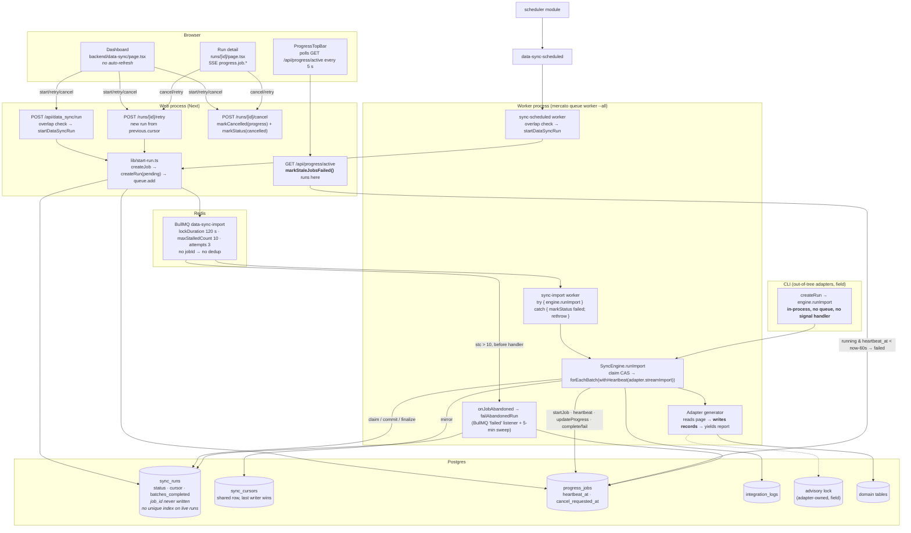
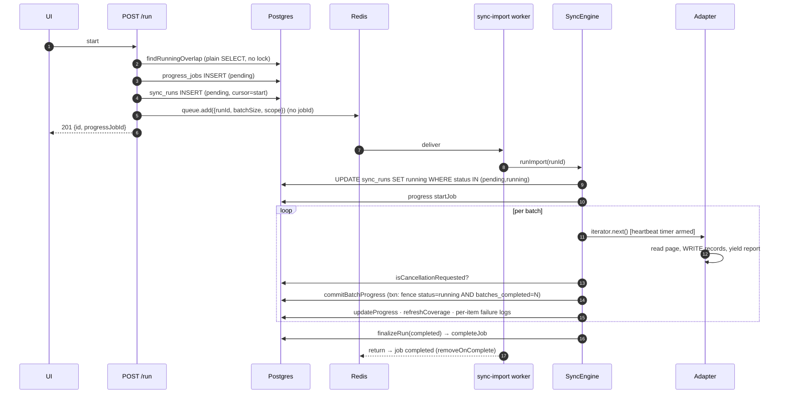
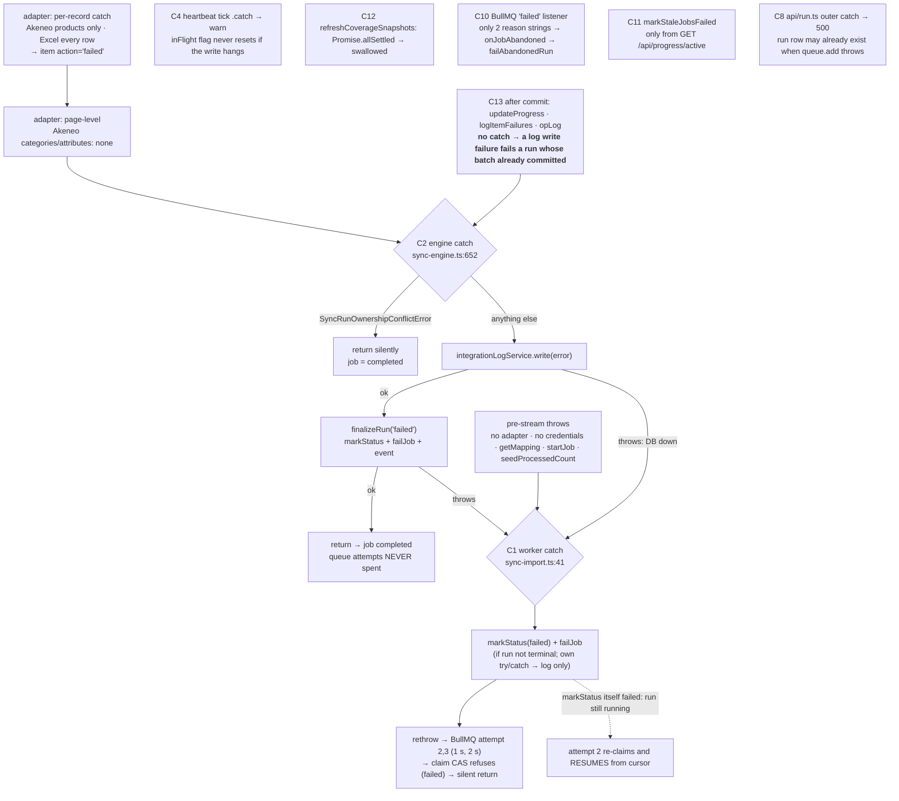
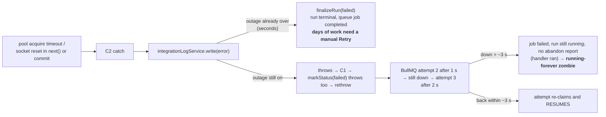
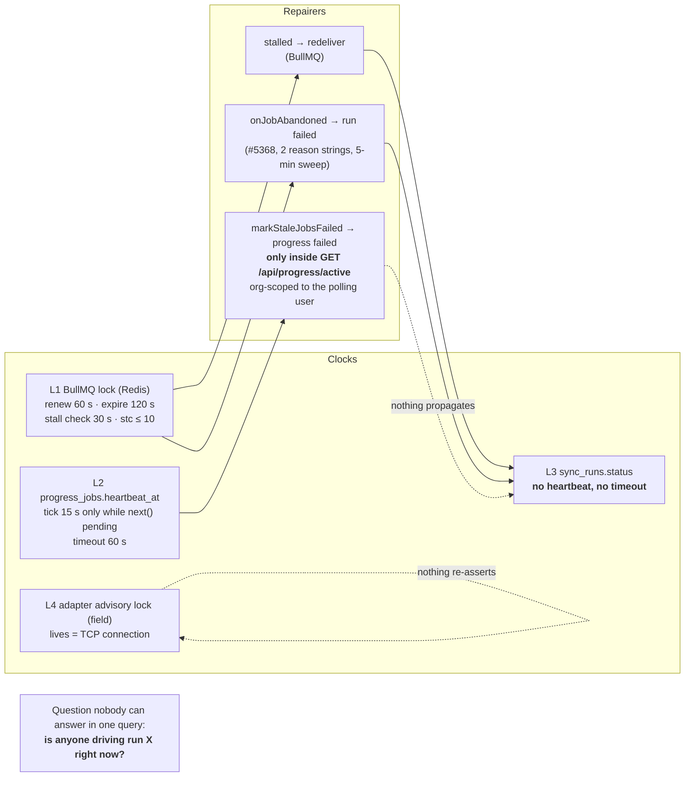

# Background work, part 1 — the problems of the `data_sync` module

**Status**: problem statement, 2026-08-21. **No solution is proposed here on purpose** — part 3 derives requirements, and a solution spec follows only after those are agreed.
**Series**: [part 1](./2026-08-21-background-work-01-data-sync-problems.md) — `data_sync` problems (D-n) · [part 2](./2026-08-21-background-work-02-sibling-modules-problems.md) — sibling modules (Q/P/W/S/… ids) · [part 3](./2026-08-21-background-work-03-common-problems-and-requirements.md) — classes C-1…C-14, requirements R-A…R-M, open decisions Δ-1…Δ-11 · [part 4](./2026-08-21-background-work-04-solution.md) — options, decision, shared invariants · [part 5](./2026-08-21-background-work-05-queue-transport-contract.md) — queue transport contract · [part 6](./2026-08-21-background-work-06-leased-jobs-in-progress.md) — leased tier in `progress` · [part 7](./2026-08-21-background-work-07-data-sync-adoption.md) — `data_sync` adoption · [part 8](./2026-08-21-background-work-08-operator-surface.md) — operator surface.

---

## 0. TL;DR

**What this is.** A review of how `data_sync` runs long imports in the background, written after repeated incidents on multi-day backfills: a deploy kills the run, Cancel does not stop it, the progress card says one thing and the database another, one network blip ends days of work, runs stay "running" forever. It answers one question — *why do these keep happening?* — and stops there. Part 3 turns the answer into requirements; a solution is chosen only after those are agreed.

**Who it is for, and what it asks.** The maintainers of `data_sync`, and whoever decides whether the module keeps being patched incident by incident or is restructured. The ask is to agree that the catalogue in §0.1 is *the* problem — complete and correctly weighted — before any design is discussed. Everything from §1 on is evidence for that catalogue.

**The answer, in plain terms.** The incidents are not separate bugs; they trace back to two decisions. First, a whole run — hours to days of work — is handed to the queue as a single job. The queue can run a job that long (lock renewal is unbounded), but its failure budgets (`maxStalledCount`, `attempts`), its graceful shutdown and its recovery granularity are all *per job* and never reset on progress, and it leaves checkpointing and cancellation to the handler. When one job is a multi-day run, every deploy or crash spends a unit of a fixed budget, shutdown cannot drain and is killed instead, and a transient error has nowhere to retry except inside the handler. Second, nobody owns the answer to "is anyone still driving this run?": four unrelated signals are kept by four different parties, none is authoritative, and three separate repair routines each read one of them — the one that watches the progress heartbeat runs only inside a browser poll, so with no admin tab open that sweep does not run at all. Everything else in the catalogue — double starts, zombie rows that block future runs, cancel being advisory, the outcome of an error depending on how long the outage lasted — follows from those two. The building blocks underneath are sound; what is wrong is the unit of work and the liveness model.

**In more detail.** The primitives are right; the unit of work and the liveness model are wrong. Every incident class above is a consequence of two decisions:

1. **One BullMQ job = one whole run** (hours to days). BullMQ runs arbitrarily long jobs — lock renewal is unbounded — but its failure budgets (`maxStalledCount`, `attempts`), its graceful `close()` and its recovery granularity are all per job and never reset on progress, and it leaves checkpointing and cancellation to the handler. When one job is a multi-day run, every deploy or crash spends a unit of a fixed budget (`maxStalledCount=10` becomes a budget of deploys a run may survive), shutdown cannot drain so `close()` blocks SIGTERM until SIGKILL, `attempts` can never be spent because the engine swallows errors, and a transient error has nowhere to retry *except* inside the handler.
2. **Liveness is inferred from several unrelated clocks, none authoritative**: the BullMQ lock in Redis, `progress_jobs.heartbeat_at`, `sync_runs.status` (which nothing ever times out) and, for adapters that take one, a database advisory lock tied to a connection. They are reconciled by three separate repairers (stalled redelivery, `onJobAbandoned`, `markStaleJobsFailed`), the last of which **only runs inside `GET /api/progress/active`** — i.e. while an admin tab is open, org-scoped to that user.

What the review found no defect in (recorded as observation; what to keep is for the solution spec): per-batch cursor commit on the run row; the ownership compare-and-swap in `commitBatchProgress` (the single thing that makes two concurrent drivers safe); the replay-safe adapter contract; `persistsSharedCursor`; the adapter registry shape.

### 0.1 Problem catalogue

Every problem has an id (`D-n`) so that part 3 can cite it. *Dimension* is the axis part 2 audits the sibling modules on. Severity: **H** = data loss / stuck forever / manual DB surgery; M = wrong state visible to users or operators, self-heals or is contained; L = hygiene. Twelve of the 28 are **H**; if you read six, read D-1 (the unit of work), D-4 and D-5 (no authoritative clock, and a sweep that depends on a browser), D-11 (double start), D-13 (a failed enqueue leaves a row that blocks every later start) and D-16 (the outcome of one transient error depends on the outage's duration).

| ID | Dimension | Problem | Where it shows | Sev |
|---|---|---|---|---|
| D-1 | Unit of work | One queue job is one whole run (hours–days). The queue runs it, but its stall counter, attempts and graceful close are per job and never reset on progress, and it has no checkpoint of its own: every deploy or crash spends a unit of a fixed budget (`maxStalledCount=10` is a deploy budget per run), shutdown cannot drain, and the handler is the only place a retry or a resume can live. | §2, S1, S8 | **H** |
| D-2 | Unit of work | `Queue.close()` waits for the current job with no timeout, so every SIGTERM with a live run ends in SIGKILL and a 1.5–3 min redelivery gap. | S1 | **H** |
| D-3 | Unit of work | The adapter contract has no "finalize" phase; Akeneo smuggles deletion reconciliation into the last `next()`, so it fails a fully-committed run and is skipped on resume (run `completed`, work not done). | S11, §7 | M |
| D-4 | Liveness | Four clocks (BullMQ lock, `progress_jobs.heartbeat_at`, `sync_runs.status`, adapter advisory lock), none authoritative; `sync_runs.status` — the one that operators, the overlap check and Retry read — never ticks and never times out. No query answers "is anyone driving run X?". | §8, §7 | **H** |
| D-5 | Liveness | The only sweeper, `markStaleJobsFailed`, runs inside `GET /api/progress/active`: browser-driven, org-scoped to the polling user, synchronous N UPDATEs per poll, and nothing propagates a swept progress job to the run row. | C11, S7 | **H** |
| D-6 | Liveness | The heartbeat is armed only around `iterator.next()`; commit + `updateProgress` + coverage refresh + one log INSERT per failed item run unheartbeated, so a slow handler phase (> 60 s) is marked stale while healthy. | S7, R5 | M |
| D-7 | Liveness | The heartbeat's `inFlight` flag never resets if the write hangs on a saturated pool → no further heartbeats → false stale. | C4 | M |
| D-8 | Liveness | A lost BullMQ lock does not stop the handler (arity-1 processor, no `AbortSignal`; renewal failure is only an event) → two live drivers of one run; contained by the commit fence, not prevented. | S3, R2 | M |
| D-9 | Liveness | `onJobAbandoned` reacts to two reason strings only and depends on a 1000-entry `removeOnFail` window; a handler that threw on its last attempt, or a job evicted before the 5-min sweep, never produces an abandon report. | S2, S10 | **H** |
| D-10 | Liveness | In-process drivers (CLI `pull`) create the run and call the engine with no queue, no signal handler and no `finally`; SIGKILL/OOM leaves `running` forever and no repairer covers it. *(field)* | S9 | **H** |
| D-11 | Single-runner | `findRunningOverlap` is a plain SELECT, `sync_runs` has no unique index on live rows, and `queue.add` gets no `jobId`: two POSTs, a scheduler tick racing a manual start, or `retry` racing `run` produce two live runs on the same shared `sync_cursors` row. | S5, R1 | **H** |
| D-12 | Single-runner | Where an adapter holds its own advisory lock it becomes the de-facto single-runner: it refuses a legitimate redelivery (terminal `failed` instead of a wait) and is released silently when the idle connection drops. *(field)* | R9, R10 | M |
| D-13 | Multi-phase writes | `startDataSyncRun` = create progress job → create run → `queue.add`, no transaction, no repair. Redis down at step 3 → HTTP 500 and a `pending` row that 409s every later start of that stream until someone edits the database. | S6, R3 | **H** |
| D-14 | Multi-phase writes | `markStatus(terminal)` is a read-modify-write; the cancel route's `markStatus(cancelled)` is unfenced; concurrent finalizers last-writer-win and events may describe the other outcome. | R4 | L |
| D-15 | Multi-phase writes | `storeExternalIdMapping` is read-then-write on a non-unique index; concurrent drivers create duplicate mappings, repaired only on read. | R8 | L–M |
| D-16 | Error handling | The outcome of one transient error depends on how long the outage lasts: seconds → run `failed` (days of work need a manual Retry); ~3 s → attempt 2 silently resumes; longer → queue job failed, run `running` forever with no abandon report. | S2, C1, C2 | **H** |
| D-17 | Error handling | The engine swallows every non-conflict error and finalizes the run `failed` itself, so the queue's `attempts`/`backoff` never apply; its silent `return`s leave the queue job `completed` while the run says `running`. | C2, §7 | **H** |
| D-18 | Error handling | Post-commit bookkeeping (`updateProgress` via `findOneOrFail`, per-item failure logs, operational log) has no catch: a log-write failure fails a run whose batch is already durable. | C13 | M |
| D-19 | Error handling | The worker catch marks the run `failed` and rethrows; the two queue retries are then no-ops (claim refuses `failed`) — unless the mark itself failed, in which case attempt 2 resumes. Same code path, opposite outcomes. | C1 | M |
| D-20 | Error handling | Akeneo's client caches `null` on a transient HTTP failure, so one 500 poisons that key for the rest of the run: silently incomplete import, zero log lines. | §4 | M |
| D-21 | Cancellation | Cancel is advisory: observed at the next batch boundary (≤ 15 s via the `AbortSignal` of #5403 only if the adapter honours it — neither in-repo adapter does). Without a progress job the engine never checks cancellation at all and stops only because the fence fails, logging "yielding to a concurrent worker". | S4 | M |
| D-22 | Cancellation | `cancelJob` on a running progress job emits `progress.job.cancelled` before the work stops (UI stops tracking, adapter lock still held); on a swept-then-revived job it silently no-ops while the UI reports success. | S4, R6 | M |
| D-23 | Deploy / scale | Each deploy costs a 1.5–3 min gap, one re-applied page, a duplicate `progress.job.started`, and one unit of the run's stall budget. Web and worker colocated in one pod with a short grace period make it worse. *(field)* | S1 | **H** |
| D-24 | Deploy / scale | The abandon sweep's in-flight set is process-local, so N workers run N sweeps; contained by `markStatus` refusing terminal overwrites. | R7 | L |
| D-25 | Deploy / scale | `progress` is resolved `transient` in the worker's catch path, so the last ≤ 5 s of buffered progress is dropped on a crash. | R11 | L |
| D-26 | Observability | `paused` is declared and never written; `sync_runs.job_id` exists and is never written; the dashboard never auto-refreshes; the UI hides Retry for `cancelled` although the API accepts it and offers no Cancel for `pending` in the list. | §2, §1 | L |
| D-27 | Observability | Nine reachable row-vs-reality mismatches (§7) and no operator-facing signal for any of them; recovery is "edit the row". | §7 | **H** |
| D-28 | Coupling | data_sync's liveness and cancellation are delegated to `progress` (heartbeat, sweep, `cancel_requested_at`), but `createProgressJob: false` is a supported path, the sweep cannot reach the run row, and a progress event has no server-side subscriber in data_sync. | §1, §8 | M |

### 0.2 Scope, sources and method

- **Code**: `packages/core/src/modules/data_sync` on `develop` (HEAD `33a7d00c42`, includes #5368), the parts of `packages/queue` and `packages/core/src/modules/progress` it relies on, the two in-repo adapters (Akeneo, Excel), and the recent PR stack (#4793, #5189, #5250, #5368, #5403, plus the fork's transient-retry spec fsh#101). Every claim cites a file and line (§10).
- **Field observations**, marked *(field)*, come from a production deployment of an out-of-tree adapter running multi-day backfills on a two-replica cluster; they are reported as patterns, not as that deployment's specifics.
- **Trigger**: repeated incidents on long-running backfills — a deploy kills the run, Cancel is advisory, the progress card lies, one blip ends a multi-day run, runs stuck `running` forever — and the question whether to keep patching or restructure.
- **How to read §1–§10**: the map (§1) and the three state machines (§2) show who writes which status; §3 is the happy path for reference; §4 maps every catch site; §5 walks eleven failure scenarios (S1–S11); §6 and §7 catalogue the races and the reachable row-vs-reality mismatches; §8 is the liveness picture; §9 reads the recent PR stack against the map; §10 is the evidence index.

---

## 1. Map — who does what, where



Ownership of writes to the status-bearing tables:

| Table / field | Written by | Read as "is it alive?" by |
|---|---|---|
| `sync_runs.status` | engine (`markStatus` claim CAS, `finalizeRun`), worker catch, cancel route, `failAbandonedRun`, CLI | `findRunningOverlap` (run/retry/scheduled), UI, **nobody with a timeout** |
| `sync_runs.cursor`, `batches_completed` | engine `commitBatchProgress` (fenced txn) | `retry` (resume position), `resolveResumeCursor` |
| `sync_cursors.cursor` | engine (mirror, unless opted out) | run/retry/scheduled start cursor |
| `progress_jobs.heartbeat_at` | engine tick (15 s, **only while `next()` pending**), `updateProgress` | `markStaleJobsFailed` (60 s) — **only from the browser poll** |
| `progress_jobs.cancel_requested_at` | cancel route / `DELETE /api/progress/jobs/:id` | engine once per batch (pre-#5403) |
| BullMQ lock key | BullMQ lock renewal (every 60 s) | BullMQ stalled checker (30 s) |
| advisory lock *(field)* | adapter generator `finally` / connection death | adapter's own probe |

---

## 2. Three state machines that do not agree

```mermaid
stateDiagram-v2
  direction LR
  state "sync_runs.status" as R {
    [*] --> pending: createRun
    pending --> running: engine claim CAS (pending|running)
    running --> running: redelivery re-claims (resumed=true)
    running --> completed: finalizeRun
    running --> failed: finalizeRun / worker catch / failAbandonedRun
    pending --> failed: worker catch (pre-stream throw)
    running --> cancelled: cancel route (unfenced read-modify-write)
    pending --> cancelled: cancel route
    note right of R
      paused: declared, never written, no UI action
      NO transition is driven by time
    end note
  }
```

```mermaid
stateDiagram-v2
  direction LR
  state "progress_jobs.status" as P {
    [*] --> pending: createJob
    pending --> running: startJob (also on every redelivery)
    running --> running: heartbeat / updateProgress
    running --> failed: failJob · markStaleJobsFailed (60 s no heartbeat)
    failed --> running: next updateProgress/heartbeat revives (stale-swept only)
    running --> completed: completeJob
    failed --> completed: completeJob
    running --> cancelled: markCancelled
    failed --> cancelled: markCancelled
    pending --> cancelled: cancelJob
    note right of P
      cancelJob on a running job only sets cancel_requested_at
      but EMITS progress.job.cancelled immediately
    end note
  }
```

```mermaid
stateDiagram-v2
  direction LR
  state "BullMQ job" as B {
    [*] --> wait: queue.add (no jobId)
    wait --> active: worker picks up
    active --> completed: handler returns (incl. silent early returns)
    active --> wait: handler throws & attemptsMade+1 < 3 (backoff 1 s, 2 s)
    active --> failed: handler throws on 3rd attempt
    active --> wait: lock not renewed → stalled (stc++), handler may still be running
    wait --> failed: stc > 10 → deferred failure, processor never called
    note right of B
      attemptNumber counts throws, not deliveries
      stc is cumulative for the job's life (days)
    end note
  }
```

Reachable mismatches (full matrix in §7): `run=running` with no job (S6, S9, S10); `run=failed` while a handler is still writing (S8); `progress=failed` while `run=running` and the handler is healthy (S7); `progress=cancelled` event while the handler keeps running; `job=completed` while `run=running` (every silent `return` in the engine).

---

## 3. Happy path (for reference)



---

## 4. Where errors are caught (the try/catch map)



| # | Site | Behaviour | Consequence |
|---|---|---|---|
| C1 | `workers/sync-import.ts:41-71` | mark run+progress failed, rethrow | BullMQ retries ×2 are no-ops (claim refuses `failed`) — unless C1's own write failed, then attempt 2 *resumes*. Outcome depends on outage duration (D-16, D-19). |
| C2 | `lib/sync-engine.ts:652-672` | swallow; conflict → silent; else log + finalize failed | Terminal on first error; queue retry budget never spent (D-17). |
| C3 | `lib/batch-stream.ts:closeQuietly` | warn if `iterator.return()` throws | fine |
| C4 | `lib/sync-engine.ts:166-188` | heartbeat failure → warn | `inFlight` stays `true` if the write hangs on a saturated pool → no more heartbeats → sweep → false `failed` (D-7) |
| C5 | `finalizeRun` | **no catch** | a DB error during finalize propagates to C1 |
| C8 | `api/run.ts:171` | 500 | `sync_runs` row (pending) + progress job already created when `queue.add` throws → **pending zombie** that 409s every future start (D-13) |
| C10 | `queue/strategies/async.ts:414-433` | abandon hook for 2 reason strings only | a handler that threw on its last attempt never triggers it (D-9) |
| C11 | `progress/api/active/route.ts:23` | stale sweep in a GET | browser-driven, org-scoped, synchronous N UPDATEs per poll (D-5) |
| C12 | `refreshCoverageSnapshots` | `allSettled` | silent |
| C13 | batch handler after `commitBatchProgress` | **no catch** | `updateProgress` (`findOneOrFail`), item-failure log writes, operational log: any throw → C2 → run `failed` after the batch was durably committed (D-18) |
| Akeneo | `client.ts:683-746` | `.catch(() => null)` **cached** | one transient 500 poisons that key for the rest of the run; silently incomplete import, zero log lines (D-20) |

---

## 5. Failure scenarios

### S1 — Deployment (SIGTERM → SIGKILL), two replicas, mid-batch

Facts: `runner.ts` awaits `queue.close()`; the async strategy calls `bullWorker.close()` without `force` → BullMQ `whenCurrentJobsFinished` **with no timeout**. *(field)* Web and worker colocated in one pod with a 60 s grace period and no `preStop`; a page takes 45–70 s.

```mermaid
sequenceDiagram
  participant K as orchestrator
  participant A as pod A (old) worker
  participant RD as Redis
  participant B as pod B (new) worker
  participant PG as Postgres
  K->>A: SIGTERM (t=0)
  A->>A: queue.close() → waits for runImport (days)…
  Note over A: lock renewed every 60 s, handler still writing page N
  K->>A: SIGKILL (t=grace)
  Note over PG: page N half-applied; cursor still N-1;<br/>advisory lock (if any) released by connection death
  Note over RD: lock expires ≤120 s after last renewal
  RD->>RD: stalled checker (30 s tick): no lock → stc++ → back to wait
  RD->>B: redeliver (t ≈ 90–180 s)
  B->>PG: claim CAS (running→running, resumed=true)
  B->>B: adapter restarts from cursor N-1 → re-applies page N (replay-safe)
  Note over B: stc is cumulative: after 10 deploys/OOMs<br/>the job is failed before the processor runs → onJobAbandoned
```

Effects: 1.5–3 min gap per deploy; one page re-applied (idempotent by contract); `progress.job.started` emitted again; the run survives only up to 10 such events *per run*. (D-1, D-2, D-23)

### S2 — Transient error mid-batch (the fsh#101 case)



A short blip is *worse* than a long one, and a medium one is worst of all. fsh#101 describes the first branch and says "the queue's attempts are never spent" — true only on that branch. (D-16, D-17, D-19)

### S3 — Lock lost while the handler is alive (two drivers)

Causes: event loop blocked > 120 s by a CPU-heavy page, Redis blip during renewal. BullMQ's `LockManager` only emits an event on renewal failure; the processor is not aborted (arity-1 processor → no `AbortSignal`).

```mermaid
sequenceDiagram
  participant A as worker A (lock lost, still running)
  participant B as worker B (redelivery)
  participant PG as sync_runs
  A->>A: streaming page N+1 (writes records)
  B->>PG: claim CAS running→running ✔
  B->>B: adapter from cursor N → writes page N+1 again
  B->>PG: commit fence (batches=N) ✔ → N+1
  A->>PG: commit fence (batches=N) ✘ → SyncRunOwnershipConflictError
  A->>A: return silently (BullMQ logs lock mismatch)
  Note over A,B: page N+1 applied twice; source read twice; pool load doubled.<br/>(field) an adapter-held advisory lock REFUSES B instead → run finalizes failed
```

The fence is the correct defence and it works. An adapter that takes its own exclusive lock turns the redelivery into a terminal `failed` instead of a wait. (D-8, D-12)

### S4 — Cancel

Pre-#5403: the cancel route sets `cancel_requested_at`, `markCancelled(progress)`, `markStatus(run, cancelled)` (unfenced read-modify-write). The engine observes it at the **next batch boundary** only; until then the adapter keeps writing (and keeps any lock it holds, so new starts 409). With #5403 the heartbeat tick also aborts an `AbortSignal` → within 15 s, *if the adapter honours it* (neither in-repo adapter does yet).

Residual holes: (a) without a progress job the engine never checks cancellation — it stops only because the commit fence fails on `status≠running` and logs "yielding to a concurrent worker"; (b) `cancelJob` on a swept-then-revived progress job silently no-ops (`failed` treated as terminal) — the cancel is lost while the UI reports success. (D-21, D-22)

### S5 — Double start

`findRunningOverlap` is a plain SELECT; `sync_runs` has no unique index on live rows; BullMQ gets no `jobId`. Two POSTs, a scheduler tick racing a manual start, or `retry` racing `run` all pass the check → two `pending` runs → two jobs → two drivers of the *same entity type* writing the **same shared `sync_cursors` row** and both applying pages. The fence does not help (different run ids). (D-11)

### S6 — Enqueue fails after the row exists

`startDataSyncRun`: `createJob` → `createRun` → `queue.add`. Redis down → 500, but `sync_runs` holds a `pending` row. Nothing times `pending` out on the run side. **That row 409s every later start of the same stream until someone edits the DB.** (D-13)

### S7 — Stale sweep false positive

`withHeartbeat` arms the 15 s tick only around `iterator.next()`. Handler phase = commit + `updateProgress` + coverage refresh + **one integration-log INSERT per failed item** + operational log. A batch with many failed items, or a slow pool, exceeds 60 s → the next `/api/progress/active` poll marks the progress job `failed` (`stale:true`), UIs react, `completed`/`started` flap on revival, and a later real failure's message is dropped (`FAIL_FROM_STATUSES` excludes `failed`). The run row is untouched. With no admin tab open, nothing is swept at all. (D-5, D-6)

### S8 — Abandoned while alive

Ten stalls (S1/S3 repeated) → BullMQ defers failure → next delivery fails *before the processor* → `failAbandonedRun` marks the run `failed`. A still-alive previous delivery fails its next commit on `status≠running` and exits silently. Correct containment, but the run is now `failed` while its last driver was healthy. (D-1)

### S9 — In-process driver killed *(field)*

An out-of-tree CLI creates the run and calls `engine.runImport` in-process: no queue, no signal handler, no `finally`. SIGKILL/OOM leaves `status='running'` **forever**: no job for `onJobAbandoned`, no sweeper for runs. Any adapter lock is released by connection death, so the adapter says "free" while the run row says "running" — the stale guard is the one that blocks. (D-10)

### S10 — Abandon report lost

`removeOnFail: 1000` is the dead-letter store; eviction, Redis flush or `obliterate` before the 5-min sweep → `running` forever. Acknowledged in #5368 as the residual gap that "wants a periodic staleness check over `sync_runs` itself". (D-9)

### S11 — Akeneo reconciliation after the last yield

Deletion reconciliation runs after the final batch inside the last `next()`; an error there fails a run whose batches all committed, and a retry starts with a non-null cursor and **skips reconciliation entirely**. The contract has no "finalize" phase, so adapters smuggle one into the drain read. (D-3)

---

## 6. Race-condition catalogue

| ID | Where | Window | Consequence | Existing defence | Sev |
|---|---|---|---|---|---|
| R1 | `findRunningOverlap` → `createRun` (run/retry/scheduled) | ms–s | two live runs, shared cursor clobber, double source load | none in core | **High** |
| R2 | BullMQ lock expiry vs live handler | 120 s+ | two drivers, double page apply | `commitBatchProgress` fence ✔ | Med (contained) |
| R3 | `startDataSyncRun` row-then-enqueue | Redis outage | pending zombie, permanent 409 | none | **High** |
| R4 | `markStatus(terminal)` read-modify-write vs another finalizer | ms | last writer wins; events may describe the other outcome | `finalizeRun` re-reads, partial | Low |
| R5 | heartbeat window vs handler phase vs 60 s sweep | handler > 60 s | progress `failed` flap, error message loss, cancel lost | revive-on-write, none for run | Med |
| R6 | `cancelJob` on running job emits `cancelled` before work stops | until batch end (15 s with #5403) | UI stops tracking; adapter lock held | #5403 | Med |
| R7 | abandon sweep across N workers (process-local in-flight set) | 5 min | duplicate `failAbandonedRun` | `markStatus` refuses terminal overwrite ✔ | Low |
| R8 | `storeExternalIdMapping` read-then-write, non-unique index | concurrent drivers | duplicate mappings | repair-on-read only | Low–Med |
| R9 | adapter advisory lock on an idle dedicated connection *(field)* | hours between queries | a dropped connection releases the lock silently; second backfill starts | none | Med |
| R10 | adapter lock refuses a redelivery while the old holder is alive (S3) *(field)* | until old connection dies | run finalizes `failed` instead of waiting | none | Med |
| R11 | progress `transient` DI: worker catch resolves a fresh service | crash path | last ≤5 s of progress dropped | — | Low |

---

## 7. Zombie matrix

| Run row says | Reality | How you get there | Who repairs it today |
|---|---|---|---|
| `pending` | no job exists | S6; Redis flushed before pickup | nobody |
| `running` | no process is driving it | S9; S10; job failed on 3rd attempt (handler ran → no abandon hook); progress swept (nothing propagates) | nobody |
| `running` | driven by **two** processes | S3 | fence ✔ |
| `failed` | a healthy driver is still writing | S8; worker catch marked it while another delivery streams | fence ✔ |
| `cancelled` | adapter still writing, lock still held | S4 pre-#5403 | batch boundary |
| `completed` | work not done | Akeneo reconciliation skipped on resume | nobody |
| progress `failed`, run `running` | worker healthy | S7 | next `updateProgress` revives progress only |
| progress `cancelled` event, run `running` | worker running | `cancelJob` on running job | batch boundary |
| BullMQ `completed`, run `running` | engine returned early (claim refused, conflict, missing run) | every silent `return` in `runImport` | n/a — by design, but invisible |

---

## 8. Liveness — several clocks, three repairers, zero owners



The run row — what operators, the overlap check and Retry read — is the only clock that never ticks, and the only sweeper that exists runs on browser traffic.

---

## 9. The recent PR stack, read against this map

Each change below is correct on its own terms; the table records what it closed and what it leaves open, because the residue is part of the problem statement.

| Change | What it closes | What it leaves / costs |
|---|---|---|
| #4793 resume stalled jobs + fence | S1/S3 containment — the load-bearing piece | raises `maxStalledCount` to 10 → makes S8 reachable |
| #5189 heartbeat + counter seeding | S7 partially (during `next()`) | handler-phase window still open (D-6); couples cancellation polling to the heartbeat timer |
| #5250 `persistsSharedCursor` | shared-row clobber between runs of different scopes | — |
| #5368 `onJobAbandoned` | the 10-stall `running`-forever case | narrow by design (D-9); not S6/S9/S10; dead-letter = 1000-entry window |
| #5403 in-batch cancel | S4 latency | adapter must honour the signal (neither in-repo adapter does); poll rides the heartbeat timer |
| fsh#101 in-engine transient retry (spec, fork) | S2's first branch | accepts the long-job shape as given (D-1), so it must rebuild retry/backoff, heartbeat-through-sleep, cancellable waits and error classification inside the handler; its "don't rethrow" decision keeps the queue's retry budget dead (D-17); S2's other two branches, S5, S6, S9, S10 are out of its scope |

What each of them has in common: they add a repairer or a guard to one of the four clocks without making any clock authoritative, and they leave the unit of work untouched.

---

## 10. Evidence index

- Engine: `packages/core/src/modules/data_sync/lib/sync-engine.ts:98-120` (heartbeat only around `next()`), `:482-675` (`runImport`), `:512-519` (claim, silent return), `:595-598` (cancel check per batch), `:613-623` (fenced commit), `:625-646` (unguarded post-commit work), `:652-672` (C2).
- Service: `lib/sync-run-service.ts:193-232` (`markStatus`: CAS for `running`, read-modify-write for terminal), `:306-350` (fence), `:437-454` (`findRunningOverlap`, plain find).
- Start: `lib/start-run.ts:39-87` (job → run → enqueue, no txn, no jobId). Entities: `data/entities.ts:5` (non-unique index), `:21` (`paused`), `:50` (`jobId`, never written).
- Worker: `workers/sync-import.ts:41-71` (C1). Abandon: `lib/abandoned-run.ts`.
- Queue: `packages/queue/src/strategies/async.ts:353-374` (`add` options, no jobId), `:381-406` (arity-1 processor, no signal), `:496-526` (`close()` unbounded), `:414-433` (abandon listener); `packages/queue/src/worker/runner.ts:48-109` (SIGTERM → sequential `close()`); BullMQ `lock-manager.js:41-47` (renewal failure is an event only).
- Progress: `packages/core/src/modules/progress/lib/progressServiceImpl.ts:298-317` (heartbeat), `:506-565` (`cancelJob`), `:659-749` (`markStaleJobsFailed`); sole caller `progress/api/active/route.ts:23`; no server subscribers to `progress.job.*`.
- Adapters: `packages/sync-akeneo/src/modules/sync_akeneo/lib/adapter.ts:107,175,264` (reconciliation after last yield), `:197` (page clamp 10), `client.ts:683-746` (cached null); `packages/core/src/modules/sync_excel/lib/adapters/customers.ts:1022,1090` (upload status in `catch`, not `finally`).
- Specs/PRs: `.ai/specs/2026-08-12-data-sync-run-scoped-cursor.md`, fsh#101, upstream #4793 #5189 #5250 #5368 #5403.

## Changelog

- 2026-08-21 — Initial review written (as `2026-08-21-data-sync-architecture-review.md`, with a target architecture and a companion `background_jobs` module spec). The same day, rewritten from the framework's perspective (field observations anonymised).
- 2026-08-21 — Restructured into a problems-only statement with a numbered catalogue (D-1…D-28) as part 1 of the *background work* series; the target-architecture sections and the `background_jobs` module spec were removed (earlier drafts, not retained) so that requirements are derived before a solution is chosen.
- 2026-08-21 — §0 rewritten for readability (plain-language opening, the ask stated, scope and method moved to §0.2); no findings, ids or section numbers changed.
