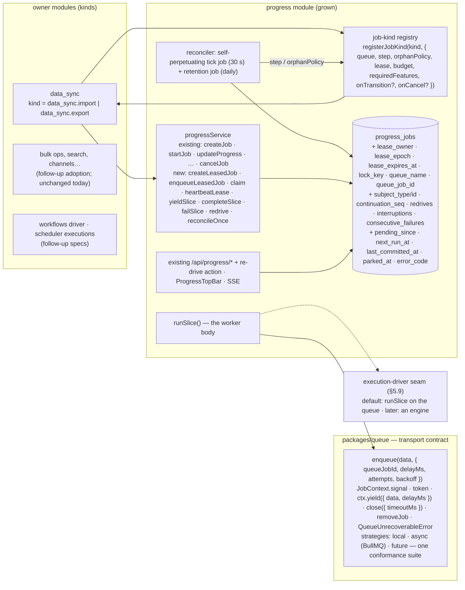
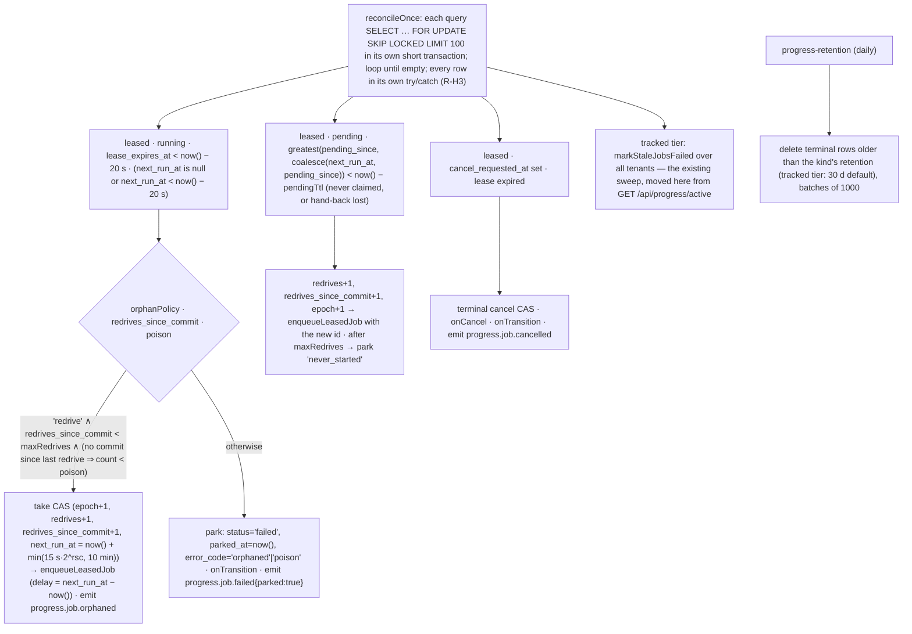

# Background work, part 4 — solution options and the recommended design

**Date**: 2026-08-21
**Status**: Draft v3 — options scored, one design detailed, revised after two fresh-context reviews (see changelog). Awaiting the maintainer decision on the recommendation (§4.4).
**Series**: [part 1](./2026-08-21-background-work-01-data-sync-problems.md) — `data_sync` problems (D-n) · [part 2](./2026-08-21-background-work-02-sibling-modules-problems.md) — sibling modules (Q/P/W/S/… ids) · [part 3](./2026-08-21-background-work-03-common-problems-and-requirements.md) — classes C-1…C-14, requirements R-A…R-M, open decisions Δ-1…Δ-11 · part 4 (this) — the solution.
**Scope of this spec** (Q4): the durable-work mechanism, the `packages/queue` ergonomics it needs, and `data_sync` as the first consumer. Named follow-ups, not designed here: the `workflows` driver, `scheduler` executions, adoption by the bulk/indexing workers, and the deferred waiting / delayed-start / full parent-child features (Q6).

## 📝 TLDR

Part 3 asks for one durable record per unit of background work with a lease on a database clock, a server-side replica-safe repairer, bounded resumable slices with a shutdown signal, store-enforced single-runner and idempotency keys, writes that commit together, retries at the idempotent unit, fenced cancel, and a conformance-tested transport. Every mature system surveyed — Postgres-native queues, durable-execution engines, Shopify/Sidekiq iteration, Airbyte, Odoo — converges on the same shape: **the record lives in the application's Postgres, the transport is disposable, liveness is a short renewable lease with a fencing epoch, and interruptions never spend the failure budget.** Four architectures are scored against R-A…R-M (§4): grow `progress` into the durable-work record, a new core module, a shared library with lease columns on each owner's table, or an external durable-execution engine. **Recommendation: grow `progress`** — it already holds most of the record (status, heartbeat, cancel flag, tenant scope, CAS transitions, events/SSE/UI/ACL, ~40 consumers) and a second record would recreate the multi-clock disease; keep the record store non-pluggable (app DB, one clock, atomic with domain rows) and make the *transport* and the *execution driver* the two pluggable seams so an engine can be adopted later without touching owners. `data_sync` becomes the first leased kind: a run is a chain of ≤ 5-minute slices that yield on SIGTERM, rethrow transient errors, and are re-driven by a worker-side reconciler.

## 📝 Resolved questions

| # | Question | Answer | Consequence in this spec |
|---|---|---|---|
| Q1 | Where the record lives | Consider all three | §4 scores A (grow `progress`), B (new module), C (shared lib + owner columns) |
| Q2 | External engines | Compare; consider adapters | §4 scores D (engine as the mechanism); §5.9 designs "engine as a driver" behind the OM record |
| Q3 | Record-store pluggability | Consider both | §4.2 evaluates it as a dimension of every option |
| Q4 | Scope | Mechanism + queue ergonomics + `data_sync` first | §7 phases; §8 follow-ups; §9 traceability marks what is deferred |
| Q5 | Format | Scored options, one designed | §4 matrix, §5 design |
| Q6 | Waiting / delayed start / parent-child | Defer | Not in the phase-1 schema; a *minimal* cancel cascade over the existing `parent_job_id` ships now because R-G3 is a MUST (§5.7) |

## 📝 Problem Statement

See part 3. This spec cites classes `C-n` and requirements `R-xx`; it does not restate them. The one-sentence version: Open Mercato has ten ways of saying "work is happening in the background", none authoritative about liveness, none repaired by a process independent of browser traffic, and correctness under duplicates, lost locks, crashes between writes, cancellation and two replicas is left to each worker author.

## 📝 Research — how others solve it

Six read-only surveys (durable-execution engines; Postgres/Redis-native queues; app-framework iteration libraries; data-sync products; infrastructure primitives; commerce/ERP platforms) were run against the requirement families of part 3. Load-bearing claims are cited inline; the full notes are in the author's workspace and summarised here.

| Family | What the field does | Taken here |
|---|---|---|
| **A. Record & clock** | Every surviving system keeps a DB row per unit of work (Oban, pg-boss, River, Graphile, Solid Queue, DBOS `workflow_status`, Odoo `queue_job`, Akeneo, Vendure, Magento). Liveness is a short renewable lease on the **broker/DB clock**: SQS visibility (30 s default, extended from call time), Service Bus peek-lock (1 min), pg-boss `expireInSeconds`, Hangfire sliding invisibility (5 min), Temporal heartbeat timeout; Graphile `useNodeTime: false`. Renewal at ⅓ of the TTL (Kafka, BullMQ lock/2, Temporal 0.8×). Heartbeats are cheap and separate from history (Temporal mutable state). | Lease on `progress_jobs`, DB time in every predicate, renewal at ttl/3, heartbeat columns unindexed (R-A1–A3, R-I1). |
| **Fencing** | [Kleppmann](https://martin.kleppmann.com/2016/02/08/how-to-do-distributed-locking.html): a lease alone is not a correctness lock; a monotonically increasing token checked by the resource is (Chubby sequencers, Step Functions task-token invalidation, Kafka Connect KIP-618). Trigger.dev guards every mutation with a snapshot-id compare-and-set. | `lease_epoch` bumped on every claim **and on every reconciler take**; every write-back and every domain fence is `… WHERE lease_epoch = $mine` (R-D3, R-B2). |
| **B. Repair** | A separate sweeper on an interval: Oban Lifeline (60 min/60 s), River Rescuer (1 h), pg-boss supervise (60 s), Airflow zombies (5 s heartbeat / 300 s), Odoo `requeue_dead_jobs` + `JobFoundDead`, Akeneo watchdog. Two dissents: [Solid Queue](https://github.com/rails/solid_queue) marks a pruned process's jobs failed and deliberately does not auto-retry ("the job itself might be what's killing the process"); [Sidekiq Pro](https://github.com/sidekiq/sidekiq/wiki/Reliability) parks after 3 recoveries in 72 h. Engines (Restate, DBOS, Trigger.dev) *park* exhausted work resumably. | Worker-side reconciler; per-kind orphan policy (`redrive` for idempotent kinds, `park` otherwise); redrive budget resets only on committed progress; parked = operator-resumable (R-B1–B5). |
| **C. Slicing & shutdown** | Shopify [job-iteration](https://github.com/Shopify/job-iteration) / [Sidekiq Iteration](https://sidekiq.org/wiki/Iteration) / Rails 8.1 Continuation: enumerator + cursor, finish the current item on shutdown, persist cursor, re-enqueue — **"an interruption of a job does not count as a retry"**; `max_job_runtime` forces periodic self-interruption. Temporal continue-as-new, Inngest steps, Hatchet child tasks. BullMQ's own [process-step-jobs](https://docs.bullmq.io/patterns/process-step-jobs) pattern: `job.updateData()` then `moveToDelayed` + `DelayedError` — "these special operations don't increment the `attemptsMade` counter". SQS: past ~12 h, decompose. K8s: SIGTERM → grace (30 s) → SIGKILL; [Railway](https://docs.railway.com/deployments/reference): **0 s** unless `RAILWAY_DEPLOYMENT_DRAINING_SECONDS` is set. | Slice budget per kind (default 5 min); yield at a durable boundary via the transport's hand-back after rewriting the payload; SIGTERM relayed to the handler's `AbortSignal` before `close()`; interruptions counted, never budgeted (R-C1–C4). |
| **D. Single-runner & idempotency** | Partial unique index over live states ([River](https://riverqueue.com/docs/unique-jobs), Oban Pro Smart, Odoo `identity_key`, Solid Queue recurring `(task_key, run_at)`); Temporal "only one open execution per Workflow Id"; Shopify "one bulk operation per shop"; Fivetran "already running → skip this occurrence". Advisory locks are the pooler-hostile minority (Que, GoodJob). Dedup windows are TTL'd and business-keyed. Idempotency is the handler's job (Helland; Sidekiq/GitLab doctrine). | Partial unique index on `(lock_key, tenant, org) WHERE status IN ('pending','running')`; deterministic queue job ids; `claim` refuses stale deliveries by `(seq, redrives)`; the idempotency key reaches the handler (R-D1–D4). |
| **E. Atomicity** | Same-DB transactional enqueue is the structural advantage of Postgres queues ([River's three Redis failure modes](https://riverqueue.com/docs/transactional-enqueueing); Oban `insert` in `Ecto.Multi`; Graphile `add_job`; DBOS). With an external broker the row *is* the outbox and a repairer re-enqueues rows without a live counterpart. Medusa is the counter-example (Redis checkpoints + BullMQ delayed jobs as the clock → stuck executions, no repair loop). | Record + domain row in one MikroORM transaction; events and enqueue after commit; the reconciler's pending predicate is the relay (R-E1–E4). |
| **F. Retries** | Per-step counters (Inngest, Temporal); snooze that does not burn budget ([River decrements attempts](https://riverqueue.com/docs/snoozing-jobs), Oban bumps `max_attempts`); non-retryable error classes everywhere; Magento stores retriable/terminal in the schema; Airbyte resets the failure streak on any partial progress; K8s `podFailurePolicy`: disruption does not consume the backoff budget. | Retry unit = slice; `consecutive_failures` resets on a committed unit; `QueueUnrecoverableError`; transport retries the slice, the reconciler handles orphans, interruptions have their own counter (R-F1–F5). |
| **G. Cancellation** | Cooperative everywhere: on the heartbeat channel (Temporal/Cadence), between steps (Inngest), LISTEN/NOTIFY + context cancel (River), `abortController.signal` (Hatchet); 30 s grace then kill (Trigger.dev); cancellation itself times out (Dagster 180 s); cascades to children (DBOS, Restate, Odoo). Terminal `cancelled` only when stopped. | `cancel_requested_at` returned by the heartbeat CAS → `signal.abort()`; `cancelled` written by the slice that observed it or by the reconciler after the lease expired; cascade over `parent_job_id` (R-G1–G3). |
| **H/I. Replicas & scale** | `FOR UPDATE SKIP LOCKED` for claims and sweeps; leader election only as an optimisation (River 5 s lease row; Solid Queue/GoodJob make cron duplicate-safe with a unique index); fillfactor 80–90 and unindexed heartbeat columns for HOT updates; periodic `REINDEX CONCURRENTLY` (River, Oban); hot vs history tables (Hatchet); retention by policy (Odoo 30 d, Temporal 30 d). | Reconciler batches with `SKIP LOCKED`, no leader; HOT-safe heartbeats; retention job; a deterministic self-perpetuating tick instead of a leader (R-H1–H3, R-I1–I2). |
| **J. Transport** | At-least-once is the universal floor; broker attempt counters are advisory (Pub/Sub "may reset to zero"); brokers differ in dedup/delay/abort support. | One thin transport contract + a conformance suite per strategy (R-J1–J4). |
| **K. Operators** | Execution history with retention and a re-drive/cancel surface are table stakes (Odoo Jobs UI, Magento bulk status, Shopify bulk ops, Airbyte attempts, Temporal reset, Trigger.dev DLQ redrive). | Reuse the existing `progress` list/detail/cancel surface; add re-drive (R-K1–K3). |
| **L. Reuse / engines** | [DBOS Transact](https://docs.dbos.dev/architecture) is the closest relative (TypeScript library on Postgres, same-DB enqueue, `workflow_status` + per-step outputs, startup recovery, `recovery_attempts` cap) but recovers across nodes only via its hosted Conductor; Temporal/Restate/Inngest/Trigger.dev need a server or SaaS. OM's `workflows` engine is data-defined, so it needs a durable *driver*, not deterministic replay. | The record + `step()` contract mirror a Temporal activity / DBOS step so an engine can become a driver later (§5.9); no engine dependency now (Δ-9). |

---

## 📝 Candidate architectures

### 4.1 The options

**A — Grow `progress` into the durable-work record.** Additive columns on `progress_jobs` (lease, epoch, lock key, subject pointer, continuation counters); new methods on `ProgressService`; a kind registry; a reconciler owned by the `progress` module; existing events/SSE/UI/ACL/API reused. Existing consumers keep working unchanged as "tracked" jobs; owners opt into the "leased" tier per kind.

**B — New core module (`background_jobs`).** Its own table, service, registry, reconciler, events and routes; `progress_jobs` keeps the presentation role and later becomes a façade over it (so the UI is reused once the façade lands). This is the design that was removed from the tree; §5 reuses its mechanics regardless of the home.

**C — Shared library + lease columns on each owner's table.** `@open-mercato/shared/lib/durable/` exports `claimLease`/`heartbeat`/`fencedUpdate`/`runSlice` over any entity with the lease columns; `sync_runs`, `workflow_instances`, per-module claim rows each gain them; each owner runs its own sweeper or registers its table with a generic one.

**D — External durable-execution engine.** D1: DBOS Transact as a library sharing the application's Postgres. D2: a server/SaaS engine (Temporal, Restate, Hatchet, Inngest, Trigger.dev). In both, owners write steps/workflows in the engine's contract; the engine owns record, liveness, retries and recovery.

### 4.2 The store dimension (Q3)

| Record store | Atomicity with domain rows (R-E1) | One clock (R-A3) | Works in every deployment | Cost |
|---|---|---|---|---|
| Application Postgres via MikroORM | yes — one transaction | yes | yes (every OM install has it; the local queue strategy needs nothing else) | zero new infra; additive migration |
| Abstracted (Redis, Dynamo, …) | **no** — needs an outbox *and* a second repairer for the outbox | no — second clock | only where that store exists | an interface nobody has asked for; correctness regresses |

Applied to every option below: **the record store is not pluggable**. The *transport* (already a strategy) and the *execution driver* (§5.9) are. This is the split every surveyed system makes, and the opposite of Medusa's, whose Redis-side checkpoints are the documented source of its stuck workflows.

### 4.3 Scoring

Scale: 3 = satisfies the family as specified; 2 = satisfies with a stated cost; 1 = partial; 0 = fails or contradicts. "Time to data_sync" = effort until part 1's High findings are closed for the first consumer.

| Criterion | A grow `progress` | B new module | C lib + owner columns | D1 DBOS library | D2 server engine |
|---|---|---|---|---|---|
| R-A one record, one clock | **3** — one row per operation | 2 — authoritative row + a presentation row until the façade lands (two heartbeats per slice) | 1 — one row per owner table; "is anyone driving X?" is N queries; bulk ops without an owner row still need `progress` | 3 | 3 |
| R-B repairer | 3 — one tick, one registry | 3 | 1 — a sweeper per table, or a table registry | 2 — single-node startup scan; cross-node recovery needs the hosted Conductor or admin calls | 3 |
| R-C slices, shutdown, signal | 3 | 3 | 3 | 2 — workflow bodies must be deterministic | 3 |
| R-D single-runner, idempotency key | 3 | 3 | 2 — per owner table; no cross-kind key | 3 | 3 |
| R-E atomic writes | 3 — same EM transaction | 3 | 3 | 2 — same Postgres, but DBOS's own pool/transactions beside MikroORM's | 0 — API call outside the DB transaction |
| R-F retries at the slice | 3 | 3 | 3 | 3 | 3 |
| R-G fenced, cascading cancel | 3 | 3 | 2 — cascade needs parent links each owner must model | 2 — preempts at the next step | 3 |
| R-H/I replicas, scale | 3 | 3 | 2 | 2 | 3 |
| R-J transport contract, local parity | 3 — keeps `packages/queue` | 3 | 3 | 1 — DBOS *is* the queue; local strategy and existing workers bypassed | 0 |
| R-K operator surface | 3 — list/detail/cancel/top bar exist; add re-drive | 2 — reused only after the façade; until then a second surface | 0 — per owner | 2 | 3 |
| R-L one mechanism, additive adoption | 3 — consumers unchanged; opt-in per kind | 2 — every consumer migrates eventually | 1 | 1 — workflow-code model; the data-defined `workflows` gains nothing from replay | 1 |
| R-M verifiable on real PG/Redis | 3 | 3 | 2 | 2 — engine internals are a black box | 1 |
| Compat (`BACKWARD_COMPATIBILITY.md`) | **2** — schema/interface/events additive, but two observable behaviours change for leased rows (`progress.job.cancelled` timing; stale sweep off the GET) — documented in UPGRADE_NOTES | 3 — new surfaces only | 2 — touches every owner's table | 1 — new production dependency (Ask-First); tables outside `yarn db:generate` | 0 — a server the module system cannot self-host |
| Naming clarity | 1 — "progress" is not a name for the durable-work authority | 3 | 2 | 2 | 3 |
| Time to data_sync | **short** | medium — module first, then link | short for data_sync; nothing else benefits | medium — rewrite the engine loop as a workflow | long |
| Operational footprint | none new | none new | none new | library with its own pool, schema, version cadence | a cluster or a vendor |

**Reading the matrix.** A and B are the only two that satisfy every functional family; they differ on how many records describe one operation — the disease of part 1 §8 — and on how much surface is duplicated before the façade exists. C is today's repo with better helpers; it fails R-A1 and R-K by construction. D1 matches R-A/B/D/F well and would give step checkpoints for free, but it replaces `packages/queue`, bypasses every existing worker and the local strategy, brings its own pool and transactions beside MikroORM's, and recovers across nodes only through a hosted service — for a workflow-code model OM's data-defined `workflows` does not need. D2 is correct in the abstract and disqualified by the deployment model.

### 4.4 Recommendation

**Option A, with the record store fixed to the application database, and the transport and the execution driver as the two pluggable seams.** B remains the documented fallback if maintainers decide `progress` must stay presentation-only: §5 is home-agnostic except for the table the columns land in and the need for a `progress` façade.

What D contributes without being adopted: the `step()` contract is shaped like a Temporal activity / DBOS step, so D1 or D2 can later be registered as a *driver* for a kind (§5.9) without touching owners — the "adapter" of Q2.

Naming (Δ-2): module id, table and DI key stay `progress` (frozen surfaces); docs and AGENTS.md call the new tier **leased jobs** and the record an **operation**. A rename is not worth a compat break.

---

## 📝 Architecture (Option A)



### 5.1 Vocabulary

| Term | Meaning |
|---|---|
| **operation** / `jobId` | a `progress_jobs` row (uuid); unchanged meaning for today's consumers |
| **tracked** tier | today's behaviour: counters + `heartbeat_at` written as a side effect of progress writes, swept by the stale sweep. Every existing consumer stays here until it opts in |
| **leased** tier | a row whose `kind` is registered (`lock_key is not null`); it has a lease, continuation counters, is driven by `runSlice` and repaired by the reconciler |
| **kind** | the existing `job_type` value, e.g. `data_sync.import`; registered once per owner |
| **lease** | `lease_owner` + `lease_epoch` + `lease_expires_at`; extended by `heartbeatLease`; the only liveness signal for the leased tier |
| **epoch** | monotonically increasing integer, bumped on every successful claim and on every reconciler take; the fencing token carried by every write-back and every domain fence |
| **delivery** | one transport hand-off to `runSlice`; payload `{ jobId, seq, redrives, scope }`; queue job id `pj-<jobId>-<seq>-<redrives>` (BullMQ 6 rejects custom ids with more than two colons) |
| **slice** | one delivery's execution of `step()` under one lease; bounded by `sliceBudgetMs`; `continuation_seq` counts slices |
| **yield** | the slice stops at a durable boundary, releases the lease and hands the job back to the transport with the new `seq` in its payload; increments `interruptions` when caused by `signal`, never any budget |
| **orphan** | a leased row whose lease expired without a terminal transition or a yield — the reconciler's subject. ("Stale" is reserved for the tracked tier's sweep; "abandoned" for `packages/queue`'s existing hook.) |
| **redrive** | the reconciler (or an operator) re-enqueues an orphan or a never-claimed/parked row; `redrives` counts it and is part of the delivery identity; resets to 0 on a committed unit |
| **committed unit** | the owner reports `committed: true` on a heartbeat after a durable domain write (data_sync: a fenced batch commit); resets `consecutive_failures` and `redrives`, sets `last_committed_at` |
| **parked** | `status='failed'` with `parked_at` set and `error_code` explaining why (`orphaned`, `poison`, `never_started`, `no_handler`); `redrive` is allowed from it. No new status value in phase 1 |
| **owner** | `${hostname}:${pid}:${processStartRandom}` — generated once per process start, never per claim |

### 5.2 Invariants

1. **Database clock only, one statement per predicate.** Every lease, timeout and ordering predicate uses Postgres time; worker clocks drive heartbeat *intervals* only (R-A3). Because `now()` is frozen for the duration of a transaction, every lease statement (`claim`, `heartbeatLease`, `yieldSlice`, `failSlice`, the reconciler take) runs in its **own short autocommit transaction on a forked EntityManager** — the same discipline `touchJobHeartbeat` already follows (`progressServiceImpl.ts:301`). Never inside the slice's domain transaction. MikroORM specifics to honour: the fork is `em.fork()` with the defaults (`useContext: false`, `keepTransactionContext: false` — either flag set would join the slice's transaction via the ALS context); reads use `disableIdentityMap: true`; the fork takes a *second* pooled connection while the slice's transaction holds one, which is why the +1 connection reservation in §5.6 is load-bearing (a pool sized exactly to Σconcurrency would deadlock).
2. **One CAS per transition**, `UPDATE … WHERE <expected state> RETURNING *`; zero rows = refused; a refused claim does no work. The existing `progress` discipline, extended to the new columns.
3. **Epoch fencing.** `claim` and the reconciler take both bump `lease_epoch`; `heartbeatLease`, `yieldSlice`, `completeSlice`, `failSlice` and every owner-side domain fence include `lease_epoch = $mine`. After a take, the previous driver's next heartbeat returns `null` and its next fenced domain write affects zero rows — R-B2's acceptance holds at the moment of the take, not at the next claim (C-8).
4. **An owned lease is never NULL while running.** A slice that stops without finishing either releases the lease (`lease_owner = null`, `lease_expires_at = now()`, §5.4 `failSlice`/`yieldSlice`) or leaves it to expire; `lease_expires_at` is never NULL on a leased row once claimed.
5. **Stale deliveries are refused by identity, and identity is monotone.** `claim` requires `payload.seq = continuation_seq` and `payload.redrives = redrives`; **`redrives` only ever increases** (it is an identity, not a budget). A transport retry after `failSlice` carries the *same* pair and is accepted (that is the retry); a delivery from before a yield or before a take carries an older pair and is refused forever. Budgets use the separate `redrives_since_commit`, which resets on a committed unit. No epoch is carried in payloads, and there is no same-owner exception in `claim`.
6. **Heartbeats are HOT.** `heartbeatLease` writes only `lease_expires_at`, `heartbeat_at`, `processed_count`, `total_count`, `consecutive_failures`, `redrives`, `last_committed_at` — none of which appears in any index key or partial-index predicate (R-I1). `updated_at` is not touched by heartbeats.
7. **Interruptions are not failures (best effort).** A yield caused by `signal` increments `interruptions` only; budgets and the transport's attempt counter are untouched. The one exception is documented: if the transport's hand-back itself fails (BullMQ `moveToDelayed` after the lock is already lost), that delivery ends as a throw and costs one transport attempt; the row is already `pending` and is re-driven by Q2.
8. **Crash ≠ error.** An expired lease is repaired by the reconciler under the *orphan* policy and the `redrives_since_commit` budget; a thrown error is retried by the transport under the *retry* policy and the `consecutive_failures` budget. The two never share a counter, and the reconciler waits for the transport's own retry: `failSlice` sets `next_run_at` to the transport's next attempt time and Q1 ignores rows whose `next_run_at` is in the future, so an orphan is only taken once the transport has given up.
9. **Every reconciler or operator action changes the delivery identity.** A take, a pending re-drive and an operator `redrive` all bump `redrives` (and the epoch), so the new enqueue id `pj-<id>-<seq>-<redrives>` never collides with a delivery the transport still holds in delayed/failed state; the old delivery, if it ever arrives, is refused by invariant 5. A yield keeps the transport's job id (BullMQ `moveToDelayed` does not change it) — only the payload changes.
10. **The tracked tier is untouched.** Rows without `lock_key` behave exactly as today; their stale sweep keeps its predicate and CAS (but moves to the worker tick, §5.6).

### 5.3 Data model

Additive migration on `progress_jobs` (category 8, ADDITIVE-ONLY). No column is dropped, renamed or retyped; no existing default changes. Expression indexes are declared with MikroORM's `@Index({ expression })` (precedent: `customer_interactions_email_dedupe_uq`, `warranty_claims_external_ref_unique`).

```sql
alter table progress_jobs
  add column lease_owner          text null,
  add column lease_epoch          bigint not null default 0,
  add column lease_expires_at     timestamptz null,
  add column lock_key             text null,              -- non-null ⇔ leased tier; single-runner key
  add column queue_name           text null,
  add column queue_job_id         text null,              -- last enqueued delivery id (pj-<id>-<seq>-<redrives>); for removeJob
  add column subject_type         text null,              -- 'data_sync.run'
  add column subject_id           text null,
  add column continuation_seq     int  not null default 0,
  add column redrives             int  not null default 0,   -- monotone; part of the delivery identity
  add column redrives_since_commit int not null default 0,   -- budget; reset by a committed heartbeat (HOT)
  add column interruptions        int  not null default 0,
  add column consecutive_failures int  not null default 0,
  add column pending_since        timestamptz null,       -- set on create, yield and take; the reconciler's pending clock
  add column next_run_at          timestamptz null,       -- reconciler backoff / operator re-drive time (not the deferred timer feature)
  add column last_committed_at    timestamptz null,
  add column parked_at            timestamptz null,
  add column error_code           text null;              -- 'orphaned' | 'poison' | 'never_started' | 'no_handler' | 'unrecoverable' | owner codes

alter table progress_jobs set (fillfactor = 80);

-- single-runner: at most one live operation per key per tenant/org (R-D1). NULL org is constrained (zero-uuid), unlike the
-- warranty_claims precedent; PG15 NULLS NOT DISTINCT was considered and rejected to keep PG14 support.
create unique index progress_jobs_one_live_per_lock_key
  on progress_jobs (lock_key, tenant_id, coalesce(organization_id, '00000000-0000-0000-0000-000000000000'::uuid))
  where lock_key is not null and status in ('pending','running');

-- reconciler scans: predicates exclude every heartbeat-written column (invariant 6). Q1 below filters lease_expires_at
-- inside this bounded set (a scan of live leased rows every tick; acceptable to ~10k live rows — see §5.6 cost note).
create index progress_jobs_leased_running_idx on progress_jobs (tenant_id) where status = 'running' and lock_key is not null;
create index progress_jobs_leased_pending_idx on progress_jobs (pending_since) where status = 'pending' and lock_key is not null;
create index progress_jobs_subject_idx       on progress_jobs (subject_type, subject_id) where subject_type is not null;
create index progress_jobs_retention_idx     on progress_jobs (finished_at) where status in ('completed','failed','cancelled');
```

Down-migration: drop the five indexes and the eighteen columns, reset `fillfactor`. Data in the new columns is discarded; the tracked tier is unaffected.

- The existing `progress_jobs_status_tenant_idx` stays. `heartbeat_at` stays unindexed.
- `meta` keeps today's rule (display-only, no credentials); `error_message` goes through the integration-log redaction.
- Per-kind configuration lives in the **registry**, not in columns.
- `ProgressJobStatus` is unchanged. The Q6 follow-up will add `waiting`, `run_after` and full parent/child semantics; `next_run_at` and `pending_since` are intentionally narrower so that follow-up does not re-audit the claim predicate.
- `sync_runs` gains nothing: `progress_job_id` already exists and is the link. `sync_runs.job_id` (text, never written) carries the latest `queue_job_id` from Phase 0.
- `ProgressJobDto` (list/active/SSE) gains optional `cancelRequestedAt`, `parkedAt`, `errorCode` (category 2, additive) so the UI can render "cancelling" and "parked".

### 5.4 Lease semantics

Each statement is one autocommit transaction on a forked EM (invariant 1).

```sql
-- claim(jobId, owner, scope, { seq, redrives })
update progress_jobs
   set status = 'running', lease_owner = $owner, lease_epoch = lease_epoch + 1,
       lease_expires_at = now() + $ttl, heartbeat_at = now(), pending_since = null,
       started_at = coalesce(started_at, now()), updated_at = now()
 where id = $id and tenant_id = $tenant and (organization_id = $org or ($org is null and organization_id is null))
   and lock_key is not null
   and (status in ('pending','running') or (status = 'failed' and parked_at is not null))   -- parked rows are claimable only by a re-drive delivery
   and continuation_seq = $seq and redrives = $redrives
   and (next_run_at is null or next_run_at <= now())
   and (lease_expires_at is null or lease_expires_at < now())
 returning *;

-- heartbeatLease(lease, { processedCount?, totalCount?, committed? })   -- HOT: no indexed column
update progress_jobs
   set lease_expires_at = now() + $ttl, heartbeat_at = now(),
       processed_count = coalesce($p, processed_count), total_count = coalesce($t, total_count),
       consecutive_failures  = case when $committed then 0 else consecutive_failures end,
       redrives_since_commit = case when $committed then 0 else redrives_since_commit end,
       last_committed_at     = case when $committed then now() else last_committed_at end
 where id = $id and status = 'running' and lease_owner = $owner and lease_epoch = $epoch
 returning cancel_requested_at;                    -- zero rows ⇒ lease lost or taken ⇒ abort the slice's signal

-- yieldSlice(lease, { interrupted })               -- then hand the delivery back with the NEW seq in its payload (§5.6 step 4)
update progress_jobs
   set status = 'pending', continuation_seq = continuation_seq + 1,
       interruptions = interruptions + case when $interrupted then 1 else 0 end,
       lease_owner = null, lease_expires_at = now(), pending_since = now(), updated_at = now()
 where id = $id and status = 'running' and lease_owner = $owner and lease_epoch = $epoch
 returning continuation_seq, redrives;

-- failSlice(lease, error, { nextAttemptAt })      -- slice threw; stay 'running', release the lease, same (seq, redrives) for the transport retry;
--                                                  nextAttemptAt = the transport's next attempt (from the kind's retry policy and ctx.attemptNumber), or now() when attempts are exhausted
update progress_jobs
   set lease_owner = null, lease_expires_at = now(), next_run_at = $nextAttemptAt,
       consecutive_failures = consecutive_failures + 1,
       error_message = $msg, error_code = $code, updated_at = now()
 where id = $id and status = 'running' and lease_owner = $owner and lease_epoch = $epoch;

-- reconciler take (orphan):                        -- bumps the epoch (fence) and redrives (delivery identity)
update progress_jobs
   set status = 'pending', lease_owner = null, lease_epoch = lease_epoch + 1, lease_expires_at = now(),
       redrives = redrives + 1, redrives_since_commit = redrives_since_commit + 1,
       pending_since = now(), next_run_at = now() + $backoff, updated_at = now()
 where id = $id and status = 'running' and lock_key is not null
   and lease_expires_at < now() - $grace and (next_run_at is null or next_run_at < now() - $grace)
 returning continuation_seq, redrives, tenant_id, organization_id;

-- completeSlice / terminal fail / cancel: the existing CAS transitions, each extended with `and lease_epoch = $epoch` on the leased tier
```

Why identity and budget are separate counters: if `redrives` could reset to 0, a transport retry holding an old `(seq, 0)` could become claimable again after a later driver committed (the reviewed interleaving: fail → take → re-drive claims → commit resets → old retry claims and fences the live driver). A monotone `redrives` closes it; `redrives_since_commit` carries the budget that must reset on progress (R-B3). Why there is no same-owner clause: a stalled redelivery to the *same* process should be refused while its sibling heartbeats, exactly like any other process; a dead process never matches because `owner` includes a per-process-start random. Why `'failed'` is claimable: `progress` already allows `failed → running` (queue retries, stale revive); the leased tier narrows it to `parked_at is not null`, so a genuinely failed operation is not resurrected by a late delivery while a parked one can be re-driven.

### 5.5 Service API and the kind registry

Additive members on `ProgressService` (category 2/3, STABLE: optional methods, precedent `touchJobHeartbeat?`). Every method takes `scope`.

```ts
export type Lease = { jobId: string; owner: string; epoch: number; ttlMs: number }   // no worker-clock expiry is exposed
export type SliceOutcome = 'drained' | 'budget' | 'cancelled'
export type OrphanPolicy = 'redrive' | 'park'

export interface LeasedJobKind {
  queue: string
  requiredFeatures: string[]                         // who may cancel / re-drive via the generic routes (in addition to progress.* features)
  lease?: { ttlMs?: number; sliceBudgetMs?: number; pendingTtlMs?: number }           // 60 000 · 300 000 · 900 000
  budget?: { maxRedrives?: number; maxConsecutiveFailures?: number; poisonRedrivesWithoutCommit?: number }   // 10 · 5 · 3
  orphanPolicy?: OrphanPolicy                        // default 'park' (Solid Queue's stance); idempotent kinds declare 'redrive'
  retention?: { completedDays?: number; failedDays?: number }                           // 7 · 30
  /** One slice under a held lease. Return when `signal` aborts or the budget elapses. */
  step(ctx: {
    job: ProgressJob; scope: ProgressServiceContext; lease: Lease
    signal: AbortSignal
    heartbeat: (patch?: { processedCount?: number; totalCount?: number | null; committed?: boolean }) => Promise<void>
    budgetMs: number
    idempotencyKey: string                           // `${jobId}:${continuation_seq}` — forward to external side effects and commands
    container: AppContainer
  }): Promise<SliceOutcome>
  /** Mirror transitions onto the domain row (data_sync: sync_runs.status). Called after every terminal CAS and on park. */
  onTransition?(job: ProgressJob, scope: ProgressServiceContext): Promise<void>
  onCancel?(job: ProgressJob, scope: ProgressServiceContext): Promise<void>
}

export interface ProgressService {
  // …existing members unchanged…
  registerJobKind?(kind: string, handler: LeasedJobKind): void
  /** Inserts the row on the given EM (the caller's transaction) and returns it with a deferred `emitCreated()`; the
   *  `progress.job.created` event is NOT emitted inside the transaction (R-E3). Worker/CLI scope: pass a forked EM. */
  createLeasedJob?(input: CreateProgressJobInput & { kind: string; lockKey: string; subject?: { type: string; id: string } },
                   ctx: ProgressServiceContext, em: EntityManager): Promise<{ job: ProgressJob; emitCreated: () => Promise<void> }>
  enqueueLeasedJob?(jobId: string, ctx: ProgressServiceContext): Promise<void>   // id pj-<id>-<seq>-<redrives>; delay = max(0, next_run_at − now()); stores queue_job_id
  claim?(jobId: string, ctx: ProgressServiceContext, delivery: { seq: number; redrives: number }): Promise<Lease | null>
  heartbeatLease?(lease: Lease, ctx: ProgressServiceContext, patch?: {...}): Promise<{ cancelRequested: boolean } | null>
  yieldSlice?(lease: Lease, ctx: ProgressServiceContext, opts: { interrupted: boolean }): Promise<{ seq: number; redrives: number } | null>
  completeSlice?(lease: Lease, ctx: ProgressServiceContext, input?: CompleteJobInput): Promise<ProgressJob | null>
  failSlice?(lease: Lease, ctx: ProgressServiceContext, error: { message: string; code?: string }): Promise<void>
  redrive?(jobId: string, ctx: ProgressServiceContext, by: { userId?: string | null }): Promise<ProgressJob | null>   // operator: parked or expired-lease rows; reuses the take CAS (bumps redrives + epoch) so the new id never collides with a retained failed job
  reconcileOnce?(opts?: { batchSize?: number }): Promise<ReconcileReport>   // system scope; used by the tick and by tests
}
```

`createLeasedJob(em)` is the single most important line for C-5: data_sync creates the progress job and the `sync_runs` row on the same request-scoped EM under `em.begin()` (both services resolve the same EM today: `progress/di.ts`, `shared/lib/di/container.ts`), commits, then calls `emitCreated()` and `enqueueLeasedJob`. A unique-index violation rolls both rows back with no phantom event. If the enqueue throws, the row is `pending` with `pending_since` set and the reconciler enqueues it (R-E2). The generic cancel and re-drive routes require `progress.update` **and** the kind's `requiredFeatures`, so cancelling a sync still needs `data_sync.run`.

### 5.6 `runSlice` (the worker body) and the reconciler

`runSlice(payload, ctx)` is registered once per queue a kind declares (the `progress` module ships a worker factory; the owner's `workers/*.ts` is a one-liner binding the queue).

1. `claim` with `payload.seq/redrives` → `null` ⇒ return (the queue job completes; a `progress.leased.delivery_refused` structured-log event with the reason).
2. Start the heartbeat interval at `ttl/3` (20 s) on a forked EM. A `null` from `heartbeatLease` aborts `signal`; `cancelRequested: true` aborts `signal` and marks the slice as ending by cancel.
3. `ctx.signal` (transport: shutdown / lock loss) is chained into the same `signal`.
4. `await step()`. Then:
   - `drained` → `completeSlice` → `onTransition`.
   - `budget`, or `signal` aborted by shutdown/lease loss → `yieldSlice({ interrupted })` returning `{ seq, redrives }` → **`ctx.yield({ data: { …payload, seq, redrives } })`**: the transport rewrites the stored payload *before* handing the job back (BullMQ: `job.updateData()` then `moveToDelayed(now, token)` + throw `DelayedError`, which the processor must let propagate; local: rewrite the stored job and mark this delivery finished without touching `attemptCount`). Where the transport lacks `yield`, `enqueueLeasedJob` for the new `seq` is used instead (same id scheme) and `queue_job_id` is updated; a native hand-back keeps the transport's job id, so `queue_job_id` is left as is.
   - `cancelled` → terminal cancel CAS → `onCancel`/`onTransition`; this is where `progress.job.cancelled` is emitted for leased rows.
   - throw → `failSlice({ nextAttemptAt })` and **rethrow**: the transport retries *this delivery* (same `seq, redrives`) with its own attempts/backoff; the retry's `claim` succeeds because the lease was released and `next_run_at` has passed. `QueueUnrecoverableError` → terminal fail (`error_code='unrecoverable'`), no transport retry.
5. A delivery that exhausts transport attempts leaves the row `running`, lease released, `next_run_at = now()` — the reconciler's case on its next tick. The failed transport job keeps the old id; the reconciler's re-drive uses a new one (invariant 9).

**Hosting the reconciler (Δ-6, decided).** The `progress` module ships two queue workers: `progress-reconcile` and `progress-retention`. The tick is a **repeatable job owned by the transport**, not a job that re-enqueues itself (a re-add from inside the running job is a dedup no-op on both strategies, and a retained failed job with the same id would block every later add — the chain would die). Phase 0 adds `Queue.upsertRepeatable(id, { everyMs })` to the transport contract: async maps to BullMQ's `upsertJobScheduler('progress-reconcile', { every: 30_000 })`, which is idempotent across replicas and survives completion/failure of individual runs; local implements it as bucketed deterministic ids `progress-reconcile-<bucket+1>` enqueued at the *start* of each run inside `try/finally` (monotone ids never collide with retained failed ones) plus an unref'd boot timer that re-adds the next bucket as a self-heal. Every worker process calls `upsertRepeatable` at boot; the reconciler's steps are all CAS, so a redundant run is harmless. It does not depend on the optional `scheduler` package and never runs in the web process. `progress/AGENTS.md`'s "never timers for durable work" gains the explicit carve-out: the repairer is the one periodic job, and it is the transport's repeatable. Failure mode stated: if the repeatable is lost (Redis flush), the next worker boot re-creates it; until then leased orphans wait — the soak (step 19) includes a Redis flush.



Constraint: `pendingTtlMs` must exceed the worst-case queue backlog for that kind, otherwise Q2 re-drives healthy queued deliveries (they are refused on `redrives` and cost nothing but a wasted delivery, yet each one counts toward `never_started`); the default 15 min is per kind and the reconciler logs a warning when a Q2 re-drive finds the previous delivery still queued (via `Queue.getJobState` where the capability exists). Cost note: Q1 scans the `running ∧ leased` partial index and filters `lease_expires_at` in the heap — a bounded scan of live leased rows every 30 s, which stays cheap to ~10k live rows; beyond that the follow-up is a narrow `progress_job_leases` side table, not an index on `lease_expires_at` (invariant 6).

**Connection ceiling** (`packages/queue/AGENTS.md` → Connection Budget): a leased slice uses its request-scoped EM plus one *transient* pooled connection during each heartbeat/lease statement (≤ 1 query every 20 s per slice), and the reconciler worker uses one connection per batch query. The worst case per worker process is therefore `Σconcurrency + 1` concurrent connections instead of `Σconcurrency`; the existing DB-budget clamp in `mercato worker --all` is updated to reserve that one extra connection and the integration test asserts `pg_stat_activity` stays under the clamp during the soak.

### 5.7 Cancellation

`cancelJob` (existing) on a leased row: `pending` with no lease → `cancelled` immediately, `removeJob(queue_job_id)`; `running` → `cancel_requested_at` (existing CAS) — and for leased rows **the `progress.job.cancelled` event is emitted later**, by the slice that observes the request (within one heartbeat interval via the heartbeat response, or at once via `signal` where the transport relays it) or by the reconciler after the lease expires. The UI renders "cancelling" from `cancelRequestedAt` in the meantime. Event id unchanged; timing documented in UPGRADE_NOTES (the DataTable bulk handlers only track tracked-tier jobs and are unaffected).

**Minimal cascade (R-G3, now).** `cancelJob` also sets `cancel_requested_at` on every non-terminal row with `parent_job_id = $id` (same CAS per child) and `removeJob`s pending children; children then follow the same rules as the parent. Parent aggregation ("parent completes when children are terminal") and parent-driven creation stay in the Q6 follow-up.

### 5.8 Queue package additions (Phase 0, all additive)

- `EnqueueOptions` gains `queueJobId?`, `attempts?`, `backoff?: { type: 'exponential' | 'fixed'; delay: number; maxDelay?: number }` beside the existing `delayMs`. Async maps to BullMQ `jobId`/`attempts`/`backoff`/`delay`; local dedups `queueJobId` against pending rows and honours `delayMs` via `notBefore`. (R-F5 is partial on BullMQ: `attempts`/`backoff` are frozen at enqueue; per-kind changes apply to new deliveries.)
- `JobContext` gains `signal: AbortSignal` (async: BullMQ's own per-job signal — it requires a *literal* three-parameter processor (`(job, token, signal) =>`, no defaults/rest) and BullMQ already aborts it on lock-renewal failure; the strategy additionally aborts on `close()` timeout; local: aborted on `close()`), `token: string | undefined`, and `yield(opts: { data: T; delayMs?: number }): Promise<never>`. Async: `job.updateData(data)` → `job.moveToDelayed(Date.now() + delayMs, token)` → throw `DelayedError` (the strategy's processor rethrows it untouched). Local: the batch loop catches a `LocalYield` sentinel, writes the job back with the new payload and `notBefore`, and leaves `attemptCount` unchanged.
- `Queue.close({ timeoutMs })`: async waits up to `timeoutMs`, then `close(true)`; the runner relays SIGTERM to every in-flight `signal` **first**, then calls `close` with `QUEUE_CLOSE_TIMEOUT_MS` (default 25 s; docs: Kubernetes `terminationGracePeriodSeconds ≥ 35`, Railway `RAILWAY_DEPLOYMENT_DRAINING_SECONDS ≥ 35`).
- `Queue.upsertRepeatable(id, { everyMs })` (async: `upsertJobScheduler`; local: bucketed ids + boot timer, §5.6) and `Queue.getJobState?(id)`; `Queue.removeJob(queueJobId)`; `QueueUnrecoverableError` (async → BullMQ `UnrecoverableError`; local stops retrying); a `QueueCapabilities` descriptor `{ dedup, delay, retry, signal, yield, repeatable, jobState, removeJob, abandonReports }` per strategy, logged once at boot.
- **Transport contract**: at-least-once delivery is the only hard requirement; every other capability has a defined fallback through `claim` (invariant 5) or the reconciler. `packages/queue/src/__tests__/conformance/` holds one suite parameterised by strategy — delivery; duplicate/late/early/lost delivery; kill mid-handler; two consumers; `signal` on close; `yield` leaves the attempt counter unchanged and redelivers the rewritten payload; unrecoverable error — run for **both** local and async in CI (R-J2).
- Typed payloads end-to-end: `createModuleQueue<T>()` is already generic; Phase 0 adds a helper so enqueue sites and workers share one `T` (R-J3; the PG-1 class).

### 5.9 The execution-driver seam (Q2's "adapters")

The record and `step()` contract are engine-shaped on purpose: heartbeat-with-details ≈ Temporal activity heartbeat / Hatchet `refreshTimeout`; `budget` + yield ≈ continue-as-new / DBOS step boundary; `AbortSignal` ≈ cancellation scope; `idempotencyKey` ≈ workflow/step id. A kind may declare `driver: 'queue' | 'engine:<name>'`; the default is `runSlice` on `packages/queue`. An engine driver would own *execution* (scheduling slices, its own retries) while the `progress_jobs` row stays the operation's record for UI, ACL, cancel and history — the split Airbyte uses (Temporal executes; the jobs table is the record). Nothing here implements a second driver; it guarantees that adding one touches no owner. Gains if adopted: per-step memoised checkpoints and cross-node recovery without our reconciler; losses: a production dependency (Ask-First), a second system to operate, no local-strategy parity.

### 5.10 `data_sync` adoption (Phase 2)

| Today | With the leased tier |
|---|---|
| `startDataSyncRun`: `createJob` → `createRun` → `queue.add` (D-13) | `em.begin()`: `createLeasedJob({ kind, lockKey, subject }, scope, em)` + `createRun` → commit → `emitCreated()` → `enqueueLeasedJob`; enqueue failure → reconciler pending predicate |
| `findRunningOverlap` plain SELECT (D-11) | kept for the 409 message only; the **partial unique index** on `lock_key = data_sync:<integrationId>:<entityType>:<direction>[:<scopeKey>]` is the guarantee; the unique violation maps to the same 409 |
| one BullMQ job = whole run (D-1) | `step()` drives `forEachBatch` until `sliceBudgetMs` (5 min) or `k` batches, returns `budget`; the engine stops *after* a yield, never mid-`next()`; the adapter is closed (`iterator.return()`), the next slice reopens from `run.cursor` — the replay clause already required of every adapter |
| heartbeat only around `next()` (D-6) | `heartbeat()` called around `next()` **and** the handler phase; `committed: true` after `commitBatchProgress` |
| ownership fence `status='running' ∧ batches_completed=N` | fence adds `EXISTS (select 1 from progress_jobs p where p.id = run.progress_job_id and p.lease_owner = $owner and p.lease_epoch = $epoch)` — a cross-module SQL reference, read-only, no ORM relation; no lease column on `sync_runs` |
| engine swallows errors (D-17, D-16) | engine **rethrows**; `QueueUnrecoverableError` for the fatal allowlist (from fsh#101, fail-fast only); transport retries the slice (`attempts 5`, exponential 5 s, max 5 min); `consecutive_failures` resets on commit; at `maxConsecutiveFailures` the slice fails terminally |
| post-commit bookkeeping unguarded (D-18) | wrapped: log/progress write failures are logged, never fatal |
| cancel advisory, `markCancelled` immediately (D-21, D-22) | `signal` from the heartbeat response; engine checks `signal.aborted` at the batch boundary and passes `signal` to the adapter (#5403); `cancelled` written by the slice; run mirrored via `onTransition` |
| `onJobAbandoned` + 5-min sweep (D-9) | retired for data_sync queues (kept in `packages/queue` for others); reconciler + `orphanPolicy: 'redrive'` (the adapter contract is idempotent by construction); `maxRedrives 10`, poison after 3 redrives without a committed batch |
| CLI `pull` in-process, no lease (D-10) | CLI creates the leased job on its own forked EM transaction and either enqueues it (default) or runs `runSlice` in-process under the same lease; a killed CLI is an orphan the reconciler sees |
| `sync-scheduled`: `lastRunAt` flushed before anything durable (S-14) | start the run first (one transaction), then `lastRunAt`; a second firing hits the unique index → 409 → skipped (Fivetran semantics) |
| stale sweep from the browser (D-5) | reconciler; `sync_runs.status` mirrored by `onTransition` on every terminal/park transition (D-28) |
| `paused` declared, never written (D-26) | unchanged here; becomes `waiting` in the Q6 follow-up |

Adapter contract: **signature unchanged**. Three `data_sync/AGENTS.md` Ask-First items are changed by this spec (overlap detection, cancellation delivery, lifecycle writes) — flagged for the module owners.

---

### 5.11 Outbox and inbox — what this design is, and what it leaves to follow-ups

The design above is a **transactional outbox** for job delivery, even though §5.5–5.6 do not use the word: the `progress_jobs` row is written in the same transaction as the domain row (`createLeasedJob(em)`), the transport is told *after* commit, and the reconciler's Q2 is the relay that republishes rows whose delivery never arrived. `claim`'s refusal of stale `(seq, redrives)` is the matching **inbox** (idempotent consumer) collapsed into the job row's own counters, which works because each row is its own stream. Two consequences are worth stating:

- **Relay latency is `pendingTtlMs`** (15 min) because Q2 doubles as the relay. A lost enqueue is rare (Redis down at exactly that moment), so this is acceptable for phase 1; a dedicated fast relay (`LISTEN/NOTIFY` wake-up or a 30 s "pending with no `queue_job_id`" scan inside the existing tick) is a one-line extension if operators want it, and does not change any contract.
- **Events after commit are still not repairable.** `emitCreated()` and the terminal-transition events are emitted *after* the CAS, so a kill in between loses the event (R-E3's second half). For `progress.job.*` this is benign — the 5 s poll converges the UI — and accepted here. For domain events it is not: the events bus has the same hole today (EV-4: kill between inline delivery and `q.enqueue` loses a persistent event) and no outbox. Out of Q4's scope; named as a follow-up below rather than left implicit.

What the pattern implies elsewhere in the repo, as **named follow-up specs**:

| Follow-up | Pattern | Discharges | Replaces |
|---|---|---|---|
| **Event outbox in `packages/events`** — `emit({ persistent: true })` inside a transaction writes an outbox row; a relay publishes after commit; at-least-once to subscribers | outbox | R-E3 second half (C-5) | EV-4; the emit-after-CAS gap in every module that emits inside a transaction |
| **Per-subscriber inbox for persistent fan-out** — `processed_events(event_id, subscriber_id)` with a unique key; a subscriber that already processed the event is skipped on retry; the row is written *after* the subscriber's effect, inside its transaction where possible | inbox | R-F3 for fan-outs (C-6) | EV-1 (all subscribers re-run on one failure), WH-1 (fresh `messageId` per re-run), MS-2, CK-2 |
| **Converge the existing claim tables** — `WebhookProcessedEvent` (payment/shipping/Stripe), ingest `(channel_id, external_message_id)`, inbound receipt dedup — on one inbox contract: claim → effect → mark processed; a claim that never reaches "processed" is reconcilable, never a permanent loss | inbox | R-E4 | PG-3 / SC-3 / ST-2 (claim released or orphaned on failure, event lost) |
| **Webhook outbound as an outbox** — the delivery row already is one; it needs a stable `messageId = f(event_id, webhook_id)` and a relay that re-sends the existing row instead of creating a new one | outbox | R-D4 | WH-1, WH-2 |

None of these is needed for the leased tier or for `data_sync`; all of them reuse the same two ideas, which is why they are listed here rather than designed.

## 📝 Edge Cases & Failure Scenarios

| Scenario | Behaviour under this design |
|---|---|
| S1 deploy, two replicas, mid-batch | SIGTERM → runner aborts `signal` → engine finishes the current batch → `yieldSlice({interrupted:true})` → `ctx.yield({data})` → `close()` returns; the new pod claims the rewritten delivery at once. No stall, no attempt, no budget. Grace shorter than a page (Railway default 0 s): SIGKILL → lease expires ≤ 60 s → reconciler takes and re-drives within one tick with `redrives+1`, reset by the next committed batch. |
| S2 transient error mid-batch | `failSlice` + rethrow → transport retries the same delivery after 5 s/10 s/…; the retry claims (lease expired, same `seq, redrives`) and resumes from `run.cursor`. Same end state whether the outage lasted 1 s or 5 min (R-F4). After 5 consecutive failures with no commit → terminal `failed`. |
| S3 lock lost, handler alive | `lockRenewalFailed` aborts `signal` (async); if the handler keeps going, its next heartbeat or fenced write fails on epoch after any take or re-claim. The window is one heartbeat interval and one page, covered by the idempotent contract. Same process, `concurrency > 1`, stalled redelivery to itself: the same-owner clause lets the second slice claim and bump the epoch; the first fails its next heartbeat — same one-interval window. |
| S4 cancel | `cancel_requested_at` → next heartbeat (≤ 20 s) aborts `signal` → adapter stops (or at the batch boundary) → the slice writes `cancelled`, emits the event, `onTransition` mirrors the run. UI shows "cancelling" until then. Cancel of a slice that is already dead: the reconciler Q3 completes it after the lease expires (≤ 60 s + tick). |
| S5 double start | second `createLeasedJob` violates the partial unique index inside the transaction → both rows roll back → 409. No window. |
| S6 enqueue fails after the row exists | row `pending` with `pending_since`, no lease; reconciler Q2 re-drives it after `pendingTtl` (15 min) with a new delivery id. |
| **Hand-back lost after yield** (Redis flush, `moveToDelayed` throws, SIGKILL between the yield CAS and `ctx.yield`) | row `pending`, `lease_owner` null, `pending_since` set → reconciler Q2 re-drives after `pendingTtl` with a new `(redrives)` id. Not stranded. |
| **Transport retry after `failSlice` vs reconciler re-drive** | the reconciler does not act before `next_run_at + grace`, so the transport's retry normally claims first (same `(seq, redrives)`, lease released). If the transport gave up, the take bumps `redrives` and the epoch; a straggling transport retry with the old pair is refused forever (identity is monotone). No id collision (invariant 9). |
| **Transport backoff longer than the reconciler grace** | covered by `next_run_at`: Q1 ignores the row until the transport's scheduled attempt has passed, so a slow retry is not mistaken for an orphan and does not spend the orphan budget (invariant 8). |
| S7 stale sweep false positive | leased rows are not subject to the heartbeat-based sweep; the lease is heartbeated through the handler phase. |
| S8 abandoned while alive | no stall budget consumed by deploys; a poison page parks after 3 redrives without a commit (`error_code='poison'`) with operator re-drive. |
| S9 in-process CLI killed | orphan under the same lease → reconciler. |
| S10 abandon report lost | not needed: the reconciler reads Postgres. |
| S11 Akeneo reconciliation after last yield | unchanged here; the `finalizeRun` adapter hook is a data_sync follow-up. |
| P-13 create-then-enqueue (other consumers) | unchanged until they adopt the leased tier; the tracked tier's pending sweep now runs from the worker tick, so a `pending` zombie is failed within 15 min without a browser. |
| Heartbeat inside the slice's domain transaction | impossible by construction: `heartbeatLease` runs on a forked EM (invariant 1); the engine's `withAtomicFlush` transaction never contains a lease statement. |
| Reconciler takes a slow-but-alive driver | take bumps the epoch: the driver's next heartbeat returns `null` → `signal` aborts; its fenced commit affects zero rows. At most the in-flight page is applied twice — idempotent by contract. |
| Two reconciler replicas | `SKIP LOCKED` partitions the set; the take CAS is the correctness guard; the repeatable is idempotent across replicas (`upsertRepeatable`). |
| Repeatable tick lost (Redis flush) | re-created by the next worker boot; until then leased orphans wait; covered by the soak. |
| Redis flushed | queue jobs gone; every leased row is `running` with an expiring lease or `pending` with `pending_since` → both re-enqueued by the reconciler with fresh ids. |
| Owner module disabled (unknown kind) | first delivery or first tick → park with `error_code='no_handler'`. |
| Per-row owner callback throws in the tick | caught per row, counted, the batch continues (R-H3). |
| Clock skew between workers | irrelevant: every predicate is DB time; a skewed worker only heartbeats at a slightly different cadence. |
| Transport without `yield`/dedup/delay (future strategy) | `yield` = `enqueueLeasedJob(seq+1)`; duplicates refused by `claim`; delay = reconciler backoff via `next_run_at`. Correct, less efficient (R-J1). |
| Rolling deploy with mixed versions | new columns nullable/defaulted; old workers ignore them; old `startDataSyncRun` still works (tracked tier) until the data_sync worker is updated — Phase 2 ships worker and route together. |

## 📝 Risks & Impact Review

| Risk | Sev | Mitigation | Residual |
|---|---|---|---|
| `progress_jobs` is written by ~40 files; wider row, five new partial indexes | Low | nullable/defaulted columns; heartbeat path unchanged for tracked rows; indexes partial on the leased tier; `fillfactor 80` converges on rewrite | none observable at today's volumes |
| Stale sweep moves off the GET (tracked jobs fail sooner, everywhere) | Low | same predicate and CAS; `OM_PROGRESS_SWEEP_ON_READ` **defaults on for one minor release** (so rolling back only the worker leaves sweeps alive), then off | — |
| `progress.job.cancelled` timing for leased rows; `progress.job.failed` gains `parked`; new `progress.job.orphaned` | Med | category 5: ids unchanged, payload additive, one new id; timing change documented in UPGRADE_NOTES | consumers treating `cancelled` as "stopped" were already wrong (P-21) |
| `DATA_SYNC_MAX_STALLED_COUNT` default raised (Phase 0) | Low | UPGRADE_NOTES entry; env override unchanged | — |
| `data_sync` AGENTS.md Ask-First items change | Med | flagged; Phase 2 is its own PR | maintainers may ask for B |
| Orphan policy default `park` surprises owners expecting auto-retry | Low | documented; data_sync declares `redrive`; parked rows are visible and re-drivable | — |
| Connection ceiling +1 per worker process | Low | §5.6 ceiling stated; clamp updated; soak asserts it | — |
| Compat surfaces touched | — | 8 DB schema additive (+ down-migration); 2/3 `ProgressService` optional members and DTO fields; 5 events as above; 7 one new action route `POST /api/progress/jobs/[id]/redrive`; 9 DI unchanged; 10 ACL reuses `progress.*` + kind features; 13 CLI `pull` behaviour (creates a leased job) | — |
| Rollback | — | Phase 0/1 inert until a kind registers (code) + down-migration (schema); Phase 2 reverted by redeploying the previous data_sync worker/route — existing leased rows are parked by the reconciler (`no_handler`) and can be cancelled | — |

## 📋 Phasing

| Phase | Ships alone? | Content | Closes |
|---|---|---|---|
| **0 — transport ergonomics + mechanism-independent fixes (Δ-10)** | yes | `queueJobId`/`attempts`/`backoff`; `JobContext.signal`/`token`/`yield`; `upsertRepeatable`/`getJobState`; bounded `close` + SIGTERM relay; `removeJob`; `QueueUnrecoverableError`; capabilities; conformance suite (both strategies); typed payload helper; **lands now:** PG-1/SC-1/ST-1 fix, `sync_runs.job_id` written, `DATA_SYNC_MAX_STALLED_COUNT` large finite default, deployment-grace docs. **Waits (separate tickets, not this spec):** the other part 3 §0.1 bugs (W-18, MS-1, IN-1, CA-1, S-6, …). | Q-1, Q-2, Q-3, Q-12, Q-15, Q-17, Q-26 (partly), D-2, S8's budget half, the PG-1 class |
| **1 — leased tier in `progress`** | yes (inert until a kind registers) | migration (+down); DTO fields; service methods; registry; `runSlice`; reconciler + retention workers (self-perpetuating tick); stale sweep moved; minimal cancel cascade; re-drive route; top bar "cancelling"/"parked"; unit + real-PG/Redis chaos tests | P-3, P-4, P-5, P-24 (partly), P-30, P-34, R-A…R-K for any adopter |
| **2 — `data_sync` adoption** | yes | §5.10 in full | D-1, D-4…D-13, D-16…D-19, D-21…D-23, D-27, D-28, S-14 |
| **3 — operator surface polish** | yes | list filter "stuck/parked", bulk re-drive/cancel, dashboard auto-refresh via `data_sync.run.*` broadcast, Retry/Cancel affordances | D-26, R-K2/K3 |

Follow-up specs (out of scope, dependency order): the events-bus outbox and per-subscriber inbox (§5.11); bulk/indexing workers adoption (CB/CD/SR/QI/CH/AK findings); `workflows` driver (W findings; needs Q6); `scheduler` executions (S findings; `kind = scheduler.execution`, `lock_key = schedule:<id>` — discharges R-K1); Q6 waiting / `run_after` / full parent-child; data_sync `finalizeRun` hook and `paused → waiting`; metrics endpoint (R-I2).

## 📋 Implementation Plan

**Phase 0 — `packages/queue`**
1. `EnqueueOptions.queueJobId/attempts/backoff`; async maps to BullMQ; local dedups and stores `notBefore`. Tests: dedup collapses; delay honoured; existing callers unchanged.
2. `JobContext.signal` + `token`; async 3-arity processor, abort on `lockRenewalFailed` and close timeout; local aborts on close. Test: handler observes abort within 100 ms of `close()`.
3. `ctx.yield({ data })`: async `updateData` → `moveToDelayed(token)` → `DelayedError` rethrown by the processor; local `LocalYield` sentinel caught in the batch loop, payload rewritten, `attemptCount` unchanged. Tests on both strategies: attempt counter unchanged; redelivery carries the rewritten payload.
4. `close({ timeoutMs })`, `removeJob`, `upsertRepeatable` (BullMQ `upsertJobScheduler`; local bucketed ids + boot timer), `getJobState`, `QueueUnrecoverableError`, `QueueCapabilities`; runner relays SIGTERM → signals → `close(QUEUE_CLOSE_TIMEOUT_MS)`. Test: SIGTERM with a yielding handler exits < timeout; non-yielding handler exits at timeout and the job is redelivered.
5. Conformance suite under `packages/queue/src/__tests__/conformance/`, run for local and async (Redis service in CI); capability table per strategy documented.
6. Typed enqueue/worker payload helper; fix PG-1/SC-1/ST-1 call sites as the first consumers.
7. `data_sync`: `queueJobId: run:<id>`, write `sync_runs.job_id`; raise `DATA_SYNC_MAX_STALLED_COUNT` default; UPGRADE_NOTES; deployment-grace docs (K8s, Railway).

**Phase 1 — `progress` leased tier**
8. Migration (§5.3, expression indexes via `@Index({ expression })`) + down-migration + snapshot; entity fields; validators; DTO fields. Test: migration applies/reverts on a populated table; existing tests green.
9. `createLeasedJob(em)` with deferred `emitCreated`, `enqueueLeasedJob`, `claim`, `heartbeatLease`, `yieldSlice`, `completeSlice`, `failSlice`, `redrive` — the §5.4 statements via the query builder on a forked EM (`nativeUpdate` cannot return rows). Unit tests per transition incl. epoch refusal, `(seq, redrives)` refusal, the reviewed fail→take→re-drive→commit→stale-retry interleaving (stale retry must be refused), and absence of a same-owner bypass; a test asserting `n_tup_hot_upd` grows under heartbeats; a test that `createLeasedJob` inside `em.begin()` + rollback leaves no row and emits nothing.
10. Kind registry + `runSlice` factory + generic worker binding. Tests: refused claim does no work; budget → yield → rewritten delivery claims; throw → `failSlice` + rethrow → retry claims; unrecoverable → terminal; shutdown → interrupted yield with counters untouched.
11. Reconciler worker (`progress-reconcile` repeatable every 30 s via `upsertRepeatable`, registered at worker boot) + `progress-retention`; `SKIP LOCKED` batches; per-row isolation; stale sweep moved here; `OM_PROGRESS_SWEEP_ON_READ` (default on). Tests: orphan take bumps epoch and re-drives with backoff; Q1 waits for `next_run_at`; poison park on `redrives_since_commit`; lost hand-back re-drive; two reconcilers on one set; tracked-tier sweep parity; repeatable survives a failed run and a Redis flush + boot.
12. Leased cancel semantics + minimal cascade (§5.7); `POST /api/progress/jobs/[id]/redrive` (ACL `progress.update` + kind features); top bar "cancelling"/"parked"; OpenAPI.
13. Integration (real Postgres + Redis, `__integration__`, docker-compose runner): SIGKILL mid-slice; SIGTERM at deadline; lost lock with live handler; duplicate/late/early delivery; two worker replicas; crash between record and domain write; cancel during I/O; reconciler vs live driver; connection ceiling under the clamp. Each a named test that fails on today's code (R-M1).
14. AGENTS.md (`progress` incl. the repairer carve-out, root Task Router row), docs page "leased jobs", `BACKWARD_COMPATIBILITY.md` and UPGRADE_NOTES entries, `.ai/lessons.md`.

**Phase 2 — `data_sync`**
15. `start-run.ts`: `em.begin()` → leased job + run → commit → `emitCreated` → enqueue; `lock_key` scheme; 409 from the unique violation; `findRunningOverlap` kept for the message.
16. Engine: `step()` over `forEachBatch` with budget/k-batches; heartbeat around `next()` + handler; `committed: true` after the fenced commit; fence extended with the epoch `EXISTS`; rethrow; `QueueUnrecoverableError` allowlist; post-commit bookkeeping wrapped; `signal` to the adapter.
17. Worker files rebind to `runSlice`; `onTransition` mirrors `sync_runs.status`; `onJobAbandoned` removed for data_sync queues; CLI `pull` through the lease; `sync-scheduled` start-then-`lastRunAt`.
18. Remove/adjust: `abandoned-run.ts` (keep for export until it adopts), heartbeat-only-around-`next()` helper, `createProgressJob: false` path (lease mandatory; the CLI creates the job).
19. Tests: engine slice loop (budget, yield, resume from cursor, fence refusal on epoch); start-run atomicity; scheduled double-fire → 409; existing data_sync integration specs green; **soak**: docker-compose with 3 worker replicas, a fake adapter producing 500 batches, a supervisor SIGKILLing one replica per minute; assert every `(run_id, batch_no)` appears exactly once in a test ledger the adapter writes inside the fenced commit, `sync_runs.batches_completed = 500`, and no row is left `running` or `pending` after the reconciler's next tick.
20. `data_sync/AGENTS.md` Ask-First items updated; spec changelog; close fsh#101 as superseded.

**Phase 3** — list filters, bulk actions, `data_sync.run.*` `clientBroadcast` + dashboard subscription, Retry/Cancel affordances (D-26).

## 📝 Requirements traceability

| Requirement | Where | Status |
|---|---|---|
| R-A1–A5 | §5.1–5.4 | discharged |
| R-B1–B5 | §5.6 (tick hosting, take bumps epoch, budgets, `SKIP LOCKED`), §5.10 CLI | discharged |
| R-C1–C4 | §5.6 step 4, §5.8 (`yield`, `signal`, bounded close) | discharged; R-C3 (sweeps resume from a cursor) applies to adopters in the follow-up |
| R-D1–D4 | §5.3 unique index, §5.4 `(seq, redrives)`, epoch fence, `idempotencyKey` | discharged |
| R-E1–E4 | §5.5 `createLeasedJob(em)` + deferred event, §5.6 Q2, §5.10 | discharged |
| R-F1–F5 | §5.6, §5.8 | discharged; R-F5 partial on BullMQ (frozen at enqueue) |
| R-G1–G3 | §5.7 | discharged; cascade minimal (children by `parent_job_id`), aggregation deferred to Q6 |
| R-H1–H3 | §5.6 (no process-local state; per-row isolation; tick dedup) | discharged |
| R-I1 | invariant 6, §5.3 | discharged |
| R-I2 | structured-log events in Phase 1; metrics endpoint | **deferred** (follow-up) |
| R-I3 | — | **deferred** (Q6) |
| R-J1–J4 | §5.8 | discharged |
| R-K1 | scheduler executions follow-up | **deferred** (Q4) |
| R-K2–K3 | §5.7, §5.3 DTO, Phase 3 | discharged |
| R-L1–L3 | §4.4, §5.5, risk table | discharged for the first consumer |
| R-M1–M2 | steps 13, 19 | discharged |

## Open items for review

- Maintainer decision on A vs B (§4.4). Everything in §5 is home-agnostic except the table and the façade.
- Default `orphanPolicy = 'park'` vs `'redrive'`: the spec follows Solid Queue; owners opt into redrive by declaring idempotency.
- `sliceBudgetMs` 5 min vs `pendingTtlMs` 15 min: the ratio leaves three reconciler ticks of slack for a lost hand-back before the first re-drive; tune after the soak.

## Changelog

- 2026-08-21 — v3.1: §5.11 names the outbox/inbox shape of the design (the job row is the outbox, Q2 the relay, `claim` the inbox), states the relay-latency and emit-after-commit limits, and lists the events-bus outbox, per-subscriber inbox, claim-table convergence and webhook-outbox follow-ups.
- 2026-08-21 — Draft v3 after a second, mechanics-only review. Fixed: `redrives` is now a monotone identity and budgets moved to a new `redrives_since_commit` (a reset identity let a stale transport retry re-claim and fence a live driver); the same-owner claim clause removed; `failSlice` releases the lease and records the transport's next attempt in `next_run_at`, which Q1 honours, so a slow transport backoff is never mistaken for an orphan (invariant 8 holds); queue job ids use `-` (BullMQ 6 rejects custom ids with >2 colons); a native yield keeps the transport job id (`queue_job_id` unchanged); the reconciler tick is a transport repeatable (`upsertRepeatable` → BullMQ `upsertJobScheduler`; local bucketed ids + boot self-heal) instead of a self-enqueuing job, which would have died after its first run; Q2 keyed on `greatest(pending_since, next_run_at)` and `enqueueLeasedJob` honours `next_run_at`; `pendingTtl` vs backlog constraint stated; MikroORM fork flags named; invariant 7 marked best-effort; operator `redrive` reuses the take CAS; column count corrected.
- 2026-08-21 — Draft v2 after a fresh-context architectural review. Fixed: yielded rows were invisible to both reconciler predicates (now `pending_since` + `lease_owner` cleared on yield, Q2 keyed on `pending_since`); `ctx.yield` now rewrites the payload before the hand-back (BullMQ `updateData` + `moveToDelayed(token)`), so the redelivery carries the new `seq`; delivery identity is `(seq, redrives)` and every reconciler action bumps `redrives` and the epoch, so re-drive ids never collide with the transport's own retry/failed job and a live driver is fenced at the take; removed the `epochHint` that would have refused the transport's own retry; all lease statements run on a forked EM in autocommit (`now()` is transaction-frozen); `createLeasedJob` defers its event to after commit; added `queue_job_id`; minimal cancel cascade over `parent_job_id` (R-G3); per-row isolation in the tick (R-H3); reconciler hosted as a self-perpetuating deduplicated queue job (Δ-6 decided); connection ceiling stated; local-strategy `yield` parity and conformance on both strategies; Δ-10 sequencing; down-migration and sweep-flag pairing for rollback; scores B/R-K → 2 and A/compat → 2; DTO fields for "cancelling"/"parked"; terminology (orphan/stale/abandoned/parked) and `error_code` enum aligned; soak harness specified; requirements traceability table.
- 2026-08-21 — Draft v1: research digest from six surveys; options A–D scored against R-A…R-M with the store dimension; Option A recommended and designed; `data_sync` adoption; phases 0–3. Reuses the lease/continuation/reconciler mechanics of an earlier `background_jobs` draft (not retained).
