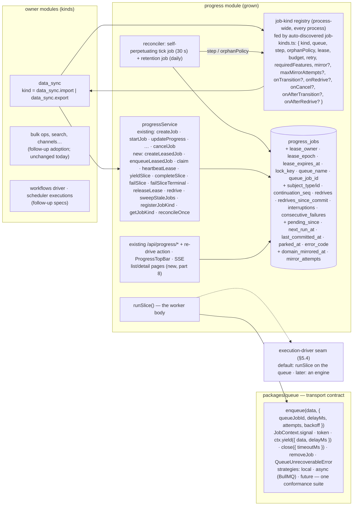

# Background work, part 4 — solution options and the decision

**Date**: 2026-08-21
**Status**: Draft v4.2 — umbrella decision record. Options scored, Option A recommended, shared vocabulary and invariants fixed here; the design is specified in four separately reviewable implementation specs (parts 5–8, see "Implementation specs"). Awaiting the maintainer decisions listed under "Decisions requested from maintainers".
**Series**: [part 1](./2026-08-21-background-work-01-data-sync-problems.md) — `data_sync` problems (D-n) · [part 2](./2026-08-21-background-work-02-sibling-modules-problems.md) — sibling modules (Q/P/W/S/… ids) · [part 3](./2026-08-21-background-work-03-common-problems-and-requirements.md) — classes C-1…C-14, requirements R-A…R-M, open decisions Δ-1…Δ-11 · [part 4](./2026-08-21-background-work-04-solution.md) — options, decision, shared invariants · [part 5](./2026-08-21-background-work-05-queue-transport-contract.md) — queue transport contract · [part 6](./2026-08-21-background-work-06-leased-jobs-in-progress.md) — leased tier in `progress` · [part 7](./2026-08-21-background-work-07-data-sync-adoption.md) — `data_sync` adoption · [part 8](./2026-08-21-background-work-08-operator-surface.md) — operator surface.
**Scope of this spec** (Q4): the architecture decision for the durable-work mechanism and the contract every implementation spec in the series must honour. It contains **no implementation plan** of its own: parts 5–8 each carry complete contracts, migration/rollback analysis, integration coverage, a compatibility review and their own approval state, and can ship in dependency order. Named follow-ups, not designed anywhere in the series yet: the `workflows` driver, `scheduler` executions, adoption by the bulk/indexing workers, the events-bus outbox/inbox, and the deferred waiting / delayed-start / full parent-child features (Q6).

## 📝 TLDR

Part 3 asks for one durable record per unit of background work with a lease on a database clock, a server-side replica-safe repairer, bounded resumable slices with a shutdown signal, store-enforced single-runner and idempotency keys, writes that commit together, retries at the idempotent unit, fenced cancel, and a conformance-tested transport. Every mature system surveyed — Postgres-native queues, durable-execution engines, Shopify/Sidekiq iteration, Airbyte, Odoo — converges on the same shape: **the record lives in the application's Postgres, the transport is disposable, liveness is a short renewable lease with a fencing epoch, and interruptions never spend the failure budget.** Four architectures are scored against R-A…R-M (§4): grow `progress` into the durable-work record, a new core module, a shared library with lease columns on each owner's table, or an external durable-execution engine. **Recommendation: grow `progress`** — it already holds most of the record (status, heartbeat, cancel flag, tenant scope, CAS transitions, events/SSE/UI/ACL, ~40 consumers) and a second record would recreate the multi-clock disease; keep the record store non-pluggable (app DB, one clock, atomic with domain rows) and make the *transport* and the *execution driver* the two pluggable seams so an engine can be adopted later without touching owners. `data_sync` becomes the first leased kind: a run is a chain of ≤ 5-minute slices that yield on SIGTERM, rethrow transient errors, and are re-driven by a worker-side reconciler.

**How to read the series from here.** This part decides *what* is built and fixes the vocabulary and invariants shared by every later part. Part 5 specifies the transport additions `packages/queue` needs (no `progress` change). Part 6 specifies the leased tier in `progress` — data model, lease SQL, service API, `runSlice`, the reconciler, the terminal-transition protocol, cancellation. Part 7 specifies `data_sync` as the first consumer. Part 8 specifies the operator-surface polish. Each is independently approvable; the dependency order is 5 → 6 → 7, with 8 depending on 6 only.

## 📝 Resolved questions

| # | Question | Answer | Consequence in this spec |
|---|---|---|---|
| Q1 | Where the record lives | Consider all three | §4 scores A (grow `progress`), B (new module), C (shared lib + owner columns) |
| Q2 | External engines | Compare; consider adapters | §4 scores D (engine as the mechanism); §5.4 designs "engine as a driver" behind the OM record |
| Q3 | Record-store pluggability | Consider both | §4.2 evaluates it as a dimension of every option |
| Q4 | Scope | Mechanism + queue ergonomics + `data_sync` first | §7 phases; §8 follow-ups; §9 traceability marks what is deferred |
| Q5 | Format | Scored options, one designed | §4 matrix, §5 design |
| Q6 | Waiting / delayed start / parent-child | Defer | Not in the part 6 schema; a *minimal* cancel cascade over the existing `parent_job_id` ships now because R-G3 is a MUST (part 6 §8) |

## 📝 Problem Statement

See part 3. This spec cites classes `C-n` and requirements `R-xx`; it does not restate them. The one-sentence version: Open Mercato has ten ways of saying "work is happening in the background", none authoritative about liveness, none repaired by a process independent of browser traffic, and correctness under duplicates, lost locks, crashes between writes, cancellation and two replicas is left to each worker author.

## 📝 Research — how others solve it

Six read-only surveys (durable-execution engines; Postgres/Redis-native queues; app-framework iteration libraries; data-sync products; infrastructure primitives; commerce/ERP platforms) were run against the requirement families of part 3. Load-bearing claims are cited inline; the full notes are in the author's workspace and summarised here.

| Family | What the field does | Taken here |
|---|---|---|
| **A. Record & clock** | Every surviving system keeps a DB row per unit of work (Oban, pg-boss, River, Graphile, Solid Queue, DBOS `workflow_status`, Odoo `queue_job`, Akeneo, Vendure, Magento). Liveness is a short renewable lease on the **broker/DB clock**: SQS visibility (30 s default, extended from call time), Service Bus peek-lock (1 min), pg-boss `expireInSeconds`, Hangfire sliding invisibility (5 min), Temporal heartbeat timeout; Graphile `useNodeTime: false`. Renewal at ⅓ of the TTL (Kafka, BullMQ lock/2, Temporal 0.8×). Heartbeats are cheap and separate from history (Temporal mutable state). | Lease on `progress_jobs`, DB time in every predicate, renewal at ttl/3, heartbeat columns unindexed (R-A1–A3, R-I1). |
| **Fencing** | [Kleppmann](https://martin.kleppmann.com/2016/02/08/how-to-do-distributed-locking.html): a lease alone is not a correctness lock; a monotonically increasing token checked by the resource is (Chubby sequencers, Step Functions task-token invalidation, Kafka Connect KIP-618). Trigger.dev guards every mutation with a snapshot-id compare-and-set. | `lease_epoch` bumped on every claim **and on every reconciler take**; every write-back and every domain fence is `… WHERE lease_epoch = $mine` (R-D3, R-B2). |
| **B. Repair** | A separate sweeper on an interval: Oban Lifeline (60 min/60 s), River Rescuer (1 h), pg-boss supervise (60 s), Airflow zombies (5 s heartbeat / 300 s), Odoo `requeue_dead_jobs` + `JobFoundDead`, Akeneo watchdog. Two dissents: [Solid Queue](https://github.com/rails/solid_queue) marks a pruned process's jobs failed and deliberately does not auto-retry ("the job itself might be what's killing the process"); [Sidekiq Pro](https://github.com/sidekiq/sidekiq/wiki/Reliability) parks after 3 recoveries in 72 h. Engines (Restate, DBOS, Trigger.dev) *park* exhausted work resumably. | Worker-side reconciler; per-kind orphan policy (`redrive` for idempotent kinds, `park` otherwise); redrive budget resets only on committed progress; parked = operator-resumable (R-B1–B5). |
| **C. Slicing & shutdown** | Shopify [job-iteration](https://github.com/Shopify/job-iteration) / [Sidekiq Iteration](https://sidekiq.org/wiki/Iteration) / Rails 8.1 Continuation: enumerator + cursor, finish the current item on shutdown, persist cursor, re-enqueue — **"an interruption of a job does not count as a retry"**; `max_job_runtime` forces periodic self-interruption. Temporal continue-as-new, Inngest steps, Hatchet child tasks. BullMQ's own [process-step-jobs](https://docs.bullmq.io/patterns/process-step-jobs) pattern: `job.updateData()` then `moveToDelayed` + `DelayedError` — "these special operations don't increment the `attemptsMade` counter". SQS: past ~12 h, decompose. K8s: SIGTERM → grace (30 s) → SIGKILL; [Railway](https://docs.railway.com/deployments/reference): **0 s** unless `RAILWAY_DEPLOYMENT_DRAINING_SECONDS` is set. | Slice budget per kind (default 5 min); yield at a durable boundary via the transport's hand-back after rewriting the payload; SIGTERM relayed to the handler's `AbortSignal` before `close()`; interruptions counted, never budgeted (R-C1–C4). |
| **D. Single-runner & idempotency** | Partial unique index over live states ([River](https://riverqueue.com/docs/unique-jobs), Oban Pro Smart, Odoo `identity_key`, Solid Queue recurring `(task_key, run_at)`); Temporal "only one open execution per Workflow Id"; Shopify "one bulk operation per shop"; Fivetran "already running → skip this occurrence". Advisory locks are the pooler-hostile minority (Que, GoodJob). Dedup windows are TTL'd and business-keyed. Idempotency is the handler's job (Helland; Sidekiq/GitLab doctrine). | Partial unique index on `(lock_key, tenant, org) WHERE status IN ('pending','running')`; deterministic queue job ids; `claim` refuses stale deliveries by `(seq, redrives)`; the idempotency key reaches the handler (R-D1–D4). |
| **E. Atomicity** | Same-DB transactional enqueue is the structural advantage of Postgres queues ([River's three Redis failure modes](https://riverqueue.com/docs/transactional-enqueueing); Oban `insert` in `Ecto.Multi`; Graphile `add_job`; DBOS). With an external broker the row *is* the outbox and a repairer re-enqueues rows without a live counterpart. Medusa is the counter-example (Redis checkpoints + BullMQ delayed jobs as the clock → stuck executions, no repair loop). | Record + domain row in one MikroORM transaction; events and enqueue after commit; the reconciler's pending predicate is the relay (R-E1–E4). |
| **F. Retries** | Per-step counters (Inngest, Temporal); snooze that does not burn budget ([River decrements attempts](https://riverqueue.com/docs/snoozing-jobs), Oban bumps `max_attempts`); non-retryable error classes everywhere; Magento stores retriable/terminal in the schema; Airbyte resets the failure streak on any partial progress; K8s `podFailurePolicy`: disruption does not consume the backoff budget. | Retry unit = slice; `consecutive_failures` resets on a committed unit; `QueueUnrecoverableError`; transport retries the slice, the reconciler handles orphans, interruptions have their own counter (R-F1–F5). |
| **G. Cancellation** | Cooperative everywhere: on the heartbeat channel (Temporal/Cadence), between steps (Inngest), LISTEN/NOTIFY + context cancel (River), `abortController.signal` (Hatchet); 30 s grace then kill (Trigger.dev); cancellation itself times out (Dagster 180 s); cascades to children (DBOS, Restate, Odoo). Terminal `cancelled` only when stopped. | `cancel_requested_at` returned by the heartbeat CAS → `signal.abort()`; `cancelled` written by the slice that observed it or by the reconciler after the lease expired; cascade over `parent_job_id` (R-G1–G3). |
| **H/I. Replicas & scale** | `FOR UPDATE SKIP LOCKED` for claims and sweeps; leader election only as an optimisation (River 5 s lease row; Solid Queue/GoodJob make cron duplicate-safe with a unique index); fillfactor 80–90 and unindexed heartbeat columns for HOT updates; periodic `REINDEX CONCURRENTLY` (River, Oban); hot vs history tables (Hatchet); retention by policy (Odoo 30 d, Temporal 30 d). | Reconciler batches with `SKIP LOCKED`, no leader; HOT-safe heartbeats; retention job; a deterministic self-perpetuating tick instead of a leader (R-H1–H3, R-I1–I2). |
| **J. Transport** | At-least-once is the universal floor; broker attempt counters are advisory (Pub/Sub "may reset to zero"); brokers differ in dedup/delay/abort support. | One thin transport contract + a conformance suite per strategy (R-J1–J4). |
| **K. Operators** | Execution history with retention and a re-drive/cancel surface are table stakes (Odoo Jobs UI, Magento bulk status, Shopify bulk ops, Airbyte attempts, Temporal reset, Trigger.dev DLQ redrive). | Reuse the existing `progress` list/detail/cancel surface; add re-drive (R-K1–K3). |
| **L. Reuse / engines** | [DBOS Transact](https://docs.dbos.dev/architecture) is the closest relative (TypeScript library on Postgres, same-DB enqueue, `workflow_status` + per-step outputs, startup recovery, `recovery_attempts` cap) but recovers across nodes only via its hosted Conductor; Temporal/Restate/Inngest/Trigger.dev need a server or SaaS. OM's `workflows` engine is data-defined, so it needs a durable *driver*, not deterministic replay. | The record + `step()` contract mirror a Temporal activity / DBOS step so an engine can become a driver later (§5.4); no engine dependency now (Δ-9). |

---

## 📝 Candidate architectures

### 4.1 The options

**A — Grow `progress` into the durable-work record.** Additive columns on `progress_jobs` (lease, epoch, lock key, subject pointer, continuation counters); new methods on `ProgressService`; a kind registry; a reconciler owned by the `progress` module; existing events/SSE/UI/ACL/API reused. Existing consumers keep working unchanged as "tracked" jobs; owners opt into the "leased" tier per kind.

**B — New core module (`background_jobs`).** Its own table, service, registry, reconciler, events and routes; `progress_jobs` keeps the presentation role and later becomes a façade over it (so the UI is reused once the façade lands). This is the design that was removed from the tree; §5 reuses its mechanics regardless of the home.

**C — Shared library + lease columns on each owner's table.** `@open-mercato/shared/lib/durable/` exports `claimLease`/`heartbeat`/`fencedUpdate`/`runSlice` over any entity with the lease columns; `sync_runs`, `workflow_instances`, per-module claim rows each gain them; each owner runs its own sweeper or registers its table with a generic one.

**D — External durable-execution engine.** D1: DBOS Transact as a library sharing the application's Postgres. D2: a server/SaaS engine (Temporal, Restate, Hatchet, Inngest, Trigger.dev). In both, owners write steps/workflows in the engine's contract; the engine owns record, liveness, retries and recovery.

### 4.2 The store dimension (Q3)

| Record store | Atomicity with domain rows (R-E1) | One clock (R-A3) | Works in every deployment | Cost |
|---|---|---|---|---|
| Application Postgres via MikroORM | yes — one transaction | yes | yes (every OM install has it; the local queue strategy needs nothing else) | zero new infra; additive migration |
| Abstracted (Redis, Dynamo, …) | **no** — needs an outbox *and* a second repairer for the outbox | no — second clock | only where that store exists | an interface nobody has asked for; correctness regresses |

Applied to every option below: **the record store is not pluggable**. The *transport* (already a strategy) and the *execution driver* (§5.4) are. This is the split every surveyed system makes, and the opposite of Medusa's, whose Redis-side checkpoints are the documented source of its stuck workflows.

### 4.3 Scoring

Scale: 3 = satisfies the family as specified; 2 = satisfies with a stated cost; 1 = partial; 0 = fails or contradicts. "Time to data_sync" = effort until part 1's High findings are closed for the first consumer.

| Criterion | A grow `progress` | B new module | C lib + owner columns | D1 DBOS library | D2 server engine |
|---|---|---|---|---|---|
| R-A one record, one clock | **3** — one row per operation | 2 — authoritative row + a presentation row until the façade lands (two heartbeats per slice) | 1 — one row per owner table; "is anyone driving X?" is N queries; bulk ops without an owner row still need `progress` | 3 | 3 |
| R-B repairer | 3 — one tick, one registry | 3 | 1 — a sweeper per table, or a table registry | 2 — single-node startup scan; cross-node recovery needs the hosted Conductor or admin calls | 3 |
| R-C slices, shutdown, signal | 3 | 3 | 3 | 2 — workflow bodies must be deterministic | 3 |
| R-D single-runner, idempotency key | 3 | 3 | 2 — per owner table; no cross-kind key | 3 | 3 |
| R-E atomic writes | 3 — same EM transaction | 3 | 3 | 2 — same Postgres, but DBOS's own pool/transactions beside MikroORM's | 0 — API call outside the DB transaction |
| R-F retries at the slice | 3 | 3 | 3 | 3 | 3 |
| R-G fenced, cascading cancel | 3 | 3 | 2 — cascade needs parent links each owner must model | 2 — preempts at the next step | 3 |
| R-H/I replicas, scale | 3 | 3 | 2 | 2 | 3 |
| R-J transport contract, local parity | 3 — keeps `packages/queue` | 3 | 3 | 1 — DBOS *is* the queue; local strategy and existing workers bypassed | 0 |
| R-K operator surface | 3 — list/detail/cancel API routes, the top bar, events/SSE and ACL exist; the list and detail *pages* do not (`progress` has no `backend/`) and are part 8's first step, as is re-drive | 2 — reused only after the façade; until then a second surface | 0 — per owner | 2 | 3 |
| R-L one mechanism, additive adoption | 3 — consumers unchanged; opt-in per kind | 2 — every consumer migrates eventually | 1 | 1 — workflow-code model; the data-defined `workflows` gains nothing from replay | 1 |
| R-M verifiable on real PG/Redis | 3 | 3 | 2 | 2 — engine internals are a black box | 1 |
| Compat (`BACKWARD_COMPATIBILITY.md`) | **2** — schema/interface/events additive, but two observable behaviours change for leased rows (`progress.job.cancelled` timing; stale sweep off the GET) — documented in UPGRADE_NOTES | 3 — new surfaces only | 2 — touches every owner's table | 1 — new production dependency (Ask-First); tables outside `yarn db:generate` | 0 — a server the module system cannot self-host |
| Naming clarity | 1 — "progress" is not a name for the durable-work authority | 3 | 2 | 2 | 3 |
| Time to data_sync | **short** | medium — module first, then link | short for data_sync; nothing else benefits | medium — rewrite the engine loop as a workflow | long |
| Operational footprint | none new | none new | none new | library with its own pool, schema, version cadence | a cluster or a vendor |

**Reading the matrix.** A and B are the only two that satisfy every functional family; they differ on how many records describe one operation — the disease of part 1 §8 — and on how much surface is duplicated before the façade exists. C is today's repo with better helpers; it fails R-A1 and R-K by construction. D1 matches R-A/B/D/F well and would give step checkpoints for free, but it replaces `packages/queue`, bypasses every existing worker and the local strategy, brings its own pool and transactions beside MikroORM's, and recovers across nodes only through a hosted service — for a workflow-code model OM's data-defined `workflows` does not need. D2 is correct in the abstract and disqualified by the deployment model.

### 4.4 Recommendation

**Option A, with the record store fixed to the application database, and the transport and the execution driver as the two pluggable seams.** B remains the documented fallback if maintainers decide `progress` must stay presentation-only: §5 is home-agnostic except for the table the columns land in and the need for a `progress` façade.

What D contributes without being adopted: the `step()` contract is shaped like a Temporal activity / DBOS step, so D1 or D2 can later be registered as a *driver* for a kind (§5.4) without touching owners — the "adapter" of Q2.

Naming (Δ-2): module id, table and DI key stay `progress` (frozen surfaces); docs and AGENTS.md call the new tier **leased jobs** and the record an **operation**. A rename is not worth a compat break.

---

## 📝 Architecture (Option A) — the shape every implementation spec builds

### 5.1 Vocabulary (shared by parts 5–8)

| Term | Meaning |
|---|---|
| **operation** / `jobId` | a `progress_jobs` row (uuid); unchanged meaning for today's consumers |
| **tracked** tier | today's behaviour: counters + `heartbeat_at` written as a side effect of progress writes, swept by the stale sweep. Every existing consumer stays here until it opts in |
| **leased** tier | a row whose `kind` is registered (`lock_key is not null`); it has a lease, continuation counters, is driven by `runSlice` and repaired by the reconciler |
| **kind** | the `job_type` value of a leased row, written by `createLeasedJob` from the registration and never by the caller (`data_sync.import`, `data_sync.export` — part 7 renames today's `data_sync:<direction>` and ignores `progressJob.jobType` overrides for leased runs); declared once per owner in the module's auto-discovered `job-kinds.ts` (part 6 §4) and loaded into a process-wide registry in **every** process (web, worker, CLI) |
| **lease** | `lease_owner` + `lease_epoch` + `lease_expires_at`; extended by `heartbeatLease`; the only liveness signal for the leased tier |
| **epoch** | monotonically increasing integer, bumped on every successful claim and on every reconciler take; the fencing token carried by every write-back and every domain fence |
| **delivery** | one transport hand-off to `runSlice`; payload `{ jobId, seq, redrives, scope }`; queue job id `pj-<jobId>-<seq>-<redrives>` (BullMQ 6.0.9 rejects any custom id containing `:` unless it splits into exactly three parts — `job.js:907-910` — so ids in this series never contain a colon) |
| **slice** | one delivery's execution of `step()` under one lease; bounded by `sliceBudgetMs`; `continuation_seq` counts slices |
| **yield** | the slice stops at a durable boundary, releases the lease and hands the job back to the transport with the new `seq` in its payload; increments `interruptions` when caused by `signal`, never any budget |
| **orphan** | a leased row whose lease expired without a terminal transition or a yield — the reconciler's subject. ("Stale" is reserved for the tracked tier's sweep; "abandoned" for `packages/queue`'s existing hook.) |
| **redrive** | the reconciler re-enqueues an orphan or a never-claimed row, or an operator re-enqueues a `failed` (parked or terminal) or lease-expired row; `redrives` counts it and is part of the delivery identity (monotone — the budget that resets on a committed unit is `redrives_since_commit`). An operator re-drive also re-opens the domain row through the kind's `onRedrive` in the same transaction (part 6 §3) |
| **committed unit** | the owner reports `committed: true` on a heartbeat after a durable domain write (data_sync: a fenced batch commit); resets `consecutive_failures` and `redrives_since_commit`, sets `last_committed_at` |
| **parked** | `status='failed'` with `parked_at` set and `error_code` explaining why — a reconciler *park reason* (`orphaned`, `poison`, `never_started`, `no_handler`) or a preserved *slice verdict* (`unrecoverable`, `retry_exhausted` — written by `failSlice` when the slice's own terminal transaction could not commit, part 6 §3/§5). Parked is a *reason*, not a distinct re-drivability class: the operator `redrive` admits **every** `failed` leased row (parked or terminal, including a verdict as a recorded override) and an expired-lease `running` row, and refuses `completed` and `cancelled`. No new status value in phase 1 |
| **verdict** | one of two `error_code` values a slice writes *before* attempting its terminal transaction — `unrecoverable` (`QueueUnrecoverableError`) or `retry_exhausted` (the `maxConsecutiveFailures`-th failure without a committed unit). A row carrying a verdict is never re-driven automatically and runs no further `step()`; Q1 parks it with the verdict preserved (part 6 §3, §5 step 4, §6) |
| **owner** | `${hostname}:${pid}:${processStartRandom}` — generated once per process start, never per claim |

### 5.2 Invariants (binding on parts 5–8)

1. **Database clock only, one statement per predicate.** Every lease, timeout and ordering predicate uses Postgres time; worker clocks drive heartbeat *intervals* only (R-A3). Because `now()` is frozen for the duration of a transaction, every lease statement (`claim`, `heartbeatLease`, `yieldSlice`, `failSlice`, the reconciler take) runs in its **own short autocommit transaction on a forked EntityManager** — the same discipline `touchJobHeartbeat` already follows (`progressServiceImpl.ts:301`). Never inside the slice's domain transaction. The one multi-statement transaction on the leased tier is the *terminal* transaction of invariant 11 (terminal CAS + domain mirror) — it reads `now()` once and holds no lease across statements, so the clock argument does not apply to it. MikroORM specifics to honour: the fork is `em.fork()` with the defaults (`useContext: false`, `keepTransactionContext: false` — either flag set would join the slice's transaction via the ALS context); reads use `disableIdentityMap: true`; the fork takes a *second* pooled connection while the slice's transaction holds one, which is why the +1 connection reservation in part 6 §6 is load-bearing (a pool sized exactly to Σconcurrency would deadlock).
2. **One CAS per transition**, `UPDATE … WHERE <expected state> RETURNING *`; zero rows = refused; a refused claim does no work. The existing `progress` discipline, extended to the new columns.
3. **Epoch fencing.** `claim` and the reconciler take both bump `lease_epoch`; `heartbeatLease`, `yieldSlice`, `completeSlice`, `failSlice` and every owner-side domain fence include `lease_epoch = $mine`. After a take, the previous driver's next heartbeat returns `null` and its next fenced domain write affects zero rows — R-B2's acceptance holds at the moment of the take, not at the next claim (C-8).
4. **`lease_expires_at` is never NULL once claimed.** A slice that stops without finishing either releases the lease (`lease_owner = null`, `lease_expires_at = now()`, part 6 §3 `failSlice`/`yieldSlice`/`releaseLease`) or leaves it to expire — a `running` row with a released lease (transport backoff) is a normal state, which is why the guarantee is on the timestamp, not the owner: `lease_expires_at` is never NULL on a leased row once claimed, so every liveness predicate has a value to compare.
5. **Stale deliveries are refused by identity, and identity is monotone — and by identity only.** `claim` requires `payload.seq = continuation_seq` and `payload.redrives = redrives` and reads **no scheduled time**: every delivery that carries a `next_run_at` was delayed by the *transport's* clock, so a `next_run_at <= now()` clause would refuse a retry that arrives early by broker-vs-DB skew and lose it (part 6 §3). **`redrives` only ever increases** (it is an identity, not a budget). A transport retry after `failSlice` carries the *same* pair and is accepted (that is the retry); a delivery from before a yield or before a take carries an older pair and is refused forever. Budgets use the separate `redrives_since_commit`, which resets on a committed unit. No epoch is carried in payloads, and there is no same-owner exception in `claim`.
6. **Heartbeats are HOT.** `heartbeatLease` writes only `lease_expires_at`, `heartbeat_at`, `processed_count`, `total_count`, `consecutive_failures`, `redrives_since_commit`, `last_committed_at` — never `redrives`, which is an identity (invariants 5, 9) — none of which appears in any index key or partial-index predicate (R-I1). `updated_at` is not touched by heartbeats.
7. **Interruptions are not failures (best effort).** A yield caused by `signal` increments `interruptions` only; budgets and the transport's attempt counter are untouched. The one exception is documented: if the transport's hand-back itself fails (BullMQ `moveToDelayed` after the lock is already lost — the S3 case), that delivery ends as a throw — costing one recorded transport attempt when the job still exists, or only a logged transport-side error when a refused stalled redelivery already completed and removed it (`removeOnComplete: true`; a missing job cannot be moved to `failed`, part 6 §9 S3); the row is already `pending` with the new `seq`, so `runSlice` falls back to `enqueueLeasedJob` under the new id `pj-<id>-<seq+1>-<redrives>` at once (part 6 §5 step 4) and Q2 is only the backstop if that enqueue fails too.
8. **Crash ≠ error.** An expired lease is repaired by the reconciler under the *orphan* policy and the `redrives_since_commit` budget; a thrown error is retried by the transport under the *retry* policy and the `consecutive_failures` budget. The two never share a counter, and the reconciler waits for the transport's own retry: `failSlice` sets `next_run_at` to the transport's next attempt time (written as a delay on the DB clock; **null** when no further delivery is coming) and Q1 ignores rows whose `next_run_at` is less than `pendingTtl` old — `next_run_at` is when the broker makes the retry *available*, and its pickup can wait a queue backlog behind it — so an orphan with a scheduled delivery is only taken once the transport has demonstrably given up, while a null `next_run_at` is acted on after the short lease grace alone (part 6 §3). A slice *verdict* is neither: `failSlice` records `error_code = 'unrecoverable'` (the error class) or `'retry_exhausted'` (the `consecutive_failures` cap, applied by `runSlice`) in its own autocommit statement *before* the terminal transaction is attempted, so the row carries the verdict even if that transaction cannot commit; Q1 parks such a row with the code preserved instead of applying the orphan policy, and a re-delivery of it runs no `step()` (part 6 §5 step 4, §6). A cancel request outranks both: Q3 runs before Q1 on every tick and Q1/Q2 skip rows with `cancel_requested_at` set (part 6 §6).
9. **Every reconciler or operator action changes the delivery identity.** A take, a pending re-drive and an operator `redrive` all bump `redrives` (and the epoch), so the new enqueue id `pj-<id>-<seq>-<redrives>` never collides with a delivery the transport still holds in delayed/failed state; the old delivery, if it ever arrives, is refused by invariant 5. A yield keeps the transport's job id (BullMQ `moveToDelayed` does not change it) — only the payload changes.
10. **The tracked tier is untouched, and its sweep never touches the leased tier.** Rows without `lock_key` behave exactly as today; their stale sweep keeps its predicate and CAS (but moves to the worker tick, part 6 §6) with **one added clause on both predicates, `and lock_key is null`** — on the worker tick and on the `OM_PROGRESS_SWEEP_ON_READ` GET path alike — and the `touchJobHeartbeat`/`updateProgress` revive (`failed → running`, `staleSweptOnly`) is scoped the same way. A leased row is `pending` between slices with an old `created_at` and `running` without a heartbeat during a transport backoff; without the clause the tracked sweep would fail it outside the terminal protocol of invariant 11 (no mirror, no epoch bump) and `claim` would then refuse its own retry. Liveness of a leased row is judged by its lease only (part 6 §6 Q1/Q2). The same fence applies to the tracked tier's *status-writing members*: `startJob`, `completeJob`, `failJob`, `markCancelled` and the tracked branches of `cancelJob` carry `lock_key is null` and return a leased row unchanged, so a terminal state can reach a leased row only through invariant 11's path (part 6 §3, §7). Retention is scoped to the leased tier in phase 1; tracked-tier rows are deleted only when an operator opts in (`OM_PROGRESS_TRACKED_RETENTION_DAYS`, part 6 §2).
11. **A terminal transition and its domain mirror commit together or not at all.** `completeSlice`, the terminal `failSlice`, the cancel CAS and every reconciler park/cancel run the terminal CAS **and** the kind's `onTransition(job, scope, em)` in **one short transaction on a forked EM**; a throwing mirror rolls the CAS back and the row stays non-terminal, to be retried by the transport or the next tick. Kinds whose domain row cannot share the transaction declare `mirror: 'deferred'`: the CAS then commits with `domain_mirrored_at = null` and the reconciler retries the (idempotent) mirror until it succeeds. "Mirrored" means the mirror's fenced UPDATE **matched** the domain row (`onTransition` returns `{ matched }`; zero is a failed mirror, never recorded as mirrored). Failed mirrors are counted on the row (`mirror_attempts`, written in its own autocommit statement *outside* the rolled-back transaction — R-H1 forbids counting in process memory) and surface as `mirror_stuck` at the kind's `maxMirrorAttempts`. **The same invariant holds in reverse**: an operator `redrive` leaves the terminal state together with the domain row — the kind's `onRedrive` re-opens it inside the `redrive` transaction, and a re-open that matches nothing refuses the re-drive. Either way no terminal `progress_jobs` row can exist whose domain row was never told, and no re-driven row can run against a domain row still marked terminal — the gaps that invalidated R-E1–E4 in review v3 and the re-drive in review v4.1 (part 6 §3, §7).

Where each invariant is discharged: 1–9 and 11 in part 6 (lease SQL incl. the re-drive family, service API, reconciler, terminal-transition protocol with the mirror counter); the transport capabilities they assume (`yield`, `signal`, bounded `close`, deterministic ids) in part 5; 10 by construction in part 6 §2 (tracked rows carry no `lock_key`). Part 7 adds the domain-side fence `data_sync` needs and nothing that weakens these.

### 5.3 Why the mechanics are split the way they are

The leased tier (part 6) depends on part 5 only through the transport contract's *capabilities* — every capability has a defined fallback through `claim` or the reconciler (invariant 5), so part 6 is correct on a transport that has none of them and merely efficient on one that has them all. Part 7 depends on part 6's service API and on part 5's `queueJobId`. Part 8 depends on part 6's DTO fields and re-drive route. Nothing depends on part 7 or 8. This is what lets each spec carry its own rollback: part 5 is inert until a caller uses a new option, part 6 is inert until a kind registers, part 7 is reverted by redeploying the previous `data_sync` worker and route, part 8 is UI only.

### 5.4 The execution-driver seam (Q2's "adapters")

The record and `step()` contract are engine-shaped on purpose: heartbeat-with-details ≈ Temporal activity heartbeat / Hatchet `refreshTimeout`; `budget` + yield ≈ continue-as-new / DBOS step boundary; `AbortSignal` ≈ cancellation scope; `idempotencyKey` ≈ workflow/step id. A kind may declare `driver: 'queue' | 'engine:<name>'`; the default is `runSlice` on `packages/queue`. An engine driver would own *execution* (scheduling slices, its own retries) while the `progress_jobs` row stays the operation's record for UI, ACL, cancel and history — the split Airbyte uses (Temporal executes; the jobs table is the record). Nothing here implements a second driver; it guarantees that adding one touches no owner. Gains if adopted: per-step memoised checkpoints and cross-node recovery without our reconciler; losses: a production dependency (Ask-First), a second system to operate, no local-strategy parity.

---

## 📝 Outbox and inbox — what this design is, and what it leaves to follow-ups

The design in part 6 is a **transactional outbox** for job delivery, even though part 6 does not use the word: the `progress_jobs` row is written in the same transaction as the domain row (`createLeasedJob(em)`), the transport is told *after* commit, and the reconciler's Q2 (part 6 §6) is the relay that republishes rows whose delivery never arrived. `claim`'s refusal of stale `(seq, redrives)` is the matching **inbox** (idempotent consumer) collapsed into the job row's own counters, which works because each row is its own stream. Two consequences are worth stating:

- **Relay latency is `pendingTtlMs`** (15 min) because Q2 doubles as the relay. A lost enqueue is rare (Redis down at exactly that moment), so this is acceptable for phase 1; a dedicated fast relay (`LISTEN/NOTIFY` wake-up or a 30 s "pending with no `queue_job_id`" scan inside the existing tick) is a one-line extension if operators want it, and does not change any contract.
- **Events after commit are still not repairable.** `emitCreated()` and the terminal-transition events are emitted *after* the CAS, so a kill in between loses the event (R-E3's second half). For `progress.job.*` this is benign — the 5 s poll converges the UI — and accepted here. For domain events it is not: the events bus has the same hole today (EV-4: kill between inline delivery and `q.enqueue` loses a persistent event) and no outbox. Out of Q4's scope; named as a follow-up below rather than left implicit.

What the pattern implies elsewhere in the repo, as **named follow-up specs**:

| Follow-up | Pattern | Discharges | Replaces |
|---|---|---|---|
| **Event outbox in `packages/events`** — `emit({ persistent: true })` inside a transaction writes an outbox row; a relay publishes after commit; at-least-once to subscribers | outbox | R-E3 second half (C-5) | EV-4; the emit-after-CAS gap in every module that emits inside a transaction |
| **Per-subscriber inbox for persistent fan-out** — `processed_events(event_id, subscriber_id)` with a unique key; a subscriber that already processed the event is skipped on retry; the row is written *after* the subscriber's effect, inside its transaction where possible | inbox | R-F3 for fan-outs (C-6) | EV-1 (all subscribers re-run on one failure), WH-1 (fresh `messageId` per re-run), MS-2, CK-2 |
| **Converge the existing claim tables** — `WebhookProcessedEvent` (payment/shipping/Stripe), ingest `(channel_id, external_message_id)`, inbound receipt dedup — on one inbox contract: claim → effect → mark processed; a claim that never reaches "processed" is reconcilable, never a permanent loss | inbox | R-E4 | PG-3 / SC-3 / ST-2 (claim released or orphaned on failure, event lost) |
| **Webhook outbound as an outbox** — the delivery row already is one; it needs a stable `messageId = f(event_id, webhook_id)` and a relay that re-sends the existing row instead of creating a new one | outbox | R-D4 | WH-1, WH-2 |

None of these is needed for the leased tier or for `data_sync`; all of them reuse the same two ideas, which is why they are listed here rather than designed.

## 📋 Implementation specs (replaces the single phasing table of v3)

| Part | Spec | Owner surface | Depends on | Ships alone? | Closes | Approval state |
|---|---|---|---|---|---|---|
| 5 | [queue transport contract](./2026-08-21-background-work-05-queue-transport-contract.md) | `packages/queue` (+ `mercato queue worker` runner) | — | yes — additive options and context members, inert until used | Q-1, Q-2, Q-3, Q-12, Q-15, Q-17, Q-26 (partly), the conformance gap R-J2 | Draft — awaiting review |
| 6 | [leased jobs in `progress`](./2026-08-21-background-work-06-leased-jobs-in-progress.md) | `progress` module (schema, service, workers, route, DTO) | 5 | yes — inert until a kind registers | P-3, P-4, P-5, P-24 (partly), P-30, P-34, R-A…R-K for any adopter | Draft — awaiting review; blocked on decisions 1–3 below |
| 7 | [`data_sync` adoption](./2026-08-21-background-work-07-data-sync-adoption.md) | `data_sync` (engine, start-run, workers, scheduled trigger, the existing cancel and retry routes) | 5 (step 0), 6 (rest) | yes; step 0 ships before 6 exists | D-1, D-2, D-4…D-13, D-16…D-19, D-21…D-23, D-27, D-28, S-14; closes fsh#101 | Draft — awaiting review; three `data_sync/AGENTS.md` Ask-First items flagged |
| 8 | [operator surface](./2026-08-21-background-work-08-operator-surface.md) | `progress` backend UI (two new pages) + `data_sync` backend UI | 6 | yes | D-26, R-K2/K3 | Draft — awaiting review |

**Tracked separately, not in this series** (part 3 §0.1 hand-verified bugs that v3 had folded into Phase 0): the webhook payload-shape mismatch PG-1/SC-1/ST-1, W-18, MS-1, IN-1, CA-1, S-6 and the other production bugs of part 2. Each gets its own ticket; part 5's typed-payload helper makes the PG-1 class easier to fix but the fixes are not part 5's scope.

**Follow-up specs, not yet authored** (dependency order): the events-bus outbox and per-subscriber inbox (above); bulk/indexing workers adoption (CB/CD/SR/QI/CH/AK findings); `workflows` driver (W findings; needs Q6); `scheduler` executions (S findings; `kind = scheduler.execution`, `lock_key = schedule:<id>` — discharges R-K1); Q6 waiting / `run_after` / full parent-child aggregation; data_sync `finalizeRun` hook and `paused → waiting`; metrics endpoint (R-I2).

## 📝 Requirements traceability (series level)

| Requirement | Discharged in | Status |
|---|---|---|
| R-A1–A5 | part 6 §2–§3 | specified |
| R-B1–B5 | part 6 §6 (tick hosting, Q3 before Q1, take bumps epoch, the two budgets on `redrives_since_commit`, the verdict and `no_handler` park branches in Q1 and Q2, `SKIP LOCKED`), part 7 (out-of-tree in-process drivers run `runSlice` under the lease) | specified |
| R-C1–C4 | part 6 §5 step 4, part 5 (`yield`, `signal`, bounded close) | specified; R-C3 (sweeps resume from a cursor) applies to adopters in the follow-up |
| R-D1–D4 | part 6 §2 unique index, §3 `(seq, redrives)`, epoch fence, `idempotencyKey` | specified |
| R-E1, R-E2, R-E4 | part 6 §4 `createLeasedJob(em)` + deferred event, §3 `redrive` + `onRedrive`, §6 Q2/Q5, §7 terminal-transition protocol, part 7 | specified — v3's claim was invalid because a terminal CAS could commit without its domain mirror; invariant 11 and part 6 §7 close it, and v4.2 closes the reverse direction (a re-drive that left the domain row terminal) |
| R-E3 | first half (status change and its record are one transaction) in part 6 §7; second half (the emission itself repairable) | **partial** — emit-after-commit is at-most-once (part 6 §7 step 4); repairable emission is **deferred** to the events-bus outbox follow-up (outbox/inbox section) |
| R-F1–F5 | part 6 §5 (verdict branch applies `maxConsecutiveFailures`; `claim` clock-free), part 5 | specified; R-F5 partial on BullMQ (frozen at enqueue) |
| R-G1–G3 | part 6 §8 | specified; cascade minimal (children by `parent_job_id`), aggregation deferred to Q6 |
| R-H1–H3 | part 6 §6 (no process-local state; per-row isolation; tick dedup), §7 step 5 (`mirror_attempts` on the row, not in memory) | specified |
| R-I1 | invariant 6, part 6 §2 | specified |
| R-I2 | structured-log events in part 6; metrics endpoint | **deferred** (follow-up) |
| R-I3 | — | **deferred** (Q6) |
| R-J1–J4 | part 5 | specified |
| R-K1 | scheduler executions follow-up | **deferred** (Q4) |
| R-K2–K3 | part 6 §3 `redrive` (any failed or lease-expired row; `progress.job.redriven` carries `by`), §8 and DTO (`redrivable`), part 8 (incl. the two new progress pages and the two-tiered run Retry that keeps part 7's retry route) | specified |
| R-L1–L3 | §4.4, part 6 §4, each part's risk table | specified for the first consumer |
| R-M1–M2 | part 6 §10, part 7 integration coverage | specified |

## Decisions requested from maintainers

1. **A vs B** (§4.4): grow `progress` (recommended) or a new module as the home of the leased-job record. Everything in part 6 is home-agnostic except the table the columns land in and the need for a `progress` façade under B.
2. **Default `orphanPolicy`**: `'park'` (the spec follows Solid Queue; owners opt into `'redrive'` by declaring idempotency) vs `'redrive'`.
3. **Default mirror mode** (new in v4): `'atomic'` — the domain mirror runs inside the terminal transaction (recommended; every in-repo consumer has its domain row in the app DB) — vs `'deferred'` for all kinds, which would make the reconciler's Q5 the only mirror path and add up to one tick of latency to every terminal mirror.
4. `sliceBudgetMs` 5 min vs `pendingTtlMs` 15 min: the ratio means a healthy queued delivery may wait **three slice budgets** of queue backlog before Q2 re-drives it (part 6 §6's backlog constraint); in reconciler time that is thirty 30-second ticks (900 s / 30 s), not three — a lost hand-back is therefore repaired after 15 min, which is acceptable because the slice's own `enqueueLeasedJob` fallback (invariant 7) handles the common lost-hand-back case immediately. The same constant is Q1's tolerance past a scheduled `next_run_at` (invariant 8, part 6 §3) — pending rows and released-lease running rows wait out the same backlog. Tune after the soak (part 7).

## Changelog

- 2026-08-23 — v4.2 after the third, fourth, fifth, sixth and seventh reviews (PR #5450). Seventh review: invariant 4 retitled to the guarantee it actually makes (`lease_expires_at` never NULL once claimed — a released lease while `running` is a normal state); invariant 7 states the S3 accounting honestly (a job the refused redelivery completed and removed records no failed attempt — the throw is a logged transport-side error); invariant 8 gives a scheduled `next_run_at` the `pendingTtl` backlog tolerance and defines null as "no delivery coming" (fast-parked on the lease grace); the architecture diagram's service list gains `failSliceTerminal · releaseLease · sweepStaleJobs · registerJobKind · getJobKind` and the registry entry the `onAfterTransition?`/`onAfterRedrive?` after-commit hooks part 6 §4 now defines (the former `emitAfterCommit` placeholder); the runner is named by its real command, `mercato queue worker`. Sixth review: invariant 5 states that `claim` fences by identity *only* (no `next_run_at` clause — two clocks); invariant 8 generalises `unrecoverable` to the two slice *verdicts* (`unrecoverable`, `retry_exhausted`, written before the terminal transaction) and names Q3's precedence over Q1/Q2 for cancel-requested rows; invariant 10 extends the `lock_key is null` fence to the tracked tier's status-writing members and scopes retention to the leased tier; vocabulary gains `verdict` and the parked list names both verdicts; R-K score and the diagram say the progress list/detail *pages* are new (part 8); spec-map rows 7 (cancel/retry routes, no CLI) and 8 (two new pages); traceability R-B (no in-tree CLI), R-F, R-K; decision 4 arithmetic corrected to thirty ticks. Fifth review: invariant 10 adds `lock_key is null` to both tracked-sweep predicates (tick and GET path) and the revive path, so the tracked sweep can never fail a leased row outside invariant 11; invariant 7 names the immediate `enqueueLeasedJob` fallback when the native hand-back throws (S3); invariant 8 names the `unrecoverable` park branch; vocabulary `kind` corrected (`data_sync.import` is a rename of today's `data_sync:import`, caller `jobType` overrides are ignored, kinds are declared in an auto-discovered `job-kinds.ts` loaded in every process); delivery row states BullMQ's actual colon rule (`split(':').length === 3`); decision 4 arithmetic restated in slice budgets; diagram lists `redrives_since_commit`, `retry` and the registry's discovery source. Earlier in v4.2: invariant 11 now states both directions (terminal mirror must *match*; operator re-drive re-opens the domain row via `onRedrive` in the same transaction) and where the failed-mirror count lives (`mirror_attempts` on the row, R-H1); vocabulary — `parked` is a reason, not the only re-drivable class (`redrive` admits every failed or lease-expired leased row), `redrive` and `committed unit` entries corrected to name `redrives_since_commit` as the resetting budget; architecture diagram lists `onRedrive`, `mirror`, `maxMirrorAttempts`, `domain_mirrored_at`, `mirror_attempts`; traceability rows R-E, R-H, R-K updated. Part 5 v1.2, part 6 v1.2, part 7 v1.2, part 8 v1.2.

- 2026-08-22 — v4.1 after the second review (PR #5450): invariant 6 names `redrives_since_commit` (not the identity `redrives`) as the heartbeat-written budget; the R-E traceability row split so R-E3 reads *partial* with repairable emission deferred to the events-bus outbox follow-up; part 5 states the BullMQ floor (6.0.0) and narrows the peer range; part 6 v1.1 specifies the way out of `parked`.

- 2026-08-22 — Draft v4 after review (PR #5450, changes requested). **Structural:** this part is now the umbrella decision record (options, recommendation, shared vocabulary and invariants, driver seam, outbox/inbox follow-ups, spec map, series traceability); the data model, lease SQL, service API, `runSlice`, reconciler, cancellation, `data_sync` adoption, failure scenarios, risks and implementation steps moved into parts 5–8, each with its own contracts, compatibility review, rollback, integration coverage and approval state. Unrelated production bugs (PG-1/SC-1/ST-1 and the rest of part 3 §0.1) are tracked as separate tickets instead of riding in a phase. **Correctness:** new invariant 11 and part 6 §7 — a terminal CAS and its domain mirror commit in one transaction (or, for `mirror: 'deferred'` kinds, the CAS records `domain_mirrored_at = null` and the reconciler's Q5 retries the mirror), closing the window where `progress_jobs` was terminal and `sync_runs` stayed `running` forever; R-E traceability corrected accordingly. Failure scenario S3 rewritten to match the claim predicate (no same-owner exception: a redelivery to the same process is refused until the lease expires or a take changes ownership). The BullMQ `signal` description corrected in part 3 C-8 and part 5: BullMQ supplies the signal to a literal three-argument processor but does not abort it on lock-renewal failure — the strategy's `lockRenewalFailed` listener does.
- 2026-08-21 — v3.1: the outbox/inbox section names the outbox/inbox shape of the design (the job row is the outbox, Q2 the relay, `claim` the inbox), states the relay-latency and emit-after-commit limits, and lists the events-bus outbox, per-subscriber inbox, claim-table convergence and webhook-outbox follow-ups.
- 2026-08-21 — Draft v3 after a second, mechanics-only review. Fixed: `redrives` is now a monotone identity and budgets moved to a new `redrives_since_commit` (a reset identity let a stale transport retry re-claim and fence a live driver); the same-owner claim clause removed; `failSlice` releases the lease and records the transport's next attempt in `next_run_at`, which Q1 honours, so a slow transport backoff is never mistaken for an orphan (invariant 8 holds); queue job ids use `-` (BullMQ 6 rejects custom ids with >2 colons); a native yield keeps the transport job id (`queue_job_id` unchanged); the reconciler tick is a transport repeatable (`upsertRepeatable` → BullMQ `upsertJobScheduler`; local bucketed ids + boot self-heal) instead of a self-enqueuing job, which would have died after its first run; Q2 keyed on `greatest(pending_since, next_run_at)` and `enqueueLeasedJob` honours `next_run_at`; `pendingTtl` vs backlog constraint stated; MikroORM fork flags named; invariant 7 marked best-effort; operator `redrive` reuses the take CAS; column count corrected.
- 2026-08-21 — Draft v2 after a fresh-context architectural review. Fixed: yielded rows were invisible to both reconciler predicates (now `pending_since` + `lease_owner` cleared on yield, Q2 keyed on `pending_since`); `ctx.yield` now rewrites the payload before the hand-back (BullMQ `updateData` + `moveToDelayed(token)`), so the redelivery carries the new `seq`; delivery identity is `(seq, redrives)` and every reconciler action bumps `redrives` and the epoch, so re-drive ids never collide with the transport's own retry/failed job and a live driver is fenced at the take; removed the `epochHint` that would have refused the transport's own retry; all lease statements run on a forked EM in autocommit (`now()` is transaction-frozen); `createLeasedJob` defers its event to after commit; added `queue_job_id`; minimal cancel cascade over `parent_job_id` (R-G3); per-row isolation in the tick (R-H3); reconciler hosted as a self-perpetuating deduplicated queue job (Δ-6 decided); connection ceiling stated; local-strategy `yield` parity and conformance on both strategies; Δ-10 sequencing; down-migration and sweep-flag pairing for rollback; scores B/R-K → 2 and A/compat → 2; DTO fields for "cancelling"/"parked"; terminology (orphan/stale/abandoned/parked) and `error_code` enum aligned; soak harness specified; requirements traceability table.
- 2026-08-21 — Draft v1: research digest from six surveys; options A–D scored against R-A…R-M with the store dimension; Option A recommended and designed; `data_sync` adoption; phases 0–3. Reuses the lease/continuation/reconciler mechanics of an earlier `background_jobs` draft (not retained).
