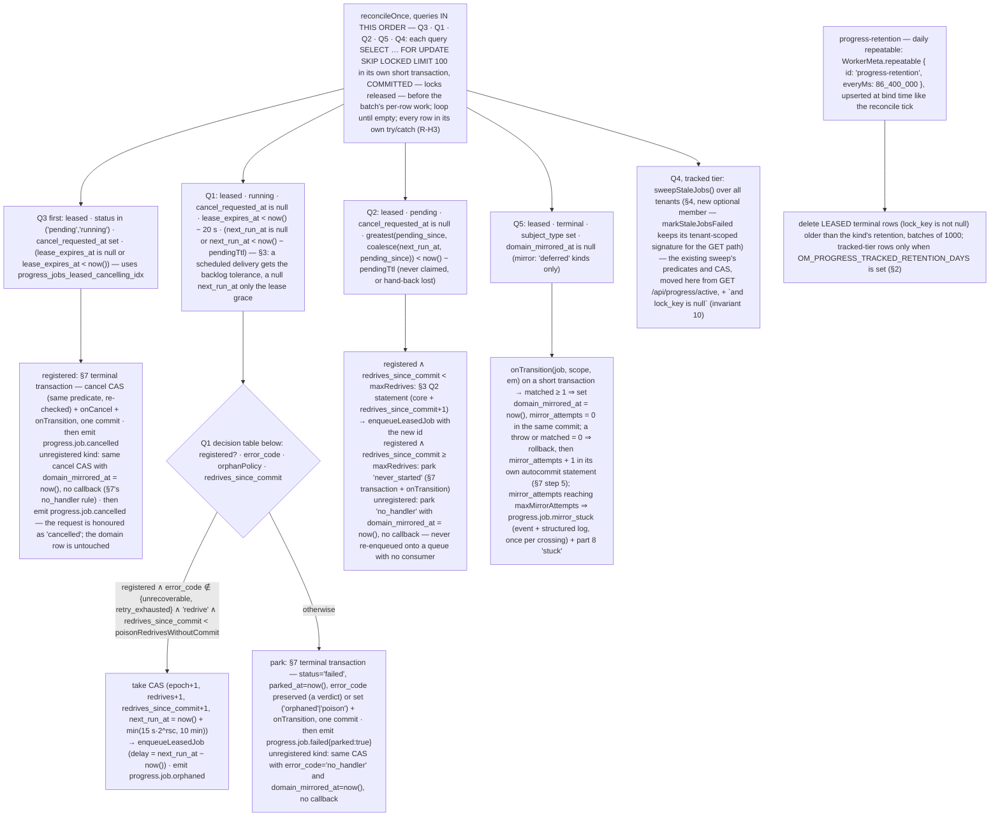

# Background work, part 6 — leased jobs in `progress`

**Date**: 2026-08-21
**Status**: Draft v1.2 — implementation spec split out of part 4 v3 (§5.3–5.7, Phase 1), revised for the terminal-transition finding of the PR #5450 review (v1), the way out of `parked` (v1.1) and the domain side of the re-drive plus the durable mirror counter (v1.2). Awaiting review; blocked on part 4 decisions 1–3. Depends on part 5; blocks parts 7 and 8.
**Series**: [part 1](./2026-08-21-background-work-01-data-sync-problems.md) — `data_sync` problems (D-n) · [part 2](./2026-08-21-background-work-02-sibling-modules-problems.md) — sibling modules (Q/P/W/S/… ids) · [part 3](./2026-08-21-background-work-03-common-problems-and-requirements.md) — classes C-1…C-14, requirements R-A…R-M, open decisions Δ-1…Δ-11 · [part 4](./2026-08-21-background-work-04-solution.md) — options, decision, shared invariants · [part 5](./2026-08-21-background-work-05-queue-transport-contract.md) — queue transport contract · [part 6](./2026-08-21-background-work-06-leased-jobs-in-progress.md) — leased tier in `progress` · [part 7](./2026-08-21-background-work-07-data-sync-adoption.md) — `data_sync` adoption · [part 8](./2026-08-21-background-work-08-operator-surface.md) — operator surface.
**Scope of this spec**: the leased tier of the `progress` module — additive schema, lease and transition SQL, the service API and kind registry, `runSlice`, the reconciler and retention workers, the terminal-transition protocol, cancellation semantics, the re-drive route and DTO fields. Inert until a kind registers. Vocabulary and invariants are part 4 §5.1–5.2 and are not restated; "invariant n" below refers to them.

## 📝 TLDR

A `progress_jobs` row whose `kind` is registered becomes a **leased job**: it carries a lease (`lease_owner`, `lease_epoch`, `lease_expires_at`) on the database clock, a single-runner `lock_key` enforced by a partial unique index, a delivery identity `(continuation_seq, redrives)` that refuses stale deliveries, and budgets that reset only on committed progress. A worker runs it as a chain of bounded slices (`runSlice`), each under one lease, yielding on budget or SIGTERM through the transport's hand-back (part 5). A worker-side reconciler on a transport repeatable repairs orphans, lost hand-backs, dead cancels and — new in this version — unmirrored terminal states. **Every terminal transition (complete, fail, park, cancel) commits in one transaction with the kind's domain mirror**, so a generic job record and its domain record can never disagree for longer than one reconciler tick; kinds whose domain row lives outside the app database opt into a deferred, reconciler-retried mirror instead.

## 📝 §1 Problem Statement

Part 3 classes C-1…C-14 as they apply to `progress` (P-3, P-4, P-5, P-24, P-30, P-34) and to every adopter; part 4 §4 chose this module as the home. The v3 design had one hole the review found: `runSlice` and the reconciler performed the terminal CAS *first* and called `onTransition` *after*, so a crash or a throwing callback between the two left a terminal `progress_jobs` row beside a `running` domain row that no reconciler query ever selected again — exactly the divergence R-B2/R-E3 exist to prevent. §7 closes it.

## 📝 §2 Data model

Additive migration on `progress_jobs` (category 8, ADDITIVE-ONLY). No column is dropped, renamed or retyped; no existing default changes. Expression indexes are declared with MikroORM's `@Index({ expression })` (precedent: `customer_interactions_email_dedupe_uq`, `warranty_claims_external_ref_unique`).

```sql
alter table progress_jobs
  add column lease_owner          text null,
  add column lease_epoch          bigint not null default 0,
  add column lease_expires_at     timestamptz null,
  add column lock_key             text null,              -- non-null ⇔ leased tier; single-runner key
  add column queue_name           text null,
  add column queue_job_id         text null,              -- last enqueued delivery id (pj-<id>-<seq>-<redrives>); for removeJob
  add column subject_type         text null,              -- 'data_sync.run'
  add column subject_id           text null,
  add column continuation_seq     int  not null default 0,
  add column redrives             int  not null default 0,   -- monotone; part of the delivery identity
  add column redrives_since_commit int not null default 0,   -- budget; reset by a committed heartbeat (HOT)
  add column interruptions        int  not null default 0,
  add column consecutive_failures int  not null default 0,
  add column pending_since        timestamptz null,       -- set on create, yield and take; the reconciler's pending clock
  add column next_run_at          timestamptz null,       -- when the next transport delivery becomes AVAILABLE (failSlice retry, Q1/Q2/operator re-drive); null ⇔ no delivery is scheduled (§3); cleared by claim — the claim consumes the delivery (§3); not the deferred timer feature
  add column last_committed_at    timestamptz null,
  add column parked_at            timestamptz null,
  add column error_code           text null,              -- park reasons 'orphaned' | 'poison' | 'never_started' | 'no_handler'; slice verdicts 'unrecoverable' | 'retry_exhausted' (§5 step 4); owner codes
  add column domain_mirrored_at   timestamptz null,       -- set when the kind's onTransition committed for the terminal state AND its fenced UPDATE matched the domain row (§7); null on a terminal leased row ⇒ Q5 retries the mirror
  add column mirror_attempts      int  not null default 0;   -- failed domain-mirror attempts since the last successful terminal commit (§7 step 5); written in its own autocommit statement, never inside the rolled-back transaction; mirror_stuck ⇔ mirror_attempts >= maxMirrorAttempts

alter table progress_jobs set (fillfactor = 80);

-- single-runner: at most one live operation per key per tenant/org (R-D1). NULL org is constrained (zero-uuid), unlike the
-- warranty_claims precedent; PG15 NULLS NOT DISTINCT was considered and rejected to keep PG14 support.
create unique index progress_jobs_one_live_per_lock_key
  on progress_jobs (lock_key, tenant_id, coalesce(organization_id, '00000000-0000-0000-0000-000000000000'::uuid))
  where lock_key is not null and status in ('pending','running');

-- reconciler scans: predicates exclude every heartbeat-written column (invariant 6). Q1 below filters lease_expires_at
-- inside this bounded set (a scan of live leased rows every tick; acceptable to ~10k live rows — see §6 cost note).
create index progress_jobs_leased_running_idx on progress_jobs (tenant_id) where status = 'running' and lock_key is not null;
create index progress_jobs_leased_pending_idx on progress_jobs (pending_since) where status = 'pending' and lock_key is not null;
create index progress_jobs_subject_idx       on progress_jobs (subject_type, subject_id) where subject_type is not null;
create index progress_jobs_retention_idx     on progress_jobs (finished_at) where status in ('completed','failed','cancelled');
create index progress_jobs_mirror_pending_idx on progress_jobs (finished_at) where lock_key is not null and subject_type is not null
  and status in ('completed','failed','cancelled') and domain_mirrored_at is null;   -- Q5: terminal rows whose domain mirror has not committed
create index progress_jobs_leased_cancelling_idx on progress_jobs (cancel_requested_at) where lock_key is not null
  and cancel_requested_at is not null and status in ('pending','running');           -- Q3: live leased rows with a cancel request; terminal rows never match (§6)
```

Down-migration: drop the seven indexes and the twenty columns, reset `fillfactor`. Data in the new columns is discarded; the tracked tier is unaffected. Backfill: `update progress_jobs set domain_mirrored_at = finished_at where status in ('completed','failed','cancelled')` — one statement, no branch: `subject_type` is added by the same ALTER, so every pre-existing row has no subject and nothing for Q5 to mirror.

- The existing `progress_jobs_status_tenant_idx` stays. `heartbeat_at` stays unindexed; so does `mirror_attempts` (it is read by part 8's "stuck" derivation inside the bounded leased set, never as a scan key).
- `meta` keeps today's rule (display-only, no credentials); `error_message` goes through the integration-log redaction.
- Per-kind configuration lives in the **registry**, not in columns.
- `ProgressJobStatus` is unchanged. Retention (§6) is **scoped to the leased tier in phase 1** (`lock_key is not null`): nothing purges tracked-tier rows today (P-30) and invariant 10 promises those rows behave exactly as today, so tracked-tier retention is opt-in through `OM_PROGRESS_TRACKED_RETENTION_DAYS` (unset ⇒ no deletion, today's behaviour; set ⇒ the same worker deletes tracked terminal rows older than that many days, declared in the compat table and UPGRADE_NOTES). Retention never deletes a terminal row whose `domain_mirrored_at` is null and `subject_type` is set — the mirror must land first. A park for an **unregistered kind** (`error_code = 'no_handler'`) — and Q3's cancel of a cancel-requested row of one (§6) — has no mirror to run, so its CAS sets `domain_mirrored_at = now()` itself ("no domain mirror" is a *satisfied* mirror, not a pending one) and the row is collected by retention like any other terminal row (§9, test 11). The Q6 follow-up will add `waiting`, `run_after` and full parent/child semantics; `next_run_at` and `pending_since` are intentionally narrower so that follow-up does not re-audit the claim predicate.
- `sync_runs` gains nothing here (part 7): `progress_job_id` already exists and is the link, `last_error` is its error column, and it has no finished timestamp — the operation's `progress_jobs.finished_at` is the one, reachable through `progress_job_id`.
- `ProgressJobDto` (list/active/SSE) gains optional `cancelRequestedAt`, `parkedAt`, `errorCode`, `mirrorAttempts`, `leaseOwner`, `leaseEpoch`, `nextRunAt` and two server-derived booleans, `redrivable` and `stuck` (category 2, additive), so the UI can render "cancelling", "parked" and "stuck" (the client cannot see the kind's `maxMirrorAttempts`, the reconciler grace or `pendingTtl`, so both derivations are the server's: `stuck` = leased ∧ (`running` ∧ `lease_expires_at < now() − grace` ∧ (`next_run_at is null` ∨ `next_run_at < now() − pendingTtl`) ∨ `mirror_attempts >= maxMirrorAttempts`) — the `next_run_at` clause uses Q1's backlog tolerance (§3, §6), not the lease grace, because a non-null `next_run_at` means a delivery is scheduled and its pickup may wait a queue backlog behind it), show the last lease owner and epoch for support, and enable **Re-drive** from exactly the predicate of the §3 `redrive` statement rather than guessing from status.

## 📝 §3 Lease semantics

Each statement is one autocommit transaction on a forked EM (part 4 invariant 1) — except the terminal transitions, which run inside the terminal transaction of §7 together with the domain mirror, and the operator `redrive`, which runs inside one short transaction together with the domain *re-open* (`onRedrive`) — the same invariant 11 in the other direction.

```sql
-- claim(jobId, owner, scope, { seq, redrives })
update progress_jobs
   set status = 'running', lease_owner = $owner, lease_epoch = lease_epoch + 1,
       lease_expires_at = now() + $ttl, heartbeat_at = now(), pending_since = null,
       next_run_at = null,
       started_at = coalesce(started_at, now()), updated_at = now()
 where id = $id and tenant_id = $tenant and (organization_id = $org or ($org is null and organization_id is null))
   and lock_key is not null
   and status in ('pending','running')                                                        -- parked rows are never claimed directly: the operator re-drive below moves them to 'pending' first
   and continuation_seq = $seq and redrives = $redrives
   and (lease_expires_at is null or lease_expires_at < now())
 returning *;                                      -- claim reads NO scheduled time: next_run_at is written on the DB clock but every delivery that carries one is
                                                   -- scheduled by the TRANSPORT's clock (failSlice → BullMQ/local retry delay; the Q1 take → enqueueLeasedJob delay),
                                                   -- so a "next_run_at <= now()" clause would refuse a retry that arrives a few ms early and lose it for good.
                                                   -- Stale deliveries are refused by identity alone (invariant 5); next_run_at guards the reconciler, the operator
                                                   -- redrive and the DTO (§6, §3 (b), §2) — never the transport's own delivery.
                                                   -- CLAIM WRITES next_run_at = null: the delivery it accepts IS the scheduled one, consumed by this statement, so
                                                   -- "null ⇔ no delivery is scheduled" holds from the claim on (writing null reads no clock — the two-clock rationale
                                                   -- above is untouched). Without this clause a driver SIGKILLed mid-slice would leave the consumed delivery's
                                                   -- timestamp on the row, and Q1, the operator redrive predicate and the DTO's stuck/redrivable would all wait out
                                                   -- the 15-min pendingTtl for a delivery no broker holds — instead of the ≈ 2-min lease-grace repair §9 S3 promises
                                                   -- (part 4 invariant 8; §9 "SIGKILL after a claim" row; test 9j). failSlice/releaseLease re-set the column when a
                                                   -- further delivery IS scheduled, so the retry chains of §5 steps 1b/4 are unaffected.
                                                   -- FIRST CLAIM EMITS `progress.job.started`: the RETURNING row shows `started_at = now()` exactly when this statement
                                                   -- set it (now() is statement-frozen; an earlier claim wrote an earlier timestamp), and claim emits the event — same id
                                                   -- and payload as the tracked tier's startJobViaCas — AFTER the autocommit statement returns, on the pending → running
                                                   -- transition only. Later claims of the same row emit nothing. Without this no leased row would ever emit `started`,
                                                   -- which the data_sync run detail page and useProgressSse subscribe to (compat table).

-- heartbeatLease(lease, { processedCount?, totalCount?, committed? })   -- HOT: no indexed column
update progress_jobs
   set lease_expires_at = now() + $ttl, heartbeat_at = now(),
       processed_count = coalesce($p, processed_count), total_count = coalesce($t, total_count),
       consecutive_failures  = case when $committed then 0 else consecutive_failures end,
       redrives_since_commit = case when $committed then 0 else redrives_since_commit end,
       last_committed_at     = case when $committed then now() else last_committed_at end
 where id = $id and status = 'running' and lease_owner = $owner and lease_epoch = $epoch
 returning cancel_requested_at;                    -- zero rows ⇒ lease lost or taken ⇒ abort the slice's signal.
                                                   -- No event inside the statement (HOT); when the patch carried processedCount/totalCount, runSlice's heartbeat wrapper
                                                   -- emits the throttled `progress.job.updated` AFTER it (§5 step 2), reusing the tracked tier's coalescing throttle —
                                                   -- otherwise leased counters would only ever reach the UI via the 5 s poll (compat table).

-- yieldSlice(lease, { interrupted })               -- then hand the delivery back with the NEW seq in its payload (§5 step 4)
update progress_jobs
   set status = 'pending', continuation_seq = continuation_seq + 1,
       interruptions = interruptions + case when $interrupted then 1 else 0 end,
       lease_owner = null, lease_expires_at = now(), pending_since = now(), updated_at = now()
 where id = $id and status = 'running' and lease_owner = $owner and lease_epoch = $epoch
 returning continuation_seq, redrives;

-- failSlice(lease, error, { nextAttemptDelayMs, unrecoverable? })   -- slice threw; stay 'running', release the lease, same (seq, redrives) for the transport retry;
--                                                  nextAttemptDelayMs = the delay until the transport's next attempt (from kind.retry — attempts/backoff, §4 — and
--                                                  ctx.attemptNumber: attempt n of N ⇒ min(delay · 2^(n−1), maxDelay) ms), or NULL when no further transport delivery is
--                                                  coming (attempts exhausted, or the error is QueueUnrecoverableError). The delay is a duration, never a worker-clock Date:
--                                                  next_run_at is computed as now() + the delay ON THE DB CLOCK inside the statement (invariant 1 — a worker 5 min ahead of
--                                                  Postgres would otherwise push every Q1/redrive/DTO predicate 5 min out). next_run_at = null ⇔ nothing is scheduled, so
--                                                  Q1 acts on the lease grace alone instead of waiting out the pendingTtl backlog tolerance (see the Q1 take below).
--                                                  THE VERDICT IS DECIDED INSIDE THIS STATEMENT, from the row's CURRENT counter — never from a claim-time snapshot:
--                                                  a committed heartbeat earlier in this same slice reset consecutive_failures to 0 (part 4 §5.1 — a committed unit resets
--                                                  the budget), and the CASE below sees that reset, so a slice that committed progress cannot be failed terminally on a
--                                                  stale count. error_code = 'unrecoverable' when the caller flags QueueUnrecoverableError; 'retry_exhausted' when the
--                                                  increment this statement performs reaches kind.budget.maxConsecutiveFailures ($max); else the owner's $code. The verdict
--                                                  travels back in the RETURNING and is written HERE, in this autocommit statement, BEFORE the terminal transaction is
--                                                  attempted (§5 step 4), so the row carries it for Q1 even if that transaction never commits.
update progress_jobs
   set lease_owner = null, lease_expires_at = now(),
       next_run_at = case when $delayMs is null then null else now() + $delayMs * interval '1 millisecond' end,
       consecutive_failures = consecutive_failures + 1,
       error_message = $msg,
       error_code = case when $unrecoverable then 'unrecoverable'
                         when consecutive_failures + 1 >= $max then 'retry_exhausted'
                         else $code end,
       updated_at = now()
 where id = $id and status = 'running' and lease_owner = $owner and lease_epoch = $epoch
 returning consecutive_failures, error_code;       -- zero rows ⇒ lease lost or taken ⇒ the delivery ends quietly (§5 step 4, "fence refused");
                                                   -- error_code ∈ {unrecoverable, retry_exhausted} ⇒ the verdict runSlice acts on (§5 step 4)

-- releaseLease(lease, { nextAttemptDelayMs })      -- release WITHOUT counting anything: used when a terminal transaction rolled back while this delivery still held the
--                                                  lease — the §5 step 1b retry (claim re-acquired the lease; failSlice never ran on this delivery) and the cancelled-branch
--                                                  rollback (§5 step 4 — a mirror failure is not a slice failure, so consecutive_failures must not move, and
--                                                  cancel_requested_at must survive for Q3). Touches no counter, no error column, no cancel flag; same null convention
--                                                  for the delay as failSlice. The §7 step-5 statement counts the rollback in mirror_attempts separately.
update progress_jobs
   set lease_owner = null, lease_expires_at = now(),
       next_run_at = case when $delayMs is null then null else now() + $delayMs * interval '1 millisecond' end,
       updated_at = now()
 where id = $id and status = 'running' and lease_owner = $owner and lease_epoch = $epoch
 returning *;                                      -- zero rows ⇒ lease lost or taken ⇒ nothing to release; the delivery ends quietly either way

-- THE RE-DRIVE FAMILY. Three statements share one core — the "re-drive core" below — and differ only in the rows of the table that follows:
--   core: status = 'pending', lease_owner = null, lease_epoch = lease_epoch + 1, lease_expires_at = now(), redrives = redrives + 1,
--         pending_since = now(), updated_at = now()   … returning continuation_seq, redrives, tenant_id, organization_id
--   then enqueueLeasedJob with the new id pj-<id>-<seq>-<redrives> (never an id the transport may still hold — invariant 9, part 5's no-op add).

-- reconciler take (Q1 orphan):                     -- core + the orphan budget + backoff. TWO TOLERANCES, deliberately different: lease_expires_at is a DB-clock fact
--                                                  about a driver, so 20 s of grace suffices; next_run_at is when the TRANSPORT makes a delivery AVAILABLE, not when a
--                                                  worker picks it up — with concurrency 5 and ≤ 5-min slices a queued retry can wait minutes behind other runs — so a
--                                                  non-null next_run_at gets the same backlog tolerance as a pending row ($pendingTtl, §6 constraint). A grace-sized
--                                                  clause here would take a healthy row whose retry is merely queued, spend redrives_since_commit on it and park it
--                                                  poison after three busy periods. Rows with next_run_at NULL — every claimed slice that dies mid-run (claim nulled the
--                                                  column: the delivery it consumed is gone), and failSlice with no further delivery coming (attempts exhausted,
--                                                  unrecoverable) — are taken on the lease grace alone, so dead drivers and dead ends still park fast. A running row
--                                                  carries a non-null next_run_at only while its lease is RELEASED with a delivery scheduled — exactly two writers
--                                                  produce that state: the failSlice retry and releaseLease (this take's own backoff lands on a PENDING row — the
--                                                  core sets status = 'pending' — where Q2's pendingTtl covers it until the re-driven delivery's claim nulls it).
update progress_jobs
   set <core>, redrives_since_commit = redrives_since_commit + 1, next_run_at = now() + $backoff
 where id = $id and status = 'running' and lock_key is not null
   and lease_expires_at < now() - $grace and (next_run_at is null or next_run_at < now() - $pendingTtl)
   and cancel_requested_at is null                                                         -- a cancel-requested orphan belongs to Q3, which runs first (§6); Q1 never parks or re-drives it
   and (error_code is null or error_code not in ('unrecoverable','retry_exhausted'));      -- an orphan carrying a slice verdict is parked with the verdict, never re-driven (§6 Q1 table)

-- reconciler pending re-drive (Q2 never claimed / hand-back lost):   -- core + the orphan budget, no backoff
update progress_jobs
   set <core>, redrives_since_commit = redrives_since_commit + 1, next_run_at = now()
 where id = $id and status = 'pending' and lock_key is not null
   and cancel_requested_at is null                                                         -- same rule as Q1: Q3 owns cancel-requested rows
   and greatest(pending_since, coalesce(next_run_at, pending_since)) < now() - $pendingTtl;

-- operator redrive(jobId, by) — the way OUT of 'failed' (parked or terminal) and the manual take of an expired lease.
-- One short transaction on a forked EM, three steps; the job row and the domain row leave the terminal state together, exactly as they entered it (§7):
--   (a) refuse when another live operation holds the key — the partial unique index would otherwise raise from inside the UPDATE:
select id from progress_jobs
 where lock_key = (select lock_key from progress_jobs
                    where id = $id and tenant_id = $tenant and (organization_id = $org or ($org is null and organization_id is null)))
   and tenant_id = $tenant
   and coalesce(organization_id, '00000000-0000-0000-0000-000000000000'::uuid) = coalesce($org, '00000000-0000-0000-0000-000000000000'::uuid)
   and status in ('pending','running') and id <> $id
 for update;                                        -- one row ⇒ return { refused: 'lock_key_held', heldBy: id } (HTTP 409, same shape as part 7's start-time 409);
                                                    -- the subselect is tenant/org-scoped too, so an id the caller cannot see yields no rows here and not_redrivable in (b)
--   (b) the CAS: core + BOTH budgets reset (the operator is explicitly asking for more attempts) + every terminal/parked marker cleared.
--       error_code is cleared even when it is a verdict ('unrecoverable' | 'retry_exhausted') — an operator re-drive is a deliberate override of the automatic policy (§5),
--       which is why the event in (d) records the previous code; error_message is kept until the next slice overwrites it. cancel_requested_at is cleared too:
--       a row that failed before its slice observed a cancel request would otherwise be cancelled by the re-driven slice's first heartbeat (§8) — the operator's
--       explicit re-drive supersedes the earlier, never-honoured request (Q3 never selects a failed row, §6, so no cancel is in flight for it).
update progress_jobs
   set <core>, redrives_since_commit = 0, consecutive_failures = 0, mirror_attempts = 0,
       parked_at = null, error_code = null, finished_at = null, domain_mirrored_at = null, cancel_requested_at = null, next_run_at = now()
 where id = $id and tenant_id = $tenant and (organization_id = $org or ($org is null and organization_id is null))
   and lock_key is not null
   and ((status = 'failed')                                                              -- parked (parked_at set) OR terminal failed (retry budget exhausted, unrecoverable)
     or (status = 'running' and lease_expires_at < now() - $grace
         and (next_run_at is null or next_run_at < now() - $pendingTtl)))               -- expired lease the operator does not want to wait a tick for — but never a slice still inside its transport backoff or the queue-backlog window behind a scheduled delivery (invariant 8; same clause as Q1)
 returning *;                                       -- zero rows ⇒ { refused: 'not_redrivable' } (completed and cancelled rows are never re-driven: start a new operation instead)
--   (c) the domain side, SAME transaction: kind.onRedrive?(job, scope, em) — the mirror image of onTransition; one fenced UPDATE that re-opens the
--       domain row (data_sync: failed → 'running', a still-pending run stays 'pending', last_error = null — part 7; a re-open never performs a
--       transition the kind's own slice is contracted to perform). It returns { matched }; matched = 0 (domain row deleted or
--       not in a state this job may re-open) ⇒ rollback, { refused: 'domain_refused' } (HTTP 409). A kind that declares onTransition without onRedrive is
--       rejected when the registry loads (a mirror with no way back, §4); a kind that is not registered in THIS process ⇒ not_redrivable (there is nothing to run it) —
--       which is why the registry is process-wide and loaded by the web process too (§4).
--   commit. A unique violation raised by (b) despite (a) — a concurrent start between the two statements — is caught and mapped to the same 409.
--   (d) after commit: enqueueLeasedJob(new id), emit progress.job.redriven { jobId, by: { userId }, previousStatus, previousErrorCode, redrives }
--       (clientBroadcast like every progress.job.* event; the structured-log event of the same name carries the same fields), then call the
--       kind's onAfterRedrive?(job, scope, container) (§4) — best-effort, at-most-once, in the process that ran the redrive (web or CLI).
-- redrive bumps redrives and the epoch like every other re-drive, and touches no other budget mechanism: interruptions stays (it is history, not a budget).

-- completeSlice / terminal fail / cancel: the existing CAS transitions, each extended with `and lease_epoch = $epoch` on the leased tier,
-- and each executed inside the §7 terminal transaction: CAS → onTransition(job, scope, em) → commit (atomic mode), or
-- CAS with domain_mirrored_at = null → commit → Q5 retries onTransition until it sets domain_mirrored_at (deferred mode).
-- A park for an unregistered kind (error_code = 'no_handler') has no mirror: its CAS sets domain_mirrored_at = now() directly (§2).
-- The slice-initiated terminal FAIL is fenced on the epoch alone — `status = 'running' and lease_epoch = $epoch` — because the fence must match both of its
-- callers' lease states: on the §5 step-4 path the failSlice verdict statement already released the lease (lease_owner is null), while on the §5 step 1b path the
-- retry's claim re-acquired it (lease_owner is the retry's owner). Q1 cannot take the row in between either way: a released lease sits inside the transport's
-- next_run_at window (backlog tolerance $pendingTtl) or, with next_run_at null, inside the 20 s grace the immediate terminal attempt beats.

-- THE TRACKED-TIER MEMBERS REFUSE LEASED ROWS. startJob, completeJob, failJob, markCancelled and the tracked branches of cancelJob and the
-- updateProgress/touchJobHeartbeat revive keep their CAS and gain `and lock_key is null`. On a leased row the CAS matches zero rows and each member
-- follows its existing zero-row path (return the row unchanged — progressServiceImpl.ts:293-296, 567-589 — no new error class). That is what makes
-- §7's "exactly one code path" true: the only statements that can write a terminal or running status on a leased row are claim, the §7
-- terminal transaction and the re-drive family above. Category 2/3 behaviour change on the leased tier only; declared in the compat table; test 9b.
```

The three re-drive statements, side by side (drift between them is a review-time diff of this table, not an incident):

| Statement | Predicate | `redrives_since_commit` | `consecutive_failures` | `next_run_at` | Markers cleared | Domain hook |
|---|---|---|---|---|---|---|
| Q1 take | `running` ∧ lease expired beyond grace ∧ transport retry passed ∧ `cancel_requested_at is null` ∧ `error_code ∉ {unrecoverable, retry_exhausted}` | `+1` (orphan budget) | unchanged (retry budget is the transport's) | `now() + backoff` (15 s · 2^rsc, ≤ 10 min) | none | none — the domain row is still open |
| Q2 pending re-drive | `pending` ∧ `cancel_requested_at is null` ∧ `greatest(pending_since, next_run_at) < now() − pendingTtl` | `+1` | unchanged | `now()` | none | none |
| operator `redrive` | `failed` (parked or terminal) ∨ `running` ∧ lease expired beyond grace ∧ transport retry passed; key not held (a) | `0` | `0` | `now()` | `parked_at`, `error_code` (incl. the verdicts), `finished_at`, `domain_mirrored_at`, `mirror_attempts`, `cancel_requested_at` | `onRedrive` in the same transaction; `matched = 0` ⇒ rollback + `domain_refused` |

All three share the core (`pending`, epoch + 1, `redrives` + 1, `pending_since = now()`) and the new-id enqueue; none resets `redrives` or `interruptions`. Only the operator statement clears `cancel_requested_at`: the two reconciler statements exclude such rows outright, because a cancel request on a dead or never-claimed row is Q3's to honour (§6), not a reason to re-drive or park it.

**Slice verdicts.** Two `error_code` values are written by `failSlice` when the slice has reached a conclusion the transport must not retry past: `unrecoverable` (the step threw `QueueUnrecoverableError`, flagged by the caller) and `retry_exhausted` (this failure is the `maxConsecutiveFailures`-th without a committed unit — decided by the `failSlice` statement itself, from the counter it increments, so a committed heartbeat that reset the counter mid-slice is honoured; no claim-time snapshot is consulted). A verdict is persisted *first*, in `failSlice`'s own autocommit statement, and only then is the §7 terminal transaction attempted (§5 step 4). If that transaction commits, the row is `failed` with the verdict as its `error_code`; if it cannot (mirror throws or `matched = 0`), the row is left `running`, lease released, verdict on the row — and Q1 row 2 parks it with the verdict preserved, the orphan policy never consulted, and the take CAS above refuses it. A delivery that claims a row already carrying a verdict runs no `step()` (§5 step 1b): it retries the terminal transaction and nothing else, and on a further rollback releases the lease it re-acquired (`releaseLease`) before rethrowing, so the next retry can claim. Park reasons (`orphaned`, `poison`, `never_started`, `no_handler`) are written by the reconciler; verdicts by the slice; the operator `redrive` clears either.

Why `redrive` resets both budgets but never `redrives`: the budgets are the operator's to reset (they are explicitly asking for more attempts, and a row that exhausted `consecutive_failures` would otherwise be one throw from failing again); the identity is not, because a retained transport job or a straggling delivery may still carry the old pair (invariants 5 and 9). Why any `failed` leased row is re-drivable, not only a parked one: the retry budget (S2 in part 7) and the orphan budget end a row in `failed` by different paths, and an operator has the same reason to retry either — a dead end would force a fresh operation under a new `lock_key` holder with no continuity of cursor or history. `completed` and `cancelled` are not re-drivable by design: the first is done, the second was asked for. Why `claim` has no parked branch any more (v1 had one): the `status in ('pending','running')` predicate refuses any delivery for a `failed` row, whatever identity it carries. That is the argument, not "no delivery can exist" — Q2 is the counterexample: its last re-drive's delivery may still be queued when the row is parked `never_started`, carrying exactly the `(seq, redrives)` the parked row holds, and it *will* be delivered. This is a deliberate behaviour choice: a `never_started` park discards a delivery the transport was about to run (v1 would have let it through); the operator `redrive` is the only door, and it issues a new identity.

Why identity and budget are separate counters: if `redrives` could reset to 0, a transport retry holding an old `(seq, 0)` could become claimable again after a later driver committed (the reviewed interleaving: fail → take → re-drive claims → commit resets → old retry claims and fences the live driver). A monotone `redrives` closes it; `redrives_since_commit` carries the budget that must reset on progress (R-B3). Why there is no same-owner clause: a stalled redelivery to the *same* process should be refused while its sibling heartbeats, exactly like any other process; a dead process never matches because `owner` includes a per-process-start random. Why `claim` no longer admits `'failed'` at all: `progress` already allows `failed → running` (queue retries, stale revive) on the tracked tier; on the leased tier that door is closed — a genuinely failed operation is never resurrected by a late delivery, and a failed one (parked or terminal) leaves `failed` only through the operator `redrive` statement, which moves it to `pending` under a new delivery identity and re-opens the domain row in the same transaction.

## 📝 §4 Service API and the kind registry

Additive members on `ProgressService` (category 2/3, STABLE: optional methods, precedent `touchJobHeartbeat?`). The lease and lifecycle members take `scope`; the registry accessors (`registerJobKind`, `getJobKind` — process-wide), `sweepStaleJobs` (all tenants) and `reconcileOnce` (system scope) do not.

```ts
export type Lease = { jobId: string; owner: string; epoch: number; ttlMs: number }   // no worker-clock expiry is exposed
export type SliceOutcome = 'drained' | 'budget' | 'cancelled'
export type OrphanPolicy = 'redrive' | 'park'

export interface LeasedJobKind {
  queue: string
  requiredFeatures: string[]                         // who may RE-DRIVE via POST /api/progress/jobs/[id]/redrive, in addition to progress.update. Cancel is NOT gated on this
                                                     // (DELETE /api/progress/jobs/[id] keeps progress.cancel alone — a FROZEN ACL surface, unchanged)
  lease?: { ttlMs?: number; sliceBudgetMs?: number; pendingTtlMs?: number }           // 60 000 · 300 000 · 900 000
  /** Both caps read the SAME column, redrives_since_commit (reset by a committed heartbeat); they bind different reconciler queries:
   *  poisonRedrivesWithoutCommit (3) is Q1's cap — an orphan re-driven this many times without a committed unit is poison;
   *  maxRedrives (10) is Q2's cap — a row whose hand-back/enqueue was lost this many times without a commit is parked never_started
   *  (a lost hand-back is cheap and not evidence of poison, hence the larger budget). maxConsecutiveFailures (5) reads consecutive_failures
   *  (the transport-retry budget) and is applied INSIDE the failSlice statement (§3): when the increment it performs reaches the cap — on the
   *  row's current counter, which a committed heartbeat in the same slice may have reset — the statement writes the verdict 'retry_exhausted',
   *  returns it, and runSlice runs the §7 terminal fail (§5 step 4). The identity counter `redrives` is bounded by nothing (invariant 5). */
  budget?: { maxRedrives?: number; maxConsecutiveFailures?: number; poisonRedrivesWithoutCommit?: number }   // 10 · 5 · 3
  /** Transport retry policy for every delivery of this kind — mapped 1:1 to part 5's EnqueueOptions on every enqueueLeasedJob, and read by
   *  runSlice together with ctx.attemptNumber to compute failSlice's nextAttemptDelayMs (attempt n of N ⇒ min(delay · 2^(n−1), maxDelay) ms;
   *  n = N ⇒ null — no further delivery is coming). The delay is written onto the DB clock inside the failSlice statement (§3). */
  retry?: { attempts?: number; backoff?: { type: 'exponential' | 'fixed'; delay: number; maxDelay?: number } }   // 5 · exponential 5 000 · max 300 000
  orphanPolicy?: OrphanPolicy                        // default 'park' (Solid Queue's stance); idempotent kinds declare 'redrive'
  retention?: { completedDays?: number; failedDays?: number }                           // 7 · 30
  /** One slice under a held lease. Return when `signal` aborts or the budget elapses. */
  step(ctx: {
    job: ProgressJob; scope: ProgressServiceContext; lease: Lease
    signal: AbortSignal
    heartbeat: (patch?: { processedCount?: number; totalCount?: number | null; committed?: boolean }) => Promise<void>
    budgetMs: number
    idempotencyKey: string                           // `${jobId}:${continuation_seq}` — forward to external side effects and commands
    container: AppContainer
  }): Promise<SliceOutcome>
  /** Mirror a terminal transition (completed | failed incl. parked | cancelled) onto the domain row (data_sync: sync_runs.status).
   *  Called INSIDE the terminal transaction with its EntityManager (mirror: 'atomic', default) — a throw rolls the terminal CAS back —
   *  or after it, retried by the reconciler's Q5 until it resolves (mirror: 'deferred'). MUST be idempotent: it may run more than once
   *  for the same terminal state, and it must not emit events or enqueue work (that is `onAfterTransition`'s job, below).
   *  MUST return how many domain rows its fenced UPDATE matched: `matched = 0` is a mismatch (the domain row is gone or already terminal by
   *  another path) and is treated exactly like a throw — §7 step 3 never records `domain_mirrored_at` for it. "Mirrored" means
   *  "the domain row agrees", not "the callback ran". */
  onTransition?(job: ProgressJob, scope: ProgressServiceContext, em: EntityManager): Promise<{ matched: number }>
  /** Optional pre-terminal hook for cancel (release external resources). Same transaction and the same idempotency rule as onTransition. */
  onCancel?(job: ProgressJob, scope: ProgressServiceContext, em: EntityManager): Promise<void>
  /** Re-open the domain row when an operator re-drives a failed (parked or terminal) or lease-expired job — the mirror image of
   *  onTransition, with the same contract: called INSIDE the §3 redrive transaction with its EntityManager, idempotent (a row that is
   *  already open matches and changes nothing), one fenced UPDATE, no events/enqueue/HTTP, returns { matched }. `matched = 0` rolls the
   *  redrive back and the route answers 409 `domain_refused`. It re-opens; it never performs a domain transition the kind's own slice is
   *  contracted to perform (part 7: `pending → running` stays the engine's — the once-per-run cadence of the domain `started` event
   *  depends on it). Required whenever `onTransition` is declared — the registry load (and `registerJobKind`) throws otherwise. */
  onRedrive?(job: ProgressJob, scope: ProgressServiceContext, em: EntityManager): Promise<{ matched: number }>
  /** THE AFTER-COMMIT HOOKS (the primitives §7 step 4 and the §3 redrive step (d) run — there is no other "emitAfterCommit" mechanism).
   *  onAfterTransition runs once per COMMITTED terminal transition (completed | failed incl. parked | cancelled — read job.status/error_code),
   *  after the progress.job.* event, in whichever process committed the transaction: a worker slice (completeSlice/failSliceTerminal), the
   *  reconciler worker (Q1/Q2 parks, Q3 cancels, Q5 deferred mirrors), or the web process (the §8 pending-path cancel) — all three hold the
   *  process-wide registry (§4), so the hook always resolves; it receives that process's container. onAfterRedrive is the same for a committed
   *  operator redrive, after progress.job.redriven. Both are best-effort and at-most-once, exactly like the events beside them (part 4
   *  outbox/inbox section): a throw is logged, never retried, and never affects the committed row. Domain events, integration-state upserts
   *  and log writes belong here (part 7), never inside onTransition/onRedrive. */
  onAfterTransition?(job: ProgressJob, scope: ProgressServiceContext, container: AppContainer): Promise<void>
  onAfterRedrive?(job: ProgressJob, scope: ProgressServiceContext, container: AppContainer): Promise<void>
  mirror?: 'atomic' | 'deferred'                     // default 'atomic'; 'deferred' only for kinds whose domain row is outside the app DB
  maxMirrorAttempts?: number                         // default 20 failed mirror attempts (§7 step 5) before progress.job.mirror_stuck
}

/** THE KIND REGISTRY IS PROCESS-WIDE, NOT PER REQUEST. progressService is constructed per container (`progress/di.ts` resolves
 *  createProgressService(em, eventBus) on every resolve), so a registration method on it would be invisible to the next request.
 *  Kinds are declared in an auto-discovered module file, `<module>/job-kinds.ts` (export `jobKinds: LeasedJobKindDefinition[]`, where a
 *  definition is LeasedJobKind & { kind: string }), collected by `yarn generate` into the module registry exactly like `ai-tools.ts`, and
 *  loaded into one process-wide Map (`progress/lib/job-kinds.ts`) the first time any process — Next.js web, `mercato queue worker`, CLI — builds a
 *  container. Validation (a kind declaring onTransition without onRedrive; a duplicate kind id) throws at that load, in every process, before
 *  any row exists. The web process therefore answers redrive/cancel with the real hooks and features; the worker additionally binds runSlice to
 *  each kind's queue at boot (refused when part 5's capabilities are missing — the kind stays registered, its queue simply has no consumer).
 *  `registerJobKind` below writes the same Map and exists for tests and for kinds created at runtime; it is not how modules register. */
export interface ProgressService {
  // …existing members unchanged…
  registerJobKind?(kind: string, handler: LeasedJobKind): void          // programmatic path into the process-wide registry (tests); modules use job-kinds.ts
  getJobKind?(kind: string): LeasedJobKind | undefined                  // read side, used by the routes, cancelJob, enqueueLeasedJob and part 8's redrivable/stuck derivation
  /** Inserts the row on the given EM (the caller's transaction) and returns it with a deferred `emitCreated()`; the
   *  `progress.job.created` event is NOT emitted inside the transaction (R-E3). Worker/CLI scope: pass a forked EM.
   *  The input OMITS `jobType` and `cancellable`: the row's `job_type` IS the kind (part 4 §5.1 — never caller-supplied) and
   *  `cancellable` is FORCED true — `cancelJob` is the only cancel entry point for a leased row (§8) and its existing
   *  `!job.cancellable` throw (progressServiceImpl.ts:512-513) would otherwise leave a `cancellable: false` leased row with no
   *  documented way to stop it (part 7's cancel route depends on this). */
  createLeasedJob?(input: Omit<CreateProgressJobInput, 'jobType' | 'cancellable'> & { kind: string; lockKey: string; subject?: { type: string; id: string } },
                   ctx: ProgressServiceContext, em: EntityManager): Promise<{ job: ProgressJob; emitCreated: () => Promise<void> }>
  enqueueLeasedJob?(jobId: string, ctx: ProgressServiceContext): Promise<void>   // id pj-<id>-<seq>-<redrives>; delay = max(0, next_run_at − now()); attempts/backoff from kind.retry; stores queue_job_id
  claim?(jobId: string, ctx: ProgressServiceContext, delivery: { seq: number; redrives: number }): Promise<{ lease: Lease; job: ProgressJob } | null>   // job = the claim statement's RETURNING row: what step() receives as ctx.job and what §5 step 1b reads error_code from — never a second read after the claim (a read outside the statement would race the fence)
  heartbeatLease?(lease: Lease, ctx: ProgressServiceContext, patch?: {...}): Promise<{ cancelRequested: boolean } | null>
  yieldSlice?(lease: Lease, ctx: ProgressServiceContext, opts: { interrupted: boolean }): Promise<{ seq: number; redrives: number } | null>
  completeSlice?(lease: Lease, ctx: ProgressServiceContext, input?: CompleteJobInput): Promise<ProgressJob | null>   // runs the §7 terminal transaction; null ⇔ the CAS matched zero rows (fence refused — end quietly, §5 step 4); a mirror rollback THROWS after the §7 step-5 mirror_attempts bump, so the two outcomes are never conflated
  failSlice?(lease: Lease, ctx: ProgressServiceContext, error: { message: string; code?: string }, opts: { nextAttemptDelayMs: number | null; unrecoverable?: boolean }): Promise<{ consecutiveFailures: number; verdict: 'unrecoverable' | 'retry_exhausted' | null } | null>   // the §3 non-terminal statement; the delay is written onto the DB clock in the statement (null ⇒ next_run_at null: no further delivery); the verdict is DECIDED in the statement (unrecoverable flag, or the incremented counter reaching kind.budget.maxConsecutiveFailures) and returned from its RETURNING error_code; null when the fence refused
  failSliceTerminal?(lease: Lease, ctx: ProgressServiceContext, verdict: 'unrecoverable' | 'retry_exhausted'): Promise<ProgressJob | null>   // the §7 terminal fail fenced on `status = 'running' and lease_epoch = $epoch` (matches both callers' lease states, §3); null ⇔ the CAS matched zero rows (lease lost/taken — end quietly); a rollback (mirror throw or matched = 0) THROWS after the mirror_attempts bump — §5 step 4/1b decide what to release and rethrow. One return value per outcome; the v1.2 draft's single null for both was undecidable
  releaseLease?(lease: Lease, ctx: ProgressServiceContext, opts: { nextAttemptDelayMs: number | null }): Promise<ProgressJob | null>   // the §3 release-only statement (no counters, no error columns, cancel_requested_at untouched); used after a terminal rollback on the §5 step 1b and cancelled paths; null when the fence refused
  sweepStaleJobs?(opts?: { timeoutSeconds?: number; batchSize?: number }): Promise<number>   // the tracked-tier sweep over ALL tenants for the worker tick (§6 Q4): the same per-row CAS as markStaleJobsFailed, `lock_key is null` included, no tenant filter; markStaleJobsFailed(tenantId, …) keeps its signature for the GET path
  redrive?(jobId: string, ctx: ProgressServiceContext, by: { userId?: string | null }): Promise<ProgressJob | { refused: 'lock_key_held' | 'not_redrivable' | 'domain_refused'; heldBy?: string }>   // operator: any failed (parked or terminal) or expired-lease leased row whose kind is registered; the §3 redrive transaction (own predicate — NOT the take CAS) + onRedrive in the same transaction; resets both budgets, bumps redrives + epoch so the new id never collides with a retained failed job; `by` is recorded on the progress.job.redriven event; 409 with the refusal code otherwise
  reconcileOnce?(opts?: { batchSize?: number }): Promise<ReconcileReport>   // system scope; used by the tick and by tests
}
```

`createLeasedJob(em)` is the single most important line for C-5 on the way *in*; the §7 terminal transaction is its counterpart on the way *out*. It: data_sync creates the progress job and the `sync_runs` row on the same request-scoped EM under `em.begin()` (both services resolve the same EM today: `progress/di.ts`, `shared/lib/di/container.ts`), commits, then calls `emitCreated()` and `enqueueLeasedJob`. A unique-index violation rolls both rows back with no phantom event. If the enqueue throws, the row is `pending` with `pending_since` set and the reconciler enqueues it (R-E2). Category 2/3 note: `onTransition`/`onCancel`/`onRedrive` take `em` and `onTransition`/`onRedrive` return `{ matched }` in their first published version, so no existing implementer is affected. **ACL.** The existing cancel route, `DELETE /api/progress/jobs/[id]`, is guarded by `progress.cancel` (`api/jobs/[id]/route.ts:12`, `acl.ts:20`) and requires no owner-module feature today; it stays exactly so — a leased row is cancelled by whoever may cancel progress jobs, and the kind's `requiredFeatures` are **not** added to it (that would remove cancel from every role holding `progress.cancel` without `data_sync.run`, a tightening on a FROZEN surface). The new `POST /api/progress/jobs/[id]/redrive` requires `progress.update` **and** the kind's `requiredFeatures` (re-driving a sync needs `data_sync.run`, because it restarts domain work). It answers 200 with the row, or 409 `{ refused, heldBy? }` with one of the three codes; the acting user is the route's session user and is carried as `by` into the `progress.job.redriven` event — the only record of who re-drove, which matters most when `previousErrorCode` was `unrecoverable`.

## 📝 §5 `runSlice` (the worker body)

`runSlice(payload, ctx)` is registered once per queue a kind declares (the `progress` module ships a worker factory; the owner's `workers/*.ts` is a one-liner binding the queue).

1. `claim` with `payload.seq/redrives` → `null` ⇒ return (the queue job completes; a `progress.leased.delivery_refused` structured-log event with the reason). A successful claim returns `{ lease, job }` (§4) — `job` is the claim statement's own RETURNING row: the row `step()` receives as `ctx.job` and the one step 1b inspects; nothing re-reads the row between the claim and the slice (a separate read would race the fence). `claim` reads no scheduled time (§3): a transport retry or a re-driven delivery that arrives a little before the DB clock reaches `next_run_at` is accepted — the transport already honoured the delay it was given — and the claim statement writes `next_run_at = null`: the scheduled delivery is now consumed, so a driver that dies from here on is judged by its lease alone (§3, invariant 8).
   1b. **Verdict already on the row** (`error_code ∈ {unrecoverable, retry_exhausted}` on the claimed row the claim returned — a transport retry of a slice whose terminal transaction could not commit): run **no** `step()`; start the heartbeat (step 2) and go straight to the terminal branch of step 4 (`failSliceTerminal` with the row's verdict). The page that produced the verdict is never re-executed. **On this path the claim re-acquired the lease and `failSlice` never runs**, so a rollback of the retried terminal transaction (which throws, §7 step 3) is followed by `releaseLease({ nextAttemptDelayMs })` — the delay from `kind.retry` and `ctx.attemptNumber` as in step 4.1, `null` on the last attempt — and then a rethrow of the mirror error, so the transport schedules the next retry of the terminal transaction. Without the release the row would sit `running` under a live 60 s lease, every remaining transport retry would be refused by `claim` (and complete the transport job, ending the chain), and the park would wait out lease expiry instead — the retry chain §9 "Domain mirror throws persistently" describes depends on this release. `consecutive_failures` is deliberately untouched here: on this path and on the `cancelled` rollback path (step 4) a mirror failure is counted by `mirror_attempts` (§7 step 5), never by the retry budget — unlike the `drained` path, where a mirror rollback is treated exactly like a `step()` throw and does go through `failSlice` (step 4; §9 "Domain mirror throws persistently" rests on that difference).
2. Start the heartbeat interval at `ttl/3` (20 s) on a forked EM. A `null` from `heartbeatLease` aborts `signal`; `cancelRequested: true` aborts `signal` and marks the slice as ending by cancel. When the heartbeat patch carried `processedCount`/`totalCount`, the wrapper emits the throttled `progress.job.updated` after the statement (§3) — the leased tier's only source of that event.
3. `ctx.signal` (transport: shutdown / lock loss) is chained into the same `signal` when the transport provides one (part 5: `signal` is an optional member populated by both in-repo strategies; a kind's worker is not bound at all when the capability is missing, so inside `runSlice` it is always present).
4. `await step()`. Then — **and on `null` from any fenced statement** (`yieldSlice`, `completeSlice`, `failSlice`, `releaseLease`, `failSliceTerminal` — for the terminal members `null` means exactly "the CAS matched zero rows"; a mirror rollback throws instead, §4/§7): the lease was lost or taken since the last heartbeat; the delivery **ends quietly** — stop the heartbeat, complete the transport job, log `progress.leased.lease_lost { jobId, seq, redrives, epoch }`, and call **nothing else**: no `ctx.yield` (the take already enqueued `pj-<id>-<seq>-<redrives+1>`, and a hand-back would redeliver a refused identity), no `enqueueLeasedJob` (the slice no longer owns a `seq`), no `failSlice` (zero rows anyway), no rethrow (a rethrow costs a transport attempt and redelivers an identity `claim` refuses). The new driver owns the row; the old delivery is history.
   - `drained` → `completeSlice`, which runs the §7 terminal transaction (CAS + `onTransition` in one commit). A throw from the mirror (or `matched = 0`) rolls the CAS back, is counted by §7 step 5 (`mirror_attempts + 1` in its own autocommit statement) and surfaces as a throw from `completeSlice` (never as `null`, which is the refused-fence outcome); `runSlice` then treats it exactly like a `step()` throw (the throw bullet): `failSlice` + rethrow, so the transport retries the slice; `step()` re-runs, finds nothing to do, returns `drained` again and the terminal transaction is retried.
   - `budget`, or `signal` aborted by shutdown/lease loss → `yieldSlice({ interrupted })` returning `{ seq, redrives }` → **`ctx.yield({ data: { …payload, seq, redrives } })`**: the transport rewrites the stored payload *before* handing the job back (BullMQ: `job.updateData()` then `moveToDelayed(now, token)` + throw `DelayedError`, which the processor must let propagate; local: rewrite the stored job and mark this delivery finished without touching `attemptCount`). Where the transport lacks `yield`, **or the native `ctx.yield` rejects** (BullMQ: `moveToDelayed(token)` after the lock was lost or the job was already completed by a refused stalled redelivery — S3, part 5's "yield after the lock is already lost" row), `enqueueLeasedJob` for the new `seq` is used instead: the `yieldSlice` CAS has already committed the row as `pending` with `seq + 1`, so the new id `pj-<id>-<seq+1>-<redrives>` never collides with anything the transport holds, and `queue_job_id` is updated. The original delivery then ends as a throw — which on this lock-lost path BullMQ records nowhere: `job.moveToFailed(err, token)` is token-fenced too (part 5's corrected row; worker.js:637-645 — "result can be undefined if moveToFailed fails (e.g., lock was lost)"), so whether the job still exists or was already removed by the refused stalled redelivery, no failed attempt lands, `attemptsMade` stays put and a surviving job is redelivered by the stalled checker — a logged worker-side error either way, invariant 7's exception; if that fallback enqueue fails too, Q2 is the backstop. When the lock was lost but the job still existed, BullMQ's `updateData` (not token-fenced, part 5) may already have rewritten the stored payload to `seq + 1` before `moveToDelayed` failed: that redelivery then carries the *current* identity beside the fallback enqueue's — the lease admits one at a time and the next `seq` bump refuses the loser, so identity plus lease, not identity alone, serialise them (part 5's "yield after the lock is already lost" row). A native hand-back keeps the transport's job id, so `queue_job_id` is left as is.
   - `cancelled` → the §7 terminal transaction with the cancel CAS, `onCancel` and `onTransition`; `progress.job.cancelled` is emitted for leased rows after that commit. **Rollback branch (a cancel is never a slice failure):** a throw from the cancel transaction (mirror throw or `matched = 0`; `mirror_attempts + 1` by §7 step 5) never goes through `failSlice` — no `consecutive_failures` bump, no verdict, the orphan policy stays out of it. `runSlice` calls `releaseLease({ nextAttemptDelayMs })` (`cancel_requested_at` untouched) and rethrows the mirror error: the transport's retry claims, its first heartbeat returns `cancelRequested: true`, `step()` stops at its first boundary and the cancel transaction is retried; when the transport gives up (delay `null` on the last attempt), the released lease makes Q3's predicate true at once and Q3 retries the cancel every tick. A cancel request therefore still always ends as `cancelled` — never as `failed`/parked via `retry_exhausted` — which is what §6's "always ends as cancelled" promise and test 9f rest on.
   - throw → **one or two statements, in this order — the verdict is decided inside the first:**
     1. *`failSlice(lease, error, { nextAttemptDelayMs, unrecoverable })`* — one autocommit statement (§3): releases the lease, `consecutive_failures + 1`, `next_run_at` = `now()` + the delay on the DB clock (the delay from `kind.retry` and `ctx.attemptNumber`; **`null`** — i.e. `next_run_at = null`, nothing scheduled — when attempts are exhausted or the error is `QueueUnrecoverableError`), and **the verdict decision in the statement's own CASE**: `error_code = 'unrecoverable'` when the caller flags `QueueUnrecoverableError`, `'retry_exhausted'` when the increment reaches `kind.budget.maxConsecutiveFailures` on the row's **current** counter — never a claim-time snapshot: a committed heartbeat earlier in this same slice reset the counter (part 4 §5.1) and the statement sees the reset, so a slice that committed progress gets no verdict — else the owner's code. The verdict comes back in the RETURNING (`{ consecutiveFailures, verdict }`, §4). `null` return ⇒ fence refused, end quietly (above).
     2. *No verdict returned* → **rethrow**: the transport retries *this delivery* (same `seq, redrives`) with its own attempts/backoff; the retry's `claim` succeeds because the lease was released (it reads no `next_run_at`, §3).
     3. *Verdict returned* → `failSliceTerminal(lease, verdict)`: the §7 terminal transaction (`status = 'failed'`, `finished_at = now()`, `error_code` = the verdict, fenced on `lease_epoch = $epoch` — the lease is already released by step 4.1) + `onTransition`, one commit. **Committed** ⇒ rethrow `QueueUnrecoverableError` (the original one, or a wrapper carrying the original for `retry_exhausted`) so the transport records the delivery as failed **without** a further retry — a plain rethrow here would retry a delivery whose row is already `failed`, which `claim` would refuse, wasting the attempt. **Rolled back** (`failSliceTerminal` throws — mirror throw or `matched = 0`; `mirror_attempts + 1` by §7 step 5) ⇒ the row is exactly as step 4.1 left it — `running`, lease released, verdict persisted, `next_run_at` set (or null) — and `runSlice` rethrows the **original** error: for `retry_exhausted` the transport retries at `next_run_at` (the retry claims, sees the verdict, runs step 1b — the terminal transaction again, never the page — and on a further rollback releases the lease via `releaseLease` before rethrowing, step 1b), and when the transport's attempts are exhausted the last release writes `next_run_at = null` and Q1 row 2 parks the row with the verdict preserved on the next tick; for `unrecoverable` there is no transport retry, `next_run_at` is already null, and Q1 row 2 parks it on the next tick the same way. Either way the verdict is never re-evaluated, the orphan policy is never consulted, and the row is re-drivable only by an operator (§3).
5. A delivery that exhausts transport attempts (`ctx.attemptNumber = kind.retry.attempts`) *without* a verdict — possible because `consecutive_failures` resets on every committed unit while BullMQ's `attemptsMade` accumulates across the yields of one transport job — leaves the row `running`, lease released, `next_run_at = null` (step 4.1 writes no next attempt on the last attempt — nothing is scheduled): Q1's case on its next tick (the null branch of its `next_run_at` clause, §3 — no backlog wait for a row no delivery is coming for) under the orphan policy, whose re-drive enqueues a *new* transport job with a fresh attempt budget, bounded by `poisonRedrivesWithoutCommit`. The failed transport job keeps the old id; the reconciler's re-drive uses a new one (invariant 9).

## 📝 §6 The reconciler

**Hosting the reconciler (Δ-6, decided).** The `progress` module ships two queue workers: `progress-reconcile` and `progress-retention`. The tick is a **repeatable job owned by the transport**, not a job that re-enqueues itself (a re-add from inside the running job is a dedup no-op on both strategies, and a retained failed job with the same id would block every later add — the chain would die). Part 5 adds `Queue.upsertRepeatable(id, { everyMs })` to the transport contract: async maps to BullMQ's `upsertJobScheduler('progress-reconcile', { every: 30_000 })`, which is idempotent across replicas and survives completion/failure of individual runs; local implements it as bucketed deterministic ids `progress-reconcile-<bucket+1>` enqueued at the *start* of each run inside `try/finally` (monotone ids never collide with retained failed ones) plus an unref'd boot timer that re-adds the next bucket as a self-heal. The upsert has a named hook, not a hoped-for boot: the `progress-reconcile` worker declares part 5's `WorkerMeta.repeatable = { id: 'progress-reconcile', everyMs: 30_000 }`, and the runner (`mercato queue worker`, single-queue or `--all`) calls `queue.upsertRepeatable` immediately after binding any worker that declares it — so every process that binds the worker re-asserts the schedule, and the reconciler's steps are all CAS, so a redundant run is harmless. The lazy auto-spawn supervisor (`AUTO_SPAWN_WORKERS=true` + `OM_AUTO_SPAWN_WORKERS_LAZY=true`, the dev default) starts repeatable-declaring workers **eagerly** (part 5) — without that, a fresh install in per-queue lazy mode with a leased row left `pending` by a lost enqueue (S6) would never boot a worker, never upsert the repeatable, and Q2 would never run. It does not depend on the optional `scheduler` package and never runs in the web process. **`progress-retention` is scheduled by exactly the same mechanism**: it declares `WorkerMeta.repeatable = { id: 'progress-retention', everyMs: 86_400_000 }`, so the runner upserts its daily schedule at bind time and the lazy supervisor starts it eagerly — the retention pass is never a job nobody enqueues (part 2 pattern 7) and P-30 stays closed by a declared schedule, not a hoped-for one. `progress/AGENTS.md`'s "never timers for durable work" gains the explicit carve-out: the repairer is the one periodic job, and it is the transport's repeatable. Failure mode stated: if the repeatable is lost (Redis flush), the next worker boot re-creates it; until then leased orphans wait — the soak (part 7 §6) includes a Redis flush.



**Why Q3 runs first and Q1/Q2 exclude cancel-requested rows.** A running leased row whose driver died after an operator requested cancel matches both "orphan" (Q1) and "dead cancel" (Q3). Without a precedence, Q1 could park it `orphaned` with the cancel never honoured and `progress.job.cancelled` never emitted, or — for a `'redrive'` kind — re-enqueue a job the operator cancelled and spend `redrives_since_commit` on a slice whose first heartbeat aborts it. So: Q3 is the first query of every tick, and the Q1 take, the Q1 park and the Q2 statement all carry `cancel_requested_at is null` (§3). A cancel request therefore always ends as `cancelled` — by the slice (§8) or by Q3 — never as a park or a re-drive; the §5 cancelled rollback branch closes the last gap (a failing mirror releases the lease through `releaseLease`, never `failSlice`, so a cancel can never accumulate `consecutive_failures` into a `retry_exhausted` park). Q3's `status in ('pending','running')` filter (and the partial index with the same predicate) keeps every historical cancelled or cancel-then-completed row, which retains its `cancel_requested_at`, out of the scan. Each tick's SELECT commits — releasing its `FOR UPDATE` locks — before the per-row §7 transactions run on their own forked EMs (a lock held across them would block the reconciler's own cancel transaction on the first row of every batch); `SKIP LOCKED` therefore only partitions *concurrent ticks*, and the §7 cancel CAS's re-check of the same predicate is the sole correctness guard: a `claim` that wins the race between the SELECT and the CAS renews the lease, the CAS matches zero rows, and the row is simply selected again once that lease expires. **Q3 has its own unregistered-kind branch**, mirroring §7 step 3's `no_handler` rule: a cancel-requested row whose `kind` has no handler is cancelled by the same CAS with `domain_mirrored_at = now()` and no callback (there is no `onCancel`/`onTransition` to run and no kind after-commit hook fires; the generic `progress.job.cancelled` is still emitted after the commit) — Q1 and Q2 exclude cancel-requested rows, so without this branch such a row would be selected by Q3 every tick forever and never reach any terminal state; the domain row is untouched, exactly as for a `no_handler` park (§9).

**Q1 decision, in order** (the first matching row wins; every park is a §7 terminal transaction, every take is the §3 Q1 statement):

| # | Condition (on the selected orphan) | Action | `error_code` after |
|---|---|---|---|
| 1 | kind not registered in this process | park, `domain_mirrored_at = now()`, no callback | `no_handler` |
| 2 | `error_code ∈ {'unrecoverable', 'retry_exhausted'}` — a slice verdict (written by `failSlice` before the slice's own terminal transaction was attempted, §3, §5 step 4; the row is here only because that transaction could not commit) | park with the mirror; the orphan policy is not consulted — a verdict is never re-driven automatically | the verdict (preserved) |
| 3 | `orphanPolicy = 'park'` | park with the mirror | `orphaned` |
| 4 | `orphanPolicy = 'redrive'` ∧ `redrives_since_commit < poisonRedrivesWithoutCommit` | take (epoch + 1, `redrives` + 1, `redrives_since_commit` + 1, backoff) → `enqueueLeasedJob` | unchanged |
| 5 | `orphanPolicy = 'redrive'` ∧ `redrives_since_commit ≥ poisonRedrivesWithoutCommit` | park with the mirror | `poison` |

**Q2 decision**: unregistered ⇒ park `no_handler` (as Q1 row 1 — a `pending` row of an unregistered kind must not be re-enqueued onto a queue nobody consumes, only to come back after every `pendingTtl`); registered ∧ `redrives_since_commit < maxRedrives` ⇒ the §3 Q2 statement; otherwise park `never_started` with the mirror. `maxRedrives` and `poisonRedrivesWithoutCommit` both read `redrives_since_commit` (§4); neither reads the identity `redrives`, so a healthy run that is re-driven once per deploy over months is never parked as long as it keeps committing.

**Q4, the tracked-tier sweep** (`markStaleJobsFailed`, `progressServiceImpl.ts:659-745`): same two predicates and per-row CAS as today — `status = 'running' ∧ heartbeat_at < now() − 60 s` (or no heartbeat and `started_at` old) and `status = 'pending' ∧ created_at < now() − 900 s` — each with **`and lock_key is null` added**, on the worker tick and on the `OM_PROGRESS_SWEEP_ON_READ` GET path alike. The tick has no tenant, and `markStaleJobsFailed(tenantId, timeoutSeconds?, organizationId?)` (`progressService.ts:23`) requires one and builds a tenant-scoped filter; rather than loosen that STABLE signature, the tick calls the new optional member `sweepStaleJobs(opts?)` (§4), which runs the same two predicates and the same per-row CAS without the tenant filter, in `SKIP LOCKED` batches like the other queries, and returns the swept count. `markStaleJobsFailed` is unchanged and remains the GET path's call. Without that clause a leased row `pending` between slices (`created_at` is minutes or days old) or `running` inside a transport backoff (lease released, no heartbeat, `next_run_at` in the future) would be CASed to `failed` with no epoch bump, no mirror and `domain_mirrored_at` null, and `claim` would then refuse its own transport retry — stranded beside a `running` domain row, the exact divergence §7 exists to prevent. The revive paths (`touchJobHeartbeat`/`updateProgress`, `failed → running` with `staleSweptOnly`) carry the same clause so they can never resurrect a leased `failed` row either; on the leased tier `failed` is left only through the operator `redrive` (§3).

Every reconciler transition that ends a row (Q1 park, Q2 park, Q3 cancel) is a §7 terminal transaction: the CAS and the domain mirror commit together, and a throwing mirror rolls the CAS back so the row is selected again next tick. Q5 is the only path in which the mirror runs *after* a terminal CAS committed, and it exists for one case only: kinds that declared `mirror: 'deferred'`. (The migration backfill stamps every pre-existing terminal row with `domain_mirrored_at = finished_at` — §2 — because none of them can carry a subject; Q5 can be dropped the day every kind declares `mirror: 'atomic'`.) A park for an unregistered kind never reaches Q5: its CAS sets `domain_mirrored_at` itself (§2), so a `no_handler` row is neither re-selected every tick nor retained forever.

Constraint: `pendingTtlMs` must exceed the worst-case queue backlog for that kind, otherwise Q2 re-drives healthy queued deliveries (they are refused on `redrives` and cost nothing but a wasted delivery, yet each one counts toward `never_started`); the default 15 min is per kind and the reconciler logs a warning when a Q2 re-drive finds the previous delivery still queued (via `Queue.getJobState` where the capability exists). The same constant is Q1's `next_run_at` tolerance (§3): a `running` row with a released lease and a scheduled retry is in exactly the same "delivery available, pickup queued" state as a pending row, so it gets the same backlog allowance — the fast path for dead ends is `next_run_at = null` (nothing scheduled), which Q1 acts on after the 20 s lease grace alone — and every claimed slice that dies mid-run is on that fast path, because the claim statement nulled the column when it consumed the delivery (§3). Cost note: Q1 scans the `running ∧ leased` partial index and filters `lease_expires_at` in the heap — a bounded scan of live leased rows every 30 s, which stays cheap to ~10k live rows; beyond that the follow-up is a narrow `progress_job_leases` side table, not an index on `lease_expires_at` (invariant 6).

**Connection ceiling** (`packages/queue/AGENTS.md` → Connection Budget): a leased slice uses its request-scoped EM plus one *transient* pooled connection during each heartbeat/lease statement (≤ 1 query every 20 s per slice), and the reconciler worker uses one connection per batch query. The worst case per worker process is therefore `Σconcurrency + 1` concurrent connections instead of `Σconcurrency`; the existing DB-budget clamp in `mercato queue worker --all` is updated to reserve that one extra connection and the integration test asserts `pg_stat_activity` stays under the clamp during the soak.

## 📝 §7 The terminal-transition protocol (invariant 11)

A leased row reaches `completed`, `failed` (including parked) or `cancelled` through exactly one code path, `runTerminalTransition(jobId, transition, scope)`, used by `completeSlice`, `failSliceTerminal` (the verdict branch of §5 step 4), the slice-initiated running-cancel (the `cancelled` outcome of §5 step 4 — `runSlice` calls `runTerminalTransition` with the cancel transition directly; both live in the `progress` module and no public `ProgressService` member wraps it, fenced as step 2's slice-cancel fence states), `cancelJob` on a pending leased row, and the reconciler's Q1-park, Q2-park, Q3-cancel and Q5-mirror. "Exactly one" is enforced, not assumed: every pre-existing status-writing member of `ProgressService` — `startJob` (whose `START_FROM_STATUSES` admits `failed`, `progressServiceImpl.ts:42`), `completeJob`, `failJob`, `markCancelled` and the tracked branches of `cancelJob` — carries `and lock_key is null` in its CAS (§3) and so matches zero rows on a leased row, returning it unchanged through its existing zero-row path. Without that clause `data_sync`'s cancel route as it stands today (`api/runs/[id]/cancel.ts:83`, `markCancelled`) would write `cancelled` on a leased row with no epoch bump, no mirror and `domain_mirrored_at = null`, and Q5 — whose predicate has no mirror-mode filter — would mirror it out of band; part 7 respecifies that route to request cancel through `cancelJob` only.

1. Open a short transaction on a forked EM (`em.fork()` defaults, invariant 1's discipline).
2. Run the terminal CAS with the epoch fence (`… and lease_epoch = $epoch` for slice-initiated transitions — `status = 'running' and lease_owner = $owner and lease_epoch = $epoch` for `completeSlice` and the slice's cancel, `status = 'running' and lease_epoch = $epoch` for `failSliceTerminal`, whose lease `failSlice` already released; the reconciler's predicates for Q1/Q2/Q3). Zero rows → rollback, return `null`, do nothing else.
3. **`mirror: 'atomic'` (default):** call `onCancel?` then `onTransition(job, scope, em)` on the *same* EM; **`matched ≥ 1`** ⇒ set `domain_mirrored_at = now(), mirror_attempts = 0` on the row, commit. A throw anywhere, or **`matched = 0`** (raised as `DomainMirrorMismatchError`), → rollback, then `runTerminalTransition` **rethrows** after the step-5 counter bump — `null` is returned only for a zero-row CAS in step 2, so a caller can always tell "the fence refused me" (end quietly) from "the transaction rolled back" (release and retry). The row is still non-terminal; the lease is released by the caller: `failSlice` on the §5 step-4 throw path (it already ran before the terminal attempt), `releaseLease` on the §5 step 1b and cancelled paths (no counters, `cancel_requested_at` untouched), nothing for the reconciler — the row is simply selected again next tick. `domain_mirrored_at` is therefore never set by a callback whose UPDATE matched nothing: "mirrored" means the domain row agrees.
   **`mirror: 'deferred'`:** commit the CAS with `domain_mirrored_at = null`; Q5 retries `onTransition` on a fresh short transaction every tick until it returns `matched ≥ 1`, setting `domain_mirrored_at` and `mirror_attempts = 0` in that same commit.
   **Unregistered kind** (the reconciler parks a row whose `kind` has no handler, `error_code = 'no_handler'` — or Q3 cancels a cancel-requested one, §6): there is no callback and no `mirror` mode to read; the park (or cancel) CAS sets `domain_mirrored_at = now()` itself and the transaction is the CAS alone.
4. Only after commit: emit the terminal `progress.job.*` event, then call the kind's `onAfterTransition(job, scope, container)` (§4) with the committing process's container — the worker for slice-initiated transitions, the reconciler worker for Q1/Q2/Q3/Q5, the web process for the §8 pending-path cancel; all three hold the process-wide registry (§4), so reconciler-driven parks and cancels run the owner's hook too. Events and hooks are at-most-once (part 4 outbox/inbox section — accepted: the 5 s poll converges the UI; a throwing hook is logged, never retried).
5. **Counting failed mirrors (R-H1: no process memory).** After a step-3 rollback — from *any* caller: a slice's `completeSlice`/terminal `failSlice`, the reconciler's Q1 park, Q3 cancel or Q5 retry — `runTerminalTransition`'s `catch` issues one separate autocommit statement on the forked EM, outside the rolled-back transaction: `update progress_jobs set mirror_attempts = mirror_attempts + 1, updated_at = now() where id = $id returning mirror_attempts`. When the returned value equals the kind's `maxMirrorAttempts` (default 20) it emits `progress.job.mirror_stuck { jobId, kind, mirrorAttempts, lastError }` and the structured-log event of the same name — once per crossing; the row keeps being retried every tick (the set is bounded and the retry is one short transaction), the counter keeps growing, and part 8's "stuck" derivation (`mirror_attempts >= maxMirrorAttempts`) keeps matching. The counter survives replicas, `SKIP LOCKED` partitioning and deploys because it lives on the row; it is reset only by a successful terminal commit (step 3) or an operator `redrive` (§3). `DomainMirrorMismatchError` (`matched = 0`) counts exactly like a throw, which is what makes a deleted or foreign-state domain row *visible* instead of silently "mirrored".

Rules for `onTransition`: idempotent (it may run twice for the same terminal state — once in a rolled-back attempt, once in the committed one; or once per Q5 tick); a single fenced UPDATE on the domain row where possible (`data_sync`: `update sync_runs set status = $s, last_error = $msg where id = $id and progress_job_id = $jobId and deleted_at is null and status in ('pending','running')` — `sync_runs` has no finished timestamp and its error column is `last_error`, part 7), returning `{ matched: <rows affected> }`; no events, no enqueue, no HTTP inside it. A kind that needs more than that is a kind whose domain state should be derived from the job row, not mirrored. `onRedrive` obeys the same rules in the opposite direction (§3 step (c)): one fenced UPDATE that re-opens the domain row, inside the `redrive` transaction, `matched = 0` ⇒ the re-drive is refused — and it never performs a domain transition the kind's own slice is contracted to perform (`data_sync`: a still-`pending` run stays `pending`, so the engine's `pending → running` — and the domain `started` event it carries — remains the slice's, part 7). The two hooks are the two halves of invariant 11: a job row and its domain row enter and leave terminal states together.

Why not "domain row first": the job row is the record every surface reads (UI, cancel, ACL, reconciler); a domain row that is terminal while the job row is `running` would be repaired by Q1 as an orphan and re-driven — worse than the v3 bug. The job row and the mirror move together or not at all.

## 📝 §8 Cancellation

`cancelJob` (existing; route `DELETE /api/progress/jobs/[id]`, ACL `progress.cancel` as today, no kind feature — §4) on a leased row: `pending` with no lease → `cancelled` immediately through the §7 terminal transaction on the caller's forked EM with the kind's `onTransition` from the process-wide registry (§4 — the web process has it), `removeJob(queue_job_id)`; `running` → `cancel_requested_at` (existing CAS) — and for leased rows **the `progress.job.cancelled` event is emitted later**, by the slice that observes the request (within one heartbeat interval via the heartbeat response, or at once via `signal` where the transport relays it) or by the reconciler after the lease expires. The UI renders "cancelling" from `cancelRequestedAt` in the meantime. Event id unchanged; timing documented in UPGRADE_NOTES (the DataTable bulk handlers only track tracked-tier jobs and are unaffected).

A `pending` row cancelled immediately also goes through the §7 terminal transaction (cancel CAS + `onTransition`), on the caller's forked EM. **If that transaction rolls back** (mirror throw or `matched = 0`; `mirror_attempts + 1` by §7 step 5), the operator's request must not be lost: `cancelJob` falls back to the existing `cancel_requested_at` CAS on the still-`pending` row and answers "cancelling" — Q3 selects it on the next tick (`status in ('pending','running')`, lease null) and retries the cancel transaction with the mirror until it commits. The immediate path is an optimisation; Q3 is the guarantee.

`cancelJob` is the **only** cancel entry point for a leased row. `markCancelled` — today's "the producer confirms it stopped" member, which `data_sync`'s cancel route calls (`api/runs/[id]/cancel.ts:83`) — carries `lock_key is null` (§3) and returns a leased row unchanged; an owner module that wants a leased run cancelled requests it through `cancelJob` and lets the slice or Q3 write the terminal state with the mirror (part 7 respecifies that route). A `cancel_requested_at` that was set but never honoured because the slice failed terminally first is cleared by the operator `redrive` (§3), so a re-driven row is never cancelled by a stale request.

**Minimal cascade (R-G3, now).** `cancelJob` also sets `cancel_requested_at` on every non-terminal row with `parent_job_id = $id` (same CAS per child) and `removeJob`s pending children; children then follow the same rules as the parent. Parent aggregation ("parent completes when children are terminal") and parent-driven creation stay in the Q6 follow-up.

## 📝 §9 Edge Cases & Failure Scenarios (mechanism-level; the `data_sync` scenarios S1–S11 are in part 7)

| Scenario | Behaviour under this design |
|---|---|
| S3 lock lost, handler alive | The transport lock and the `progress_jobs` lease are different things: losing the BullMQ lock (`lockRenewalFailed` → the strategy aborts `signal`, part 5) does not release the lease, which the handler keeps heartbeating until it yields at its next durable boundary. BullMQ's stalled-job redelivery — to another worker **or to the same process** at `concurrency > 1` — carries the same `(seq, redrives)` and hits a live lease: `claim` refuses it (`lease_expires_at` is in the future; there is no same-owner exception, invariant 5) and the refused delivery **completes the transport job** (it is the same BullMQ job under a new token). The original handler's token is therefore invalid — that is what "stalled" means — so when it reaches its next durable boundary its `yieldSlice` CAS commits (`pending`, `seq + 1`) but the native `ctx.yield` **rejects** (`moveToDelayed(token)` on a completed job). `runSlice` then falls back to `enqueueLeasedJob` under the new id `pj-<id>-<seq+1>-<redrives>` (§5 step 4), the original delivery ends as a throw — which BullMQ **cannot record**: the refused redelivery completed the job and `removeOnComplete: true` (`async.ts:367`) removed it, so moving a missing job to `failed` fails (missing lock), `attemptsMade` never moves and the throw surfaces only as a logged worker-side error (invariant 7's exception) — and the next slice claims the fresh delivery immediately — **not** after Q2's 15-minute `pendingTtl`, which remains the backstop only if that enqueue fails too. Cost of a live-handler stall: one logged transport-side error and one extra enqueue, never a gap. If the handler is actually dead, the lease expires ≤ `ttlMs` (60 s) later and Q1 takes the row on the next tick with `redrives+1` and a new epoch (its claim nulled `next_run_at`, so the lease grace alone applies — §3); any later straggler is refused by identity. Bounded window: a live-but-lockless handler keeps running for at most one slice budget, alone, under its own lease; a dead one is re-driven within `ttlMs + grace + tick` (≈ 2 min). No window in which two drivers hold the lease. |
| S4 cancel | `cancel_requested_at` → next heartbeat (≤ 20 s) aborts `signal` → the step stops at its boundary → the slice runs the §7 terminal transaction (`cancelled` + `onCancel` + `onTransition`, one commit), then emits the event. UI shows "cancelling" until then. Cancel of a slice that is already dead: Q3 runs the same terminal transaction after the lease expires (≤ 60 s + tick). |
| **Hand-back lost after yield** (Redis flush, SIGKILL between the yield CAS and `ctx.yield`) | row `pending`, `lease_owner` null, `pending_since` set → reconciler Q2 re-drives after `pendingTtl` with a new `(redrives)` id. Not stranded. When `ctx.yield` *rejects* (rather than the process dying) the slice repairs it itself at once via the `enqueueLeasedJob` fallback (S3, §5 step 4); Q2 is only the backstop. |
| **Transport retry after `failSlice` vs reconciler re-drive** | the reconciler does not act before `next_run_at + pendingTtl` (§3 — availability plus the queue-backlog allowance), so the transport's retry claims first even when the queue is minutes deep behind `concurrency: 5` (same `(seq, redrives)`, lease released). If the transport gave up, the take bumps `redrives` and the epoch; a straggling transport retry with the old pair is refused forever (identity is monotone). No id collision (invariant 9). |
| **Transport backoff longer than the reconciler grace — or a scheduled retry stuck behind a queue backlog** | covered by `next_run_at` and its `pendingTtl` tolerance (§3): Q1, the operator `redrive` predicate and part 8's `stuck`/`redrivable` all ignore the row until the transport's scheduled attempt is `pendingTtl` past — `next_run_at` is when the broker makes the retry *available*, and with `concurrency: 5` and ≤ 5-min slices its pickup can trail by minutes — so a slow or queued retry is not mistaken for an orphan, is not shown as stuck/re-drivable while merely queued, and three throw→backlog cycles in a busy period can no longer park a healthy run as `poison` on the take budget (invariant 8). The tracked-tier sweep cannot touch it either (`lock_key is null`, §6 Q4). |
| **Transport delivers early relative to the DB clock** (Redis/worker clock a few ms–s ahead of Postgres: a BullMQ retry after `failSlice`, or a Q1/Q2/operator re-drive delivered by `enqueueLeasedJob`'s delay) | `claim` reads no scheduled time (§3), so the delivery is accepted: same `(seq, redrives)`, lease released — it runs a few ms before `next_run_at` on the DB clock, which is harmless. Had `claim` compared `next_run_at <= now()`, the refusal would have *completed* the transport job (§5 step 1) and the only retry that identity will ever get would be lost: the row would sit `running` until Q1's `next_run_at` tolerance elapsed — parked `orphaned` for a `park` kind, an orphan budget spent for a `redrive` kind — for a clock race. Test 9e. |
| **SIGKILL after a claim that consumed a scheduled delivery** (a `failSlice` retry, a Q2 re-drive or an operator redrive was claimed, then the driver died mid-slice — and the transport's stalled redelivery, refused by the still-live lease, completed the transport job, so no further delivery exists) | the claim statement wrote `next_run_at = null` when it consumed the delivery (§3), so the row is a plain orphan: the lease expires ≤ `ttlMs`, Q1's null branch takes or parks it on the 20 s lease grace alone — the ≈ 2-min `ttlMs + grace + tick` repair bound of S3 and part 7 S1 — and the operator `redrive` running branch and the DTO's `stuck`/`redrivable` admit it at the same moment. Without the null the row would inherit the 15-min `pendingTtl` backlog tolerance of a delivery no broker holds: Q1 blocked, `redrive` answering `not_redrivable`, the DTO showing `stuck: false` on a demonstrably dead run for the whole window. Test 9j. |
| **Retry budget exhausted** (`maxConsecutiveFailures` consecutive throws without a committed unit) | the cap-th throw: `failSlice`'s own CASE decides and persists the verdict `retry_exhausted` from the counter it increments (a committed heartbeat earlier in the slice reset it, so a slice that committed progress never reaches the verdict on a stale count) + lease release + `next_run_at`; `failSliceTerminal` runs the §7 transaction (`failed`, `error_code = 'retry_exhausted'`, mirror) and `runSlice` rethrows `QueueUnrecoverableError` so the transport stops. If the terminal transaction rolls back, the original error is rethrown, the transport's retry claims the row, runs no `step()` (§5 step 1b), retries the terminal transaction and on a further rollback releases the lease again (`releaseLease`) before rethrowing; when the transport gives up, the last release writes `next_run_at = null` and Q1 row 2 parks the row with `retry_exhausted` preserved on the next tick. Re-drivable by an operator (`consecutive_failures` reset). Test 4c. |
| **Cancel requested on a row that then dies or was never claimed** | Q3 selects it first (`status in ('pending','running')`, `cancel_requested_at` set, lease expired) and runs the §7 cancel transaction; Q1 and Q2 never see it (`cancel_requested_at is null` in both). Never parked `orphaned`, never re-driven with the operator's cancel pending; `progress.job.cancelled` is emitted by Q3. Test 9f. |
| **Cancel whose terminal mirror cannot commit** (the domain row is locked or mismatched while the slice tries to write `cancelled`) | the §5 cancelled rollback branch: `releaseLease` (no `consecutive_failures`, `cancel_requested_at` kept) + rethrow → the transport's retry claims, its heartbeat reports `cancelRequested`, the cancel transaction is retried (`mirror_attempts + 1` per rollback); when the transport gives up (`next_run_at = null`), Q3 — whose predicate matches the released lease immediately — retries it every tick until the mirror lands. The row can never end `failed`/`retry_exhausted` with a pending cancel; §6's "always ends as cancelled" holds even against a persistently failing mirror, with `mirror_stuck` surfacing the stall. The `pending` immediate-cancel path has the same guarantee via its `cancel_requested_at` fallback (§8). Test 9h. |
| **Cancel requested, slice fails terminally first** | the row ends `failed` with `cancel_requested_at` still set (the heartbeat that would have observed it never came); Q3 does not select terminal rows; the operator `redrive` clears `cancel_requested_at` with the other markers, so the re-driven slice is not cancelled by its first heartbeat. Test 9f. |
| **Fence refused after a take** (`yieldSlice`/`completeSlice`/`failSlice` return `null`: the reconciler took a slow-but-alive driver between two heartbeats) | the delivery ends quietly — transport job completed, `progress.leased.lease_lost` logged, no `ctx.yield`, no `enqueueLeasedJob`, no rethrow (§5 step 4). The take already enqueued `pj-<id>-<seq>-<redrives+1>`; the old driver owns nothing. Test 9g. |
| P-13 create-then-enqueue (other consumers) | unchanged until they adopt the leased tier; the tracked tier's pending sweep now runs from the worker tick (restricted to `lock_key is null`), so a tracked `pending` zombie is failed within 15 min without a browser, while a leased `pending` row between slices is never touched by it. |
| **Unrecoverable error whose terminal mirror cannot commit** | `step()` throws `QueueUnrecoverableError` → `failSlice` persists the verdict `unrecoverable`, releases the lease, `next_run_at = null` (no delivery is coming, §3) → `failSliceTerminal`'s §7 transaction rolls back (`mirror_attempts + 1`, the throw) → the unrecoverable error is rethrown (no transport retry) → Q1 row 2 parks it on the next tick (the null branch — no backlog wait) with the code preserved, mirroring inside the park transaction (retried every tick while the mirror fails). Never re-driven by the orphan policy, whatever the kind declares; re-drivable by an operator as a recorded override. |
| Reconciler takes a slow-but-alive driver | take bumps the epoch: the driver's next heartbeat returns `null` → `signal` aborts; its fenced commit affects zero rows; its `yieldSlice`/`failSlice` returns `null` and the delivery ends quietly (row above). At most the in-flight page is applied twice — idempotent by contract. |
| Two reconciler replicas | `SKIP LOCKED` partitions the set; the take CAS is the correctness guard; the repeatable is idempotent across replicas (`upsertRepeatable`). |
| Repeatable tick lost (Redis flush) | re-created by the next worker boot; until then leased orphans wait; covered by the soak. |
| Redis flushed | queue jobs gone; every leased row is `running` with an expiring lease or `pending` with `pending_since` → both re-enqueued by the reconciler with fresh ids. |
| **Operator re-drives a parked row** | §3 `redrive`, one transaction: job row → `pending` with `redrives+1`, a new epoch, both budgets and `mirror_attempts` reset, `parked_at`/`error_code`/`finished_at`/`domain_mirrored_at` cleared **and** `onRedrive` re-opens the domain row (`data_sync`: `failed → 'running'`, a still-`pending` run stays `pending`, `last_error = null`) in the same commit; then a new delivery id is enqueued (the retained failed transport job keeps the old id and is ignored) and `progress.job.redriven { by, previousStatus: 'failed', previousErrorCode }` is emitted. The next `claim` succeeds on `pending`; the next slice's fenced batch commit (part 7) finds `status = 'running'` and lands. Part 8 stops showing it as parked the moment the statement commits and the dashboard sees the event. |
| **Operator re-drives a terminal `failed` row** (retry budget exhausted — part 7 S2 — or `error_code = 'unrecoverable'`) | same statement, same outcome: any `failed` leased row is admitted, `consecutive_failures` is reset so the re-driven slice has a full retry budget, and `unrecoverable` is cleared as a deliberate operator override recorded by the event's `previousErrorCode` and `by`. A re-driven row that fails terminally again is re-drivable again — there is no dead end on the leased tier short of `cancelled`/`completed`. |
| **Re-drive while another live operation holds the lock key** (operator started a fresh `data_sync` run for the same stream after the old one parked) | `redrive` step (a) finds the live row and returns `{ refused: 'lock_key_held', heldBy }` → HTTP 409 naming the live operation, no state change; the concurrent-start race between (a) and (b) surfaces as a unique violation that is caught and mapped to the same 409. The parked row stays parked until the live one ends; the operator can cancel the live one first. |
| **Re-drive whose domain row cannot be re-opened** (`sync_runs` row soft-deleted, or in a state the kind refuses to re-open) | `onRedrive` returns `matched = 0` → the whole transaction rolls back (job row unchanged, still `failed`) → HTTP 409 `{ refused: 'domain_refused' }`. Nothing is enqueued; the operator starts a new operation instead. Without this fence the re-driven slice would burn its retry budget on the part 7 ownership fence and park again. |
| Owner module disabled (unknown kind) | first delivery, or the first tick in which Q1 (`running`, lease expired) **or Q2** (`pending`, `pendingTtl` elapsed) selects it → park with `error_code='no_handler'` and `domain_mirrored_at = now()` in the park CAS; a row with `cancel_requested_at` set never reaches Q1/Q2 (they exclude it) — **Q3's unregistered-kind branch** (§6) cancels it with the same `domain_mirrored_at = now()` stamp and no callback, so the request is honoured instead of the row being re-selected every tick forever (no callback exists to run, §7 step 3; Q2 never re-enqueues an unregistered kind — there is no consumer to re-enqueue for): the row is a normal `failed` row for Q5 (never selected) and for retention — the kind's own retention is unknown, so the retention worker falls back to the leased-tier default `retention.failedDays` (30, §4) whenever `getJobKind` returns undefined (tracked-tier retention is a different, opt-in mechanism, §2, and does not apply: a `no_handler` row has `lock_key` set). **The domain row is not touched** — no hook exists to mirror it (part 7 states the consequence for `sync_runs`). `redrive` of such a row is refused `not_redrivable` until the kind is registered again; once it is, `onRedrive` re-opens the domain row as for any failed row. |
| Per-row owner callback throws in the tick | caught per row, the batch continues (R-H3) — and because the callback ran inside that row's §7 terminal transaction, the CAS rolled back with it: the row is still non-terminal and is selected again next tick, with `mirror_attempts + 1` written by the separate autocommit statement of §7 step 5. No row is left terminal-but-unmirrored by a throwing callback. |
| **`onTransition` matches zero rows** (domain row deleted, or terminal by another path) | treated as a failed mirror (`DomainMirrorMismatchError`): atomic mode rolls the CAS back, deferred mode leaves `domain_mirrored_at` null; `mirror_attempts` counts it, `mirror_stuck` surfaces it. A `completed` job can never sit beside a `failed` run with the job marked "mirrored" — that state is now unreachable. |
| **Crash between the terminal CAS and the domain mirror** (the v3 gap) | atomic mode: impossible — they are one commit; a crash before commit leaves the row `running` with a released lease (`failSlice` never ran either) → lease expires → Q1. Deferred mode: the CAS committed with `domain_mirrored_at = null` → Q5 retries `onTransition` every tick until it commits. Either way `sync_runs` cannot stay `running` while its job is terminal for longer than one tick. |
| Domain mirror throws persistently (atomic mode) | the slice's `completeSlice` transaction keeps rolling back → each rollback is one `mirror_attempts + 1` (§7 step 5) → `failSlice` + rethrow → transport retries → `consecutive_failures` grows → at `maxConsecutiveFailures` `failSlice` writes the verdict `retry_exhausted` and `failSliceTerminal`'s §7 transaction rolls back on the same mirror → the row stays `running`, lease released, verdict on the row, `next_run_at` = the transport's next attempt → each remaining transport retry claims (re-acquiring the lease), skips `step()` (§5 step 1b), retries the terminal transaction (one more `mirror_attempts` each) and releases the lease again via `releaseLease` before rethrowing (step 1b — without that release the next retry would be refused by a live lease and the chain would die) → when the transport gives up, the last release writes `next_run_at = null` → Q1 row 2 parks with `retry_exhausted` preserved, **whatever the orphan policy** — the park transaction's mirror throws again → CAS rolls back → selected again next tick, `mirror_attempts + 1` each. Every attempt in that chain, slice-side or reconciler-side, increments the same row counter, so `mirror_stuck` fires at 20 *attempts* (≈ 5 transport retries with exponential backoff ≈ 5–10 min, then ≈ 7 min of ticks), not after "20 ticks from the first park". After `maxMirrorAttempts` the reconciler emits `progress.job.mirror_stuck` (once) and the row is visible under the part 8 "stuck" filter via `mirror_attempts`. It is never silently terminal and the count survives a reconciler restart (test 7). |
| Clock skew between workers, and between the broker and the DB | worker-to-worker: irrelevant — every lease/timeout/ordering predicate is DB time; a skewed worker only heartbeats at a slightly different cadence. Broker-to-DB: the transport's delay (`failSlice` backoff, `enqueueLeasedJob` delay) runs on the broker's clock and may deliver a few ms–s before the DB clock reaches `next_run_at`; `claim` therefore reads no scheduled time (§3, the "delivers early" row above) — the only leased-tier statement whose input comes from a second clock is fenced by identity, not by time. |
| Transport without `yield`/dedup/delay (future strategy) | `yield` = `enqueueLeasedJob(seq+1)`; duplicates refused by `claim`; delay = reconciler backoff via `next_run_at`. Correct, less efficient (R-J1). |

## 📝 Risks & Impact Review

| Risk | Sev | Mitigation | Residual |
|---|---|---|---|
| `progress_jobs` is written by ~40 files; wider row, seven new partial indexes | Low | nullable/defaulted columns; heartbeat path unchanged for tracked rows; indexes partial on the leased tier; `fillfactor 80` converges on rewrite | none observable at today's volumes |
| Existing status-writing members (`startJob`, `completeJob`, `failJob`, `markCancelled`, tracked `cancelJob` branches) refuse leased rows (`lock_key is null`, §3) | Low | tracked rows unaffected; on a leased row each member returns the row unchanged through its existing zero-row path; the one in-tree caller that would hit it (`data_sync` cancel route) is respecified in part 7; test 9b | an owner that mixes tracked members with a leased row sees a no-op instead of a write — by design |
| Retention deletes leased terminal rows (new data removal) | Low | scoped to `lock_key is not null` in phase 1; tracked-tier retention opt-in via `OM_PROGRESS_TRACKED_RETENTION_DAYS` (unset ⇒ never, today's behaviour); never deletes an unmirrored row with a subject; UPGRADE_NOTES | modules storing a leased `progressJobId` (`sync_runs.progress_job_id`) see the job disappear after the kind's retention — documented with the kind |
| Stale sweep moves off the GET (tracked jobs fail sooner, everywhere) | Low | same predicate and CAS plus `and lock_key is null` on both predicates and on the revive path (invariant 10 — the sweep must never fail a leased row outside §7); `OM_PROGRESS_SWEEP_ON_READ` **defaults on for one minor release** (so rolling back only the worker leaves sweeps alive), then off; the GET path carries the same clause | — |
| `progress.job.cancelled` timing for leased rows; `progress.job.failed` gains `parked`; new `progress.job.orphaned`, `progress.job.redriven`, `progress.job.mirror_stuck` | Med | category 5: ids unchanged, payload additive, three new ids; timing change documented in UPGRADE_NOTES | consumers treating `cancelled` as "stopped" were already wrong (P-21) |
| Orphan policy default `park` surprises owners expecting auto-retry | Low | documented; data_sync declares `redrive`; parked rows are visible and re-drivable | — |
| Operator re-drive overrides `unrecoverable` and resets both budgets | Low | deliberate: the operator is the authority; `progress.job.redriven` records `by` and `previousErrorCode`; the route needs `progress.update` + the kind's features (cancel keeps `progress.cancel` alone — no ACL tightening) | an operator can re-drive a job the policy gave up on — by design |
| A kind declares `onTransition` but forgets `onRedrive` | Low | the registry load throws in every process (web, worker, CLI) the first time a container is built — a mirror with no way back is rejected before any row exists | — |
| Kind registry unavailable where a route needs it | Low | the registry is process-wide and fed by the auto-discovered `job-kinds.ts` (§4), loaded by the web process too; `not_redrivable` is answered only for a kind no process knows | a kind whose module is disabled on the web node but enabled on the worker answers `not_redrivable` on that node — by design (the module is disabled there) |
| Connection ceiling +1 per worker process | Low | §6 ceiling stated; clamp updated; soak asserts it | — |
| Terminal transaction holds two row locks (`progress_jobs` + the domain row) for the duration of `onTransition` | Low | `onTransition` is a single fenced UPDATE by contract; the transaction is short and never waits on the transport | a slow mirror lengthens the slice's tail by that time |
| Compat surfaces touched | — | 1 one new auto-discovery convention file `job-kinds.ts` (additive); 8 DB schema additive (+ down-migration); 2/3 `ProgressService` optional members and DTO fields; 5 events as above; 7 one new action route `POST /api/progress/jobs/[id]/redrive`; 9 DI unchanged; 10 ACL unchanged — the new route reuses `progress.update` + kind features, cancel keeps `progress.cancel`; 14 one new generated-registry export (`jobKinds`) + the optional `Module.jobKinds` field | — |
| Rollback | — | inert until a kind registers (code) + down-migration (schema). With a kind registered (part 7) the consumer's rollback applies first | — |

## 📝 Backward compatibility review

| Surface (`BACKWARD_COMPATIBILITY.md`) | Change | Class |
|---|---|---|
| 1 auto-discovery files | new convention file `<module>/job-kinds.ts` exporting `jobKinds: LeasedJobKindDefinition[]`, collected by `yarn generate` into the module registry and loaded into the process-wide kind registry in every process ("new convention files may be added"); no existing file changes | ADDITIVE |
| 8 DB schema (`progress_jobs`) | 20 nullable/defaulted columns (incl. `mirror_attempts int not null default 0`), 7 partial indexes (incl. `progress_jobs_leased_cancelling_idx` for Q3), `fillfactor 80`; down-migration provided; backfill sets `domain_mirrored_at = finished_at` on every pre-existing terminal row | ADDITIVE |
| 2/3 `ProgressService`, `LeasedJobKind`, `ProgressJobDto` | optional members and fields only (`claim` returns `{ lease, job }` — the claimed row from the statement's RETURNING; `failSlice` returns `{ consecutiveFailures, verdict } \| null`, takes `nextAttemptDelayMs: number \| null` plus an `unrecoverable` flag and decides `retry_exhausted` in-statement; new `failSliceTerminal`, `releaseLease`, `sweepStaleJobs`; the terminal members return `null` only for a refused CAS and throw on a rollback); `createLeasedJob`'s input omits `jobType`/`cancellable` (kind-derived / forced true); `onTransition`/`onCancel`/`onRedrive`/`onAfterTransition`/`onAfterRedrive` are new in this version (mirror hooks with `em` returning `{ matched }`; after-commit hooks with the committing process's container); DTO gains `cancelRequestedAt`, `parkedAt`, `errorCode`, `mirrorAttempts`, `leaseOwner`, `leaseEpoch`, `nextRunAt`, `redrivable`, `stuck`; `getJobKind` read accessor; `markStaleJobsFailed` signature unchanged | ADDITIVE |
| 14 generated files + 2 `Module` type | the collected `job-kinds.ts` entries become a new export on the generated module registry (like the `ai-tools.ts` registries) and the `Module` type gains an optional `jobKinds` field; both additive per BACKWARD_COMPATIBILITY.md §14 ("new exports may be added") and §2 | ADDITIVE |
| 2/3 existing `ProgressService` members on **leased** rows | `startJob`, `completeJob`, `failJob`, `markCancelled` and the tracked branches of `cancelJob` gain `lock_key is null` in their CAS and return a leased row unchanged (their existing zero-row path); signatures unchanged; tracked rows behave exactly as today | documented behaviour change on the leased tier only (UPGRADE_NOTES) |
| data removal (retention worker) | leased terminal rows are deleted after the kind's `retention` (7 d completed / 30 d failed defaults); tracked-tier rows only when `OM_PROGRESS_TRACKED_RETENTION_DAYS` is set (default unset ⇒ never, today's behaviour) | ADDITIVE + opt-in behaviour change (UPGRADE_NOTES) |
| 5 event ids | `progress.job.failed` payload gains `parked`; new `progress.job.orphaned`, `progress.job.redriven` (`by`, `previousStatus`, `previousErrorCode`, `redrives`), `progress.job.mirror_stuck` (`mirrorAttempts`, `lastError`), all `clientBroadcast`; **timing** of `progress.job.cancelled` for leased rows changes (emitted when stopped, not when requested); **source/cadence** of `progress.job.started` and `progress.job.updated` for leased rows: `started` is emitted by the first `claim` (not `startJob`, which refuses leased rows) and `updated` by the heartbeat wrapper with the existing throttle (§3, §5) — ids and payloads unchanged, so the run detail page, the akeneo widget and `useProgressSse` keep working | ADDITIVE + documented behaviour change (UPGRADE_NOTES) |
| 7 API routes | new `POST /api/progress/jobs/[id]/redrive` (200 with the row; 409 `{ refused: 'lock_key_held' \| 'not_redrivable' \| 'domain_refused', heldBy? }`); `GET /api/progress/active` no longer sweeps by default after one minor release (`OM_PROGRESS_SWEEP_ON_READ`), and while it does, its sweep carries `lock_key is null` | ADDITIVE + flagged behaviour change |
| 9 DI keys, 10 ACL features | unchanged; the new re-drive route reuses `progress.update` + the kind's `requiredFeatures`; the existing cancel route keeps `progress.cancel` with no kind feature (no tightening) | — |
| 13 CLI | `mercato queue worker` gains the two `progress-*` workers (auto-discovered; both declare part 5's `WorkerMeta.repeatable` — `progress-reconcile` every 30 s, `progress-retention` daily — which the runner and the lazy supervisor honour) | ADDITIVE |

Rollback: the tier is inert until a kind registers. Code rollback leaves the columns in place unused; schema rollback is the down-migration. Rolling back only the worker keeps sweeps alive because `OM_PROGRESS_SWEEP_ON_READ` defaults on for one minor release.

## 📋 §10 Integration coverage (R-M1 — each a named test that fails on today's code)

Real Postgres + Redis (`__integration__`, docker-compose runner), with a test kind whose `step()` and `onTransition` are scriptable:

1. SIGKILL mid-slice → lease expires → Q1 takes with `redrives+1` and a new epoch; the old driver's fenced write (if it resumes) affects zero rows.
2. SIGTERM at the slice deadline → interrupted yield, counters untouched, redelivery claims with the rewritten `seq`.
3. Lost lock with a live handler (simulated `lockRenewalFailed`, `concurrency: 2`) → the stalled redelivery is refused while the lease lives and completes the transport job; the original's `yieldSlice` CAS commits `seq + 1`, its native `ctx.yield` rejects, the `enqueueLeasedJob` fallback enqueues `pj-<id>-<seq+1>-<redrives>`, and the next slice claims it **within seconds, not after `pendingTtl`** (S3); the original delivery's throw is a logged transport-side error only (the job was completed by the refused redelivery and removed by `removeOnComplete: true`, so BullMQ records no failed attempt — assert no `pj-*` job in the `failed` state and the `progress.leased.*` structured log) and `interruptions`/budgets are untouched.
4. Duplicate / late / early delivery → refused by `(seq, redrives)`; the live driver is unaffected.
4b. **Re-drive out of parked**: park a row (poison), call `redrive` → row `pending`, both budgets and `mirror_attempts` zero, markers cleared, the test kind's `onRedrive` ran on the *same* transaction (assert: a failure injected into `onRedrive` leaves the row `failed` and answers `domain_refused`), `progress.job.redriven` carries `by` and `previousErrorCode = 'poison'`, a delivery with the new id is *actually processed* by BullMQ (the retained failed job with the old id does not block it) and completes; then park another row, start a live operation on the same lock key, `redrive` → 409 `lock_key_held`, no state change; cancel the live one, `redrive` → succeeds.
4c. **Re-drive out of terminal failed**: exhaust `maxConsecutiveFailures` → the cap-th throw's `failSlice` statement decides and writes `error_code = 'retry_exhausted'` (and a variant that commits a batch between failures never reaches the verdict: the committed heartbeat reset the counter the statement reads — assert the slice is retried, not failed terminally), the terminal transaction commits `failed` (not parked) with the mirror, and the transport records **no further attempt** (the rethrown error is `QueueUnrecoverableError`); with the mirror failing instead, the row stays `running` with the verdict, the next transport retry runs no `step()` (assert the scripted page is not called again), retries the terminal transaction and **releases the lease again on the rollback** (assert `lease_owner` is null and `next_run_at` moved after each such retry — the 1b `releaseLease`), and once the transport gives up (`next_run_at = null`) Q1 parks it `retry_exhausted` → in both cases `redrive` succeeds, `consecutive_failures = 0`, `error_code` null, the re-driven slice completes; fail it terminally again → `redrive` succeeds again. A `completed` and a `cancelled` row → `not_redrivable`; a `running` row inside its transport backoff (`next_run_at` ahead) → `not_redrivable` and `redrivable: false`/`stuck: false` on the DTO until `next_run_at` is `pendingTtl` past. The web process answers all of this with the kind loaded from `job-kinds.ts` (the test runs the route in a process that never booted a worker). The domain-level counterpart (`sync_runs` re-opened, next batch commits) is part 7 test 7.
5. Two worker replicas + two reconciler replicas on one set → every slice runs once; `SKIP LOCKED` partitions the tick.
6. Crash between record and domain write on the way in (`createLeasedJob` in `em.begin()` + abort) → no row, no event.
7. **Crash between the terminal CAS and the domain mirror** — process killed inside `onTransition` (atomic mode) → row still `running`, lease released, re-driven, completes on the retry; **`onTransition` throws** once → CAS rolled back, `mirror_attempts = 1`, retry succeeds, `domain_mirrored_at` set and `mirror_attempts = 0`; throws persistently → park attempted each tick, `mirror_attempts` grows by one per attempt **and survives a reconciler restart between attempts** (the assertion that distinguishes a row counter from the in-memory one R-H1 forbids), `mirror_stuck` emitted exactly once when the counter reaches `maxMirrorAttempts`, row never terminal-but-unmirrored; **`onTransition` returns `matched: 0`** → same path as a throw, `domain_mirrored_at` stays null. Deferred mode: CAS committed, `domain_mirrored_at` null, Q5 sets it on the next tick once the mirror succeeds.
8. Cancel during I/O → `cancelled` written by the slice with the mirror in the same commit; cancel of a dead slice → Q3, same assertion.
9. Reconciler vs live driver → take fences the driver at its next heartbeat; at most one in-flight page applied twice.
9b. **Tracked sweep never touches the leased tier**: a leased row left `pending` with `created_at` 20 min old (between slices) and a leased `running` row with a released lease, no heartbeat and `next_run_at` 4 min ahead (transport backoff) survive both `sweepStaleJobs` on the tick and `GET /api/progress/active` with `OM_PROGRESS_SWEEP_ON_READ=on`, while a tracked `pending`/`running` zombie beside them is failed; `touchJobHeartbeat` on a leased `failed` row does not revive it; **and the tracked members refuse leased rows**: `markCancelled`, `failJob`, `completeJob` and `startJob` (on a leased `failed` row) each return the row unchanged — status, `lease_epoch`, `domain_mirrored_at` untouched, no event — while the same calls on a tracked row beside it behave as today.
9c. **Unrecoverable with a failing mirror**: `step()` throws `QueueUnrecoverableError` while `onTransition` throws → row `running`, lease released, `error_code = 'unrecoverable'` (written before the terminal transaction was attempted — assert it is present even when the transaction is killed mid-way), `mirror_attempts = 1`, no transport retry; next tick Q1 parks it (`parked_at` set, `error_code` still `'unrecoverable'`, never `'orphaned'`), for a kind with `orphanPolicy: 'redrive'` too — `step()` is not re-run.
9d. **Q2 on an unregistered kind**: a `pending` leased row of an unregistered kind is parked `no_handler` on the first tick after `pendingTtl`, with `domain_mirrored_at` set and nothing enqueued (assert `getJobState` = `unknown` for any `pj-<id>-*` id); a `pending` (and, separately, a lease-expired `running`) row of an unregistered kind with `cancel_requested_at` set is **cancelled** by Q3's unregistered-kind branch on its first tick — `domain_mirrored_at` stamped, no callback, `progress.job.cancelled` emitted — and is never re-selected.
9e. **Early delivery**: `failSlice` with `nextAttemptDelayMs = 15_000` (the statement writes `next_run_at = now() + 15 s` on the DB clock), then deliver the same `(seq, redrives)` immediately (the transport's clock "ahead") → `claim` accepts, the slice runs; and a Q1 take whose `enqueueLeasedJob` delivery is forced early → accepted. Neither delivery is refused or completed-without-work.
9f. **Cancel vs orphan precedence**: request cancel on a running leased row, SIGKILL its driver → on the first tick after the lease expires the row is `cancelled` with the mirror (Q3), `progress.job.cancelled` emitted, never `parked_at`/`orphaned`, `redrives` unchanged — for `orphanPolicy: 'park'` and `'redrive'` kinds alike; a `pending` row with `cancel_requested_at` set is cancelled by Q3, never re-driven by Q2. Then: a row that fails terminally with `cancel_requested_at` set → `redrive` clears it and the re-driven slice's first heartbeat returns `cancelRequested: false`.
9g. **Lease lost mid-slice**: force a Q1 take while the driver is inside `step()` → the driver's `yieldSlice` (or `completeSlice`/`failSlice`) returns `null`; assert the transport job completes, no `ctx.yield`/`enqueueLeasedJob` call is made by the old driver, no attempt is recorded, `progress.leased.lease_lost` is logged, and only the take's `pj-<id>-<seq>-<redrives+1>` delivery runs the next slice.
9h. **Cancel with a failing mirror**: request cancel on a running slice while `onTransition` throws → the cancel transaction rolls back, the lease is released (`releaseLease`: `consecutive_failures` unchanged, `cancel_requested_at` still set, no verdict) and the delivery rethrows; the transport retry's first heartbeat reports `cancelRequested` and retries the cancel; unblock the mirror → the row ends `cancelled` (never `failed`), `progress.job.cancelled` emitted once; with the mirror failing until the transport gives up, Q3 retries every tick and cancels once unblocked, `mirror_attempts` counting every rollback. Also the `pending` path: `cancelJob` on a `pending` row whose mirror throws → response "cancelling", `cancel_requested_at` set (the fallback CAS, §8), Q3 cancels on the next tick once the mirror is unblocked.
9i. **Leased lifecycle events**: the first `claim` of a run emits `progress.job.started` exactly once (a claim after a yield emits nothing); heartbeats carrying `processedCount` surface as throttled `progress.job.updated` events; a heartbeat without counts emits nothing.
9j. **Claim consumes the scheduled delivery**: `failSlice` with a delay (and, separately, a Q2 re-drive) schedules a delivery whose claim is asserted to write `next_run_at = null`; SIGKILL the driver mid-slice → on the first tick after `ttlMs + grace` the row is taken (or parked, per policy) by Q1's null branch — never after `pendingTtl` — and in the window between lease expiry **plus the lease grace** and the tick the DTO already shows `stuck: true`/`redrivable: true` and `POST …/redrive` succeeds instead of answering `not_redrivable` (a probe inside the grace — e.g. lease expiry + 1 s — still sees `stuck: false`/`redrivable: false` and a `not_redrivable` 409: both predicates require `lease_expires_at < now() − $grace`, §2, §3).
10. Connection ceiling: `pg_stat_activity` stays under the `mercato queue worker --all` clamp during a 3-replica soak.
11. Retention never deletes a terminal row with `domain_mirrored_at is null` and a subject — and **does** collect a `no_handler` park with a subject (its CAS set `domain_mirrored_at`), so an unregistered kind's rows do not accumulate forever; Q5 never selects that row. A tracked-tier terminal row 400 days old survives with `OM_PROGRESS_TRACKED_RETENTION_DAYS` unset and is collected once it is set to `30`.

## 📋 Implementation Plan

1. Migration (§2, twenty columns, expression indexes via `@Index({ expression })`) + down-migration + snapshot + backfill; entity fields; validators; DTO fields (`cancelRequestedAt`, `parkedAt`, `errorCode`, `mirrorAttempts`, `leaseOwner`, `leaseEpoch`, `nextRunAt`, `redrivable`, `stuck`). Test: migration applies/reverts on a populated table; backfill stamps every pre-existing terminal row with `domain_mirrored_at = finished_at`; existing tests green.
2. `createLeasedJob(em)` (input omits `jobType`/`cancellable`: `job_type` = the kind, `cancellable` forced true) with deferred `emitCreated`, `enqueueLeasedJob`, `claim` (no `next_run_at` clause; returns `{ lease, job }` — the statement's RETURNING row; emits `progress.job.started` after the statement on the first claim only), `heartbeatLease` (throttled `progress.job.updated` after a statement that carried counts), `yieldSlice`, `failSlice` (returning `{ consecutiveFailures, verdict }` with the verdict decided in the statement's CASE against `kind.budget.maxConsecutiveFailures` — `unrecoverable` flag input; `nextAttemptDelayMs: number | null` written onto the DB clock), `releaseLease`, `redrive` — the §3 statements via the query builder on a forked EM (`nativeUpdate` cannot return rows); `lock_key is null` added to the CAS of `startJob`, `completeJob`, `failJob`, `markCancelled` and the tracked `cancelJob` branches. Unit tests per transition incl. epoch refusal, `(seq, redrives)` refusal, `claim` accepting a delivery whose `next_run_at` is still ahead **and nulling `next_run_at` in the same statement** (a consumed delivery leaves nothing scheduled), the tracked members returning a leased row unchanged, the reviewed fail→take→re-drive→commit→stale-retry interleaving (stale retry must be refused), absence of a same-owner bypass, `redrive` on a parked row and on a terminal failed row (predicate matches, markers cleared, `redrives` bumped, `redrives_since_commit` and `consecutive_failures` reset, `onRedrive` called on the transaction's EM, enqueue uses the new id, `progress.job.redriven` emitted after commit with `by` and `previousErrorCode`), `redrive` refused on `completed`/`cancelled`/live-lease rows (`not_redrivable`), on an unregistered kind (`not_redrivable`), when the key is held (`lock_key_held`, incl. the race mapped from the unique violation) and when `onRedrive` returns `matched: 0` (`domain_refused`, transaction rolled back, row unchanged); step (a)'s subselect does not see a job outside the caller's tenant/org; a test asserting `n_tup_hot_upd` grows under heartbeats; a test that `createLeasedJob` inside `em.begin()` + rollback leaves no row and emits nothing.
3. `runTerminalTransition` (§7) and the terminal members built on it: `completeSlice`, `failSliceTerminal` (epoch-only fence), leased `cancelJob`, park (incl. the `no_handler` park that sets `domain_mirrored_at` itself). Unit tests: mirror runs on the transaction's EM; a throwing mirror and a `matched: 0` mirror both roll the CAS back, return the row non-terminal and increment `mirror_attempts` in a statement that is *not* part of the rolled-back transaction (assert the value persists after the rollback); a successful commit sets `domain_mirrored_at` and zeroes `mirror_attempts`; `mirror_stuck` fires once at the threshold; deferred mode commits with `domain_mirrored_at = null`; events are emitted only after commit; `onAfterTransition` runs once per committed transition (and never for a rollback), `onAfterRedrive` once per committed redrive, a throwing hook is logged and not retried; a rollback surfaces as a throw from the terminal member while `null` is returned only for a refused CAS (assert the two are distinguishable).
4. Kind registry: the `job-kinds.ts` auto-discovery convention (generator + generated-registry export + optional `Module.jobKinds` field + `BACKWARD_COMPATIBILITY.md` §1/§2/§14 rows), the process-wide Map in `progress/lib/job-kinds.ts` loaded on first container build with validation (`onRedrive` required alongside `onTransition`, duplicate ids), `getJobKind`, `registerJobKind` for tests; `mirror`, `maxMirrorAttempts`, `retry` options; `runSlice` factory + generic worker binding (boot refusal on missing capabilities binds nothing but keeps the kind registered). Tests: a kind from `job-kinds.ts` is visible in a container built without any worker; refused claim does no work; budget → yield → rewritten delivery claims; native `yield` rejection → `enqueueLeasedJob` fallback under `seq + 1`; throw → `failSlice` (+`nextAttemptDelayMs` from `kind.retry` and `attemptNumber`; `null` on the last attempt) + rethrow → retry claims; the cap-th uncommitted throw → `failSlice` returns verdict `retry_exhausted` from its own statement → `failSliceTerminal` commits → `QueueUnrecoverableError` rethrown (transport records no retry); a slice that commits a unit and then throws gets **no** verdict even when the claim-time counter was cap − 1 (the statement saw the reset) and is retried by the transport, and with a failing mirror → the original error rethrown, the retry claims the verdict row, runs no `step()` and releases its lease via `releaseLease` on the retried rollback; `cancelled` with a failing mirror → `releaseLease` (no `consecutive_failures`, `cancel_requested_at` kept) + rethrow (test 9h); unrecoverable → `failSlice` persists `error_code = 'unrecoverable'` first, then `failSliceTerminal`, the error rethrown unchanged either way; `null` from `yieldSlice`/`completeSlice`/`failSlice` → quiet end (no `ctx.yield`, no enqueue, no rethrow, `lease_lost` logged); shutdown → interrupted yield with counters untouched; mirror throw on `drained` → slice fails, retry completes.
5. Reconciler worker (`progress-reconcile` declares part 5's `WorkerMeta.repeatable`; upserted by the runner at bind time, eager under the lazy supervisor) + `progress-retention` (declares `WorkerMeta.repeatable = { id: 'progress-retention', everyMs: 86_400_000 }` — same upsert-at-bind mechanism; leased rows, falling back to the leased defaults when `getJobKind` is undefined; tracked rows behind `OM_PROGRESS_TRACKED_RETENTION_DAYS`); Q3 → Q1 → Q2 → Q5 → Q4 with the Q1/Q2 decision tables and `cancel_requested_at is null` on Q1/Q2; `SKIP LOCKED` batches; per-row isolation; stale sweep moved here as the new `sweepStaleJobs` (all tenants) with `lock_key is null` on both predicates, the GET path (`markStaleJobsFailed`, unchanged signature) and the revive paths; `OM_PROGRESS_SWEEP_ON_READ` (default on). Tests: orphan take bumps epoch and re-drives with backoff; Q1 waits out `next_run_at + pendingTtl` for a scheduled delivery but only the lease grace when `next_run_at` is null (a queued healthy retry is never taken; an exhausted row is parked on the next tick); Q1 parks a verdict (`unrecoverable` / `retry_exhausted`) with the code preserved regardless of policy; Q3 wins over Q1/Q2 on a cancel-requested row (test 9f) and never selects a terminal row; poison park on `redrives_since_commit` at `poisonRedrivesWithoutCommit`; Q2 parks `never_started` at `maxRedrives` on the same column and parks an unregistered kind as `no_handler` without enqueueing; lost hand-back re-drive; Q3 cancels a dead slice with the mirror in the same commit; Q3 cancels a cancel-requested row of an unregistered kind (cancel CAS with `domain_mirrored_at` stamped, no callback, never re-selected — test 9d); Q5 mirrors a deferred row; a throwing park mirror leaves the row for the next tick and increments `mirror_attempts`; a `no_handler` park sets `domain_mirrored_at` and is never selected by Q5; two reconcilers on one set; tracked-tier sweep parity **and** leased rows untouched by it (test 9b); repeatable survives a failed run and a Redis flush + boot; the retention schedule is upserted at bind time like the reconcile tick (no run ever depends on a manually enqueued job); retention skips unmirrored rows.
6. Leased cancel semantics + minimal cascade (§8; `DELETE` keeps `progress.cancel`, no kind feature, and runs the §7 transaction with the registry's `onTransition`); `POST /api/progress/jobs/[id]/redrive` (ACL `progress.update` + kind features; 200 / 409 with the three refusal codes; `by` from the session; predicate incl. the `next_run_at` clause); `progress.job.redriven` and `progress.job.mirror_stuck` event definitions; top bar "cancelling"/"parked"; OpenAPI.
7. Integration coverage above.
8. AGENTS.md (`progress` incl. the repairer carve-out and the `onTransition` idempotency rule, root Task Router row), docs page "leased jobs", `BACKWARD_COMPATIBILITY.md` and UPGRADE_NOTES entries, `.ai/lessons.md`.

## Open items for review

- Part 4 decisions 1–3 (home, default orphan policy, default mirror mode).
- `maxMirrorAttempts` default 20 failed mirror *attempts* (counted on the row across slice and reconciler callers, §7 step 5) before `mirror_stuck`: ≈ 10 min of ticks for a `park` kind, ≈ 15–20 min for `data_sync` whose `redrive` policy interposes transport retry chains — long enough to ride out a domain-table lock storm, short enough that an operator sees it the same morning.
- Whether `redrive` should also admit `cancelled` rows (an operator who cancelled by mistake). The spec says no — cancel is a request the system honoured; re-running is a new operation — but it is one predicate clause if maintainers prefer otherwise. For `data_sync` the mistake is already recoverable: the existing `POST /api/data_sync/runs/[id]/retry` (kept, part 7) starts a new run from the cancelled run's cursor, and part 8 wires Retry to it when the job is not `redrivable`.
- Whether `onCancel` is worth keeping as a separate hook now that it shares the terminal transaction, or should fold into `onTransition` with `job.status === 'cancelled'`.

## Changelog

- 2026-08-24 — Draft v1.2 after the third through tenth reviews (PR #5450). **Tenth review.** *The verdict is decided inside `failSlice`*: the `retry_exhausted` decision moved from `runSlice`'s claim-time snapshot into the `failSlice` statement itself (`error_code = case when $unrecoverable … when consecutive_failures + 1 >= $max then 'retry_exhausted' …`), computed from the row's current counter — so a committed heartbeat inside the same slice, which reset the counter (part 4 §5.1), is honoured and a slice that committed progress can no longer be failed terminally on a stale count; the verdict is taken from the statement's RETURNING (`failSlice` returns `{ consecutiveFailures, verdict }` and takes an `unrecoverable` flag instead of a pre-computed `verdict`) (§3, §4, §5 step 4, §9, compat, plan 2/4, test 4c). *`claim` returns the claimed row*: `{ lease, job }` from the claim statement's RETURNING — the row `step()` receives as `ctx.job` and the one step 1b reads `error_code` from, closing the gap where neither was reachable from `Promise<Lease \| null>` without a racy read-after-claim (§4, §5 step 1, compat, plan 2). *Q3 narration corrected*: each tick's SELECT commits — releasing its `FOR UPDATE` locks — before the per-row §7 transactions run on forked EMs (a held lock would block the reconciler's own cancel transaction); `SKIP LOCKED` partitions concurrent ticks only and the cancel CAS's re-check is the sole correctness guard — a claim that wins the race renews the lease and the CAS matches zero rows (§6 diagram + prose). *Q3 unregistered-kind branch*: a cancel-requested row of an unregistered kind — excluded by Q1/Q2 and previously re-selected by Q3 forever — is cancelled by the same CAS with `domain_mirrored_at = now()` and no callback, mirroring §7's `no_handler` rule (§2, §6, §7 step 3, §9 "Owner module disabled", test 9d, plan 5). *`progress-retention` scheduled*: it declares `WorkerMeta.repeatable = { id: 'progress-retention', everyMs: 86_400_000 }` like the reconcile tick, so P-30 is closed by a declared schedule (§6, diagram, compat 13, plan 5). *Scoped sentences*: §4's "every method takes scope" limited to the lease/lifecycle members (`registerJobKind`/`getJobKind`/`sweepStaleJobs`/`reconcileOnce` excepted); step 1b's "a mirror failure is never counted by the retry budget" scoped to the 1b and cancelled paths (the `drained` path routes a mirror rollback through `failSlice` by design); §7's caller list gains the slice-initiated running-cancel (`runSlice` invokes `runTerminalTransition` directly; no public member wraps it). **Ninth review.** *Q1-take comment corrected*: the take's own backoff is no longer listed as a source of a running row's non-null `next_run_at` — the re-drive core sets `status = 'pending'`, so exactly two writers (`failSlice` retry, `releaseLease`) leave a running row with a delivery scheduled; the take's backoff lands on a pending row (Q2's `pendingTtl` territory) and is consumed by the next claim (§3). *Test 9j window corrected*: the DTO `stuck`/`redrivable` derivation (§2) and the redrive running branch (§3) both require `lease_expires_at < now() − $grace`, so the asserted window starts at lease expiry **plus the lease grace**, with an explicit in-grace probe asserting `stuck: false`/`not_redrivable` (§9 test 9j). **Eighth review.** *Claim consumes the scheduled delivery*: the claim statement writes `next_run_at = null` — writing null reads no clock, so the sixth review's two-clock rationale for the identity-only fence is untouched — restoring "null ⇔ no delivery is scheduled" from the claim on. A driver SIGKILLed after claiming a `failSlice` retry, a Q2 re-drive or an operator re-drive is therefore taken/parked by Q1's null branch on the lease grace alone (the ≈ 2-min S3/part-7-S1 repair bound), and the operator `redrive` and the DTO `stuck`/`redrivable` admit it at the same moment instead of waiting out a 15-min `pendingTtl` for a delivery no broker holds; `failSlice`/`releaseLease` re-set the column, so the §5 step 1b/4 retry chains are unaffected (§2, §3, §5 step 1, §6, §9 new "SIGKILL after a claim" row, plan 2 unit test, test 9j; part 4 invariant 8). *`onRedrive` never performs `pending → running`*: the `data_sync` examples updated to part 7's corrected re-open (`failed → 'running'`, a still-`pending` run stays `pending` — the domain `started` cadence is the slice's) and the §4/§7 contract states the general rule: a re-open never performs a transition the kind's own slice is contracted to perform (§3 (c), §4, §7, §9). *Lock-lost attempt accounting*: §5 step 4 aligned with part 5's corrected row — `moveToFailed` is token-fenced, so a throw after the lock is lost records no failed attempt whether the job survives or was removed; the surviving job is redelivered by the stalled checker. **Seventh review.** *Terminal rollback vs refused fence*: `completeSlice`/`failSliceTerminal` return `null` only for a zero-row CAS and **throw** on a rollback after the `mirror_attempts` bump, so the two outcomes stop sharing one value (§4, §7 step 3). *Lease release on every rollback path*: new §3 statement + §4 member `releaseLease({ nextAttemptDelayMs })` (no counters, no error columns, `cancel_requested_at` untouched) — run by §5 step 1b after a retried terminal rollback (the claim had re-acquired the lease; without the release every remaining transport retry would be refused and the chain lost) and by the new §5 `cancelled` rollback branch, which never goes through `failSlice`, so a cancel can never end `retry_exhausted` (§6, §9 new row, tests 9h, 4c). The §8 `pending` immediate-cancel path falls back to the `cancel_requested_at` CAS on a rollback, leaving the request for Q3. *Backlog-aware Q1*: `next_run_at` now means "a delivery is scheduled" (null ⇔ nothing is coming — `failSlice`/`releaseLease` write null when attempts are exhausted or the verdict is `unrecoverable`); Q1, the operator `redrive` and the DTO `stuck`/`redrivable` give a scheduled delivery the `pendingTtl` backlog tolerance instead of the 20 s grace (a queued healthy retry is no longer taken, shown stuck, or parked poison), while null keeps the fast grace-only park (§2, §3, §5 step 5, §6, §9, tests 4c/9e, part 8). *`failSlice` takes a delay, not a Date*: `nextAttemptDelayMs: number \| null` written as `now() + delay` inside the statement — no worker-clock value ever reaches `next_run_at` (§3, §4, §5, test 9e). *Leased lifecycle events*: the first `claim` emits `progress.job.started` (detected via the statement-frozen `started_at = now()` in RETURNING) and the heartbeat wrapper emits the throttled `progress.job.updated` when counts changed — declared in the events compat row (§3, §5 step 2, test 9i). *After-commit hooks defined*: `emitAfterCommit` replaced by the declared `LeasedJobKind.onAfterTransition`/`onAfterRedrive` members, run at-most-once by the committing process (worker slice, reconciler worker, or web for the pending cancel), which the process-wide registry guarantees exists (§4, §7 step 4, §3 (d)). *Repeatable hosting*: the reconciler declares part 5's new `WorkerMeta.repeatable` and the runner/lazy supervisor upsert and eager-start it — no undeclared "boot hook" (§6). *S3 accounting*: the refused stalled redelivery completes and removes the BullMQ job, so the original delivery's throw is a logged transport-side error, never a recorded failed attempt (§5 step 4, §9 S3, test 3); the not-token-fenced `updateData` case (part 5) acknowledged in §5 step 4 — a rewritten redelivery with the current identity is serialised by the lease, not refused. *Compat*: category 14 row (generated `jobKinds` export + `Module.jobKinds`), `createLeasedJob` input omits `jobType`/`cancellable` (forced true — the `cancelJob` gate), `no_handler` retention falls back to the leased `failedDays` default, CLI renamed `mercato queue worker`. **Sixth review.** *Two clocks in `claim`*: the `next_run_at <= now()` clause is dropped — every delivery carrying a `next_run_at` is scheduled by the transport's clock, so a retry arriving early would have been refused and lost; identity alone fences deliveries, `next_run_at` guards only the reconciler, the operator re-drive and the DTO (§3, §5 step 1, §9 "delivers early" + clock-skew rows, test 9e). *Slice verdicts*: `maxConsecutiveFailures` is now applied — `failSlice` returns `consecutive_failures` and takes a `verdict` (`unrecoverable` \| `retry_exhausted`), written in its own statement *before* the terminal transaction; new `failSliceTerminal` (epoch-only fence) runs the §7 fail and `runSlice` rethrows `QueueUnrecoverableError` on commit or the original error on rollback; a claimed row carrying a verdict runs no `step()` (§5 step 1b); Q1 row 2 and the take CAS generalised from `unrecoverable` to both verdicts (§3, §4, §5, §6, §9, tests 4c/9c). *One code path, enforced*: `startJob`/`completeJob`/`failJob`/`markCancelled`/tracked `cancelJob` gain `lock_key is null` and return a leased row unchanged (§3, §7, §8, risks, compat, test 9b). *Cancel vs orphan*: Q3 runs first, Q1/Q2 carry `cancel_requested_at is null`, Q3 filters `status in ('pending','running')` on a seventh partial index, the operator `redrive` clears `cancel_requested_at` (§2, §3, §6, §9, test 9f). *Fence refused after a take*: `null` from any fenced statement ends the delivery quietly — no `ctx.yield`, no enqueue, no rethrow (§5 step 4, §9, test 9g). *Retention*: scoped to leased rows in phase 1, tracked tier opt-in via `OM_PROGRESS_TRACKED_RETENTION_DAYS` (§2, §6, compat, test 11). *Q4 signature*: the tick calls a new optional `sweepStaleJobs()` over all tenants; `markStaleJobsFailed` unchanged (§4, §6, plan 5). **Fifth review.** *Tracked sweep fenced off the leased tier*: both `markStaleJobsFailed` predicates (tick and `OM_PROGRESS_SWEEP_ON_READ` GET path) and the `staleSweptOnly` revive paths gain `and lock_key is null` (§6 Q4, invariant 10, test 9b). *Unrecoverable*: when the terminal transaction cannot commit, `failSlice` persists `error_code = 'unrecoverable'` + lease release + `next_run_at = now()` in its own statement and the error is rethrown without a transport retry; Q1 has an explicit decision table whose second row parks an `unrecoverable` orphan with the code preserved before the policy is consulted; the take CAS excludes the code (§3, §5, §6, §9, test 9c). *Budgets*: `maxRedrives` (Q2's cap) and `poisonRedrivesWithoutCommit` (Q1's cap) both read `redrives_since_commit`, stated in §4 and the Q1/Q2 tables; Q2 parks an unregistered kind as `no_handler` instead of re-enqueueing it (test 9d). *S3*: a refused stalled redelivery completes the transport job, so the original's native `ctx.yield` rejects; `runSlice` falls back to `enqueueLeasedJob` under `seq + 1` immediately (§5 step 4, §9, test 3) — the 15-minute Q2 gap is no longer the normal cost of a stall. *Registry home*: kinds are declared in an auto-discovered `<module>/job-kinds.ts` and loaded into a process-wide registry in every process (web, worker, CLI), so the re-drive/cancel routes and `enqueueLeasedJob` see them; `registerJobKind` is the test path; `getJobKind` added; compat category 1 row added. *ACL*: cancel stays `DELETE … progress.cancel` with no kind feature (no tightening on a FROZEN surface); only the new re-drive route requires `progress.update` + kind features (§4, §8, risks, compat). *Contract*: `LeasedJobKind.retry` (attempts/backoff → part 5 `EnqueueOptions`, read by `failSlice`); the operator `redrive` running-branch and the DTO's `redrivable`/`stuck` honour `next_run_at` like Q1; DTO gains `leaseOwner`, `leaseEpoch`, `nextRunAt`, `stuck`. *`sync_runs` columns*: every mirror example uses `last_error` (no `finished_at`/`error_message` exist on `sync_runs`). CLI compat row renumbered to 13. **Fourth review — domain side of the re-drive**: new kind hook `onRedrive(job, scope, em)` runs inside the `redrive` transaction and re-opens the domain row (the mirror image of `onTransition`; `matched = 0` ⇒ rollback + third refusal code `domain_refused`; required alongside `onTransition`). `redrive` now admits any `failed` leased row (parked or terminal) plus expired leases, resets **both** budgets and `mirror_attempts`, clears `unrecoverable` as a recorded operator override, and emits `progress.job.redriven { by, previousStatus, previousErrorCode }` — the audit trail. **Durable mirror counter**: twentieth column `mirror_attempts`, incremented by `runTerminalTransition`'s catch in its own autocommit statement outside the rolled-back transaction (§7 step 5) from every caller, reset by a successful terminal commit; `mirror_stuck` ⇔ `mirror_attempts >= maxMirrorAttempts`; `onTransition` returns `{ matched }` and `matched = 0` counts as a failed mirror, so `domain_mirrored_at` means "the domain row agrees". **`no_handler` parks** set `domain_mirrored_at` in the CAS (never re-selected by Q5, collected by retention). The re-drive family is written as one core plus a six-column difference table; `claim`'s parked-branch rationale corrected (the status predicate refuses late deliveries — Q2 is the counterexample); step (a)'s subselect tenant/org-scoped; backfill stated as the one-liner it is and Q5 given its single justification; §9 timing for `data_sync` corrected (re-drives precede the first park). DTO gains `mirrorAttempts` and `redrivable`. §9 rows, tests 4b/4c/7/11 and steps 1–6 updated.

- 2026-08-22 — Draft v1.1 after the second review (PR #5450): `redrive` now has its own §3 statement (predicate `parked` or expired lease; bumps `redrives` + epoch, resets `redrives_since_commit`, clears `parked_at`/`error_code`/`finished_at`/`domain_mirrored_at`, moves to `pending`) instead of pointing at the take CAS whose `status = 'running'` predicate excluded parked rows; `claim`'s parked branch removed (a parked row never receives a delivery); the lock-key-held case is refused with a 409 before the UPDATE and the race is mapped from the unique violation; §9 rows, unit tests (step 2) and integration test 4b added for the way out of parked.

- 2026-08-22 — Draft v1: split out of part 4 v3 §5.3–5.7 + Phase 1 after review (PR #5450). **Terminal-transition protocol (§7, invariant 11)**: the terminal CAS and the kind's domain mirror now commit in one transaction (`onTransition(job, scope, em)`), with a `mirror: 'deferred'` mode, a `domain_mirrored_at` column, a reconciler query Q5 that retries unmirrored terminal rows, a `mirror_stuck` signal, a retention guard, a migration backfill, and crash/throw tests at that exact boundary (integration test 7, unit tests in steps 3–5). `runSlice` step 4 and every reconciler terminal path rewritten to use it. S3 rewritten to match the claim predicate (no same-owner exception). Compatibility review, rollback and integration coverage made explicit for this spec alone.
