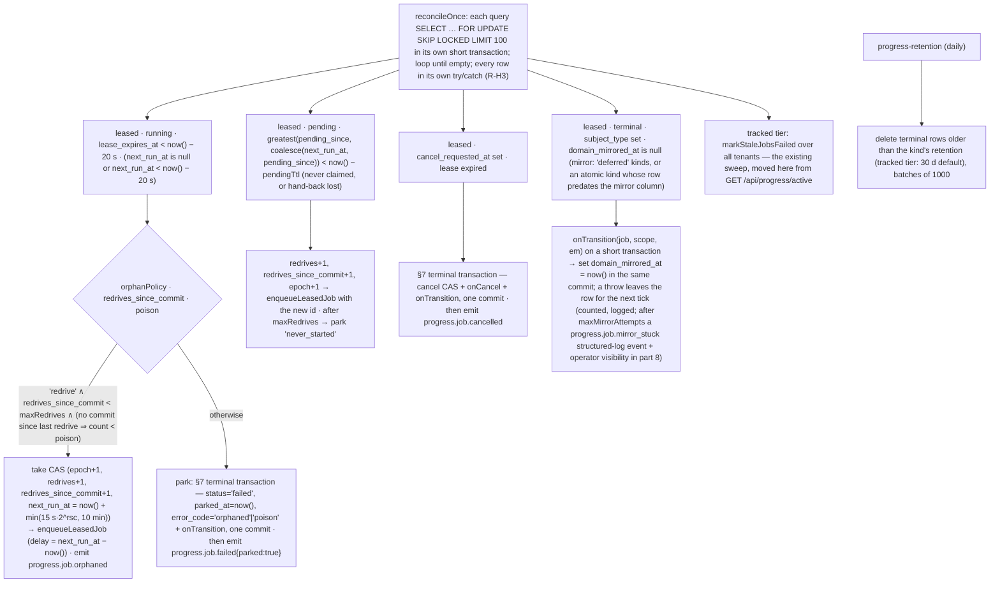

# Background work, part 6 — leased jobs in `progress`

**Date**: 2026-08-21
**Status**: Draft v1 — implementation spec split out of part 4 v3 (§5.3–5.7, Phase 1), revised for the terminal-transition finding of the PR #5450 review. Awaiting review; blocked on part 4 decisions 1–3. Depends on part 5; blocks parts 7 and 8.
**Series**: [part 1](./2026-08-21-background-work-01-data-sync-problems.md) — `data_sync` problems (D-n) · [part 2](./2026-08-21-background-work-02-sibling-modules-problems.md) — sibling modules (Q/P/W/S/… ids) · [part 3](./2026-08-21-background-work-03-common-problems-and-requirements.md) — classes C-1…C-14, requirements R-A…R-M, open decisions Δ-1…Δ-11 · [part 4](./2026-08-21-background-work-04-solution.md) — options, decision, shared invariants · [part 5](./2026-08-21-background-work-05-queue-transport-contract.md) — queue transport contract · [part 6](./2026-08-21-background-work-06-leased-jobs-in-progress.md) — leased tier in `progress` · [part 7](./2026-08-21-background-work-07-data-sync-adoption.md) — `data_sync` adoption · [part 8](./2026-08-21-background-work-08-operator-surface.md) — operator surface.
**Scope of this spec**: the leased tier of the `progress` module — additive schema, lease and transition SQL, the service API and kind registry, `runSlice`, the reconciler and retention workers, the terminal-transition protocol, cancellation semantics, the re-drive route and DTO fields. Inert until a kind registers. Vocabulary and invariants are part 4 §5.1–5.2 and are not restated; "invariant n" below refers to them.

## 📝 TLDR

A `progress_jobs` row whose `kind` is registered becomes a **leased job**: it carries a lease (`lease_owner`, `lease_epoch`, `lease_expires_at`) on the database clock, a single-runner `lock_key` enforced by a partial unique index, a delivery identity `(continuation_seq, redrives)` that refuses stale deliveries, and budgets that reset only on committed progress. A worker runs it as a chain of bounded slices (`runSlice`), each under one lease, yielding on budget or SIGTERM through the transport's hand-back (part 5). A worker-side reconciler on a transport repeatable repairs orphans, lost hand-backs, dead cancels and — new in this version — unmirrored terminal states. **Every terminal transition (complete, fail, park, cancel) commits in one transaction with the kind's domain mirror**, so a generic job record and its domain record can never disagree for longer than one reconciler tick; kinds whose domain row lives outside the app database opt into a deferred, reconciler-retried mirror instead.

## 📝 §1 Problem Statement

Part 3 classes C-1…C-14 as they apply to `progress` (P-3, P-4, P-5, P-24, P-30, P-34) and to every adopter; part 4 §4 chose this module as the home. The v3 design had one hole the review found: `runSlice` and the reconciler performed the terminal CAS *first* and called `onTransition` *after*, so a crash or a throwing callback between the two left a terminal `progress_jobs` row beside a `running` domain row that no reconciler query ever selected again — exactly the divergence R-B2/R-E3 exist to prevent. §7 closes it.

## 📝 §2 Data model

Additive migration on `progress_jobs` (category 8, ADDITIVE-ONLY). No column is dropped, renamed or retyped; no existing default changes. Expression indexes are declared with MikroORM's `@Index({ expression })` (precedent: `customer_interactions_email_dedupe_uq`, `warranty_claims_external_ref_unique`).

```sql
alter table progress_jobs
  add column lease_owner          text null,
  add column lease_epoch          bigint not null default 0,
  add column lease_expires_at     timestamptz null,
  add column lock_key             text null,              -- non-null ⇔ leased tier; single-runner key
  add column queue_name           text null,
  add column queue_job_id         text null,              -- last enqueued delivery id (pj-<id>-<seq>-<redrives>); for removeJob
  add column subject_type         text null,              -- 'data_sync.run'
  add column subject_id           text null,
  add column continuation_seq     int  not null default 0,
  add column redrives             int  not null default 0,   -- monotone; part of the delivery identity
  add column redrives_since_commit int not null default 0,   -- budget; reset by a committed heartbeat (HOT)
  add column interruptions        int  not null default 0,
  add column consecutive_failures int  not null default 0,
  add column pending_since        timestamptz null,       -- set on create, yield and take; the reconciler's pending clock
  add column next_run_at          timestamptz null,       -- reconciler backoff / operator re-drive time (not the deferred timer feature)
  add column last_committed_at    timestamptz null,
  add column parked_at            timestamptz null,
  add column error_code           text null,              -- 'orphaned' | 'poison' | 'never_started' | 'no_handler' | 'unrecoverable' | owner codes
  add column domain_mirrored_at   timestamptz null;       -- set when the kind's onTransition committed for the terminal state (§7); null on a terminal leased row ⇒ Q5 retries the mirror

alter table progress_jobs set (fillfactor = 80);

-- single-runner: at most one live operation per key per tenant/org (R-D1). NULL org is constrained (zero-uuid), unlike the
-- warranty_claims precedent; PG15 NULLS NOT DISTINCT was considered and rejected to keep PG14 support.
create unique index progress_jobs_one_live_per_lock_key
  on progress_jobs (lock_key, tenant_id, coalesce(organization_id, '00000000-0000-0000-0000-000000000000'::uuid))
  where lock_key is not null and status in ('pending','running');

-- reconciler scans: predicates exclude every heartbeat-written column (invariant 6). Q1 below filters lease_expires_at
-- inside this bounded set (a scan of live leased rows every tick; acceptable to ~10k live rows — see §6 cost note).
create index progress_jobs_leased_running_idx on progress_jobs (tenant_id) where status = 'running' and lock_key is not null;
create index progress_jobs_leased_pending_idx on progress_jobs (pending_since) where status = 'pending' and lock_key is not null;
create index progress_jobs_subject_idx       on progress_jobs (subject_type, subject_id) where subject_type is not null;
create index progress_jobs_retention_idx     on progress_jobs (finished_at) where status in ('completed','failed','cancelled');
create index progress_jobs_mirror_pending_idx on progress_jobs (finished_at) where lock_key is not null and subject_type is not null
  and status in ('completed','failed','cancelled') and domain_mirrored_at is null;   -- Q5: terminal rows whose domain mirror has not committed
```

Down-migration: drop the six indexes and the nineteen columns, reset `fillfactor`. Data in the new columns is discarded; the tracked tier is unaffected.

- The existing `progress_jobs_status_tenant_idx` stays. `heartbeat_at` stays unindexed.
- `meta` keeps today's rule (display-only, no credentials); `error_message` goes through the integration-log redaction.
- Per-kind configuration lives in the **registry**, not in columns.
- `ProgressJobStatus` is unchanged. Retention (§6) never deletes a terminal row whose `domain_mirrored_at` is null and `subject_type` is set — the mirror must land first. The Q6 follow-up will add `waiting`, `run_after` and full parent/child semantics; `next_run_at` and `pending_since` are intentionally narrower so that follow-up does not re-audit the claim predicate.
- `sync_runs` gains nothing here (part 7): `progress_job_id` already exists and is the link.
- `ProgressJobDto` (list/active/SSE) gains optional `cancelRequestedAt`, `parkedAt`, `errorCode` (category 2, additive) so the UI can render "cancelling" and "parked".

## 📝 §3 Lease semantics

Each statement is one autocommit transaction on a forked EM (part 4 invariant 1) — except the terminal transitions, which run inside the terminal transaction of §7 together with the domain mirror (part 4 invariant 11).

```sql
-- claim(jobId, owner, scope, { seq, redrives })
update progress_jobs
   set status = 'running', lease_owner = $owner, lease_epoch = lease_epoch + 1,
       lease_expires_at = now() + $ttl, heartbeat_at = now(), pending_since = null,
       started_at = coalesce(started_at, now()), updated_at = now()
 where id = $id and tenant_id = $tenant and (organization_id = $org or ($org is null and organization_id is null))
   and lock_key is not null
   and status in ('pending','running')                                                        -- parked rows are never claimed directly: the operator re-drive below moves them to 'pending' first
   and continuation_seq = $seq and redrives = $redrives
   and (next_run_at is null or next_run_at <= now())
   and (lease_expires_at is null or lease_expires_at < now())
 returning *;

-- heartbeatLease(lease, { processedCount?, totalCount?, committed? })   -- HOT: no indexed column
update progress_jobs
   set lease_expires_at = now() + $ttl, heartbeat_at = now(),
       processed_count = coalesce($p, processed_count), total_count = coalesce($t, total_count),
       consecutive_failures  = case when $committed then 0 else consecutive_failures end,
       redrives_since_commit = case when $committed then 0 else redrives_since_commit end,
       last_committed_at     = case when $committed then now() else last_committed_at end
 where id = $id and status = 'running' and lease_owner = $owner and lease_epoch = $epoch
 returning cancel_requested_at;                    -- zero rows ⇒ lease lost or taken ⇒ abort the slice's signal

-- yieldSlice(lease, { interrupted })               -- then hand the delivery back with the NEW seq in its payload (§5 step 4)
update progress_jobs
   set status = 'pending', continuation_seq = continuation_seq + 1,
       interruptions = interruptions + case when $interrupted then 1 else 0 end,
       lease_owner = null, lease_expires_at = now(), pending_since = now(), updated_at = now()
 where id = $id and status = 'running' and lease_owner = $owner and lease_epoch = $epoch
 returning continuation_seq, redrives;

-- failSlice(lease, error, { nextAttemptAt })      -- slice threw; stay 'running', release the lease, same (seq, redrives) for the transport retry;
--                                                  nextAttemptAt = the transport's next attempt (from the kind's retry policy and ctx.attemptNumber), or now() when attempts are exhausted
update progress_jobs
   set lease_owner = null, lease_expires_at = now(), next_run_at = $nextAttemptAt,
       consecutive_failures = consecutive_failures + 1,
       error_message = $msg, error_code = $code, updated_at = now()
 where id = $id and status = 'running' and lease_owner = $owner and lease_epoch = $epoch;

-- reconciler take (orphan):                        -- bumps the epoch (fence) and redrives (delivery identity)
update progress_jobs
   set status = 'pending', lease_owner = null, lease_epoch = lease_epoch + 1, lease_expires_at = now(),
       redrives = redrives + 1, redrives_since_commit = redrives_since_commit + 1,
       pending_since = now(), next_run_at = now() + $backoff, updated_at = now()
 where id = $id and status = 'running' and lock_key is not null
   and lease_expires_at < now() - $grace and (next_run_at is null or next_run_at < now() - $grace)
 returning continuation_seq, redrives, tenant_id, organization_id;

-- operator redrive(jobId, by) — the way OUT of 'parked' (and the manual take of an expired lease). Two steps, one short transaction:
--   (a) refuse when another live operation holds the key — the partial unique index would otherwise raise from inside the UPDATE:
select id from progress_jobs
 where lock_key = (select lock_key from progress_jobs where id = $id) and tenant_id = $tenant
   and coalesce(organization_id, '00000000-0000-0000-0000-000000000000'::uuid) = coalesce($org, '00000000-0000-0000-0000-000000000000'::uuid)
   and status in ('pending','running') and id <> $id
 for update;                                        -- one row ⇒ return { refused: 'lock_key_held', heldBy: id } (HTTP 409, same shape as part 7's start-time 409)
--   (b) the CAS: bumps the epoch (fence) and redrives (delivery identity); resets the orphan budget because the operator chose to retry;
--       clears the parked markers so part 8's "parked" filter stops matching; error_message is kept for history until the next slice overwrites it
update progress_jobs
   set status = 'pending', lease_owner = null, lease_epoch = lease_epoch + 1, lease_expires_at = now(),
       redrives = redrives + 1, redrives_since_commit = 0,
       parked_at = null, error_code = null, finished_at = null, domain_mirrored_at = null,
       pending_since = now(), next_run_at = now(), updated_at = now()
 where id = $id and tenant_id = $tenant and (organization_id = $org or ($org is null and organization_id is null))
   and lock_key is not null
   and ((status = 'failed' and parked_at is not null)                                   -- parked
     or (status = 'running' and lease_expires_at < now() - $grace))                     -- expired lease the operator does not want to wait a tick for
 returning continuation_seq, redrives;
--   then enqueueLeasedJob with the new id pj-<id>-<seq>-<redrives> (never the retained failed job's id — part 5 says that add would be a no-op).
--   A unique violation raised by (b) despite (a) — a concurrent start between the two statements — is caught and mapped to the same 409.
--   onTransition is NOT called here: the row is leaving a terminal state, and the domain row is re-opened by the kind's own step()
--   (data_sync: the next slice's fenced commit); domain_mirrored_at is reset so the eventual terminal transition mirrors again.

-- completeSlice / terminal fail / cancel: the existing CAS transitions, each extended with `and lease_epoch = $epoch` on the leased tier,
-- and each executed inside the §7 terminal transaction: CAS → onTransition(job, scope, em) → commit (atomic mode), or
-- CAS with domain_mirrored_at = null → commit → Q5 retries onTransition until it sets domain_mirrored_at (deferred mode)
```

Why `redrive` resets `redrives_since_commit` but never `redrives`: the budget is the operator's to reset (they are explicitly asking for more attempts); the identity is not, because a retained transport job or a straggling delivery may still carry the old pair (invariants 5 and 9). Why `claim` has no parked branch any more (v1 had one): a parked row never receives a delivery — every delivery id encodes `redrives`, and park does not bump it, so the only way a delivery for a parked row can exist is through `redrive`, which already moved the row to `pending`.

Why identity and budget are separate counters: if `redrives` could reset to 0, a transport retry holding an old `(seq, 0)` could become claimable again after a later driver committed (the reviewed interleaving: fail → take → re-drive claims → commit resets → old retry claims and fences the live driver). A monotone `redrives` closes it; `redrives_since_commit` carries the budget that must reset on progress (R-B3). Why there is no same-owner clause: a stalled redelivery to the *same* process should be refused while its sibling heartbeats, exactly like any other process; a dead process never matches because `owner` includes a per-process-start random. Why `claim` no longer admits `'failed'` at all: `progress` already allows `failed → running` (queue retries, stale revive) on the tracked tier; on the leased tier that door is closed — a genuinely failed operation is never resurrected by a late delivery, and a parked one leaves `failed` only through the operator `redrive` statement, which moves it to `pending` under a new delivery identity.

## 📝 §4 Service API and the kind registry

Additive members on `ProgressService` (category 2/3, STABLE: optional methods, precedent `touchJobHeartbeat?`). Every method takes `scope`.

```ts
export type Lease = { jobId: string; owner: string; epoch: number; ttlMs: number }   // no worker-clock expiry is exposed
export type SliceOutcome = 'drained' | 'budget' | 'cancelled'
export type OrphanPolicy = 'redrive' | 'park'

export interface LeasedJobKind {
  queue: string
  requiredFeatures: string[]                         // who may cancel / re-drive via the generic routes (in addition to progress.* features)
  lease?: { ttlMs?: number; sliceBudgetMs?: number; pendingTtlMs?: number }           // 60 000 · 300 000 · 900 000
  budget?: { maxRedrives?: number; maxConsecutiveFailures?: number; poisonRedrivesWithoutCommit?: number }   // 10 · 5 · 3
  orphanPolicy?: OrphanPolicy                        // default 'park' (Solid Queue's stance); idempotent kinds declare 'redrive'
  retention?: { completedDays?: number; failedDays?: number }                           // 7 · 30
  /** One slice under a held lease. Return when `signal` aborts or the budget elapses. */
  step(ctx: {
    job: ProgressJob; scope: ProgressServiceContext; lease: Lease
    signal: AbortSignal
    heartbeat: (patch?: { processedCount?: number; totalCount?: number | null; committed?: boolean }) => Promise<void>
    budgetMs: number
    idempotencyKey: string                           // `${jobId}:${continuation_seq}` — forward to external side effects and commands
    container: AppContainer
  }): Promise<SliceOutcome>
  /** Mirror a terminal transition (completed | failed incl. parked | cancelled) onto the domain row (data_sync: sync_runs.status).
   *  Called INSIDE the terminal transaction with its EntityManager (mirror: 'atomic', default) — a throw rolls the terminal CAS back —
   *  or after it, retried by the reconciler's Q5 until it resolves (mirror: 'deferred'). MUST be idempotent: it may run more than once
   *  for the same terminal state, and it must not emit events or enqueue work (do that from an after-commit hook via `emitAfterCommit`). */
  onTransition?(job: ProgressJob, scope: ProgressServiceContext, em: EntityManager): Promise<void>
  /** Optional pre-terminal hook for cancel (release external resources). Same transaction and the same idempotency rule as onTransition. */
  onCancel?(job: ProgressJob, scope: ProgressServiceContext, em: EntityManager): Promise<void>
  mirror?: 'atomic' | 'deferred'                     // default 'atomic'; 'deferred' only for kinds whose domain row is outside the app DB
}

export interface ProgressService {
  // …existing members unchanged…
  registerJobKind?(kind: string, handler: LeasedJobKind): void
  /** Inserts the row on the given EM (the caller's transaction) and returns it with a deferred `emitCreated()`; the
   *  `progress.job.created` event is NOT emitted inside the transaction (R-E3). Worker/CLI scope: pass a forked EM. */
  createLeasedJob?(input: CreateProgressJobInput & { kind: string; lockKey: string; subject?: { type: string; id: string } },
                   ctx: ProgressServiceContext, em: EntityManager): Promise<{ job: ProgressJob; emitCreated: () => Promise<void> }>
  enqueueLeasedJob?(jobId: string, ctx: ProgressServiceContext): Promise<void>   // id pj-<id>-<seq>-<redrives>; delay = max(0, next_run_at − now()); stores queue_job_id
  claim?(jobId: string, ctx: ProgressServiceContext, delivery: { seq: number; redrives: number }): Promise<Lease | null>
  heartbeatLease?(lease: Lease, ctx: ProgressServiceContext, patch?: {...}): Promise<{ cancelRequested: boolean } | null>
  yieldSlice?(lease: Lease, ctx: ProgressServiceContext, opts: { interrupted: boolean }): Promise<{ seq: number; redrives: number } | null>
  completeSlice?(lease: Lease, ctx: ProgressServiceContext, input?: CompleteJobInput): Promise<ProgressJob | null>   // runs the §7 terminal transaction; null when the fence refused
  failSlice?(lease: Lease, ctx: ProgressServiceContext, error: { message: string; code?: string }): Promise<void>
  redrive?(jobId: string, ctx: ProgressServiceContext, by: { userId?: string | null }): Promise<ProgressJob | { refused: 'lock_key_held' | 'not_redrivable'; heldBy?: string }>   // operator: parked or expired-lease rows; the §3 redrive statement (own predicate — NOT the take CAS, whose status = 'running' predicate excludes parked rows); bumps redrives + epoch so the new id never collides with a retained failed job; 409 when another live operation holds the lock key
  reconcileOnce?(opts?: { batchSize?: number }): Promise<ReconcileReport>   // system scope; used by the tick and by tests
}
```

`createLeasedJob(em)` is the single most important line for C-5 on the way *in*; the §7 terminal transaction is its counterpart on the way *out*. It: data_sync creates the progress job and the `sync_runs` row on the same request-scoped EM under `em.begin()` (both services resolve the same EM today: `progress/di.ts`, `shared/lib/di/container.ts`), commits, then calls `emitCreated()` and `enqueueLeasedJob`. A unique-index violation rolls both rows back with no phantom event. If the enqueue throws, the row is `pending` with `pending_since` set and the reconciler enqueues it (R-E2). Category 2/3 note: `onTransition`/`onCancel` gain an `em` parameter in their first published version, so no existing implementer is affected. The generic cancel and re-drive routes require `progress.update` **and** the kind's `requiredFeatures`, so cancelling a sync still needs `data_sync.run`.

## 📝 §5 `runSlice` (the worker body)

`runSlice(payload, ctx)` is registered once per queue a kind declares (the `progress` module ships a worker factory; the owner's `workers/*.ts` is a one-liner binding the queue).

1. `claim` with `payload.seq/redrives` → `null` ⇒ return (the queue job completes; a `progress.leased.delivery_refused` structured-log event with the reason).
2. Start the heartbeat interval at `ttl/3` (20 s) on a forked EM. A `null` from `heartbeatLease` aborts `signal`; `cancelRequested: true` aborts `signal` and marks the slice as ending by cancel.
3. `ctx.signal` (transport: shutdown / lock loss) is chained into the same `signal`.
4. `await step()`. Then:
   - `drained` → `completeSlice`, which runs the §7 terminal transaction (CAS + `onTransition` in one commit). A throw from the mirror rolls the CAS back and is treated exactly like a `step()` throw (next bullet but one): `failSlice` + rethrow, so the transport retries the slice; `step()` re-runs, finds nothing to do, returns `drained` again and the terminal transaction is retried.
   - `budget`, or `signal` aborted by shutdown/lease loss → `yieldSlice({ interrupted })` returning `{ seq, redrives }` → **`ctx.yield({ data: { …payload, seq, redrives } })`**: the transport rewrites the stored payload *before* handing the job back (BullMQ: `job.updateData()` then `moveToDelayed(now, token)` + throw `DelayedError`, which the processor must let propagate; local: rewrite the stored job and mark this delivery finished without touching `attemptCount`). Where the transport lacks `yield`, `enqueueLeasedJob` for the new `seq` is used instead (same id scheme) and `queue_job_id` is updated; a native hand-back keeps the transport's job id, so `queue_job_id` is left as is.
   - `cancelled` → the §7 terminal transaction with the cancel CAS, `onCancel` and `onTransition`; `progress.job.cancelled` is emitted for leased rows after that commit.
   - throw → `failSlice({ nextAttemptAt })` and **rethrow**: the transport retries *this delivery* (same `seq, redrives`) with its own attempts/backoff; the retry's `claim` succeeds because the lease was released and `next_run_at` has passed. `QueueUnrecoverableError` → terminal fail via the §7 terminal transaction (`error_code='unrecoverable'`), no transport retry; if *that* transaction's mirror throws, the row stays `running` with the lease released and `next_run_at = now()` — Q1 takes it on the next tick and parks it (the kind's policy cannot re-drive an unrecoverable error: `error_code` is preserved), mirroring again inside the park transaction.
5. A delivery that exhausts transport attempts leaves the row `running`, lease released, `next_run_at = now()` — the reconciler's case on its next tick. The failed transport job keeps the old id; the reconciler's re-drive uses a new one (invariant 9).

## 📝 §6 The reconciler

**Hosting the reconciler (Δ-6, decided).** The `progress` module ships two queue workers: `progress-reconcile` and `progress-retention`. The tick is a **repeatable job owned by the transport**, not a job that re-enqueues itself (a re-add from inside the running job is a dedup no-op on both strategies, and a retained failed job with the same id would block every later add — the chain would die). Part 5 adds `Queue.upsertRepeatable(id, { everyMs })` to the transport contract: async maps to BullMQ's `upsertJobScheduler('progress-reconcile', { every: 30_000 })`, which is idempotent across replicas and survives completion/failure of individual runs; local implements it as bucketed deterministic ids `progress-reconcile-<bucket+1>` enqueued at the *start* of each run inside `try/finally` (monotone ids never collide with retained failed ones) plus an unref'd boot timer that re-adds the next bucket as a self-heal. Every worker process calls `upsertRepeatable` at boot; the reconciler's steps are all CAS, so a redundant run is harmless. It does not depend on the optional `scheduler` package and never runs in the web process. `progress/AGENTS.md`'s "never timers for durable work" gains the explicit carve-out: the repairer is the one periodic job, and it is the transport's repeatable. Failure mode stated: if the repeatable is lost (Redis flush), the next worker boot re-creates it; until then leased orphans wait — the soak (part 7 §6) includes a Redis flush.



Every reconciler transition that ends a row (Q1 park, Q3 cancel) is a §7 terminal transaction: the CAS and the domain mirror commit together, and a throwing mirror rolls the CAS back so the row is selected again next tick. Q5 is the only path in which the mirror runs *after* a terminal CAS committed, and it exists for two cases only: kinds that declared `mirror: 'deferred'`, and rows whose terminal CAS committed before the column existed (migration backfill sets `domain_mirrored_at = finished_at` for rows without `subject_type`, and leaves it null where a subject exists so Q5 re-mirrors them once).

Constraint: `pendingTtlMs` must exceed the worst-case queue backlog for that kind, otherwise Q2 re-drives healthy queued deliveries (they are refused on `redrives` and cost nothing but a wasted delivery, yet each one counts toward `never_started`); the default 15 min is per kind and the reconciler logs a warning when a Q2 re-drive finds the previous delivery still queued (via `Queue.getJobState` where the capability exists). Cost note: Q1 scans the `running ∧ leased` partial index and filters `lease_expires_at` in the heap — a bounded scan of live leased rows every 30 s, which stays cheap to ~10k live rows; beyond that the follow-up is a narrow `progress_job_leases` side table, not an index on `lease_expires_at` (invariant 6).

**Connection ceiling** (`packages/queue/AGENTS.md` → Connection Budget): a leased slice uses its request-scoped EM plus one *transient* pooled connection during each heartbeat/lease statement (≤ 1 query every 20 s per slice), and the reconciler worker uses one connection per batch query. The worst case per worker process is therefore `Σconcurrency + 1` concurrent connections instead of `Σconcurrency`; the existing DB-budget clamp in `mercato worker --all` is updated to reserve that one extra connection and the integration test asserts `pg_stat_activity` stays under the clamp during the soak.

## 📝 §7 The terminal-transition protocol (invariant 11)

A leased row reaches `completed`, `failed` (including parked) or `cancelled` through exactly one code path, `runTerminalTransition(jobId, transition, scope)`, used by `completeSlice`, the terminal branch of `failSlice`, `cancelJob` on a pending leased row, and the reconciler's Q1-park, Q3-cancel and Q5-mirror:

1. Open a short transaction on a forked EM (`em.fork()` defaults, invariant 1's discipline).
2. Run the terminal CAS with the epoch fence (`… and lease_epoch = $epoch` for slice-initiated transitions; the reconciler's predicates for Q1/Q3). Zero rows → rollback, return `null`, do nothing else.
3. **`mirror: 'atomic'` (default):** call `onCancel?` then `onTransition(job, scope, em)` on the *same* EM, set `domain_mirrored_at = now()` on the row, commit. A throw anywhere → rollback: the row is still non-terminal, the lease is released by the caller's normal failure path (`failSlice` for a slice; nothing for the reconciler — the row is simply selected again next tick).
   **`mirror: 'deferred'`:** commit the CAS with `domain_mirrored_at = null`; Q5 retries `onTransition` on a fresh short transaction every tick until it succeeds, setting `domain_mirrored_at` in that same commit.
4. Only after commit: emit the terminal `progress.job.*` event and run any after-commit hooks the kind registered through `emitAfterCommit`. Events are therefore at-most-once (part 4 outbox/inbox section — accepted: the 5 s poll converges the UI).

Rules for `onTransition`: idempotent (it may run twice for the same terminal state — once in a rolled-back attempt, once in the committed one; or once per Q5 tick); a single fenced UPDATE on the domain row where possible (`data_sync`: `update sync_runs set status = $s, finished_at = … where id = $id and progress_job_id = $jobId and status not in (terminal)`); no events, no enqueue, no HTTP inside it. A kind that needs more than that is a kind whose domain state should be derived from the job row, not mirrored.

Why not "domain row first": the job row is the record every surface reads (UI, cancel, ACL, reconciler); a domain row that is terminal while the job row is `running` would be repaired by Q1 as an orphan and re-driven — worse than the v3 bug. The job row and the mirror move together or not at all.

## 📝 §8 Cancellation

`cancelJob` (existing) on a leased row: `pending` with no lease → `cancelled` immediately, `removeJob(queue_job_id)`; `running` → `cancel_requested_at` (existing CAS) — and for leased rows **the `progress.job.cancelled` event is emitted later**, by the slice that observes the request (within one heartbeat interval via the heartbeat response, or at once via `signal` where the transport relays it) or by the reconciler after the lease expires. The UI renders "cancelling" from `cancelRequestedAt` in the meantime. Event id unchanged; timing documented in UPGRADE_NOTES (the DataTable bulk handlers only track tracked-tier jobs and are unaffected).

A `pending` row cancelled immediately also goes through the §7 terminal transaction (cancel CAS + `onTransition`), on the caller's forked EM.

**Minimal cascade (R-G3, now).** `cancelJob` also sets `cancel_requested_at` on every non-terminal row with `parent_job_id = $id` (same CAS per child) and `removeJob`s pending children; children then follow the same rules as the parent. Parent aggregation ("parent completes when children are terminal") and parent-driven creation stay in the Q6 follow-up.

## 📝 §9 Edge Cases & Failure Scenarios (mechanism-level; the `data_sync` scenarios S1–S11 are in part 7)

| Scenario | Behaviour under this design |
|---|---|
| S3 lock lost, handler alive | The transport lock and the `progress_jobs` lease are different things: losing the BullMQ lock (`lockRenewalFailed` → the strategy aborts `signal`, part 5) does not release the lease, which the handler keeps heartbeating until it yields at its next durable boundary. BullMQ's stalled-job redelivery — to another worker **or to the same process** at `concurrency > 1` — carries the same `(seq, redrives)` and hits a live lease: `claim` refuses it (`lease_expires_at` is in the future; there is no same-owner exception, invariant 5), the delivery completes as refused, and the original handler's yield then hands the job back normally. If the handler is actually dead, the lease expires ≤ `ttlMs` (60 s) later and Q1 takes the row on the next tick with `redrives+1` and a new epoch; any later straggler is refused by identity. Bounded window: a live-but-lockless handler keeps running for at most one slice budget, alone, under its own lease; a dead one is re-driven within `ttlMs + grace + tick` (≈ 2 min). No window in which two drivers hold the lease. |
| S4 cancel | `cancel_requested_at` → next heartbeat (≤ 20 s) aborts `signal` → the step stops at its boundary → the slice runs the §7 terminal transaction (`cancelled` + `onCancel` + `onTransition`, one commit), then emits the event. UI shows "cancelling" until then. Cancel of a slice that is already dead: Q3 runs the same terminal transaction after the lease expires (≤ 60 s + tick). |
| **Hand-back lost after yield** (Redis flush, `moveToDelayed` throws, SIGKILL between the yield CAS and `ctx.yield`) | row `pending`, `lease_owner` null, `pending_since` set → reconciler Q2 re-drives after `pendingTtl` with a new `(redrives)` id. Not stranded. |
| **Transport retry after `failSlice` vs reconciler re-drive** | the reconciler does not act before `next_run_at + grace`, so the transport's retry normally claims first (same `(seq, redrives)`, lease released). If the transport gave up, the take bumps `redrives` and the epoch; a straggling transport retry with the old pair is refused forever (identity is monotone). No id collision (invariant 9). |
| **Transport backoff longer than the reconciler grace** | covered by `next_run_at`: Q1 ignores the row until the transport's scheduled attempt has passed, so a slow retry is not mistaken for an orphan and does not spend the orphan budget (invariant 8). |
| P-13 create-then-enqueue (other consumers) | unchanged until they adopt the leased tier; the tracked tier's pending sweep now runs from the worker tick, so a `pending` zombie is failed within 15 min without a browser. |
| Reconciler takes a slow-but-alive driver | take bumps the epoch: the driver's next heartbeat returns `null` → `signal` aborts; its fenced commit affects zero rows. At most the in-flight page is applied twice — idempotent by contract. |
| Two reconciler replicas | `SKIP LOCKED` partitions the set; the take CAS is the correctness guard; the repeatable is idempotent across replicas (`upsertRepeatable`). |
| Repeatable tick lost (Redis flush) | re-created by the next worker boot; until then leased orphans wait; covered by the soak. |
| Redis flushed | queue jobs gone; every leased row is `running` with an expiring lease or `pending` with `pending_since` → both re-enqueued by the reconciler with fresh ids. |
| **Operator re-drives a parked row** | §3 `redrive`: row → `pending` with `redrives+1`, a new epoch, `redrives_since_commit = 0`, `parked_at`/`error_code`/`finished_at`/`domain_mirrored_at` cleared; a new delivery id is enqueued (the retained failed transport job keeps the old id and is ignored); the next `claim` succeeds on `pending`. Part 8 stops showing it as parked the moment the statement commits. |
| **Re-drive while another live operation holds the lock key** (operator started a fresh `data_sync` run for the same stream after the old one parked) | `redrive` step (a) finds the live row and returns `{ refused: 'lock_key_held', heldBy }` → HTTP 409 naming the live operation, no state change; the concurrent-start race between (a) and (b) surfaces as a unique violation that is caught and mapped to the same 409. The parked row stays parked until the live one ends; the operator can cancel the live one first. |
| Owner module disabled (unknown kind) | first delivery or first tick → park with `error_code='no_handler'`. |
| Per-row owner callback throws in the tick | caught per row, counted, the batch continues (R-H3) — and because the callback ran inside that row's §7 terminal transaction, the CAS rolled back with it: the row is still non-terminal and is selected again next tick. No row is left terminal-but-unmirrored by a throwing callback. |
| **Crash between the terminal CAS and the domain mirror** (the v3 gap) | atomic mode: impossible — they are one commit; a crash before commit leaves the row `running` with a released lease (`failSlice` never ran either) → lease expires → Q1. Deferred mode: the CAS committed with `domain_mirrored_at = null` → Q5 retries `onTransition` every tick until it commits. Either way `sync_runs` cannot stay `running` while its job is terminal for longer than one tick. |
| Domain mirror throws persistently (atomic mode) | the slice's terminal transaction keeps rolling back → transport retries → `consecutive_failures` grows → at `maxConsecutiveFailures` the slice fails terminally, which is itself a §7 transaction whose mirror also throws → the row stays `running`, lease released, `next_run_at = now()` → Q1 parks it on the next tick — whose mirror throws again → CAS rolls back → selected again next tick, counted per row. After `maxMirrorAttempts` (default 20 ticks ≈ 10 min) the reconciler emits `progress.job.mirror_stuck` and the row is visible under the part 8 "stuck" filter. It is never silently terminal. |
| Clock skew between workers | irrelevant: every predicate is DB time; a skewed worker only heartbeats at a slightly different cadence. |
| Transport without `yield`/dedup/delay (future strategy) | `yield` = `enqueueLeasedJob(seq+1)`; duplicates refused by `claim`; delay = reconciler backoff via `next_run_at`. Correct, less efficient (R-J1). |

## 📝 Risks & Impact Review

| Risk | Sev | Mitigation | Residual |
|---|---|---|---|
| `progress_jobs` is written by ~40 files; wider row, six new partial indexes | Low | nullable/defaulted columns; heartbeat path unchanged for tracked rows; indexes partial on the leased tier; `fillfactor 80` converges on rewrite | none observable at today's volumes |
| Stale sweep moves off the GET (tracked jobs fail sooner, everywhere) | Low | same predicate and CAS; `OM_PROGRESS_SWEEP_ON_READ` **defaults on for one minor release** (so rolling back only the worker leaves sweeps alive), then off | — |
| `progress.job.cancelled` timing for leased rows; `progress.job.failed` gains `parked`; new `progress.job.orphaned` | Med | category 5: ids unchanged, payload additive, one new id; timing change documented in UPGRADE_NOTES | consumers treating `cancelled` as "stopped" were already wrong (P-21) |
| Orphan policy default `park` surprises owners expecting auto-retry | Low | documented; data_sync declares `redrive`; parked rows are visible and re-drivable | — |
| Connection ceiling +1 per worker process | Low | §6 ceiling stated; clamp updated; soak asserts it | — |
| Terminal transaction holds two row locks (`progress_jobs` + the domain row) for the duration of `onTransition` | Low | `onTransition` is a single fenced UPDATE by contract; the transaction is short and never waits on the transport | a slow mirror lengthens the slice's tail by that time |
| Compat surfaces touched | — | 8 DB schema additive (+ down-migration); 2/3 `ProgressService` optional members and DTO fields; 5 events as above plus `progress.job.mirror_stuck`; 7 one new action route `POST /api/progress/jobs/[id]/redrive`; 9 DI unchanged; 10 ACL reuses `progress.*` + kind features | — |
| Rollback | — | inert until a kind registers (code) + down-migration (schema). With a kind registered (part 7) the consumer's rollback applies first | — |

## 📝 Backward compatibility review

| Surface (`BACKWARD_COMPATIBILITY.md`) | Change | Class |
|---|---|---|
| 8 DB schema (`progress_jobs`) | 19 nullable/defaulted columns, 6 partial indexes, `fillfactor 80`; down-migration provided; backfill sets `domain_mirrored_at = finished_at` on terminal rows without a subject | ADDITIVE |
| 2/3 `ProgressService`, `LeasedJobKind`, `ProgressJobDto` | optional members and fields only; `onTransition`/`onCancel` are new in this version (with `em`) | ADDITIVE |
| 5 event ids | `progress.job.failed` payload gains `parked`; new `progress.job.orphaned`, `progress.job.mirror_stuck`; **timing** of `progress.job.cancelled` for leased rows changes (emitted when stopped, not when requested) | ADDITIVE + documented behaviour change (UPGRADE_NOTES) |
| 7 API routes | new `POST /api/progress/jobs/[id]/redrive` (200 with the row; 409 `lock_key_held` / `not_redrivable`); `GET /api/progress/active` no longer sweeps by default after one minor release (`OM_PROGRESS_SWEEP_ON_READ`) | ADDITIVE + flagged behaviour change |
| 9 DI keys, 10 ACL features | unchanged; the new route reuses `progress.update` + the kind's `requiredFeatures` | — |
| 12 CLI | `mercato worker` gains the two `progress-*` workers (auto-discovered) | ADDITIVE |

Rollback: the tier is inert until a kind registers. Code rollback leaves the columns in place unused; schema rollback is the down-migration. Rolling back only the worker keeps sweeps alive because `OM_PROGRESS_SWEEP_ON_READ` defaults on for one minor release.

## 📋 §10 Integration coverage (R-M1 — each a named test that fails on today's code)

Real Postgres + Redis (`__integration__`, docker-compose runner), with a test kind whose `step()` and `onTransition` are scriptable:

1. SIGKILL mid-slice → lease expires → Q1 takes with `redrives+1` and a new epoch; the old driver's fenced write (if it resumes) affects zero rows.
2. SIGTERM at the slice deadline → interrupted yield, counters untouched, redelivery claims with the rewritten `seq`.
3. Lost lock with a live handler (simulated `lockRenewalFailed`) → the redelivery is refused while the lease lives; the original yields normally (S3).
4. Duplicate / late / early delivery → refused by `(seq, redrives)`; the live driver is unaffected.
4b. **Re-drive out of parked**: park a row (poison), call `redrive` → row `pending`, markers cleared, a delivery with the new id is *actually processed* by BullMQ (the retained failed job with the old id does not block it) and completes; then park another row, start a live operation on the same lock key, `redrive` → 409 `lock_key_held`, no state change; cancel the live one, `redrive` → succeeds.
5. Two worker replicas + two reconciler replicas on one set → every slice runs once; `SKIP LOCKED` partitions the tick.
6. Crash between record and domain write on the way in (`createLeasedJob` in `em.begin()` + abort) → no row, no event.
7. **Crash between the terminal CAS and the domain mirror** — process killed inside `onTransition` (atomic mode) → row still `running`, lease released, re-driven, completes on the retry; **`onTransition` throws** once → CAS rolled back, retry succeeds, `domain_mirrored_at` set; throws persistently → park attempted each tick, `mirror_stuck` emitted after `maxMirrorAttempts`, row never terminal-but-unmirrored. Deferred mode: CAS committed, `domain_mirrored_at` null, Q5 sets it on the next tick once the mirror succeeds.
8. Cancel during I/O → `cancelled` written by the slice with the mirror in the same commit; cancel of a dead slice → Q3, same assertion.
9. Reconciler vs live driver → take fences the driver at its next heartbeat; at most one in-flight page applied twice.
10. Connection ceiling: `pg_stat_activity` stays under the `mercato worker --all` clamp during a 3-replica soak.
11. Retention never deletes a terminal row with `domain_mirrored_at is null` and a subject.

## 📋 Implementation Plan

1. Migration (§2, expression indexes via `@Index({ expression })`) + down-migration + snapshot + backfill; entity fields; validators; DTO fields (`cancelRequestedAt`, `parkedAt`, `errorCode`). Test: migration applies/reverts on a populated table; backfill leaves subject rows for Q5; existing tests green.
2. `createLeasedJob(em)` with deferred `emitCreated`, `enqueueLeasedJob`, `claim`, `heartbeatLease`, `yieldSlice`, `failSlice` (non-terminal branch), `redrive` — the §3 statements via the query builder on a forked EM (`nativeUpdate` cannot return rows). Unit tests per transition incl. epoch refusal, `(seq, redrives)` refusal, the reviewed fail→take→re-drive→commit→stale-retry interleaving (stale retry must be refused), absence of a same-owner bypass, `redrive` on a parked row (predicate matches, markers cleared, `redrives` bumped, `redrives_since_commit` reset, enqueue uses the new id), `redrive` refused on a non-parked non-expired row (`not_redrivable`) and when the key is held (`lock_key_held`, incl. the race mapped from the unique violation); a test asserting `n_tup_hot_upd` grows under heartbeats; a test that `createLeasedJob` inside `em.begin()` + rollback leaves no row and emits nothing.
3. `runTerminalTransition` (§7) and the terminal members built on it: `completeSlice`, terminal `failSlice`, leased `cancelJob`, park. Unit tests: mirror runs on the transaction's EM; a throwing mirror rolls the CAS back and returns the row non-terminal; deferred mode commits with `domain_mirrored_at = null`; events are emitted only after commit; `emitAfterCommit` hooks run once.
4. Kind registry (`mirror` option, `maxMirrorAttempts`) + `runSlice` factory + generic worker binding. Tests: refused claim does no work; budget → yield → rewritten delivery claims; throw → `failSlice` + rethrow → retry claims; unrecoverable → terminal via §7; shutdown → interrupted yield with counters untouched; mirror throw on `drained` → slice fails, retry completes.
5. Reconciler worker (`progress-reconcile` repeatable every 30 s via `upsertRepeatable`, registered at worker boot) + `progress-retention`; Q1–Q5; `SKIP LOCKED` batches; per-row isolation; stale sweep moved here; `OM_PROGRESS_SWEEP_ON_READ` (default on). Tests: orphan take bumps epoch and re-drives with backoff; Q1 waits for `next_run_at`; poison park on `redrives_since_commit`; lost hand-back re-drive; Q3 cancels a dead slice with the mirror in the same commit; Q5 mirrors a deferred row and a backfilled legacy row; a throwing park mirror leaves the row for the next tick and counts; two reconcilers on one set; tracked-tier sweep parity; repeatable survives a failed run and a Redis flush + boot; retention skips unmirrored rows.
6. Leased cancel semantics + minimal cascade (§8); `POST /api/progress/jobs/[id]/redrive` (ACL `progress.update` + kind features); top bar "cancelling"/"parked"; OpenAPI.
7. Integration coverage above.
8. AGENTS.md (`progress` incl. the repairer carve-out and the `onTransition` idempotency rule, root Task Router row), docs page "leased jobs", `BACKWARD_COMPATIBILITY.md` and UPGRADE_NOTES entries, `.ai/lessons.md`.

## Open items for review

- Part 4 decisions 1–3 (home, default orphan policy, default mirror mode).
- `maxMirrorAttempts` default 20 ticks (≈ 10 min) before `mirror_stuck`: long enough to ride out a domain-table lock storm, short enough that an operator sees it the same morning.
- Whether `onCancel` is worth keeping as a separate hook now that it shares the terminal transaction, or should fold into `onTransition` with `job.status === 'cancelled'`.

## Changelog

- 2026-08-22 — Draft v1.1 after the second review (PR #5450): `redrive` now has its own §3 statement (predicate `parked` or expired lease; bumps `redrives` + epoch, resets `redrives_since_commit`, clears `parked_at`/`error_code`/`finished_at`/`domain_mirrored_at`, moves to `pending`) instead of pointing at the take CAS whose `status = 'running'` predicate excluded parked rows; `claim`'s parked branch removed (a parked row never receives a delivery); the lock-key-held case is refused with a 409 before the UPDATE and the race is mapped from the unique violation; §9 rows, unit tests (step 2) and integration test 4b added for the way out of parked.

- 2026-08-22 — Draft v1: split out of part 4 v3 §5.3–5.7 + Phase 1 after review (PR #5450). **Terminal-transition protocol (§7, invariant 11)**: the terminal CAS and the kind's domain mirror now commit in one transaction (`onTransition(job, scope, em)`), with a `mirror: 'deferred'` mode, a `domain_mirrored_at` column, a reconciler query Q5 that retries unmirrored terminal rows, a `mirror_stuck` signal, a retention guard, a migration backfill, and crash/throw tests at that exact boundary (integration test 7, unit tests in steps 3–5). `runSlice` step 4 and every reconciler terminal path rewritten to use it. S3 rewritten to match the claim predicate (no same-owner exception). Compatibility review, rollback and integration coverage made explicit for this spec alone.
