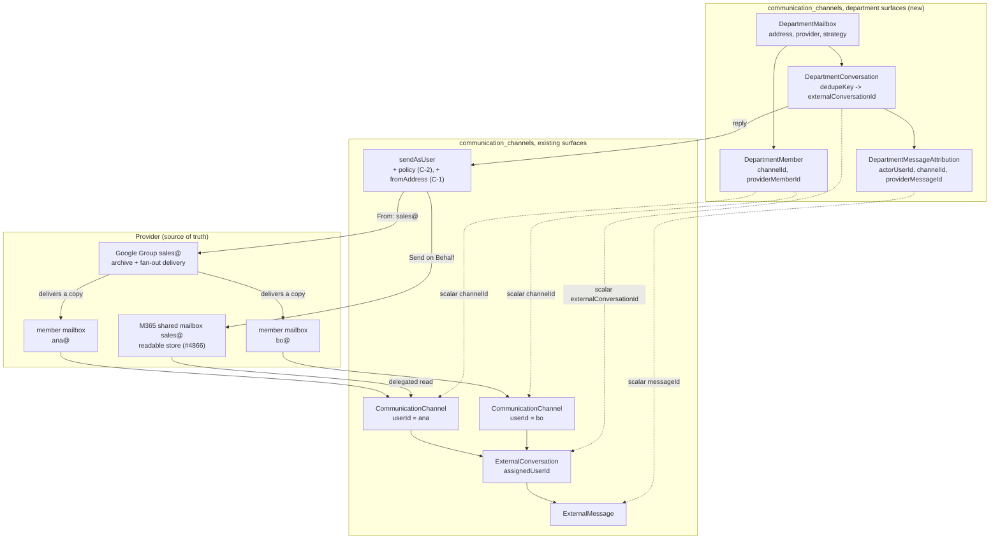
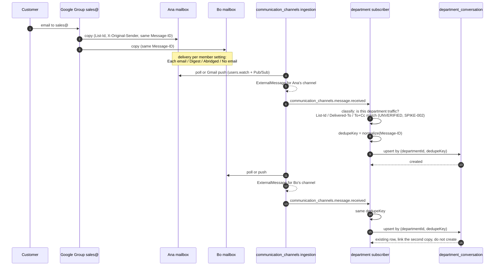
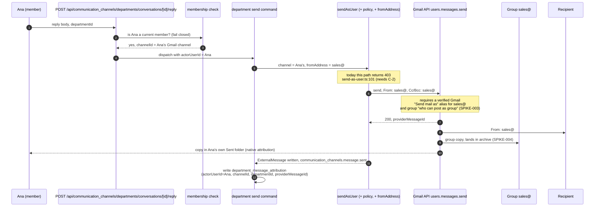
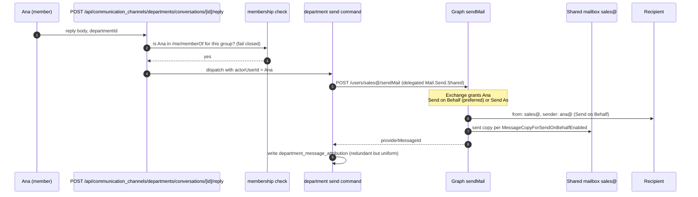

# Department Mailboxes on Provider-Owned Addresses

**Date**: 2026-09-20
**Status**: Draft
**Issue**: [#6292](https://github.com/open-mercato/open-mercato/issues/6292)

> Spec-only proposal. The **Open Questions** table at the end is unanswered. Sections whose shape depends on an answer are written at outline level and marked `Draft, pending Q-00x`, and every design choice a different answer would invalidate is marked inline as `[ASSUMPTION Q-00x]`. Do not set `Ready for implementation` until every blocking row is resolved.

## TLDR

Businesses run shared addresses such as `sales@`, `abuse@` and `security@`, and they want two things at once: every message stays in Gmail, Microsoft 365 or the IMAP server so the business can walk away from Open Mercato without losing mail, and every outbound reply is attributable to the employee who actually wrote it rather than to an anonymous service account.

Today `communication_channels` gives each employee a strictly private mailbox. `CommunicationChannel.userId` is set for Gmail and IMAP, `lib/access-control.ts` treats an owned channel as owner-only with no admin bypass, and `lib/send-as-user.ts:101` refuses any send through a channel the actor does not own. Nothing in the hub represents "this address belongs to this group of people".

This spec adds a department mailbox aggregate to `packages/core/src/modules/communication_channels`: the department, its membership, its conversation projection, and per-message actor attribution, plus an act-on-behalf authorization seam in `sendAsUser` that defaults closed. Provider behavior stays in the provider packages: `packages/channel-gmail`, `packages/channel-imap`, and the Microsoft 365 channel package introduced by [#5898](https://github.com/open-mercato/open-mercato/issues/5898). The provider remains the only authoritative store; Open Mercato holds a projection that can be deleted without losing mail.

The `shared-mailbox` strategy takes its connection and ingestion from [#4866](https://github.com/open-mercato/open-mercato/issues/4866), which introduces an org-shared mailbox backed by a `credentialsRef`. That work is a dependency, not part of this spec, and is not re-specified here.

## Problem Statement

A business with a `sales@` address has three bad options today.

A real user account for `sales@` means a shared password or a shared OAuth grant. Nobody knows who is logged in. The recipient sees `sales@` and, at best, a footer naming a person that no system can verify. Offboarding means rotating a credential several people hold.

A service account with domain-wide delegation removes the shared password but not the attribution problem, and Google requires the impersonated `sub` to be a user, never a group (developers.google.com/identity/protocols/oauth2/service-account), so a group address cannot be impersonated at all.

A Google Group with a Collaborative Inbox keeps the archive, keeps membership in one place, and delivers to members' own mailboxes, but no public API reads the group archive. The Groups Migration API is insert-only (`archive.insert`); Groups Settings, Cloud Identity and the Directory API manage metadata and membership only; Vault is eDiscovery and its fit here is UNVERIFIED. The archive that makes the group attractive is exactly the part an integration cannot read.

Meanwhile the hub already has everything except the department concept: per-user channels with encrypted per-user credentials, inbound normalization, threading, dead lettering, push registration, and thread-level reassignment through `ExternalConversation.assignedUserId`, `ChannelThreadMapping.assignedUserId` and `PUT /communication_channels/threads/[threadId]/assign`. What it lacks is any notion of a mailbox several employees legitimately share, and the code says so: `lib/access-control.ts` grants no admin bypass on an owned channel, and the Gmail adapter hard-derives the outbound sender from the connected account (`packages/channel-gmail/src/modules/channel_gmail/lib/adapter.ts:94`, `fromAddress: userCredentials.email ?? 'me'`).

Thread reassignment does not close the gap. `assignedUserId` is triage: it changes who follows up, not who a message is sent as, and it records nothing about the author of an outbound reply. `staff` teams have no address and no link to a channel, so no existing aggregate represents the pairing this feature needs.

## Overview and Success Measures

- **Primary outcome:** an employee replies to a department thread from inside Open Mercato, the recipient sees the department address as the sender, the message is present in the provider's own storage without Open Mercato, and Open Mercato can name the employee who sent it. Target: 100 percent of outbound department messages carry a resolved `actorUserId` and a provider message id.
- **Leading indicators:** department membership resolved from the provider for every configured department; inbound department messages deduplicated to exactly one conversation per provider `Message-ID` across N member mailboxes; zero outbound sends accepted for a non-member.
- **Baseline:** zero. No department concept exists. A shared address is today either a personal channel owned by one employee or an unattributable service account.

### Market / product reference

Four comparable open-source products already model "shared address, several actors, one visible sender". The shape is consistent across all of them.

| Product | Mailbox object | Membership object | Outbound attribution field | From seen by customer | Inbound source | Dedupe key |
|---|---|---|---|---|---|---|
| Odoo 18 | `mail.alias` on `crm.team.alias_id` | `crm.team` membership | `mail.message.author_id` | record's alias via `_notify_get_reply_to` | fetchmail IMAP/POP or MTA pipe | References / In-Reply-To |
| EspoCRM | `InboundEmail` group account, `smtpIsShared` | team assignment | `Email.sentBy` | the shared group address | IMAP poll | `messageId` |
| Chatwoot | `Channel::Email` on an `Inbox` | `InboxMember` / `Team` | `Message.sender` | `Agent (Business) <support@...>` | IMAP, OAuth or forward | `source_id` (Message-ID) |
| Zammad | `Group.email_address_id` | agent-to-group membership | `created_by_id` | the group's address | IMAP, SMTP, Graph, Google | `message_id_md5` |

Adopted from them: the shared address decoupled from a per-message attribution field pointing at the acting human, a customer-visible `From` that stays the department address, and dedupe on the `Message-ID`. Rejected: making Open Mercato the working copy of the mailbox. The differentiator here is that the provider stays authoritative and the Open Mercato record is a projection that can be deleted. Microsoft's Send on Behalf semantics are adopted directly, because Graph already models exactly this split: `sender` is the real user, `from` is the mailbox.

## Goals

- **REQ-001** An administrator can define a department mailbox (address, provider, persistence strategy) and Open Mercato resolves its member list from the provider.
- **REQ-002** Inbound mail addressed to a department appears exactly once as one department conversation, regardless of how many member mailboxes received a copy.
- **REQ-003** A member of a department can send a reply whose visible sender is the department address, through their own authenticated provider session, without any shared credential.
- **REQ-004** Every outbound department message durably records the acting user, the channel used, the department, and the provider message id.
- **REQ-005** A non-member, and a member whose provider membership was revoked, cannot read or send for that department.
- **REQ-006** Deleting the Open Mercato installation loses no mail: every inbound and outbound department message remains retrievable from the provider by the provider's own tools.
- **REQ-007** The same department model works for at least two provider classes (Google Workspace and Microsoft 365) and admits a third (generic IMAP with RFC 4314 ACL) without changing the hub.
- **REQ-008** Every contract surface this touches is either an additive change that passes `BACKWARD_COMPATIBILITY.md`, or a new surface. No behavior changes for an installation that configures no department.
- **REQ-009** Existing personal-channel behavior is unchanged for any user who is not a member of any department.
- **REQ-010** Every provider behavior this design depends on but has not been observed is proven by a spike with a pass/fail oracle before the phase that relies on it ships.

## Non-goals

- Replacing or duplicating the `inbox_ops` AI proposal and action extraction. Department conversations remain ordinary `ExternalConversation` rows, so `inbox_ops` keeps working over them unchanged.
- SLA timers, queues, round-robin assignment, canned responses, or any routing engine. Triage reuses the existing `communication_channels.conversation.reassign` command and nothing more.
- A general mail client. The only new surfaces are a department list, a department conversation list, a department conversation detail with reply, and the department settings form.
- Reading a Google Group archive. There is no public API for it (developers.google.com/workspace/admin/groups-migration/v1/guides/overview) and this spec does not pretend otherwise.
- Re-specifying the org-shared mailbox connection and ingestion path. That is [#4866](https://github.com/open-mercato/open-mercato/issues/4866) and this spec depends on it.
- Migrating historical department mail that predates the first member channel connection.
- A new authentication mechanism. Every provider call uses the member's existing per-user credential row, except where Q-004 concludes otherwise for Microsoft change notifications.

## Proposed Solution

`packages/core/src/modules/communication_channels` gains one aggregate, `DepartmentMailbox`, linked to zero or more existing `CommunicationChannel` rows through a membership table. The department is a projection layer. It owns no message bodies: it points at the `ExternalConversation` and `ExternalMessage` rows the hub already creates, and adds the department dimension plus the actor record the hub does not have.

The department belongs in the hub rather than in a separate package because it is the hub that owns channels, conversations, messages and the send path, and because the authorization seam this needs sits inside `sendAsUser`. Provider-specific behavior stays out of the hub: membership resolution and the department send path are adapter capabilities implemented in `packages/channel-gmail`, `packages/channel-imap`, and the Microsoft 365 package from [#5898](https://github.com/open-mercato/open-mercato/issues/5898), registered through the existing channel adapter registry.

A department declares a **persistence strategy**, which is the single axis that makes the design provider-neutral.

- **`shared-mailbox`** The department address owns a mailbox a member can read through their own delegated token. This is Microsoft 365 (a shared mailbox read with `GET /users/{shared}/messages` under delegated `Mail.Read.Shared`, or an M365 group read with `/groups/{id}/conversations`), Dovecot with RFC 4314 ACL or a master user, and Google only if the business accepts a dedicated Workspace user per department. The connection and ingestion for this strategy are the org-shared mailbox from [#4866](https://github.com/open-mercato/open-mercato/issues/4866); this spec adds who may act on it and how the actor is recorded. The actor is taken from the provider where the provider records it: Microsoft Send on Behalf natively splits `sender` (the real employee) from `from` (the mailbox).
- **`fan-out`** The department address is a distribution object with no readable store of its own, so its mail lives in the members' personal mailboxes. This is Google Groups. Group mail is delivered into each member's mailbox according to that member's delivery setting (support.google.com/groups/answer/2464926). Ingestion therefore happens from any member channel the hub already polls, and the copies are collapsed into one department conversation by deduplicating on the RFC 5322 `Message-ID` plus the group identifying headers. A reply is sent through the acting member's own channel with the department address as the visible `From`, and the group address is kept in the recipient list so the group archive and the other members receive the outbound copy too.

The fallback guarantee holds under both strategies. Under `shared-mailbox` the provider mailbox is the store. Under `fan-out` the store is the group archive plus every member's own mailbox and Sent folder, which is exactly where a business owner would look if Open Mercato disappeared. `[ASSUMPTION Q-001]` This spec is written for `fan-out` as the Google default, because it is the only Google option that requires no new identity and no new licence. If Q-001 answers "dedicated Workspace user per department", Google collapses into `shared-mailbox` and the whole fan-out ingestion path, its dedupe rules and its spikes drop out of scope.

Membership is resolved from the provider, not typed by an administrator. Google exposes a member's own groups to that member: Cloud Identity `groups/-/memberships:searchDirectGroups` under scope `https://www.googleapis.com/auth/cloud-identity.groups.readonly`. That is the deliberate choice over Admin SDK `groups.list`, which is admin-gated and would require the administrator credential the design is trying to avoid. `searchTransitiveGroups` is available only on Enterprise Standard, Enterprise Plus and Cloud Identity Premium, so nested groups are out of scope for the first release. Microsoft exposes the same through `GET /me/memberOf` under delegated `GroupMember.Read.All`. Generic IMAP exposes nothing, so that provider class falls back to an explicit member list.

Attribution is recorded locally in every case, because no provider guarantees it. Under Microsoft Send on Behalf the provider records it too, and the recipient sees it. Under Google fan-out the recipient sees only the department address, but the acting employee's own Sent folder holds the message natively, which is a provider-side attribution record an auditor can find without Open Mercato.

### Design decisions and alternatives

| Decision | Rationale | Alternative considered | Why rejected or deferred |
|---|---|---|---|
| The department is a projection over existing `ExternalConversation` rows | Keeps the provider authoritative, keeps `inbox_ops` working, avoids duplicating the hub's threading and dead lettering | A department-owned copy of message bodies | Duplicates the store, breaks the delete-and-lose-nothing guarantee, forks threading |
| The department lives in `communication_channels`, not a new package | The hub owns channels, conversations and the send path, and the authorization seam is inside `sendAsUser` | A standalone `departments` package depending on the hub | A package cannot reach inside the send path without the same seam, so it would add a dependency and solve nothing |
| `DepartmentMailbox` links to member `CommunicationChannel` rows rather than owning a channel | Every provider call runs under a real employee's token, so there is no shared credential to rotate and no anonymous access | A tenant-scoped channel with `userId = null` holding department credentials | `userId = null` is the existing WhatsApp and Slack shape and would reintroduce the shared service account this feature exists to remove |
| Two persistence strategies on one aggregate | The provider difference is real (a Google Group has no readable store, a Microsoft shared mailbox does) and it is the only axis that differs | One strategy plus per-provider special cases | Special cases leak Google's limitation into the Microsoft path, which is natively simpler |
| Membership read from the provider with the member's own token | Fail-closed authorization sourced from the system the business already administers, with no admin credential | An administrator-maintained member list in Open Mercato | Drifts silently, and drift here is an authorization hole |
| Dedupe on the RFC 5322 `Message-ID` | It is the one identifier every copy of a fanned-out message shares across mailboxes, and it is what all four reference products use | Dedupe on subject plus timestamp, or on the Gmail thread id | Subject heuristics collapse unrelated threads; Gmail thread ids are per-mailbox and differ between members |
| Outbound `From` override as an optional field on the adapter input | An optional field on an exported interface is explicitly non-breaking under `BACKWARD_COMPATIBILITY.md` section 2 | A department command calling the Gmail client directly and bypassing `sendAsUser` | Bypasses the hub's guards, persistence and events, and forks the outbound path |
| Act-on-behalf as a registered policy inside `sendAsUser`, default closed | One send path, one guard, and no behavior change where no policy is registered | Removing or widening the ownership check | A removed check is a permanent impersonation surface for every installation |
| `communication_channels.conversation.reassign` reused for triage | The command, event and route already do exactly this | A department-owned assignment field | Duplicates an existing contract for no gain |

## Domain vocabulary and business rules

| Term or invariant | Precise meaning or rule | Source of truth | Failure behavior |
|---|---|---|---|
| Department mailbox | A named department address (`sales@acme.com`) with one provider, one persistence strategy and one membership source | `communication_channels:department_mailbox` | a department with no resolvable members is readable but cannot send |
| Persistence strategy | Exactly one of `shared-mailbox` or `fan-out`; immutable after creation | `department_mailbox.persistence_strategy` | a change request is rejected; create a new department instead |
| Membership source | Exactly one of `provider` or `manual`; `manual` is valid only when the provider exposes no membership API | `department_mailbox.membership_source` | `provider` with no adapter capability fails validation at create time |
| Member | A user with a connected, active `CommunicationChannel` on the department's provider whose provider identity is in the department's resolved member set | `department_member` joined to `communication_channels` | a user who is one but not the other is not a member and cannot act |
| Department conversation | Exactly one row per `(department, deduplication key)`, however many member mailboxes hold a copy | `department_conversation` unique index | a second copy links to the existing row rather than creating one |
| Deduplication key | The normalized RFC 5322 `Message-ID` of the first message in the thread, lowercased, angle brackets stripped | the provider message headers | a message with no usable `Message-ID` is dead-lettered, never silently merged |
| Actor | The authenticated user who composed an outbound department message; never inferred from the mailbox | `department_message_attribution.actor_user_id` | a send with no derivable actor is refused before any provider call |
| Membership drift | The resolved provider member set no longer contains a user recorded as a member | the scheduled membership refresh | `Draft, pending Q-005`: fail closed immediately, or a bounded grace period |
| Fallback guarantee | Every department message is retrievable from the provider with Open Mercato deleted | the provider | a strategy that cannot satisfy this is not a valid strategy |

## Users, permissions, and scope

| Actor | Allowed outcomes | Scope rule | Required feature IDs |
|---|---|---|---|
| Administrator | create, edit, deactivate a department; trigger a membership refresh; view the member roster | organization | `communication_channels.departments.manage` |
| Department member | list and read that department's conversations; send a reply as the department; reassign a thread | organization, narrowed to departments they are a member of | `communication_channels.departments.view`, `.send`, plus existing `communication_channels.assign` |
| Non-member staff | nothing; a department they do not belong to is not listed and its API reads return 403 | organization | none |
| Auditor | read the membership refresh record and the attribution record; never read a message body they are not a member for | organization | `communication_channels.departments.audit` |

`tenantId` and `organizationId` are derived from the authenticated session, never from a request payload. No operation here uses system scope, and every handler fails closed when an organization cannot be derived. `[ASSUMPTION Q-009]` The `DepartmentMailbox` row is organization-owned. A Google Group is a domain-level object that can span several organizations in one tenant, so if Q-009 answers "tenant-wide", the scope columns, every index and every authorization check in this document change.

Authorization is two gates, both of which must pass, in this order: the declarative `requireFeatures` gate on the route, then a record-level membership check that the acting user is a current member of the named department. The feature gate alone is never sufficient, because `.send` is a capability, not a grant over a specific department.

## Reuse and ownership map

| Capability | Reuse, extend or add | Where | Integration seam | Why |
|---|---|---|---|---|
| Mailbox connection, OAuth, encrypted per-user credentials | reuse unchanged | `communication_channels`, `channel-gmail`, `channel-imap` | scalar `channel_id` plus snapshot | The hub already owns this and owns it correctly |
| Org-shared mailbox connection and ingestion | reuse, dependency | [#4866](https://github.com/open-mercato/open-mercato/issues/4866) | the `credentialsRef` mailbox object | The `shared-mailbox` strategy is built on it and does not duplicate it |
| Inbound normalization, threading, dead lettering | reuse unchanged | `communication_channels` | subscriber on `communication_channels.message.received` | The department layer reacts after ingestion rather than forking it |
| Message and conversation storage | reuse unchanged | `communication_channels:external_conversation`, `:external_message` | scalar ids | No second copy of a message body anywhere |
| Thread assignment and triage | reuse unchanged | `communication_channels.conversation.reassign`, `PUT /communication_channels/threads/[threadId]/assign` | command dispatch | An existing contract that already does exactly this |
| AI triage over department mail | reuse unchanged, optional | `inbox_ops` | none; it reads the same `ExternalConversation` rows | An explicit non-goal, and it must degrade cleanly when the module is disabled |
| Department aggregate, membership, attribution | new | `communication_channels` | its own entities, commands, routes and pages | The hub owns channels and the send path |
| Provider membership resolution and department send | new adapter capabilities | `channel-gmail`, `channel-imap`, the Microsoft 365 package | optional capability declarations on the channel adapter contract | Provider-specific behavior must not sit in the hub |
| Outbound `From` override | additive optional fields | `communication_channels/lib/adapter.ts`, honored in the provider packages | `SendMessageInput`, `ConvertOutboundInput` | Category 2, optional fields may be added freely |
| Act-on-behalf authorization | additive default-closed seam | `communication_channels/lib/send-as-user.ts` | an optional registered policy | Category 3; the seam widens acceptance only when a policy exists |

### Contract surface changes and their classification

| # | Change | Surface | Classification |
|---|---|---|---|
| C-1 | Optional `fromAddress?: string` and `fromName?: string` on `SendMessageInput` (`packages/core/src/modules/communication_channels/lib/adapter.ts:80`) and `ConvertOutboundInput` (`:143`), honored by the Gmail adapter in place of the hard-coded `userCredentials.email ?? 'me'` at `packages/channel-gmail/src/modules/channel_gmail/lib/adapter.ts:94` and `fromAddress: 'me'` at `:142`, and by the IMAP adapter in place of `credentials.fromAddress` at `packages/channel-imap/src/modules/channel_imap/lib/adapter.ts:97` | Type definitions, category 2 (STABLE) | ADDITIVE, non-breaking. Optional fields on an exported interface; every existing caller compiles and behaves identically because an absent value keeps the current derivation |
| C-2 | An optional act-on-behalf policy consulted by `sendAsUser` so a send through a channel the actor does not personally own can be authorized by a registered department policy, instead of the unconditional 403 at `packages/core/src/modules/communication_channels/lib/send-as-user.ts:101` | Function signature and behavior, category 3 (STABLE); widens acceptance | NOT purely additive. It relaxes a security check, so it MUST default to the current behavior and widen only when a policy is explicitly registered. With no policy registered the byte-identical 403 `You can only send through channels you own` remains, and TEST-009 pins it |
| C-3 | Adding `https://www.googleapis.com/auth/cloud-identity.groups.readonly` to the Gmail scope set (`packages/channel-gmail/src/modules/channel_gmail/lib/credentials.ts:78`, `GMAIL_DEFAULT_SCOPES`) | Behavior, not a frozen surface. `parseScopes` at `:84` already lets an installation override `scopes` on its integration credentials | No default change proposed: changing the shipped default forces re-consent for every existing Gmail channel in every installation. The supported path is the per-installation `scopes` override `[ASSUMPTION Q-006]` |
| C-4 | New entities, routes, commands, events, ACL features and pages | New surfaces | Nothing existing is touched. Once released they are frozen under the same contract |

C-2 is the only change that is not purely additive, and it is deliberately the narrowest possible seam: an optional consultation after the ownership check fails, never a removed check. An installation that registers no policy is byte-identical to today.

## Architecture and data flow

```text
provider group or shared mailbox
  -> member CommunicationChannel (existing, userId set)
  -> communication_channels ingestion (existing)
  -> communication_channels.message.received (existing event)
  -> department subscriber: classify + dedupe
  -> department_conversation (new, points at external_conversation by id)
  -> department UI -> send command -> sendAsUser (+ policy, + fromAddress) -> provider
                                   -> department_message_attribution (new)
```



Takeaway: every solid arrow inside the hub box exists today and is untouched. Everything new is the dotted scalar references from the department rows into existing rows, plus the two marked seams on `sendAsUser`. Configure no department and the hub behaves exactly as it does now; delete the whole system and the provider box still holds every message.

- **Boundaries:** the department surfaces own the aggregate, membership and attribution, and nothing else. They own no message body, no credential and no channel. That boundary is what keeps the fallback guarantee true and keeps the writes transactionally small: they never need to be consistent with a provider call, only to record one that already happened.
- **Extension points:** the department layer reacts to `communication_channels.message.received` through a persistent idempotent subscriber, reads existing rows by scalar id, and adds its own pages under the module's `backend/` tree. Provider differences are reached only through declared adapter capabilities.
- **Alternative considered:** no aggregate at all, extending `CommunicationChannel` with a `departmentId` field. Rejected because a department has its own lifecycle, membership and audit, and because several channels map to one department.
- **Compatibility:** a user who belongs to no department observes no behavior change anywhere. The `sendAsUser` 403 keeps firing byte-identically when no policy is registered. Existing Gmail channels keep their current scopes.

### Inbound fan-out ingestion and deduplication, Google



Takeaway: the hub ingests N copies because N mailboxes really received them, and that is correct, since each copy is a message that actually arrived in that mailbox. The department layer collapses them to one conversation on the one identifier every copy shares. The classification step is the weak link and is the subject of SPIKE-002, because the identifying headers (`List-Id`, `X-Google-Group`, `Delivered-To`, `Precedence: list`, `X-Original-Sender`) are community-sourced and UNVERIFIED against current Google behavior.

### Reply on behalf of a department, Google fan-out path



Takeaway: the recipient sees only `sales@`, so provider-side attribution on Google is indirect: the message sits in Ana's own Sent folder, which an auditor can find without Open Mercato. Two provider behaviors this depends on are unproven and gate the phase: whether `users.messages.send` accepts a group address as a verified `sendAs` alias at all, and whether the outbound copy reaches the group archive only when the group is an explicit recipient.

### Reply on behalf of a department, Microsoft path



Takeaway: Microsoft implements the requirement natively. Send on Behalf keeps `sender` as the real employee and `from` as the mailbox, so the attribution is visible to the recipient and durable in the provider without any Open Mercato record. Send As collapses the two and loses that, so Send on Behalf is the default and Send As is an explicit opt-out. This is the strongest argument for answering Q-003 in Microsoft's favor.

### Provider strategy decision table

| Provider class | Strategy | Read path | Send path | Actor recorded by provider | Membership source | Change notifications with a member-delegated token | Confidence |
|---|---|---|---|---|---|---|---|
| Google Workspace, Google Group | `fan-out` | member mailboxes via existing Gmail channels; the group archive is not readable by any public API | member token, `From` = group alias, group in Cc or Bcc | no; only indirectly via the member's own Sent folder | Cloud Identity `searchDirectGroups`, scope `cloud-identity.groups.readonly` | yes, existing `users.watch` plus Pub/Sub per member channel | low; three UNVERIFIED behaviors, SPIKE-002/003/004 |
| Google Workspace, dedicated user per department | `shared-mailbox` | that account's mailbox, via [#4866](https://github.com/open-mercato/open-mercato/issues/4866) | that account | no | manual, or Directory API | yes | high, but reintroduces a shared identity |
| Microsoft 365, shared mailbox | `shared-mailbox` | `GET /users/{shared}/messages`, delegated `Mail.Read.Shared` plus Exchange Full Access | `Mail.Send.Shared` plus Send on Behalf | yes, `sender` vs `from` | `GET /me/memberOf`, delegated `GroupMember.Read.All` | no; `*.Shared` permissions do not support change-notification subscriptions, so this needs an application permission or polling (Q-004) | high |
| Microsoft 365, M365 group mailbox | `shared-mailbox` | `/groups/{id}/conversations` and `/threads`, delegated `Group-Conversation.Read.All` | as above | yes | `/me/memberOf` | no, same limitation | medium |
| Generic IMAP with RFC 4314 ACL or a Dovecot master user | `shared-mailbox` | the employee authenticates as themselves and holds ACL rights on the department mailbox | SMTP with `From` = the department address | no | none; `manual` membership | no; IMAP IDLE or polling only | medium |
| Google IMAP | not supported | Google IMAP has no ACL delegation (UNVERIFIED) | n/a | n/a | n/a | n/a | not attempted |

Takeaway: Microsoft is the natively correct provider for this feature and Google is the one most requests name. They differ on exactly two axes, a readable department store and a provider-side actor, and `persistence_strategy` is placed on precisely those axes so neither provider's limitation contaminates the other.

## User journeys

### J-001, an administrator creates a department

1. An administrator with `communication_channels.departments.manage` opens `/backend/communication-channels/departments` and creates one: display name, address `sales@acme.com`, provider `gmail`, strategy `fan-out`, membership source `provider`.
2. The system validates that the address is well formed on a domain the installation already has a connected channel for, and that the chosen strategy is one the selected adapter declares support for.
3. A membership refresh runs immediately. For each active Gmail channel in the organization, the adapter calls Cloud Identity `searchDirectGroups` with that member's own token and records whether `sales@acme.com` is in the result.
4. Members whose channel lacks the `cloud-identity.groups.readonly` scope are listed as `unresolved` with an explicit reauthorize action, not silently omitted and not treated as members.
5. If no member resolves, the department is created but marked `no-members`, is visible to administrators only, and refuses every send.

### J-002, department mail arrives and is read once

1. A customer emails `sales@acme.com`. Google delivers a copy to Ana and to Bo.
2. Each copy is ingested by the hub through that member's own channel and raises `communication_channels.message.received`.
3. The department subscriber classifies both as department traffic, computes the same dedupe key, and links both to one department conversation.
4. Both Ana and Bo see one conversation in the department list, with no indication that two copies exist, and `inbox_ops` sees the underlying `ExternalConversation` rows exactly as it does today.
5. A copy whose `Message-ID` is missing or unparseable is not merged and not dropped: it is recorded as an unclassified department candidate with the reason, and surfaces in an administrator-visible list.

### J-003, an employee replies as the department

1. Ana opens the conversation and writes a reply. The compose header states plainly that the message will be sent as `sales@acme.com` and recorded as sent by Ana.
2. The send is authorized twice: the `.send` feature, then a live membership check against the current resolved member set.
3. The message goes out through Ana's own channel with `From: sales@acme.com` and the group as a recipient, and a copy lands in Ana's Sent folder.
4. The attribution row is written after the provider call succeeds and the `ExternalMessage` is persisted, never before.
5. If the provider rejects the `From` override, the user sees a specific failure naming the missing verified alias and the message is not silently re-sent from Ana's own address. Falling back to the personal address would be a data-integrity failure, not graceful degradation.

### J-004, membership is revoked

1. An administrator removes Bo from the provider group.
2. The scheduled membership refresh detects that Bo is no longer in the resolved set.
3. `Draft, pending Q-005.` Under the fail-closed answer, Bo's next department read and next send are refused immediately and the UI explains that department access follows the provider group. Under the grace-period answer, reads continue for a bounded window while sends stop at once, which is the asymmetry worth considering, because a send is an outward-facing action and a read is not.
4. Bo's personal mailbox still contains the historical copies, because they were delivered to Bo. Open Mercato does not and cannot delete them, and this spec does not pretend it can.

## UI and interaction contracts

`Draft, pending Q-003.` The surfaces below are provider-neutral and hold for either phase-1 answer. The closest references are the existing `communication_channels` channel list and channel detail pages; implementation should follow them rather than inventing a second visual language for the same module.

Cross-record references follow the reference display rule. The member roster shows user display names from a scoped option source, never raw user ids. The department picker on the conversation list is a selection control over the acting user's own departments, not a free-text field. Raw ids appear only in API payloads.

| Surface / route | Purpose and primary actions | Data source / mutations | Closest reference | Components | Required states | Requirement IDs |
|---|---|---|---|---|---|---|
| `/backend/communication-channels/departments` | list departments, create, edit, deactivate, refresh membership | `GET/POST/PUT /api/communication_channels/departments`, `POST .../departments/[id]/refresh-membership` | channels list page | `Page`, `PageBody`, `DataTable`, row actions | loading, empty, error, conflict, success, permission denied | REQ-001 |
| `/backend/communication-channels/departments/[id]` | department detail: settings form plus the member roster with per-member scope status | `GET /api/communication_channels/departments/[id]`, `PUT` same | channel detail page | `Page`, `CrudForm`, `DataTable` for the roster | loading, empty roster, error, conflict, success, permission denied, unresolved-member warning | REQ-001, REQ-005 |
| `/backend/communication-channels/departments/[id]/conversations` | the department conversation list, filter by assignee and status | `GET /api/communication_channels/departments/[id]/conversations` | `inbox_ops` backend pages | `Page`, `PageBody`, `DataTable` | loading, empty, error, permission denied | REQ-002 |
| `/backend/communication-channels/departments/[id]/conversations/[conversationId]` | read the thread, reply as the department, reassign | `GET`, `POST .../reply`, existing `PUT /communication_channels/threads/[threadId]/assign` | `inbox_ops` conversation detail | `Page`, `PageBody`, form primitives, shared record-conflict UI | loading, empty, error, conflict, send failure with the provider reason, permission denied, membership revoked | REQ-003, REQ-004 |

### UI architecture

| Role | Navigation groups in order | Injected widgets | Login-to-primary-task flow |
|---|---|---|---|
| Administrator | Settings, Communication, Department mailboxes | none in phase 1 | login, Department mailboxes, create: two clicks |
| Department member | Communication, Departments | an optional "unread in my departments" widget, deferred | login, Departments, conversation, reply: three clicks |
| Non-member | no department entry is rendered | none | not applicable |

| Surface or widget | Empty state guidance and action | Responsive behavior | Keyboard and focus behavior |
|---|---|---|---|
| Department list | "No departments yet. A department maps a shared address such as sales@ to the employees who answer it." plus the create action | the table collapses to stacked cards at narrow width | the create action is first in tab order; row actions are reachable without a pointer |
| Member roster | "No members resolved from the provider yet" plus a refresh action and, per unresolved member, a reauthorize link | the roster stacks under the settings form | refresh is a button, not an icon-only control, and announces its result |
| Conversation list | "Nothing has arrived for this department yet" | list view at narrow width | arrow-key row navigation, Enter opens |
| Conversation detail reply | compose is always visible with the sender line stated in text | compose docks to the bottom at narrow width | Escape cancels with a confirm when the draft is dirty; the send control is never the only focusable element |

### Department conversation detail

```text
┌────────────────────────────────────────────────────────────┐
│ Re: pricing question                        [Reassign ▾]   │
│ sales@acme.com · assigned to Ana K. · 4 messages           │
├────────────────────────────────────────────────────────────┤
│ customer@example.com          2026-09-18 14:02             │
│   Hi, could you quote 200 units?                           │
│                                                            │
│ sales@acme.com (sent by Ana K.)   2026-09-18 15:10         │
│   Certainly, attached.                                     │
├────────────────────────────────────────────────────────────┤
│ Sending as sales@acme.com, recorded as Ana K.              │
│ [ reply body                                          ]    │
│                                   [Discard]  [Send]        │
└────────────────────────────────────────────────────────────┘
```

- **Behavior:** the sender line is text, not a tooltip, because the attribution promise is the feature. Reassign dispatches the existing reassign command and surfaces its 409 through the shared record-conflict UI. A send failure keeps the draft and shows the provider's reason; it never silently retries from the member's personal address. Destructive actions confirm.
- **Accessibility:** the message list is a list with per-message headings so a screen reader can move by message, and the sender attribution is part of the message heading rather than decoration. Send state is announced. Focus returns to the compose field after a failed send and to the thread head after a successful one.
- **Localization:** all strings under the module's existing i18n namespace. The sender line interpolates the department address and the actor display name as two dynamic values, never concatenated fragments.
- **Design system:** semantic tokens only, verified in light and dark mode. No hard-coded status colors for delivery state; reuse the existing message status treatment.

## Data models

All five entities live in `packages/core/src/modules/communication_channels/data/entities.ts` alongside `CommunicationChannel` (`:76`), `ExternalConversation` (`:192`), `ExternalMessage` (`:235`) and `ChannelThreadMapping` (`:336`). Every one is organization-owned `[ASSUMPTION Q-009]`, uses a UUID primary key, and references other modules' rows by scalar id with a display snapshot.

### `DepartmentMailbox` (`department_mailboxes`)

| Field | Type and nullability | Scope or index | Sensitive | Lifecycle and validation |
|---|---|---|---|---|
| `id` | UUID, required | primary key | no | immutable |
| `tenant_id` / `organization_id` | UUID, required | composite index `(tenant_id, organization_id, is_active)` | no | trusted context only |
| `display_name` | text, required | none | no | 1 to 120 characters |
| `address` | text, required | unique `(tenant_id, organization_id, address)` where `deleted_at IS NULL` | no | lowercased, valid address, immutable after create |
| `provider_key` | text, required | index with address | no | must match a registered channel adapter declaring department support |
| `persistence_strategy` | text, required | none | no | `shared-mailbox` or `fan-out`; immutable after create |
| `membership_source` | text, required | none | no | `provider` or `manual`; `provider` requires adapter support |
| `provider_group_id` | text, nullable | none | no | the provider's own group or mailbox identifier when it differs from the address |
| `shared_channel_id` | UUID, nullable | index | no | for `shared-mailbox`, the org-shared mailbox channel from [#4866](https://github.com/open-mercato/open-mercato/issues/4866); null under `fan-out` |
| `last_membership_sync_at` | timestamp, nullable | none | no | set by the refresh job |
| `membership_sync_error` | text, nullable | none | no | a classified message only, never a token or a raw provider body |
| `is_active` | boolean, required | in the composite index | no | deactivation stops sends and hides the department from members |
| `updated_at` | timestamp, required | optimistic-lock version | no | returned as `updatedAt` from list and detail |
| `created_at` / `deleted_at` | timestamps | soft delete | no | soft delete only |

### `DepartmentMember` (`department_members`)

| Field | Type and nullability | Scope or index | Sensitive | Lifecycle and validation |
|---|---|---|---|---|
| `id` | UUID, required | primary key | no | immutable |
| `tenant_id` / `organization_id` | UUID, required | composite scope index | no | trusted context only |
| `department_mailbox_id` | UUID, required | index, and unique with `user_id` | no | scalar id |
| `user_id` | UUID, required | unique `(department_mailbox_id, user_id)` where `deleted_at IS NULL` | no | scalar `auth:user` id |
| `user_display_name` | text, required | none | no | snapshot for durable historical display |
| `channel_id` | UUID, nullable | index | no | scalar `communication_channel` id; null means the user is in the group but has no connected channel |
| `provider_member_id` | text, nullable | none | no | the provider's own membership identifier where one exists |
| `membership_state` | text, required | index with department | no | `active`, `unresolved`, `revoked` |
| `resolved_at` / `revoked_at` | timestamps, nullable | none | no | written only by the refresh job |
| `updated_at` / `created_at` / `deleted_at` | timestamps | optimistic lock, soft delete | no | append and tombstone; a revoked row is retained for audit |

### `DepartmentConversation` (`department_conversations`)

| Field | Type and nullability | Scope or index | Sensitive | Lifecycle and validation |
|---|---|---|---|---|
| `id` | UUID, required | primary key | no | immutable |
| `tenant_id` / `organization_id` | UUID, required | composite scope index | no | trusted context only |
| `department_mailbox_id` | UUID, required | index | no | scalar id |
| `dedupe_key` | text, required | unique `(department_mailbox_id, dedupe_key)` | no | the normalized `Message-ID`; the uniqueness constraint is the dedupe mechanism, not application logic |
| `primary_external_conversation_id` | UUID, required | index | no | scalar `external_conversations.id` |
| `subject_snapshot` | text, nullable | none | evaluate | subject lines carry customer content; see Security below |
| `classification_reason` | text, required | none | no | which signal matched, for auditing SPIKE-002 |
| `last_message_at` | timestamp, nullable | index with department | no | denormalized for list sorting |
| `updated_at` / `created_at` | timestamps | optimistic lock | no | no soft delete; deleting a department cascades by command, not by a database cascade |

### `DepartmentConversationCopy` (`department_conversation_copies`)

One row per member mailbox copy of the same logical conversation. This is what makes N-way fan-out auditable instead of invisible.

| Field | Type and nullability | Scope or index | Sensitive | Lifecycle and validation |
|---|---|---|---|---|
| `id` | UUID, required | primary key | no | immutable |
| `tenant_id` / `organization_id` | UUID, required | composite scope index | no | trusted context only |
| `department_conversation_id` | UUID, required | unique with `channel_id` | no | scalar id |
| `channel_id` | UUID, required | unique `(department_conversation_id, channel_id)` | no | which member's mailbox this copy came from |
| `external_conversation_id` | UUID, required | index | no | scalar id |
| `created_at` | timestamp, required | none | no | append only |

### `DepartmentMessageAttribution` (`department_message_attributions`)

| Field | Type and nullability | Scope or index | Sensitive | Lifecycle and validation |
|---|---|---|---|---|
| `id` | UUID, required | primary key | no | immutable |
| `tenant_id` / `organization_id` | UUID, required | composite scope index | no | trusted context only |
| `department_mailbox_id` | UUID, required | index | no | scalar id |
| `external_message_id` | UUID, required | unique | no | scalar `external_messages.id` |
| `actor_user_id` | UUID, required | index | no | never nullable; a send with no actor is refused before the provider call |
| `actor_display_name` | text, required | none | no | snapshot |
| `channel_id` | UUID, required | none | no | the member channel the send went through |
| `from_address_used` | text, required | none | no | what the provider was actually asked to put in `From` |
| `provider_message_id` | text, required | index | no | the provider's own id, the join key back to the source of truth |
| `provider_records_actor` | boolean, required | none | no | true for Microsoft Send on Behalf, false for Google fan-out; keeps the audit honest about where the record lives |
| `created_at` | timestamp, required | append only | no | immutable; attribution is never edited |

All five tables are new, so the schema change is additive under `BACKWARD_COMPATIBILITY.md` section 8 and no existing table or column is touched.

## API, command, and error contracts

Every route lives under `packages/core/src/modules/communication_channels/api/**/route.ts` with per-method `metadata` and an `openApi` export. The department CRUD routes use the shared CRUD factory. Reply and refresh are custom guarded command routes, because they perform an external call and cannot be expressed as CRUD.

| Method | Path | Auth and feature gate | Input | Success response and event | Errors and concurrency | Requirement IDs |
|---|---|---|---|---|---|---|
| `GET` | `/api/communication_channels/departments` | auth + `.departments.view` | paging, `isActive` filter | `{ items, totalCount }`, each item with `updatedAt` | 400, 401, 403 | REQ-001 |
| `POST` | `/api/communication_channels/departments` | auth + `.departments.manage` | name, address, providerKey, persistenceStrategy, membershipSource | 201 + `communication_channels.department.created` | 400 invalid strategy for the provider, 403, 409 duplicate address | REQ-001 |
| `PUT` | `/api/communication_channels/departments/[id]` | auth + `.departments.manage` | name, isActive, providerGroupId | 200 + `communication_channels.department.updated` | 400, 403, 409 optimistic lock | REQ-001 |
| `DELETE` | `/api/communication_channels/departments/[id]` | auth + `.departments.manage` | id | 200 + `communication_channels.department.deleted` | 403, 409 | REQ-001 |
| `POST` | `/api/communication_channels/departments/[id]/refresh-membership` | auth + `.departments.manage` | id | 202, enqueues the refresh job, returns a progress handle | 403, 409 refresh already running | REQ-001, REQ-005 |
| `GET` | `/api/communication_channels/departments/[id]/conversations` | auth + `.departments.view` + membership | paging, `assignedUserId` | `{ items, totalCount }` | 403 not a member | REQ-002 |
| `GET` | `/api/communication_channels/departments/[id]/conversations/[conversationId]` | auth + `.departments.view` + membership | id | the conversation with its copies and messages | 403, 404 | REQ-002 |
| `POST` | `/api/communication_channels/departments/[id]/conversations/[conversationId]/reply` | auth + `.departments.send` + live membership | body, bodyFormat, optional attachments, idempotency key | 201 + `communication_channels.department.message_sent`, plus the existing `communication_channels.message.sent` | 403 not a member or membership revoked, 409 duplicate idempotency key, 422 the provider rejected the `From` override, with its reason, 502 provider unavailable | REQ-003, REQ-004 |

Commands, in `packages/core/src/modules/communication_channels/commands/`:

| Command ID | Purpose | Notes |
|---|---|---|
| `communication_channels.department.create` / `.update` / `.delete` | department lifecycle | ordinary CRUD commands behind the factory |
| `communication_channels.department.refresh_membership` | resolve membership from the provider for one department | idempotent; a rerun produces the same member set and no duplicate rows |
| `communication_channels.department.link_conversation_copy` | attach an ingested copy to a department conversation | idempotent on `(department_conversation_id, channel_id)`; the unique index is the arbiter |
| `communication_channels.department.send_message` | the outbound path | calls `sendAsUser`; writes attribution only after the `ExternalMessage` is persisted |

Scope is derived from the authenticated context in every handler. The membership check is a record-level check performed inside the command, not only in the route, so a future caller reaching the command another way cannot skip it. The reply command carries a durable idempotency key tied to the local draft, persisted before the provider call and marked complete only after the provider returns an id, so a retry after a timeout cannot send twice.

Public-contract implications: every route, command and event id above is new, so nothing existing is broken. Once released they are frozen surfaces under `BACKWARD_COMPATIBILITY.md` sections 5, 7 and 10.

## Events, jobs, and cross-module flows

| Trigger | Producer | Consumer | Side effect | Retry, idempotency, audit |
|---|---|---|---|---|
| `communication_channels.message.received` | ingestion | the department subscriber | classify, dedupe, upsert the conversation and a copy row | idempotent on the unique dedupe index; safely retried; an unclassifiable message is recorded with its reason, never dropped |
| `communication_channels.department.created` | this feature | the membership refresh job | an immediate first membership resolution | enqueued, idempotent |
| `communication_channels.department.membership_drifted` | the refresh job | notifications | notify administrators that a member was revoked | `Draft, pending Q-005` for whether it also hard-blocks at once |
| `communication_channels.department.message_sent` | the send command | audit and any subscriber | attribution is durably recorded | emitted only after the provider id exists |
| `communication_channels.channel.disconnected` | the hub | this feature | null the member's `channel_id` and set the membership `unresolved` | a department whose last channel disconnects can no longer read or send, and says so |
| `communication_channels.channel.requires_reauth` | the hub | this feature | surface the reauthorize action on the member roster | no automatic scope escalation |

Scheduled work: one membership refresh per department on a cadence (default hourly, configurable), run through the module's existing queue with bounded concurrency and no overlapping runs per department. Gmail push renewal is already owned by the hub (`users.watch` plus Pub/Sub, renewed within seven days) and this feature adds nothing to it. Google quotas of roughly 6,000 units per minute per user per project apply per member, which is a reason fan-out ingestion scales with members rather than concentrating on one hot mailbox.

Optional-module behavior: `inbox_ops` is not required. If it is disabled, department conversations lose AI proposals and nothing else. This feature never resolves an `inbox_ops` service without a guarded lookup and a defined degraded result.

## Security, privacy, and compliance

- **Authorization:** two gates, always in this order, and the second is inside the command: the declarative feature check, then a live membership check against the current resolved member set. Never a role-name check. `.departments.send` grants the capability to send as some department, never as a specific one.
- **Tenant isolation:** every read and write filters on the derived `tenant_id` and `organization_id`. A missing organization is a refusal, never an unrestricted read. A department conversation is reachable only through its department, so a leaked conversation id alone grants nothing.
- **Sensitive data:** message bodies stay in `external_messages` under the hub's existing handling; this feature adds no second copy. `subject_snapshot` is the one field here carrying customer content, and it should be routed through the module's `encryption.ts` maps unless list sorting and search over it are proven to require plaintext, in which case that exception needs an explicit decision rather than a default. Credentials are never touched: the department layer reads channels by id and lets the hub resolve credentials. No token, no raw provider body and no message content appears in a log field.
- **Scope escalation risk:** adding `cloud-identity.groups.readonly` widens what an Open Mercato OAuth grant can read about a user's organization. That is a real escalation, and it is why C-3 uses the per-installation `scopes` override rather than changing `GMAIL_DEFAULT_SCOPES`. `[ASSUMPTION Q-006]` Existing channels keep their current scopes, and a member who has not re-consented is `unresolved`, not `active`.
- **Actor header leak:** a custom header naming the actor on outbound mail would make attribution visible to the recipient, and to anyone the recipient forwards to. That discloses internal staffing to customers and is a product decision, not an engineering one. `Draft, pending Q-002.` No such header is added by default.
- **Abuse and failure modes:** sending as a department is an impersonation primitive, so the membership check must fail closed on every error path including a provider timeout during refresh. Replay is bounded by the idempotency key. Enumerating department ids yields nothing without membership. The dedupe key is attacker-influenceable, since a sender controls `Message-ID`: a forged duplicate could attach a message to an existing department conversation, so a dedupe match must additionally require the same department and a plausible provider thread relationship, and a mismatch is dead-lettered rather than merged.
- **Deletion asymmetry:** deleting a department deletes the projection and nothing in the provider. That is intended, and the UI must say so, because an administrator who expects deletion to remove mail from the provider would be wrong.

## Integration coverage

Spikes are listed first because they gate the phases that depend on them. Each has a binary oracle.

| Test ID | Level | Setup | Actions | Assertions | Requirement IDs |
|---|---|---|---|---|---|
| SPIKE-001 | provider spike | a Workspace tenant, one user connected with `cloud-identity.groups.readonly` | call `groups/-/memberships:searchDirectGroups` with the member's own token | PASS if the response lists the user's groups including a test group, on a non-Enterprise tier, with no admin credential. FAIL if it requires admin or a premium tier | REQ-001, REQ-007 |
| SPIKE-002 | provider spike | a test Google Group with two member mailboxes | send one mail to the group, fetch the raw copy from each mailbox via `users.messages.get?format=raw` | PASS if both copies carry the same RFC 5322 `Message-ID` and at least one stable identifying header (`List-Id` preferred) naming the group. FAIL if `Message-ID` differs per copy, which invalidates the dedupe key | REQ-002 |
| SPIKE-003 | provider spike | a member mailbox with a Gmail "Send mail as" alias for the group address, group posting permission set | `users.messages.send` with `From: sales@test-domain` | PASS if the API returns 200 and the recipient's received headers show `From: sales@test-domain`. FAIL on 400, on a silent rewrite to the member address, or if a group address cannot be verified as a `sendAs` alias at all | REQ-003 |
| SPIKE-004 | provider spike | the SPIKE-003 setup | send once with the group in `Cc`, once with the group absent | PASS if the group archive contains the copy in the first case; record the second case either way, since "archive only when addressed" is what the design assumes | REQ-006 |
| SPIKE-005 | provider spike | an M365 tenant, a shared mailbox, a user granted Send on Behalf | `POST /users/{shared}/sendMail` with delegated `Mail.Send.Shared` | PASS if the recipient's headers show `from: shared@`, `sender: user@`, and a sent copy lands per `MessageCopyForSendOnBehalfEnabled` | REQ-003, REQ-004 |
| SPIKE-006 | provider spike | an M365 shared mailbox | attempt a change-notification subscription with a delegated `*.Shared` permission | PASS means it is rejected, confirming the documented limitation and forcing Q-004. FAIL, meaning it works, removes Q-004 entirely | REQ-007 |
| TEST-001 | integration | one tenant, one org, a department with two member channels, two ingested copies of one message | run the ingestion subscriber for both copies | exactly one department conversation, two copy rows, one shared dedupe key | REQ-002 |
| TEST-002 | integration | as TEST-001, then replay both events | rerun the subscriber | no new rows, no duplicate copies, no error | REQ-002 |
| TEST-003 | security | two tenants each with a department at the same address | tenant A reads tenant B's department and conversation by id | 403 or 404, with no field of B's data in the response body | REQ-005 |
| TEST-004 | security | a user with `.departments.send` who is not a member | POST a reply to that department | 403, no provider call attempted, no attribution row | REQ-005 |
| TEST-005 | security | a member whose membership was set to `revoked` by a refresh | POST a reply | 403, and the reason names membership rather than a generic denial | REQ-005 |
| TEST-006 | integration | a member, a mocked provider accepting the `From` override | POST a reply | 201, `ExternalMessage` persisted by the hub, exactly one attribution row with `actor_user_id` set and a `provider_message_id` | REQ-003, REQ-004 |
| TEST-007 | integration | a mocked provider rejecting the `From` override | POST a reply | 422 carrying the provider reason, nothing sent from the member's personal address, no attribution row, the draft preserved | REQ-003 |
| TEST-008 | integration | a mocked provider that times out after accepting | POST the same reply twice with one idempotency key | at most one provider send recorded, one attribution row | REQ-004 |
| TEST-009 | integration | `sendAsUser` with no act-on-behalf policy registered | send through a channel the actor does not own | the byte-identical existing 403 `You can only send through channels you own` | REQ-008, REQ-009 |
| TEST-010 | integration | a message with no parseable `Message-ID` | run the subscriber | no conversation created, a recorded unclassified candidate with its reason, no exception escaping the subscriber | REQ-002 |
| TEST-011 | integration | a forged inbound message reusing an existing dedupe key from a different thread | run the subscriber | not merged into the existing conversation; dead-lettered with a mismatch reason | REQ-002, REQ-005 |
| TEST-012 | integration | a user in no department, an existing personal Gmail channel | the full existing personal send and receive flow | unchanged behavior, unchanged response shapes | REQ-009 |
| TEST-013 | integration | a department whose adapter declares no membership capability, with `membership_source: provider` | create it | rejected at validation with a specific message | REQ-001, REQ-007 |
| TEST-014 | UI | a department with conversations, a member session | load the list and detail, exercise loading, empty, error, conflict and keyboard paths in light and dark at narrow width | every state renders from semantic tokens, the sender line is present as text, reassign conflicts surface through the shared conflict UI | REQ-003 |
| TEST-015 | integration | the Microsoft `shared-mailbox` strategy against a mocked Graph | send a reply | the request targets `/users/{shared}/sendMail`, and the attribution row records `provider_records_actor: true` | REQ-007 |

## Implementation phases

`Draft, pending Q-003.` The ordering below assumes Google fan-out first, because that is how the request is most often stated. If Q-003 answers Microsoft first, Phase 2 and Phase 3 swap and Phase 0 keeps only SPIKE-005 and SPIKE-006 as blocking. Each phase is intended to be one reviewable pull request.

### Phase 0, prove the provider behaviors

- **Depends on:** nothing.
- **Outcome:** every UNVERIFIED provider claim in this document is confirmed or replaced, in writing, before any code depends on it.
- **Why this order:** three of the four load-bearing Google behaviors are unproven. Building the fan-out path before SPIKE-002 and SPIKE-003 risks discarding the ingestion and send design entirely. The value delivered is a go or no-go on the Google strategy, which is also the input Q-001 needs.
- **Deliverables:** SPIKE-001 through SPIKE-006 executed against a real Workspace tenant and a real M365 tenant, each with its recorded result; this document updated with the outcomes; Q-001, Q-003 and Q-004 answerable from evidence.
- **Slices:** the Google spikes and the Microsoft spikes are independent and may run in parallel. No production code.
- **Requirements closed:** REQ-010
- **Tests:** SPIKE-001 through SPIKE-006
- **Exit gate:** every spike has a recorded PASS or FAIL with the observed evidence, and a SPIKE-002 or SPIKE-003 FAIL has forced an explicit strategy decision rather than a workaround.

### Phase 1, department aggregate, membership, and a read-only projection

- **Depends on:** the Phase 0 exit gate, specifically SPIKE-001 for membership and SPIKE-002 for dedupe. For the `shared-mailbox` strategy it also depends on [#4866](https://github.com/open-mercato/open-mercato/issues/4866) landing.
- **Outcome:** an administrator creates a department, sees a member roster resolved from the provider, and members see one deduplicated conversation list. No sending yet.
- **Why this order:** it is the whole feature minus the one part that needs a contract change, so it ships value and de-risks C-1 and C-2 in parallel.
- **Deliverables:** the five entities and their migration; the ACL features and their default role grants; the four CRUD routes plus `refresh-membership` with OpenAPI; the ingestion subscriber and dedupe; the Gmail membership capability in `packages/channel-gmail`; the membership refresh job; the department list, detail, conversation list and read-only conversation detail pages.
- **Slices:** entities and migration; ACL and setup; CRUD routes and OpenAPI; the subscriber and dedupe; the membership capability and refresh job; the pages. The pages depend on the routes; the rest are parallel.
- **Requirements closed:** REQ-001, REQ-002, REQ-005 for reads, REQ-007 for the membership half, REQ-009
- **Tests:** TEST-001, TEST-002, TEST-003, TEST-010, TEST-011, TEST-012, TEST-013, TEST-014 for the read surfaces
- **Exit gate:** two member mailboxes receiving one group message produce exactly one conversation; a non-member receives 403 on the conversation list; the pages render every required state in light and dark at narrow width; a user in no department sees no behavior change anywhere.

### Phase 2, send as a department, Google fan-out

- **Depends on:** the Phase 1 exit gate, and SPIKE-003 and SPIKE-004 PASS.
- **Outcome:** a member replies and the recipient sees the department address while Open Mercato records the employee.
- **Why this order:** this is the attribution promise, and it is the part that changes a contract surface, so it must not block the read projection.
- **Deliverables:** C-1, the optional `fromAddress` and `fromName` on the two inputs, honored in `channel-gmail` and `channel-imap`; C-2, the default-closed act-on-behalf policy in `sendAsUser`; `communication_channels.department.send_message`; the reply route with idempotency; the attribution writes; the compose surface and its failure states; the alias precondition surfaced on the member roster; upgrade notes for C-1 and C-2.
- **Slices:** C-1; C-2; the send command and attribution; the reply route; the compose UI.
- **Requirements closed:** REQ-003, REQ-004, REQ-006, REQ-008
- **Tests:** TEST-004, TEST-005, TEST-006, TEST-007, TEST-008, TEST-009, TEST-014 for the compose surface
- **Exit gate:** a real recipient's headers show the department address; the message is present in the acting member's Sent folder and in the group archive; `sendAsUser` with no policy registered still returns the original 403; a rejected `From` override produces 422 and never falls back to the member's own address.

### Phase 3, Microsoft 365

- **Depends on:** the Phase 2 exit gate for the shared send path, SPIKE-005, the Microsoft 365 channel from [#5898](https://github.com/open-mercato/open-mercato/issues/5898), and Q-004 for the notification model.
- **Outcome:** the same department UI works against a Microsoft shared mailbox or M365 group, with provider-recorded attribution.
- **Why this order:** it proves REQ-007, that the hub is provider-neutral, and it is the configuration where the attribution promise is strongest.
- **Deliverables:** membership resolution through `/me/memberOf`; the `shared-mailbox` read and send paths built on [#4866](https://github.com/open-mercato/open-mercato/issues/4866); the ingestion path for a readable department store, which does not use the fan-out dedupe; the notification or polling decision from Q-004 implemented; `provider_records_actor` set correctly.
- **Slices:** the membership capability; the read path; the send path; the notification decision.
- **Requirements closed:** REQ-007 in full
- **Tests:** TEST-015, plus TEST-003, TEST-004 and TEST-005 rerun against the Microsoft strategy
- **Exit gate:** a Microsoft department completes the full read and reply journey with `sender` and `from` differing in the recipient's headers, and no Google-specific code path is reachable from it.

### Phase 4, generic IMAP and manual membership

- **Depends on:** the Phase 3 exit gate.
- **Outcome:** a Dovecot-style department mailbox works with an explicit member list.
- **Why this order:** it is the cheapest confirmation that `membership_source: manual` is a real branch rather than an unused field, and it serves self-hosted installations. It is last because it carries the least risk.
- **Deliverables:** the manual membership editor on the department detail page; the IMAP department capability using existing `channel_imap` credentials; SMTP `From` set to the department address through C-1.
- **Slices:** the manual roster editor; the IMAP capability.
- **Requirements closed:** none new; it widens REQ-007
- **Tests:** TEST-013 extended for the manual branch, plus a manual-membership variant of TEST-004
- **Exit gate:** an IMAP department completes the read and reply journey, and a manual roster change takes effect on the next request without a refresh run.

## Requirement traceability

| Requirement | Journey or surface | Contracts | Phase | Tests | Acceptance criterion |
|---|---|---|---|---|---|
| REQ-001 | J-001, the department list and detail pages | `DepartmentMailbox`, `DepartmentMember`, departments CRUD, `refresh-membership`, `communication_channels.department.created` | 1 | TEST-013, SPIKE-001 | AC-001 |
| REQ-002 | J-002, the conversation list | `DepartmentConversation`, `DepartmentConversationCopy`, the subscriber on `communication_channels.message.received` | 1 | TEST-001, TEST-002, TEST-010, TEST-011, SPIKE-002 | AC-002 |
| REQ-003 | J-003, the conversation detail | the reply route, `communication_channels.department.send_message`, C-1, C-2 | 2 | TEST-006, TEST-007, TEST-014, SPIKE-003, SPIKE-005 | AC-003 |
| REQ-004 | J-003 | `DepartmentMessageAttribution`, `communication_channels.department.message_sent` | 2 | TEST-006, TEST-008 | AC-004 |
| REQ-005 | J-004, every department route | the membership check inside the command, `membership_state` | 1 reads, 2 sends | TEST-003, TEST-004, TEST-005 | AC-005 |
| REQ-006 | J-003 | the provider archive and the member Sent folder, `provider_message_id` | 2 | SPIKE-004 | AC-006 |
| REQ-007 | J-001 across providers | adapter capabilities, `persistence_strategy` | 3, widened in 4 | TEST-015, TEST-013, SPIKE-006 | AC-007 |
| REQ-008 | contract level | C-1, C-2, C-3, C-4 | 2 | TEST-009 | AC-008 |
| REQ-009 | regression level | untouched existing surfaces | 1 | TEST-009, TEST-012 | AC-009 |
| REQ-010 | evidence level | the spike record | 0 | SPIKE-001 through SPIKE-006 | AC-010 |

## Rollout, migration, and rollback

All five tables are new, so the migration is purely additive and touches no existing schema.

Setup: the ACL declaration adds `communication_channels.departments.view`, `.manage`, `.send` and `.audit`. Default role grants give `.manage` and `.audit` to the administrator role and `.view` and `.send` to the roles that already hold `communication_channels.view`, with both the tenant-creation and default-seed paths idempotent. Existing installations run the usual role ACL sync after upgrading.

Rollout order: upgrade, apply the migration, sync role ACLs, create the first department in one organization and confirm the read projection before granting `.send`. `.send` is deliberately the second switch, because sending as a department is the irreversible-looking action from a recipient's point of view.

Compatibility bridge: C-2 ships default-closed, so an installation that registers no policy behaves byte-identically. C-3 is a per-installation `scopes` override, so no existing Gmail channel changes until its administrator opts in and its users re-consent.

Observability: structured logs on classification decisions with the matched signal, on membership refresh outcomes with counts rather than identities, and on every send with the department, the actor and the provider id. Failed classifications and dead-lettered duplicates are counted, because a rising count is the early signal that SPIKE-002's header assumption has stopped holding.

Rollback: revoking the ACL features removes every department surface from every user, and the tables remain, which is deliberate, since dropping them would destroy the attribution audit. Nothing in the provider is touched by a rollback, which is the point of the design. The one rollback that is not clean is C-3: a widened OAuth scope stays granted until an administrator revokes it or the users re-consent to a narrower set, so scope widening should be treated as a one-way door within an installation.

## Risks and tradeoffs

| Risk or tradeoff | Impact | Mitigation and detection | Residual risk |
|---|---|---|---|
| Google Group identifying headers are UNVERIFIED and may change | Classification silently stops recognizing department mail, so a department goes quiet without an error | SPIKE-002 before any code; classification records which signal matched; a counter on unclassified candidates alerts on a rise | Google can change header behavior at any time with no contract to hold them to |
| `users.messages.send` may not accept a group address as a verified `sendAs` alias | The entire Google send path is impossible and the feature becomes read-only on Google | SPIKE-003 gates Phase 2; a FAIL forces Q-001 toward a dedicated Workspace user | If it fails, the most requested configuration does not exist on Google |
| The dedupe key is attacker-influenceable, since the sender controls `Message-ID` | A forged message attaches to an existing department conversation and is read as part of a trusted thread | A dedupe match requires the same department plus a plausible thread relationship; a mismatch is dead-lettered, TEST-011 | A forgery satisfying both checks is still possible; this is inherent to email |
| C-2 relaxes an existing security check | A bug in a department policy becomes an impersonation vulnerability in any installation that registers one | Default-closed is the merge condition; TEST-009 pins the unchanged 403; the seam is a consultation after the ownership check fails, not a removed check | An installation that registers a policy carries real risk in that policy |
| Scope widening to `cloud-identity.groups.readonly` | Open Mercato can read a user's group memberships across the organization, which is more than mailbox access | A per-installation opt-in rather than a default change; unresolved members are never silently treated as members | Users who consent cannot easily see what was widened |
| Microsoft change notifications need an application permission | Either an app-only Graph credential per tenant, which is the shared-credential pattern this design rejects, or polling with its latency | Q-004 is blocking; SPIKE-006 confirms the limitation | Whichever answer is chosen loses something real |
| Fan-out multiplies ingestion by member count | N members means N times the polling, quota and stored `ExternalMessage` rows for the same logical message | Push over polling on Gmail; quota is per user so it scales with members rather than concentrating; copies are collapsed in the projection | Storage grows with members, and that is a true cost of the fan-out model |
| Membership refresh depends on each member's own token | A member whose token expires drops out of the resolved set and can be mistaken for a revoked member | `unresolved` is a distinct state from `revoked` and never silently blocks; reauthorize is surfaced | A prolonged provider outage degrades a department to read-only |
| The `shared-mailbox` strategy depends on unlanded work | Phase 1 and Phase 3 stall if [#4866](https://github.com/open-mercato/open-mercato/issues/4866) changes shape or does not land | The `fan-out` strategy has no such dependency and can ship alone; the dependency is named rather than duplicated | A change to the `credentialsRef` mailbox object would force a revision here |
| An installation deletes Open Mercato, as the fallback promise invites | The projection, including the attribution audit, is lost | Attribution is durable in the provider only on Microsoft; on Google it is only the member's Sent folder | On Google the attribution record is the one thing that does not survive the fallback, which is worth stating plainly to users |

## Acceptance criteria

- [ ] **AC-001** An administrator creates a department for `sales@` and the member roster is populated from the provider with no administrator credential and no manually typed member list.
- [ ] **AC-002** One message sent to a group with three members produces exactly one department conversation, three copy rows, and one shared dedupe key.
- [ ] **AC-003** A member replies and the recipient's raw headers show the department address as the sender, captured as evidence from a real recipient mailbox.
- [ ] **AC-004** Every outbound department message in the test corpus has exactly one attribution row with a non-null `actor_user_id` and a `provider_message_id` that resolves in the provider.
- [ ] **AC-005** A user with the send feature but no membership, and a member whose provider membership was revoked, are both refused with a membership-specific reason and with no provider call attempted.
- [ ] **AC-006** With the Open Mercato database dropped, every message from the test corpus is still retrievable through the provider's own interface, demonstrated and recorded.
- [ ] **AC-007** The same pages and the same hub serve a Google department and a Microsoft department, with no provider-specific branch above the adapter capability boundary.
- [ ] **AC-008** `sendAsUser` with no act-on-behalf policy registered returns the byte-identical existing 403, and no existing behavior changes for an installation that configures no department.
- [ ] **AC-009** A user who belongs to no department observes no change in any existing personal-channel behavior or response shape.
- [ ] **AC-010** Every claim marked UNVERIFIED in this document has a recorded spike result before the phase depending on it ships.
- [ ] Every backend surface uses the canonical shell and components, shared API helpers, semantic tokens, and complete loading, empty, error, conflict, keyboard, accessibility, responsive, light-mode and dark-mode states.
- [ ] Every affected API and UI path has self-contained integration coverage and the configured validation gate passes.

## Final compliance report

`Blocked: nine unresolved open questions, and the Phase 0 spikes not yet run.`

| Check | Status | Evidence |
|---|---|---|
| Contract surfaces classified against `BACKWARD_COMPATIBILITY.md` | pass | C-1 category 2, C-2 category 3 default-closed, C-3 no default change, C-4 all-new surfaces |
| Data models, APIs, events, UI, and tests internally consistent | pass | every entity appears in a route or a subscriber, every route has a test, every requirement has a traceability row |
| Every journey completes end to end without a catch-all integration phase | pass | J-001 and J-002 close in Phase 1, J-003 in Phase 2, J-004 in Phase 1 for reads and Phase 2 for sends; Phase 4 widens rather than completes |
| Existing platform capability reused before new code | pass | connection, ingestion, threading, storage, credentials and assignment are all reused unchanged; the only changed surfaces are two seams, both classified |
| UI contracts identify references, components, and state coverage | fail | surfaces, references and states are recorded, but the phase-1 provider ordering is `Draft, pending Q-003` |
| Every phase has dependencies, bounded slices, tests, value, and an observable exit gate | fail | the phases are complete as written, but their ordering is `Draft, pending Q-003` |
| Provider facts verified | fail | six provider behaviors remain UNVERIFIED and are Phase 0 spikes |

## Open questions

These must be resolved before setting `Status: Ready for implementation`.

| ID | Question | Owner | Blocking | Resolution |
|---|---|---|---|---|
| Q-001 | Google persistence: accept fan-out through member mailboxes as the Google source of truth, given that the Group archive is unreadable by any public API, or require a dedicated Workspace user per department instead? | maintainers | yes | pending |
| Q-002 | A custom actor header on outbound mail, for example `X-Open-Mercato-Actor`: yes or no? The recipient can see it, and so can anyone they forward to. | maintainers | yes | pending |
| Q-003 | Should Phase 1 be Google-only fan-out, or Microsoft shared-mailbox first, given that Microsoft is natively simpler and records the actor itself? | maintainers | yes | pending |
| Q-004 | Microsoft change notifications need an application permission, because delegated `*.Shared` permissions do not support subscriptions. Is an app-only Graph credential per tenant acceptable, or is polling the only acceptable option? | maintainers and security reviewer | yes | pending |
| Q-005 | Membership drift: when provider membership removes an employee, hard-block their department actions immediately and fail closed, or allow a grace period? If a grace period, does it apply to reads only or also to sends? | maintainers and security reviewer | yes | pending |
| Q-006 | Adding `cloud-identity.groups.readonly` forces re-consent for every already-connected Gmail user. Accept the re-consent prompt for all existing Gmail channels, or gate the wider scopes behind a separate opt-in authorization so untouched users keep their current grant? | maintainers | yes | pending |
| Q-007 | Department conversation visibility: can every current member read all department conversations, including ones delivered only to another member's mailbox and ones that arrived before they joined, or only those present in their own mailbox? | maintainers | yes | pending |
| Q-008 | Offboarding and retention: when the only member channel holding a department thread is disconnected or deleted, does the projection keep the indexed subject and attribution, or purge it? | maintainers and security reviewer | yes | pending |
| Q-009 | Scope: is a `DepartmentMailbox` organization-owned or tenant-wide? A provider group is a domain-level object that can span several organizations inside one tenant, and the answer changes every scope column, index and authorization check in this document. | maintainers | yes | pending |

## Changelog

| Date | Change |
|---|---|
| 2026-09-20 | Initial draft, submitted with issue [#6292](https://github.com/open-mercato/open-mercato/issues/6292). |
