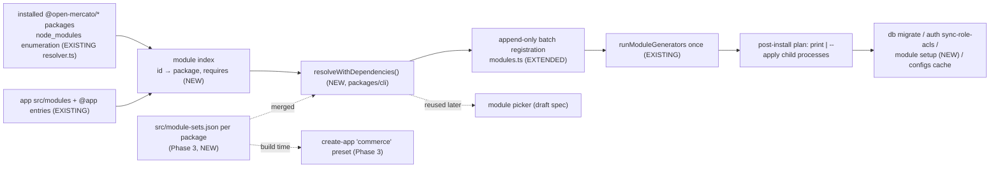

# Module Sets for Standalone Apps — enable a suite of modules in one step

- **Status:** Draft
- **Date:** 2026-09-29
- **Scope:** OSS
- **Owner:** Platform / DX
- **Related:** [`2026-08-14-ecommerce-suite-roadmap.md`](./2026-08-14-ecommerce-suite-roadmap.md) (upstream #5384), [`2026-03-19-checkout-simple-checkout.md`](./2026-03-19-checkout-simple-checkout.md), [`2026-06-09-create-app-module-picker.md`](./2026-06-09-create-app-module-picker.md) (draft), [`implemented/SPEC-065-2026-03-14-official-modules-cli-install-and-eject.md`](./implemented/SPEC-065-2026-03-14-official-modules-cli-install-and-eject.md), [`2026-04-02-empty-app-starter-presets.md`](./2026-04-02-empty-app-starter-presets.md), [`implemented/2026-04-25-auth-sync-role-acls-cli.md`](./implemented/2026-04-25-auth-sync-role-acls-cli.md)

## 📝 TLDR

Today a standalone app that wants the ecommerce suite has to enable each module by hand. The suite was specified in upstream #5384:
- **new modules:** `customer_groups`, `availability`, `pricing`, `cart`, `promotions`, `merchandising`, `ecommerce`;
- **extended modules:** `checkout`, `customer_accounts`, `wms`, `catalog`, `sales`.

`yarn mercato module enable` takes one module at a time and ignores `requires`. Migrations, the ACL sync for existing tenants and tenant setup are all left to the developer.

**Proposed (future behavior), in three phases:**
1. **Multi-module enable.** `module enable` accepts several modules, closes them over `requires` across installed packages and the app's own modules, appends only what is missing to `src/modules.ts`, and runs the generators once.
2. **Post-install.** A new `yarn mercato module setup` replays tenant setup for modules enabled after tenants already exist. `module enable --apply` runs the whole post-install sequence.
3. **Module sets.** A data-only **module set** manifest, contributed by each package that owns members, names a suite's `required`, `recommended` and `optional` members. `module enable --set ecommerce-suite` and a `commerce` preset in `create-mercato-app` both read it. This phase ships only once the suite's P0 + P1 modules are on `develop`.

## Resolved assumptions (defaults — override in review)

The Open Questions gate was answered with the author's recommended defaults. An independent review (see changelog) then revised Q1 and Q4. Each row can still be overridden on the PR.

| # | Question | Answer | Rationale |
|---|---|---|---|
| Q1 | One spec or several? | **One spec, three phases, ordered so that no contract is frozen before it has a real consumer.** Phases 1 and 2 are useful on their own; the manifest and its shared type land only in Phase 3, with real suite members. The reviewer recommended **three separate specs**; the owner kept one spec, but **each phase ships as its own implementation PR**, so each is still reviewed on its own. | Phases 1–2 help any module today. Phase 3 has content only once the suite lands. One document keeps the resolver, post-install and sets contracts consistent. |
| Q2 | Name | **"module set"**; the ecommerce set id is `ecommerce-suite` | "bundle" already means ACL dependency bundles (`2026-05-27-acl-dependency-bundles.md`) and `IntegrationBundle` (`packages/shared/src/modules/integrations/types.ts:136`). The set id must differ from the `ecommerce` module id. |
| Q3 | Relation to the draft module picker | **This spec owns the dependency resolver** (`packages/cli`); the picker reuses it. The picker spec gets a changelog note. | The picker is unimplemented. One resolver avoids two closure algorithms that could disagree. |
| Q4 | Manifest location | **Per package, contributing to a set id:** `packages/<pkg>/src/module-sets.json`, merged across installed packages at read time | A package declares only its own modules. `@open-mercato/checkout` (which depends on core) adds `checkout` to `ecommerce-suite` itself, so no package names a module in a package it doesn't own. |
| Q5 | Optional members | `required` + `recommended` on by default; `optional` only via `--with`; `--without` drops a `recommended` member | The suite's optional peers (`wms`, `pricing`) are optional by ADR-4 and the pricing spec. |
| Q6 | Post-install: run or print | **Print an ordered checklist by default; `--apply` runs it** | `db:migrate` changes the database. A default that only reads is safest. |
| Q7 | Existing tenants | **In scope: `mercato module setup <id…> [--tenant]`** (Phase 2) | Without it, a module enabled in an app with live tenants never runs its `onTenantCreated`. |
| Q8 | When the `commerce` preset ships | **Phase 3, gated on roadmap P0 + P1 modules being on `develop`** | None of the seven new modules is on `develop` yet. |

## 📝 Problem Statement

Evidence is from `develop` @ `12f434927`.

- **One module per call.** `module enable <packageName> [--module <id>]` takes the first non-flag argument as the package (`packages/cli/src/mercato.ts:1416`, `module-install-args.ts:55`). For multi-module packages such as `@open-mercato/core`, `--module` is mandatory (`module-package.ts:299-303`).
- **`requires` is ignored until generation.**
  - `parseModuleInfo` reads only `title`, `description` and `ejectable` (`module-package.ts:57-73`).
  - A missing dependency surfaces later, when the generator exits with `Module dependency check failed … Fix: Enable required module(s) in src/modules.ts`. That check is direct, not transitive.
  - The check is also skipped silently when the index file fails to load (`module-registry.ts:3684-3690`, empty `catch`).
- **Not idempotent.** Re-enabling throws `Module "…" from "…" is already enabled in modules.ts.` (`module-install.ts:234-238`), so a script that enables several modules cannot be re-run.
- **No post-install.** `enable` prints only "Review generated files" and "`yarn dev`" (`mercato.ts:1426-1429`).
  - New `acl.ts` features reach only NEW tenants unless `auth sync-role-acls` runs.
  - A module's `onTenantCreated` is only ever called during tenant creation (`packages/core/src/modules/auth/lib/setup-app.ts:466-470`), and no command replays it across existing tenants. The only replay is a side effect: `auth setup` with an existing user's email and no `--orgSlug` reuses that user and re-runs every module's `onTenantCreated` for that single tenant (`auth/cli.ts:518`), which is not a targeted, per-module backfill.
  - `seed:defaults --module <id>` exists (`mercato.ts:1479-1543`), but nothing points to it.
- **Hard dependencies are about to reach the classic template.**
  - `checkout` is already enabled in the classic template (`packages/create-app/template/src/modules.ts:122`).
  - The Simple Checkout v2 rewrite gives it hard `requires` on `cart`, `sales`, `promotions`, `availability` and `customer_groups` (`2026-03-19-checkout-simple-checkout.md:668`).
  - Once that lands, every existing app with `checkout` fails `yarn generate` until those modules are enabled. That happens today one `--module` at a time, and nothing migrates or sets them up.
- **The suite is not a `requires` graph.** The ecommerce specs link most modules through DI and FK ids, not hard `requires`:
  - "no consumer requires either `wms` or `availability` to boot" (`2026-08-14-availability-contract.md:521`);
  - `catalog`/`sales` "gain no new `requires` entry" (`2026-08-14-customer-groups-and-b2b-terms.md:575`);
  - `pricing` is "new, optional" (`2026-08-21-pricing-engine.md:34`).

  Some edges are hard: `checkout` → `cart`/`promotions`/…, and `cart` → `promotions` (`SPEC-055-2026-02-23-promotions-module.md:1620`). But transitive `requires` never brings in `ecommerce`, `merchandising`, `pricing` or `wms`. Only an explicit list can say what "the suite" is.
- **The suite specs disagree about `availability`.** `checkout-simple-checkout.md:668` lists `availability` as a hard `requires` of `checkout`. `availability-contract.md:520-521` says `checkout` has "no module `requires` edge at all" and that no consumer requires `availability` to boot. This spec does not resolve that. It works either way, because the resolver follows whatever `requires` the modules actually declare. The contradiction is flagged for the owners of those two specs (see [Risks](#-risks--impact-review)).

## 📝 Proposed Solution

1. **Dependency-aware, idempotent multi-module `enable`** (Phase 1):
   - a cycle-safe resolver over `requires` across installed `@open-mercato/*` packages **and** the app's own `src/modules`, including ejected and `@app` modules;
   - an append-only batch registration into `src/modules.ts`;
   - one generator run;
   - a printed post-install checklist.
2. **Post-install** (Phase 2):
   - `mercato module setup` replays `onTenantCreated` (per tenant) and `seedDefaults` (per organization) for named modules, with one forked EM and one transaction per tenant;
   - `--apply` runs the post-install sequence as child processes.
3. **Module sets** (Phase 3, gated):
   - a per-package `src/module-sets.json` contributing members to named sets;
   - `module enable --set`;
   - the `commerce` preset built from the merged set, plus two preset fixes: the menu is derived from data, and `resolvePreset` validates the `requires` closure.

### Alternatives considered

- **Hard `requires` between suite members.** Rejected: it breaks ADR-4 (a storefront must work without `wms`) and the optional `pricing` module.
- **A metapackage.** Rejected: a metapackage can install npm packages but cannot enable modules *inside* a package. Most suite modules live in `@open-mercato/core` (roadmap §3.1), and `checkout` already ships in the classic template, so installing packages is not the gap.
- **A new top-level command (`mercato suite add`).** Rejected: `module enable` already owns "register a module, run generators". One entry point keeps one behavior.
- **A central manifest in `packages/cli` or core naming modules of other packages.** Rejected: the CLI, core and checkout versions drift independently in a standalone app, and core would have to describe a package that depends on it.
- **Sets inside the picker's planned `module-catalog.json`.** Deferred: the picker is unimplemented. When it lands, it reads the same manifests and calls the same resolver.
- **Soft-dependency metadata on `ModuleInfo` instead of a manifest.** Deferred: it would change a public type (`ModuleInfo`). Optional peers are deliberately prose plus `tryResolve` today (`packages/core/AGENTS.md:250`).

### Non-goals

- Disabling or uninstalling modules or sets.
- Installing missing npm packages. The enable fails closed and names the package to add.
- Remote or third-party set catalogs. Only installed `@open-mercato/*` packages are read, the same trust boundary as `--allow-third-party` today (`module-install.ts:133-151`).
- Version-compatibility metadata. `peerDependencies` stay the only compatibility contract (`2026-03-20-official-modules-platform-sync-playbook.md:252`).
- A backoffice UI.
- Replaying `seedExamples`.
- Fixing the generator's silent skip of the `requires` check when an index fails to load. That is noted as a follow-up; this spec's resolver fails loudly instead.

## 📝 Research — how others ship "a suite of modules"

| System | Mechanism | Take | Skip |
|---|---|---|---|
| **Drupal Recipes** (10.3+) | A recipe lists modules + config and is *applied to an existing site*, idempotently | The closest match: applying to an existing install is exactly what a preset alone cannot do | Config-action DSL: our settings come from `setup.ts` |
| **Odoo** | `depends` (hard) + `auto_install` glue modules + app categories | Hard deps resolve transitively at install | `auto_install` bridges: optional peers already use `tryResolve` |
| **Symfony Flex packs** | A pack is a dependency list; a recipe runs post-install steps | Separating *which modules* (manifest) from *what runs after* (post-install plan) | Composer-level install |
| **Magento 2** | `module.xml` `<sequence>` + composer metapackages | Order derived from declared deps, not list position | Metapackages |
| **Medusa v2** | `medusa-config` module list | An explicit opt-in list in app config, which matches `modules.ts` | Plugin marketplace |

The takeaway is that every system separates **membership** (an explicit list), **dependencies** (hard edges, resolved transitively) and **post-install actions** (an ordered, re-runnable script). Phases 3, 1 and 2 map onto those three.

## 📝 Architecture



In short: the resolver answers *what the selected modules need*, and in Phase 3 the manifest answers *what the suite is*. Registration and generation stay the existing code paths, run once per batch. Post-install orchestrates existing commands plus the new `module setup`.

- **Module index.** Built from the existing `node_modules/@open-mercato` enumeration (`packages/cli/src/lib/resolver.ts:402`) and the per-package discovery (`module-package.ts:75-102`, `discoverModulesInPackage`), plus the app's own `src/modules/*`.
  - `requires` is read statically from each module's `index.ts` (published packages ship `src/`), via a small helper extracted from `module-facts.ts`'s `readStringArrayPropertyInitializer`. `module-package.ts` does not import the 4 300-line `module-facts.ts`, and module code is never `require()`d.
  - A `requires` the static reader cannot evaluate (computed or spread from a constant) is **unknown, never empty**. The generator `require()`s `index.ts` (`module-registry.ts` ~3684) and so still sees it. The plan lists the module as "requires unreadable — the generator will verify", and the batch proceeds with the generator as the final gate.
  - An ejected or `@app` module satisfies a `requires` on its id.
- **Generator parity.** The generator is the final gate, and it resolves index files through app overrides (`discovered.resolve('index.ts')`). The resolver applies the same precedence: an app module shadows the package module with the same id. The parity test in Phase 1 enables a batch in a fixture app and runs the real generator.
- **Consumers.** Today there are none; `enable` is single-module. Future consumers are the module picker (`2026-06-09-create-app-module-picker.md`, whose planned `resolveWithDependencies()` at l.244-261 becomes this one) and the Simple Checkout v2 upgrade path (see Risks).

## 📝 Data Model

There is no database schema change. Phase 3 adds one published data file per contributing package, plus the zod schema that validates it.

**`packages/<pkg>/src/module-sets.json`.** It is resolved as `@open-mercato/<pkg>/module-sets.json` through the existing `./*.json → ./src/*.json` export (`packages/core/package.json`). Packages ship `src/`, and `core` has no `files` field, so nothing changes in publishing. For example, core's file:

```jsonc
{
  "version": 1,
  "sets": [
    {
      "id": "ecommerce-suite",
      "title": "Ecommerce suite",
      "description": "B2C/B2B storefront backend: groups & terms, availability, pricing, cart, promotions, merchandising, storefront API.",
      "members": [
        { "id": "customer_groups", "role": "required" },
        { "id": "availability", "role": "required" },
        { "id": "cart", "role": "required" },
        { "id": "promotions", "role": "required" },
        { "id": "ecommerce", "role": "required" },
        { "id": "merchandising", "role": "recommended" },
        { "id": "customer_accounts", "role": "recommended" },
        { "id": "wms", "role": "optional" },
        { "id": "pricing", "role": "optional" }
      ]
    }
  ]
}
```

`@open-mercato/checkout`'s own file contributes `{ "id": "ecommerce-suite", "members": [{ "id": "checkout", "role": "recommended" }] }`. Exactly one package per set id, the set's *owner*, may declare `title`/`description`; a contributor declares members only. Ownership never depends on package enumeration order: a second package declaring `title` or `description` for the same set id fails the read and names both packages. If no owner is installed, the set id is used as the title.

- **Merge at read time.** Members are unioned by set id across installed packages. If two packages give the same module id conflicting roles, the read fails and names both packages.
- **Roles.** `required` members cannot be excluded. `recommended` members are on by default and dropped with `--without`. `optional` members are off by default and added with `--with`.
- **Rules**, enforced by a unit test in each contributing package (`src/__tests__/module-sets.test.ts`):
  1. Every member id exists as `src/modules/<id>/index.ts` **in the declaring package**. A package never names another package's module.
  2. An `optional` member is not hard-required by any `required`/`recommended` member of the same package. Cross-package edges are checked at resolve time (Edge Cases).
  3. Set ids are unique within the file and never equal a module id of the declaring package.
  4. `version` is `1`. A reader rejects unknown versions with a clear message.
- **Membership grows with the code.** `ecommerce-suite` is introduced by the first suite module PR after Phase 3's machinery exists. **Every later suite-module PR MUST add its own member entry**, and rule 1 makes a premature entry fail CI. The example above is the target shape, not initial content.

## 📝 API Contracts (CLI)

All changes are additive to the CLI contract surface (`BACKWARD_COMPATIBILITY.md` → CLI commands). Today's single-module invocation keeps its arguments, output, failure behavior and "already enabled" error.

### `yarn mercato module enable`

```text
# existing form (unchanged); --module now also accepts a comma list (Phase 1)
yarn mercato module enable <packageName> --module <id>[,<id>…] [--eject] [--allow-third-party] [--dry-run] [--apply] [--yes]
# Phase 3
yarn mercato module enable --set <setId> [--with <id>[,…]] [--without <id>[,…]] [--dry-run] [--apply] [--yes]
```

**Parser.** `enable` currently takes the first non-flag argument as the package (`mercato.ts:1416`), so `--set <id>` would be mis-read. Phase 1 reworks `parseModuleInstallArgs` into an explicit flag parser. Value-taking flags (`--module`, `--set`, `--with`, `--without`) consume their values before the positional package is picked up.

**Routing.** `--module cart` is both the legacy form and a one-element list, so the parser routes explicitly:
- A single id with none of the new flags takes the **legacy path**, byte-for-byte unchanged: no closure, no plan, same output and errors.
- A comma list, `--set`, **or** any of `--dry-run`/`--apply`/`--yes` selects the batch flow. `--module cart --dry-run` is the way to get the closure for one module.

**Batch flow**, used by every form that routing sends to the batch path:
1. **Select.**
   - With a comma list: the named modules of the given package.
   - With `--set`: the merged set's `required ∪ recommended ∪ --with − --without`.
   - `--without` on a `required` member fails, and so does `--with` on a non-`optional` member or a non-member.
2. **Close over `requires`** with `resolveWithDependencies()`.
   - Cycles fail with their path.
   - A missing target fails: `module "<id>" (required by <parent>) is not provided by any installed @open-mercato/* package or the app — add the package that ships it`.
   - An ambiguous id (two packages) fails and names both.
   - If the closure pulls back in a member excluded by `--without`, the command fails, because the exclusion cannot hold.
3. **Diff against `src/modules.ts`** with the existing `modules-config.ts` AST reader.
   - A module registered in *any* `enabledModules.push(...)` counts as registered **regardless of the current env**. It is never duplicated into the literal, which would make the next registration throw "registered multiple times" (`modules-config.ts:377-381`). The plan marks it "enabled (conditional)".
   - A module registered from a different `from` (e.g. `@app` after eject) counts as enabled, is never re-registered, and gets a warning.
4. **Print the plan and confirm.** The plan has three groups: *to add*, *pulled in by `requires`* (each with its requiring parent), and *already enabled* (skipped). On a TTY it asks for confirmation unless `--yes`; on a non-TTY without `--yes` it prints the plan and exits non-zero. `--dry-run` stops after the plan with exit 0.
5. **Append only the new entries** to the end of the `enabledModules` literal, in dependency order (dependencies first). Existing entries, their order and their comments are never touched.
   - This needs an append-only edit instead of `replaceArrayLiteral`'s whole-array rewrite (`modules-config.ts:332-351`), which drops comments.
   - The original file is kept in memory and restored if generation fails. A partial generator run may already have rewritten `.mercato/generated/*`, so after restoring the file the generators run once more against it. If that run also fails, today's stale-artifacts notice is printed ("rerun `yarn mercato generate`").
6. **Run the generators once** (`runModuleGenerators`, `module-install.ts:98-117`).
7. **Post-install:** print the checklist, or run it with `--apply`.

**Failure-behavior difference, documented.** On a generation failure, the single-module form keeps its current behavior: the entry stays and a stale-artifacts notice is printed (`module-install.ts` ~120-127). The batch forms restore `modules.ts` instead, because a half-applied batch is harder to reason about than a single entry.

### Post-install plan (`--apply`, Phase 2)

Each step runs as a **child process** (`yarn mercato …`), so it bootstraps against the freshly generated registries rather than the ones cached in the enabling process. Steps run in this order and stop at the first failure, printing the failed step and the command to resume from. Every step is idempotent, so re-running `--apply` is the recovery path.

| # | Step | When |
|---|---|---|
| 1 | `mercato db migrate` | any added module ships `migrations/`. This applies **every** pending migration in the app, not only the added modules' own, and the plan says so before confirmation. Scoping migrations per module is a non-goal |
| 2 | `mercato auth sync-role-acls` | any added module declares `acl.ts` features |
| 3 | `mercato customer_accounts sync-customer-role-acls` | `customer_accounts` is enabled and an added module declares `defaultCustomerRoleFeatures` |
| 4 | `mercato module setup <added ids…>` | any added module's `setup.ts` has `onTenantCreated` or `seedDefaults` |
| 5 | `mercato configs cache structural --all-tenants` | always, last |

### `yarn mercato module setup` (new, Phase 2)

```text
yarn mercato module setup <moduleId>[ <moduleId>…] [--tenant <tenantId>] [--skip-seed] [--dry-run]
```

Semantics match tenant creation, so a backfilled tenant ends up like a new one:
- **Per tenant:** `onTenantCreated({ em, tenantId, organizationId })` is called **once**, with the tenant's primary organization. That is the oldest non-deleted root organization, which is what `setupInitialTenant` creates (`setup-app.ts:466-470`).
- **Per organization of that tenant:** `seedDefaults({ em, tenantId, organizationId, container })` runs, as `seed:defaults` does (`mercato.ts:1479-1543`), unless `--skip-seed`. It is followed by one `ensureCustomRoleAcls`.
- **Isolation:** unlike `seed:defaults`, which shares one `em` across all organizations, every tenant runs on a **forked EM inside its own transaction**. If one tenant fails, its work rolls back, is logged with tenant and module, and does not leak into the next tenant's flush. The run continues and exits non-zero with a summary.
- **Filtering:** modules that are not enabled or have no `setup.ts` are reported and skipped.
- **Order:** hooks run in dependency order across the named modules.
- **`seedExamples`:** never run.
- **Idempotency contract:** `onTenantCreated` is already a MUST-be-idempotent hook (`packages/onboarding/AGENTS.md:54`). This spec extends that MUST to `seedDefaults` of any module that is a member of a module set. It is enforced by the Phase 2 DB integration test, which runs `module setup` twice on a two-tenant fixture and asserts identical row counts. A fake EM would prove nothing here: `seedDefaults` needs a real EM, a container and DI (`packages/shared/src/modules/setup.ts:13`).

## 📝 UI/UX

- **Plan output:** three labelled groups with counts. Each pulled-in module names its requiring parent ("`progress` ← required by `customers`"), and conditional registrations are marked.
- **create-app preset menu (Phase 3):** entries come from `STARTER_PRESETS` instead of the hard-coded `PRESET_PROMPT_OPTIONS` (`packages/create-app/src/index.ts:159-164`) and the "classic, empty, crm, or wms" strings (l.57, 176). Existing numbering and wording are kept, and `commerce` is appended.

## 📝 Edge Cases & Failure Scenarios

| Scenario | Behavior |
|---|---|
| A set member's package is not installed (`@open-mercato/checkout`) | Its contributions are simply absent from the merged set. If a *present* member hard-requires it, step 2 fails before any write: "`checkout` … not provided — add `@open-mercato/checkout`" |
| A `requires` target is provided by no package and no app module | Fails before any write, naming the target and its requiring parent |
| Two packages ship the same module id | Fails before any write, naming both (an app module shadowing a package module is not ambiguous) |
| A cross-package `optional` member is hard-required by a selected member | The resolver pulls it in and the plan labels it "pulled in by `requires`". Its optional role cannot be honoured, and the plan says why |
| `requires` cycle | Fails before any write, with the cycle path |
| `src/modules.ts` has no parseable `enabledModules` literal | Fails before any write, with the existing `modules-config.ts` error |
| Generation fails after the append | The batch forms restore `modules.ts`, re-run the generators against it, and show the generator output. If that re-run fails too, the stale-artifacts notice is printed |
| A module's `requires` cannot be read statically | Treated as unknown, not empty: the plan flags it and the generator verifies it |
| Two packages declare `title`/`description` for one set id | Fails with both packages named |
| A migration fails in `--apply` | Stops at step 1. `modules.ts` stays updated (generation succeeded). Resume with `--apply` |
| `module setup` fails for one tenant | That tenant's transaction rolls back. The run continues with the other tenants and exits non-zero with a summary. Re-running is safe |
| Standalone app on a package version without `module-sets.json` | `--set` reports "no package publishes set `<id>`". Phases 1–2 are unaffected |
| `module-sets.json` with an unknown `version` | Fails with "module-sets.json version N is newer than this CLI understands — upgrade @open-mercato/cli" |
| Conflicting roles for one module across contributing packages | Fails with both packages named |

## 📝 Risks & Impact Review

| Risk | Severity | Affected | Mitigation | Residual |
|---|---|---|---|---|
| **Simple Checkout v2 gives `checkout` hard `requires`, and `checkout` is already in the classic template**, so every existing app breaks at `yarn generate` | **High** | all standalone apps with `checkout` | Coordinate with the checkout spec's owner. The checkout rewrite MUST NOT land before this spec's Phase 1 + 2. Its upgrade note then reads `yarn mercato module enable @open-mercato/core --module cart,promotions,availability,customer_groups --apply`. Whether those modules then also enter the classic template, which means new AI-harness cases (`module-facts-build.test.ts:228`), is the checkout spec's decision | The classic template may grow |
| The suite specs contradict each other on `checkout` → `availability` (`checkout-simple-checkout.md:668` vs `availability-contract.md:520-521`) | Medium | suite design | Flagged for both spec owners. This spec is neutral: the resolver follows the declared `requires` | Needs an owner decision |
| A `seedDefaults` that is not idempotent duplicates reference data in `module setup` | High for affected tenants | tenants | The MUST covers set members, enforced by the double-run DB test. Other modules replay only when named explicitly. `--dry-run` lists what would run | Non-set modules rely on the author |
| New CLI flags, a new `module setup` command, a new per-package JSON file and a new shared type become contract surface | Medium | third-party tooling | All additive. The existing invocation, output and errors are unchanged. The manifest and type land in Phase 3, with real consumers. Documented in the CLI docs and `UPGRADE_NOTES.md` | — |
| `--apply` makes the CLI run migrations | Medium | app databases | Never the default. The plan is confirmed first, and it uses the same `mercato db migrate` the app already runs | — |
| A manifest drifts from the suite | Low | Phase 3 | Rule 1 fails CI on removed modules, and "every suite-module PR adds its entry" is recorded in the roadmap's module inventory when the first member lands | A forgotten *new* member stays silent until someone notices |
| Resolver and generator disagree on `requires` | Low | enable | Same override precedence, a parity test with the real generator, and the generator stays the final gate | The generator's silent skip on load errors remains (non-goal, follow-up) |

## 📋 Phasing

| Phase | Ships | Useful on its own because | Gate |
|---|---|---|---|
| **1 — Resolver + multi-module `enable`** | Module index (packages + app), `resolveWithDependencies()`, flag-parser rework, comma list, append-only batch registration, plan/`--dry-run`/`--yes`, printed checklist | Any multi-module enable, including the Simple Checkout v2 upgrade, works in one idempotent step | CLI unit tests + fixture-app integration test with the real generator green |
| **2 — Post-install** | `mercato module setup`, `--apply` (child processes), the idempotency MUST + DB test | Enabling in an app with live tenants becomes complete | Two-tenant DB integration test green |
| **3 — Module sets + `commerce` preset** | Shared manifest schema, per-package `src/module-sets.json` + rules test, `--set/--with/--without`, preset from the merged set, data-driven preset menu, `requires` closure in `resolvePreset` | New and existing apps get the suite by name | Roadmap P0 + P1 modules on `develop`; `yarn test:create-app` with `--preset commerce` green |

## 📋 Implementation Plan

### Phase 1 — Resolver + multi-module `module enable`

1. **Static `requires` reader.** Extract `readStringArrayPropertyInitializer` from `packages/cli/src/lib/generators/module-facts.ts` into `packages/cli/src/lib/module-metadata-reader.ts`. `module-facts.ts` and `module-package.ts` (`parseModuleInfo` gains `requires`) both use it. Unit tests: fixture `index.ts` with and without `requires`, and a `metadata` object spread from a constant (unsupported → `null` + warning, which the resolver treats as *unknown*, never as no dependencies).
2. **Module index.** Add `packages/cli/src/lib/module-index.ts`: package modules (via `resolver.ts:402` enumeration + `discoverModulesInPackage`) and app `src/modules/*`, with app-shadows-package precedence and duplicate detection. Unit tests with fixture roots.
3. **Resolver.** Add `packages/cli/src/lib/module-resolver.ts` with `resolveWithDependencies(selection, index)`: closure, cycle path, missing target, ambiguity, dependency-ordered output. Unit tests: diamond, cycle, cross-package edge, app-module satisfaction, missing target.
4. **Append-only registration.** In `modules-config.ts`, add `appendModuleRegistrations(path, entries[])`, which inserts after the last element without rewriting existing ones. Registrations in conditional `push` statements are detected regardless of env, and a rollback handle is returned. `ensureModuleRegistration` keeps its behavior. Unit tests: comments preserved, order preserved, a conditional push not duplicated.
5. **Parser + CLI.** Rework `module-install-args.ts` into an explicit flag parser (Phase 3's `--set/--with/--without` are reserved now and rejected as "not yet available"). Add the comma list, `--dry-run`, `--yes`, the plan printer, the TTY confirm and the printed checklist, and update the help text. Unit tests on parsing and routing (a single id without new flags stays on the legacy path). A CLI integration test next to `packages/cli/src/lib/__integration__/TC-INT-007.spec.ts` enables `--module a,b` in a scaffolded fixture app (one pulled in by `requires`), asserts `modules.ts` byte-for-byte outside the appended block, runs the real `yarn generate` (parity), and re-runs to prove idempotency.
6. **Docs.** Update `packages/cli/AGENTS.md`, the CLI docs page, and a changelog note in `2026-06-09-create-app-module-picker.md` pointing its resolver at `packages/cli`.

### Phase 2 — Post-install and `module setup`

1. **`mercato module setup`.** Tenant iteration with forked EM + transaction per tenant, primary-organization `onTenantCreated`, per-organization `seedDefaults`, `ensureCustomRoleAcls`, summary, `--dry-run`/`--skip-seed`. Unit tests with a fake EM cover ordering and error aggregation only.
2. **`--apply`.** Derive the plan from the added modules (migrations dir, `acl.ts`, `setup.ts`, customer role features) and run each step as a child process, stopping on failure with a resume hint. Unit tests on plan derivation.
3. **DB integration test** (testcontainers, as the CLI already uses). On a two-tenant fixture: `module enable --module … --apply` creates the settings rows for both tenants, and a second run changes no row counts. This test also carries the idempotency MUST for set members once Phase 3 exists.
4. **Docs.** CLI docs, `UPGRADE_NOTES.md`, and the `packages/onboarding/AGENTS.md` idempotency note.

### Phase 3 — Module sets + `commerce` preset (gated on roadmap P0 + P1)

1. **Shared schema.** Add `packages/shared/src/modules/module-sets.ts` (zod schema + inferred types, `@open-mercato/shared/modules/module-sets`). Unit tests: valid file, unknown version, duplicate ids, bad role, contributor with `title`.
2. **Manifests.** Add `packages/core/src/module-sets.json` with `ecommerce-suite` and only the members present on `develop`, plus `src/__tests__/module-sets.test.ts` (rules 1–4). Add the same pair to `packages/checkout` for its `checkout` member. Add the rule to the roadmap's module inventory.
3. **`--set`.** Merge manifests from the module index, select via roles, reuse the Phase 1 batch flow. Unit tests on merging and role conflicts. The integration test extends Phase 1's with a fixture set.
4. **Preset menu from data.** Derive the menu and the help/error strings from `STARTER_PRESETS`, keeping existing numbering. Unit test: every preset listed once, classic stays the default.
5. **`requires` closure in `resolvePreset`.** Use the Phase 1 resolver against the template's bundled packages, replacing the regex test at `apply-starter-preset.test.ts:441-473`. That test already proves direct-dependency closure for every enabled module; the resolver adds cross-package precedence and a clearer error.
6. **`commerce` preset.** `extends: 'empty'`, with `modules.add` generated at create-app build time from the merged `ecommerce-suite` (`required ∪ recommended`, closed under `requires`). The build fails if the set is missing. Unit test on the generated list. Integration: `yarn test:create-app` with `--preset commerce` scaffolds, installs, generates and boots.

### Test coverage summary

- **Unit tests:**
  - metadata reader, module index, resolver;
  - append-only registration, parser, plan derivation;
  - `module setup` ordering and aggregation;
  - schema, manifest rules, set merge;
  - preset menu, generated preset list.
- **Integration tests (all fixtures self-contained):**
  - CLI multi-module enable on a scaffolded fixture app with the real generator (Phase 1);
  - `--apply` + `module setup` on a two-tenant testcontainers DB, run twice (Phase 2);
  - `--set` on a fixture set (Phase 3);
  - `create-mercato-app --preset commerce` scaffold → generate → boot (Phase 3).
- **API and UI paths:** none affected. This is CLI and scaffolding only; module behavior is covered by each module's own spec.

## 📋 Final Compliance Report

| Check | Result |
|---|---|
| Module naming / no cross-module ORM | ✅ No entities; modules are referenced by id only |
| Tenant/org scoping | ✅ `module setup` iterates tenants explicitly and runs each in its own transaction on a forked EM |
| Contract surfaces (`BACKWARD_COMPATIBILITY.md`) | ✅ Additive only. CLI flags and the new command, a new shared type (Phase 3), and a new package JSON file resolved through the existing `./*.json` export. The existing single-module behavior is unchanged |
| Generated files | ✅ Generators run through the existing `runModuleGenerators`; no generated file is edited by hand |
| Migrations | ✅ None introduced. `--apply` runs existing `db migrate`, and only on explicit opt-in |
| Integration coverage listed | ✅ See Test coverage summary |
| Optional peers stay soft | ✅ No new `requires` edges; optionality lives in the manifest |

## Changelog

### 2026-09-30 (rev 3 — specification self-review applied)
- **Set ownership:** exactly one package may declare a set's `title`/`description`, and a second declaration fails. Ownership no longer depends on package enumeration order.
- **Batch rollback:** after restoring `modules.ts`, the generators re-run so `.mercato/generated` matches it. If that fails, the stale-artifacts notice is printed.
- **Parity:** a `requires` the static reader cannot evaluate is unknown, not empty. The plan flags it, and the generator (which `require()`s `index.ts`) verifies it.
- **Routing:** a single `--module` id with no new flags keeps the legacy path. A comma list, `--set` or `--dry-run`/`--apply`/`--yes` selects the batch flow.
- **`--apply`:** the plan discloses that `db migrate` applies every pending migration.
- **Q1:** resolved as one spec with one implementation PR per phase.
- **Precision:** noted the single-tenant `onTenantCreated` replay side effect of `auth setup` on user reuse.

### 2026-09-29 (rev 2 — independent review applied)
- **Phases reordered:** resolver + multi-module enable → post-install → sets + preset. The manifest and its shared type no longer freeze in Phase 1 without content. The reviewer's three-spec split is recorded under Q1 for the owner.
- **Manifest placement and ownership:**
  - The manifest moves to `packages/<pkg>/src/module-sets.json`, resolved via the existing `./*.json` export. The rev-1 "add to `files`" would have dropped `src/` and `dist/` from core's tarball.
  - Manifests are per package, contributing to a set id, so core no longer names `checkout` (its reverse dependency).
  - The set is renamed `ecommerce-suite`, since rev 1 broke its own "set id ≠ module id" rule.
- **Simple Checkout v2:** added the risk that its hard `requires` break every classic app with `checkout`, with this spec's Phases 1–2 as the upgrade path and a sequencing constraint.
- **`module setup`:** a forked EM and transaction per tenant; `onTenantCreated` once per tenant with the primary organization, matching `setup-app.ts`; `seedDefaults` per organization.
- **Idempotency check:** moved from a unit test to the Phase 2 DB integration test.
- **Registration:**
  - append-only, preserving existing entries, order and comments;
  - conditional `push` registrations detected regardless of env;
  - app and `@app` modules satisfy `requires`, with generator override precedence mirrored;
  - `--apply` steps run as child processes;
  - a flag-parser rework is made explicit.
- **Suite specs:** surfaced the `checkout` → `availability` contradiction between them, and defined how `--without` fails against the `requires` closure.
- **Corrections:** fixed `mercato.ts` line references, attributed `module-package.ts:75-102` to `discoverModulesInPackage`, and softened the claim about the preset regex test.

### 2026-09-29
- Initial specification. Open Questions Q1–Q8 resolved with the author's recommended defaults.
- Grounded against `develop` @ `12f434927`: `packages/cli` module install, `packages/create-app` presets, and the ecommerce suite specs from upstream #5384.
