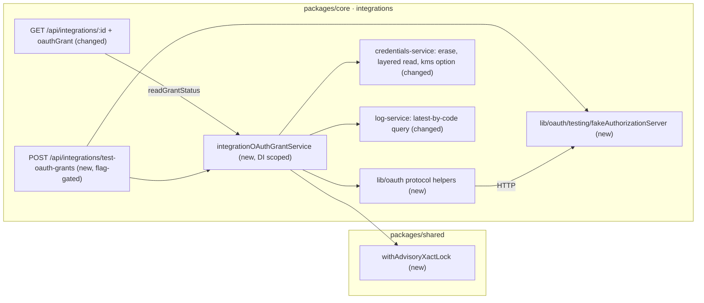

# OAuth2 Grant Lifecycle — Phase 1 Core (feature spec)

> **Parent:** [App Spec: OAuth2 Grant Lifecycle for Integrations](2026-09-27-app-spec-oauth2-grant-lifecycle.md). **Status:** Draft, ready for implementation; the implementation PR's merge waits for App Spec Q3 and Q7. **Baseline:** `develop` @ `4bdabd8bb`; every `file:line` below was checked against it.

## TLDR

- This is the implementation contract for App Spec Phase 1: one PR, **12 commits** (P1a, P1b, P2a, P2b, P3, P4a–P4e, P5, P6).
- It fixes the *how*: the TypeScript contracts, the per-operation mechanics (lock fork, DEK pin, layered read, refresh and disconnect algorithms), the test-only route and fixtures, the real-Postgres test infrastructure, the labelled acceptance criteria and the commit-by-commit plan.
- No migration, no new production route, no new ACL feature, no production dependency, no new CI job: the real-Postgres suites run as steps of the existing `documents-multi-instance` job.

## Overview

The App Spec is the single source of truth and **wins on any conflict**. This spec does not restate its decisions; it links to them:

| Topic | Owned by |
|---|---|
| Ubiquitous language, entities, blob fields, invariants I1–I7, Revision rule | App Spec §1.3, §1.4.2 |
| Descriptor fields, protocol helpers, provider route contract (rules 1–11) | App Spec §1.4.3 |
| Signals, log codes and levels, health codes and precedence | App Spec §1.4.4 |
| Failure contract (Token Provider, Connect Failures, `replaceUnreadable`, grant writes) | App Spec §1.4.5 |
| Rotation semantics and accepted residual risks | App Spec §1.4.6 |
| Workflows WF1–WF5, banner and provider-tab states | App Spec §3, §3.5 |
| Commit list and scores, placement, library choice, SSO boundary | App Spec §4.1, §4.5 |
| Acceptance (domain and business criteria), phasing, contract surfaces and sign-off | App Spec §7, §10.1 |
| Cross-spec conflicts, including the superseded SPEC-045a §8 (OAuth credential type, refresh worker, reauth flag) | App Spec §8 |
| Rejected alternatives R1–R16 | App Spec §11 |

## Problem Statement

App Spec Phase 1 decides what the grant-lifecycle core guarantees. Implementing it needs decisions the App Spec leaves to this document:
1. exact signatures for every new and changed export, so the §10.1 sign-off reviews a concrete surface;
2. the mechanics that make I1, I2 and I6 hold on MikroORM 7.1.14 and the platform KMS (the fork options, where the DEK is resolved, how the read tells the encryption layers apart);
3. how DB-bound criteria run against real Postgres in CI for `packages/shared` and `packages/core`: both have suites gated on an externally provided database URL (`OM_COUNT_CAP_PG_URL`, `OM_QUERY_INDEX_PG_URL`, e.g. `shared/src/lib/query/__tests__/count-cap-plan.test.ts:17-18`, `core/src/modules/query_index/__tests__/doc-storage-count.pg.test.ts:16-17`) that no workflow runs, and the only `testcontainers` suite CI runs is `packages/documents` (`OM_DOCUMENTS_MULTI_INSTANCE_INTEGRATION`, its `test:multi-instance` script and the `documents-multi-instance` job). The new suites follow the documents convention, because the URL-gated ones need a database no CI job provides;
4. a test harness for a real OAuth round trip: existing OAuth unit tests stub `global.fetch`, and channel E2E specs skip because "provider mock seams are process-local" (`channel-imap/.../__integration__/TC-CHANNEL-EMAIL-028.spec.ts:18`);
5. a commit order in which every commit builds, tests itself and leaves the app working.

## Proposed Solution

Implementation-level decisions (the product decisions are the App Spec's):

| Decision | Rationale |
|---|---|
| DB-bound criteria run as **Jest real-Postgres** suites (`testcontainers`), not Playwright | Concurrency, pool starvation, rollback and KMS faults need in-process control of pools, clocks and collaborators. Playwright covers only what the app renders: the `oauthGrant` field and the banner. |
| The grant service takes its collaborators from its factory: token and revoke client, clock, KMS service, post-release log writer | Tests replace them; production code has no fault flag and no test seam. |
| The lock `fn` **returns an outcome**; the service throws after the lock transaction commits | A throw inside `fn` rolls back, which would drop an invalidation or a failure diagnostic that §1.4.5 requires to persist. |
| The transient-DB matcher is **exported** from the lock-helper module as `isTransientLockDbError` | The grant service must classify DB errors raised inside `fn` (its own flush, `txEm.execute`) exactly like the helper classifies its own; a second copy would drift. It lives at the already listed path `@open-mercato/shared/lib/db/advisoryLock` (§10.1 sign-off covers the module). |
| The descriptor, the owner, the closed unions and `OAuthGrantError` / `OAuthDescriptorError` live in `lib/oauth/descriptor.ts`; every other contract export sits in another §10.1 file (`token-endpoint.ts`, `grant-service.ts`, `health.ts`, …) | Every contract symbol stays inside the exact file paths App Spec §10.1 lists. The internal helpers (`grant-blob.ts`, `pin-tenant-dek.ts`) resolve through core's `./*` export (`packages/core/package.json:150-156`) but are not contract surfaces: their exports carry `@internal` JSDoc and the BC section excludes them. |
| Concurrent lock holders per process are capped by the lock helper's `maxConcurrentHolders` (the grant service passes 4) | Each holder keeps one extra pooled connection for up to the 10 s token exchange (App Spec I6); with a pool of 20, four holders leave 16 connections to everything else. Waiting for a slot holds no connection and counts against the waiter deadline. |
| The fake authorization server runs in-process (Jest) and inside the app's web process behind the test-only route (Playwright) | App Spec R12. One implementation serves both. |

## Architecture



Nothing existing calls the new service; the detail GET is the only always-on path (one id-only lookup).

### File map

All `integrations/…` paths are under `packages/core/src/modules/integrations/`.

| File | Action | Commit |
|---|---|---|
| `packages/shared/src/lib/db/advisoryLock.ts` (+ `__tests__/advisoryLock.test.ts`) | Create | P1a |
| `packages/shared/package.json` (`exports["./lib/db/advisoryLock"]`), `packages/shared/AGENTS.md` (`db/` row) | Modify | P1a |
| `packages/shared/src/lib/db/__tests__/advisoryLock.integration.test.ts`, `packages/shared/package.json` (script, devDependencies), `.github/workflows/ci.yml` (step in `documents-multi-instance`) | Create / Modify | P1b |
| `integrations/lib/oauth/{token-endpoint,pkce,authorization,redirect,resource-challenge,descriptor}.ts` (+ tests) | Create | P2a |
| `integrations/lib/oauth/testing/fakeAuthorizationServer.ts`, `packages/core/src/helpers/integration/oauthGrantFixtures.ts` | Create | P2b |
| `integrations/lib/credentials-service.ts`, `integrations/lib/log-service.ts` (+ tests), `packages/core/package.json` (script, devDependencies), `.github/workflows/ci.yml` (core step) | Modify | P3 |
| `integrations/api/post/test-oauth-grants/route.ts`, `integrations/integration.ts` (with the route, the App Spec §7 minimal test provider), `packages/core/src/helpers/integration/oauthGrantTestRoute.ts` | Create | P4a |
| `packages/cli/src/lib/testing/integration.ts` (both env blocks), `.github/workflows/ci.yml` (runner env) | Modify | P4a |
| `integrations/lib/oauth/{grant-service,grant-blob,pin-tenant-dek}.ts`, `integrations/di.ts` | Create / Modify | P4b |
| `integrations/__tests__/support/pgTestOrm.ts`, `integrations/lib/oauth/__tests__/*.integration.test.ts` | Create | P4b–P4e |
| `integrations/lib/oauth/health.ts` | Create | P4d |
| `integrations/api/[id]/credentials/route.ts` (404 for `…__oauth_grant` ids) | Modify | P4e |
| `integrations/api/[id]/route.ts`, `integrations/backend/integrations/[id]/page.tsx`, `integrations/components/OAuthGrantReauthBanner.tsx`, `integrations/i18n/{en,pl,de,es,ko}.json`, `packages/shared/src/modules/integrations/types.ts`, `integrations/integration.ts` (`connectTabId`) | Modify / Create | P5 |
| `integrations/__integration__/TC-INT-OAUTH-00{1,2}-*.spec.ts` | Create | P5 |
| `apps/docs/docs/framework/modules/integrations-oauth-grants.mdx`, `apps/docs/sidebars.ts`, `integrations/AGENTS.md`, `BACKWARD_COMPATIBILITY.md`, `.ai/qa/AGENTS.md`, `scripts/check-oauth-publish-shape.mjs`, `.github/workflows/ci.yml` (check step) | Create / Modify | P6 |

## Data Models

No schema change and no migration. The grant row and its fields are App Spec §1.4.2. Encoding in `grant-blob.ts` (`oauthGrantBlobSchema`, zod, internal):
- `version: 1`; datetimes as ISO-8601 UTC strings; `grantedScopes: string[]`; `providerData` and `previousProviderData` as `Record<string, unknown> | null`.
- Required by the schema: `version`, `status`, `accessToken`, `expiresAt`, `tokenType`, `clientId`, `obtainedAt`, `refreshCount`, `revisedAt`; `invalidatedReason` and `invalidatedAt` when `status = 'invalidated'`. `refreshToken` is optional (`requiresRefreshToken` is checked at Connect only).
- Unknown keys are stripped. Readers accept every `version` ≤ the current one.
- `expiresAt` comes from `expires_in` (a number or a numeric string), else `defaultAccessTokenTtlSec`. `tokenType` is compared case-insensitively; a missing `token_type` counts as `Bearer`.
- Lock key: `oauth_grant:${integrationId}:${tenantId}:${organizationId}:${userId ?? '-'}`, frozen for every existing Grant Owner (App Spec §8, §10.1); grant row id `${integrationId}__oauth_grant` (App Spec §10.1, persisted formats).
- The `__oauth_grant` suffix is reserved: the admin credentials route answers 404 for any id ending in it, even when an integration with such an id is registered (`registerIntegrations` accepts any id, `shared/src/modules/integrations/types.ts:234-239`; the route checks only `getIntegration`, `integrations/api/[id]/credentials/route.ts:85-88,139-142`).

## API Contracts

Everything below is server-only. No `.tsx` imports `integrations/lib/oauth` (decoupling test, P4e).

### Lock helper — `@open-mercato/shared/lib/db/advisoryLock` (P1a)

```ts
import type { EntityManager } from '@mikro-orm/postgresql'

export type AdvisoryLockWaitResult<T> = { done: true; value: T } | { done: false }

export type AdvisoryLockOptions<T> = {
  /** Total waiting budget from the call start. Default 15_000. */
  waitDeadlineMs?: number
  /** Called after each failed attempt, with no connection held; `done: true` short-circuits. */
  onWait?: () => Promise<AdvisoryLockWaitResult<T>>
  /** Per process and key namespace: at most this many lock transactions at once (attempts included).
   *  Waiting for a slot holds no connection and counts against `waitDeadlineMs`. Default: unlimited. */
  maxConcurrentHolders?: number
}

export class AdvisoryLockUnavailableError extends Error {
  readonly reason: 'deadline' | 'transient_db'
  readonly key: string
}

/** What `isTransientDbError` (shared/src/lib/db/pg-errors.ts:137, unchanged) matches, plus SQLSTATE
 *  55P03 (`DB_LOCK_TIMEOUT_MS`), 57014 (`DB_STATEMENT_TIMEOUT_MS`, opt-in), 25P03
 *  (`idle_in_transaction_session_timeout`), the pg-pool acquire timeout ("timeout exceeded when trying
 *  to connect") and node-postgres's "Client has encountered a connection error and is not queryable",
 *  walking `cause` and `previous` with the existing chain walker (`pgErrorCandidates`, pg-errors.ts:24).
 *  Implemented in `pg-errors.ts` and re-exported from this module. */
export function isTransientLockDbError(error: unknown): boolean

/**
 * Runs `fn` in one transaction that holds `pg_try_advisory_xact_lock(hashtextextended(key, 0))`.
 * - `key` is `<namespace>:<parts>` with namespace `^[a-z][a-z0-9_]*$`; anything else throws `TypeError`.
 * - Pass the request (container) EntityManager. The helper forks it with
 *   `{ disableContextResolution: true, clear: true, useContext: false, cloneEventManager: true }`.
 * - `fn` MUST do all DB I/O on `txEm`, MUST flush its own writes, MUST be bounded (≤ one external
 *   call), MUST NOT call `transactional` again (it only opens a savepoint in the lock transaction) and
 *   MUST NOT fork or use `getConnection().execute` (another pooled connection, outside the lock).
 * - `txEm` carries the request EntityManager's subscribers (cloned event manager).
 * - Errors from the helper's own begin, lock query and commit that `isTransientLockDbError` accepts,
 *   and the deadline, throw `AdvisoryLockUnavailableError`; any other error from them, and every
 *   error thrown by `fn` or `onWait`, propagates unchanged (a throw from `fn` rolls back).
 */
export function withAdvisoryXactLock<T>(
  em: EntityManager,
  key: string,
  fn: (txEm: EntityManager) => Promise<T>,
  options?: AdvisoryLockOptions<T>,
): Promise<T>
```

### Protocol helpers — `@open-mercato/core/modules/integrations/lib/oauth/*` (P2a)

```ts
// token-endpoint.ts
export type OAuthClientAuthMethod = 'client_secret_basic' | 'client_secret_post'
export type OAuthClientCredentials = { clientId: string; clientSecret: string; authMethod: OAuthClientAuthMethod }
export type OAuthTokenEndpointResponse = {
  accessToken: string
  tokenType: 'Bearer'
  expiresInSec: number | null
  refreshToken: string | null
  scope: string[] | null
}
export type OAuthTokenEndpointErrorKind = 'protocol' | 'network' | 'timeout' | 'invalid_response'  // OAuthTokenEndpointError.kind
export class OAuthTokenEndpointError extends Error {
  readonly kind: OAuthTokenEndpointErrorKind
  readonly status: number | null
  readonly error: string | null              // RFC 6749 §5.2 `error`
  readonly errorDescription: string | null
  /** A 2xx whose access-token part is unusable but which carries a `refresh_token` (App Spec §1.4.5, anti-corruption). */
  readonly salvagedRefreshToken: string | null
}
export const OAUTH_RESPONSE_MAX_BYTES = 65_536
/** Form POST; `client_secret_basic` form-urlencodes id and secret before base64 (RFC 6749 §2.3.1).
 *  `timeoutMs` is clamped to ≤ 10_000 and covers `fetch` and the body read. */
export function requestTokenEndpoint(input: {
  url: string; client: OAuthClientCredentials; params: Record<string, string>
  timeoutMs?: number; signal?: AbortSignal
}): Promise<OAuthTokenEndpointResponse>
/** RFC 7009; 200 is success, including for an unknown token. `timeoutMs` clamped to ≤ 8_000. */
export function revokeToken(input: {
  url: string; client: OAuthClientCredentials; token: string
  tokenTypeHint?: 'refresh_token' | 'access_token'; timeoutMs?: number; signal?: AbortSignal
}): Promise<void>

// pkce.ts
export function createPkcePair(): { codeVerifier: string; codeChallenge: string; method: 'S256' }

// redirect.ts — throws OAuthGrantError('oauth_base_url_not_configured' | 'connect_origin_rejected')
export function resolveOAuthRedirectUri(req: Request | undefined, path: string): string

// authorization.ts
export function buildAuthorizationUrl(descriptor: OAuthProviderDescriptor, input: {
  clientId: string; redirectUri: string; state: string; scopes?: readonly string[]; codeChallenge?: string
}): string
/** Throws OAuthGrantError: `connect_state_invalid` (missing verifier, before any network call),
 *  `client_misconfigured` (`invalid_client`, `unauthorized_client`), `connect_exchange_failed` (anything else). */
export function exchangeAuthorizationCode(descriptor: OAuthProviderDescriptor,
  client: { clientId: string; clientSecret: string },
  input: { code: string; redirectUri: string; codeVerifier?: string }): Promise<OAuthTokenEndpointResponse>

// resource-challenge.ts — pure
export function classifyResourceChallenge(status: number, wwwAuthenticate: string | null): OAuthResourceChallengeOutcome | null
```

Helper rules not fixed by the App Spec:
- `createPkcePair`: 32 bytes from `node:crypto` `randomBytes`, base64url (43 chars, RFC 7636 §4.1); challenge `BASE64URL(SHA256(verifier))`.
- `resolveOAuthRedirectUri`: `toSecurityEmailUrl(req, path)` (`shared/src/lib/url.ts:265-268`, on `getSecurityEmailBaseUrl`, `:252-263`), which keeps a path prefix of `APP_URL`; `path` must start with `/`. `getAppBaseUrl` and `toAbsoluteUrl` (`url.ts:240-250`) are not used, because they fall back to the request origin. `AppOriginConfigurationError` (`url.ts:20`) maps to `oauth_base_url_not_configured` and `AppOriginRejectedError` (`url.ts:27`; `assertAllowedAppOrigin`, `url.ts:205-231`, checks the `Host` and `X-Forwarded-Host` headers and the URL origin of a request it is given) to `connect_origin_rejected` (App Spec Q9).
- `buildAuthorizationUrl`: `response_type=code`, `client_id`, `redirect_uri`, `scope` (space-joined; `scopes ?? defaultScopes`), `state`, `code_challenge` + `code_challenge_method=S256`, then `extraAuthorizeParams` (e.g. `access_type=offline`, `prompt=consent`; they cannot override the keys above). A missing `codeChallenge` while `pkce` is not `none` throws `OAuthDescriptorError` (field `codeChallenge`).
- `exchangeAuthorizationCode`: `grant_type=authorization_code`, `code`, `redirect_uri` and, unless `pkce` is `none`, `code_verifier`, with the descriptor's `clientAuthMethod`.
- `classifyResourceChallenge`: 401 or 403 whose `WWW-Authenticate` value matches `Bearer … error="insufficient_scope"` or a bare `insufficient_scope` token, case-insensitively → `'scope_insufficient'`; otherwise `null`.
- The token and revoke calls use plain `fetch`, not `safeOutboundFetch` (`shared/src/lib/url-safety.ts:223`): endpoints are code constants (App Spec §1.4.3). Error messages and `cause` never contain request bodies, form parameters or response bodies.
- The hub's `requestOAuthToken` (`communication_channels/lib/oauth-token.ts:46-75`) is not reused: its timer is cleared once the headers arrive and the body read is unbounded, it has no client-authentication method or response-size cap, and it throws untyped errors.

### Descriptor, owner, errors and closed unions — `lib/oauth/descriptor.ts` (P2a)

```ts
export type OAuthGrantOwner = { integrationId: string; tenantId: string; organizationId: string; userId?: null }
export type OAuthTokenSet = { accessToken: string; refreshToken: string | null; expiresAt: Date; tokenType: 'Bearer'; grantedScopes: string[] }
export type OAuthDisconnectHookContext = {
  tokens: OAuthTokenSet
  providerData: Record<string, unknown> | null
  /** One refresh with the captured refresh token, under `signal`; never persisted. */
  refresh(): Promise<OAuthTokenSet>
  signal: AbortSignal
}
export type OAuthProviderDescriptor = {
  integrationId: string
  authorizationEndpoint: string
  tokenEndpoint: string
  revocationEndpoint?: string
  clientAuthMethod?: OAuthClientAuthMethod   // default 'client_secret_basic'
  pkce?: 'S256' | 'none'                      // default 'S256'
  defaultScopes: readonly string[]
  extraAuthorizeParams?: Readonly<Record<string, string>>
  requiresRefreshToken?: boolean              // default true
  defaultAccessTokenTtlSec?: number           // default 3600
  refreshSkewMs?: number                      // default 120_000
  onAfterDisconnect?: (ctx: OAuthDisconnectHookContext) => Promise<void>
}
export const oauthProviderDescriptorSchema: z.ZodType<OAuthProviderDescriptor>
/** Validates the whole descriptor, applies defaults and, when given, checks the owner. */
export function resolveOAuthProviderDescriptor(descriptor: unknown, owner?: OAuthGrantOwner): Required<Omit<OAuthProviderDescriptor, 'revocationEndpoint' | 'onAfterDisconnect'>> & Pick<OAuthProviderDescriptor, 'revocationEndpoint' | 'onAfterDisconnect'>

export class OAuthDescriptorError extends TypeError { readonly field: string }

export type OAuthTokenFailure = 'transient' | 'grant_invalidated' | 'client_misconfigured' | 'not_connected' | 'platform_unavailable'
export type OAuthConnectFailure =
  | 'connect_cancelled' | 'connect_state_invalid' | 'connect_exchange_failed' | 'connect_grant_unreadable'
  | 'connect_persist_failed' | 'client_misconfigured' | 'organization_scope_required' | 'oauth_base_url_not_configured'
  | 'connect_origin_rejected'
export type OAuthGrantWriteFailure = 'disconnect_tokens_unreadable'
export type OAuthFailureReason = 'grant_rejected' | 'no_refresh_token' | 'client_changed' | 'client_not_configured' | 'token_endpoint_rejected'
export type OAuthResourceChallengeOutcome = 'scope_insufficient'
export type OAuthInvalidatedReason = 'grant_rejected' | 'no_refresh_token'
export type OAuthLastFailureClass = 'transient' | 'client_misconfigured'
export type OAuthGrantReadStatus = 'active' | 'invalidated' | 'unavailable'
export type OAuthUnavailableReason = 'unreadable' | 'platform'   // App Spec rule 10: only 'unreadable' offers Replace
export type OAuthConnectionState = 'not_configured' | 'not_connected' | 'unavailable' | 'invalidated' | 'active'
export type OAuthRevocationState = 'pending' | 'confirmed' | 'failed' | 'unsupported' | 'skipped'
export type OAuthRevocationOutcome = 'confirmed' | 'failed' | 'unsupported' | 'skipped_reconnected' | 'skipped_invalidated'

export class OAuthGrantError extends Error {
  readonly code: OAuthTokenFailure | OAuthConnectFailure | OAuthGrantWriteFailure
  readonly reason: OAuthFailureReason | null
  readonly providerErrorCode: string | null  // RFC 6749 `error`, for `token_endpoint_rejected` and logs
}
```

Descriptor validation details: endpoints are absolute `https:` URLs, or `http:` on a loopback host only when `NODE_ENV !== 'production'` or `OM_ENABLE_TEST_OAUTH_GRANTS` is on (the fake server); `defaultScopes` non-empty; integers positive; `onAfterDisconnect` an optional function; unknown keys rejected. An owner with an empty `organizationId` or a non-null `userId` (Phase 1 grants are per organization, never per user) throws `OAuthDescriptorError`. All closed unions are additive-only; consumers keep a default branch (App Spec §10.1).

### Credentials and logs (P3)

```ts
// integrations/lib/credentials-service.ts
/** Strict row only (no bundle or user→tenant fallthrough). Located by an id-only lookup that loads
 *  `id`, `tenantId` and `organizationId`, never `credentials`; sets `credentials = {}` and
 *  `deletedAt = now`, flushes on `em`. Needs no DEK. Returns false when no live row exists. */
export function eraseIntegrationCredentials(em: EntityManager, integrationId: string, scope: IntegrationScope): Promise<boolean>

/** Additive optional parameter; when `kms` is given it replaces the per-call `createKmsService()`.
 *  The return type, and so `CredentialsService`, is unchanged. */
export function createCredentialsService(em: EntityManager, options?: { kms?: KmsService })

/** Exported from the contract path `lib/credentials-service` with `@internal` JSDoc; not covered by the
 *  App Spec §10.1 sign-off. A function beside the service, not a method. */
export type LayeredCredentialRead<T> =
  | { kind: 'none' }
  | { kind: 'field_ciphertext'; rowId: string }
  | { kind: 'no_dek'; rowId: string; reason: CredentialsEncryptionUnavailableReason }
  | { kind: 'envelope_undecryptable'; rowId: string }
  | { kind: 'invalid'; rowId: string; cause: 'parse' | 'schema' }
  | { kind: 'ok'; rowId: string; value: T }
export function readCredentialRowLayered<T>(em: EntityManager, integrationId: string, scope: IntegrationScope,
  options: { kms: KmsService; validate: (value: Record<string, unknown>) => T | null }): Promise<LayeredCredentialRead<T>>

// integrations/lib/log-service.ts — a standalone function beside the service (additive; the DI type
// `IntegrationLogService` is unchanged, like `eraseIntegrationCredentials`, App Spec R13)
export function findLatestIntegrationLogsByCodes(em: EntityManager, integrationId: string, codes: readonly string[],
  scope: IntegrationScope, options?: { disconnectId?: string; limit?: number }): Promise<IntegrationLog[]>
  // `limit` default 1, max 20; reads through `findWithDecryption`, like `log-service.ts:137`
```

The Client Configuration is read with `readCredentialRowLayered` and the operation's pin: the child's row first, then the bundle's when the child has none (`resolve()`'s fallthrough order, `credentials-service.ts:268-275`). `none`, or `ok` with an empty `clientId` or `clientSecret` → not configured (`client_not_configured`); `ok` → configured; any other outcome → `platform_unavailable` (App Spec §1.4.2). `resolve()` itself is not used for it, because it turns an unreadable row into `{}` (`credentials-service.ts:190-200`).

### Grant service — `lib/oauth/grant-service.ts` (P4b–P4e)

```ts
export type OAuthAccessToken = { accessToken: string; expiresAt: Date; degraded: boolean; grantedScopes: string[]; providerData: Record<string, unknown> | null }
export type OAuthConnectResult = { reconnect: boolean; replacedUnreadable: boolean; previousProviderData: Record<string, unknown> | null; revisedAt: Date }
export type OAuthLastDisconnect = { at: Date; disconnectId: string; revocation: OAuthRevocationState }
// `unavailableReason` is non-null exactly when `connectionState` is 'unavailable'
export type OAuthGrantInspection =
  | { status: 'none'; connectionState: 'not_configured' | 'not_connected' | 'unavailable'; unavailableReason: OAuthUnavailableReason | null
      baseUrlMissing: boolean; lastDisconnect: OAuthLastDisconnect | null }
  | { status: 'unavailable'; connectionState: 'not_configured' | 'unavailable'; unavailableReason: OAuthUnavailableReason | null; baseUrlMissing: boolean }
  | {
      status: 'active' | 'invalidated'; connectionState: OAuthConnectionState; unavailableReason: OAuthUnavailableReason | null; baseUrlMissing: boolean
      expiresAt: Date; refreshedAt: Date | null; obtainedAt: Date; revisedAt: Date
      lastFailureClass: OAuthLastFailureClass | null; lastFailureAt: Date | null
      clientChanged: boolean; missingScopes: string[]; hasExternalAccount: boolean
      providerData: Record<string, unknown> | null; previousProviderData: Record<string, unknown> | null
      accessToken: string | null   // while still valid at read time, never refreshed: for the provider health check's own resource call (App Spec §1.4.4); never returned by a route (I4)
    }
export type OAuthDisconnectResult =
  | { erased: false; reason: 'not_connected' }
  | { erased: true; disconnectId: string; revocation: OAuthRevocationOutcome; failureReason: string | null } // provider code, 'hook_failed' or 'undecryptable'

export type IntegrationOAuthGrantService = {
  getAccessToken(descriptor: OAuthProviderDescriptor, owner: OAuthGrantOwner,
    options?: { minValidityMs?: number; rejectedAccessToken?: string; forceRefresh?: boolean }): Promise<OAuthAccessToken>
  completeConnect(descriptor: OAuthProviderDescriptor, owner: OAuthGrantOwner, tokenResponse: OAuthTokenEndpointResponse,
    options: { clientId: string; requestedScopes?: readonly string[]; replaceUnreadable?: boolean; actorUserId?: string | null }): Promise<OAuthConnectResult>
  updateProviderData(descriptor: OAuthProviderDescriptor, owner: OAuthGrantOwner, data: Record<string, unknown>,
    options: { expectedRevisedAt: string | Date | null; actorUserId?: string | null }): Promise<{ revisedAt: Date }>
  inspectGrant(descriptor: OAuthProviderDescriptor, owner: OAuthGrantOwner): Promise<OAuthGrantInspection>  // never throws on read failures
  readGrantStatus(integrationId: string, scope: { tenantId: string; organizationId: string }): Promise<OAuthGrantReadStatus | null>  // never throws
  disconnect(descriptor: OAuthProviderDescriptor, owner: OAuthGrantOwner,
    options: { expectedRevisedAt: string | Date | null; force?: boolean; actorUserId?: string | null }): Promise<OAuthDisconnectResult>
}

export type IntegrationOAuthGrantServiceDeps = {
  em: EntityManager                        // the request (container) EntityManager
  kms?: KmsService | null                  // DI `kmsService`; absent → one createKmsService() per operation
  tokenClient?: { requestTokenEndpoint: typeof requestTokenEndpoint; revokeToken: typeof revokeToken }
  now?: () => Date
  writeDetachedLog?: (input: Parameters<IntegrationLogService['write']>[0], scope: IntegrationScope) => Promise<void>
}
export function createIntegrationOAuthGrantService(deps: IntegrationOAuthGrantServiceDeps): IntegrationOAuthGrantService
```

- Failures throw `OAuthGrantError` (Token Failure, Connect Failure or `disconnect_tokens_unreadable`) or the platform's `CrudHttpError(409)` from `assertOptimisticLock` (`shared/src/lib/crud/optimistic-lock-command.ts:121`); a `transient` with a token still valid at call time returns `degraded: true` instead of throwing (never for `rejectedAccessToken`). `expectedRevisedAt` takes what `readOptimisticLockExpected(req)` returns (`optimistic-lock-command.ts:73`).
- `actorUserId` (the route's `auth.sub`) is written into the `oauth_connected`, `oauth_external_account_selected` and `oauth_disconnected` payloads, so the integration log names who acted (App Spec §1.4.2, no command bus).
- DI (`integrations/di.ts`): `integrationOAuthGrantService: asFunction((cradle) => { let kms: KmsService | null = null; try { kms = cradle.kmsService ?? null } catch { kms = null } return createIntegrationOAuthGrantService({ em: cradle.em, kms }) }).scoped().proxy()`. The cradle is read inside the factory body, because destructuring it in the parameter list resolves `kmsService` before any try/catch can run (precedents `auth/di.ts:17-25`, `query_index/di.ts:121-125`); `yarn check:classic-di-injection` skips `.proxy()` registrations (`scripts/lib/classic-di-injection.mjs:189`). Bootstrap always registers `kmsService` (`core/bootstrap.ts:193-194`), so the catch serves only containers built without it. The service resolves neither `integrationStateService` nor `integrationCredentialsService`: inside the lock it builds tx-bound services from the core factories, so their DI overrides don't apply to grant rows (App Spec §1.4.2).

### Health — `lib/oauth/health.ts` (P4d)

```ts
export const OAUTH_HEALTH_CODES = {
  platformUnavailable: 'oauth.platform_unavailable', notConnected: 'oauth.not_connected',
  invalidated: 'oauth.invalidated', clientChanged: 'oauth.client_changed',
  clientMisconfigured: 'oauth.client_misconfigured', transient: 'oauth.transient',
  scopeDrift: 'oauth.scope_drift', connected: 'oauth.connected', scopeInsufficient: 'oauth.scope_insufficient',
} as const
export type OAuthHealthCode = (typeof OAUTH_HEALTH_CODES)[keyof typeof OAUTH_HEALTH_CODES]
/** Pure; precedence of App Spec §1.4.4 (`oauth.platform_unavailable` also when `connectionState` is
 *  'unavailable' because the Client Configuration can't be read); `details` holds only `{ code }`. */
export function mapInspectionToHealth(inspection: OAuthGrantInspection):
  { status: 'healthy' | 'degraded' | 'unhealthy'; details: { code: OAuthHealthCode } }
```

### Detail GET and page config (P5)

- `GET /api/integrations/:id` adds `oauthGrant: { status: OAuthGrantReadStatus } | null`, read in the route's existing parallel reads with `readGrantStatus(integration.id, scope)`. `connectTabId` reaches the page inside the already returned `integration.detailPage` (`api/[id]/route.ts:47,133-134`). The route's `openApi` (only `tags` and `summary`, `:23-26`) gains a response schema covering both.
- `IntegrationDetailPageConfig` (`packages/shared/src/modules/integrations/types.ts:148`) gains `connectTabId?: string`.
- The page's local `IntegrationDetail` type (`backend/integrations/[id]/page.tsx:94`) gains `oauthGrant?: { status: 'active' | 'invalidated' | 'unavailable' } | null` inline, because no `.tsx` may import `lib/oauth` (A35).

## Mechanics

### Lock section (P1a)

| Step | Behaviour |
|---|---|
| Fork | `em.fork({ disableContextResolution: true, clear: true, useContext: false, cloneEventManager: true })`. The request EntityManager is a context-bound fork with a fresh event manager (`shared/src/lib/di/container.ts:208`), and callers may open outer transactions on such an EntityManager (e.g. `workflows/lib/workflow-executor.ts:925`). `disableContextResolution` stops `fork()` from resolving the async context first (`@mikro-orm/core/EntityManager.js:1684-1708`): inside an open `transactional` that is the outer transaction's fork, whose event manager and filters would be copied. The option is in `EntityManager.d.ts:688`; MikroORM's own `transactional` clones the same way (`utils/TransactionManager.js:136`). |
| Attempt | `fork.transactional(async (tx) => …)`: `tx.execute('select pg_try_advisory_xact_lock(hashtextextended(?, 0)) as locked', [key])`, never `getConnection().execute` (it runs on a pooled client and releases the xact lock at once, `@mikro-orm/sql/AbstractSqlConnection.js:209-216`; same warning in `packages/documents/src/modules/documents/lib/folderHierarchySerialization.ts:26-27`). Acquired → `fn(tx)` in that transaction. Not acquired → return a sentinel, so the empty transaction ends and its connection returns to the pool. |
| Slots | With `maxConcurrentHolders`, an in-process semaphore per key namespace is taken before each attempt and released when the attempt fails or the lock transaction ends; waiting for it holds no connection and counts against the deadline. |
| Wait | Back-off from `calculateBackoffDelayMs` (`shared/src/lib/delivery/retry.ts:17-23`; base 50 ms, small jitter), capped at 1000 ms and never past the deadline; then `onWait()`; then retry. Waiters hold no connection between attempts. |
| Deadline | 15 s by default, measured from the call start; the grant service passes 5 s for `disconnect`. |
| Errors | `fn` and `onWait` errors are tagged in a closure so they propagate unchanged; any other rejection of `transactional` (begin, lock query, commit) is classified with `isTransientLockDbError`. Because `fn` flushes its own writes, the implicit flush at commit is empty, and a non-DB commit error (for example `TenantDataEncryptionError`) propagates unchanged. |

Connection accounting: the holder uses one connection, and the grant service caps holders at 4 per process (`maxConcurrentHolders`); a tenant-encryption map-cache miss inside `fn` takes a second one (`TenantDataEncryptionService.fetchMap`, `tenantDataEncryptionService.ts:338-352`), bounded by the map cache. A caller already inside its own transaction holds that connection too, so adapters call the Token Provider outside their transactions (P6 docs).

### DEK pin (P4b)

- `pin-tenant-dek.ts` (internal) wraps one `KmsService` per operation: the DI `kmsService`, or one `createKmsService()` created for the whole operation when DI has none. `pin.resolve(tenantId)` calls `getTenantDek`, then `createTenantDek` when that returns `null`, and memoizes the first successful key; `getTenantDek`/`createTenantDek` return the memo; `isHealthy` and `invalidateDek` delegate. After a failed resolution the adapter answers `null` locally for the rest of the operation, with no further KMS call. With a fallback key configured, `getTenantDek` never returns `null` (`shared/src/lib/encryption/kms.ts:65-74`), so the `createTenantDek` branch is reachable only without a fallback, and during a Vault outage the pin memoizes the derived key (App Spec §1.4.6).
- The DI `kmsService` is created per request container (`core/src/bootstrap.ts:193-194`; reused across requests only with `OM_BOOTSTRAP_CACHE=1`), so the pin bounds Vault calls per operation, not per process.
- One instance alone does not make two resolutions agree: the credentials service resolves the DEK separately for decrypt and encrypt (`credentials-service.ts:151-162`), and `FallbackKmsService.getTenantDek` asks Vault only while its breaker is closed (`shared/src/lib/encryption/kms.ts:65-74`).
- **Once per operation, before the fast path and the lock.** `getAccessToken`, `completeConnect`, `updateProviderData` and `disconnect` resolve the pin first and reuse it for the fast-path read, every `onWait` re-read and the lock section (`createCredentialsService(txEm, { kms: pin })`). `inspectGrant` resolves it once per call; `readGrantStatus` only after its existence lookup finds a row. With encryption disabled (`TENANT_DATA_ENCRYPTION=no`, `resolveEncryptionMode(kms) === 'disabled'`, `shared/src/lib/encryption/kms.ts:443-446`) the pin checks the mode first, resolves nothing and the operation continues: the credentials service reads and writes the grant blob as plaintext, like the Client Configuration (`credentials-service.ts:151-153`), and the field-level layer skips both ways (`tenantDataEncryptionService.ts:675-678,706-709`). The failed-resolution outcomes below apply only while encryption is on.
- A failed resolution returns the operation's no-DEK outcome without attempting the lock: `platform_unavailable` (`getAccessToken`, `updateProviderData`), `connect_persist_failed` (`completeConnect`, with its detached log entry), `disconnect_tokens_unreadable` (default `disconnect`). `disconnect({ force: true })` continues without a pin (below).
- `kms.isHealthy()` is never consulted to decide anything: `FallbackKmsService.isHealthy()` is true whenever a fallback is configured, so it can't tell a Vault outage from a missing key.

### Layered read (P3) and outcome mapping (P4)

`readCredentialRowLayered` reads the strict live row (`buildCredentialsFilter`, `credentials-service.ts:90-102`) with `findOneWithDecryption`, then:
1. no row → `none`;
2. `row.credentials` is a string with `isEncryptedPayloadShape` (`shared/src/lib/encryption/aes.ts:118-132`) → `field_ciphertext` (the field-level layer did not open; `getRaw`'s `normalizeCredentialsRecord` would turn it into `{}`, `credentials-service.ts:69-75`). The shape test is acceptable here although `BACKWARD_COMPATIBILITY.md` ("Encrypt Path Rejects Wrong-Key Ciphertext") says it is no "is this encrypted" oracle: `credentials` is a server-written json column, so a string at this point is field-level ciphertext the layer did not open;
3. no `__om_encrypted_credentials_blob_v1` envelope (`credentials-service.ts:15`) → validate the plain object;
4. envelope present, encryption disabled → `no_dek('sealed-while-disabled')` (`getRaw` throws, `:187-188`); no key from `kms` → `no_dek('no-dek')`;
5. `decryptWithAesGcm` returns `null` → `envelope_undecryptable` (`getRaw` returns `{}`, `:190-191`);
6. not a JSON object → `invalid('parse')`; `validate` returns `null` → `invalid('schema')` (a blob that decrypts to `{}` lands here);
7. otherwise `ok(value)`.

| Layered read | `getAccessToken` / `updateProviderData` | `completeConnect` | `disconnect` | `inspectGrant` / `readGrantStatus` |
|---|---|---|---|---|
| failed pin resolution | `platform_unavailable` | `connect_persist_failed` | `disconnect_tokens_unreadable` (or forced erase) | `unavailable` |
| `none` | `not_connected` | insert | `{ erased: false }` | `none` / `null` |
| `field_ciphertext`, `no_dek` | `platform_unavailable` | `connect_persist_failed` (flag or not) | `disconnect_tokens_unreadable` (or forced erase) | `unavailable` |
| `envelope_undecryptable`, `invalid` | `platform_unavailable` | `connect_grant_unreadable`, or overwrite in place with `replaceUnreadable` | `disconnect_tokens_unreadable` (or forced erase) | `unavailable` |
| `ok` | continue | update in place | continue | status |

`inspectGrant` reports `unavailableReason: 'unreadable'` for `envelope_undecryptable` and `invalid`, the only outcomes `replaceUnreadable` may overwrite, and `'platform'` for a failed pin, `field_ciphertext`, `no_dek` and an unreadable Client Configuration (App Spec rule 10). During a Vault outage with a fallback key, a healthy grant sealed with the Vault DEK reads `envelope_undecryptable` too (App Spec §1.4.6, accepted residual risk).

The "envelope only" `no_dek('sealed-while-disabled')` case is reachable in tests only through a raw column write: with encryption disabled the field-level layer usually stays ciphertext too (`decryptEntityPayload` skips, `tenantDataEncryptionService.ts:706-709`), so such a row reads `field_ciphertext` first.

### `getAccessToken` (P4c)

`callStart = now()` is taken before the first read; `minValidityMs` defaults to `descriptor.refreshSkewMs`. "Usable" means `status = active` and `expiresAt > now()`.

1. Validate the descriptor and owner; resolve the pin.
2. **Fast path** on a detached fork (lock-fork options, no lock): layered read → mapping table; `invalidated` → `grant_invalidated`. Read the Client Configuration layered with the same pin (Credentials and logs, above): not configured → `client_misconfigured` (`client_not_configured`); unreadable → `platform_unavailable`; grant `clientId` ≠ configured → `client_misconfigured` (`client_changed`). If no refresh is needed (below), return the stored token.
3. **Refresh needed** when `forceRefresh`, or `rejectedAccessToken === stored.accessToken`, or `expiresAt − now() < minValidityMs`. A `rejectedAccessToken` that differs from the stored token returns the stored token.
4. **Lock** on the owner key (`maxConcurrentHolders: 4`); `onWait` repeats step 2–3 on a fresh detached fork and short-circuits when no refresh is needed any more or `refreshedAt ?? obtainedAt ≥ callStart`. A stored token equal to `rejectedAccessToken` never counts as already refreshed, here or in 5.2 (`callStart` comes from this process's clock and the stored times from the writer's).
5. **Under the lock** (`fn` returns an outcome; the service throws after commit):
   1. re-read with `txEm` and repeat the checks of steps 2–3;
   2. **one refresh per window:** `refreshedAt ?? obtainedAt ≥ callStart` → return the stored token if usable (`degraded` when below `minValidityMs`), else `transient`;
   3. **no retry storm:** `lastFailureClass ∈ { transient, client_misconfigured }` and `lastFailureAt ≥ callStart` → that class (with a `degraded` token for `transient` when usable and no `rejectedAccessToken`);
   4. no stored refresh token: `expiresAt ≤ now()` → `invalidated` (`no_refresh_token`) + `oauth_invalidated` in this transaction → `grant_invalidated`; otherwise return `degraded`;
   5. **token call** (`grant_type=refresh_token`, never `scope`), the only external call under the lock;
   6. classify (App Spec §1.4.5): success → store tokens (keep the stored refresh token when none is returned, keep `grantedScopes` when no `scope`), `refreshedAt = now()`, `refreshCount + 1`, clear `lastFailure*`; `invalid_grant` → `invalidated` (`grant_rejected`) + `oauth_invalidated`; `invalid_client`/`unauthorized_client` → `lastFailureClass = client_misconfigured`; another 4xx `protocol` error (`invalid_request`, `unsupported_grant_type`, `invalid_scope`, an unknown code) → the same, reason `token_endpoint_rejected` with `providerErrorCode`; `network`, `timeout`, 5xx, 429, `temporarily_unavailable`, `server_error`, `invalid_response` → `lastFailureClass = transient`, and a non-null `salvagedRefreshToken` is stored as the only token change;
   7. flush on `txEm`, return the outcome.
6. **Outside the lock:** `AdvisoryLockUnavailableError`, or an error from `fn` that `isTransientLockDbError` accepts, → `transient` (with a `degraded` token from the last read when usable and no `rejectedAccessToken`); `CredentialsEncryptionUnavailableError` from `fn` → `platform_unavailable`; an error thrown inside `fn` while writing an invalidation (the grant flush or the `oauth_invalidated` entry, 5.4 and 5.6) → reported and `transient`, and the rollback means neither the status nor the entry commits (App Spec US-3.1); anything else is reported (`reportError`, no token in the context) and rethrown.

### `completeConnect` (P4b)

1. Validate; resolve the pin. Failure → detached `oauth_connect_persist_failed` → `connect_persist_failed`.
2. Lock (15 s); layered re-read with `txEm` and the grant schema → mapping table. Without `replaceUnreadable`, `connect_grant_unreadable` returns before any write, and the fresh tokens are discarded, never revoked.
3. Refresh-token rule: a response without `refresh_token` keeps the stored one only over an `ok` grant with `status = active` and the same `clientId`. Otherwise, with `requiresRefreshToken` the Connect fails `connect_exchange_failed`; without it the blob stores `refreshToken: null` and the Connect proceeds.
4. Write a fresh blob through the tx-bound credentials service (`save` updates the live row in place, `credentials-service.ts:289-292`, or inserts; it never restores a tombstone because its lookup filters `deleted_at IS NULL`, `:95`): `status = active`, `obtainedAt = revisedAt = now()`, `refreshedAt = null`, `refreshCount = 0`, no `lastFailure*`, `grantedScopes` = response `scope` ?? `requestedScopes` ?? configured scopes ?? `defaultScopes`, `providerData = null`, `previousProviderData` = the old `providerData` when non-empty, else the old `previousProviderData` (empty after a `replaceUnreadable` overwrite).
5. `oauth_connected` with `{ reconnect, replacedUnreadable, clientId, grantedScopes, actorUserId }` in the same transaction.
6. Lock deadline, a matched DB error or `CredentialsEncryptionUnavailableError` → detached `oauth_connect_persist_failed` → `connect_persist_failed`.

### `updateProviderData`, `inspectGrant`, `readGrantStatus` (P4d)

- `updateProviderData`: pin → lock (15 s) → layered re-read → `assertOptimisticLock({ resourceKind: 'integrations.oauth_grant', resourceId: grantRowId, current: revisedAt, expected })` with `grantRowId` = `<integrationId>__oauth_grant` (a no-op without an expected or a current value, with `OM_OPTIMISTIC_LOCK=off`, or when `OM_OPTIMISTIC_LOCK` lists kinds and omits this one, `optimistic-lock-command.ts:58-66,121-134`) → `providerData = data`, `previousProviderData = null`, `revisedAt = now()` → `oauth_external_account_selected` with the keys of `data` and `actorUserId` only. The lock deadline or an error `isTransientLockDbError` accepts → `transient`, grant unchanged. The DI-aware `enforceCommandOptimisticLockWithGuards` (`optimistic-lock-command.ts:347`) is not used, because grant writes don't run through commands (App Spec §1.4.2); enterprise record-lock enrichment does not apply to `integrations.oauth_grant`.
- `inspectGrant` runs on **its own detached fork** (the health probe runs checks concurrently with `Promise.all` over one EntityManager, `workers/health-probe.ts:25-33`), resolves the pin once, makes no token call, takes no lock and writes nothing, so it stays well inside the probe's `HEALTH_CHECK_TIMEOUT_MS` (10 s). `connectionState` follows App Spec §1.3, with an unreadable Client Configuration as `unavailable` (`unavailableReason: 'platform'`) in the place of `not_configured`; `baseUrlMissing` is `resolveOAuthRedirectUri(undefined, '/')` throwing, which happens only with `NODE_ENV=production` (elsewhere the helper falls back to `http://localhost:3000`, `shared/src/lib/url.ts:252-259`); `missingScopes` = configured `scopes` (split on whitespace or commas) or `defaultScopes`, minus `grantedScopes`; `hasExternalAccount` = `providerData` has a key; with no live grant, `lastDisconnect` comes from `findLatestIntegrationLogsByCodes`: the latest `oauth_disconnected` gives `at` and `disconnectId`, then the outcome codes filtered by that `disconnectId` give the state (none → `pending`; both skip codes → `skipped`). If that query fails, `lastDisconnect` is `null` and the error is reported. `accessToken` is the stored token while still valid; callers MUST NOT return the inspection from a route (I4, A34).
- `readGrantStatus` runs on a detached fork: an id-only existence lookup (one indexed query for integrations without a grant), then pin and layered read. `ok` → its `status`; every other outcome → `'unavailable'`; unexpected errors are reported and mapped to `'unavailable'`.

### `disconnect` (P4e)

| Phase | Steps | Budget |
|---|---|---|
| Before the lock | validate; resolve the pin. Failure: default → `disconnect_tokens_unreadable`, no lock attempt; `force` → continue without a pin | — |
| Under the lock | no live row → `{ erased: false }`, no log entries. With a pin: layered read; unreadable → `disconnect_tokens_unreadable` unless `force`; readable → `assertOptimisticLock` on `revisedAt` (same `resourceId` as `updateProviderData`); capture the decrypted grant. Without a pin (forced): id-only lookup, no decrypt, no revision check. Then `eraseIntegrationCredentials(txEm, …)`, `oauth_disconnected` (with `actorUserId`) + `oauth_revocation_pending` with a new `disconnectId`, flush, commit | waiter deadline 5 s; the deadline or a matched DB error → `transient`, nothing erased, no log entries |
| After release | before each external call, an id-only existence re-read: a live grant → `oauth_revocation_skipped_reconnected`, stop. Forced without tokens → `oauth_revocation_failed` (`undecryptable`). Captured `invalidated` → `oauth_revocation_skipped_invalidated`. Otherwise run the hook, then revoke the most recent refresh token (the last one `ctx.refresh` returned, else the captured one) even if the hook failed; no `revocationEndpoint` → `oauth_revocation_unsupported` | hook 8 s, revoke 8 s |

- The hook is raced (`Promise.race`) against an 8 s timer that also aborts `ctx.signal`; a timeout or a throw is `hook_failed`. `withTimeout` is not used: it aborts its signal and still awaits the task (`shared/src/lib/http/fetchWithTimeout.ts:62-84`). `ctx.refresh()` calls `requestTokenEndpoint` with `signal`; core never persists its result.
- With every external step bounded end to end, a Disconnect stays under 30 s unless a field-level KMS response stalls under the lock (App Spec §1.4.6).

### Log writes

- In a lock section: `createIntegrationLogService(txEm).write(...)` (the `scoped()` helpers take no `code`) under the plain `integrationId`, code `integrations.oauth_<reason>` (the `module.reason` shape telemetry groups on, `shared/src/lib/telemetry/error-code.ts:12`), level per App Spec §1.4.4, payloads without tokens.
- `oauth_connect_persist_failed` and every post-release entry use `writeDetachedLog`: a fresh fork with the lock-fork options and `createIntegrationLogService(fork)`. These writes are best-effort: a failure is reported (`reportError`) and does not change the operation's result. An `error`-level entry is also reported to telemetry by the log service (`integrations/lib/log-service.ts:113`), so only `oauth_revocation_failed` uses `error`.

### Reported errors

Every catch that does anything but rethrow reports through `getTelemetryRuntime()?.reportError(err, { module: 'integrations', code, attributes: { integrationId, tenantId, organizationId } })`, as `log-service.ts:75-95` does (core doesn't import telemetry), with no token material:

| Site | Result | Code |
|---|---|---|
| Lock deadline or a matched DB error (`getAccessToken`, `completeConnect`, `updateProviderData`, `disconnect`) | `transient` / `connect_persist_failed` | `integrations.oauth_refresh_transient`, `integrations.oauth_connect_persist_failed`, `integrations.oauth_write_transient` |
| `CredentialsEncryptionUnavailableError`, a failed pin or an unreadable Client Configuration | `platform_unavailable` and its per-operation equivalents | `integrations.oauth_platform_unavailable` |
| A failing invalidation write (`getAccessToken` 5.4, 5.6) | `transient` | `integrations.oauth_refresh_transient` |
| `client_misconfigured` observed under the lock | `client_misconfigured` | `integrations.oauth_client_misconfigured` |
| `inspectGrant` read failures and a failed log query | `unavailable` / `lastDisconnect: null` | `integrations.oauth_inspect_failed` |
| `readGrantStatus` unexpected error | `'unavailable'` | `integrations.oauth_inspect_failed` |
| `writeDetachedLog` failure | result unchanged | `integrations.oauth_log_write_failed` |
| The DI `kmsService` catch | `kms: null` | not reported: an absent registration is a supported container shape |
| A hook throw or timeout | `oauth_revocation_failed` (`hook_failed`) | through its `error`-level entry |

### KMS time under the lock

Only the field-level layer can reach Vault under the lock, and only on a static DEK-cache miss in `TenantDataEncryptionService` (its `getDek`, cache TTL 15 min, `tenantDataEncryptionService.ts:43`). Reads run a second decrypt pass through a per-EntityManager service with its own KMS client (`shared/src/lib/encryption/find.ts:66`, `customFieldValues.ts:43-55`), so a read still opens the layer from the static cache while Vault fails. After the first failure the breakers stop further calls, so the realistic cost is about 2 × `VAULT_REQUEST_TIMEOUT_MS` (default 1 s) to the response headers; the body read is unbounded (`kms.ts:260-278`, pre-existing). The backstop is `idle_in_transaction_session_timeout` (120 s, `shared/src/lib/db/mikro.ts:130`; `DB_IDLE_IN_TRANSACTION_TIMEOUT_MS=0` disables it): Postgres ends the session with SQLSTATE 25P03 while no query runs, node-postgres marks the client unusable, and the holder's next statement or commit fails with "Client has encountered a connection error and is not queryable" (`pg@8.23.0` `lib/client.js:416-434,747-749`), which `isTransientLockDbError` matches, so the call returns `transient`, and a rotation redeemed in that transaction is lost (App Spec §1.4.6). Waiters fail `transient` at their deadline meanwhile. A P4c test pins this behaviour.

## Test-only route and fixtures

### Test integration (P4a, P5)

- `integrations/integration.ts` is new (the module declares no integrations at the baseline) and is auto-discovered (`cli/src/lib/generators/module-registry.ts:3796-3804`). It exports `integrations`, holding `test_oauth_grant` only when `parseBooleanWithDefault(process.env.OM_ENABLE_TEST_OAUTH_GRANTS, false)` is true at module load; the file imports no fake server.
- Registration goes through the bootstrap path because every bootstrap calls `clearRegisteredIntegrations()` and re-registers module integrations (`shared/src/lib/bootstrap/factory.ts:52-60`, on every call in development, `:43`); a runtime registration would vanish mid-test (the backend catch-all page bootstraps on load, `apps/mercato/src/app/(backend)/backend/[...slug]/page.tsx:21`).
- Definition: `id: 'test_oauth_grant'`, the title `Zz Test OAuth Grant`, `credentials.fields` = `clientId` (`text`) and `clientSecret` (`secret`), no `defaultState`. P5 adds `detailPage: { connectTabId: 'health' }`: a built-in tab that is always visible (`?tab=` resolves only visible tabs, `backend/integrations/detail-page-widgets.ts:21-27`) and not the default one, because the page drops `?tab=` for `credentials` (`backend/integrations/[id]/page.tsx:1032`).
- The registry is global to the process (`shared/src/modules/integrations/types.ts:212-226`), so while the flag is on the test integration shows in every tenant's marketplace of that app. Existing specs take the first marketplace entry (`__integration__/TC-INT-004.spec.ts:16`, title-sorted list), so the test integration's title sorts last.

### Route `POST /api/integrations/test-oauth-grants` (P4a; `connect` in P4b, `refresh` in P4c)

```ts
export const metadata = {
  path: '/integrations/test-oauth-grants',   // explicit, like test-seed (communication_channels/api/post/test-seed/route.ts:72)
  POST: { requireAuth: true, requireFeatures: ['integrations.credentials.manage'] },
}
const testOAuthGrantRequestSchema = z.discriminatedUnion('action', [
  z.object({ action: z.literal('connect'), integrationId: z.string(), scopes: z.array(z.string().min(1)).max(10).optional() }),
  z.object({ action: z.literal('refresh'), integrationId: z.string(),
    outcome: z.enum(['success', 'invalid_grant', 'invalid_client', 'temporarily_unavailable']).default('success') }),
  z.object({ action: z.literal('corruptGrant'), integrationId: z.string() }),
  z.object({ action: z.literal('reset'), integrationId: z.string() }),
])
```

| Action | Does | Response |
|---|---|---|
| `connect` | starts the fake server on first use; saves a generated Client Configuration through DI `integrationCredentialsService`; `createPkcePair` → the fake's `issueAuthorizationCode` → `exchangeAuthorizationCode` → `completeConnect` | `{ reconnect, revisedAt }` |
| `refresh` | configures the fake outcome, then `getAccessToken({ forceRefresh: true })` (forced because the grant `connect` stored is fresh; `obtainedAt` precedes the call start, so one refresh per window allows it) | `{ result: 'ok' \| OAuthTokenFailure, degraded }` |
| `corruptGrant` | when a live grant exists, rewrites it through `createCredentialsService(em, { kms: <test KMS with a random DEK> })`, so the envelope no longer opens with the tenant DEK; with encryption disabled the written blob fails the grant schema. Either reads `unavailable`. Not under the Grant Lock (test-only; specs run serially) | `{ corrupted: boolean }` |
| `reset` | `eraseIntegrationCredentials` for the grant row and the Client Configuration row; clears configured fake outcomes | `{ ok: true }` |

- Dispatcher guards run before the handler (401/403; `checkAuthorization` in `apps/mercato/src/app/api/[...slug]/route.ts`). Flag off → 404 for every authorised caller, before the fake server is imported (dynamic `import()` after the flag check). `integrationId` other than `test_oauth_grant` → 404. Both 404s are returned responses, as in `test-seed` (`communication_channels/api/post/test-seed/route.ts:203-206`).
- The organization comes from `resolveActiveOrganizationId(auth)`, as in the credentials route (`api/[id]/credentials/route.ts:74-77`): `organizationScopeRequiredResponse()` only when it returns `null`, and 403 for a super admin acting in another tenant (App Spec rule 1).
- The handler runs `runRouteMutationGuards` (`resourceKind: 'integrations.oauth_grant'`, operation `custom`) before any write and `runAfterSuccess()` after it, like a provider route (App Spec rule 1). The request schema stays inline in the route file, as in `test-seed`.
- The fake server and its configured outcomes live on `globalThis` (`__omTestOAuthGrantsFakeServer__`); the descriptor is built from that server's endpoints, never from the request. No response carries a token. The route exports `openApi` (401, 403, 404 and each action's body). The scoped `em` comes from the request container, as in the credentials route.
- `corruptGrant` and `reset` ship in P4a; `corruptGrant` becomes testable from P4b, when a grant can exist.

### Fake authorization server — `lib/oauth/testing/fakeAuthorizationServer.ts` (P2b)

```ts
export type FakeRotationMode = 'none' | 'non_revoking' | 'strict'
export type FakeAuthorizationServerOptions = {
  rotation: FakeRotationMode
  strictGraceMs?: number                 // default 0: a used parent refresh token fails at once
  accessTokenTtlSec?: number | null      // default 3600; null omits `expires_in`
  clientId?: string; clientSecret?: string // random when omitted
  clientAuthMethod?: OAuthClientAuthMethod
  revocation?: boolean                   // default true; false → no revocation endpoint
}
export type FakeInjection = {
  endpoint: 'token' | 'revoke'
  grantType?: 'authorization_code' | 'refresh_token'
  times?: number                         // default 1
  delayMs?: number                       // before the headers
  stallBodyMs?: number                   // headers and a partial body, then stall
  status?: number; body?: unknown; rawBody?: string; omitRefreshToken?: boolean
}
export type FakeAuthorizationServer = {
  readonly authorizationEndpoint: string; readonly tokenEndpoint: string; readonly revocationEndpoint: string | null
  readonly clientId: string; readonly clientSecret: string
  issueAuthorizationCode(input: { redirectUri: string; scope?: readonly string[]; codeChallenge?: string }): string
  inject(injection: FakeInjection): void
  revokeAuthorization(): void            // every refresh then answers invalid_grant
  reset(): void
  counters(): { token: { authorizationCode: number; refreshToken: number }; revoke: number }
  requests(): ReadonlyArray<{ endpoint: 'token' | 'revoke'; params: Readonly<Record<string, string>> }>
  issuedTokens(): { accessTokens: string[]; refreshTokens: string[] }
  close(): Promise<void>
}
export function startFakeAuthorizationServer(options: FakeAuthorizationServerOptions): Promise<FakeAuthorizationServer>
```

- `node:http` and `node:crypto` only, bound to `127.0.0.1:0`. `GET /authorize` answers 302 to `redirect_uri?code&state` (auto-consent) for provider route tests; `issueAuthorizationCode` does the same without HTTP.
- Verifies client authentication per method (`401 invalid_client` on mismatch), the PKCE verifier against the challenge, the redirect URI and single use of codes. Rotation follows App Spec §1.4.6. Token values are `fake_at_` / `fake_rt_` + 32 random hex bytes, so secret scans match exactly. `requests()` records parameters, so tests assert that no refresh sends `scope`.

### Fixtures and Playwright helper

- Precedent: runtime fakes live in module `lib/` and helpers re-export or drive them (`push_notifications/lib/fake-provider-recorder.ts` with `helpers/integration/pushFake.ts`).
- `packages/core/src/helpers/integration/oauthGrantFixtures.ts`: `export * from '../../modules/integrations/lib/oauth/testing/fakeAuthorizationServer'`, nothing else. A guard test (P2b) asserts that neither file imports `@playwright/test`, directly or through another helper.
- `packages/core/src/helpers/integration/oauthGrantTestRoute.ts` (P4a): Playwright wrappers over the route built on `apiRequest` from `helpers/integration/api`: `isOAuthGrantTestRouteAvailable`, `connectTestGrant`, `refreshTestGrant`, `corruptTestGrant`, `resetTestGrants`. A 404 probe lets a spec `test.skip` in lanes without the flag (standalone lanes); when the Playwright process's own env has `OM_ENABLE_TEST_OAUTH_GRANTS` on, a 404 throws instead, so a broken route can't turn the suite into silent skips.
- Flag wiring: `OM_ENABLE_TEST_OAUTH_GRANTS: 'true'` beside `OM_ENABLE_TEST_CHANNEL_SEEDING` in both env blocks of the CLI harness (`cli/src/lib/testing/integration.ts:2191,3584`) and in the integration job's runner env (`.github/workflows/ci.yml:860`); never in `.env.example`.
- The flag is dedicated because the broad switches are unsafe as a route gate: `OM_TEST_MODE` already returns OTP codes in responses (`enterprise/src/modules/security/lib/providers/OtpEmailProvider.ts:162`), and `OM_INTEGRATION_TEST` disables rate limiting and is meant for long-lived dev servers (`create-app/template/.env.example:231-235`). Gating the route on either would enable it wherever those are set for unrelated reasons.

## Test infrastructure

### Real-Postgres suites

- **Gate:** `OM_PG_INTEGRATION=1` selects `describe`, otherwise `describe.skip` (precedent `packages/documents/src/modules/documents/__tests__/collabMultiInstance.integration.test.ts:22-24`). Files are named `*.integration.test.ts` under `__tests__`, which core's `testMatch` already picks up (`packages/core/jest.config.cjs:46`). `testcontainers` is imported dynamically inside `beforeAll`, so skipped lanes never load it.
- **Shared (P1b):** a `postgres:16` `GenericContainer` and a minimal `MikroORM.init` with one throwaway entity; the pool max is set per test.
- **Core (P4b), `integrations/__tests__/support/pgTestOrm.ts`:**

```ts
export type PgTestOrm = {
  orm: MikroORM; em: EntityManager
  encryption: TenantDataEncryptionService
  setKms(kms: KmsService): void            // see below
  close(): Promise<void>
}
export function startPgTestOrm(options?: { poolMax?: number; idleInTransactionTimeoutMs?: number }): Promise<PgTestOrm>
```

  It starts `postgres:16`, inits MikroORM with `IntegrationCredentials`, `IntegrationLog`, `IntegrationState` and `EncryptionMap`, creates the schema through the ORM schema generator, seeds the `integrations:integration_credentials` encryption map (`integrations/encryption.ts:3-8`), registers `TenantDataEncryptionService` with `registerTenantEncryptionSubscriber` on the source EntityManager (`shared/src/lib/encryption/subscriber.ts:469`), and sets `TENANT_DATA_ENCRYPTION` and a random `TENANT_DATA_ENCRYPTION_FALLBACK_KEY` for the run; A39 sets `TENANT_DATA_ENCRYPTION=no` for its own `describe`, which works because the toggle is read on every call (`shared/src/lib/encryption/toggles.ts:3-10`). A test KMS (configurable failures, stalls and random DEKs) stands in for Vault. `setKms(kms)` sets the return value of a Jest module mock of `createKmsService` (precedent `integrations/lib/__tests__/credentials-service.test.ts:23-26`; core Jest maps `@open-mercato/shared/*` to `src`, so the mock also reaches the field-level layer's second decrypt pass, `tenantDataEncryptionService.ts:265`), passes the same KMS to the grant service, and calls `invalidateDek(tenantId)` so no DEK cached by the static field-level cache carries over between cases. Production code gains no seam. Core Jest maps `#generated/*` to `<rootDir>/generated` (`jest.config.cjs:13-14`), so the CI job needs the generated files from `build-artifacts`.
- **I1 sizing:** "20 callers over ≥ 2 DB sessions" runs with pool max 4 (two sessions plus headroom for a map-cache miss) after one warm-up read fills the encryption-map cache; the test asserts ≥ 2 distinct `pg_backend_pid()` among lock holders and waiters.

### Scripts and dev dependencies

- `packages/shared/package.json` (P1b): `"test:pg-integration": "cross-env OM_PG_INTEGRATION=1 jest --config jest.config.cjs --runInBand 'src/lib/db/__tests__/advisoryLock\\.integration\\.test\\.ts$'"`; `packages/core/package.json` (P3): the same with `'src/modules/integrations/.+\\.integration\\.test\\.ts$'`. The positional pattern is a case-insensitive regex, so a bare `integration.test.ts` would also pick up unrelated suites (e.g. `workflows/lib/__tests__/integration.test.ts`).
- Dev dependencies in both packages: `testcontainers` `^12.0.3` and `cross-env` `^10.1.0`, matching `packages/documents/package.json:127,135` (Yarn exposes only declared binaries to scripts). No production dependency.

### CI steps

- No new job. The suites run as steps of the existing `documents-multi-instance` job (`ci.yml:774-823`), which already runs a gated `testcontainers` suite on every PR, on a runner with Docker and with `build-artifacts` downloaded (`:817-820`). P1b adds `yarn workspace @open-mercato/shared test:pg-integration`, P3 adds `yarn workspace @open-mercato/core test:pg-integration` and P6 adds the publish-shape check.
- Each new step has a name that says what it runs and `if: ${{ !cancelled() }}`, so a failing suite never hides the result of the next one. Renaming the job is left to maintainers, because it renames the check.
- The job takes about 1 min on a `node_modules` cache hit and about 3–4.5 min on PR runs that install dependencies, against its 15-minute timeout (`:776`); P4e compares the measured total of a PR run with it and raises the timeout if needed.
- No branch-protection change: `develop` requires no status checks (the branch API reports `required_status_checks.enforcement_level: off` with no contexts, and no ruleset applies to the branch), so these steps gate a merge like every other CI job.

### Publish-shape check (P6)

`scripts/check-oauth-publish-shape.mjs` resolves each subpath below through Node `exports` against the built `dist` of `packages/shared` and `packages/core` (not through Jest's module mapper, which resolves directory indexes), then `stat`s the resolved file, because resolution alone (`import.meta.resolve`) does not prove the file exists. Exit code 1 lists the broken paths.
- `@open-mercato/shared/lib/db/advisoryLock` (explicit `exports` entry, like `./lib/db/duplicateEntityClassNames`, `packages/shared/package.json:55`; optional, since shared's `./*` export at `:83-89` resolves it too, so the check can't prove the entry);
- `@open-mercato/core/modules/integrations/lib/oauth/{token-endpoint,pkce,authorization,redirect,resource-challenge,descriptor,grant-service,health}`, `…/lib/oauth/testing/fakeAuthorizationServer`, `…/lib/credentials-service`, `…/lib/log-service`;
- `@open-mercato/core/helpers/integration/{oauthGrantFixtures,oauthGrantTestRoute}` (the `./helpers/integration/*` entry, `packages/core/package.json:33`).

Node ignores `exports` patterns with more than one `*`, so core's `./*` maps each path to `dist/<path>.js` and a directory `index` never resolves; no directory path is published.

## UI/UX (P5)

The banner's decisions (copy, link rule, `unavailable` handling, i18n keys) are App Spec §3.5. Implementation:
- `OAuthGrantReauthBanner` renders directly under the page header of `backend/integrations/[id]/page.tsx` when `oauthGrant.status === 'invalidated'` (the page never reads `reauthRequired`): `Alert` from `@open-mercato/ui/primitives/alert` with `status="error"` (the primitive sets `role=alert`), DS status tokens only, no `dark:` overrides.
- The link is a `LinkButton` (`@open-mercato/ui/primitives/link-button`) with `href="/backend/integrations/<id>?tab=<connectTabId>"` in the `Alert`'s `action` slot (`packages/ui/src/primitives/alert.tsx:149-150`); the page opens `?tab=` on load (`page.tsx:1022-1024`). It renders when the tab is in the visible tab ids and `useIntegrationCredentialsFeatureAccess()` (`backend/integrations/useIntegrationCredentialsFeatureAccess.ts`, wildcard-aware) grants `integrations.credentials.manage`; otherwise the `askAdmin` ending.
- Keys `integrations.detail.oauthGrant.invalidated` (with `{title}`), `integrations.detail.oauthGrant.reconnect` and `integrations.detail.oauthGrant.askAdmin` in all five `integrations/i18n/*.json`; CI runs `scripts/i18n-check-sync.ts` (`ci.yml:678`); run `yarn i18n:check-values` locally.

## Edge Cases & Failure Scenarios (implementation)

| Scenario | Behaviour |
|---|---|
| The test flag is set in a production deployment | Only `integrations.credentials.manage` holders reach the route; it writes only `test_oauth_grant` rows against a loopback fake; the test integration appears in the marketplace, which makes the misconfiguration visible; the P6 docs say never in production. |
| A grant-service caller passes a transaction-scoped EntityManager | The DI service always holds the request EntityManager; `disableContextResolution` keeps the lock fork off any outer transaction either way. |
| The post-release log writer fails | The operation result stands; the error is reported. A missing outcome entry reads as `revocation: 'pending'`. |
| `readGrantStatus` hits an unexpected error in the detail GET | Reported and mapped to `{ status: 'unavailable' }`; the GET never returns 500 for it. |
| A provider hook ignores `ctx.signal` | The race returns at 8 s with `hook_failed`; the dangling promise is left to settle and its result is ignored. |
| The fake server is left running after a crashed spec | `reset` clears it; it is loopback-only and dies with the process. |

## Integration Coverage

### API and UI paths

| Path | Kind | Covered by |
|---|---|---|
| `GET /api/integrations/:id`: `oauthGrant` `null` / `active` / `invalidated` / `unavailable`; `integration.detailPage.connectTabId` | API | `TC-INT-OAUTH-001-detail-oauth-grant` (Playwright); route Jest (P5) |
| `GET` and `PUT /api/integrations/:id/credentials` for `<id>__oauth_grant`, and for any id ending in `__oauth_grant`, → 404; `DELETE` → 404 | API | credentials-route Jest (P4e, I4) |
| `PUT /api/integrations/:id/state` with `reauthRequired: true` on an integration without a grant → no banner | API + UI | `TC-INT-OAUTH-002-reauth-banner` (Playwright) |
| `POST /api/integrations/test-oauth-grants`, all four actions; flag off, wrong id, guards | API (test-only) | route Jest (P4a–P4c); both Playwright specs |
| `/backend/integrations/:id` banner: shown with link (admin), shown without link (Viewer), hidden for `unavailable` and `active` | UI | `TC-INT-OAUTH-002-reauth-banner`; component Jest (P5) |
| Existing `TC-INT-002…011` | Regression | unchanged, in CI |

Both Playwright specs live in `integrations/__integration__/`, call `resetTestGrants` in setup and teardown, create their own fixtures (the Viewer user through the API) and delete them in `finally`; `TC-INT-OAUTH-002` restores `reauthRequired` through the state PUT.

### Acceptance criteria

Labels: **[Jest]** in-process unit tests (the fake server is a real HTTP server, never a stubbed `fetch`); **[Jest real-PG]** the gated `testcontainers` suites; **[Playwright]** the app through the test-only route; **[CI script]** the publish-shape check.

| # | Criterion | Label | Commit |
|---|---|---|---|
| A1 | Lock: a second connection's `pg_try_advisory_xact_lock` returns false for the whole of `fn`; pool max 4 with 10 waiters → 0 acquire timeouts; the lock transaction commits while an outer transaction rolls back; a request-EntityManager subscriber fires inside `fn`, also under an outer transaction opened on an EntityManager with a fresh event manager (I6) | Jest real-PG | P1b |
| A2 | Lock loop with a mocked connection: back-off, deadline, `onWait` short-circuit, `fn` error releases and propagates, key validation, fork options; with `maxConcurrentHolders: 2` a third attempt waits for a slot without a connection and fails `deadline`; `isTransientLockDbError` maps `55P03`, `57014`, `25P03`, the pool acquire timeout and the node-postgres "not queryable" message, also nested in `cause` (I6) | Jest | P1a |
| A3 | PKCE matches the RFC 7636 Appendix B vector; the fake rejects a wrong or missing verifier; `buildAuthorizationUrl` refuses a PKCE-less URL unless `pkce: 'none'`; `resolveOAuthRedirectUri` never uses the request origin and keeps a path prefix of `APP_URL`; a missing production `APP_URL` → `oauth_base_url_not_configured`, a rejected origin → `connect_origin_rejected` | Jest | P2a |
| A4 | Token client: basic and post auth, §5.2 parsing, `invalid_response` for non-JSON and oversize bodies, `timeout` within 10 s when the fake sends headers and stalls the body, `salvagedRefreshToken`, no secret in messages; revoke 200 for an unknown token (I6) | Jest | P2a, P2b |
| A5 | A malformed descriptor, or one whose `integrationId` differs from the owner's, throws `OAuthDescriptorError` before any read, write or network call; an `http:` loopback endpoint is rejected with `NODE_ENV=production` unless `OM_ENABLE_TEST_OAUTH_GRANTS` is on | Jest | P2a |
| A6 | Neither `fakeAuthorizationServer` nor `oauthGrantFixtures` imports `@playwright/test`; every P2a path runs against the fake | Jest | P2b |
| A7 | `eraseIntegrationCredentials` with encryption enabled, disabled and the DEK unavailable, subscriber registered; the `kms` option is used and the default path unchanged; `readCredentialRowLayered` returns each of its six outcomes with a stub validator; `findLatestIntegrationLogsByCodes` matches by `disconnectId` | Jest real-PG | P3 |
| A8 | Test route: flag off → 404 with no side effect and no fake-server import; other id → 404; `metadata.path` and guards; the registry mutation guards run and can block; the organization comes from `resolveActiveOrganizationId`, and a super admin in another tenant gets 403; zod rejects unknown actions; no token in any response | Jest | P4a |
| A9 | `pinTenantDek` over a `FallbackKmsService` built by `createKmsService()` with `VAULT_ADDR`, `VAULT_TOKEN`, a fallback key and a `fetch` mock that answers once then fails: the encrypt still uses the pinned Vault key (I6) | Jest | P4b |
| A10 | Lock key string for a sample owner is pinned | Jest | P4b |
| A11 | I2: two concurrent first Connects leave one live row; Reconnect updates in place, clears `providerData`, and two Reconnects keep the last non-empty `previousProviderData` | Jest real-PG | P4b |
| A12 | Connect contract: no `refresh_token` while `requiresRefreshToken` → `connect_exchange_failed`; a same-client Reconnect over `active` keeps the stored one; over `invalidated` → `connect_exchange_failed`, grant stays `invalidated` (I3); `exchangeAuthorizationCode` without a verifier makes 0 fake calls; `connect_persist_failed` leaves the grant untouched and its log entry survives the rollback | Jest real-PG | P4b |
| A13 | Unreadable without the flag: envelope undecryptable or invalid → `connect_grant_unreadable`, row byte-identical, no `oauth_connected`, revoke counter unchanged | Jest real-PG | P4b |
| A14 | Unreadable with `replaceUnreadable`: overwritten in place, one live row, no refresh token kept, empty `previousProviderData`, replacement recorded in `oauth_connected` | Jest real-PG | P4b |
| A15 | No overwrite without a readable layer: `field_ciphertext` (test KMS, set with `setKms`, failing the field-level lookup on a cache miss), a failed pin and `no_dek('sealed-while-disabled')` (raw column write) → `connect_persist_failed`, row unchanged, with and without the flag | Jest real-PG | P4b |
| A16 | I1: 20 concurrent callers over ≥ 2 DB sessions against strict rotation, grace 0 → exactly 1 refresh, one token for all, 0 `invalid_grant` | Jest real-PG | P4c |
| A17 | I2: a Reconnect racing a delayed refresh, in both orders, leaves the later writer's tokens | Jest real-PG | P4c |
| A18 | I3: each Token Provider row of App Spec §1.4.5 asserts the class, the grant status and the stored tokens; nothing else invalidates; an expired access token is never returned | Jest real-PG | P4c |
| A19 | One refresh per window: `forceRefresh`, `rejectedAccessToken` and a `minValidityMs` above the TTL, concurrent with an expiry refresh → 1 token call; waiters behind a `transient` or `client_misconfigured` holder return it without calling; a stored token equal to `rejectedAccessToken` is never returned as already refreshed; Refresh never moves `revisedAt` | Jest real-PG | P4c |
| A20 | Rotation `none`, `non_revoking`, `strict` + grace: expected stored refresh token, `grantedScopes` fallback, no `scope` on any refresh request | Jest real-PG | P4c |
| A21 | A refresh 200 carrying a `refresh_token` with an unusable access token persists only that refresh token; `accessToken`, `expiresAt`, `refreshedAt` unchanged; the call is `transient` | Jest real-PG | P4c |
| A22 | I6 via the service: one token call under the lock; a refresh inside a rolled-back outer transaction stays persisted; lock-written rows stored like admin-path rows at both layers (encrypted; plaintext with encryption disabled, A39); no DEK, an unopened field-level layer or a grant sealed with another key (test KMS set with `setKms`) → no token call, `platform_unavailable`, status unchanged | Jest real-PG | P4c |
| A23 | I6 pin: with no DEK, `getAccessToken`, `completeConnect`, `updateProviderData` and a default `disconnect` return their no-DEK outcome before any `pg_try_advisory_xact_lock`; a call that backs off several times resolves the DEK once; no KMS call after a failed resolution | Jest real-PG | P4b–P4e |
| A24 | KMS body stall under the lock (field-level test KMS set with `setKms` stalls, `idle_in_transaction_session_timeout` 3 s for the test): the waiter returns `transient` at its deadline, the holder's commit fails with the "not queryable" error, its call is `transient`, the stored grant is unchanged | Jest real-PG | P4c |
| A25 | Logs: one `oauth_invalidated` for 20 concurrent `invalid_grant` callers; a failing `oauth_invalidated` write (a test subscriber throwing on the `IntegrationLog` insert) → `transient`, status unchanged, no entry; each code at its App Spec §1.4.4 level; `oauth_connected`, `oauth_external_account_selected` and `oauth_disconnected` carry `actorUserId`; grant writes emit neither `integrations.credentials.updated` nor `integrations.state.updated` | Jest real-PG | P4c, P4e |
| A26 | Grant Revision: stale `expectedRevisedAt` → the standard 409 for `updateProviderData` and `disconnect`; an unreadable blob → `platform_unavailable` / `disconnect_tokens_unreadable` before any comparison; `updateProviderData` after a Disconnect → `not_connected`; a lock held past the deadline → `transient` and an unchanged row for `updateProviderData` (15 s) and `disconnect` (5 s) | Jest real-PG | P4d, P4e |
| A27 | `inspectGrant` on an expired grant: 0 fake calls, no lock, no writes; a corrupt blob and one that decrypts to `{}` read `unavailable` with `unavailableReason: 'unreadable'` in both reads, a failed pin and `field_ciphertext` with `'platform'`; an unreadable Client Configuration → `unavailable` (`'platform'`), not `not_configured`; `not_configured` over `unavailable`; with `NODE_ENV=production` and `APP_URL` unset an `active` grant stays `active` with `baseUrlMissing: true`; `client_changed` | Jest real-PG | P4d |
| A28 | `mapInspectionToHealth` returns each code and status in App Spec §1.4.4 precedence; never a token in `details` | Jest | P4d |
| A29 | I5: after `disconnect`, a raw query finds no decryptable refresh token, even with revocation down; a failing post-release log writer leaves `oauth_revocation_pending` without an outcome and `lastDisconnect.revocation = 'pending'`; a quick Connect and a Connect whose consent predates the Disconnect → `oauth_revocation_skipped_reconnected`, new grant works | Jest real-PG | P4e |
| A30 | Disconnect without readable tokens: default → `disconnect_tokens_unreadable`, row and revoke counter unchanged whatever `expectedRevisedAt`; `force` → erased without a revision check, `oauth_revocation_failed` (`undecryptable`), and with no DEK only an id-only lookup and no KMS call after the failed resolution; no live grant → `{ erased: false }`, no log entries | Jest real-PG | P4e |
| A31 | Hook: one ignoring `signal` and never settling → return within the 8 s budget, `hook_failed`, revoke still attempted; one that refreshes once → the fake records a revoke of the refreshed token | Jest real-PG | P4e |
| A32 | I2: disconnect → connect → refresh leaves one live row and one tombstone, and the refresh uses the new row | Jest real-PG | P4e |
| A33 | I7: owners differing only by organization, tenant or `integrationId` are refreshed and disconnected independently | Jest real-PG | P4e |
| A34 | I4: credentials GET/PUT 404 for `<id>__oauth_grant` and for a registered integration whose id ends in `__oauth_grant`, and no DELETE export; log payloads, health `details` and every route response written in the suites contain none of the fake's issued tokens; each Reported-errors site calls the `reportError` spy once with its code and no token | Jest real-PG | P4e |
| A35 | Decoupling: no `.tsx` under `packages/*/src` imports `integrations/lib/oauth`; the test route and the `test_oauth_grant` integration (together the App Spec §7 minimal test provider) import only package subpaths (the minimal-provider business criterion) | Jest | P4e |
| A36 | Detail GET: `oauthGrant` is `null`, `active`, `invalidated`, `unavailable` after `reset`, `connect`, `refresh` (`invalid_grant`) and `corruptGrant`; only `{ status }` is returned (I4) | Playwright | P5 |
| A37 | Banner: admin sees it with a link whose `href` carries `?tab=<connectTabId>` (`health` for the test integration), and following it activates that tab; a Viewer without the link; hidden for `unavailable`; a flag set through the state PUT on an integration without a grant shows none | Playwright + Jest (component) | P5 |
| A38 | Every App Spec §10.1 import path resolves against the built `dist` and the file exists | CI script | P6 |
| A39 | Encryption disabled (`TENANT_DATA_ENCRYPTION=no`): `completeConnect`, a forced refresh, `updateProviderData`, `inspectGrant` and `disconnect` succeed with no KMS call, and the grant row is plaintext at both layers like an admin-path row. A row sealed while encryption was on (envelope or field-level ciphertext) → `platform_unavailable` from `getAccessToken`, `unavailable` from `inspectGrant`, `disconnect_tokens_unreadable` from a default `disconnect`; `force` erases it and a following Connect writes a plaintext grant | Jest real-PG | P4e |
| A40 | Holder cap (I6): Grant Owners at least as many as the pool, refreshing at once against a fake delayed to the 10 s bound, hold at most 4 lock transactions at a time and cause no acquire timeout for an unrelated query | Jest real-PG | P4c |

## Implementation Plan

Each commit builds, passes its own tests and leaves the app working. Delivery under the recommended gate (App Spec Q7, §4.5.6): the PR branch lives in `open-mercato/open-mercato`, because Package Previews refuses other heads (`.github/workflows/package-previews.yml:48-57`, `CONTRIBUTING.md` → Package Previews); otherwise `yarn pack` tarballs or Verdaccio. Official-module steps follow `.ai/docs/official-modules.md`. Run `yarn generate` after route, `di.ts` or `integration.ts` changes, `yarn agents:check-budget` after `AGENTS.md` edits, and the smallest relevant validation set from the root `AGENTS.md`.

### P1a — `withAdvisoryXactLock` (shared)
- **Files:** `packages/shared/src/lib/db/advisoryLock.ts`, `packages/shared/src/lib/db/pg-errors.ts` (`isTransientLockDbError` on the existing chain walker; `isTransientDbError` unchanged), their unit tests, `packages/shared/package.json` (explicit `exports` entry), `packages/shared/AGENTS.md` (`db/` row).
- **Adds:** the lock-helper contract and the lock-section mechanics above, including `maxConcurrentHolders`; `isTransientLockDbError`; JSDoc with the `fn` rules (flush itself, bounded, `txEm` only, no nested `transactional`, no fork).
- **Tests:** A2. **Depends on:** —.

### P1b — real-Postgres lock suite and CI step
- **Files:** `packages/shared/src/lib/db/__tests__/advisoryLock.integration.test.ts`, `packages/shared/package.json` (`test:pg-integration`, dev dependencies), `.github/workflows/ci.yml` (step in `documents-multi-instance`).
- **Adds:** the gated suite and its CI step.
- **Tests:** A1. **Depends on:** P1a.

### P2a — protocol helpers
- **Files:** `lib/oauth/{token-endpoint,pkce,authorization,redirect,resource-challenge,descriptor}.ts` and tests.
- **Adds:** the protocol contracts, the descriptor schema, owner validation, `OAuthGrantError`, `OAuthDescriptorError` and the closed unions. The token and revoke calls use their own `AbortSignal.timeout` (combined with `signal` through `AbortSignal.any`) over `fetch` and a byte-counted body read capped at `OAUTH_RESPONSE_MAX_BYTES`; `fetchWithTimeout` is not used because it clears its timer once the headers arrive (`fetchWithTimeout.ts:47-57`). No change in `shared`, no hub change.
- **Tests:** A3, A4 (against a throwaway `node:http` server in the test file; the stalled-body case moves onto the fake in P2b), A5. **Depends on:** —.

### P2b — fake authorization server and fixtures re-export
- **Files:** `lib/oauth/testing/fakeAuthorizationServer.ts`, `helpers/integration/oauthGrantFixtures.ts`, tests.
- **Adds:** the fake server contract; the pure re-export.
- **Tests:** A6; A4 contract tests (every P2a path, stalled body) against the fake. **Depends on:** P2a.

### P3 — credentials erase, KMS option, layered read, log query, core real-Postgres gate
- **Files:** `integrations/lib/credentials-service.ts`, `integrations/lib/log-service.ts`, tests, `packages/core/package.json` (`test:pg-integration`, dev dependencies), `.github/workflows/ci.yml` (core step).
- **Adds:** `eraseIntegrationCredentials` (its id-only lookup, an internal `findCredentialRowIdOnly` over `buildCredentialsFilter`, loads `id`, `tenantId` and `organizationId`, because the encryption subscriber resolves the scope from the entity, `shared/src/lib/encryption/subscriber.ts:24-31`, and re-encrypts on `beforeUpdate`, `:440-443`; with a DEK it seals `{}`, without one `encryptEntityPayload` leaves it plain, `tenantDataEncryptionService.ts:692-694`); the `kms` option; `readCredentialRowLayered` (`validate` is a parameter, so P3 does not depend on P4b); `findLatestIntegrationLogsByCodes` (the logs API has no `code` filter, `integrations/data/validators.ts:41-49`; it filters `code` and `payload->>'disconnectId'`, log payloads are not encrypted, with a `LIMIT`; unbounded in time because nothing enqueues the log pruner with a `retentionDays` payload, `workers/log-pruner.ts:22-29`); core's `test:pg-integration` script, dev dependencies and CI step. Rows with `user_id IS NULL` have no DB uniqueness (`integrations/data/entities.ts:48-52`); the Grant Lock provides it. `CredentialsService`, `IntegrationLogService` and the DI services are unchanged.
- **Tests:** A7, real-PG cases with a local ORM setup in core's own gated suite; P4b factors that setup into `pgTestOrm.ts`. **Depends on:** P1b (gate convention and CI step).

### P4a — test-only route, test integration, Playwright helper
- **Files:** `integrations/api/post/test-oauth-grants/route.ts`, `integrations/integration.ts`, `helpers/integration/oauthGrantTestRoute.ts`, `packages/cli/src/lib/testing/integration.ts`, `.github/workflows/ci.yml` (runner env), route Jest.
- **Adds:** the flag, bootstrap-path registration, the route with `metadata.path`, the four-action schema with `corruptGrant` and `reset` implemented (`connect` and `refresh` answer 501 until P4b/P4c), the Playwright wrappers.
- **Tests:** A8. **Depends on:** P2b, P3.

### P4b — grant service: `completeConnect`
- **Files:** `lib/oauth/{grant-service,grant-blob,pin-tenant-dek}.ts`, `integrations/di.ts`, `integrations/__tests__/support/pgTestOrm.ts`, suites.
- **Adds:** the factory and DI registration, the pin, the blob schema, the lock key, the layered Client Configuration read, `completeConnect` with the layered-read mapping and the detached persist-failed log; the route's `connect` action; the shared `pgTestOrm.ts` harness.
- **Tests:** A9–A15, A23 (connect). **Depends on:** P1a, P2a, P3, P4a.

### P4c — `getAccessToken` and Refresh
- **Files:** `lib/oauth/grant-service.ts`, suites.
- **Adds:** the `getAccessToken` algorithm, classification, diagnostics, salvage, `forceRefresh` and `rejectedAccessToken`; the route's `refresh` action.
- **Tests:** A16–A22, A23 (token), A24, A25 (invalidation), A40. **Depends on:** P4b.

### P4d — provider data, reads, health
- **Files:** `lib/oauth/{grant-service,health}.ts`, suites.
- **Adds:** `updateProviderData`, `inspectGrant` (own fork, `unavailableReason`, `lastDisconnect` derivation over `findLatestIntegrationLogsByCodes`), `readGrantStatus`, `OAUTH_HEALTH_CODES`, `mapInspectionToHealth`.
- **Tests:** A23 (provider data), A26 (`updateProviderData`), A27, A28. **Depends on:** P4c.

### P4e — Disconnect and cross-cutting suites
- **Files:** `lib/oauth/grant-service.ts`, `integrations/api/[id]/credentials/route.ts`, suites, `lib/oauth/__tests__/client-boundary.test.ts`.
- **Adds:** `disconnect` with `force`, the post-release phase, hook race and revoke; the credentials route's 404 for ids ending in `__oauth_grant`.
- **Tests:** A23 (disconnect), A25 (disconnect logs), A26 (`disconnect`), A29–A35, A39. **Depends on:** P4d.

### P5 — detail GET field and reauth banner
- **Files:** `integrations/api/[id]/route.ts`, `packages/shared/src/modules/integrations/types.ts` (`connectTabId`), `integrations/integration.ts` (`connectTabId: 'health'`), `integrations/components/OAuthGrantReauthBanner.tsx`, `integrations/backend/integrations/[id]/page.tsx`, five locale files, route and component Jest, `TC-INT-OAUTH-001`, `TC-INT-OAUTH-002`.
- **Adds:** the `oauthGrant` field, the response schema, the banner. No write to `integration_states`, no event, no notification type.
- **Tests:** A36, A37. **Depends on:** P4d (for `readGrantStatus`), P4c (for the `refresh` action).

### P6 — docs, BC section, publish-shape check
- **Files:** `apps/docs/docs/framework/modules/integrations-oauth-grants.mdx`, `apps/docs/sidebars.ts`, `integrations/AGENTS.md` (short pointer), `BACKWARD_COMPATIBILITY.md` (dated additive section, precedent "Per-User Integration Credentials"), `.ai/qa/AGENTS.md` (rows for `oauthGrantFixtures` and `oauthGrantTestRoute` in the helper table, `:91`), `scripts/check-oauth-publish-shape.mjs`, `.github/workflows/ci.yml` (check step).
- **Adds:** the docs page with:
  - the route contract (App Spec §1.4.3, rules 1–11) and the route duties the helpers can't enforce: write routes call `runRouteMutationGuards` (`@open-mercato/shared/lib/crud/route-mutation-guard`; `custom` for the callback, `update` for External Account save, `delete` for Disconnect) and `runAfterSuccess()` after commit, and the grant service stays the only source of the 409; organizations resolve with `resolveActiveOrganizationId`, with 403 for a super admin acting in another tenant; the callback checks the state's tenant against the session and the user's `integrations.credentials.manage` in the state's organization, because `verifyOAuthState` checks neither (`communication_channels/lib/oauth-state.ts:170-198`), and parses `extra.replaceUnreadable === true` with zod because `decryptOAuthState` casts without validating (`oauth-state.ts:143-160`); the External Account comparison and warning of rule 11; operators listing kinds in `OM_OPTIMISTIC_LOCK` add `integrations.oauth_grant`;
  - the health mapping, and the exemption of the OAuth health check from `om-integration-builder`'s real-connectivity rule (`.ai/skills/om-integration-builder/SKILL.md:769`): it is network-free by design (App Spec R10). Its own resource call may use `inspectGrant().accessToken`, and no route may return the inspection (I4);
  - the Token Provider rules: call it outside your own transaction, and resolve the grant service from `createRequestContainer()` (a fork with a fresh event manager, `shared/src/lib/di/container.ts:208`), not from an agent run's container, where the enterprise agent no-bypass subscriber rejects grant writes (`agent_orchestrator/lib/identity/agentNoBypassSubscriber.ts:53-60`);
  - the provider tab's UI duties: `useGuardedMutation`, `buildOptimisticLockHeader`, `surfaceRecordConflict`, Cmd/Ctrl+Enter and Escape in the Disconnect, "Replace unreadable connection" and "Disconnect anyway" dialogs, "Replace" only for `unavailableReason: 'unreadable'` (rule 10);
  - `APP_URL` for a dev server on a port other than 3000, which paths are contract, and the test harness and flag (never in production).
- **Tests:** A38. **Depends on:** P4e, P5.

## Risks & Impact Review

Product-level risks (persist window, KMS fallback, field-level layer, stalled holder, shared Provider Authorization) are accepted in App Spec §1.4.6 and §3. Implementation-level risks:

#### A caller inside its own transaction uses two connections
- **Scenario:** an adapter calls `getAccessToken` inside `em.transactional`; it holds that connection and takes another for the lock transaction.
- **Severity:** Medium. **Affected area:** worker pool budget of future consumers.
- **Mitigation:** the detached fork is required for I6; the docs page says to call the Token Provider outside your own transaction; waiters hold no connection, and holders are capped at 4 per process (A40). Worker concurrency is budgeted to the pool assuming one connection per in-flight job (`packages/cli/src/lib/worker-connection-budget.ts:4-6`).
- **Residual risk:** a consumer ignoring the rule uses two connections per in-flight job, bounded by worker concurrency.

#### A MikroORM upgrade changes `fork()` semantics
- **Scenario:** a future MikroORM release changes how `disableContextResolution` or `cloneEventManager` behave, and the lock fork silently nests or drops the encryption subscriber.
- **Severity:** Medium. **Affected area:** I2, I6, encryption parity.
- **Mitigation:** A1 asserts exclusion, outer-rollback independence and subscriber carry-over on real Postgres in CI on every PR, so an upgrade PR goes red.
- **Residual risk:** none beyond a red CI job.

#### The real-Postgres suites are flaky or slow
- **Scenario:** container start-up or timing-sensitive cases (A16, A24, A31) fail intermittently and turn the shared `documents-multi-instance` job red.
- **Severity:** Medium. **Affected area:** the CI signal of every PR, including the documents regression that shares the job.
- **Mitigation:** `--runInBand`; injected clocks and fake delays instead of sleeps where possible; pool sizes and warm-up fixed in the harness; timeouts sized to the budgets (≤ 20 s per case); separate, named steps with `if: ${{ !cancelled() }}`, so the failing suite is identifiable and the documents result is never hidden.
- **Residual risk:** container pull failures, which the documents suite already accepts.

#### The test route's flag is set in production
- **Scenario:** an operator copies `OM_ENABLE_TEST_OAUTH_GRANTS` into a production environment.
- **Severity:** Medium. **Affected area:** integrations API surface.
- **Mitigation:** guards before the handler, writes limited to `test_oauth_grant`, loopback fake only, a visible marketplace entry, never in `.env.example`, docs warning.
- **Residual risk:** a credentials manager can create junk rows for the test integration in their own organization; no real integration's secrets are reachable.

#### The exported matcher and new closed unions become STABLE
- **Scenario:** `isTransientLockDbError`, the unions in `descriptor.ts` and `OAUTH_HEALTH_CODES` are frozen once released.
- **Severity:** Low. **Affected area:** future changes to the classification.
- **Mitigation:** unions are additive-only with a mandated default branch; the matcher only ever widens; all are in the Q3 sign-off.
- **Residual risk:** a narrowing change needs the deprecation protocol.

#### Clock skew between processes
- **Scenario:** `callStart` comes from the calling process's clock, while `refreshedAt`, `obtainedAt` and `lastFailureAt` were written with another process's clock. A writer clock that runs behind causes an extra refresh; one that runs ahead makes an older refresh look "inside the window".
- **Severity:** Low. **Affected area:** the one-refresh-per-window rule (I1) and `rejectedAccessToken`.
- **Mitigation:** an extra refresh happens under the lock with a re-read, so no grant is lost; a stored token equal to `rejectedAccessToken` never counts as already refreshed (A19).
- **Residual risk:** with a large skew, an extra refresh or a `transient` instead of a refresh.

#### Grant-row uniqueness rests on the Grant Lock alone
- **Scenario:** code writing `<id>__oauth_grant` outside the grant service (e.g. `integrationCredentialsService.save`) creates a second live row; rows with `user_id IS NULL` have no DB uniqueness (`integrations/data/entities.ts:48-52`).
- **Severity:** Low. **Affected area:** I2.
- **Mitigation:** the admin credentials route can't address the row (A34); a partial unique index is App Spec R4.
- **Residual risk:** a misbehaving module.

#### `findLatestIntegrationLogsByCodes` scans grow with log volume
- **Scenario:** integration logs are never pruned, so the query reads more rows over time.
- **Severity:** Low. **Affected area:** `inspectGrant` latency for a disconnected grant.
- **Mitigation:** `LIMIT`, filter by integration and scope first; called only when no live grant exists.
- **Residual risk:** an index on `integration_logs (integration_id, code)` becomes worthwhile once production grants exist (follow-up).

#### Tombstone growth
- **Scenario:** each Disconnect leaves a blanked, soft-deleted row.
- **Severity:** Low. **Affected area:** `integration_credentials`.
- **Mitigation:** tombstones hold no secrets; growth is one row per disconnect cycle.
- **Residual risk:** negligible.

## Migration & Backward Compatibility

App Spec §10.1 is authoritative and lists every surface, its class and its sign-off. This spec adds no surface beyond it; it fixes the concrete forms:
- the explicit `./lib/db/advisoryLock` entry in `packages/shared/package.json`, exporting `withAdvisoryXactLock`, `AdvisoryLockUnavailableError` (`reason: 'deadline' | 'transient_db'`, additive-only, and `key`), `isTransientLockDbError`, `AdvisoryLockOptions` (including `maxConcurrentHolders`) and `AdvisoryLockWaitResult` (STABLE types, BC §2);
- public protocol symbols in the §10.1 paths: `requestTokenEndpoint`, `revokeToken`, `OAUTH_RESPONSE_MAX_BYTES` and `oauthProviderDescriptorSchema` (its zod type becomes contract);
- contract symbols only in the §10.1 file paths. `grant-blob.ts` and `pin-tenant-dek.ts` resolve through core's `./*` export but carry `@internal` JSDoc; `readCredentialRowLayered` and `LayeredCredentialRead` are exported from `lib/credentials-service` with `@internal` JSDoc; none is covered by the sign-off;
- the existing STABLE path `…/integrations/lib/credentials-service` gains `eraseIntegrationCredentials` and the optional `kms` parameter, and `…/lib/log-service` gains the standalone `findLatestIntegrationLogsByCodes`; both paths are in the publish-shape check. `CredentialsService` and `IntegrationLogService` are unchanged;
- `@open-mercato/core/modules/integrations/lib/oauth/<file>` means exactly the eight direct files of the publish-shape check, plus `testing/fakeAuthorizationServer`;
- `@open-mercato/core/helpers/integration/oauthGrantTestRoute` exports `isOAuthGrantTestRouteAvailable`, `connectTestGrant`, `refreshTestGrant`, `corruptTestGrant` and `resetTestGrants`, classified like `oauthGrantFixtures`;
- log codes `integrations.oauth_*` (App Spec §1.4.4) and the `OAUTH_HEALTH_CODES` values with `OAuthHealthCode` are STABLE once released and additive-only;
- persisted log format: `findLatestIntegrationLogsByCodes` reads back the codes `integrations.oauth_disconnected` and `integrations.oauth_revocation_{pending,confirmed,failed,unsupported,skipped_reconnected,skipped_invalidated}` and the payload key `disconnectId`, so they are ADDITIVE-ONLY (old rows must keep deriving `lastDisconnect`); the lock-key string is frozen for every existing Grant Owner;
- widget spots (§6): no spot ID changes; the `integrations.detail.v1` injection context (`integrations/extension-points.ts`) gains the optional `detail.oauthGrant` and `integration.detailPage.connectTabId`, because the page passes the whole `detail` and `integration` to injected widgets (`backend/integrations/[id]/page.tsx:591-600`);
- the test-only route and `OM_ENABLE_TEST_OAUTH_GRANTS` are not contracts (like `test-seed`).

No migration, deprecation or removal.

## Final Compliance Report — 2026-10-04

### AGENTS.md files reviewed
- Root `AGENTS.md`, `BACKWARD_COMPATIBILITY.md`, `.ai/specs/AGENTS.md`, `.ai/qa/AGENTS.md`
- `packages/core/AGENTS.md`, `packages/core/src/modules/integrations/AGENTS.md`, `packages/shared/AGENTS.md`, `packages/ui/AGENTS.md`, `packages/cli/AGENTS.md`

### Compliance matrix

| Rule source | Rule | Status | Notes |
|---|---|---|---|
| root AGENTS.md | Never skip tenant/organization scoping | Compliant | owner = integration + tenant + organization in every filter and lock key; an unresolvable organization rejected, a super admin in another tenant gets 403 |
| root AGENTS.md | No direct ORM relationships between modules | Compliant | no new entities |
| root AGENTS.md | Ask before production dependencies | Compliant | none; `testcontainers` and `cross-env` are dev only |
| root AGENTS.md | Ask before migrations | Compliant | none |
| root AGENTS.md | "Ask before changing branch/PR automation, pipeline labels, QA flow…" (CI steps treated as covered, App Spec §10.1) | Non-compliant (awaiting Q3 sign-off) | steps in `documents-multi-instance` and the integration runner env |
| root AGENTS.md | Optimistic locking on user-editable writes | Compliant | `revisedAt` with `assertOptimisticLock` on External Account save and Disconnect; Connect is last-writer-wins by App Spec decision |
| root AGENTS.md | No hard-coded user-facing strings or status colors | Compliant | banner via i18n and `Alert` status; log messages are operator text |
| root AGENTS.md | A catch that records an error also calls `reportError` | Compliant | every site in the Reported errors table; the DI `kmsService` catch is the one documented exception |
| root AGENTS.md | No `any`; zod for inputs | Compliant | descriptor, blob and route body are zod |
| root AGENTS.md | Validators in `data/validators.ts` | Non-compliant (accepted deviation) | the test-only route keeps its schema inline, like `test-seed` |
| core AGENTS.md | Domain writes through commands | Non-compliant (accepted deviation) | grant writes are service-direct like the module's credentials and state writes; Disconnect is irreversible (I5), tokens must stay out of action-log snapshots, and the integration log is the audit trail with `actorUserId` (App Spec §1.4.2) |
| root AGENTS.md | Use `findWithDecryption` helpers | Non-compliant (accepted deviation) | `eraseIntegrationCredentials` and the existence checks use an id-only lookup that never reads `credentials`, so a missing DEK can't block erasure; every credential read goes through `findOneWithDecryption` |
| root AGENTS.md | Never bypass encryption helpers | Compliant | rows written under the lock keep the request subscriber (cloned event manager, A1, A22) |
| integrations AGENTS.md | Never log credential values | Compliant | A34 |
| integrations AGENTS.md | API routes export `openApi` | Compliant | detail route schema, test-only route |
| integrations AGENTS.md | Never special-case providers in core | Non-compliant (accepted deviation, App Spec §10.1 sign-off) | the test integration is flag-gated test infrastructure (precedent `test-seed`) |
| core AGENTS.md | Custom write routes run mutation guards | Compliant | the test-only route calls `runRouteMutationGuards`; provider routes follow App Spec §1.4.3 rule 1 |
| shared AGENTS.md:8 | Check for existing utilities before adding helpers | Compliant | the matcher builds on `pgErrorCandidates`, the back-off on `calculateBackoffDelayMs` |
| shared AGENTS.md:14 | Ask before changing shared types used across packages | Non-compliant (awaiting Q3 sign-off) | `IntegrationDetailPageConfig.connectTabId`, the lock-helper types |
| lesson "New shared deep import paths should get explicit export entries" (not an AGENTS.md rule) | Explicit `exports` entry | Compliant | `./lib/db/advisoryLock`; optional, since `./*` already resolves it, kept for the `package.json:55` precedent |
| `.ai/qa/AGENTS.md` | Self-contained, module-local integration tests | Compliant | `reset` in setup and teardown; Viewer created by the spec |
| ui AGENTS.md / DS rules | `Alert` primitive, tokens, no `dark:` overrides | Compliant | banner |
| BACKWARD_COMPATIBILITY.md | Additive only; sign-off for new surfaces | Non-compliant (awaiting Q3 sign-off) | every surface is additive; DI types unchanged |

### Internal consistency

| Check | Status |
|---|---|
| Data model matches the contracts (blob ↔ `OAuthGrantInspection`, `OAuthTokenSet`) | Pass |
| Every App Spec §1.4.5 outcome has a mechanic and a criterion | Pass (layered-read table, `getAccessToken`, `disconnect`; A12–A31, A39) |
| Every §10.1 import path is in the publish-shape check | Pass |
| Every commit lists files, tests and dependencies | Pass |

### Verdict
Ready for implementation; the implementation PR's merge waits for App Spec Q3 (surfaces, CI steps) and Q7 (consumer gate).

## Changelog

### 2026-10-04
- Synced with the App Spec: provider and test routes run `runRouteMutationGuards`; organizations resolve with `resolveActiveOrganizationId`; `connect_origin_rejected`; `unavailableReason` on the inspection (rule 10); the Client Configuration is read layered; logs carry `actorUserId`; rules 1–11.
- The lock helper caps concurrent holders per process (`maxConcurrentHolders`, 4 for the grant service) and its matcher covers 25P03 and the node-postgres "not queryable" error.
- The latest-log query is the standalone `findLatestIntegrationLogsByCodes`; `IntegrationLogService` is unchanged.
- Core's real-Postgres gate moves to P3; `setKms` mocks `createKmsService`; the test integration links to the `health` tab.
- The Reported errors table, the clock-skew and uniqueness risks, and the concrete BC forms (internal exports, log format, widget context, protocol and test-route symbols).

### 2026-10-01
- Initial feature spec.
