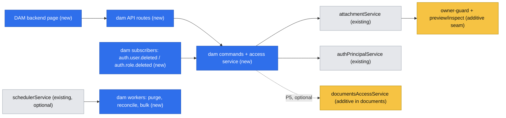
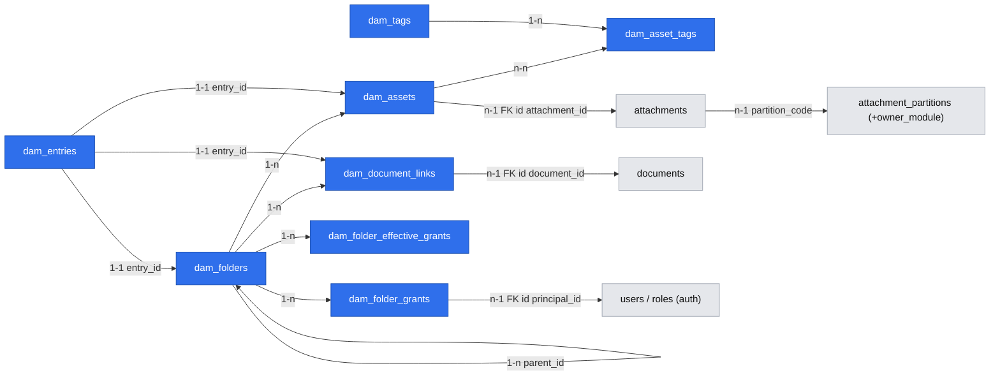

# DAM — Digital Asset Management Module (Media)

- **Date:** 2026-10-06
- **Status:** Draft
- **Scope:** OSS (`.ai/specs/`)
- **Module:** `dam` — `packages/core/src/modules/dam/`
- **Brief:** [`briefs/2026-10-06-dam-module.md`](briefs/2026-10-06-dam-module.md)

## 📝 TLDR

Sales teams need one organized place for marketing and offer materials. Today Open Mercato only has the flat `attachments` library: no folders, no asset title or description, and no access control below module level. **Proposed:** a new `dam` module (nav group **Media**) adds a folder tree, assets with descriptive and technical metadata, folder-level RBAC with inheritance, a trash, bulk operations and in-module search. It stores bytes through the public `attachmentService` contract on an owner-guarded partition. The module is the first step of an Asset Data Management module class: every asset gets a stable id that other modules can reference later.

## 📝 Overview

| Phase | Delivers to sales users |
|---|---|
| P1 | A browsable, searchable-by-folder library with previews and rich metadata |
| P2 | Restricted folders |
| P3 | Safe deletion |
| P4 | Efficient mass handling and search |
| P5 | Collaborative documents placed next to files |

Out of scope (see brief Non-goals):
- SVG, Office previews, versioning, ZIP download, WebDAV itself
- per-folder metadata schemas, global search, importing existing attachments
- named integrations beyond `documents`

## 📝 Problem Statement

- Sales reps keep presentations, offers, product photos and PDFs scattered across mail and drives. The platform's `attachments` library (`/backend/storage/attachments`) is a flat list. Its attachments are bound to the records of other modules (`entity_id` / `record_id`) and it has no hierarchy, title, description or curated metadata.
- Some materials are internal (e.g. price lists for managers only). Module-level features cannot express "this folder is visible only to sales managers".
- Evidence: a partner requirement (Univio). There is no usage data yet, so the design keeps P1 small and independently useful.

## 📝 Proposed Solution

A new `dam` core module layered **over** `attachments`:

- **DAM owns** folders, assets (name, title, description, tags, technical and business metadata), folder grants, effective permissions, trash state and document links.
- **`attachments` keeps ownership** of bytes, storage drivers, quota, file security, thumbnails and PDF rasterization. DAM uses them only through `attachmentService` (DI). It never reads `Attachment` entities and never constructs `StorageDriverFactory`, per `attachments/AGENTS.md`.
- Business metadata uses platform **custom fields** (`ce.ts`), with one tenant-wide field set on the asset entity.
- Folder ACL is DAM's own, applied to folders with downward inheritance and break-inheritance. Principals follow the shape `documents` uses (user | role).

### Alternatives considered

| Alternative | Why it lost |
|---|---|
| Extend `attachments` with folders/ACL | Many modules consume `attachments` (catalog, messages, sync_excel, documents…). Adding folders and record ACL to its tables would widen a stable contract surface and couple every consumer to DAM semantics. |
| Extend `documents` (`packages/documents`) | Different domain: real-time collaborative authoring (TipTap/Yjs, sidecar, content versions), not storage of finished files. DAM *links* documents instead (Phase 5). |
| Tags as virtual folders (build nothing) | No hierarchy, no title/description, no folder-level access control. Does not meet the need. |
| Separate workspace package `@open-mercato/dam` | Adds packaging and publishing surface with no benefit: DAM needs no new runtime dependency (`sharp` and `pdfjs-dist` already ship with core). It can be extracted later without contract changes. |

## Resolved assumptions (autonomous defaults)

The brief's Resolved-unknowns table pre-answers most design questions; those answers are treated as requirements, not repeated here. The following were left open and resolved by this spec:

| # | Question | Chosen answer | Rationale |
|---|---|---|---|
| A1 | Where does the module live? | Core module `packages/core/src/modules/dam` | Least new surface; no new dependency; follows `attachments`/`catalog` placement. |
| A2 | How are DAM bytes protected from the generic attachment endpoints? | Additive **owner-guarded partition** seam in `attachments`:<br>• nullable `attachment_partitions.owner_module`<br>• the guard sits **inside `checkAttachmentAccess`**, so every reader that uses it fails closed<br>• audited direct readers get explicit filters<br>• partition admin API and generic upload refuse owned partitions<br>• `createScoped` into an owned partition suppresses the generic CRUD events and indexing<br>See [Attachments seams](#attachments-seams-additive). ⚠ NEEDS HUMAN CONFIRMATION | Verified:<br>• `api/file/[id]` and `api/image/[id]` declare `requireAuth: false`<br>• `api/library` requires only `attachments.view`<br>• AI tools `attachments.list_record_attachments` / `read_attachment` (`ai-assistant/.../attachments-pack.ts`) read `Attachment` directly<br>• `createScoped` emits `attachments.attachment.created` and indexes the row (`scoped-upload-service.ts` `emitCrudSideEffects`)<br>Without the guard, restricted DAM files leak through all of these. It changes behavior inside another module, so it needs maintainer sign-off. |
| A3 | How does DAM get thumbnails and technical metadata through public surfaces? | Two additive optional methods on `AttachmentService`: `readScopedPreview` and `inspectScoped` | DAM must not import `attachments/lib/*`. Optional methods follow the existing `releaseScoped?` / `readUploadForm?` precedent. |
| A4 | How is the effective-permission table shaped so role membership changes don't require recomputation? | Effective grants are expanded **per folder × principal (user or role)**, never per user. Active role ids are resolved live per request through `authPrincipalService.resolveActiveUserRoleIds`. | Verified: `auth` emits no role-membership event; `auth.users.update` re-syncs roles and fires only a generic `auth.user.updated` with `{ id, organizationId, tenantId }`. Keeping roles unexpanded makes role changes effective immediately, needs **no new `auth` event** and fails closed. |
| A5 | What does a user see when they have access to a folder but not to its parent? | The folder appears under a virtual **"Shared with me"** root group. Inaccessible ancestor names are never revealed. | Fail-closed; no folder-name leak. |
| A6 | Who may move a folder? | **`manager` on the moved folder + `editor` on the target**. Assets: `editor` on source and target (as briefed). ⚠ NEEDS HUMAN CONFIRMATION | Moving an inheriting folder changes who can see its whole subtree, which is effectively a grant change. The brief said "`editor` on both" without distinguishing folders, so this is a deliberate tightening. |
| A7 | How is the shared, case-insensitive namespace (folders + assets + links) enforced atomically? | A single `dam_entries` namespace table with a partial unique index on `(organization_id, parent_key, name_key)` for live (non-trashed, non-deleted) rows | One unique index across entry kinds; race-free; no cross-table locking. |
| A8 | Where do tags live? | DAM-owned `dam_tags` plus a junction table `dam_asset_tags`, scoped per organization | Many-to-many per platform conventions; tags `storage_metadata` on attachments stays untouched. |
| A9 | How does DAM (core) check document access in Phase 5 without importing `@open-mercato/documents`? | Additive DI service `documentsAccessService` registered by `documents` (`canViewMany`, `getDisplayTitles`), resolved by DAM via `container.hasRegistration`; absent → feature disabled | `documents` depends on core, so core cannot import it. A generic access service in `documents` names no DAM concepts. |
| A10 | Trash semantics for folders | Trashing a folder trashes its whole live subtree as **one trash batch**. Only the batch root is listed in trash; restore and purge act on the whole batch. | Mirrors desktop trash; restore stays consistent. |
| A11 | How is the trash retention configured? | Env `OM_DAM_TRASH_RETENTION_DAYS` (default `30`; `0` disables auto-purge) | Least surface; mirrored into `.env.example` and the create-app template. |
| A12 | OCR / full-text content extraction for DAM files | Off: the `dam` partition is created with `requiresOcr: false` | Not in scope; avoids queue load. |
| A13 | Split into several specs? | One spec with five independently shippable phases | The brief fixed the delivery scope as P1–P5. Each phase leaves the module working. |
| A14 | Folder depth / subtree size limits | Max depth 20; a synchronous permission rebuild is bounded to 10 000 folders per subtree (larger moves are rejected with a 422 and a hint to split) | Keeps the in-transaction rebuild bounded; generous for a sales library. |
| A15 | How do Phase 1 folders become Phase 2 folders without a broken reference or a silent visibility change? | Grant tables ship in **P1**. P1 records the root creator's `manager` grant but does not enforce it. Enforcement starts in P2. On P2 deploy, P1 folders become visible only to grantees and admins (fail-closed). Admins re-share them with CLI `yarn mercato dam grant --folder <id\|all-roots> --role <id> --level viewer`, and the change is stated in UPGRADE_NOTES. | No dangling reference; no automatic over-grant; one explicit admin action. |
| A16 | Do ACL features change meaning between phases? | No. `dam.manage` is a write **ceiling** in every phase. P1 has no folder restriction, and from P2 the folder level is also required. Root-folder creation is a separate feature, `dam.root_folders.create`, from P1. | ACL feature ids are a frozen contract surface. |
| A17 | Requests that do not come from a user (API keys, system) | They get no folder grants. Only the RBAC `dam.admin` bypass applies, when that principal's features include it. Otherwise DAM routes return 404 (fail-closed). | No defined principal set exists for them. |

## 📝 Architecture



Takeaway: DAM touches two peers only through DI services. The yellow nodes are the only changes outside the new module.

### Module layout

```
packages/core/src/modules/dam/
  index.ts acl.ts setup.ts di.ts events.ts ce.ts search.ts cli.ts
  data/entities.ts data/validators.ts
  lib/naming.ts            name rules, normalization, name_key, conflict suffix
  lib/fileTypes.ts         allowlist + magic-byte sniffing
  lib/folderHierarchy.ts   tree_path/depth/ancestor_ids recompute (pattern copy of catalog/directory, no import)
  lib/effectivePermissions.ts  subtree rebuild of dam_folder_effective_grants
  lib/access.ts            DamAccessService: principal set, level checks, visible-folder SQL scope
  lib/trash.ts             batch trash/restore/purge
  commands/{folders,assets,grants,trash,links}.ts
  api/…                    see API Contracts
  subscribers/{auth-user-deleted,auth-role-deleted}.ts
  workers/{trash-purge,permissions-reconcile,bulk-operation}.ts
  backend/dam/page.tsx (+ page.meta.ts), backend/dam/trash/page.tsx
  components/{DamFolderTree,DamContentPane,DamAssetGrid,DamAssetDrawer,DamGrantsDialog,…}.tsx
  i18n/{en,pl,de,es,ko}.json
  __integration__/…
```

### Attachments seams (additive)

All changes are additive per `BACKWARD_COMPATIBILITY.md`. Existing rows get `owner_module = null`, so behavior stays unchanged for every current consumer.

1. **Owner-guarded partitions** (P1)
   - **Column.** Nullable `attachment_partitions.owner_module text`.
   - **Provisioning.** New optional method `attachmentService.ensureOwnedPartition({ code, title, ownerModule, isPublic: false, requiresOcr })`. It is idempotent and creates or validates a global partition row. It refuses when the code exists with a different `owner_module`.
   - **Single choke point.** `checkAttachmentAccess(auth, attachment, partition, options)` gains an `options.ownerModule?: string` parameter. When `partition.ownerModule` is set and does not equal `options.ownerModule`, the result is `{ ok: false, status: 404 }`. This holds for superadmins too: owner modules serve these files through their own ACL. Every caller that does not pass `ownerModule`, which means every existing caller, is fail-closed automatically. Only the `attachmentService` scoped methods pass it, and only when `expectedPartitionCode` matches the owned partition.
   - **Direct readers.** These query `Attachment` without `checkAttachmentAccess`. Each gets an explicit `partition_code NOT IN (owned partitions)` filter or is routed through the check, with a test per row:

     | Reader | Treatment |
     |---|---|
     | `attachments/api/library/route.ts` (list + `[id]`) | exclude owned partitions |
     | `attachments/api/route.ts` (list/upload by `entityId`) | exclude; refuse upload into an owned partition (422) |
     | `attachments/api/transfer/route.ts` | refuse owned attachments (404) |
     | `attachments/cli.ts` | skip owned partitions except for explicit `--partition` admin ops |
     | `ai-assistant/.../ai-tools/attachments-pack.ts` (`list_record_attachments`, `read_attachment`) | exclude owned partitions |
     | `messages/{commands,lib}/attachments.ts`, `messages/commands/shared.ts` | refuse copying/forwarding owned attachments |
     | `warranty_claims/api/portal/attachments/route.ts` | exclude |
     | `sync-akeneo/.../catalog-importer.ts` | exclude |

     The implementation step re-runs `grep -rn "Attachment" --include=*.ts` and extends this table if new readers have appeared since.
   - **Partition admin API.** `api/partitions` PUT/DELETE reject owned partitions (409 `attachments.errors.partitionOwned`). The settings UI shows them read-only.
   - **Side effects.** `createScoped` (`scoped-upload-service.ts`) into an owned partition skips `emitCrudSideEffects` (no `attachments.attachment.created` event, no query-index row). The owner module emits its own events, and webhooks, workflows and subscribers never see DAM files. OCR stays off (A12).
   - **Release durability.** `releaseScoped` also clears the thumbnail cache for the attachment (today only `api/route.ts` DELETE calls `clearAttachmentThumbnailCache`). If the post-commit provider cleanup fails, `releaseScoped` enqueues `{ storageDriver, partitionCode, storagePath }` on the existing `attachments-quota-recovery` queue (or a sibling `attachments-provider-cleanup` queue). The retry therefore does not depend on the already-deleted row.
2. **`readScopedPreview?(input)`** (P1)
   - Input: `ReadScopedAttachmentInput` plus `{ width, height, fit: 'cover' | 'contain' }`.
   - Returns a WebP buffer, or `null` when no preview exists for the type.
   - Images use the existing `sharp` pipeline, `imageSafety` limits and `thumbnailCache`. PDFs rasterize page 1 using the existing pdfjs/canvas path in `lib/pdfProcessing.ts`, then resize. The result is cached under the same cache-key scheme.
3. **`inspectScoped?(input)`** (P1)
   - Returns `{ mimeType, fileSize, width?, height?, pageCount?, exif?: Record<string, string | number> }`.
   - EXIF is limited to an allowlist: camera make/model, `DateTimeOriginal`, orientation, lens, ISO, exposure, focal length. **GPS tags are dropped** (privacy).
4. **`documentsAccessService`** (P5, in `packages/documents`)
   - `canViewMany({ auth, documentIds }) → Set<string>`, built on `resolveUserAccess` + `hasTier(…, 'viewer')`.
   - `getDisplayTitles({ auth, documentIds }) → Record<id, string>`, decrypted via `findOneWithDecryption` and sanitized with `displayLabels.ts`. Only viewable ids are returned.

### Effective-permission aggregation (the riskiest part)

**Tables**
- `dam_folder_grants` holds the explicit grants: `(folder_id, principal_type, principal_id, level)`.
- `dam_folder_effective_grants` is a derived, fully rebuildable table: `(folder_id, principal_type, principal_id, level, source_folder_id)`. `level` is the **max** level the principal holds on the folder.

**Rule.** For folder F:
- If `F.inherits_permissions` and F has a parent P: `eff(F) = maxMerge(eff(P), grants(F))`.
- If F is a root folder or has broken inheritance: `eff(F) = grants(F)`.
- There are no deny rules.

**Breaking inheritance**, in one transaction:
1. Copy `eff(P)` into `grants(F)`, skipping duplicates and keeping max level.
2. Set `inherits_permissions = false`.
3. Rebuild the subtree.

**Restoring inheritance** sets the flag back and rebuilds the subtree. Explicit grants on F are kept.

**Read-time principal set.** For user U the principal set is `{('user', U)} ∪ {('role', r) | r ∈ authPrincipalService.resolveActiveUserRoleIds(U, scope)}`. It is resolved once per request.
- If `authPrincipalService` is unavailable, only user grants apply (fail-closed).
- Superadmin and holders of `dam.admin` bypass grants. The check uses RBAC wildcard-aware matching via `rbacService`, never a string compare.
- Visible folders are defined by `f.trashed_at IS NULL AND f.deleted_at IS NULL AND EXISTS (SELECT 1 FROM dam_folder_effective_grants e WHERE e.folder_id = f.id AND (e.principal_type, e.principal_id) IN (…principal set…) AND e.level >= :required)`.
  - Trashing marks the **whole subtree** (batch), so checking the folder's own flags is sufficient.
  - Asset reads additionally require `a.trashed_at IS NULL AND a.deleted_at IS NULL`.
  - The trash routes use a separate predicate: the origin folder level, evaluated on `trashed_from_*`.
  - Non-user principals follow A17.
- `DamAccessService.visibleFolderScope(auth, requiredLevel)` returns this predicate as a Kysely expression. Every list, search, stats, trash and download query uses it, so no route builds its own check.

**Keeping it current.** The hybrid follows the brief and uses only existing mechanisms:

| Trigger | Mechanism | Consistency |
|---|---|---|
| Grant add/change/remove, break/restore inheritance, folder create, folder move/re-parent, folder restore | `rebuildEffectiveGrantsForSubtree(em, rootFolderId)` **inside the same command transaction**. Subtree = `rootFolderId` ∪ folders whose `ancestor_ids @> [rootFolderId]`. It computes top-down in memory and replaces the subtree's rows. Same pattern as `catalog/commands/categories.ts` → `rebuildCategoryHierarchyForOrganization`. | Immediate; no visibility window. |
| User role membership changes, user deactivated | Nothing to rebuild: roles are resolved live (A4). A deactivated user cannot authenticate. | Immediate. |
| `auth.user.deleted`, `auth.role.deleted` (persistent events, payload `{ id, tenantId[, organizationId] }`) | Persistent idempotent subscribers delete that principal's `dam_folder_grants` and effective rows in the tenant. | Housekeeping only. Dangling rows never grant access, because the principal can no longer be resolved. |
| Drift (bug, manual SQL, partial failure) | Nightly idempotent queue worker `dam:permissions-reconcile`, registered per organization with `schedulerService` in `setup.ts` (guarded by `hasRegistration('schedulerService')`). Also available as CLI `yarn mercato dam rebuild-permissions [--org]`. | Eventually repaired; the run logs a summary of differences. |

**Concurrency.**
- **Structural mutations are serialized per organization.** Every command that changes hierarchy or permissions takes `pg_advisory_xact_lock(hashtext('dam:tree:' || organization_id))` first. This covers grant changes, break/restore, folder create/move, and trash/restore/purge of folders. Overlapping subtrees (a grant change on ancestor A and one on descendant F) therefore can never interleave, and A's stale in-memory computation cannot overwrite F's newer rows.
- The cycle and depth checks run after the lock.
- These mutations are rare, human-driven events, so per-organization serialization costs nothing noticeable.
- **Asset writes** (upload, replace, metadata edit, asset move) do not take the tree lock. They take `SELECT … FOR SHARE` on their target folder rows and re-check that the folder is live (not trashed) under that lock. An upload can therefore never land live inside a subtree that is being trashed or moved, and a trash waits for in-flight uploads.
- A unit test asserts the result of concurrent overlapping rebuilds. An integration test runs parallel grant change plus move.

**Bounds.** A subtree larger than 10 000 folders → 422 `dam.errors.subtreeTooLarge` (A14). Depth > 20 → 422.

## 📝 Data Model

All tables carry `tenant_id` and `organization_id` (both `uuid NOT NULL`), `created_at` and `updated_at`. User-editable tables also carry `deleted_at`. All queries filter by `organization_id` and `tenant_id`. Text fields that may contain people's data (descriptions) follow the module's encryption defaults (`findWithDecryption`). `name` and `title` are not encrypted: they are needed for ILIKE search and sorting.

| Table | Key columns | Notes |
|---|---|---|
| `dam_folders` | `id`, `parent_id uuid null`, `name text`, `name_key text`, `tree_path text`, `depth int`, `ancestor_ids jsonb`, `inherits_permissions bool default true`, `created_by_user_id`, `updated_by_user_id`, `trashed_at`, `trashed_by_user_id`, `trash_batch_id uuid null`, `trashed_from_parent_id uuid null`, `deleted_at` | Hierarchy fields maintained by `lib/folderHierarchy.ts`. Index `(organization_id, parent_id)`, GIN on `ancestor_ids`. |
| `dam_assets` | `id`, `folder_id uuid`, `attachment_id uuid`, `name`, `name_key`, `extension text`, `title text null`, `description text null`, `mime_type`, `file_size bigint`, `technical_metadata jsonb`, `has_preview bool`, `created_by_user_id`, `updated_by_user_id`, `trashed_at`, `trashed_by_user_id`, `trash_batch_id`, `trashed_from_folder_id`, `deleted_at`, `purged_at` | `attachment_id` is an FK id into `attachments` (no ORM relation), nulled on purge. Index `(organization_id, folder_id)`, trigram-friendly index on `name_key`. |
| `dam_entries` | `id`, `parent_key uuid` (folder id, or the org's root sentinel `00000000-0000-0000-0000-000000000000`), `name_key`, `entry_type` (`folder`/`asset`/`document_link`), `entry_id`, `live bool` | **Namespace guard**: partial unique `(organization_id, parent_key, name_key) WHERE live`. Written in the same transaction as the entry; `live = false` on trash. |
| `dam_tags` | `id`, `label`, `label_key` | Unique `(organization_id, label_key)`. |
| `dam_asset_tags` | `asset_id`, `tag_id` | Junction table; PK `(asset_id, tag_id)`. |
| `dam_folder_grants` | `id`, `folder_id`, `principal_type` (`user`/`role`), `principal_id`, `level` (`viewer`/`editor`/`manager`), `created_by_user_id`, `deleted_at` | Partial unique `(folder_id, principal_type, principal_id) WHERE deleted_at IS NULL`. Optimistic lock on the grant set via `grantsVersion` = max(`updated_at`) of the folder's grant rows (grant edits never bump the folder's own `updated_at`, avoiding false 409s on rename). Table ships in P1 (A15). |
| `dam_folder_effective_grants` | PK `(folder_id, principal_type, principal_id)`, `level`, `source_folder_id`, scope cols | Derived; no `updated_at`/`deleted_at`. Index `(organization_id, principal_type, principal_id, level)`. Ships in P2. |
| `dam_document_links` (P5) | `id`, `folder_id`, `document_id uuid`, `name`, `name_key`, `created_by_user_id`, trash cols, `deleted_at` | `document_id` is an FK id into `documents` (no ORM relation). |
| `attachment_partitions.owner_module` | `text null` | Additive column in `attachments` (seam 1). |

**Naming** (`lib/naming.ts`, shared by API and UI):
- `name_key = lower(NFC(name))`.
- Allowed: Unicode letters and digits, space, `- _ . ( )`.
- Forbidden: `/ \ : * ? " < > |` and control characters.
- No leading `.`, no trailing space or `.`, maximum **255 bytes** in UTF-8 (not characters, matching common filesystem and WebDAV limits).
- Windows reserved base names (`CON PRN AUX NUL COM1–9 LPT1–9`) are rejected.
- An asset's `extension` is fixed at upload from the sniffed type. Rename validates `name` ends with `.{extension}`.

**Custom fields**: `ce.ts` declares `{ id: 'dam:dam_asset', label: 'DAM asset', labelField: 'title', fields: [] }`. Routes accept `cf_*` via `splitCustomFieldPayload`, commands persist via `setCustomFieldsIfAny`, and list/detail return canonical `customValues` (`CrudListCustomFieldDecorator.stripPrefixedKeys`).



## 📝 API Contracts

All routes live under `/api/dam/*` and export `openApi`. Validation uses zod in `data/validators.ts`. Writes go through registered commands (undo where meaningful) and enforce optimistic locking with `enforceCommandOptimisticLockWithGuards`. Lists are capped at `pageSize ≤ 100`. Every access check goes through `DamAccessService`. An inaccessible folder or asset returns **404** (never 403), so existence is not revealed.

| Method & path | Phase | Required level | Purpose |
|---|---|---|---|
| `GET /folders?parentId=&tree=1` | P1 | viewer | Visible folders. Each node carries `{ id, displayParentId, name, depth, myLevel, inheritsPermissions, hasChildren, updatedAt }`. `displayParentId = null` + `sharedRoot: true` for A5. |
| `POST /folders` `{ parentId?, name }` | P1 | editor on parent (root: `dam.root_folders.create`) | Create; the creator gets a `manager` grant on a new root folder (recorded from P1, enforced from P2). |
| `PUT /folders` `{ id, name, updatedAt }` | P1 | editor | Rename. |
| `POST /folders/move` `{ id, targetParentId \| null, updatedAt }` | P1 | manager on folder + editor on target (A6) | Re-parent; cycle and depth checks; subtree rebuild. |
| `GET /folders/{id}/stats` | P1 | viewer | `{ direct: { assetCount, totalBytes }, recursive: { assetCount, totalBytes, folderCount } }`. Recursive counts cover visible items only. |
| `GET /assets?folderId=&recursive=&search=&type=&tags=&sort=&page=&pageSize=` | P1 (search P4) | viewer | List with `previewUrl`, `customValues` and `updatedAt`. |
| `POST /assets` (multipart: `folderId`, `file`, `name?`, `title?`, `description?`) | P1 | editor | Upload. Reads via `attachmentService.readUploadForm`, then allowlist sniffing, name validation, `createScoped` with `persistLink` writing `dam_assets` + `dam_entries` in the attachment transaction, then `inspectScoped`. Name conflict → **409** `{ code: 'dam.name_conflict', suggestion: 'name (1).pdf' }`. |
| `PUT /assets` `{ id, name?, title?, description?, tags?, cf_*, updatedAt }` | P1 | editor | Metadata edit. |
| `POST /assets/{id}/file` (multipart) | P1 | editor | Replace the bytes; the type must keep the same extension. A single transaction creates the new attachment (`persistLink` re-points `attachment_id`) and removes the old row via `releaseScoped(…, { em, flush: false })`. Only the old provider bytes are deleted after commit, with the durable retry from seam 1. |
| `GET /assets/{id}/download` | P1 | viewer | Streams via `readScoped({ expectedPartitionCode: 'damAssets', forceDownload: true })`. |
| `GET /assets/{id}/preview?w=&h=&fit=` | P1 | viewer | `readScopedPreview`; 404 when no preview exists → the UI shows the type icon. `Cache-Control: private`. |
| `POST /assets/move` `{ ids[], targetFolderId }` | P1 | editor on each source + target | Batch ≤ 100 inline; more → P4 bulk job. |
| `GET /tags?search=` | P1 | dam.view | Tag autocomplete. |
| `GET /names/check?parentId=&name=` | P1 | viewer on parent | `{ valid, error?, available, suggestion? }` for live UI validation. |
| `GET/PUT /folders/{id}/grants` `{ grants: [{ principalType, principalId, level }], grantsVersion }` | P2 | manager | Replace the explicit grant set; the response includes inherited grants (read-only, with `sourceFolderId`). |
| `POST /folders/{id}/inheritance` `{ mode: 'break' \| 'restore', updatedAt }` | P2 | manager | Break or restore inheritance. |
| `DELETE /folders?id=` / `DELETE /assets?id=` | P3 (P1: hard 422 "not empty" / no delete) | editor | Move to trash (creates a batch). |
| `GET /trash?page=` | P3 | editor at origin | Batch roots: `{ batchId, entryType, name, originPath (only visible segments), trashedAt, trashedBy, itemCount, totalBytes, purgeAt }`. |
| `POST /trash/restore` `{ batchId, targetFolderId?, name? }` | P3 | manager at origin (or `dam.admin`); plus, when restoring elsewhere: `editor` on target for asset batches, and `editor` on target **and** `manager` at origin for folder batches (same rule as A6) | Restore. 409 `dam.restore_conflict` with `{ reason: 'origin_trashed' \| 'origin_purged' \| 'name_taken', suggestion }`. If the origin is purged, the origin level cannot be evaluated, so only `dam.admin` may restore. |
| `POST /trash/purge` `{ batchIds[] \| all: true }` | P3 | manager at origin (or `dam.admin`) | Purge: sets `deleted_at`, `purged_at`, releases bytes. Over 100 items → bulk job. |
| `POST /bulk` `{ action: 'move' \| 'tag' \| 'untag' \| 'trash', ids[], targetFolderId?, tagIds? }` | P4 | per item | Creates a `ProgressJob` + queue job; returns `{ progressJobId }`. Items failing the ACL check are skipped and counted in `resultSummary`. |
| `GET/POST/PUT /document-links`, `DELETE` → trash | P5 | viewer / editor | Only when `documentsAccessService` is registered (otherwise 404 + the UI hides the action). |

**Upload validation** (`lib/fileTypes.ts`)

Allowed types and their sniff signatures:

| Type | Check |
|---|---|
| JPEG | `FF D8 FF` |
| PNG | `89 50 4E 47` |
| GIF | `GIF8` |
| WebP | `RIFF….WEBP` |
| BMP | `BM` |
| TIFF | `II*\0` / `MM\0*` |
| PDF | `%PDF-` |
| DOCX / XLSX / PPTX | ZIP signature, plus a `[Content_Types].xml` part whose main part matches the extension |
| TXT | Valid UTF-8 (BOM allowed), no NUL bytes in the first 8 KiB |

- The declared MIME type and the extension must agree with the sniffed type. Any mismatch → 422 `dam.errors.unsupportedType`.
- SVG and everything else are rejected.
- Size and quota limits are enforced by `attachmentService` (`OM_ATTACHMENT_MAX_UPLOAD_MB`, `OM_ATTACHMENT_TENANT_QUOTA_MB`), giving 413 / 507-style errors mapped to i18n messages.

**Events** (`events.ts`, `createModuleEvents`)
- `dam.folder.created|updated|moved|trashed|restored|purged`
- `dam.asset.created|updated|moved|trashed|restored|purged`
- `dam.folder_grant.changed` (singular entity, per the naming convention)
- `dam.document_link.created|deleted` (P5)

Payloads carry `{ id, organizationId, tenantId }` plus `folderId` / `parentId` where relevant. They never include names of folders the subscriber might not see. None are `clientBroadcast` in P1 (no folder-ACL audience filtering on the SSE bridge).

**ACL features** (`acl.ts`)

| Feature | Grants |
|---|---|
| `dam.view` | Enter the module |
| `dam.manage` | Write ceiling: upload, edit, move, trash. In P1 nothing else restricts it; from P2 the folder level is also required (A16) |
| `dam.root_folders.create` | Create root folders |
| `dam.admin` | Bypass folder grants, global trash, reconcile and grant CLIs |

`setup.ts`: `defaultRoleFeatures: { superadmin: ['dam.*'], admin: ['dam.*'], employee: ['dam.view', 'dam.manage'] }`. `dam.admin` and `dam.root_folders.create` are admin-only; `dam.admin` checks use wildcard-aware `rbacService` matching. It also calls `ensureOwnedPartition({ code: 'damAssets', ownerModule: 'dam', isPublic: false, requiresOcr: false })` and the guarded scheduler registrations.

**Search config** (`search.ts`): DAM entities are registered with `enabled: false` — the global index has no record-level ACL filtering (same decision as `documents/search.ts`). Search is the ACL-filtered list route `GET /assets?search=`: ILIKE (`escapeLikePattern`) over `name`, `title` and tag labels, plus a `type` filter. Descriptions are encrypted, so description matching is out of scope for P4. Recorded as a known limitation.

## 📝 UI/UX

Page `/backend/dam` (`page.meta`: `pageGroup: 'Media'`, `pageGroupKey: 'dam.nav.group'` (DAM's own key, translated as "Media"; implementation verifies that the sidebar merges groups by label and otherwise falls back to the attachments key), `requireFeatures: ['dam.view']`, icon `folder`). The trash is at `/backend/dam/trash` (P3). Layout uses `@open-mercato/ui` primitives and DS tokens only.

- **Left pane — `DamFolderTree`**
  - DAM-local component; no generic tree exists in `packages/ui`. The pattern is `documents/backend/documents/FolderTree.tsx`, re-implemented here rather than imported.
  - Lazy children loading and the "Shared with me" group (A5).
  - Keyboard: arrows move, Enter opens, F2 renames.
  - `aria-tree` semantics.
  - Drag & drop to move, with a valid-target highlight.
  - Context menu: new folder, rename, move to…, permissions (P2), move to trash (P3).
- **Right pane — `DamContentPane`**
  - Breadcrumb showing visible segments only.
  - Toolbar: upload, new folder, list/grid toggle (remembered per user in local storage), search (P4), type filter, sort.
  - **Stats bar:** "12 assets · 48.3 MB · 31 assets / 210 MB including subfolders".
  - **List view:** `DataTable` with thumbnail, title (fallback name), name, type, size, tags, modified, modified by. Bulk actions (P4) via `bulkActions`.
  - **Grid view:** cards with preview (or type icon for TXT/Office), title and size. Multi-select via checkbox and Shift-click.
  - Empty, loading and error states use `LoadingMessage` / `ErrorMessage`.
- **Upload**
  - Drop zone over the pane plus the button; multiple files.
  - Per-file progress rows. Per-file name conflict shows an inline "Rename to `x (1).pdf`" suggestion the user can accept or edit.
  - Unsupported types are rejected client-side by extension and server-side by sniffing.
- **Asset drawer — `DamAssetDrawer`**
  - Large preview, download.
  - `CrudForm` for name (live `/names/check`), title, description, tags, custom fields (auto-rendered from `ce.ts`). Optimistic locking is derived automatically from `initialValues.updatedAt`.
  - Read-only "Technical metadata" section.
- **Permissions dialog — `DamGrantsDialog` (P2)**
  - Inherited grants are shown read-only with their source folder.
  - Explicit grants are editable (principal picker: users and roles).
  - "Stop inheriting" / "Inherit again" toggle, with a confirmation that explains the copy semantics.
  - `Cmd/Ctrl+Enter` saves, `Escape` cancels.
- **Trash page (P3):** `DataTable` of batch roots with restore and purge actions, plus a restore-conflict dialog (choose target folder, rename) and a retention notice.
- All strings come from `i18n/*.json` (en, pl, de, es, ko). No hardcoded status colors.

Prototype: `.ai/specs/assets/dam-module/` (illustrative mockups attached to the spec PR, when produced).

## 📝 Edge Cases & Failure Scenarios

| Scenario | Behavior |
|---|---|
| Two users upload `Offer.pdf` and `offer.pdf` into the same folder concurrently | The `dam_entries` unique index rejects the second → 409 with suggestion; its attachment transaction rolls back (`persistLink` runs inside it), so no orphan bytes remain. |
| Upload succeeds at storage but the DB transaction fails | `createScoped` owns this atomicity. Quota reservations are recovered by the existing `attachments-quota-recovery` worker. |
| Purge: DB commit succeeds, provider byte delete fails | `releaseScoped` commits the DB removal first, then runs the provider cleanup. On failure it logs, calls `reportError`, and enqueues `{ storageDriver, partitionCode, storagePath }` for an idempotent retry (seam 1). The retry does not need the deleted row. The asset is already invisible. |
| Folder moved while another user browses it | The next request reflects the new effective permissions. A stale `updatedAt` on concurrent edits → 409 conflict bar via `surfaceRecordConflict`. |
| Move into own descendant | 422 `dam.errors.moveCycle`. |
| Restore when the origin folder is trashed / purged or the name is taken | 409 `dam.restore_conflict`; the UI asks for a target and/or a new name. |
| `authPrincipalService` unavailable | Role grants ignored (fail-closed); user grants and admin bypass still work; a warning is logged once per process. |
| `schedulerService` not installed | Auto-purge and nightly reconcile are not scheduled. The CLI commands `yarn mercato dam purge-trash` and `dam rebuild-permissions` remain. `setup.ts` logs a hint. |
| `documents` not installed (P5) | Link routes 404; UI hides the "Link document" action; existing links render as "unavailable". |
| Linked document deleted or access revoked | The link shows as "Document unavailable" (no title leaked); `editor` can remove it. |
| Role deleted while referenced by grants | `auth.roles.delete` already refuses roles with assignments. After deletion, the subscriber removes its grants; until then, the dangling grant matches nobody. |
| Corrupt or malicious image or PDF | `imageSafety` dimension and magic-byte limits apply in `readScopedPreview`; failure → `null` preview (icon), never a 500 for the list. |
| Generic attachments endpoints, AI tools, message forwarding or the partition admin API used against a DAM attachment or partition | 404 / 409 (seam 1). Covered by one integration test per reader. |
| Upload races with a trash or move of the target folder | The upload holds `FOR SHARE` on the folder and re-checks that it is live. The trash/move waits, or the upload fails with 404 if it ran second. |
| Grant change on an ancestor races with one on a descendant | Serialized by the per-organization advisory lock. No stale overwrite. |

## 📝 Risks & Impact Review

| Risk | Severity | Area | Mitigation | Residual |
|---|---|---|---|---|
| Behavior change in generic attachment routes (owner guard) | High | attachments, every consumer | Only rows in partitions with `owner_module` set are affected; there are none before DAM. Unit tests plus integration tests for every generic route. Needs maintainer approval (A2 ⚠). | Third-party code that reads DAM attachments through generic routes would get 404. That is intended. |
| Effective-permission bugs leak restricted folders | High | dam | One `visibleFolderScope` predicate for all reads; property-style unit tests over random trees (inheritance and breaks vs. a brute-force reference resolver); nightly reconcile; 404-not-403. | Logic bugs in the reference itself. |
| In-transaction subtree rebuild slows big moves | Medium | dam | 10 000-folder cap, indexed `ancestor_ids`, single bulk insert. | Very large trees need a future async path. |
| New DB tables and migrations | Medium | db | Additive only. Migrations plus `.snapshot-open-mercato.json` ship in the PR; `yarn db:migrate` is never run by agents. | — |
| New event IDs, ACL features, API routes, DI method signatures become contract surface | Medium | BC | Named carefully once. New `AttachmentService` methods are optional (`?`) so other implementations don't break. | Frozen after release. |
| EXIF privacy | Low | dam | Allowlist; GPS dropped. | — |
| Description not searchable (encrypted) | Low | dam | Documented limitation. | Users may expect it. |

**Migration & Backward Compatibility.**
- Every change is additive: new module and tables; a nullable `attachment_partitions.owner_module`; optional methods on `AttachmentService`; a new DI service in `documents`.
- There are no renames or removals, so no deprecation bridge is needed.
- Rollback: disable the module. The owner-guarded partition keeps its files hidden from generic routes and still counts against quota. Before uninstalling, run CLI `yarn mercato dam purge-all --org <id> --confirm`, which releases all DAM bytes via `releaseScoped`. This is documented in UPGRADE_NOTES.
- **P2 visibility change** (A15): P1 folders become visible only to grantees and admins when P2 ships. This is documented in UPGRADE_NOTES with the `dam grant` CLI.

## 📋 Phasing

| Phase | Outcome (independently shippable) |
|---|---|
| **P1 — Library core** | Attachments seams 1–3 (seam 2–3 may ship as their own PR ahead of DAM); module scaffold; folders (create, rename, move); upload/replace/download/preview; allowlist; naming and namespace; title, description, tags, custom fields, technical metadata; list and grid; stats; flat RBAC (`dam.view` / `dam.manage` / `dam.root_folders.create` / `dam.admin`); grant table recorded, not enforced (A15). Delete is not available yet (folders and assets can only be moved). |
| **P2 — Folder permissions** | Grants, inheritance and break; effective-grants table and rebuild; `visibleFolderScope` on every read; "Shared with me"; auth cleanup subscribers; reconcile worker + CLI + schedule. |
| **P3 — Trash** | Trash batches, trash page, restore with conflicts, manual purge, scheduled auto-purge with byte release, `OM_DAM_TRASH_RETENTION_DAYS`. |
| **P4 — Bulk & search** | Multi-file upload polish, bulk move/tag/untag/trash via `ProgressJob` + worker, ACL-filtered search and filters. |
| **P5 — Document links** | `documentsAccessService` in `documents`; `dam_document_links`; link UI; degraded behavior when `documents` is absent. |

## 📋 Implementation Plan

Each step leaves the app building and working. Run `yarn generate` after adding auto-discovered files. Every phase ships its integration tests (`__integration__`, self-contained fixtures via API, cleanup in teardown).

### Phase 1 — Library core
1. **Attachments seam: owner-guarded partitions.**
   - Migration adds `owner_module`; `ensureOwnedPartition` goes on the service.
   - Guard inside `checkAttachmentAccess` (`ownerModule` option).
   - Every row of the direct-reader table gets its filter or refusal.
   - `api/partitions` PUT/DELETE refuse owned partitions; settings UI shows them read-only.
   - `createScoped` suppresses CRUD side effects for owned partitions.
   - `releaseScoped` clears the thumbnail cache and enqueues a durable provider-cleanup retry.
   - Tests: unit per guard; integration: an owned attachment → 404/409 on every generic route and AI tool, no `attachments.attachment.created` event, cleanup retry after a simulated provider failure.
2. **Attachments seam: `readScopedPreview` + `inspectScoped`.**
   - Reuse `sharp`, `thumbnailCache`, `imageSafety` and the `pdfProcessing` page-1 rasterization.
   - EXIF allowlist without GPS.
   - Unit tests for image, PDF and unsupported (`null`) cases.
3. **DAM scaffold.**
   - `index.ts`, `acl.ts`, `setup.ts` (features, `ensureOwnedPartition('damAssets')`), `di.ts`, `events.ts`, `ce.ts`, `search.ts` (`enabled: false`), i18n skeleton.
   - Entities `dam_folders`, `dam_assets`, `dam_entries`, `dam_tags`, `dam_asset_tags`, `dam_folder_grants` + migration + snapshot.
4. **`lib/naming.ts` + `lib/fileTypes.ts`.** Exhaustive unit tests (forbidden characters, reserved names, NFC/case collisions, OOXML sniffing, TXT heuristics, mismatches).
5. **Folder commands + API.**
   - Create, rename, move with `lib/folderHierarchy.ts`, namespace entries, cycle and depth checks, optimistic lock, undo for create and rename.
   - `GET /folders` tree, `/names/check`.
   - Integration: create nested folders, rename conflict 409, move cycle 422.
6. **Asset upload/replace/download/preview + metadata.**
   - Commands and routes; `persistLink` atomicity; tags; custom fields; `inspectScoped` on upload.
   - Integration: upload each allowed type, reject SVG and a spoofed extension, conflict suggestion, replace keeps id, download bytes match, preview for JPG/PDF and 404 for TXT.
7. **Stats + list API** (`/folders/{id}/stats`, `/assets` with folder, recursive and sort). Integration: counts and sizes direct vs recursive.
8. **Backend UI.**
   - Page, `DamFolderTree`, `DamContentPane` (list/grid/stats/empty states), upload with progress and conflict prompt, `DamAssetDrawer` with `CrudForm`.
   - Integration (Playwright): browse, upload, edit title/tags/custom field, toggle grid, see stats.

### Phase 2 — Folder permissions
1. Entity `dam_folder_effective_grants` + migration; initial build from the P1-recorded grants (A15). CLI `dam grant` and the UPGRADE_NOTES entry about the visibility change.
2. `lib/effectivePermissions.ts`: subtree rebuild under the per-organization advisory lock; asset writes take `FOR SHARE` on their folder. Reference-resolver test suite (randomized trees) plus a concurrent-overlapping-rebuild test.
3. `DamAccessService` (principal set via `authPrincipalService`, `visibleFolderScope`, `requireLevel`); retrofit every P1 route and switch `dam.manage` to "create root folders". Integration: viewer cannot upload, a non-granted user gets 404 on folder, asset, download and preview.
4. Grants and inheritance commands + routes (copy-on-break). Integration: break inheritance hides a subfolder from parent viewers; restore re-shows it; the folder-move rule (A6).
5. "Shared with me" in the tree API and UI; `DamGrantsDialog`.
6. Subscribers `auth.user.deleted` / `auth.role.deleted`; `workers/permissions-reconcile.ts` (idempotent, concurrency 1); CLI `dam rebuild-permissions`; scheduler registration (guarded). Tests: reconcile repairs a manually corrupted row.

### Phase 3 — Trash
1. Trash columns are used: `lib/trash.ts` batch trash/restore, with `dam_entries.live` toggling. Commands + `DELETE` routes + events.
2. Trash list, restore (conflicts), manual purge via `releaseScoped` (commit, then cleanup); purge-cleanup retry.
3. `workers/trash-purge.ts` + scheduler registration + CLI `dam purge-trash`; `OM_DAM_TRASH_RETENTION_DAYS` in `.env.example` and the create-app template (`yarn template:sync:fix`).
4. Trash page UI + conflict dialog. Integration: trash a folder with content, restore it to its origin, restore with a conflict, restore elsewhere without target `editor` → 404, purge → bytes gone (download 404, quota released, thumbnail cache cleared).
5. CLI `dam purge-all --org <id> --confirm` for uninstall (rollback path).

### Phase 4 — Bulk & search
1. `POST /bulk` + `workers/bulk-operation.ts` with `progressService` (create/update/complete/fail, cancellation), per-item ACL. Integration: bulk tag 150 assets, progress completes, a skipped no-access item is reported.
2. DataTable `bulkActions` and grid multi-select wiring; multi-file upload queue polish.
3. Search and filters on `GET /assets` (name/title/tags ILIKE, type, tags, recursive), ACL-filtered. Integration: search never returns assets from non-granted folders.

### Phase 5 — Document links
1. `documentsAccessService` in `packages/documents` (DI registration, unit tests, documents AGENTS.md note).
2. `dam_document_links` entity + migration; commands, routes and namespace entries; trash integration.
3. UI: "Link document" picker (only viewable documents), link rendering, "unavailable" state. Integration: a link is visible only with both DAM and document access; DAM works with the `documents` module disabled.

## 🔗 Integration Test Coverage (required)

| Path | Phase |
|---|---|
| `/api/attachments/{file,image,library,transfer}` owner-guard 404 | P1 |
| `/api/dam/folders` (+ `/move`, `/stats`), `/api/dam/names/check` | P1 |
| `/api/dam/assets` (+ `/{id}/file`, `/download`, `/preview`, `/move`), `/api/dam/tags` | P1 |
| UI: browse, upload, edit metadata, list/grid, stats | P1 |
| `/api/dam/folders/{id}/grants`, `/inheritance`; 404 for non-granted on every DAM route | P2 |
| UI: permissions dialog, "Shared with me" | P2 |
| `/api/dam/trash`, `/trash/restore`, `/trash/purge`; `DELETE` folders/assets | P3 |
| UI: trash page, restore conflict dialog | P3 |
| `/api/dam/bulk` + progress; `/api/dam/assets?search=` ACL filtering | P4 |
| `/api/dam/document-links`; DAM with `documents` disabled | P5 |

## ✅ Final Compliance Report

| Rule (source) | Status |
|---|---|
| No direct ORM relations between modules (`AGENTS.md` → Architecture) | ✅ FK ids only (`attachment_id`, `document_id`, `principal_id`) |
| Tenant/org scoping on every query | ✅ All tables carry both; `DamAccessService` scopes every read |
| `attachmentService` boundary (`attachments/AGENTS.md`) | ✅ DAM never reads `Attachment` or constructs drivers; seams are additive |
| Scope invariant (`assertAttachmentScopeInvariant`) | ✅ `createScoped` always gets both scope ids |
| BC: additive only (`BACKWARD_COMPATIBILITY.md`) | ✅ New column nullable, new service methods optional, new events, features, routes and DI keys. ⚠ Behavior change for owned partitions in generic readers needs maintainer approval (A2) |
| Optimistic locking default ON | ✅ `updatedAt` on folders and assets; `grantsVersion` for grants |
| zod validators, i18n, DS tokens, dialog shortcuts, `pageSize ≤ 100` | ✅ Specified |
| Wildcard-aware RBAC for `dam.admin` | ✅ Via `rbacService` |
| Encryption (`findWithDecryption`) | ✅ Descriptions encrypted; search limitation documented |
| Queue / scheduler contracts (idempotent workers, optional scheduler) | ✅ `hasRegistration('schedulerService')` guard; CLI fallbacks |
| Error reporting (`reportError` in catches) | ✅ Purge and cleanup failures |
| Module id convention "plural, snake_case" (`AGENTS.md` → Conventions) | ⚠ `dam` is an acronym chosen by the product owner (brief: "use the term DAM"), treated like the `auth` special case; reviewers may request `dam` be listed as an explicit exception |
| Integration tests per affected API/UI path (`.ai/qa/AGENTS.md`) | ✅ Coverage table above |
| `.env.example` + create-app template sync for `OM_DAM_TRASH_RETENTION_DAYS` | ✅ P3 step 3 |

## Changelog

- 2026-10-06 — Initial draft from brief `briefs/2026-10-06-dam-module.md` (autonomous, `om-auto-write-spec`).
- 2026-10-06 — Fresh-context review fixes: owner guard moved into `checkAttachmentAccess` + direct-reader audit, partition-API and side-effect suppression, durable provider cleanup, per-org advisory lock, transactional file replace, restore target checks, P1→P2 grant transition (A15), stable ACL semantics (A16), non-user principals (A17), byte-length names, singular event id.
