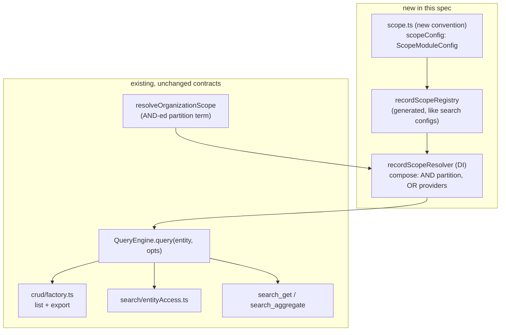

# SPEC — Record Scope Resolver (pluggable per-record read scoping)

**Scope:** OSS
**Status:** Draft
**Tracking issue:** [#5183](https://github.com/open-mercato/open-mercato/issues/5183)
**Related:** [#5167](https://github.com/open-mercato/open-mercato/pull/5167) (per-entity search ACL on the global endpoint — merged; disabled three entities), [#5203](https://github.com/open-mercato/open-mercato/pull/5203) (the same gate on the hybrid endpoint), [#244](https://github.com/open-mercato/open-mercato/issues/244) (RLS for tenant scoping), [`.ai/specs/2026-07-16-custom-entity-record-acl-per-entity.md`](2026-07-16-custom-entity-record-acl-per-entity.md) (per-entity ACL — shipped 0.8.0; explicitly disclaims this problem)
**Companion spec:** *Row-aware search for participant-scoped and polymorphic entities* — the #5183 consumer story. Not this document.
**Related guides:** `packages/shared/AGENTS.md`, `packages/core/src/modules/auth/AGENTS.md`, `BACKWARD_COMPATIBILITY.md`

---

## 📝 TLDR

Open Mercato authorizes reads by **entity type plus tenant/organization scope**. Nothing
answers "which *rows* of this entity may this principal read", and the platform states this
in its own source (`packages/core/src/modules/workflows/lib/task-entity-access.ts:7-9`):

> "**Entity TYPE plus scope. There is no record-level ACL in this platform and this resolver
> does not add one.** The query engine's public interface is `query(entity, opts)` with no ACL
> seam anywhere in it."

This has already cost a shipped feature: #5167 set `enabled: false` on `messages:message`,
`sales:sales_note` and `sales:sales_document_address` in their `search.ts` configs, because
participant-scoped and polymorphic rows cannot be authorized by a static entity feature.
#5183 asks for them back and there is no mechanism to use.

**Future behavior:** modules declare an entity as record-scoped and contribute **scope
providers**; a resolver composes them into **one predicate per request** (partition scope
AND-ed, providers OR-ed), carried on `QueryOptions` so every read path inherits it. An entity
declared scoped that is queried **without** a scope subject raises — omission becomes a loud
error instead of a silent leak. Ships inert: zero entities are declared scoped by this spec,
so no existing behavior changes on merge.

---

## 📝 Overview

**What this spec asks of its reader:** approve a new platform seam — one convention file, one
DI service, one optional `QueryOptions` field — or reject the seam and keep row scoping as a
per-module concern.

**The argument in three sentences.** An entity that needs row-level read scoping today must
choose between being searchable and being correctly scoped, because the only available escape
hatch (`omitAutomaticTenantOrgScope`) disables fulltext, the JSONB index read path and vector
search. That is a contract contradiction inside the platform, not a missing convenience in a
module, so it is the platform's to resolve. The resolution is to make the row predicate travel
the way `organizationIds` already travels — on `QueryOptions`, applied by the engine — because
§3 below proves that anything expressed as a route filter is silently dropped on the
export-full path.

**What this spec does not do.** It ships no organizational structure (no people, position, team
or territory hierarchy), declares no entity scoped, changes no existing signature and adds no
migration. Writes are out of scope. Direct `em.find` call sites stay out of reach. The first
behavior change in the product happens in the companion #5183 spec, which consumes this seam.

---

## 📝 Problem Statement

### 1. The granularity ceiling is entity-type, and the most recent adjacent work re-affirmed it

Route-level `requireFeatures` plus `assertEntityAclForRequest` answer "may this principal read
this *kind* of thing". The shipped per-entity ACL work (issue #3857, CLOSED COMPLETED
2026-08-13, in 0.8.0 as `custom_entities.access_restricted`) stops at the same granularity.
Its Out of Scope section, verbatim
(`.ai/specs/2026-07-16-custom-entity-record-acl-per-entity.md:350`):

> "- **Per-record / ownership-level ACL** (row-level security). Not addressed."

### 2. The existing escape hatch trades away the search path — the contradiction #5183 sits on

`QueryOptions.omitAutomaticTenantOrgScope` (`packages/shared/src/lib/query/types.ts:104-116`)
is today's only way to express non-standard scoping. Its own doc comment states the cost:

> "Callers MUST encode full visibility in `filters` (for example with `$or` of scoped branches)
> and MUST fail closed when the authenticated principal lacks a resolvable tenant/org,
> otherwise queries return cross-tenant rows."

> "When this flag is set, the hybrid query engine delegates to the basic engine. … the
> `search_tokens` fulltext filtering, the JSONB index read path, and the vector-search branch
> are BYPASSED."

Three defects in one option: scoping becomes each caller's duty, the failure mode is
**cross-tenant rows**, and using it **disables fulltext, the JSONB index and vector search** —
precisely the capabilities #5183 needs. **An entity that needs row scoping today must choose
between being searchable and being correctly scoped.** That is a contract contradiction, not a
missing convenience, and it is the core reason this belongs in the platform.

### 3. `buildFilters` — the place an author would naturally put scoping — is discarded on export

`packages/shared/src/lib/crud/factory.ts:1878-1884`:

```ts
const baseFilters = exportFullRequested
  ? ({} as Where<any>)
  : (opts.list.buildFilters ? await opts.list.buildFilters(validated as any, ctx) : ({} as Where<any>))
const filters = exportFullRequested
  ? baseFilters
  : mergeAdvancedFilters(baseFilters as Record<string, unknown>, validated as Record<string, unknown>) as Where<any>
const mergedFilters = exportFullRequested ? filters : mergeIdFilter(filters, parsedIds, { idsParamProvided })
```

When `exportScope=full`, `baseFilters` is `{}`: the route's own `buildFilters` is skipped
entirely, along with advanced filters and the id filter. **Any row scoping a module author put
in `buildFilters` silently vanishes on the export-full path.** The same `exportFullRequested`
branch repeats on the fallback path (`factory.ts:2181-2187`), so the defect is not confined to
one code path. What survives is `organizationIds`, because it travels on `QueryOptions` rather
than inside `filters`.

This decides the architecture: a record-scope predicate MUST travel the same way
`organizationIds` does, and MUST NOT be expressed as a route filter.

### 4. The failure class is well attested outside this project

"The predicate was applied on the list path and not on one other path." Verified instances:
Atlassian `API-410` — *"Exporting issues using the Excel option does not respect user's
permissions"* — created 09/Apr/2021, still **Unresolved** as observed 2026-10-06; and
CVE-2026-45718 (Budibase, published 27.05.2026), where *"the row action trigger endpoint fails
to validate that the user-supplied rowId is within the scope of the view's row filters"*.
Hence the requirement "one predicate per request, shared by list, export and search" rather
than "remember to filter".

---

## 📝 Proposed Solution

A module declares, in a new `scope.ts` convention file, which of its entities are record-scoped
and which providers supply the scope. A DI service composes the providers' predicates; the
query engine applies the composition and **refuses** a query against a declared-scoped entity
that carries no subject.

### Composition rule

The shape the domain has converged on. Odoo's ORM applies record rules to every query and
combines them as — verbatim, `odoo/addons/base/models/ir_rule.py` —

> "local rules are OR-ed together, the entire group succeeds or fails, while global rules get
> AND-ed and can each fail"

which maps onto this platform as:

```
visible = tenant_scope ∧ organization_scope ∧ ( provider₁ ∨ provider₂ ∨ … ∨ broad_grant )
```

Partition scope is unchanged: `resolveOrganizationScope` and the `directory` organization tree
remain the AND-ed term. Providers are additive OR-ed terms. A feature-gated broad grant
("back office reads everything") is **just another provider**, so composition stays uniform and
"sees everything" never has to be expressed as a hierarchy root expanded into an `IN` list.

### Alternatives considered and why they lost

| Alternative | Why rejected |
|---|---|
| **Scope in the CRUD factory only** | Misses global search, the `search_get` / `search_aggregate` AI tools, and every direct `em.find` call site. §3 shows the factory's own export branch already drops route-level filters. |
| **Provider returns a list of allowed ids** | Mirrors `resolveOrganizationScope` (`filterIds: Array.from(filterSet)`), so it is the familiar shape — but it puts an `IN (…)` ceiling on every scoped entity and forces the resolver to materialize membership it does not need. A provider may still *offer* ids; the contract compiles them to `{ field: { $in: ids } }`. |
| **Postgres RLS** (as in #244) | Enforces in the engine and cannot be forgotten, which is attractive, but #244 targets `tenant_id` and would require the session-variable plumbing for every principal attribute a provider might use. Orthogonal; this spec does not block it and can later compile predicates into policies. |
| **Relationship-based authz service** (Zanzibar-style: OpenFGA, SpiceDB) | The load-bearing operation here is a sorted, paginated list. OpenFGA's own guidance caps the "list objects a user can access" approach at roughly a thousand objects and warns that *"a partial list from the API is not enough, because you won't be able to sort using it"*, and that `ListObjects` performance *"varies drastically depending on the model complexity, number of tuples, and the relations it needs to evaluate"*. Wrong tool for list endpoints. |
| **Per-entity ACL only** (what shipped) | Already shipped and explicitly disclaims row granularity (§1). |

### Decisions taken at the design gate

Reads only (writes are a named follow-up); the seam lives at engine level with the CRUD factory
delegating to it; providers return declarative `Where` fragments; declaration is opt-in but
fail-closed once declared; **no concrete organizational structure ships here** — no people,
position, team or territory hierarchy. Those are provider specs with their own data models.

---

## 📝 Architecture



**Takeaway:** the only new runtime dependency is `QueryEngine` → `recordScopeResolver`. Every
existing read path inherits scoping by going through the engine it already goes through; no
call site is asked to remember anything. `resolveOrganizationScope` keeps its current contract
and becomes one AND-ed input rather than being replaced.

---

## 📝 Data Model

**This spec adds no entity and no migration.** The reference provider scopes on columns that
already exist on the target entity (an owner/participant column), and is registered by a
fixture module used only by tests. Provider specs that need their own tables (a position
hierarchy, a team membership table) carry those migrations themselves.

---

## 📝 API Contracts

### 1. New convention file `scope.ts` (additive — BC §1 permits new convention files)

```ts
// packages/core/src/modules/<module>/scope.ts
export const scopeConfig: ScopeModuleConfig = {
  entities: [
    { entityId: 'messages:message', mode: 'required' },
  ],
  providers: [
    {
      id: 'messages.participant',
      entities: ['messages:message'],
      resolve: async (ctx: RecordScopeContext): Promise<RecordScopeContribution> => {
        // null = this provider grants nothing for this subject (not a denial)
        return { where: { participant_user_id: ctx.subject.userId } }
      },
    },
  ],
}
```

- `mode: 'required'` — the entity is record-scoped; a query without a subject raises.
- `mode: 'advisory'` — scope is applied when a subject is present, otherwise the query runs
  unscoped. Provided for incremental adoption of an entity that is already read by callers
  that cannot yet supply a subject; **must not** be used for newly sensitive data.
- Provider ids follow the `<module>.<name>` shape and are **FROZEN once released**, same as
  ACL feature ids (BC §10), because roles and tenant config will reference them.

### 2. Resolver service, DI name `recordScopeResolver` (additive — BC §9)

The `*Resolver` suffix follows the existing `availabilityAccessResolver` precedent
(`packages/core/src/modules/planner/api/access.ts:48`); access resolution is named `*Resolver`
in this codebase while general services are `*Service` (`organizationScopeService`,
`organizationHierarchyService`). Types and implementation live in
`packages/shared/src/security/`, next to `featurePolicy.ts` and `aclDependencies.ts`, rather than
in a new top-level directory.

```ts
type RecordScopeSubject = {
  userId: string | null
  tenantId: string | null
  grantedFeatures: readonly string[]
  isSuperAdmin?: boolean
}

type RecordScopeDecision =
  | { kind: 'unrestricted' }                       // super admin, or a broad-grant provider matched
  | { kind: 'predicate'; where: Where }            // OR-composition of contributing providers
  | { kind: 'deny'; reason: RecordScopeDenyReason } // declared scoped, nothing contributed

type RecordScopeDenyReason =
  | 'no-subject'            // required entity, no subject supplied
  | 'no-providers'          // declared scoped, module registered none
  | 'no-contribution'       // providers ran, none granted anything

resolveRecordScope(entityId: string, subject: RecordScopeSubject, opts?: {
  onDeny?: (entityId: string, reason: RecordScopeDenyReason) => void
}): Promise<RecordScopeDecision>
```

`onDeny` deliberately mirrors `SearchEntityDenyReason` / `onDeny` in
`packages/shared/src/lib/search/entityAccess.ts:19-33`, whose rationale applies verbatim here:

> "Exists so a silent drop is diagnosable: results disappearing because a module forgot to
> declare `aclFeatures` looks identical, from the palette, to results that simply did not match."

### 3. `QueryOptions` addition (additive optional field on a STABLE type — BC §2)

```ts
/**
 * Subject whose record scope applies to this read. Required for entities a module
 * declared `mode: 'required'` in `scope.ts`; such a query raises without it.
 * Omitting it on an undeclared entity preserves today's behavior exactly.
 */
recordScopeSubject?: RecordScopeSubject
```

The engine resolves and applies the predicate itself. Callers never pass a predicate, so a
caller cannot weaken one.

### 4. Application rules (the part that makes this non-bypassable)

1. The composed predicate is applied as the **outer** `$and` term, wrapping any caller filters.
   Caller filters can narrow the result set, never widen it.
2. Client-supplied filter fields can never inject a combinator:
   `packages/shared/src/lib/query/advanced-filter.ts:142` already drops `$`-prefixed field names
   (*"A condition field must name a column, never a Where combinator"*), and this spec adds a
   test asserting that property for the scope wrapper specifically.
3. **Scope MUST NOT be expressed in `ListConfig.buildFilters`** — §3 proves it is discarded
   when `exportScope=full`. The factory passes `recordScopeSubject` instead, on both the list
   and the export branch, and on the fallback path.
4. `omitAutomaticTenantOrgScope` and a `required` record-scoped entity are mutually exclusive;
   combining them raises. Otherwise the escape hatch would silently re-open the hole.

---

## 📝 Edge Cases & Failure Scenarios

| Situation | Behavior | Visible result |
|---|---|---|
| Required entity, no `recordScopeSubject` | Resolver returns `deny: 'no-subject'`; engine raises | 500 with a named error, loudly, in dev and CI — never an unscoped result set |
| Declared scoped, module registered no provider | `deny: 'no-providers'`, `onDeny` fires | Empty result, diagnosable. Fails closed, per #5167 precedent |
| Providers all return `null` | `deny: 'no-contribution'` | Empty result — the correct answer for a principal with no grant |
| A provider throws | Treated as no contribution; error logged with provider id; **never** skipped silently as "unrestricted" | Empty result, not a leak |
| Super admin | `unrestricted` before any provider runs | Unchanged from today |
| Export `exportScope=full` | Subject travels on `QueryOptions`, unaffected by the `baseFilters = {}` branch | Export and list return the same row set — asserted by test |
| Provider needs fulltext/vector path | Predicate is a normal `Where`, composed by the hybrid engine; no `omitAutomaticTenantOrgScope` needed | Searchable **and** scoped — the contradiction in §2 is resolved |
| Undeclared entity | Resolver not consulted | Byte-identical behavior to today |

---

## 📝 Risks & Impact Review

**Contract surfaces touched** (all additive): BC §1 new convention file `scope.ts` — permitted
("New convention files may be added"); BC §2 `QueryOptions` gains one optional field; BC §9 one
new DI service name; BC §10-style freeze adopted voluntarily for provider ids. No existing
signature changes, no schema change, no event change.

**Blast radius on merge: zero.** Phase 1 declares no entity scoped, so `resolveRecordScope` is
never consulted. The first behavior change happens when a module adds `scope.ts` — in the
companion #5183 spec, not here.

| # | Failure scenario | Severity | Affected area | Mitigation | Residual risk |
|---|---|---|---|---|---|
| 1 | `QueryEngine` gains a registry dependency and regresses hot read paths. `QueryEngine` is deliberately a one-method interface. | Medium | Every read in the product | Resolution is behind a lazily-resolved DI lookup and short-circuits to today's path when the registry has no declaration for the entity. A benchmark step asserts no measurable regression on undeclared entities. | Low — the short circuit is a map lookup on an entity id |
| 2 | `mode: 'advisory'` is an escape hatch and gets used for newly sensitive data. | Medium | Any entity adopting the seam | Review rule: `advisory` requires a comment naming the callers that cannot yet pass a subject, plus a follow-up issue. If that proves insufficient, drop `advisory` and force `required`. | Medium — enforced by review, not by the type system |
| 3 | Raising on a missing subject breaks a caller that is hard to reach (a CLI job, a worker, a seed). | Medium | Background and CLI read paths | Phase ordering: the enforcement point lands before any entity is declared, so these are found by test, not by production. | Low |
| 4 | The ~200 direct `em.find` / `em.findOne` call sites bypass the query engine and therefore bypass this. | High (scope limitation, not a regression) | Direct-ORM reads | Out of scope and stated so. The honest claim is "every read that goes through the query engine", not "every read". A follow-up issue inventories the call sites that read a scoped entity. | High, and unchanged from today — no read becomes less safe than it is now |

---

## 📋 Phasing

- **Phase 1 — contract and resolver, inert.** Shippable alone; no behavior change anywhere.
- **Phase 2 — enforcement in the engine and the CRUD factory, proven on a fixture entity.**
- **Phase 3 — the remaining read paths: global search and the AI read tools.**

Then, separately, the companion spec re-enables the three #5183 entities using Phase 1-3.

## 📋 Implementation Plan

### Phase 1 — contract and resolver (inert)

1. Add types `ScopeModuleConfig`, `RecordScopeProvider`, `RecordScopeContext`,
   `RecordScopeContribution`, `RecordScopeSubject`, `RecordScopeDecision`,
   `RecordScopeDenyReason` in `packages/shared/src/security/recordScope.ts`. *Test:* type-level only;
   `yarn typecheck` passes.
2. Add `scope.ts` to module discovery and code generation, alongside how `search.ts` configs are
   collected. *Test:* a fixture module's `scopeConfig` appears in the generated registry; a module
   without `scope.ts` is unaffected.
3. Implement `resolveRecordScope` composition in `packages/shared/src/security/recordScopeResolver.ts`:
   super-admin short circuit, provider fan-out, OR-composition, the three deny reasons, `onDeny`.
   *Test:* unit matrix over {no subject, no providers, no contribution, one, many, super admin,
   provider throws} asserting decision kind and reason.
4. Register `recordScopeResolver` in DI. *Test:* container resolves it; `yarn test` green.
   *App state:* working, nothing consults it yet.

### Phase 2 — enforcement

5. Add optional `recordScopeSubject` to `QueryOptions` with the doc comment from §3.
   *Test:* existing engine tests unchanged and green (proves additivity).
6. Apply the decision in the query engine: outer `$and` wrap, `deny` → empty result,
   `no-subject` on a `required` entity → raise, mutual exclusion with
   `omitAutomaticTenantOrgScope`. *Test:* a fixture entity declared `required` returns only
   permitted rows; caller filters cannot widen; a `$`-prefixed client filter field cannot inject a
   combinator; querying it without a subject raises.
7. Pass `recordScopeSubject` from `crud/factory.ts` on the list branch, the export branch **and**
   the fallback branch (`factory.ts:1878`, `factory.ts:2181`).
   *Test:* the regression this spec exists to prevent — for a fixture entity, assert
   `GET ?exportScope=full` and the list endpoint return the same id set for a scoped principal.
   This test fails if anyone later moves scoping into `buildFilters`.
8. Ship the reference provider (owner-equality) in a fixture module only. *Test:* integration
   test creating same-organization permitted and denied rows, asserting denied ids never leave the
   API on list, export or by direct id fetch.

### Phase 3 — remaining read paths

9. Pass the subject from the global search read path; extend `entityAccess.ts` so an entity may
   be gated by `aclFeatures` **and** row scope. *Test:* a scoped fixture entity returns only
   permitted rows in search; `onDeny` fires with the right reason when a module misconfigures.
10. Pass the subject from the `search_get` / `search_aggregate` AI tools. *Test:* the tools
    return no row a direct API call would refuse, for the same principal.
11. Document the seam in `packages/shared/AGENTS.md` and add the BC entries. File the follow-up
    issue inventorying direct-ORM reads of scoped entities (risk #4). *Test:* full validation gate
    green.

---

## 📝 Research — what the leaders do that this spec deliberately skips

- **Odoo** composes record rules in the ORM for every query (`_apply_ir_rules`) with the
  global-AND / group-OR rule quoted above. This spec copies the composition and the enforcement
  point. What it skips: Odoo rules are **stored rows** editable by admins at runtime
  (`ir.rule` records with `domain_force` evaluated via `safe_eval`). Code-declared providers are
  chosen instead because runtime-editable predicates mean evaluating stored expressions, which is
  a materially larger security surface than this problem needs.
- **Salesforce** materializes sharing into per-object share tables and recalculates on change —
  buying O(1) reads at the cost of write amplification and long recalculation jobs. Skipped: no
  materialization in this spec. A provider may materialize internally if it wants that trade.
- **Dataverse** ships hierarchy security as *"an extension to the existing security models that
  use business units, security roles, sharing, and teams"* — composable layers over a partition
  axis, which is exactly the AND/OR split here. It also caps effective reach (*"Keep the effective
  hierarchy security to 50 users or less under a manager or position"*), which is why the broad
  grant is a first-class provider rather than a hierarchy root expanded into ids.
- **OpenFGA / SpiceDB** express hierarchy as relation rewrites evaluated per check. Skipped, with
  the reason in the alternatives table: sorted, paginated lists are the operation here.

**What nobody does:** temporal scope ("who was this record's owner in March"). None of Odoo,
ERPNext, Dataverse, OpenFGA or SpiceDB models validity periods in the access layer. A provider
that needs it carries it; the seam is deliberately time-agnostic so that it can.

---

## 📝 Final Compliance Report

| Requirement | Status |
|---|---|
| Every code citation re-verified against `develop` at 2026-10-06 | ✅ All seven quoted sources confirmed present; line references updated where the file had drifted |
| No cross-tenant exposure introduced | ✅ Partition scope (`resolveOrganizationScope`) stays the AND-ed term and is not replaced |
| No direct ORM relationship between modules | ✅ Providers return `Where` fragments over their own entity's columns |
| No generated file edited by hand | ✅ `recordScopeRegistry` is produced by `yarn generate`, matching how `search.ts` configs are collected |
| No user-facing string hard-coded | ✅ Deny reasons are internal enum values; the raise message is prefixed `[internal]` |
| `BACKWARD_COMPATIBILITY.md` honored | ✅ Additive only: BC §1 new convention file, §2 optional field on a STABLE type, §9 new DI name. Provider ids take a voluntary §10-style freeze |
| Behavior change on merge | ✅ None — zero entities declared scoped; the resolver is never consulted |
| Integration coverage listed for every affected path | ✅ Steps 6, 7, 8, 9, 10 each name the assertion. The load-bearing one is step 7: list and `exportScope=full` must return the same id set |
| Writes addressed | ⚠️ Deliberately out of scope; named as a follow-up spec |
| Direct `em.find` reads addressed | ⚠️ Deliberately out of scope (risk #4); a follow-up issue inventories them in step 11 |

**Open question for the reviewer:** keep `mode: 'advisory'` (risk #2) or force every declaration
to `required` and make incremental adoption the adopting module's problem? This spec ships
`advisory` with a review rule; dropping it is a one-line narrowing of the contract and is easier
to do now than after a module depends on it.

## 📝 Changelog

| Date | Change |
|---|---|
| 2026-10-06 | Initial spec. Design only — no implementation in this change. |
