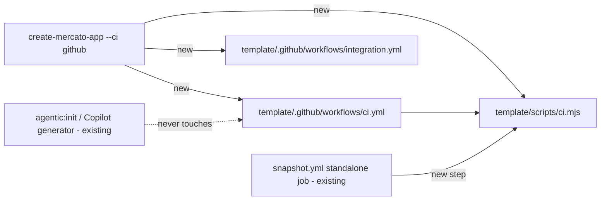

# Default CI for scaffolded standalone apps

**Date:** 2026-10-09
**Status:** in implementation (PR #7138) — Q1–Q12 resolved; the default-on choice still awaits core-team review
**Scope:** OSS. Touches `packages/create-app` (template, CLI flag, tests), `packages/cli` (opt-in `mercato test:integration --app-only`), `.github/workflows/snapshot.yml`, `apps/docs`.

## 📝 TLDR

A developer who runs `npx create-mercato-app my-app` and pushes it to GitHub today gets no CI: `packages/create-app/template/` ships no `.github/` directory, so typecheck, lint, design-system, unit-test and integration regressions go unnoticed until someone runs them by hand. **Proposed:** every new template-based app gets two GitHub Actions workflows: `ci.yml`, a quality gate that calls a new `yarn ci` script, and `integration.yml`, which runs the app's Playwright suite. Both run on every pull request and are controlled by `--ci <github|none>` (default `github`). After each snapshot publish, upstream CI runs `yarn ci` on a freshly scaffolded app (a post-publish canary), so a rotting gate goes red upstream before users hit it. After scaffolding the files belong to the user and no Open Mercato command ever rewrites them.

## ✅ Resolved decisions (2026-10-09)

| # | Decision |
|---|----------|
| Q1 | Scaffolded by default (`github`). |
| Q2 | `--ci <github\|none>`, flag-only; no new wizard prompt. |
| Q3 | The quality gate MUST pass on a free GitHub-hosted runner for a **private** repo (2 vCPU / 7 GB RAM per GitHub's runner docs). Phase 0 measures it. |
| Q4 | One `yarn ci` script is the single source of truth for the quality gate; the workflow, upstream `snapshot.yml`, and non-GitHub users call it. |
| Q5 | Integration tests are in scope. |
| Q6 | New scaffolds only. Existing apps copy the files by hand (documented). |
| Q7 | One spec; quality gate and integration are separate phases and separate files. |
| Q8 | Both workflows run on every pull request. |
| Q9 | Option A: files are user-owned; runners are chosen via repository variables; no reusable upstream workflow. |
| Q10 | Integration suite scope: an opt-in `mercato test:integration --app-only` flag limits discovery to app-owned specs and exits 0 on an empty suite before anything is built. Defaults stay unchanged; only `integration.yml` passes the flag. |
| Q11 | Upstream guard is a **post-publish canary** in `snapshot.yml` (clean scaffold, memory-capped `yarn ci`). No new PR-time standalone build job. Pre-merge coverage comes from unit and YAML-structure tests. |
| Q12 | Real-GitHub verification (needs a canary publish and a throwaway repo) is deferred to a manual follow-up. Implementation verifies locally: Verdaccio scaffold + `yarn ci` under `docker run --memory=7g --cpus=2`. |

## 📝 Problem Statement

- `packages/create-app/template/` contains no `.github/` directory (verified 2026-10-09). The only scaffold output under `.github/` today is GitHub Copilot instruction text from the agentic generator.
- The template already ships every command a gate needs (`package.json.template`: `generate`, `typecheck`, `lint`, `ds:check`, `test`, `build`, `test:integration:ephemeral`). What is missing is the workflow that runs them.
- The standalone AI development harness (`2026-07-24-standalone-ai-development-harness.md`) lets agents change the app autonomously. Without CI nothing stops a bad push.
- Searches of `.ai/specs/` and the upstream tracker on 2026-10-09 found no existing spec or issue for this.

## 📝 Market check

- **Rails** (7.2+) is the closest precedent. `rails new` generates `.github/workflows/ci.yml` (plus Dependabot) by default, and `--skip-ci` turns it off. Rails 8.1 moved the gate steps into a local `bin/ci` that the workflow calls. That is the same split as our `yarn ci` (Q4). After generation the file is user-owned. The only refresh path is the interactive `rails app:update`, which shows a diff and asks before overwriting each file.
- **Nx** offers CI only as an opt-in generator (`nx g ci-workflow`). **create-next-app**, **create-t3-app** and **create-medusa-app** ship no CI.
- **Takeaway:** we follow Rails: generate by default, provide an opt-out flag, keep the logic in a local script, and treat the file as user-owned. We skip Dependabot and CodeQL for now (see Out of scope).

## 📝 Proposed Solution

### Scaffolded files (`--ci github`)

| Scaffolded path | Purpose |
|---|---|
| `scripts/ci.mjs` + `"ci": "node ./scripts/ci.mjs"` in `package.json` | Quality gate in order: `generate` → `typecheck` → `lint` → `ds:check` → `test` → `build`. Stops at the first failure and prints which step failed. Works locally and on any CI provider. Two helper modes, both dependency-free so they run before `yarn install`: `--check-lockfile` fails with an actionable message when `yarn.lock` is still the scaffold stub, and `--prepare-env` materializes a throwaway `.env` (see Architecture). |
| `.github/workflows/ci.yml` | Runs on `pull_request` and on `push` to the default branch. Steps: checkout, Node 24 (template `engines`), Corepack (Yarn pinned by `packageManager`), yarn cache, `node scripts/ci.mjs --check-lockfile`, `yarn install --immutable`, `yarn ci`. |
| `.github/workflows/integration.yml` | Runs on `pull_request` and `workflow_dispatch`. Steps: `--check-lockfile`, install, `--prepare-env`, `npx playwright install --with-deps chromium`, `yarn test:integration:ephemeral --app-only` (Postgres via testcontainers, so the runner needs Docker). Uploads Playwright results as an artifact on failure. |

Both workflows set `concurrency: { group: <workflow>-<ref>, cancel-in-progress: ${{ github.event_name == 'pull_request' }} }`, so a new push to a PR cancels its run in progress while back-to-back pushes to the default branch each keep a result. Both set `permissions: contents: read`.

`scripts/ci.mjs` is the template's single gate definition. It is a plain Node script with no new dependencies, matching the template's other `scripts/*.mjs`.

### `--ci <github|none>`

- Parsed in `packages/create-app/src/index.ts` next to `--agents`. The default is `github`. Any other value fails with the list of valid values.
- `none` skips both workflow files. `scripts/ci.mjs` and the `ci` script are still scaffolded, because they are provider-neutral and useful locally. The workflow directory is removed after `applyStarterPreset` runs, so a preset can never re-add it.
- `--ci` given together with `--app` / `--app-url` throws, following the existing `--agents` precedent (`index.ts:596`), because imported ready apps must stay raw source snapshots (create-app `AGENTS.md` rule 7). Without the flag, ready apps simply get nothing.
- All presets (`--preset`) get the workflows, since presets are template-based.
- The post-scaffold summary prints one line naming the generated workflows and the docs link for `OM_CI_RUNS_ON`.
- **Lockfile first.** The printed next steps put `yarn install` and committing `yarn.lock` before the GitHub publish block. Pushing the stub lockfile would make the first `ci.yml` run fail on `--immutable`, and a red first check is worse than none.

### Ownership and customization (Q9)

1. **User-owned after scaffold.** Each generated workflow starts with a header comment: `Generated by create-mercato-app <version>. This file is yours: edit freely. No Open Mercato command rewrites it.` The version lets users diff against newer templates by hand.
2. **Enforced by test.** A create-app/CLI test asserts that no `agentic:init` mode (`--force`, `--update-harness`) and no generator in `packages/cli/src/lib/agentic-setup.ts` or `packages/create-app/src/setup/tools/` writes under `.github/workflows/`.
3. **Runner choice without editing the file.** `runs-on: ${{ vars.OM_CI_RUNS_ON || 'ubuntu-latest' }}` in `ci.yml`. `integration.yml` uses `vars.OM_CI_INTEGRATION_RUNS_ON || vars.OM_CI_RUNS_ON || 'ubuntu-latest'`, so a team can keep integration on hosted runners (Docker available) while the gate moves to self-hosted runners. A single label covers the common case. Multi-label arrays require editing the file, which is documented. Pull requests from forks always run on `ubuntu-latest` (`github.event.pull_request.head.repo.fork && 'ubuntu-latest' || …`), so a public repo never sends untrusted fork code to a self-hosted runner.
4. **Custom steps** go into the user's own `scripts/ci.mjs` or `ci.yml`. Nothing upstream merges into them.

If Q6 is revisited later, the update path must reuse the agentic harness's ownership manifest semantics (`agentic:init --update-harness`: refresh unchanged owned files, preserve modified ones, write `.incoming` candidates). It must never overwrite blindly. That work is out of scope here.

### Upstream guard

This is a **post-publish canary**, not a pre-merge gate (Q11). `snapshot.yml` runs on `push` to `develop`, and its `standalone-integration` job needs the npm snapshot publish first. The job gains a `yarn ci` step on the **clean** scaffold, right after `yarn install` and before it writes its own `.env` or activates enterprise/example modules, so the `.env.example` → `.env` path users hit is the one exercised. The step runs inside `docker run --memory=7g --cpus=2`, the same cap Phase 0 measures, so a memory regression goes red here. A broken template gate is caught within one snapshot cycle, but it can reach the `@develop` snapshot tag before that run goes red.

Pre-merge protection comes from unit tests in create-app: `scripts/ci.mjs` behavior, and a parse of both rendered workflow files (triggers, `runs-on` expressions, the `yarn ci` / `test:integration:ephemeral --app-only` steps), so workflow edits that never execute upstream are still checked.

## 📝 Architecture

`scripts/ci.mjs` is the only place the gate is defined. The GitHub workflow and the upstream guard both call it.

- **Coexistence in `.github/`:** the Copilot generator (`packages/create-app/src/setup/tools/github-copilot.ts`, `packages/cli/src/lib/agentic-setup.ts:818-820`) writes `copilot-instructions.md`, `instructions/*` and a `skills` link. The workflow files go under `.github/workflows/` and never collide with it.
- **Template copy:** workflow files live at `packages/create-app/template/.github/workflows/*.yml`. GitHub only reads the repository-root `.github/workflows/`, so the nested copy never runs in the monorepo. Dot-directories already ship in the published `template/` (e.g. `template/.ai/`). The version header uses a `.template` suffix for placeholder substitution, the existing mechanism. `copyDirRecursive` gains a skip for `.github/workflows` when `--ci none`.
- **Integration discovery in a fresh app:** `discoverIntegrationSpecFiles` (`packages/cli/src/lib/testing/integration-discovery.ts`) also walks `node_modules/@open-mercato`. Only `core`, `documents` and `enterprise` exclude `__integration__` from their published files, so packages such as `webhooks`, `search` and `checkout` ship platform specs into every app. Those specs need ~40 env vars and would run for hours on 2 vCPU. Discovery happens inside the Playwright config, after the ephemeral environment has started and the app has been built, and with zero specs a standalone app's Playwright exits 1 ("No tests found").
  - **Decision (Q10):** `mercato test:integration --app-only` (opt-in) computes the app-owned spec list in the CLI before anything starts: discovered specs outside `node_modules/` (`src/modules/**/__integration__`, plus `.ai/qa/tests/**` where the app's Playwright config discovers it). An empty list prints `No app-owned integration specs found` and exits 0 without starting Docker or building. A non-empty list is passed to Playwright explicitly, so platform specs never run. Without the flag nothing changes.
- **Build env without `.env`:** `.env` is gitignored, so CI checkouts have none. When `.env` is absent, `scripts/ci.mjs` copies `.env.example` to `.env` and fills only the variables `generate`/`build` provably need (identified in Phase 0; `DOCUMENTS_COLLAB_JWT_SECRET_V2` is a known candidate per the comment in `snapshot.yml`) with throwaway `ci-placeholder-*` values. It never reads or prints repository secrets, and it never overwrites an existing `.env`. The same materialization is exposed as `node scripts/ci.mjs --prepare-env`, which `integration.yml` calls before the ephemeral runner builds and boots the app.
- **Heap:** the template's `typecheck` and `build` scripts pin `NODE_OPTIONS=--max-old-space-size=8192` through `cross-env`. Phase 0 measures whether the gate fits a 7 GB runner as is. If it does not, the fix goes into those scripts (honor a pre-set heap) so `scripts/ci.mjs` keeps calling the same scripts. There is never a second gate definition.

## 📝 Data Model

None. No entities, migrations or schema changes.

## 📝 API Contracts (CLI and scaffold surface)

| Surface | Change | `BACKWARD_COMPATIBILITY.md` category |
|---|---|---|
| `create-mercato-app --ci <github\|none>` | New flag, default `github` | #13 CLI Commands: additive |
| `mercato test:integration --app-only` | New opt-in flag; default behavior unchanged | #13 CLI Commands: additive |
| Scaffolded `yarn ci` script, `scripts/ci.mjs`, `.github/workflows/*.yml` | New files in new apps only | Not a listed category (scaffold output). Existing apps untouched. Scaffold-mode change is an *Ask First* item in `packages/create-app/AGENTS.md` |
| Repository variables `OM_CI_RUNS_ON`, `OM_CI_INTEGRATION_RUNS_ON` | New, documented, optional | New public convention; names and fallback order are STABLE once shipped |

No existing flag, script or generated file changes meaning.

## 📝 Migration & Backward Compatibility

- **Existing apps** are untouched. Nothing rewrites their files, and `agentic:init` (`--force`, `--update-harness`) never writes under `.github/workflows/` (enforced by test). Teams that want the workflows copy `scripts/ci.mjs`, the `ci` script and the two workflow files by hand (documented).
- **`mercato test:integration`** keeps its default discovery and exit semantics. `--app-only` is opt-in, so a typo'd `--filter` without the flag still fails loudly.
- **Repository variables:** `OM_CI_RUNS_ON` and `OM_CI_INTEGRATION_RUNS_ON` are STABLE once shipped. Fallback order: integration uses `OM_CI_INTEGRATION_RUNS_ON`, then `OM_CI_RUNS_ON`, then `ubuntu-latest`. Fork PRs always use `ubuntu-latest`. Renaming either variable needs the deprecation protocol (keep reading the old name for at least one minor version).
- **Rollback:** flip the `--ci` default to `none` for future scaffolds. Apps already scaffolded keep their user-owned files.

## 🧪 Integration Test Coverage

No HTTP API or UI path changes, so no Playwright specs are added. Coverage is:

| Surface | Test |
|---|---|
| `scripts/ci.mjs` step order, stop on first failure, `--prepare-env` (never overwrites), `--check-lockfile` | `packages/create-app/src/lib/template-ci-script.test.ts` |
| Rendered `ci.yml` / `integration.yml` structure (triggers, concurrency, fork-guarded `runs-on`, steps, literal `${{ vars.* }}` survives placeholder substitution) | `packages/create-app/src/lib/template-ci-workflows.test.ts` |
| `--ci` parsing, invalid value, ready-app conflict, conditional copy after presets, next-steps order | create-app `index`/scaffold tests |
| No agentic generator or `agentic:init` mode writes under `.github/workflows/` | create-app + cli ownership tests |
| `--app-only` parsing, app-owned filtering, empty-suite exit 0 before environment start | `packages/cli/src/lib/testing/__tests__/` |
| Scaffolded gate end to end | Local: Verdaccio scaffold + `yarn ci` under `docker run --memory=7g --cpus=2`. Post-merge: `snapshot.yml` canary |

## 📝 Edge Cases & Failure Scenarios

| Scenario | What the user sees | Handling |
|---|---|---|
| Gate exceeds 7 GB on a private-repo runner | OOM-killed `typecheck`/`build`, red check | Phase 0 measures this. If the gate does not fit, `ci.mjs` runs memory-heavy steps with a tuned `NODE_OPTIONS` (calling `tsc`/`next build` directly instead of the `cross-env`-pinned scripts). The upstream guard runs the gate under a 7 GB memory cap so regressions surface upstream. |
| `yarn.lock` is still the scaffold stub (user pushed before `yarn install`/`yarn setup`) | Red first check | Design fix: the next-steps summary puts `yarn install` + commit `yarn.lock` before the GitHub publish block, and the workflow's `--check-lockfile` step fails first with `run yarn install and commit yarn.lock` instead of Yarn's YN0028. |
| Self-hosted runner without Docker | `integration.yml` fails at testcontainers | Documented requirement. `OM_CI_INTEGRATION_RUNS_ON` lets integration stay on hosted runners. |
| Fresh app with zero app-owned integration specs | Must be green | `--app-only` exits 0 before building (Q10); CLI unit test covers it. |
| Fresh app ships platform specs in `node_modules/@open-mercato/*` | Hours-long red runs | `--app-only` never runs them (Q10). |
| Fork PRs on public repos | No secrets available | Neither workflow needs secrets, and `permissions: contents: read`. |
| Repo on GitLab/Bitbucket | Workflows unused | `--ci none`. `yarn ci` still works in any CI. |
| Integration on every PR uses up private-repo Actions minutes (2,000 free/month) | Billing surprise | `cancel-in-progress` concurrency. The docs state the cost and show how to switch the trigger to push-only or manual. |
| Template gate drifts from what users have | Old apps keep the old gate | Accepted (Q6). The version header lets users diff by hand. |

## 📝 Risks & Impact Review

- **Default-on changes the first-run experience** (create-app `AGENTS.md` → *Ask First: scaffold modes*). This spec is that ask. A red first check is worse than no check, so Phase 0 is a hard gate: if the quality gate cannot be made to pass on 7 GB, the default flips to `none` pending a follow-up, and the core team is told why.
- **Integration on every PR** is the most expensive choice, picked deliberately (Q8). With `--app-only` an app without its own specs finishes in about a minute; the residual risk is cost once the app has specs, which the docs mitigate.
- **Canary, not gate (Q11):** a template change that breaks `yarn ci` can merge and reach the `@develop` snapshot before `snapshot.yml` goes red. Unit and YAML tests are the pre-merge line.
- **Unverified on real GitHub (Q12):** Yarn's hardened mode on `pull_request` and `vars` resolution for fork PRs are covered by design, not by an observed run, until the manual follow-up.
- **Variable names become a contract** once apps carry them. They are prefixed `OM_CI_` to avoid collisions.
- **Rollback:** removing the flag default is a one-line change for future scaffolds. Apps already scaffolded keep their files, which belong to the user anyway.

## 📋 Phasing

| Phase | Ships | Independently useful |
|---|---|---|
| 0 | Measurements recorded in this spec | Decides Phase 1 shape and the default |
| 1 | `yarn ci` + `ci.yml` + `--ci` flag + docs | Yes: quality gate alone |
| 2 | `integration.yml` + empty-suite guarantee + docs | Yes, on top of Phase 1 |
| 3 | Post-publish canary (`snapshot.yml` step, 7 GB cap) | Yes: catches template gate rot after each snapshot |

## 📋 Implementation Plan

### Phase 0: Measure (no code shipped)

1. Scaffold a fresh app from Verdaccio (`yarn test:create-app --no-shell` or the manual flow). Run `yarn install`, `yarn generate`, `yarn typecheck`, `yarn lint`, `yarn ds:check`, `yarn test`, `yarn build` inside `docker run --memory=7g --cpus=2`. Record peak memory per step, wall time and disk usage.
2. With `.env` removed and `.env.example` copied as `.env`, record which variables `generate`/`build` fail without. This gives the minimal placeholder set.
3. Record how many integration specs a fresh app discovers (app-owned vs `node_modules`) and the current zero-app-spec behavior.
4. Update this spec with the numbers and the decisions they force (heap tuning, placeholder list, empty-suite handling). **Gate:** if step 1 cannot pass at 7 GB with heap tuning, stop and escalate the default (see Risks).

### Phase 1: Quality gate

1. Add `template/scripts/ci.mjs` and the `ci` script in `package.json.template`. Unit-test the step order, stop-on-first-failure, and `.env` materialization (never overwriting an existing `.env`).
2. Add `template/.github/workflows/ci.yml.template` with the version header placeholder. Test that the YAML parses and its triggers, `runs-on` expression and `yarn ci` step are correct.
3. Add `--ci <github|none>` parsing, `--help` text, the ready-app conflict error, and conditional copy. Test default, `none`, an invalid value, and `--app` + `--ci`.
4. Add the ownership test: no agentic generator or `agentic:init` mode writes under `.github/workflows/`.
5. Docs: create-app CLI page (flag, `OM_CI_RUNS_ON`, ownership, copying into existing apps) and one routing line in the template `AGENTS.md`, staying within the 12 KiB budget (`agent-instruction-budget.test.ts` must pass).
6. Verify with `yarn test:create-app` and a Verdaccio scaffold running `yarn ci` under `docker run --memory=7g --cpus=2`. Real-GitHub verification needs a canary publish (Verdaccio scaffolds pin `localhost:4873` in `.yarnrc.yml`) and is a manual follow-up (Q12).

### Phase 2: Integration workflow

1. Add opt-in `mercato test:integration --app-only`: app-owned spec list computed in the CLI, empty list exits 0 with a clear message before the environment starts, non-empty list passed to Playwright explicitly. Defaults unchanged. Unit tests in `packages/cli`.
2. Add `template/.github/workflows/integration.yml.template` (`--check-lockfile`, `--prepare-env`, Playwright install, `test:integration:ephemeral --app-only`, artifact upload on failure, `OM_CI_INTEGRATION_RUNS_ON` fallback chain). Add the YAML structure test.
3. Docs: Docker requirement, minutes cost, and how to change the trigger.
4. Manual follow-up (Q12): on a throwaway repo from a canary scaffold, confirm an empty suite is green and that an app-owned spec under `src/modules/<module>/__integration__/` (note that create-app's `SKIP_DIRS` strips template copies, so it is added by hand) runs and can turn the check red.

### Phase 3: Post-publish canary

1. Add a `yarn ci` step to `snapshot.yml` → `standalone-integration` on the clean scaffold, right after `yarn install` and before the job writes `.env` or activates enterprise/example modules. Run it in `docker run --memory=7g --cpus=2` (the same tool as Phase 0; `systemd-run` privileges are unverified on Blacksmith runners).
2. The canary only runs after merge. Local verification covers the same command sequence; the first post-merge snapshot run is the evidence that the canary is green.

## 📝 Out of scope

Deploy (Railway has its own path), Dependabot/Renovate, CodeQL, GitLab/Bitbucket templates, and updating CI in already-scaffolded apps (Q6).

## 📝 Final Compliance Report

- No direct changes under `apps/mercato/src/`. Template-only files have no monorepo counterpart, so `template:sync` is not affected.
- No contract surface removed or changed. All additions are listed under API Contracts and Migration & Backward Compatibility.
- Ready-app imports remain raw snapshots (rule 7). The agentic ownership semantics are untouched.
- The standalone root `AGENTS.md` budget is checked by the existing test (rule 9).

## 📝 Changelog

- 2026-10-09: Skeleton, Q1–Q9 resolved, full draft.
- 2026-10-09: Folded in the pre-implementation analysis. Q10 (opt-in `--app-only` discovery), Q11 (post-publish canary), Q12 (real-GitHub verification deferred). Added the stub-lockfile fix, PR-only cancellation, fork-guarded runners, shared `--prepare-env`, the heap rule, Migration & BC and Integration Test Coverage sections.
