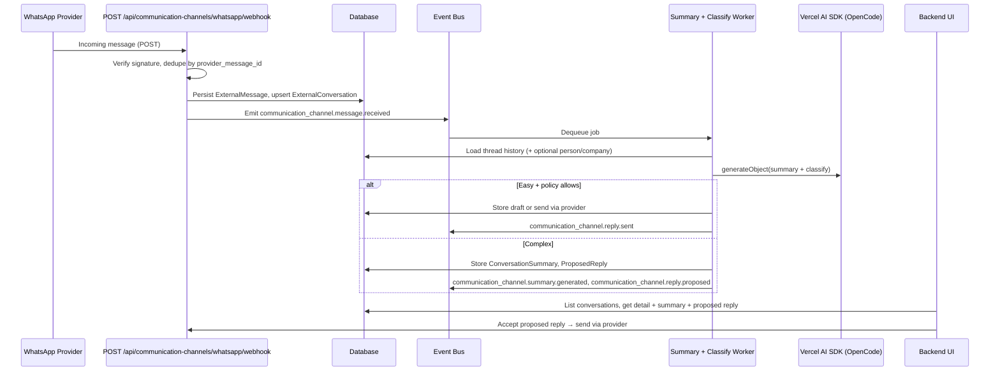

# SPEC-037: WhatsApp external communication + AI chat integration

**Date**: 2026-02-22  
**Status**: Ready for implementation  
**Depends on**: [open-mercato/open-mercato#414](https://github.com/open-mercato/open-mercato/issues/414) (Messages module)  
**Related**: [SPEC-045](SPEC-045-2026-02-24-integration-marketplace.md) (Integration Marketplace), [SPEC-045d](SPEC-045d-communication-notification-hubs.md) (Communication & Notification Hubs), [Issue #676](https://github.com/open-mercato/open-mercato/issues/676) (Integrations panel)  
**Extends**: Messaging / external channel integration (Issue #414). Implements the first **communication channel** provider (WhatsApp) under the `communication_channels` hub per SPEC-045d.

---

## TLDR

**Key Points:**
- Integrate external customer communication via WhatsApp with Open Mercato.
- Persist WhatsApp conversation history and expose it in-app (aligned with Messages module once #414 lands).
- AI summarizes conversations and, for simple cases, drafts or sends replies; for complex cases, AI produces a summary and a proposed message for human approval only.

**Scope:**
- WhatsApp conversation ingestion and conversation history storage.
- AI-generated conversation summaries.
- AI-handled replies for “easy” messages (e.g. FAQs, simple confirmations); human-in-the-loop for complex cases (summary + proposed message to accept/edit).

**Concerns:**
- WhatsApp Business API eligibility, webhook setup, and tenant-scoped channel configuration.
- Clear boundary between “easy” (AI may send) vs “complex” (AI proposes only) to avoid incorrect auto-replies.
- PII and tenant isolation for external contact data and message content.

---

## Required Sections (MUST Include)

1. TLDR ✅  
2. Overview ✅  
3. Problem Statement ✅  
4. Proposed Solution ✅  
5. Architecture ✅  
6. Data Models ✅  
7. API Contracts ✅  
8. Risks & Impact Review ✅  
9. Final Compliance Report ✅  
10. Changelog ✅  

---

## Overview

This spec extends the messaging story (Issue #414 — Messages module) with **external communication via WhatsApp** and **AI-assisted handling**: conversation history, summaries, and tiered AI behavior (auto-respond when safe, propose-only when complex).

**Target audience:** Tenants who communicate with customers or partners over WhatsApp and want those conversations in one place, with AI summaries and optional AI replies for simple cases.

**Package location (aligned with SPEC-045 / SPEC-045d):**
- **Hub:** `packages/core/src/modules/communication_channels/` — channel registry, entities (CommunicationChannel, ExternalConversation, ExternalMessage, ConversationSummary, ProposedReply), AI summary/classify service, API routes for conversations/summary/proposed-reply and channel CRUD. Credentials via the shared **Integration Credentials API** (SPEC-045).
- **First spoke:** `packages/core/src/modules/channel_whatsapp/` — WhatsApp Cloud API client, `ChannelAdapter` implementation, `integration.ts` (category: `communication`, hub: `communication_channels`), webhook verification and inbound message parsing. Admin discovers and configures WhatsApp from the unified Integrations panel (`/backend/integrations`).

> **Market Reference:** Solutions like Twilio Conversations, MessageBird, and Zendesk WhatsApp integrations combine channel connectivity with conversation history and (often) bot/AI layers. We adopt: conversation history as first-class data, AI summary + human-in-the-loop for non-trivial replies. We defer: full no-code bot builder; we focus on “summary + easy vs complex” routing.

---

## Problem Statement

- **Fragmented communication:** Customer conversations live only in WhatsApp; staff must switch context and lack a single view in the ERP.
- **No history in-app:** There is no conversation history from WhatsApp inside Open Mercato, making it hard to audit or link to deals/orders.
- **Manual summarization:** Long threads require manual reading and summarization; no AI-generated summary.
- **Repetitive replies:** Simple questions (availability, status, FAQs) could be answered by AI, but today everything is manual.
- **Risky auto-reply:** Automatically sending AI replies on complex or sensitive topics is undesirable; users need “summary + proposed message” for those cases.

---

## Proposed Solution

1. **Conversation history**
   - Ingest WhatsApp conversations (via WhatsApp Business API or approved provider) and store them in a tenant-scoped way.
   - Model aligns with or extends the Messages module (Issue #414) so that external threads can be represented as threads/conversations with a channel type (e.g. `whatsapp`).
   - Users can view full conversation history in the app, optionally linked to a contact/company/deal.

2. **AI summary**
   - For each conversation (or on-demand for a thread), AI produces a short summary (e.g. intent, key facts, open questions).
   - Summary is stored and displayed in the UI next to the thread.

3. **AI handling tier**
   - **Easy messages:** When the incoming message is classified as “easy” (e.g. simple FAQ, confirmation, greeting), AI may either draft a reply for one-click send or (if policy allows) send the reply automatically. Criteria for “easy” to be defined (e.g. confidence threshold, allowed intents).
   - **Complex messages:** When the case is complex or confidence is low, AI does **not** send. It only produces (a) a conversation summary and (b) a **proposed message** for the human to accept, edit, or reject before sending.

4. **Integration with Messages module (#414)**
   - Implementation waits for PR/merge of open-mercato/open-mercato#414.
   - Reuse or extend threading, message types, and (where applicable) notifications/email patterns from the Messages module for consistency. External channel messages are a distinct “type” or channel so that internal vs WhatsApp (and future channels) remain clear.

### Design Decisions (to be refined in implementation spec)

| Decision | Rationale |
|----------|-----------|
| Depend on Messages module (#414) | Avoid duplicate threading/notification logic; keep one messaging model. |
| Human-in-the-loop for complex | Prevents incorrect or sensitive auto-replies; aligns with InboxOps-style proposals (SPEC-029). |
| “Easy” vs “complex” via classifier + confidence | Enables safe auto-reply only where risk is low; rest stays proposal-only. |

### Alternatives Considered

| Alternative | Why Rejected |
|-------------|--------------|
| No AI, only history | User asked explicitly for AI summary and AI-assisted replies. |
| Full auto-reply for all | Too risky; complex cases must remain human-approved. |
| Separate product for WhatsApp only | Prefer extension of messaging so one inbox/conversation model. |

---

## User Stories / Use Cases

| ID | Actor | Use Case | Description | Priority |
|----|-------|----------|-------------|----------|
| W1 | Operator | View WhatsApp history | See full conversation history from WhatsApp in-app, linked to contact/company | High |
| W2 | Operator | View AI summary | See AI-generated summary of a thread (intent, key facts, open questions) | High |
| W3 | Operator | AI replies to easy messages | AI drafts or sends replies for simple cases (FAQ, greeting, order status) | High |
| W4 | Operator | Review proposed reply | For complex cases, see summary + proposed message; accept, edit, or reject before sending | High |
| W5 | Org Admin | Enable/disable AI features | Turn AI summary and/or AI reply on or off at organization level | High |
| W6 | Employee | Opt out of AI handling | Disable AI auto-reply or proposals for own inbox/workflow | Medium |
| W7 | System | Ingest WhatsApp messages | Receive webhook from WhatsApp provider, validate, persist, link to thread | High |
| W8 | System | Classify easy vs complex | LLM classifies incoming message; route to auto-reply or proposal-only | High |

- **Operator** wants to see WhatsApp conversation history in Open Mercato so that they have one place for all customer communication.
- **Operator** wants an AI-generated summary of a WhatsApp thread so that they can quickly understand what was discussed without reading every message.
- **Operator** wants the AI to answer simple customer messages (e.g. “Is my order shipped?”) so that routine replies are handled faster.
- **Operator** wants the AI to suggest a reply for complex or sensitive topics without sending it, so that they can edit and approve before the customer sees it.

---

## Architecture Decisions (Review Feedback)

The following decisions align with reviewer feedback (dominikpalatynski, pkarw) and with the structure of the Messages module spec (SPEC-002, PR #569).

### 1. Integration with existing Messages flow

- **Unified threading:** External WhatsApp threads are represented as **conversation threads** that plug into the Messages module (post-#414). Options:
  - **Option A (recommended):** Introduce a **channel** dimension: Messages module gains optional `channel_type` (e.g. `internal` | `whatsapp`) and `channel_id` (FK to a channel config entity). Internal messages use `channel_type = 'internal'`; WhatsApp messages use `channel_type = 'whatsapp'` and reference the same `Message` / thread model where applicable, with provider-specific fields stored in JSON or a side table.
  - **Option B:** Separate `external_conversations` and `external_messages` entities that reference Messages `thread_id` when a thread is "linked" to an internal thread, and that register a **message type** (e.g. `messages.whatsapp` or `communication_channel.whatsapp`) in the Messages type registry for display in a unified inbox view.
- **Message type registry:** Register at least one message type for WhatsApp (e.g. `communication_channel.whatsapp`) with a custom renderer so WhatsApp threads can appear in the same inbox/list patterns as in SPEC-002, with a clear visual distinction (channel badge, icon).
- **Events:** Emit events that follow the existing convention `module.entity.action` (e.g. `communication_channel.message.received`, `communication_channel.summary.generated`, `communication_channel.reply.proposed`). Subscribers and workers consume these; no direct cross-module ORM relations — FK IDs only.

### 2. AI-assisted flow ownership and controls

| Control | Owner | Mechanism | Rationale |
|--------|--------|-----------|-----------|
| **Org-level enable/disable** | Org Admin | Organization setting or feature flag (e.g. `organization_settings.ai_whatsapp_summary_enabled`, `ai_whatsapp_reply_enabled`). When disabled, no AI summary or AI reply runs for that org. | Ensures tenants can turn off AI entirely. |
| **Employee opt-out** | Employee | User preference (e.g. `user_preferences.whatsapp_ai_auto_reply_opt_out` or "Don't suggest AI replies for my conversations"). When set, AI may still generate summaries and proposals, but they are not shown or applied for threads assigned to that user; or all proposals require explicit accept. | Respects individual choice and workload. |
| **Scoping** | System | All AI features are tenant-scoped; only data for the current `organization_id` / `tenant_id` is used in prompts and storage. | Tenant isolation and compliance. |

### 3. Priority and routing strategy (easy vs complex)

- **Execution:** A **worker** (or event subscriber that enqueues a job) runs after `communication_channel.message.received`. It:
  1. Loads thread history (and optional CRM context: linked person/company, recent orders).
  2. Calls an LLM **classifier** (e.g. Vercel AI SDK `generateObject()` with a Zod schema) that returns: `classification: 'easy' | 'complex'`, `confidence: number`, optional `suggestedReply` for easy.
  3. **Enforcement rules:**
     - **Easy:** Only if `confidence >= threshold` (e.g. 0.9) and intent is in an allow-list (e.g. greeting, order_status, faq). Then either store draft reply for one-click send or (if org setting allows) send automatically.
     - **Complex:** Always produce only a **summary** and a **proposed message**; never send. Show in UI for accept/edit/reject.
- **Configurable threshold and allow-list:** Stored in org or channel config so each tenant can tune sensitivity (e.g. higher threshold = fewer auto-replies).
- **Audit:** All auto-sent and proposed replies are logged (who approved, when, and the final body) for compliance.

### 4. Concrete implementation proposal

Aligned with SPEC-002 (Messages module) and SPEC-029 (InboxOps). Implementation waits for merge of PR #569 (Messages module).

#### 4.1 New DB entities and migrations

| Entity | Table | Purpose |
|--------|--------|---------|
| **CommunicationChannel** (or **ExternalChannel**) | `communication_channels` | Per-tenant channel config: `channel_type` (e.g. `whatsapp`), provider config (encrypted secrets), `organization_id`, `tenant_id`. Supports future Discord, iMessage (see #676). |
| **ExternalConversation** | `external_conversations` | One row per external thread: `channel_id` (FK), `external_thread_id` (provider's thread id), optional `message_thread_id` (FK to Messages thread when unified), optional `person_id` / `company_id` (FK), `tenant_id`, `organization_id`. |
| **ExternalMessage** | `external_messages` | Incoming/outgoing message: `external_conversation_id`, `direction` (inbound/outbound), `body`, `provider_message_id`, `sent_at`, optional `message_id` (FK to Messages when we create an internal message for the reply). |
| **ConversationSummary** | `conversation_summaries` | `external_conversation_id`, `summary_text`, `generated_at`, `model/source`, `tenant_id`. One active summary per thread (or versioned). |
| **ProposedReply** | `proposed_replies` | `external_conversation_id`, `external_message_id` (which message triggered it), `proposed_body`, `status` (pending / accepted / rejected), `accepted_by_user_id`, `accepted_at`, `sent_message_id` (FK after send). |

Migrations live under `packages/core/src/modules/communication_channels/migrations/` (hub). All tables have `tenant_id` and `organization_id` where applicable; indexes for list/detail by tenant and channel.

#### 4.2 New API routes and contracts

| Method | Path | Purpose |
|--------|------|---------|
| POST | `/api/communication-channels/whatsapp/webhook` | WhatsApp provider webhook; verify signature; idempotent persist of incoming message; emit `communication_channel.message.received`. |
| GET | `/api/communication-channels/conversations` | List conversations (tenant-scoped, paginated, filter by channel). |
| GET | `/api/communication-channels/conversations/[id]` | Thread detail + messages + latest summary + pending proposed reply. |
| POST | `/api/communication-channels/conversations/[id]/summary` | Request or refresh AI summary (enqueues job or runs inline per design). |
| POST | `/api/communication-channels/conversations/[id]/proposed-reply` | Accept or reject proposed reply; if accept, optional edit then send via WhatsApp (and optionally create Message in Messages module). |
| GET | `/api/communication-channels/channels` | List configured channels for the org (for admin UI). |
| POST | `/api/communication-channels/channels` | Create/register a channel (e.g. WhatsApp); credentials stored via Integration Credentials API (SPEC-045). |

All request/response bodies validated with Zod; routes export `openApi` for docs.

#### 4.3 New UI pages and components

| Page / Component | Path / Location | Purpose |
|------------------|-----------------|---------|
| Communication channels (admin) | `/backend/communication-channels` or under settings | List channels; add/edit WhatsApp (and future drivers); encrypted secrets storage. Aligns with pkarw's "Communication channel" page idea (#676). |
| WhatsApp conversations list | e.g. `/backend/communication-channels/whatsapp` or `/backend/messages?channel=whatsapp` | List external conversations with last message, summary snippet, unread/proposal indicators. |
| Conversation detail | e.g. `/backend/communication-channels/conversations/[id]` | Thread view (messages), AI summary panel, proposed reply card (accept / edit / reject). |
| Optional: unified inbox | Reuse Messages inbox with filter by `channel_type` | If Messages module supports channel filter, show internal + WhatsApp in one list with clear labels. |

Reference: SPEC-002 backend pages and components; Gmail/Attio-style email support for layout inspiration (per pkarw).

#### 4.4 Events, subscribers, and workers

| Event (convention: `module.entity.action`) | Emitter | Subscriber / worker responsibility |
|-------------------------------------------|--------|-------------------------------------|
| `communication_channel.message.received` | Webhook handler after persisting `ExternalMessage` | Enqueue job: (1) generate/update summary, (2) run classifier (easy vs complex), (3) if easy and policy allows → create draft or send reply; if complex → create ProposedReply only. |
| `communication_channel.summary.generated` | Summary worker after storing `ConversationSummary` | Optional: notify user, update UI cache. |
| `communication_channel.reply.proposed` | Classification worker when creating ProposedReply | Optional: in-app notification for assigned user. |
| `communication_channel.reply.sent` | After sending reply via provider | Optional: link to Messages module (create Message for audit). |

Workers use the same queue/worker contract as in SPEC-002 and SPEC-029; idempotency keys per thread/message to avoid duplicate summary or reply.

---

## Relationship to SPEC-045 and SPEC-045d

This spec is the **first concrete implementation** of the Communication Channels hub described in SPEC-045d (Phase 4 of the Integration Marketplace, PR #710):

- **Hub:** The `communication_channels` module owns the channel registry, conversation/message entities, AI summary and classification, and all API routes. It uses the shared **Integration Credentials API** (SPEC-045) for storing WhatsApp (and future provider) secrets. Channel configuration appears in the unified **Integrations** admin panel (`/backend/integrations`).
- **Spoke:** The `channel_whatsapp` module implements the `ChannelAdapter` contract (SPEC-045d §1.1): `sendMessage`, `verifyWebhook`, `getStatus`, and optionally `listSenders`. It declares `integration.ts` with `category: 'communication'`, `hub: 'communication_channels'`, and credential fields (access token, phone number ID, business account ID, webhook verify token, app secret). No duplicate entities: all persistence stays in the hub.
- **Events:** Event IDs use the hub entity name `communication_channel.*` so that future spokes (e.g. Discord, Twilio) emit the same event family.

Aligning with SPEC-045/045d ensures a single place for operators to enable/configure WhatsApp and future channels, consistent credential storage and operation logging, and a clear path to add more providers without changing the hub schema.

---

## Communication channels as extension point (future #676)

pkarw suggested a **general way of defining communication channels** — not only WhatsApp but Discord, iMessage, etc. — with a dedicated "Communication channel" admin page where channels are defined by **strategies/drivers** (e.g. WhatsApp Business, Discord bot), and secrets stored encrypted in the database. This spec assumes that direction:

- **Phase 1 (this spec):** WhatsApp as the first driver; channel config and encrypted secrets in DB; one channel type in the list.
- **Phase 2 (#676 / SPEC-045):** Generalize to a **channel registry** and multiple drivers (WhatsApp, Discord, iMessage, …), with a single admin UI at `/backend/integrations` (Integration Marketplace) and per-channel strategy/driver configuration. This spec's hub entities (e.g. `CommunicationChannel`, `ExternalConversation`, `ExternalMessage`) are designed so that adding a new spoke (e.g. `channel_discord`) with its own `ChannelAdapter` and `integration.ts` is straightforward without changing the core schema.

---

## Architecture

- **Ingestion:** Webhook (or poll) from WhatsApp provider → validate → persist as messages/conversation events (tenant-scoped). Link to external contact/phone.
- **Summary job:** On new thread or on-demand, call LLM (Vercel AI SDK / OpenCode contract) to generate summary; store with thread.
- **Classification + reply:**
  - Classifier (LLM or rules) labels incoming message as “easy” or “complex.”
  - Easy: generate reply (and optionally send if policy allows); store as draft or sent message.
  - Complex: generate summary + proposed message only; present in UI for accept/edit/reject.
- **Events:** e.g. `communication_channel.message.received`, `communication_channel.summary.generated`, `communication_channel.reply.proposed` (naming to align with hub module and existing events convention).
- **Module boundary:** FK-only links to customers/people/companies; no direct ORM relations across modules. All queries scoped by `organization_id` / tenant.

### Architecture diagram and components

| Component | Location | Responsibility |
|-----------|----------|----------------|
| Webhook handler | Hub: `api/post/communication-channels/whatsapp/webhook/route.ts` (delegates to `channel_whatsapp` adapter) | Validate provider signature (via spoke adapter), parse body, idempotent persist (by `provider_message_id`), emit `communication_channel.message.received`. |
| Conversations API | Hub: `api/get/communication-channels/conversations/route.ts`, `.../conversations/[id]/route.ts` | List/detail tenant-scoped; include latest summary and pending ProposedReply. |
| Summary API | Hub: `api/post/communication-channels/conversations/[id]/summary/route.ts` | Enqueue summary job or trigger inline; return job id or updated summary. |
| Proposed-reply API | Hub: `api/post/communication-channels/conversations/[id]/proposed-reply/route.ts` | Accept/reject; on accept optionally edit body then send via WhatsApp (spoke adapter); update ProposedReply status. |
| Channels API | Hub: `api/get/communication-channels/channels/route.ts`, `api/post/communication-channels/channels/route.ts` | CRUD for CommunicationChannel; credentials via Integration Credentials API (SPEC-045). |
| Summary + classify worker | Hub: `workers/summary-classify.worker.ts` | On `communication_channel.message.received`: load thread; call LLM; persist ConversationSummary and/or ProposedReply or send via spoke adapter; emit events. |
| Event definitions | Hub: `events.ts` | `communication_channel.message.received`, `communication_channel.summary.generated`, `communication_channel.reply.proposed`, `communication_channel.reply.sent`. |
| WhatsApp adapter & client | Spoke: `channel_whatsapp/lib/adapter.ts`, `channel_whatsapp/lib/client.ts` | Implements `ChannelAdapter` (SPEC-045d); webhook verification, send message, get status. |

---

## Data Models

**Module (hub):** `communication_channels`. Entities in `packages/core/src/modules/communication_channels/data/entities.ts`; migrations in `communication_channels/migrations/`. WhatsApp-specific code lives in spoke `channel_whatsapp` (adapter, client, `integration.ts` per SPEC-045d).

### CommunicationChannel

**Table:** `communication_channels`

| Field | Type | Nullable | Description |
|-------|------|----------|-------------|
| id | UUID | No | PK, default `gen_random_uuid()` |
| channel_type | text | No | e.g. `whatsapp` |
| name | text | No | Display name for admin UI |
| provider_config | jsonb | Yes | Provider-specific config; or reference to Integration Credentials (SPEC-045). Secrets encrypted per project pattern. |
| organization_id | UUID | No | Tenant scope |
| tenant_id | UUID | No | Tenant scope |
| is_active | boolean | No | Default true |
| created_at | timestamptz | No | |
| updated_at | timestamptz | No | |

**Indexes:** `(tenant_id, organization_id)`, `(channel_type, tenant_id)`.

### ExternalConversation

**Table:** `external_conversations`

| Field | Type | Nullable | Description |
|-------|------|----------|-------------|
| id | UUID | No | PK |
| channel_id | UUID | No | FK → communication_channels.id |
| external_thread_id | text | No | Provider conversation id (unique per channel). |
| message_thread_id | UUID | Yes | FK → messages.id (thread) when unified with Messages module. |
| person_id | UUID | Yes | FK → people.id |
| company_id | UUID | Yes | FK → companies.id |
| organization_id | UUID | No | Tenant scope |
| tenant_id | UUID | No | Tenant scope |
| created_at | timestamptz | No | |
| updated_at | timestamptz | No | |

**Unique:** `(channel_id, external_thread_id)`. **Indexes:** `(tenant_id, channel_id)`, `(person_id)`, `(company_id)`.

### ExternalMessage

**Table:** `external_messages`

| Field | Type | Nullable | Description |
|-------|------|----------|-------------|
| id | UUID | No | PK |
| external_conversation_id | UUID | No | FK → external_conversations.id |
| direction | text | No | `inbound` \| `outbound` |
| body | text | No | Message body |
| provider_message_id | text | No | Provider message id (idempotency) |
| sent_at | timestamptz | No | |
| message_id | UUID | Yes | FK → messages.id when outbound mirrored to Messages |
| organization_id | UUID | No | Tenant scope |
| tenant_id | UUID | No | Tenant scope |
| created_at | timestamptz | No | |

**Unique:** `(external_conversation_id, provider_message_id)`. **Indexes:** `(external_conversation_id, sent_at)`, `(tenant_id)`.

### ConversationSummary

**Table:** `conversation_summaries`

| Field | Type | Nullable | Description |
|-------|------|----------|-------------|
| id | UUID | No | PK |
| external_conversation_id | UUID | No | FK → external_conversations.id |
| summary_text | text | No | AI-generated summary |
| model_or_source | text | Yes | e.g. model name |
| organization_id | UUID | No | Tenant scope |
| tenant_id | UUID | No | Tenant scope |
| generated_at | timestamptz | No | |

**Index:** `(external_conversation_id)`.

### ProposedReply

**Table:** `proposed_replies`

| Field | Type | Nullable | Description |
|-------|------|----------|-------------|
| id | UUID | No | PK |
| external_conversation_id | UUID | No | FK → external_conversations.id |
| external_message_id | UUID | No | FK → external_messages.id (trigger message) |
| proposed_body | text | No | Draft reply text |
| status | text | No | `pending` \| `accepted` \| `rejected` |
| accepted_by_user_id | UUID | Yes | Set on accept |
| accepted_at | timestamptz | Yes | |
| sent_message_id | UUID | Yes | FK → external_messages.id after send |
| organization_id | UUID | No | Tenant scope |
| tenant_id | UUID | No | Tenant scope |
| created_at | timestamptz | No | |
| updated_at | timestamptz | No | |

**Indexes:** `(external_conversation_id, status)`, `(tenant_id)`.

### Migration strategy

Generate migrations with `yarn db:generate` after defining MikroORM entities. Order: `communication_channels` → `external_conversations` → `external_messages` → `conversation_summaries` → `proposed_replies`. Use appropriate ON DELETE (e.g. CASCADE for messages when conversation deleted).

---

## API Contracts

All request/response bodies validated with Zod (schemas in `data/validators.ts`). All routes export `openApi` for docs. Base path: `/api/communication-channels`. Tenant context from auth; every route enforces `organization_id` / `tenant_id`.

### POST `/api/communication-channels/whatsapp/webhook`

**Purpose:** Receive inbound messages from WhatsApp provider. Idempotent by `provider_message_id`.

**Request:** Body is provider-specific (e.g. WhatsApp Cloud API payload). Headers: provider signature for verification.

**Response:** `200 OK` (always, to avoid provider retries). No body or `{ received: true }`. On validation failure or invalid signature: `401` or `400`.

**Side effects:** Persist `ExternalMessage` + upsert `ExternalConversation`; emit `communication_channel.message.received`.

### GET `/api/communication-channels/conversations`

**Query (Zod):** `channelId?: UUID`, `personId?: UUID`, `companyId?: UUID`, `page`, `pageSize` (max 100), `since?: ISO datetime`.

**Response:** `200` — `{ items: ExternalConversationListItem[], total, page, pageSize }`. Each item: id, channelId, externalThreadId, personId, companyId, lastMessageAt, lastMessageSnippet, hasPendingProposedReply, summarySnippet (if any). All tenant-scoped.

### GET `/api/communication-channels/conversations/[id]`

**Params:** `id` = ExternalConversation id (UUID).

**Response:** `200` — conversation detail + `messages: ExternalMessage[]` (ordered by sent_at) + `summary?: ConversationSummary` + `pendingProposedReply?: ProposedReply`. `404` if not found or wrong tenant.

### POST `/api/communication-channels/conversations/[id]/summary`

**Purpose:** Request or refresh AI summary. Enqueues job or runs inline (design choice).

**Body (optional):** `{ forceRefresh?: boolean }`.

**Response:** `202` with `{ jobId }` if async, or `200` with `{ summary: ConversationSummary }` if inline. `404` if conversation not found.

### POST `/api/communication-channels/conversations/[id]/proposed-reply`

**Purpose:** Accept or reject a pending proposed reply; on accept, optionally edit body then send via WhatsApp.

**Body (Zod):** `{ action: 'accept' | 'reject', proposedReplyId: UUID, editedBody?: string }`. If action is accept and editedBody provided, use editedBody for send.

**Response:** `200` — `{ status: 'accepted' | 'rejected', sentMessageId?: UUID }`. `404` if proposed reply or conversation not found. `409` if proposed reply already accepted/rejected.

**Side effects:** Update ProposedReply status; on accept, call WhatsApp provider (via spoke adapter) to send message, persist outbound ExternalMessage, emit `communication_channel.reply.sent`.

### GET `/api/communication-channels/channels`

**Response:** `200` — `{ items: CommunicationChannel[] }` (no decrypted secrets in response; credentials resolved via Integration Credentials API). Tenant-scoped.

### POST `/api/communication-channels/channels`

**Body (Zod):** `{ channelType: 'whatsapp', name: string, integrationId?: string, ... }`. Credentials stored via Integration Credentials API (SPEC-045); channel links to integration state.

**Response:** `201` — `{ id, channelType, name, ... }`. `400` if validation fails.

---

## Risks & Impact Review

### Risk Register

#### Duplicate or lost webhook payloads
- **Scenario:** Provider retries webhook; duplicate `provider_message_id` leads to duplicate rows or inconsistent state. Or webhook fails after persist but before emit, so worker never runs.
- **Severity:** Medium
- **Affected area:** External messages, conversation state, summary/reply pipeline
- **Mitigation:** Idempotent webhook: unique constraint on `(external_conversation_id, provider_message_id)`; upsert ExternalConversation by `(channel_id, external_thread_id)`. Emit event after successful flush; if emit fails, at least message is stored and can be processed by a repair job or next trigger.
- **Residual risk:** Rare duplicate emit may cause duplicate summary job; worker should be idempotent (e.g. keyed by conversation + last message id).

#### Summary or classify worker failure
- **Scenario:** LLM timeout, rate limit, or exception; worker crashes or returns error.
- **Severity:** Medium
- **Affected area:** New messages get no summary or proposed reply; user sees raw thread only
- **Mitigation:** Queue with retry (exponential backoff); dead-letter after N failures. No auto-send on worker failure (complex path is default when classifier fails). Optional: fallback to "complex" when confidence low or error.
- **Residual risk:** Temporary backlog; user can still reply manually. Monitoring and alerting on DLQ.

#### Wrong tenant or org data in LLM context
- **Scenario:** Bug passes another tenant's conversation or org data into prompt; or response written to wrong tenant.
- **Severity:** Critical
- **Affected area:** Tenant isolation, PII leakage
- **Mitigation:** Worker receives only `organization_id` and `tenant_id` from event; load conversation/messages with explicit tenant filter. All writes include tenant_id/organization_id. No cross-tenant queries. Code review and tests for tenant scoping.
- **Residual risk:** Implementation bug; mitigated by mandatory tenant filters in shared data access layer.

#### WhatsApp provider outage or rate limit
- **Scenario:** Provider API down or rate-limited; outbound send fails; webhook delivery fails.
- **Severity:** Medium
- **Affected area:** Inbound ingestion, outbound reply (accept proposed reply)
- **Mitigation:** Webhook returns 200 on persist so provider does not retry indefinitely; store raw payload or id for manual replay if needed. Outbound send: retry with backoff; show user-facing error and keep ProposedReply in accepted-but-not-sent state for retry. Rate limits: respect provider headers; queue outbound sends if needed.
- **Residual risk:** Delayed messages; user sees failure and can retry.

#### Auto-sent reply on borderline "easy" case
- **Scenario:** Classifier mislabels a complex message as easy; AI sends an inappropriate or incorrect reply.
- **Severity:** High
- **Affected area:** Customer trust, compliance
- **Mitigation:** Confidence threshold (e.g. 0.9) and allow-list of intents (greeting, order_status, faq); org can disable auto-reply entirely; audit log of all auto-sent replies (who/what/when). Prefer "propose only" as default; enable auto-send only when org explicitly opts in.
- **Residual risk:** Edge cases; mitigated by human review of samples and tuning threshold.

#### Migration and Messages module dependency
- **Scenario:** PR #569 (Messages module) not merged; or schema change in Messages breaks our FKs (e.g. message_thread_id).
- **Severity:** Medium
- **Affected area:** Unified inbox, optional Message mirroring
- **Mitigation:** Implement communication_channels hub so it can run without Messages (message_thread_id nullable). Phase integration (register message type, link thread) after #569 is merged. No hard dependency in DB; optional link.
- **Residual risk:** Delayed unified experience until Messages is stable.

#### Secrets in provider_config
- **Scenario:** Credentials in provider_config leaked via log, export, or insufficient encryption.
- **Severity:** Critical
- **Affected area:** WhatsApp (or other provider) account takeover
- **Mitigation:** Use project-wide encryption for sensitive fields (same pattern as other encrypted columns). Never log or return raw provider_config in API responses. Mask in UI and logs.
- **Residual risk:** Key compromise; same as rest of platform encryption.

---

## Final Compliance Report — 2026-02-23

### AGENTS.md Files Reviewed

- `AGENTS.md` (root)
- `packages/core/AGENTS.md`
- `packages/ai-assistant/AGENTS.md` (AI flows)
- `packages/events/AGENTS.md` (event subscribers/workers)
- `.ai/specs/AGENTS.md`

### Compliance Matrix

| Rule Source | Rule | Status | Notes |
|-------------|------|--------|-------|
| root AGENTS.md | No direct ORM relationships between modules | Compliant | Only FK IDs (person_id, company_id, message_thread_id, message_id). |
| root AGENTS.md | Filter by organization_id / tenant_id | Compliant | All entities and queries scoped; documented in Data Models and API. |
| root AGENTS.md | Validate inputs with Zod | Compliant | API Contracts require Zod in validators.ts; openApi export. |
| root AGENTS.md | Event IDs: module.entity.action | Compliant | communication_channel.message.received, .summary.generated, .reply.proposed, .reply.sent. |
| packages/core/AGENTS.md | API routes export openApi | Compliant | Spec requires openApi for all routes. |
| packages/core/AGENTS.md | Module structure (index, acl, setup, events, data/entities) | Compliant | Hub communication_channels with entities, events, workers; spoke channel_whatsapp with adapter, integration.ts (SPEC-045d). |
| packages/events/AGENTS.md | Event bus, subscribers, workers | Compliant | Events emitted from webhook/worker; worker subscribes or uses queue. |
| .ai/specs/AGENTS.md | Spec naming, changelog, required sections | Compliant | SPEC-037, changelog maintained, all sections present. |

### Internal Consistency Check

| Check | Status | Notes |
|-------|--------|-------|
| Data models match API contracts | Pass | Entities align with GET/POST payloads (conversations, summary, proposed-reply, channels). |
| API contracts match UI/UX section | Pass | Architecture Decisions 4.3 (UI pages) align with conversation list/detail and proposed-reply API. |
| Risks cover all write operations | Pass | Webhook persist, worker (summary/proposed reply/send), accept proposed reply; each has risk or mitigation. |
| Commands defined for all mutations | Pass | Mutations are API-driven (webhook, summary job, proposed-reply accept); command pattern can be applied at implementation (e.g. AcceptProposedReplyCommand). |
| Tenant isolation explicit | Pass | All entities and routes scoped; risk register includes wrong-tenant scenario. |

### Non-Compliant Items

None. Implementation should add ACL features (e.g. `communication_channels.view`, `communication_channels.manage`, `communication_channels.channels.manage`; optional `channel_whatsapp.manage` for spoke) in `acl.ts` and declare in `setup.ts` per packages/core/AGENTS.md.

### Verdict

**Fully compliant** — Approved, ready for implementation.

---

## Changelog

### 2026-02-28 (alignment with SPEC-045 / PR #710)
- Aligned with SPEC-045 (Integration Marketplace) and SPEC-045d (Communication & Notification Hubs) per pkarw feedback on PR #674.
- Renamed hub module from `external_channels` to `communication_channels`; WhatsApp as first spoke `channel_whatsapp` with `ChannelAdapter` and `integration.ts`. API base path `/api/external-channels` → `/api/communication-channels`; event IDs `external_channel.*` → `communication_channel.*`.
- Credentials: channel config uses Integration Credentials API (SPEC-045); admin UI for channels via unified Integrations panel. Added "Relationship to SPEC-045 and SPEC-045d" section and updated component table (hub vs spoke locations), compliance matrix, and ACL feature names.

### 2026-02-23 (implementation-ready)
- Filled Architecture: sequence diagram (webhook → worker → LLM → UI), component table (webhook, APIs, worker, events). Removed skeleton label.
- Filled Data Models: full field list and indexes for CommunicationChannel, ExternalConversation, ExternalMessage, ConversationSummary, ProposedReply; migration strategy (`yarn db:generate`, entity order).
- Filled API Contracts: POST webhook, GET/POST conversations and [id], POST summary, POST proposed-reply, GET/POST channels; request/response and side effects per route.
- Filled Risks & Impact Review: risk register (duplicate webhook, worker failure, tenant leakage, provider outage, auto-reply misuse, migration dependency, secrets).
- Filled Final Compliance Report: AGENTS.md matrix, internal consistency check, verdict (fully compliant). Status set to Ready for implementation.

### 2026-02-23
- Added Architecture Decisions (review feedback): (1) Integration with Messages flow (channel dimension, message type registry, events); (2) AI flow ownership (org-level enable/disable, employee opt-out); (3) Priority/routing strategy (easy vs complex, classifier, threshold, allow-list); (4) Concrete implementation (DB entities, API routes, UI pages, events/subscribers/workers). Added use case table (W1–W8). Added Communication channels extension point (future #676). Aligns with SPEC-002 and PR #569 (dominikpalatynski, pkarw).

### 2026-02-22
- Initial specification (skeleton). Depends on open-mercato/open-mercato#414. Extends messaging with WhatsApp and AI summary + tiered reply (easy vs complex).
