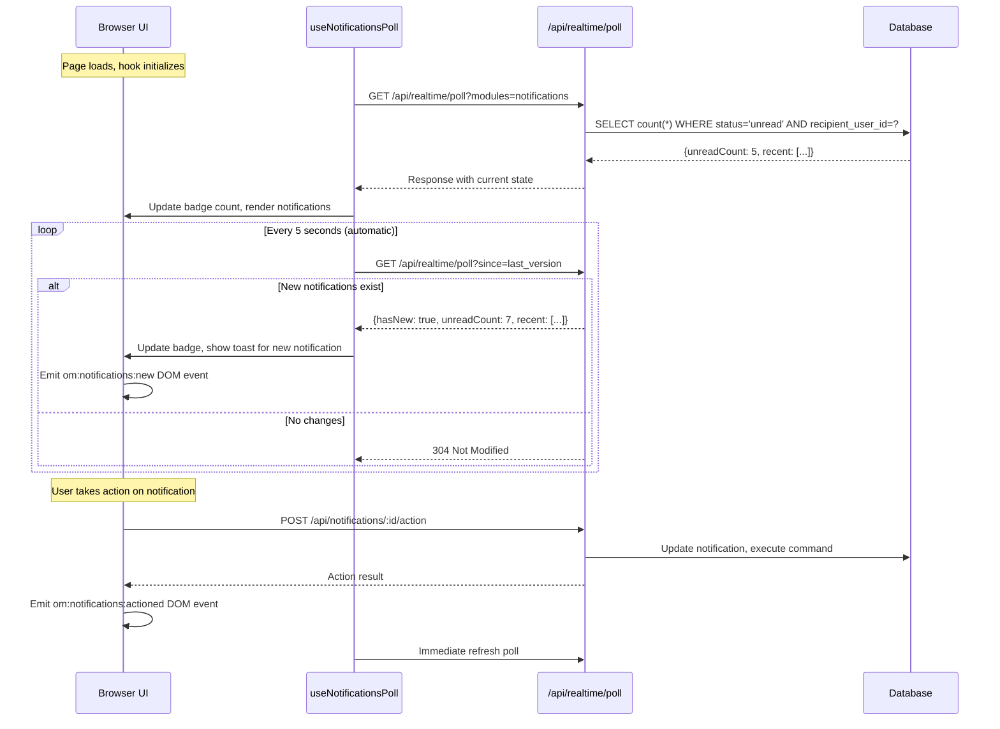

# Notifications Module Specification

## Overview

The Notifications module provides actionable in-app notifications with **i18n-first design**, module-extensible types, and command bus integration. Users receive real-time notifications about events requiring their attention (e.g., approval requests, system alerts) and can take actions directly from the notification panel.

**Package Location:** `packages/core/src/modules/notifications/`

## ⭐ i18n-First Design Philosophy

**CRITICAL**: This module follows an **i18n-first approach**. All notifications MUST use i18n keys (`titleKey`, `bodyKey`) with optional variable interpolation, rather than hardcoded text. This ensures notifications are properly translated for all users.

### Key Principles

1. **Define notification types in `notifications.ts`** with i18n keys (`titleKey`, `bodyKey`)
2. **Use `buildNotificationFromType()` helper** to create properly i18n'd notifications
3. **Store i18n keys in database** - translation happens at display time
4. **Provide template variables** for dynamic content interpolation (`titleVariables`, `bodyVariables`)

### Quick Example

```typescript
// ❌ WRONG: Hardcoded text
await notificationService.create({
  recipientUserId: user.id,
  type: 'order.shipped',
  title: 'Your order has been shipped',  // ❌ Hardcoded English text
  body: `Order #${orderNumber} is on its way`,
  //... rest
}, ctx)

// ✅ CORRECT: i18n-first with keys
import { getNotificationType } from '@/.mercato/generated/notifications.generated'
import { buildNotificationFromType } from '@open-mercato/core/modules/notifications/lib/notificationBuilder'

const typeDef = getNotificationType('order.shipped')!
const notification = buildNotificationFromType(typeDef, {
  recipientUserId: user.id,
  titleVariables: { orderNumber: order.number },
  bodyVariables: { trackingUrl: order.trackingUrl },
  sourceEntityId: order.id,
})
await notificationService.create(notification, ctx)
```

### Complete Workflow Example

**Step 1: Define notification types with i18n keys**

```typescript
// packages/core/src/modules/sales/notifications.ts
import type { NotificationTypeDefinition } from '@open-mercato/shared/modules/notifications/types'

export const notificationTypes: NotificationTypeDefinition[] = [
  {
    type: 'sales.order.shipped',
    module: 'sales',
    titleKey: 'sales.notifications.order.shipped.title',
    bodyKey: 'sales.notifications.order.shipped.body',
    icon: 'truck',
    severity: 'info',
    actions: [
      {
        id: 'track',
        labelKey: 'sales.actions.trackShipment',
        variant: 'default',
        icon: 'map-pin',
        href: '/backend/sales/tracking/{trackingNumber}',  // {variable} for interpolation
      },
    ],
    linkHref: '/backend/sales/orders/{orderId}',
    expiresAfterHours: 168,  // 7 days
  },
]

export default notificationTypes
```

**Step 2: Add i18n translations**

```json
// packages/core/src/modules/sales/i18n/en.json
{
  "sales.notifications.order.shipped.title": "Order #{orderNumber} shipped",
  "sales.notifications.order.shipped.body": "Your order has been shipped and is on its way. Track it at {trackingUrl}",
  "sales.actions.trackShipment": "Track Shipment"
}
```

**Step 3: Create notification using the helper**

```typescript
// packages/core/src/modules/sales/subscribers/order-shipped.ts
import { getNotificationType } from '@/.mercato/generated/notifications.generated'
import { buildNotificationFromType } from '@open-mercato/core/modules/notifications/lib/notificationBuilder'

export const metadata = {
  event: 'sales.order.shipped',
  id: 'sales:order-shipped-notification',
}

export default async function handle(payload: {
  orderId: string
  orderNumber: string
  customerId: string
  trackingNumber: string
  trackingUrl: string
  tenantId: string
  organizationId?: string
}, ctx: { resolve: <T>(name: string) => T }) {
  const notificationService = ctx.resolve<NotificationService>('notificationService')

  // Get the type definition
  const typeDef = getNotificationType('sales.order.shipped')
  if (!typeDef) return

  // Build notification with variables
  const input = buildNotificationFromType(typeDef, {
    recipientUserId: payload.customerId,
    titleVariables: { orderNumber: payload.orderNumber },
    bodyVariables: { trackingUrl: payload.trackingUrl },
    sourceEntityType: 'sales_order',
    sourceEntityId: payload.orderId,
    linkHref: `/backend/sales/orders/${payload.orderId}`,
  })

  // Create the notification
  await notificationService.create(input, {
    tenantId: payload.tenantId,
    organizationId: payload.organizationId,
  })
}
```

**Step 4: Translation at display time** (automatic)

The frontend components automatically resolve i18n keys when displaying:
- `titleKey` + `titleVariables` → translated title
- `bodyKey` + `bodyVariables` → translated body
- Action `labelKey` → translated action label

---

## Use Cases

| ID | Actor | Use Case | Description | Priority |
|----|-------|----------|-------------|----------|
| N1 | System | Create notification | System creates notification when user action is needed (e.g., leave request pending approval) | High |
| N2 | User | See unread count | User sees badge with unread notification count in header | High |
| N3 | User | Open notification panel | User clicks bell icon to open right-side notification panel | High |
| N4 | User | Read notification | User views notification details, marking it as read | High |
| N5 | User | Execute action | User clicks action button (e.g., Approve/Reject) directly from notification | High |
| N6 | User | Dismiss notification | User dismisses notification without taking action | Medium |
| N7 | User | Mark all read | User marks all notifications as read at once | Medium |
| N8 | Module | Register type | Module registers notification type with custom renderer | High |
| N9 | Module | Register actions | Module provides action handlers for notification type | High |
| N10 | System | Expire notification | System auto-dismisses notifications past expiry date | Low |
| N11 | User | Filter notifications | User filters by type, status, or date | Medium |
| N12 | System | Batch notify | System sends same notification to multiple recipients | Medium |
| N13 | User | Navigate to source | User clicks notification to navigate to related entity | High |
| N14 | System | Trigger from event | System creates notification in response to domain event | High |

---

## Real-Time Updates (Polling)

### How Users Receive Notifications Automatically

Users do **not** need to take any action to receive new notifications. The system uses automatic polling:



### Polling Configuration

```typescript
// Default polling behavior - no user interaction required
const NOTIFICATION_POLL_INTERVAL = 5000 // 5 seconds
const NOTIFICATION_POLL_ENABLED = true  // Always enabled when component mounted

// The polling starts automatically when NotificationBell mounts
// User sees updates without any interaction
```

---

## Database Schema

### Entity: `Notification`

**Table:** `notifications`

```typescript
// packages/core/src/modules/notifications/data/entities.ts
import { Entity, PrimaryKey, Property, Index, OptionalProps } from '@mikro-orm/core'

export type NotificationStatus = 'unread' | 'read' | 'actioned' | 'dismissed'
export type NotificationSeverity = 'info' | 'warning' | 'success' | 'error'

@Entity({ tableName: 'notifications' })
@Index({ name: 'notifications_recipient_status_idx', properties: ['recipientUserId', 'status', 'createdAt'] })
@Index({ name: 'notifications_source_idx', properties: ['sourceEntityType', 'sourceEntityId'] })
@Index({ name: 'notifications_tenant_idx', properties: ['tenantId', 'organizationId'] })
@Index({ name: 'notifications_expires_idx', properties: ['expiresAt'] })
export class Notification {
  [OptionalProps]?: 'status' | 'severity' | 'createdAt'

  @PrimaryKey({ type: 'uuid', defaultRaw: 'gen_random_uuid()' })
  id!: string

  // Recipient
  @Property({ name: 'recipient_user_id', type: 'uuid' })
  recipientUserId!: string

  // Notification type (module-defined, e.g., 'staff.leave_request.pending')
  @Property({ name: 'type', type: 'text' })
  type!: string

  // Content
  @Property({ name: 'title', type: 'text' })
  title!: string

  @Property({ name: 'body', type: 'text', nullable: true })
  body?: string | null

  @Property({ name: 'icon', type: 'text', nullable: true })
  icon?: string | null // Lucide icon name, e.g., 'calendar-clock'

  @Property({ name: 'severity', type: 'text' })
  severity: NotificationSeverity = 'info'

  // Status
  @Property({ name: 'status', type: 'text' })
  status: NotificationStatus = 'unread'

  // Action configuration (stored as JSONB)
  @Property({ name: 'action_data', type: 'json', nullable: true })
  actionData?: NotificationActionData | null

  // Result of executed action
  @Property({ name: 'action_result', type: 'json', nullable: true })
  actionResult?: Record<string, unknown> | null

  // Which action was taken
  @Property({ name: 'action_taken', type: 'text', nullable: true })
  actionTaken?: string | null

  // Source entity reference (for navigation and context)
  @Property({ name: 'source_module', type: 'text', nullable: true })
  sourceModule?: string | null // e.g., 'staff'

  @Property({ name: 'source_entity_type', type: 'text', nullable: true })
  sourceEntityType?: string | null // e.g., 'leave_request'

  @Property({ name: 'source_entity_id', type: 'uuid', nullable: true })
  sourceEntityId?: string | null

  // Optional link to navigate to
  @Property({ name: 'link_href', type: 'text', nullable: true })
  linkHref?: string | null

  // Grouping key for collapsing similar notifications
  @Property({ name: 'group_key', type: 'text', nullable: true })
  groupKey?: string | null

  // Timestamps
  @Property({ name: 'created_at', type: Date, onCreate: () => new Date() })
  createdAt: Date = new Date()

  @Property({ name: 'read_at', type: Date, nullable: true })
  readAt?: Date | null

  @Property({ name: 'actioned_at', type: Date, nullable: true })
  actionedAt?: Date | null

  @Property({ name: 'dismissed_at', type: Date, nullable: true })
  dismissedAt?: Date | null

  @Property({ name: 'expires_at', type: Date, nullable: true })
  expiresAt?: Date | null

  // Multi-tenant scoping
  @Property({ name: 'tenant_id', type: 'uuid' })
  tenantId!: string

  @Property({ name: 'organization_id', type: 'uuid', nullable: true })
  organizationId?: string | null
}

// Action configuration type
export type NotificationAction = {
  id: string                    // Unique action ID, e.g., 'approve'
  label: string                 // Display label
  labelKey?: string             // i18n key for label
  variant?: 'default' | 'secondary' | 'destructive' | 'outline' | 'ghost'
  icon?: string                 // Optional icon
  commandId?: string            // Command to execute, e.g., 'staff.leave_requests.accept'
  href?: string                 // Link to navigate (supports {sourceEntityId} interpolation)
  confirmRequired?: boolean     // Show confirmation dialog
  confirmMessage?: string       // Confirmation message
}

export type NotificationActionData = {
  actions: NotificationAction[]
  primaryActionId?: string      // Which action is primary (highlighted)
}
```

### SQL Migration

```sql
-- packages/core/src/modules/notifications/migrations/Migration_CreateNotifications.ts
CREATE TABLE notifications (
  id UUID PRIMARY KEY DEFAULT gen_random_uuid(),
  
  -- Recipient
  recipient_user_id UUID NOT NULL,
  
  -- Type and content
  type TEXT NOT NULL,
  title TEXT NOT NULL,
  body TEXT,
  icon TEXT,
  severity TEXT NOT NULL DEFAULT 'info',
  
  -- Status
  status TEXT NOT NULL DEFAULT 'unread',
  
  -- Actions
  action_data JSONB,
  action_result JSONB,
  action_taken TEXT,
  
  -- Source entity
  source_module TEXT,
  source_entity_type TEXT,
  source_entity_id UUID,
  link_href TEXT,
  
  -- Grouping
  group_key TEXT,
  
  -- Timestamps
  created_at TIMESTAMPTZ NOT NULL DEFAULT now(),
  read_at TIMESTAMPTZ,
  actioned_at TIMESTAMPTZ,
  dismissed_at TIMESTAMPTZ,
  expires_at TIMESTAMPTZ,
  
  -- Multi-tenant
  tenant_id UUID NOT NULL,
  organization_id UUID
);

-- Indexes for efficient queries
CREATE INDEX notifications_recipient_status_idx 
  ON notifications(recipient_user_id, status, created_at DESC);
CREATE INDEX notifications_source_idx 
  ON notifications(source_entity_type, source_entity_id) 
  WHERE source_entity_id IS NOT NULL;
CREATE INDEX notifications_tenant_idx 
  ON notifications(tenant_id, organization_id);
CREATE INDEX notifications_expires_idx 
  ON notifications(expires_at) 
  WHERE expires_at IS NOT NULL AND status NOT IN ('actioned', 'dismissed');
CREATE INDEX notifications_group_idx 
  ON notifications(group_key, recipient_user_id) 
  WHERE group_key IS NOT NULL;
```

---

## Validators (Zod Schemas)

```typescript
// packages/core/src/modules/notifications/data/validators.ts
import { z } from 'zod'

export const notificationStatusSchema = z.enum(['unread', 'read', 'actioned', 'dismissed'])
export const notificationSeveritySchema = z.enum(['info', 'warning', 'success', 'error'])

export const notificationActionSchema = z.object({
  id: z.string().min(1),
  label: z.string().min(1),
  labelKey: z.string().optional(),
  variant: z.enum(['default', 'secondary', 'destructive', 'outline', 'ghost']).optional(),
  icon: z.string().optional(),
  commandId: z.string().optional(),
  href: z.string().optional(),
  confirmRequired: z.boolean().optional(),
  confirmMessage: z.string().optional(),
})

export const createNotificationSchema = z.object({
  recipientUserId: z.string().uuid(),
  type: z.string().min(1).max(100),
  title: z.string().min(1).max(500),
  body: z.string().max(2000).optional(),
  icon: z.string().max(100).optional(),
  severity: notificationSeveritySchema.optional().default('info'),
  actions: z.array(notificationActionSchema).optional(),
  primaryActionId: z.string().optional(),
  sourceModule: z.string().optional(),
  sourceEntityType: z.string().optional(),
  sourceEntityId: z.string().uuid().optional(),
  linkHref: z.string().optional(),
  groupKey: z.string().optional(),
  expiresAt: z.string().datetime().optional(),
})

export const createBatchNotificationSchema = z.object({
  recipientUserIds: z.array(z.string().uuid()).min(1).max(1000),
  type: z.string().min(1).max(100),
  title: z.string().min(1).max(500),
  body: z.string().max(2000).optional(),
  icon: z.string().max(100).optional(),
  severity: notificationSeveritySchema.optional().default('info'),
  actions: z.array(notificationActionSchema).optional(),
  primaryActionId: z.string().optional(),
  sourceModule: z.string().optional(),
  sourceEntityType: z.string().optional(),
  sourceEntityId: z.string().uuid().optional(),
  linkHref: z.string().optional(),
  groupKey: z.string().optional(),
  expiresAt: z.string().datetime().optional(),
})

export const createRoleNotificationSchema = z.object({
  roleId: z.string().uuid(),
  type: z.string().min(1).max(100),
  title: z.string().min(1).max(500),
  body: z.string().max(2000).optional(),
  icon: z.string().max(100).optional(),
  severity: notificationSeveritySchema.optional().default('info'),
  actions: z.array(notificationActionSchema).optional(),
  primaryActionId: z.string().optional(),
  sourceModule: z.string().optional(),
  sourceEntityType: z.string().optional(),
  sourceEntityId: z.string().uuid().optional(),
  linkHref: z.string().optional(),
  groupKey: z.string().optional(),
  expiresAt: z.string().datetime().optional(),
})

export const createFeatureNotificationSchema = z.object({
  requiredFeature: z.string().min(1).max(100),
  type: z.string().min(1).max(100),
  title: z.string().min(1).max(500),
  body: z.string().max(2000).optional(),
  icon: z.string().max(100).optional(),
  severity: notificationSeveritySchema.optional().default('info'),
  actions: z.array(notificationActionSchema).optional(),
  primaryActionId: z.string().optional(),
  sourceModule: z.string().optional(),
  sourceEntityType: z.string().optional(),
  sourceEntityId: z.string().uuid().optional(),
  linkHref: z.string().optional(),
  groupKey: z.string().optional(),
  expiresAt: z.string().datetime().optional(),
})

export const listNotificationsSchema = z.object({
  status: z.union([notificationStatusSchema, z.array(notificationStatusSchema)]).optional(),
  type: z.string().optional(),
  severity: notificationSeveritySchema.optional(),
  sourceEntityType: z.string().optional(),
  sourceEntityId: z.string().uuid().optional(),
  since: z.string().datetime().optional(),
  page: z.coerce.number().int().min(1).optional().default(1),
  pageSize: z.coerce.number().int().min(1).max(100).optional().default(20),
})

export const executeActionSchema = z.object({
  actionId: z.string().min(1),
  payload: z.record(z.unknown()).optional(), // Additional data for the action
})

export type CreateNotificationInput = z.infer<typeof createNotificationSchema>
export type CreateBatchNotificationInput = z.infer<typeof createBatchNotificationSchema>
export type CreateRoleNotificationInput = z.infer<typeof createRoleNotificationSchema>
export type CreateFeatureNotificationInput = z.infer<typeof createFeatureNotificationSchema>
export type ListNotificationsInput = z.infer<typeof listNotificationsSchema>
export type ExecuteActionInput = z.infer<typeof executeActionSchema>
```

---

## Notification Types Registry

Modules define their notification types in a `notifications.ts` file. The generator discovers these and creates a registry.

### Type Definition Pattern

```typescript
// packages/shared/src/modules/notifications/types.ts
import type { ComponentType } from 'react'

export type NotificationTypeAction = {
  id: string
  labelKey: string
  variant?: 'default' | 'secondary' | 'destructive' | 'outline' | 'ghost'
  icon?: string
  commandId?: string
  href?: string // Supports {sourceEntityId}, {tenantId}, {organizationId} interpolation
  confirmRequired?: boolean
  confirmMessageKey?: string
}

export type NotificationTypeDefinition = {
  type: string                          // e.g., 'staff.leave_request.pending'
  module: string                        // e.g., 'staff'
  titleKey: string                      // i18n key for title template
  bodyKey?: string                      // i18n key for body template
  icon: string                          // Lucide icon name
  severity: 'info' | 'warning' | 'success' | 'error'
  actions: NotificationTypeAction[]
  primaryActionId?: string
  linkHref?: string                     // Default link for this type
  Renderer?: ComponentType<NotificationRendererProps>  // Custom renderer
  expiresAfterHours?: number            // Auto-expire after N hours
}

export type NotificationRendererProps = {
  notification: {
    id: string
    type: string
    title: string
    body?: string | null
    icon?: string | null
    severity: string
    status: string
    sourceModule?: string | null
    sourceEntityType?: string | null
    sourceEntityId?: string | null
    createdAt: string
  }
  onAction: (actionId: string) => Promise<void>
  onDismiss: () => Promise<void>
  actions: NotificationTypeAction[]
}
```

### Module Example: Staff Leave Requests

```typescript
// packages/core/src/modules/staff/notifications.ts
import type { NotificationTypeDefinition } from '@open-mercato/shared/modules/notifications/types'

export const notificationTypes: NotificationTypeDefinition[] = [
  {
    type: 'staff.leave_request.pending',
    module: 'staff',
    titleKey: 'staff.notifications.leaveRequest.pending.title',
    bodyKey: 'staff.notifications.leaveRequest.pending.body',
    icon: 'calendar-clock',
    severity: 'info',
    actions: [
      {
        id: 'approve',
        labelKey: 'staff.actions.approve',
        variant: 'default',
        commandId: 'staff.leave_requests.accept',
        icon: 'check',
      },
      {
        id: 'reject',
        labelKey: 'staff.actions.reject',
        variant: 'destructive',
        commandId: 'staff.leave_requests.reject',
        confirmRequired: true,
        confirmMessageKey: 'staff.confirmations.rejectLeaveRequest',
        icon: 'x',
      },
      {
        id: 'view',
        labelKey: 'common.view',
        variant: 'outline',
        href: '/backend/staff/leave-requests/{sourceEntityId}',
        icon: 'external-link',
      },
    ],
    primaryActionId: 'approve',
    linkHref: '/backend/staff/leave-requests/{sourceEntityId}',
    expiresAfterHours: 168, // 7 days
  },
  {
    type: 'staff.leave_request.approved',
    module: 'staff',
    titleKey: 'staff.notifications.leaveRequest.approved.title',
    bodyKey: 'staff.notifications.leaveRequest.approved.body',
    icon: 'calendar-check',
    severity: 'success',
    actions: [
      {
        id: 'view',
        labelKey: 'common.view',
        variant: 'outline',
        href: '/backend/staff/leave-requests/{sourceEntityId}',
      },
    ],
    linkHref: '/backend/staff/leave-requests/{sourceEntityId}',
  },
  {
    type: 'staff.leave_request.rejected',
    module: 'staff',
    titleKey: 'staff.notifications.leaveRequest.rejected.title',
    bodyKey: 'staff.notifications.leaveRequest.rejected.body',
    icon: 'calendar-x',
    severity: 'warning',
    actions: [
      {
        id: 'view',
        labelKey: 'common.view',
        variant: 'outline',
        href: '/backend/staff/leave-requests/{sourceEntityId}',
      },
    ],
    linkHref: '/backend/staff/leave-requests/{sourceEntityId}',
  },
]

export default notificationTypes
```

### Generated Registry

```typescript
// apps/mercato/.mercato/generated/notifications.generated.ts
// Auto-generated by module generator

import type { NotificationTypeDefinition } from '@open-mercato/shared/modules/notifications/types'

const notificationTypes: NotificationTypeDefinition[] = [
  // Imported from staff module
  ...require('@open-mercato/core/modules/staff/notifications').notificationTypes,
  // Imported from workflows module
  ...require('@open-mercato/core/modules/workflows/notifications').notificationTypes,
  // ... other modules
]

export function getNotificationTypes(): NotificationTypeDefinition[] {
  return notificationTypes
}

export function getNotificationType(type: string): NotificationTypeDefinition | undefined {
  return notificationTypes.find(t => t.type === type)
}
```

---

## Service Layer

```typescript
// packages/core/src/modules/notifications/lib/notificationService.ts
import type { EntityManager } from '@mikro-orm/core'
import type { EventBus } from '@open-mercato/events'
import type { CommandBus } from '@open-mercato/shared/lib/commands/command-bus'
import { Notification } from '../data/entities'
import type { CreateNotificationInput, CreateBatchNotificationInput, ExecuteActionInput } from '../data/validators'

export interface NotificationServiceContext {
  tenantId: string
  organizationId?: string | null
  userId?: string | null
}

export interface NotificationService {
  /**
   * Create a single notification
   */
  create(input: CreateNotificationInput, ctx: NotificationServiceContext): Promise<Notification>

  /**
   * Create notifications for multiple recipients
   */
  createBatch(input: CreateBatchNotificationInput, ctx: NotificationServiceContext): Promise<Notification[]>

  /**
   * Create notifications for all users within a role
   */
  createForRole(input: CreateRoleNotificationInput, ctx: NotificationServiceContext): Promise<Notification[]>

  /**
   * Create notifications for all users with a specific feature/permission
   */
  createForFeature(input: CreateFeatureNotificationInput, ctx: NotificationServiceContext): Promise<Notification[]>

  /**
   * Mark notification as read
   */
  markAsRead(notificationId: string, ctx: NotificationServiceContext): Promise<Notification>

  /**
   * Mark all notifications as read for current user
   */
  markAllAsRead(ctx: NotificationServiceContext): Promise<number>

  /**
   * Dismiss notification
   */
  dismiss(notificationId: string, ctx: NotificationServiceContext): Promise<Notification>

  /**
   * Execute notification action
   */
  executeAction(
    notificationId: string,
    input: ExecuteActionInput,
    ctx: NotificationServiceContext
  ): Promise<{ notification: Notification; result: unknown }>

  /**
   * Get unread count for current user
   */
  getUnreadCount(ctx: NotificationServiceContext): Promise<number>

  /**
   * Get notifications for polling (recent + counts)
   */
  getPollData(ctx: NotificationServiceContext, since?: string): Promise<NotificationPollData>

  /**
   * Clean up expired notifications
   */
  cleanupExpired(): Promise<number>

  /**
   * Delete notifications related to an entity (when entity is deleted)
   */
  deleteBySource(
    sourceEntityType: string,
    sourceEntityId: string,
    ctx: NotificationServiceContext
  ): Promise<number>
}

export type NotificationPollData = {
  unreadCount: number
  recent: NotificationDto[]
  hasNew: boolean
  lastId?: string
}

export type NotificationDto = {
  id: string
  type: string
  title: string
  body?: string | null
  icon?: string | null
  severity: string
  status: string
  actions: Array<{
    id: string
    label: string
    variant?: string
    icon?: string
  }>
  primaryActionId?: string
  sourceModule?: string | null
  sourceEntityType?: string | null
  sourceEntityId?: string | null
  linkHref?: string | null
  createdAt: string
  readAt?: string | null
}
```

---

## API Endpoints

### Route: `/api/notifications`

```typescript
// packages/core/src/modules/notifications/api/route.ts
import { makeCrudRoute } from '@open-mercato/shared/lib/crud/factory'
import { Notification } from '../data/entities'
import { listNotificationsSchema, createNotificationSchema } from '../data/validators'

export const { GET, POST } = makeCrudRoute({
  metadata: {
    GET: { requireAuth: true },
    POST: { requireAuth: true, requireFeatures: ['notifications.create'] },
  },
  orm: {
    entity: Notification,
    idField: 'id',
    orgField: 'organizationId',
    tenantField: 'tenantId',
  },
  resource: 'notifications',
  list: {
    schema: listNotificationsSchema,
    entityId: 'notifications:notification',
    fields: ['id', 'type', 'title', 'body', 'icon', 'severity', 'status', 'actionData', 'sourceModule', 'sourceEntityType', 'sourceEntityId', 'linkHref', 'createdAt', 'readAt'],
    defaultSort: [{ field: 'createdAt', order: 'desc' }],
    buildFilters: (input, ctx) => {
      const filters: Record<string, unknown> = {
        recipientUserId: ctx.auth?.sub, // Only own notifications
      }
      if (input.status) {
        filters.status = Array.isArray(input.status) ? { $in: input.status } : input.status
      }
      if (input.type) {
        filters.type = input.type
      }
      if (input.severity) {
        filters.severity = input.severity
      }
      if (input.sourceEntityType) {
        filters.sourceEntityType = input.sourceEntityType
      }
      if (input.sourceEntityId) {
        filters.sourceEntityId = input.sourceEntityId
      }
      if (input.since) {
        filters.createdAt = { $gt: new Date(input.since) }
      }
      return filters
    },
    transformItem: (item) => ({
      ...item,
      actions: item.actionData?.actions ?? [],
      primaryActionId: item.actionData?.primaryActionId,
    }),
  },
  create: {
    schema: createNotificationSchema,
    mapToEntity: (input, ctx) => ({
      recipientUserId: input.recipientUserId,
      type: input.type,
      title: input.title,
      body: input.body,
      icon: input.icon,
      severity: input.severity,
      actionData: input.actions ? {
        actions: input.actions,
        primaryActionId: input.primaryActionId,
      } : null,
      sourceModule: input.sourceModule,
      sourceEntityType: input.sourceEntityType,
      sourceEntityId: input.sourceEntityId,
      linkHref: input.linkHref,
      groupKey: input.groupKey,
      expiresAt: input.expiresAt ? new Date(input.expiresAt) : null,
    }),
  },
})
```

### Route: `/api/notifications/unread-count`

```typescript
// packages/core/src/modules/notifications/api/unread-count/route.ts
import { resolveRequestContext } from '@open-mercato/shared/lib/api/context'
import type { EntityManager } from '@mikro-orm/core'
import { Notification } from '../../data/entities'

export async function GET(req: Request) {
  const { ctx } = await resolveRequestContext(req)
  const em = ctx.container.resolve('em') as EntityManager

  const count = await em.count(Notification, {
    recipientUserId: ctx.auth?.sub,
    tenantId: ctx.auth?.tenantId,
    status: 'unread',
  })

  return Response.json({ unreadCount: count })
}

export const openApi = {
  GET: {
    summary: 'Get unread notification count',
    tags: ['Notifications'],
    responses: {
      200: { description: 'Unread count' },
    },
  },
}
```

### Route: `/api/notifications/[id]/read`

```typescript
// packages/core/src/modules/notifications/api/[id]/read/route.ts
import { resolveRequestContext } from '@open-mercato/shared/lib/api/context'
import type { EntityManager } from '@mikro-orm/core'
import { Notification } from '../../../data/entities'

export async function PUT(req: Request, { params }: { params: { id: string } }) {
  const { ctx } = await resolveRequestContext(req)
  const em = ctx.container.resolve('em') as EntityManager

  const notification = await em.findOneOrFail(Notification, {
    id: params.id,
    recipientUserId: ctx.auth?.sub,
    tenantId: ctx.auth?.tenantId,
  })

  if (notification.status === 'unread') {
    notification.status = 'read'
    notification.readAt = new Date()
    await em.flush()
  }

  return Response.json({ ok: true })
}

export const openApi = {
  PUT: {
    summary: 'Mark notification as read',
    tags: ['Notifications'],
    responses: {
      200: { description: 'Notification marked as read' },
    },
  },
}
```

### Route: `/api/notifications/[id]/action`

```typescript
// packages/core/src/modules/notifications/api/[id]/action/route.ts
import { resolveRequestContext } from '@open-mercato/shared/lib/api/context'
import type { EntityManager } from '@mikro-orm/core'
import type { CommandBus } from '@open-mercato/shared/lib/commands/command-bus'
import { Notification } from '../../../data/entities'
import { executeActionSchema } from '../../../data/validators'
import { getNotificationType } from '../../lib/registry'

export async function POST(req: Request, { params }: { params: { id: string } }) {
  const { ctx } = await resolveRequestContext(req)
  const em = ctx.container.resolve('em') as EntityManager
  const commandBus = ctx.container.resolve('commandBus') as CommandBus

  const body = await req.json().catch(() => ({}))
  const input = executeActionSchema.parse(body)

  const notification = await em.findOneOrFail(Notification, {
    id: params.id,
    recipientUserId: ctx.auth?.sub,
    tenantId: ctx.auth?.tenantId,
  })

  // Find the action in notification's action data
  const actionData = notification.actionData
  const action = actionData?.actions?.find(a => a.id === input.actionId)
  
  if (!action) {
    return Response.json({ error: 'Action not found' }, { status: 400 })
  }

  let result: unknown = null

  // Execute command if specified
  if (action.commandId) {
    const commandInput = {
      id: notification.sourceEntityId,
      ...input.payload,
    }

    const commandResult = await commandBus.execute(action.commandId, {
      input: commandInput,
      ctx,
      metadata: {
        tenantId: ctx.auth?.tenantId ?? null,
        organizationId: ctx.selectedOrganizationId ?? null,
        resourceKind: 'notifications',
      },
    })

    result = commandResult.result
  }

  // Update notification status
  notification.status = 'actioned'
  notification.actionedAt = new Date()
  notification.actionTaken = input.actionId
  notification.actionResult = result as Record<string, unknown>
  
  if (!notification.readAt) {
    notification.readAt = new Date()
  }

  await em.flush()

  // Emit event
  const eventBus = ctx.container.resolve('eventBus') as any
  await eventBus.emit('notifications.actioned', {
    notificationId: notification.id,
    actionId: input.actionId,
    userId: ctx.auth?.sub,
    tenantId: ctx.auth?.tenantId,
  })

  return Response.json({
    ok: true,
    result,
    href: action.href?.replace('{sourceEntityId}', notification.sourceEntityId ?? ''),
  })
}

export const openApi = {
  POST: {
    summary: 'Execute notification action',
    tags: ['Notifications'],
    responses: {
      200: { description: 'Action executed successfully' },
      400: { description: 'Action not found' },
    },
  },
}
```

### Route: `/api/notifications/mark-all-read`

```typescript
// packages/core/src/modules/notifications/api/mark-all-read/route.ts
import { resolveRequestContext } from '@open-mercato/shared/lib/api/context'
import type { EntityManager } from '@mikro-orm/core'
import { Notification } from '../../data/entities'

export async function PUT(req: Request) {
  const { ctx } = await resolveRequestContext(req)
  const em = ctx.container.resolve('em') as EntityManager
  const knex = em.getKnex()

  const result = await knex('notifications')
    .where({
      recipient_user_id: ctx.auth?.sub,
      tenant_id: ctx.auth?.tenantId,
      status: 'unread',
    })
    .update({
      status: 'read',
      read_at: knex.fn.now(),
    })

  return Response.json({ ok: true, count: result })
}

export const openApi = {
  PUT: {
    summary: 'Mark all notifications as read',
    tags: ['Notifications'],
    responses: {
      200: { description: 'All notifications marked as read' },
    },
  },
}
```

---

## Events

```typescript
// packages/core/src/modules/notifications/lib/events.ts
export const NOTIFICATION_EVENTS = {
  CREATED: 'notifications.created',
  READ: 'notifications.read',
  ACTIONED: 'notifications.actioned',
  DISMISSED: 'notifications.dismissed',
  EXPIRED: 'notifications.expired',
} as const

export type NotificationCreatedPayload = {
  notificationId: string
  recipientUserId: string
  type: string
  title: string
  tenantId: string
  organizationId?: string | null
}

export type NotificationActionedPayload = {
  notificationId: string
  actionId: string
  userId: string
  tenantId: string
}
```

---

## DOM Events (Frontend)

```typescript
// packages/shared/src/lib/frontend/notificationEvents.ts
export const NOTIFICATION_DOM_EVENTS = {
  NEW: 'om:notifications:new',
  ACTIONED: 'om:notifications:actioned',
  COUNT_CHANGED: 'om:notifications:count-changed',
} as const

export type NotificationNewDetail = {
  id: string
  type: string
  title: string
  severity: string
}

export function emitNotificationNew(detail: NotificationNewDetail): void {
  if (typeof window === 'undefined' || typeof CustomEvent === 'undefined') return
  window.dispatchEvent(new CustomEvent(NOTIFICATION_DOM_EVENTS.NEW, { detail }))
}

export function emitNotificationActioned(notificationId: string): void {
  if (typeof window === 'undefined' || typeof CustomEvent === 'undefined') return
  window.dispatchEvent(new CustomEvent(NOTIFICATION_DOM_EVENTS.ACTIONED, { detail: { notificationId } }))
}

export function emitNotificationCountChanged(count: number): void {
  if (typeof window === 'undefined' || typeof CustomEvent === 'undefined') return
  window.dispatchEvent(new CustomEvent(NOTIFICATION_DOM_EVENTS.COUNT_CHANGED, { detail: { count } }))
}

export function subscribeNotificationNew(handler: (detail: NotificationNewDetail) => void): () => void {
  if (typeof window === 'undefined') return () => {}
  const listener = (e: Event) => handler((e as CustomEvent<NotificationNewDetail>).detail)
  window.addEventListener(NOTIFICATION_DOM_EVENTS.NEW, listener)
  return () => window.removeEventListener(NOTIFICATION_DOM_EVENTS.NEW, listener)
}

export function subscribeNotificationCountChanged(handler: (count: number) => void): () => void {
  if (typeof window === 'undefined') return () => {}
  const listener = (e: Event) => handler((e as CustomEvent<{ count: number }>).detail.count)
  window.addEventListener(NOTIFICATION_DOM_EVENTS.COUNT_CHANGED, listener)
  return () => window.removeEventListener(NOTIFICATION_DOM_EVENTS.COUNT_CHANGED, listener)
}
```

---

## UI Components

### NotificationBell

```typescript
// packages/ui/src/backend/notifications/NotificationBell.tsx
"use client"
import * as React from 'react'
import { Bell } from 'lucide-react'
import { Button } from '../../primitives/button'
import { cn } from '../../lib/utils'
import { useNotificationsPoll } from './useNotificationsPoll'
import { NotificationPanel } from './NotificationPanel'

export type NotificationBellProps = {
  className?: string
}

export function NotificationBell({ className }: NotificationBellProps) {
  const [panelOpen, setPanelOpen] = React.useState(false)
  const { unreadCount, hasNew, notifications, refresh, markAsRead, executeAction, dismiss, markAllRead } = useNotificationsPoll()
  const prevCountRef = React.useRef(unreadCount)
  const [pulse, setPulse] = React.useState(false)
  
  // Pulse animation when new notification arrives
  React.useEffect(() => {
    if (hasNew && unreadCount > prevCountRef.current) {
      setPulse(true)
      const timer = setTimeout(() => setPulse(false), 1000)
      return () => clearTimeout(timer)
    }
    prevCountRef.current = unreadCount
  }, [unreadCount, hasNew])
  
  return (
    <>
      <Button
        variant="ghost"
        size="icon"
        className={cn('relative', className)}
        onClick={() => setPanelOpen(true)}
        aria-label={`Notifications${unreadCount > 0 ? ` (${unreadCount} unread)` : ''}`}
      >
        <Bell className={cn('h-5 w-5', pulse && 'animate-pulse')} />
        {unreadCount > 0 && (
          <span className="absolute -top-1 -right-1 flex h-5 w-5 items-center justify-center rounded-full bg-destructive text-[10px] font-medium text-destructive-foreground">
            {unreadCount > 99 ? '99+' : unreadCount}
          </span>
        )}
      </Button>
      
      <NotificationPanel
        open={panelOpen}
        onOpenChange={setPanelOpen}
        notifications={notifications}
        unreadCount={unreadCount}
        onRefresh={refresh}
        onMarkAsRead={markAsRead}
        onExecuteAction={executeAction}
        onDismiss={dismiss}
        onMarkAllRead={markAllRead}
      />
    </>
  )
}
```

### NotificationPanel

```typescript
// packages/ui/src/backend/notifications/NotificationPanel.tsx
"use client"
import * as React from 'react'
import { X, Check, CheckCheck, Bell, Filter } from 'lucide-react'
import { Button } from '../../primitives/button'
import { ScrollArea } from '../../primitives/scroll-area'
import { Tabs, TabsList, TabsTrigger, TabsContent } from '../../primitives/tabs'
import { useT } from '@open-mercato/shared/lib/i18n/context'
import { cn } from '../../lib/utils'
import { NotificationItem } from './NotificationItem'
import type { NotificationDto } from './types'

export type NotificationPanelProps = {
  open: boolean
  onOpenChange: (open: boolean) => void
  notifications: NotificationDto[]
  unreadCount: number
  onRefresh: () => void
  onMarkAsRead: (id: string) => Promise<void>
  onExecuteAction: (id: string, actionId: string) => Promise<{ href?: string }>
  onDismiss: (id: string) => Promise<void>
  onMarkAllRead: () => Promise<void>
}

export function NotificationPanel({
  open,
  onOpenChange,
  notifications,
  unreadCount,
  onRefresh,
  onMarkAsRead,
  onExecuteAction,
  onDismiss,
  onMarkAllRead,
}: NotificationPanelProps) {
  const t = useT()
  const [filter, setFilter] = React.useState<'all' | 'unread' | 'action'>('all')
  const [markingAllRead, setMarkingAllRead] = React.useState(false)
  
  const filteredNotifications = React.useMemo(() => {
    switch (filter) {
      case 'unread':
        return notifications.filter(n => n.status === 'unread')
      case 'action':
        return notifications.filter(n => n.actions && n.actions.length > 0 && n.status !== 'actioned')
      default:
        return notifications
    }
  }, [notifications, filter])
  
  const handleMarkAllRead = async () => {
    setMarkingAllRead(true)
    try {
      await onMarkAllRead()
    } finally {
      setMarkingAllRead(false)
    }
  }
  
  if (!open) return null
  
  return (
    <>
      {/* Backdrop */}
      <div
        className="fixed inset-0 z-40 bg-black/20"
        onClick={() => onOpenChange(false)}
      />
      
      {/* Panel */}
      <div className="fixed right-0 top-0 z-50 h-full w-full max-w-md border-l bg-background shadow-lg">
        <div className="flex h-full flex-col">
          {/* Header */}
          <div className="flex items-center justify-between border-b px-4 py-3">
            <div className="flex items-center gap-2">
              <Bell className="h-5 w-5" />
              <h2 className="font-semibold">{t('notifications.title')}</h2>
              {unreadCount > 0 && (
                <span className="rounded-full bg-destructive px-2 py-0.5 text-xs text-destructive-foreground">
                  {unreadCount}
                </span>
              )}
            </div>
            <div className="flex items-center gap-2">
              {unreadCount > 0 && (
                <Button
                  variant="ghost"
                  size="sm"
                  onClick={handleMarkAllRead}
                  disabled={markingAllRead}
                >
                  <CheckCheck className="mr-1 h-4 w-4" />
                  {t('notifications.markAllRead')}
                </Button>
              )}
              <Button
                variant="ghost"
                size="icon"
                onClick={() => onOpenChange(false)}
              >
                <X className="h-5 w-5" />
              </Button>
            </div>
          </div>
          
          {/* Filter tabs */}
          <Tabs value={filter} onValueChange={(v) => setFilter(v as typeof filter)} className="border-b">
            <TabsList className="w-full justify-start rounded-none border-0 bg-transparent px-4">
              <TabsTrigger value="all">{t('notifications.filters.all')}</TabsTrigger>
              <TabsTrigger value="unread">{t('notifications.filters.unread')}</TabsTrigger>
              <TabsTrigger value="action">{t('notifications.filters.actionRequired')}</TabsTrigger>
            </TabsList>
          </Tabs>
          
          {/* Notification list */}
          <ScrollArea className="flex-1">
            {filteredNotifications.length === 0 ? (
              <div className="flex flex-col items-center justify-center py-12 text-muted-foreground">
                <Bell className="mb-2 h-8 w-8 opacity-50" />
                <p>{t('notifications.empty')}</p>
              </div>
            ) : (
              <div className="divide-y">
                {filteredNotifications.map((notification) => (
                  <NotificationItem
                    key={notification.id}
                    notification={notification}
                    onMarkAsRead={() => onMarkAsRead(notification.id)}
                    onExecuteAction={(actionId) => onExecuteAction(notification.id, actionId)}
                    onDismiss={() => onDismiss(notification.id)}
                  />
                ))}
              </div>
            )}
          </ScrollArea>
        </div>
      </div>
    </>
  )
}
```

### NotificationItem

```typescript
// packages/ui/src/backend/notifications/NotificationItem.tsx
"use client"
import * as React from 'react'
import { useRouter } from 'next/navigation'
import { X, ExternalLink } from 'lucide-react'
import { Button } from '../../primitives/button'
import { DynamicIcon } from '../../primitives/dynamic-icon'
import { formatDistanceToNow } from 'date-fns'
import { useT } from '@open-mercato/shared/lib/i18n/context'
import { cn } from '../../lib/utils'
import type { NotificationDto } from './types'

export type NotificationItemProps = {
  notification: NotificationDto
  onMarkAsRead: () => Promise<void>
  onExecuteAction: (actionId: string) => Promise<{ href?: string }>
  onDismiss: () => Promise<void>
}

export function NotificationItem({
  notification,
  onMarkAsRead,
  onExecuteAction,
  onDismiss,
}: NotificationItemProps) {
  const t = useT()
  const router = useRouter()
  const [executing, setExecuting] = React.useState<string | null>(null)
  
  const isUnread = notification.status === 'unread'
  const hasActions = notification.actions && notification.actions.length > 0
  
  const handleClick = async () => {
    if (isUnread) {
      await onMarkAsRead()
    }
    if (notification.linkHref) {
      router.push(notification.linkHref)
    }
  }
  
  const handleAction = async (actionId: string, e: React.MouseEvent) => {
    e.stopPropagation()
    setExecuting(actionId)
    try {
      const result = await onExecuteAction(actionId)
      if (result.href) {
        router.push(result.href)
      }
    } finally {
      setExecuting(null)
    }
  }
  
  const severityColors = {
    info: 'text-blue-500',
    warning: 'text-amber-500',
    success: 'text-green-500',
    error: 'text-destructive',
  }
  
  return (
    <div
      className={cn(
        'relative px-4 py-3 hover:bg-muted/50 cursor-pointer transition-colors',
        isUnread && 'bg-muted/30'
      )}
      onClick={handleClick}
    >
      {/* Unread indicator */}
      {isUnread && (
        <div className="absolute left-1.5 top-1/2 -translate-y-1/2 h-2 w-2 rounded-full bg-primary" />
      )}
      
      <div className="flex gap-3">
        {/* Icon */}
        <div className={cn('flex-shrink-0 mt-0.5', severityColors[notification.severity as keyof typeof severityColors])}>
          <DynamicIcon name={notification.icon || 'bell'} className="h-5 w-5" />
        </div>
        
        {/* Content */}
        <div className="flex-1 min-w-0">
          <div className="flex items-start justify-between gap-2">
            <h4 className={cn('text-sm font-medium', isUnread && 'font-semibold')}>
              {notification.title}
            </h4>
            <span className="flex-shrink-0 text-xs text-muted-foreground">
              {formatDistanceToNow(new Date(notification.createdAt), { addSuffix: true })}
            </span>
          </div>
          
          {notification.body && (
            <p className="mt-1 text-sm text-muted-foreground line-clamp-2">
              {notification.body}
            </p>
          )}
          
          {/* Actions */}
          {hasActions && notification.status !== 'actioned' && (
            <div className="mt-2 flex flex-wrap gap-2">
              {notification.actions!.map((action) => (
                <Button
                  key={action.id}
                  variant={action.variant as any ?? 'outline'}
                  size="sm"
                  onClick={(e) => handleAction(action.id, e)}
                  disabled={executing !== null}
                >
                  {action.icon && <DynamicIcon name={action.icon} className="mr-1 h-3 w-3" />}
                  {action.label}
                  {executing === action.id && (
                    <span className="ml-1 animate-spin">⏳</span>
                  )}
                </Button>
              ))}
            </div>
          )}
          
          {notification.status === 'actioned' && notification.actionTaken && (
            <p className="mt-1 text-xs text-muted-foreground italic">
              {t('notifications.actionTaken', { action: notification.actionTaken })}
            </p>
          )}
        </div>
        
        {/* Dismiss button */}
        <Button
          variant="ghost"
          size="icon"
          className="flex-shrink-0 h-6 w-6 opacity-0 group-hover:opacity-100"
          onClick={(e) => {
            e.stopPropagation()
            onDismiss()
          }}
        >
          <X className="h-3 w-3" />
        </Button>
      </div>
    </div>
  )
}
```

### useNotificationsPoll Hook

```typescript
// packages/ui/src/backend/notifications/useNotificationsPoll.ts
"use client"
import * as React from 'react'
import { apiCall } from '../utils/apiCall'
import { 
  subscribeNotificationNew, 
  emitNotificationCountChanged 
} from '@open-mercato/shared/lib/frontend/notificationEvents'
import type { NotificationDto } from './types'

export type UseNotificationsPollResult = {
  notifications: NotificationDto[]
  unreadCount: number
  hasNew: boolean
  isLoading: boolean
  error: string | null
  refresh: () => void
  markAsRead: (id: string) => Promise<void>
  executeAction: (id: string, actionId: string) => Promise<{ href?: string }>
  dismiss: (id: string) => Promise<void>
  markAllRead: () => Promise<void>
}

const POLL_INTERVAL = 5000 // 5 seconds - automatic, no user action needed

export function useNotificationsPoll(): UseNotificationsPollResult {
  const [notifications, setNotifications] = React.useState<NotificationDto[]>([])
  const [unreadCount, setUnreadCount] = React.useState(0)
  const [hasNew, setHasNew] = React.useState(false)
  const [isLoading, setIsLoading] = React.useState(true)
  const [error, setError] = React.useState<string | null>(null)
  const lastIdRef = React.useRef<string | null>(null)
  
  const fetchNotifications = React.useCallback(async () => {
    try {
      const [notifResult, countResult] = await Promise.all([
        apiCall<{ items: NotificationDto[] }>('/api/notifications?pageSize=50'),
        apiCall<{ unreadCount: number }>('/api/notifications/unread-count'),
      ])
      
      if (notifResult.ok && notifResult.result) {
        const newNotifications = notifResult.result.items
        
        // Check if there are new notifications
        if (lastIdRef.current && newNotifications.length > 0) {
          const firstId = newNotifications[0].id
          if (firstId !== lastIdRef.current) {
            setHasNew(true)
            // Reset hasNew after a short delay
            setTimeout(() => setHasNew(false), 3000)
          }
        }
        
        if (newNotifications.length > 0) {
          lastIdRef.current = newNotifications[0].id
        }
        
        setNotifications(newNotifications)
      }
      
      if (countResult.ok && countResult.result) {
        const newCount = countResult.result.unreadCount
        if (newCount !== unreadCount) {
          setUnreadCount(newCount)
          emitNotificationCountChanged(newCount)
        }
      }
      
      setError(null)
    } catch (err) {
      setError(err instanceof Error ? err.message : 'Failed to fetch notifications')
    } finally {
      setIsLoading(false)
    }
  }, [unreadCount])
  
  const refresh = React.useCallback(() => {
    fetchNotifications()
  }, [fetchNotifications])
  
  // Initial fetch and automatic polling (no user interaction required)
  React.useEffect(() => {
    fetchNotifications()
    const interval = setInterval(fetchNotifications, POLL_INTERVAL)
    return () => clearInterval(interval)
  }, [fetchNotifications])
  
  // Subscribe to DOM events for instant updates
  React.useEffect(() => {
    const unsub = subscribeNotificationNew(() => refresh())
    return unsub
  }, [refresh])
  
  const markAsRead = React.useCallback(async (id: string) => {
    await apiCall(`/api/notifications/${id}/read`, { method: 'PUT' })
    setNotifications(prev => 
      prev.map(n => n.id === id ? { ...n, status: 'read', readAt: new Date().toISOString() } : n)
    )
    setUnreadCount(prev => Math.max(0, prev - 1))
  }, [])
  
  const executeAction = React.useCallback(async (id: string, actionId: string) => {
    const result = await apiCall<{ ok: boolean; href?: string }>(
      `/api/notifications/${id}/action`,
      { method: 'POST', body: JSON.stringify({ actionId }) }
    )
    
    if (result.ok) {
      setNotifications(prev =>
        prev.map(n => n.id === id ? { ...n, status: 'actioned', actionTaken: actionId } : n)
      )
      setUnreadCount(prev => Math.max(0, prev - 1))
    }
    
    return { href: result.result?.href }
  }, [])
  
  const dismiss = React.useCallback(async (id: string) => {
    await apiCall(`/api/notifications/${id}/dismiss`, { method: 'PUT' })
    setNotifications(prev => prev.filter(n => n.id !== id))
    // Decrement count if was unread
    const notification = notifications.find(n => n.id === id)
    if (notification?.status === 'unread') {
      setUnreadCount(prev => Math.max(0, prev - 1))
    }
  }, [notifications])
  
  const markAllRead = React.useCallback(async () => {
    await apiCall('/api/notifications/mark-all-read', { method: 'PUT' })
    setNotifications(prev => 
      prev.map(n => n.status === 'unread' ? { ...n, status: 'read', readAt: new Date().toISOString() } : n)
    )
    setUnreadCount(0)
  }, [])
  
  return {
    notifications,
    unreadCount,
    hasNew,
    isLoading,
    error,
    refresh,
    markAsRead,
    executeAction,
    dismiss,
    markAllRead,
  }
}
```

---

## Queue Worker (Creating Notifications)

```typescript
// packages/core/src/modules/notifications/workers/create-notification.worker.ts
import type { QueuedJob, JobContext, WorkerMeta } from '@open-mercato/queue'
import type { EntityManager } from '@mikro-orm/core'
import { Notification } from '../data/entities'
import type { CreateNotificationInput } from '../data/validators'

export const NOTIFICATIONS_QUEUE_NAME = 'notifications'

export type CreateNotificationJob = {
  type: 'create'
  input: CreateNotificationInput
  tenantId: string
  organizationId?: string | null
}

export const metadata: WorkerMeta = {
  queue: NOTIFICATIONS_QUEUE_NAME,
  id: 'notifications:create',
  concurrency: 5,
}

type HandlerContext = { resolve: <T = unknown>(name: string) => T }

export default async function handle(
  job: QueuedJob<CreateNotificationJob>,
  ctx: JobContext & HandlerContext
): Promise<void> {
  const { payload } = job
  
  if (payload.type !== 'create') return
  
  const em = (ctx.resolve('em') as EntityManager).fork()
  const eventBus = ctx.resolve('eventBus') as any
  const { input, tenantId, organizationId } = payload
  
  const notification = em.create(Notification, {
    recipientUserId: input.recipientUserId,
    type: input.type,
    title: input.title,
    body: input.body,
    icon: input.icon,
    severity: input.severity ?? 'info',
    actionData: input.actions ? {
      actions: input.actions,
      primaryActionId: input.primaryActionId,
    } : null,
    sourceModule: input.sourceModule,
    sourceEntityType: input.sourceEntityType,
    sourceEntityId: input.sourceEntityId,
    linkHref: input.linkHref,
    groupKey: input.groupKey,
    expiresAt: input.expiresAt ? new Date(input.expiresAt) : null,
    tenantId,
    organizationId,
  })
  
  await em.persistAndFlush(notification)
  
  await eventBus.emit('notifications.created', {
    notificationId: notification.id,
    recipientUserId: notification.recipientUserId,
    type: notification.type,
    title: notification.title,
    tenantId,
    organizationId,
  })
}
```

---

## ACL (Features)

```typescript
// packages/core/src/modules/notifications/acl.ts
export const features = [
  'notifications.view',    // View own notifications (default for all users)
  'notifications.create',  // Create notifications for others (system/admin)
  'notifications.manage',  // Admin-level access
]
```

---

## i18n Keys

```json
// packages/core/src/modules/notifications/i18n/en.json
{
  "notifications": {
    "title": "Notifications",
    "empty": "No notifications",
    "markAllRead": "Mark all read",
    "actionTaken": "Action taken: {action}",
    "filters": {
      "all": "All",
      "unread": "Unread",
      "actionRequired": "Action Required"
    },
    "actions": {
      "dismiss": "Dismiss",
      "markRead": "Mark as read"
    },
    "toast": {
      "new": "New notification",
      "actionSuccess": "Action completed successfully",
      "actionError": "Failed to execute action"
    }
  }
}
```

---

## DI Registration

```typescript
// packages/core/src/modules/notifications/di.ts
import type { AwilixContainer } from 'awilix'
import { asFunction } from 'awilix'
import { createNotificationService } from './lib/notificationServiceImpl'

export function register(container: AwilixContainer): void {
  container.register({
    notificationService: asFunction(({ em, eventBus, commandBus }) =>
      createNotificationService(em, eventBus, commandBus)
    ).scoped(),
  })
}
```

---

## Integration Example: Staff Leave Request

When a leave request is created, the staff module emits an event. A subscriber creates the notification:

```typescript
// packages/core/src/modules/staff/subscribers/leave-request-notification.ts
import type { EventBus } from '@open-mercato/events'
import type { EntityManager } from '@mikro-orm/core'
import { createQueue } from '@open-mercato/queue'
import type { CreateNotificationJob } from '@open-mercato/core/modules/notifications/workers/create-notification.worker'

export const metadata = {
  event: 'staff.leave_request.created',
  id: 'staff:leave-request-notification',
  persistent: true,
}

export default async function handle(
  payload: { requestId: string; requesterId: string; tenantId: string; organizationId?: string },
  ctx: { resolve: <T>(name: string) => T }
): Promise<void> {
  const em = (ctx.resolve('em') as EntityManager).fork()
  
  // Find managers who need to approve
  const managers = await findApprovers(em, payload.requesterId, payload.tenantId)
  
  const queue = createQueue<CreateNotificationJob>('notifications', 'async')
  
  for (const manager of managers) {
    await queue.enqueue({
      type: 'create',
      input: {
        recipientUserId: manager.userId,
        type: 'staff.leave_request.pending',
        title: 'Leave request needs approval',
        body: `A team member has requested time off`,
        icon: 'calendar-clock',
        severity: 'info',
        actions: [
          { id: 'approve', label: 'Approve', variant: 'default', commandId: 'staff.leave_requests.accept' },
          { id: 'reject', label: 'Reject', variant: 'destructive', commandId: 'staff.leave_requests.reject' },
          { id: 'view', label: 'View', variant: 'outline', href: `/backend/staff/leave-requests/${payload.requestId}` },
        ],
        primaryActionId: 'approve',
        sourceModule: 'staff',
        sourceEntityType: 'leave_request',
        sourceEntityId: payload.requestId,
        linkHref: `/backend/staff/leave-requests/${payload.requestId}`,
      },
      tenantId: payload.tenantId,
      organizationId: payload.organizationId,
    })
  }
}

async function findApprovers(em: EntityManager, requesterId: string, tenantId: string) {
  // Implementation to find users who can approve this request
  // Based on team hierarchy, roles, etc.
  return []
}
```

---

## Role-Based Notifications

Send notifications to all users within a specific role in the organization.

### Route: `/api/notifications/role`

```typescript
// packages/core/src/modules/notifications/api/role/route.ts
import { resolveRequestContext } from '@open-mercato/shared/lib/api/context'
import type { NotificationService } from '../../lib/notificationService'
import { createRoleNotificationSchema } from '../../data/validators'

export const metadata = {
  POST: { requireAuth: true, requireFeatures: ['notifications.create'] },
}

export async function POST(req: Request) {
  const { ctx } = await resolveRequestContext(req)
  const notificationService = ctx.container.resolve('notificationService') as NotificationService

  const body = await req.json().catch(() => ({}))
  const input = createRoleNotificationSchema.parse(body)

  const notifications = await notificationService.createForRole(input, {
    tenantId: ctx.auth?.tenantId ?? '',
    organizationId: ctx.selectedOrganizationId ?? null,
    userId: ctx.auth?.sub ?? null,
  })

  return Response.json({
    ok: true,
    count: notifications.length,
    ids: notifications.map((n) => n.id),
  }, { status: 201 })
}

export const openApi = {
  POST: {
    summary: 'Create notifications for all users in a role',
    description: 'Send the same notification to all users who have the specified role within the organization',
    tags: ['Notifications'],
    responses: {
      201: { description: 'Notifications created for all users in the role' },
    },
  },
}
```

### Usage Example: Notify All Managers

```typescript
// Notify all users with the "Manager" role
const notificationService = ctx.container.resolve<NotificationService>('notificationService')

await notificationService.createForRole({
  roleId: 'manager-role-uuid',
  type: 'sales.quarterly_report.ready',
  title: 'Quarterly Sales Report Available',
  body: 'The Q4 2025 sales report is now ready for review',
  icon: 'file-text',
  severity: 'info',
  linkHref: '/backend/reports/quarterly/q4-2025',
}, {
  tenantId: ctx.auth.tenantId,
  organizationId: ctx.selectedOrganizationId,
})
```

### Usage Example: Via Queue

```typescript
import { createQueue } from '@open-mercato/queue'
import type { CreateRoleNotificationJob } from '@open-mercato/core/modules/notifications/workers/create-notification.worker'

const queue = createQueue('notifications', 'async')

await queue.enqueue({
  type: 'create-role',
  input: {
    roleId: 'admin-role-uuid',
    type: 'system.maintenance',
    title: 'System Maintenance Scheduled',
    body: 'The system will be offline for maintenance on Sunday 2AM-4AM',
    icon: 'wrench',
    severity: 'warning',
  },
  tenantId: ctx.auth.tenantId,
  organizationId: ctx.selectedOrganizationId,
})
```

### Service Implementation

The `createForRole` method queries all active users who have the specified role and creates individual notifications for each:

```typescript
async createForRole(input, ctx) {
  const em = rootEm.fork()

  // Find all users with the specified role in the tenant
  const knex = em.getConnection().getKnex()
  const userRoles = await knex('user_roles')
    .join('users', 'user_roles.user_id', 'users.id')
    .where('user_roles.role_id', input.roleId)
    .whereNull('user_roles.deleted_at')
    .whereNull('users.deleted_at')
    .where('users.tenant_id', ctx.tenantId)
    .select('users.id as user_id')

  if (userRoles.length === 0) {
    return []
  }

  const recipientUserIds = userRoles.map(row => row.user_id)
  const notifications: Notification[] = []

  // Create notification for each user in the role
  for (const recipientUserId of recipientUserIds) {
    const notification = em.create(Notification, {
      recipientUserId,
      type: input.type,
      title: input.title,
      body: input.body,
      icon: input.icon,
      severity: input.severity ?? 'info',
      actionData: input.actions ? {
        actions: input.actions,
        primaryActionId: input.primaryActionId,
      } : null,
      sourceModule: input.sourceModule,
      sourceEntityType: input.sourceEntityType,
      sourceEntityId: input.sourceEntityId,
      linkHref: input.linkHref,
      groupKey: input.groupKey,
      expiresAt: input.expiresAt ? new Date(input.expiresAt) : null,
      tenantId: ctx.tenantId,
      organizationId: ctx.organizationId,
    })
    notifications.push(notification)
  }

  await em.persistAndFlush(notifications)

  // Emit created event for each notification
  for (const notification of notifications) {
    await eventBus.emit(NOTIFICATION_EVENTS.CREATED, {
      notificationId: notification.id,
      recipientUserId: notification.recipientUserId,
      type: notification.type,
      title: notification.title,
      tenantId: ctx.tenantId,
      organizationId: ctx.organizationId,
    })
  }

  return notifications
}
```

---

## Feature-Based (Permission-Based) Notifications

Send notifications to all users who have a specific ACL permission/feature, regardless of which role grants them that permission.

### Route: `/api/notifications/feature`

```typescript
// packages/core/src/modules/notifications/api/feature/route.ts
import { resolveRequestContext } from '@open-mercato/shared/lib/api/context'
import type { NotificationService } from '../../lib/notificationService'
import { createFeatureNotificationSchema } from '../../data/validators'

export const metadata = {
  POST: { requireAuth: true, requireFeatures: ['notifications.create'] },
}

export async function POST(req: Request) {
  const { ctx } = await resolveRequestContext(req)
  const notificationService = ctx.container.resolve('notificationService') as NotificationService

  const body = await req.json().catch(() => ({}))
  const input = createFeatureNotificationSchema.parse(body)

  const notifications = await notificationService.createForFeature(input, {
    tenantId: ctx.auth?.tenantId ?? '',
    organizationId: ctx.selectedOrganizationId ?? null,
    userId: ctx.auth?.sub ?? null,
  })

  return Response.json({
    ok: true,
    count: notifications.length,
    ids: notifications.map((n) => n.id),
  }, { status: 201 })
}

export const openApi = {
  POST: {
    summary: 'Create notifications for all users with a specific feature/permission',
    description: 'Send the same notification to all users who have the specified feature permission (via role ACL or user ACL). Supports wildcard matching.',
    tags: ['Notifications'],
    responses: {
      201: { description: 'Notifications created for all users with the required feature' },
    },
  },
}
```

### Usage Example: Leave Request Approval Workflow

When a staff member submits a leave request, notify all users who have permission to approve it:

```typescript
// packages/core/src/modules/staff/subscribers/leave-request-approval-notification.ts
import { createQueue } from '@open-mercato/queue'
import type { CreateFeatureNotificationJob } from '@open-mercato/core/modules/notifications/workers/create-notification.worker'

export const metadata = {
  event: 'staff.leave_request.created',
  id: 'staff:leave-request-approval-notification',
  persistent: true,
}

export default async function handle(
  payload: {
    leaveRequestId: string
    employeeName: string
    startDate: string
    endDate: string
    tenantId: string
    organizationId?: string
  },
  ctx: { resolve: <T>(name: string) => T }
): Promise<void> {
  const queue = createQueue('notifications', 'async')

  // Notify all users who can approve leave requests
  // This includes:
  // - Users with direct "staff.leave_requests.approve" permission
  // - Users with "staff.*" wildcard permission
  // - Super admins
  await queue.enqueue({
    type: 'create-feature',
    input: {
      requiredFeature: 'staff.leave_requests.approve',
      type: 'staff.leave_request.pending_approval',
      title: 'Leave request pending approval',
      body: `${payload.employeeName} requested leave from ${payload.startDate} to ${payload.endDate}`,
      icon: 'calendar-clock',
      severity: 'warning',
      actions: [
        {
          id: 'approve',
          label: 'Approve',
          variant: 'default',
          commandId: 'staff.leave_requests.approve',
          icon: 'check',
        },
        {
          id: 'reject',
          label: 'Reject',
          variant: 'destructive',
          commandId: 'staff.leave_requests.reject',
          confirmRequired: true,
          confirmMessage: 'Are you sure you want to reject this leave request?',
          icon: 'x',
        },
        {
          id: 'view',
          label: 'View Details',
          variant: 'outline',
          href: `/backend/staff/leave-requests/${payload.leaveRequestId}`,
          icon: 'external-link',
        },
      ],
      primaryActionId: 'approve',
      sourceModule: 'staff',
      sourceEntityType: 'leave_request',
      sourceEntityId: payload.leaveRequestId,
      linkHref: `/backend/staff/leave-requests/${payload.leaveRequestId}`,
      expiresAt: new Date(Date.now() + 7 * 24 * 60 * 60 * 1000).toISOString(), // 7 days
    },
    tenantId: payload.tenantId,
    organizationId: payload.organizationId,
  })
}
```

### How Permission Matching Works

The system queries users based on their ACL permissions:

1. **User ACL**: Direct permissions assigned to individual users
2. **Role ACL**: Permissions granted through roles
3. **Super Admin**: Users with `isSuperAdmin` flag always receive notifications
4. **Wildcard Matching**: Supports patterns like `staff.*` matching `staff.leave_requests.approve`

```typescript
// Feature matching logic
function hasFeature(features: string[], requiredFeature: string): boolean {
  for (const feature of features) {
    // Exact match: "staff.leave_requests.approve" === "staff.leave_requests.approve"
    if (feature === requiredFeature) {
      return true
    }

    // Wildcard match: "staff.*" matches "staff.leave_requests.approve"
    if (feature.endsWith('.*')) {
      const prefix = feature.slice(0, -2)
      if (requiredFeature.startsWith(prefix + '.')) {
        return true
      }
    }
  }

  return false
}
```

### Service Implementation

```typescript
async createForFeature(input, ctx) {
  const em = rootEm.fork()
  const knex = getKnex(em)

  const userIdsSet = new Set<string>()

  // Query 1: Users with direct user ACL
  const userAcls = await knex('user_acls')
    .join('users', 'user_acls.user_id', 'users.id')
    .where('user_acls.tenant_id', ctx.tenantId)
    .whereNull('user_acls.deleted_at')
    .whereNull('users.deleted_at')
    .where('users.tenant_id', ctx.tenantId)
    .select('users.id as user_id', 'user_acls.features_json', 'user_acls.is_super_admin')

  for (const row of userAcls) {
    if (row.is_super_admin) {
      userIdsSet.add(row.user_id)
    } else if (row.features_json && Array.isArray(row.features_json)) {
      if (hasFeature(row.features_json, input.requiredFeature)) {
        userIdsSet.add(row.user_id)
      }
    }
  }

  // Query 2: Users with role ACL
  const roleAcls = await knex('role_acls')
    .join('user_roles', 'role_acls.role_id', 'user_roles.role_id')
    .join('users', 'user_roles.user_id', 'users.id')
    .where('role_acls.tenant_id', ctx.tenantId)
    .whereNull('role_acls.deleted_at')
    .whereNull('user_roles.deleted_at')
    .whereNull('users.deleted_at')
    .where('users.tenant_id', ctx.tenantId)
    .select('users.id as user_id', 'role_acls.features_json', 'role_acls.is_super_admin')

  for (const row of roleAcls) {
    if (row.is_super_admin) {
      userIdsSet.add(row.user_id)
    } else if (row.features_json && Array.isArray(row.features_json)) {
      if (hasFeature(row.features_json, input.requiredFeature)) {
        userIdsSet.add(row.user_id)
      }
    }
  }

  const recipientUserIds = Array.from(userIdsSet)

  if (recipientUserIds.length === 0) {
    return []
  }

  // Create notifications for all matching users...
  const notifications: Notification[] = []
  for (const recipientUserId of recipientUserIds) {
    const notification = em.create(Notification, {
      recipientUserId,
      type: input.type,
      title: input.title,
      body: input.body,
      icon: input.icon,
      severity: input.severity ?? 'info',
      actionData: input.actions ? {
        actions: input.actions,
        primaryActionId: input.primaryActionId,
      } : null,
      sourceModule: input.sourceModule,
      sourceEntityType: input.sourceEntityType,
      sourceEntityId: input.sourceEntityId,
      linkHref: input.linkHref,
      groupKey: input.groupKey,
      expiresAt: input.expiresAt ? new Date(input.expiresAt) : null,
      tenantId: ctx.tenantId,
      organizationId: ctx.organizationId,
    })
    notifications.push(notification)
  }

  await em.persistAndFlush(notifications)

  for (const notification of notifications) {
    await eventBus.emit(NOTIFICATION_EVENTS.CREATED, {
      notificationId: notification.id,
      recipientUserId: notification.recipientUserId,
      type: notification.type,
      title: notification.title,
      tenantId: ctx.tenantId,
      organizationId: ctx.organizationId,
    })
  }

  return notifications
}
```

### Use Cases

- **Approval Workflows**: Notify all users who can approve specific actions (leave requests, purchase orders, expense reports)
- **Permission-Based Alerts**: Alert users with specific administrative permissions about system events
- **Flexible Routing**: Send notifications based on capabilities rather than fixed roles
- **Multi-Role Support**: Reach users through any role or direct permission that grants the required feature

---

## Test Scenarios

| Scenario | Given | When | Then |
|----------|-------|------|------|
| Create notification | System event occurs | Queue processes create job | Notification created, event emitted |
| View unread count | User has 5 unread notifications | GET /api/notifications/unread-count | Returns { unreadCount: 5 } |
| Polling updates | User has panel open | 5 seconds elapse | Poll fetches new notifications automatically |
| Mark as read | User views notification | PUT /api/notifications/:id/read | status='read', readAt set |
| Execute action | User clicks Approve | POST /api/notifications/:id/action | Command executed, notification marked actioned |
| Dismiss | User dismisses notification | PUT /api/notifications/:id/dismiss | status='dismissed', removed from list |
| Mark all read | User clicks "Mark all read" | PUT /api/notifications/mark-all-read | All unread marked read |
| Navigate to source | User clicks notification | onClick handler | Navigates to linkHref |
| New notification toast | New notification arrives | Poll detects new ID | Toast shown, badge pulses |
| Create role notification | Admin sends notification to role | POST /api/notifications/role | Notifications created for all users in role |
| Create feature notification | System sends notification by permission | POST /api/notifications/feature | Notifications created for all users with required feature |

---

## Changelog

### 2026-01-26 (Sales Module Notification Implementation)
- ✅ **Sales module notification types implemented**
  - `sales.order.created` - Notifies users with `sales.orders.manage` feature when orders are created
  - `sales.quote.created` - Notifies users with `sales.quotes.manage` feature when quotes are created
  - Event-driven subscriber pattern with async queue processing
- ✅ **Custom notification renderers for sales module**
  - `SalesOrderCreatedRenderer` - Custom UI with order number badge, total display, blue theme
  - `SalesQuoteCreatedRenderer` - Custom UI with quote number badge, pending review status, amber theme
  - Full i18n support with `useT()` hook
  - Located in `packages/core/src/modules/sales/widgets/notifications/`
- ✅ **NotificationItem/Panel updated to support custom renderers**
  - Added `customRenderer` prop to `NotificationItem`
  - Added `customRenderers` map prop to `NotificationPanel`
  - Custom renderers receive `NotificationRendererProps` for full control
- ✅ **Documentation updated**
  - AGENTS.md updated with notification file structure guidance
  - Notifications module documentation updated with custom renderer section
  - Sales module demonstrates full notification implementation pattern
- ✅ **i18n translations in 4 languages**
  - Added `sales.notifications.renderer.*` keys (en, de, es, pl)
  - Renderer buttons and labels fully localized

### 2026-01-26 (i18n-First Refactoring Complete)
- ✅ **Complete backend infrastructure implemented**
  - Database entity with proper indexes and multi-tenant support
  - Migration file created and ready
  - Full service layer with all CRUD operations
  - DI registration configured
  - ACL features defined (`notifications.view`, `notifications.create`, `notifications.manage`)
  - Event definitions for lifecycle tracking
- ✅ **All API endpoints implemented**
  - Main CRUD route (`/api/notifications`)
  - Unread count (`/api/notifications/unread-count`)
  - Mark as read (`/api/notifications/[id]/read`)
  - Execute action with command bus integration (`/api/notifications/[id]/action`)
  - Dismiss (`/api/notifications/[id]/dismiss`)
  - Mark all read (`/api/notifications/mark-all-read`)
  - Batch creation (`/api/notifications/batch`)
  - Role-based notifications (`/api/notifications/role`)
  - Feature-based notifications (`/api/notifications/feature`)
  - All endpoints include OpenAPI specifications
- ✅ **Frontend components fully integrated**
  - NotificationBell component with badge and pulse animation
  - NotificationPanel with filtering (all/unread/action required)
  - NotificationItem with inline actions
  - useNotificationsPoll hook with automatic 5-second polling
  - DOM events for cross-component communication
  - Integrated into main backend layout header
- ✅ **Generator system for notification types**
  - Created `notifications.generated.ts` generator
  - Auto-discovers `notifications.ts` files from modules
  - Generates type registry with `getNotificationTypes()` and `getNotificationType()` helpers
  - Follows same pattern as search.generated.ts
- ✅ **Example notification types (auth module)**
  - Password reset (requested/completed)
  - Account locked notifications
  - New device login alerts
  - Role assignment/revocation notifications
  - Full i18n support in 4 languages (en, de, es, pl)
- ✅ **Worker infrastructure**
  - Notification creation worker (single, batch, role, feature)
  - Cleanup expired notifications job type
  - CLI command `cleanup-expired` for scheduled execution
  - Queue-based async processing
- ✅ **Advanced targeting options**
  - Send to individual users
  - Send to multiple users (batch, up to 1000)
  - Send to all users in a role
  - Send to all users with a specific feature/permission (with wildcard support)
- ✅ **Internationalization**
  - Translation files in 4 languages (en, de, es, pl)
  - Notification type definitions use i18n keys
  - Action labels support i18n
  - Client components use i18n context
- ✅ **i18n-first refactoring**
  - Added `titleKey`, `bodyKey`, `titleVariables`, `bodyVariables` to entity
  - Updated all validators to support i18n keys + fallback text
  - Updated service, worker, and all creation methods for i18n support
  - Created `buildNotificationFromType()` helper functions
  - Migration `Migration20260126150000` adds i18n columns
  - Spec updated with i18n-first philosophy and examples
- **Next steps (future enhancements)**
  - Add comprehensive test suite
  - Create more example notification types in other modules
  - Add notification preferences/settings page
  - Implement push notifications via WebSockets or SSE
  - Add notification grouping/threading
  - Email digest options
  - Add API endpoint to resolve i18n keys at display time
