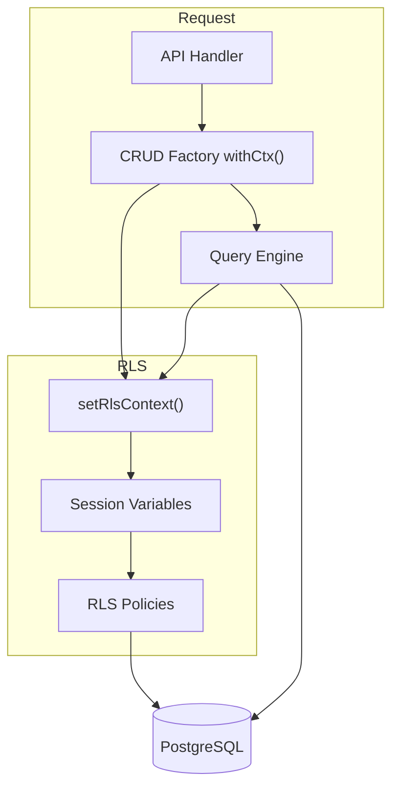

# Row-Level Security (RLS) Specification

This document outlines the Row-Level Security implementation for tenant isolation in Open Mercato.

## Overview

PostgreSQL Row-Level Security (RLS) provides database-level tenant isolation as a defense-in-depth layer. Even if application code forgets to add tenant filters, the database automatically enforces isolation.

## Goals

- Enforce tenant isolation at the database level using PostgreSQL RLS
- Provide defense-in-depth security alongside existing application-level filtering
- Make cross-tenant data access impossible, even with application bugs
- Keep the feature toggleable for gradual rollout and backward compatibility

## Architecture

### Session Variables

RLS policies use PostgreSQL session variables to identify the current tenant:

| Variable | Purpose |
|----------|---------|
| `app.current_tenant_id` | UUID of the current tenant |
| `app.current_organization_id` | UUID of the current organization (optional) |

### Policy Structure

Each tenant-scoped table gets an RLS policy:

```sql
-- For non-nullable tenant_id
CREATE POLICY "rls_tenant_isolation_<table>" ON "<table>"
  FOR ALL
  USING (
    NULLIF(current_setting('app.current_tenant_id', true), '') IS NOT NULL
    AND tenant_id = current_setting('app.current_tenant_id', true)::UUID
  )
  WITH CHECK (
    NULLIF(current_setting('app.current_tenant_id', true), '') IS NOT NULL
    AND tenant_id = current_setting('app.current_tenant_id', true)::UUID
  );

-- For nullable tenant_id (system tables)
CREATE POLICY "rls_tenant_isolation_<table>" ON "<table>"
  FOR ALL
  USING (
    tenant_id IS NULL  -- System records visible to all
    OR (
      NULLIF(current_setting('app.current_tenant_id', true), '') IS NOT NULL
      AND tenant_id = current_setting('app.current_tenant_id', true)::UUID
    )
  );
```

### Context Setting

RLS context is set at multiple integration points:

1. **CRUD Factory** (`packages/shared/src/lib/crud/factory.ts`)
   - Set in `withCtx()` after auth is resolved
   - Primary integration point for API requests

2. **Query Engines** (`packages/shared/src/lib/query/engine.ts`, `packages/core/src/modules/query_index/lib/engine.ts`)
   - Fallback context setting before query execution
   - Ensures RLS works even for non-CRUD-factory queries

## Configuration

### Environment Variables

| Variable | Default | Description |
|----------|---------|-------------|
| `RLS_ENABLED` | `false` | Enable/disable RLS context setting |
| `RLS_STRICT` | `false` | (Future) Fail queries if context not set |

### Enabling RLS

1. Run the migration to create RLS policies
2. Set `RLS_ENABLED=true` in environment
3. Restart the application

## Components

### RLS Helper Module

Location: `packages/shared/src/lib/db/rls.ts`

```typescript
// Check if RLS is enabled
isRlsEnabled(): boolean

// Set RLS context for current transaction
setRlsContext(knex, tenantId, organizationId?): Promise<void>

// Clear RLS context
clearRlsContext(knex): Promise<void>

// Get current context (for debugging)
getRlsTenantContext(knex): Promise<string | null>
getRlsOrgContext(knex): Promise<string | null>

// Wrap function with RLS context
withRlsContext(knex, tenantId, orgId, fn): Promise<T>
```

### Migration

Location: `packages/core/src/modules/auth/migrations/Migration20260123124150.ts`

The migration:
1. Discovers all tables with `tenant_id` column
2. Enables RLS on each table
3. Creates tenant isolation policies
4. Handles nullable vs non-nullable `tenant_id` differently

## Security Considerations

### Secure by Default

- If `app.current_tenant_id` is not set: **no rows visible**
- Empty string is treated as "not set"
- Policies use `NULLIF(..., '')` to handle empty strings

### System Data

Tables with nullable `tenant_id` (e.g., `roles`, `users`) may have system-wide records:
- Records with `tenant_id = NULL` are visible to all authenticated users
- Tenant-specific records still require matching context

### Bypassing RLS

RLS can be bypassed by:
- Superusers (PostgreSQL default)
- The `postgres` database role
- Setting `row_security = off` (for backups/maintenance)

### Transaction Scope

Session variables are set with `is_local = true`, making them transaction-scoped:
- Automatically cleared when transaction ends
- Safe for connection pooling

## Data Flow



## Failure Modes

| Scenario | Behavior |
|----------|----------|
| RLS disabled (`RLS_ENABLED=false`) | Context not set, policies inactive |
| Context setting fails | Silently continues (best-effort) |
| Context not set + RLS enabled | No rows visible (secure default) |
| Invalid tenant UUID | No rows visible |

## Testing

Unit tests: `packages/shared/src/lib/db/__tests__/rls.test.ts`

Tests cover:
- Environment variable parsing
- Context setting/clearing
- Null/undefined handling
- Error propagation

## Operational Notes

### Enabling RLS in Production

1. Deploy application with `RLS_ENABLED=false`
2. Run migration to create policies
3. Test in staging with `RLS_ENABLED=true`
4. Enable in production

### Troubleshooting

**No rows returned:**
- Check if `app.current_tenant_id` is set: `SELECT current_setting('app.current_tenant_id', true);`
- Verify tenant ID matches data: `SELECT DISTINCT tenant_id FROM <table>;`

**Performance issues:**
- Policies use indexed `tenant_id` column
- Impact should be minimal for properly indexed tables

### Disabling RLS (Emergency)

```sql
-- Disable for a specific table
ALTER TABLE <table> DISABLE ROW LEVEL SECURITY;

-- Or set session to bypass
SET row_security = off;
```

## Changelog

### 2026-01-27
- Added auto-sync: `dbMigrate()` now automatically creates RLS policies for new tables with `tenant_id`
- Added reusable sync utility: `packages/shared/src/lib/db/rls-sync.ts` (`syncRlsPolicies`, `hasAnyRlsPolicies`)
- Added reusable SQL builders: `buildRlsPolicySql()`, `rlsPolicyName()` in `packages/shared/src/lib/db/rls.ts`
- Added standalone CLI command: `yarn mercato db rls-sync` (supports `--dry-run`)
- Sync runs when `RLS_ENABLED=true` or when existing `rls_tenant_isolation_*` policies are detected
- Documented RLS conventions in `AGENTS.md`

### 2026-01-23
- Initial implementation
- RLS helper module with context management
- Migration for all tenant-scoped tables
- Integration with CRUD factory and query engines
- Environment-based toggle (RLS_ENABLED)
