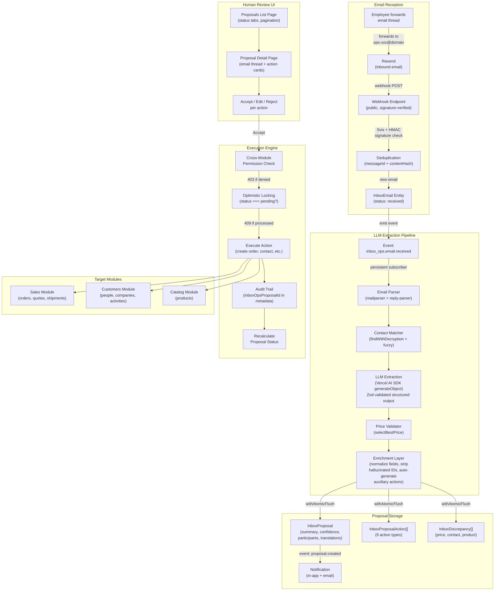
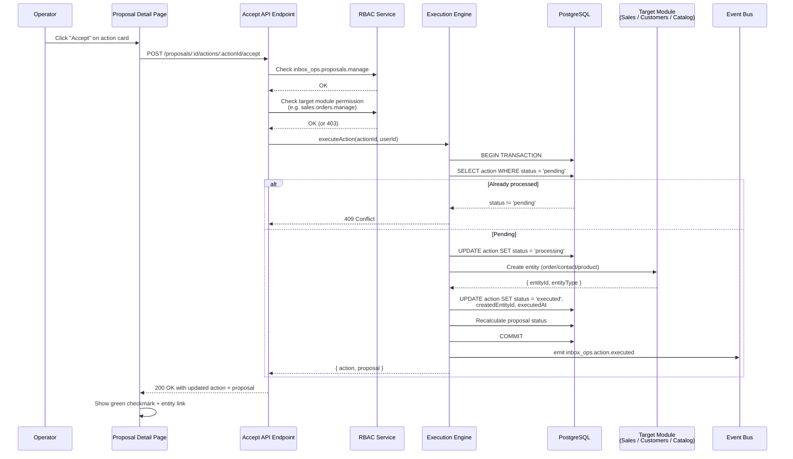
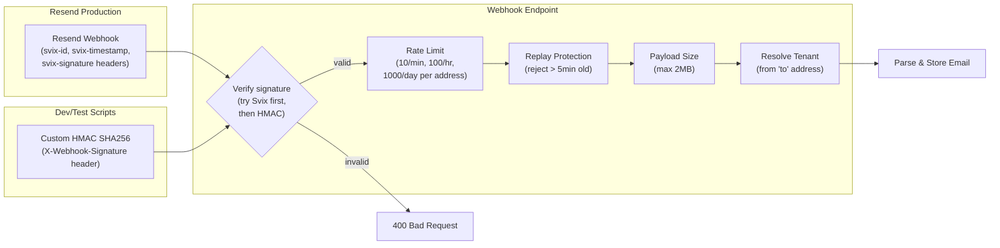
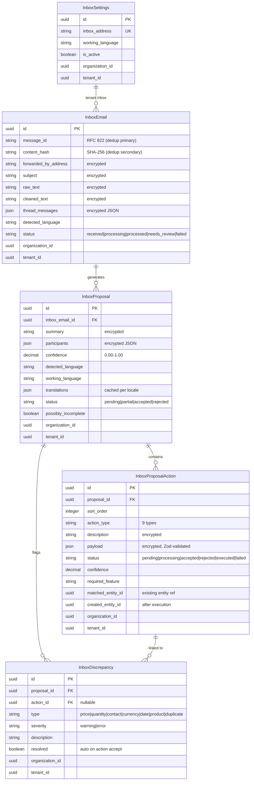

## Summary

**InboxOps Agent** — a new `inbox_ops` core module that turns forwarded email threads into structured ERP actions. Phase 1 MVP delivers the full receive → extract → review → execute pipeline with human-in-the-loop safety.

**The problem:** SMB ops teams in distribution, manufacturing, and ecommerce spend hours daily reading customer emails and manually keying orders, quotes, contacts, and shipment updates into the ERP. Long threads bury critical details, there's no audit trail between "what was agreed in email" and "what was entered in the system", and drafting replies requires constant context-switching.

**The solution:** Employees forward email threads to a per-tenant inbox address. The system parses the thread via LLM, proposes structured actions (create order, update shipment, draft reply, etc.), and presents them for human review. Operators accept, edit, or reject each action — nothing auto-executes.

Fixes #573

---

## Architecture

### End-to-End Pipeline



### Execution Sequence (Accept Action)



### Webhook Security (Dual Verification)



### Data Model



---

## Changes

### New Module: `packages/core/src/modules/inbox_ops/`
76 source files | 5 entities | 15 API routes | 4 backend pages | 20 test files | ~16K lines

### Inbound Email Reception
- Public webhook endpoint with **dual signature verification**: Svix (Resend native) + custom HMAC SHA256 for dev/testing
- Rate limiting: 10/min, 100/hour, 1000/day per inbox address
- Deduplication by RFC 822 Message-ID (primary) and content SHA-256 hash (secondary)
- Replay protection (reject >5 min), 2MB payload limit
- Email thread parsing via `mailparser` + `email-reply-parser` — signature stripping, thread splitting, language detection

### LLM Extraction Pipeline
- Persistent event subscriber on `inbox_ops.email.received`
- Vercel AI SDK `generateObject()` with shared OpenCode provider contract
- Zod-enforced structured output: summary, participants, proposed actions, discrepancies, draft replies, confidence score
- Email content in `<email_content>` XML delimiters to resist prompt injection
- Business rule guardrails: max quantity 10K, max order value $1M, max 20 actions/proposal
- **Contact matching**: exact email via `findWithDecryption`, fuzzy name via query engine
- **Price validation**: `selectBestPrice` with channel/customer/quantity context, configurable threshold (default 5%)
- **Auto-generated auxiliary actions**: `create_contact` for unknown participants, `link_contact` for matched CRM contacts, `create_product` for unmatched catalog products
- **Enrichment**: normalizes LLM field name variations, strips hallucinated productIds, resolves missing currency codes from channel defaults, validates draft reply addresses against parsed headers

### 9 Action Types

| Action | What it does | Required permission |
|--------|-------------|-------------------|
| `create_order` | Creates SalesOrder (or SalesQuote if Quote→Order flow required) | `sales.orders.manage` |
| `create_quote` | Creates SalesQuote | `sales.quotes.manage` |
| `update_order` | Typed operations: quantity changes, delivery dates, notes | `sales.orders.manage` |
| `update_shipment` | Updates tracking, carrier, status via dictionary lookup | `sales.shipments.manage` |
| `create_contact` | Creates Person or Company with `source: 'inbox_ops'` | `customers.people.manage` |
| `create_product` | Creates catalog product for unmatched line items | `catalog.products.manage` |
| `link_contact` | Links email participant to existing CRM contact | `customers.people.manage` |
| `log_activity` | Logs email/call/meeting activity on contact record | `customers.activities.manage` |
| `draft_reply` | Generates contextual reply draft with ERP data, sendable via Resend | `inbox_ops.replies.send` |

### Execution Engine
- **Cross-module permission enforcement**: accepting `create_order` requires both `inbox_ops.proposals.manage` AND `sales.orders.manage`
- **Optimistic locking**: checks `action.status === 'pending'` within transaction, returns 409 on concurrent accept
- **Proposal status recalculation**: all accepted → `accepted`, all rejected → `rejected`, mix → `partial`
- **Audit trail**: stores `inboxOpsProposalId` + `inboxOpsActionId` in created entity's `metadata` JSONB
- **Discrepancy auto-resolution**: creating a contact resolves `unknown_contact`, creating a product resolves `product_not_found` and back-patches `productId` into related order line items
- **Duplicate prevention**: checks existing contacts by email before creating
- **Quote→Order flow**: detects tenant's SalesChannel config and auto-switches `create_order` to `create_quote`

### Backend UI (4 pages)
- **Proposals List** (`/backend/inbox-ops`) — status tabs with counts, pagination, search, empty state with setup instructions
- **Proposal Detail** (`/backend/inbox-ops/proposals/:id`) — responsive two-panel layout (email thread left, AI summary + action cards right), Accept All with confirmation dialog
- **Processing Log** (`/backend/inbox-ops/log`) — all received emails with processing status
- **Settings** (`/backend/inbox-ops/settings`) — forwarding address with copy button, working language selector, active toggle

### Translation Support
- Configurable working language per tenant in Settings
- On-demand proposal translation via LLM (summary + action descriptions)
- Cached translations stored in `InboxProposal.translations` JSONB
- `POST /api/inbox-ops/proposals/:id/translate` endpoint

### RBAC (5 features)

| Permission | Admin | Employee | Description |
|------------|:-----:|:--------:|-------------|
| `inbox_ops.proposals.view` | x | x | View proposals |
| `inbox_ops.proposals.manage` | x | x | Accept/reject/edit actions |
| `inbox_ops.settings.manage` | x | | Configure inbox settings |
| `inbox_ops.log.view` | x | | View processing log |
| `inbox_ops.replies.send` | x | x | Send draft replies |

### Other
- **i18n**: All 4 locales (en, de, es, pl) + template locales
- **User guide**: `apps/docs/docs/user-guide/inbox-ops.mdx` — full setup walkthrough (Resend domain, webhook, env vars, verification, troubleshooting)
- **Shared AI utilities**: OpenCode provider/model resolution extracted to `packages/shared/src/lib/ai/` for reuse across InboxOps and AI Assistant
- **Events**: 14 domain events (`inbox_ops.email.received`, `inbox_ops.proposal.created`, `inbox_ops.action.executed`, etc.)
- **Notifications**: In-app + email notification on proposal creation targeting `inbox_ops.proposals.manage` users
- **`.env.example`**: Updated both `apps/mercato/` and `packages/create-app/template/` with all InboxOps env vars

---

## Architecture Decisions

| Decision | Choice | Why |
|----------|--------|-----|
| LLM integration | Vercel AI SDK `generateObject()` + shared OpenCode provider | Reuses existing config, avoids parallel provider stacks, Zod validation in one place |
| Email provider | Resend inbound webhooks | Consistent with existing outbound email setup |
| Execution model | Human-in-the-loop proposals | LLM accuracy insufficient for unsupervised order creation |
| Data storage | Own `InboxEmail` entity (not Messages module) | Messages module (PR #569) not yet merged — forward-compatible for Phase 2a migration |
| Webhook security | Dual verification (Svix + HMAC) | Svix for production Resend, HMAC for dev/testing scripts |
| Cross-module refs | FK IDs only, no ORM relationships | Per project convention — modules remain independent |

---

## Configuration

### Required
```env
RESEND_API_KEY=re_...                          # Fetch full email content
RESEND_WEBHOOK_SIGNING_SECRET=whsec_...        # Svix signature verification
INBOX_OPS_DOMAIN=your-id.resend.app            # Receiving domain
OPENCODE_PROVIDER=anthropic                    # LLM provider (anthropic/openai/google)
ANTHROPIC_API_KEY=sk-ant-...                   # Provider API key
```

### Optional tuning
```env
INBOX_OPS_WEBHOOK_SECRET=...                   # Custom HMAC for dev testing
INBOX_OPS_LLM_MODEL=...                        # Override default model
INBOX_OPS_LLM_TIMEOUT_MS=90000                 # LLM timeout (default 90s)
INBOX_OPS_CONFIDENCE_THRESHOLD=0.5             # Below this → needs_review
INBOX_OPS_MAX_TEXT_SIZE=204800                  # Max text to LLM (200KB)
INBOX_OPS_PRICE_MISMATCH_THRESHOLD=0.05        # 5% tolerance
```

---

## How to Test

1. Configure env vars (see user guide: `apps/docs/docs/user-guide/inbox-ops.mdx`)
2. Start the dev server (`yarn dev`)
3. Forward a test email to your tenant's inbox address (visible at `/backend/inbox-ops/settings`)
4. Watch the Processing Log (`/backend/inbox-ops/log`) — email should appear within seconds
5. After ~30s, a proposal appears at `/backend/inbox-ops` with extracted actions
6. Review, accept, or reject actions — accepted orders/contacts appear in their respective modules

For local testing without Resend, use the HMAC webhook scripts:
```bash
scripts/test-inbox-webhook.sh        # English order email
scripts/test-inbox-webhook-polish.sh # Polish language test
scripts/test-inbox-webhook-quote.sh  # Quote request test
```

---

## Specification

**Does a spec exist for this feature/module?**
- [x] Yes

**Spec file path:** `.ai/specs/SPEC-029-2026-02-15-inbox-ops-agent.md`

## Testing

- Unit tests for email parser, webhook validation, dedup logic, extraction Zod schemas
- Unit tests for contact matcher, price validator, translation provider
- API route tests for action accept (permission verification, optimistic locking, idempotency)
- API route tests for email reprocess (supersede/409 behavior)
- Shared OpenCode provider/model resolution tests
- Manual webhook testing scripts in `scripts/test-inbox-webhook*.sh`

```bash
yarn test packages/core/src/modules/inbox_ops/
yarn test packages/shared/src/lib/ai/
```

## Checklist

- [ ] This pull request targets `develop`.
- [x] I have read and accept the Open Mercato Contributor License Agreement (see `docs/cla.md`).
- [x] I updated documentation, locales, or generators if the change requires it.
- [x] I added or adjusted tests that cover the change.
- [ ] I added or updated integration tests in `.ai/qa/tests/` (or documented why integration coverage is not required).
- [x] I created or updated the spec in `.ai/specs/` with a changelog entry (if applicable).

**Integration tests note:** Playwright integration tests are planned for Phase 2d. Phase 1 covers unit tests and API route tests for core extraction and execution logic.

## Linked issues

Fixes #573

---

## Phase 2 Roadmap

| Phase | Scope | Blocked by |
|-------|-------|-----------|
| **2a** | Messages module integration — register as message type, use for draft replies and threading | PR #569 merge |
| **2b** | Command pattern & undo — register `CommandHandler` instances for all mutations | — |
| **2c** | MCP AI tools — `inbox_ops_categorize_message`, `inbox_ops_query_proposals`, etc. | — |
| **2d** | Hardening — cache strategy, full search indexing, Playwright integration tests, data retention | — |
| **2e** | Advanced — generic extraction engine (YAML schemas), attachment/PDF processing, NER reference linking, usage stats | Separate SPEC |
