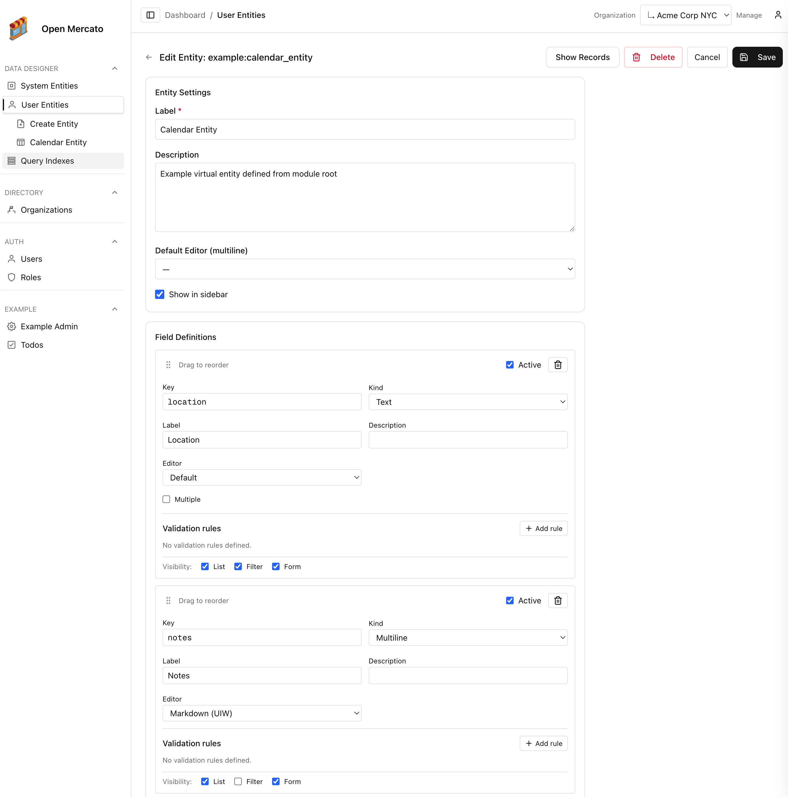

<p align="center">
  
</p>

# Open Mercato

[](LICENSE)
[](https://docs.openmercato.com/)
[](https://github.com/open-mercato/open-mercato/issues)
[](https://nextjs.org/)

Open Mercato is a new‑era, AI‑supportive platform for shipping enterprise‑grade CRMs, ERPs, and commerce backends. It’s modular, extensible, and designed so teams can mix their own modules, entities, and workflows while keeping the guardrails of a production-ready stack.

## Core Use Cases

- 💼 **CRM** – model customers, opportunities, and bespoke workflows with infinitely flexible data definitions.
- 🏭 **ERP** – manage orders, production, and service delivery while tailoring modules to match your operational reality.
- 🛒 **Commerce** – launch CPQ flows, B2B ordering portals, or full commerce backends with reusable modules.
- 🤝 **Self-service system** – spin up customer or partner portals with configurable forms, guided flows, and granular permissions.
- 🔄 **Workflows** – orchestrate custom data lifecycles and document workflows per tenant or team.
- 🧵 **Production** – coordinate production management with modular entities, automation hooks, and reporting.
- 🌐 **Headless/API platform** – expose rich, well-typed APIs for mobile and web apps using the same extensible data model.

## Highlights

- 🧩 **Modular architecture** – drop in your own modules, pages, APIs, and entities with auto-discovery and overlay overrides.
- 🧬 **Custom entities & dynamic forms** – declare fields, validators, and UI widgets per module and manage them live from the admin.
- 🏢 **Multi-tenant by default** – SaaS-ready tenancy with strict organization/tenant scoping for every entity and API.
- 🏛️ **Multi-hierarchical organizations** – built-in organization trees with role- and user-level visibility controls.
- 🛡️ **Feature-based RBAC** – combine per-role and per-user feature flags with organization scoping to gate any page or API.
- ⚡ **Data indexing & caching** – hybrid JSONB indexing and smart caching for blazing-fast queries across base and custom fields.
- 🔔 **Event subscribers & workflows** – publish domain events and process them via persistent subscribers (local or Redis).
- ✅ **Growing test coverage** – expanding unit and integration tests ensure modules stay reliable as you extend them.
- 🧠 **AI-supportive foundation** – structured for assistive workflows, automation, and conversational interfaces.
- ⚙️ **Modern stack** – Next.js App Router, TypeScript, zod, Awilix DI, MikroORM, and bcryptjs out of the box.

## Screenshots

<table>
  <tr>
    <td><a href="docs/static/screenshots/open-mercato-orders-order-shipments.png"></a></td>
    <td><a href="docs/static/screenshots/open-mercato-edit-organization.png"></a></td>
    <td><a href="docs/static/screenshots/open-mercato-users-management.png"></a></td>
  </tr>
  <tr>
    <td style="text-align:center;">Order Shipments</td>
    <td style="text-align:center;">Organizations</td>
    <td style="text-align:center;">Users</td>
  </tr>
  <tr>
    <td><a href="docs/static/screenshots/open-mercato-managing-roles.png"></a></td>
    <td><a href="docs/static/screenshots/open-mercato-define-custom-fields.png"></a></td>
    <td><a href="docs/static/screenshots/open-mercato-custom-entity-records.png"></a></td>
  </tr>
  <tr>
    <td style="text-align:center;">Roles &amp; ACL</td>
    <td style="text-align:center;">Custom Fields</td>
    <td style="text-align:center;">Custom Entity Records</td>
  </tr>
  <tr>
    <td><a href="docs/static/screenshots/open-mercato-people-add-new.png"></a></td>
    <td><a href="docs/static/screenshots/open-mercato-deals-listing.png"></a></td>
    <td><a href="docs/static/screenshots/open-mercato-people-notes.png"></a></td>
  </tr>
  <tr>
    <td style="text-align:center;">Add New Customer</td>
    <td style="text-align:center;">Deals Pipeline</td>
    <td style="text-align:center;">Customer Notes</td>
  </tr>
  <tr>
    <td><a href="docs/static/screenshots/open-mercato-sales-pipeline.png"></a></td>
    <td><a href="docs/static/screenshots/open-mercato-orders-order-shipments.png"></a></td>
    <td><a href="docs/static/screenshots/open-mercato-orders-order-totals.png"></a></td>
  </tr>
  <tr>
    <td style="text-align:center;">Sales Pipeline</td>
    <td style="text-align:center;">Order Shipments</td>
    <td style="text-align:center;">Order Totals</td>
  </tr>
  <tr>
    <td><a href="docs/static/screenshots/open-mercato-catalog-products.png"></a></td>
    <td><a href="docs/static/screenshots/open-mercato-sales-channels.png"></a></td>
    <td><a href="docs/static/screenshots/open-mercato-all-sales-channels-offers.png"></a></td>
  </tr>
  <tr>
    <td style="text-align:center;">Catalog Products</td>
    <td style="text-align:center;">Sales Channels</td>
    <td style="text-align:center;">Channel Offers</td>
  </tr>
  <tr>
    <td colspan="3" style="text-align:center;" halign="center">
      <a href="docs/static/screenshots/open-mercato-homepage.png"></a>
    </td>
  </tr>
  <tr>
    <td colspan="3" style="text-align:center;">Home overview with enabled modules list</td>
  </tr>
</table>


## Architecture Overview

- 🧩 Modules: Each feature lives under `src/modules/<module>` with auto‑discovered frontend/backend pages, APIs, CLI, i18n, and DB entities.
- 🗃️ Database: MikroORM with per‑module entities and migrations; no global schema. Migrations are generated and applied per module.
- 🧰 Dependency Injection: Awilix container constructed per request. Modules can register and override services/components via `di.ts`.
- 🏢 Multi‑tenant: Core `directory` module defines `tenants` and `organizations`. Most entities carry `tenant_id` + `organization_id`.
- 🔐 Security: RBAC roles, zod validation, bcryptjs hashing, JWT sessions, role‑based access in routes and APIs.

Read more on the [Open Mercato Architecture](https://docs.openmercato.com/architecture/system-overview)

## Data Encryption

Open Mercato ships with tenant-scoped, field-level data encryption so PII and sensitive business data stay protected while you keep the flexibility of custom entities and fields. Encryption maps live in the admin UI/database, letting you pick which system and custom columns are encrypted; MikroORM hooks automatically encrypt on write and decrypt on read while keeping deterministic hashes (e.g., `email_hash`) for lookups.

Architecture in two lines: Vault/KMS (or a derived-key fallback) issues per-tenant DEKs and caches them so performance stays snappy; AES-GCM wrappers sit in the ORM lifecycle, storing ciphertext at rest while CRUD and APIs keep working with plaintext. Read the docs to dive deeper: [docs.openmercato.com/user-guide/encryption](https://docs.openmercato.com/user-guide/encryption).


## Migration Guide

We have migrated Open Mercato to a monorepo structure. If you're upgrading from a previous version, please note the following changes:

### File Structure

The codebase is now organized into:
- `packages/` - Shared libraries and modules (`@open-mercato/core`, `@open-mercato/ui`, `@open-mercato/shared`, `@open-mercato/cli`, `@open-mercato/cache`, `@open-mercato/events`, `@open-mercato/queue`, `@open-mercato/content`, `@open-mercato/onboarding`, `@open-mercato/search`)
- `apps/` - Applications (main app in `apps/mercato`, docs in `apps/docs`)

### Import Aliases

Import aliases have changed from path-based to package-based imports:
- **Before:** `@/lib/...`, `@/components/...`, `@/modules/...`
- **After:** `@open-mercato/shared/lib/...`, `@open-mercato/ui/components/...`, `@open-mercato/core/modules/...`, etc.

### Environment Variables

The `.env` file now must live in `apps/mercato` instead of the project root.
The fastest way to start is to copy the example file:

```bash
cp apps/mercato/.env.example apps/mercato/.env
```
At minimum, set `DATABASE_URL`, `JWT_SECRET`, and `REDIS_URL` (or `EVENTS_REDIS_URL`) before bootstrapping.

### Package Manager

Yarn 4 is now required. Ensure you have Yarn 4+ installed before proceeding.


## Getting Started


This is a quickest way to get Open Mercato up and running on your localhost / server - ready for testing / demoing or for `Core development`!

[](https://youtu.be/OsalmbiWQ-I)


### Quick Start (Monorepo)

**Prerequisites:** Yarn 4+

```bash
git clone https://github.com/open-mercato/open-mercato.git
cd open-mercato
git checkout develop
yarn install

cp apps/mercato/.env.example apps/mercato/.env # EDIT this file to set up your specific files
#At minimum, set `DATABASE_URL`, `JWT_SECRET`, and `REDIS_URL` (or `EVENTS_REDIS_URL`) before bootstrapping.

yarn generate
yarn initialize # or yarn reinstall
yarn dev
```

### Quick Start (Legacy)

```bash
git clone https://github.com/open-mercato/open-mercato.git
cd open-mercato
yarn install
cp apps/mercato/.env.example apps/mercato/.env
yarn mercato init
yarn dev
```

This script prepares module registries, generates/applies migrations, seeds default roles, provisions an admin user, and loads sample CRM data (companies, people, deals, activities, todos) unless you pass `--no-examples`. Add `--stresstest` to preload a high-volume dataset (6,000 contacts by default) complete with additional companies, pipeline deals, activities, and timeline notes — all with custom fields populated. Override the volume with `-n <amount>` or `--count=<amount>`, and append `--lite` to skip the heavier extras when you just need raw contacts. A progress bar keeps you updated while the stress-test data is generated.

Navigate to `http://localhost:3000/backend` and sign in with the credentials printed by `yarn mercato init`.

If you plan to use the self-service onboarding flow or send transactional emails, opt-in by setting the following environment variables in your `.env` file before starting the server (the onboarding toggle defaults to `false`):
```env
RESEND_API_KEY=your_resend_api_key
APP_URL=http://localhost:3000
EMAIL_FROM=no-reply@your-domain.com
SELF_SERVICE_ONBOARDING_ENABLED=true
ADMIN_EMAIL=ops@your-domain.com
```

💡 Need a clean slate? Run `yarn mercato init --reinstall`. It wipes module migrations and **drops the database**, so only use it when you intentionally want to reset everything. Prefer `yarn mercato init --no-examples` if you simply want to skip demo CRM data while keeping core roles and users. Reach for `yarn mercato init --stresstest` (optionally with `-n 12000`) when you want to benchmark full CRM flows with thousands of contacts, companies, deals, activities, and notes — or `yarn mercato init --stresstest --lite` when you mainly need raw contact volume at high throughput.

Full installation guide (including prerequisites and cloud deployment): [docs.openmercato.com/installation/setup](https://docs.openmercato.com/installation/setup)

## Live demo

[](https://demo.openmercato.com)

## Documentation

Browse the full documentation at [docs.openmercato.com](https://docs.openmercato.com/).

- [Introduction](https://docs.openmercato.com/introduction/overview)
- [Installation](https://docs.openmercato.com/installation/setup)
- [User Guide](https://docs.openmercato.com/user-guide/overview)
- [Tutorials](https://docs.openmercato.com/tutorials/first-app)
- [Customization](https://docs.openmercato.com/customization/build-first-app)
- [Architecture](https://docs.openmercato.com/architecture/system-overview)
- [Framework](https://docs.openmercato.com/framework/modules/overview)
- [API Reference](https://docs.openmercato.com/api/overview)
- [CLI Reference](https://docs.openmercato.com/cli/overview)
- [Appendix](https://docs.openmercato.com/appendix/troubleshooting)

## Spec Driven Development

Open Mercato follows a **spec-first development approach**. Before implementing new features or making significant changes, we document the design in the `.ai/specs/` folder.

### Why Specs?

- **Clarity**: Specs ensure everyone understands the feature before coding starts
- **Consistency**: Design decisions are documented and can be referenced by humans and AI agents
- **Traceability**: Each spec maintains a changelog tracking the evolution of the feature

### How It Works

1. **Before coding**: Check if a spec exists at `.ai/specs/<module-name>.md`
2. **New features**: Create or update the spec with your design before implementation
3. **After changes**: Update the spec's changelog with a dated summary

Example specs: `notifications-module.md`, `messages-module.md`, `ui-reusable-components.md`

See [`.ai/specs/AGENTS.md`](.ai/specs/AGENTS.md) for detailed guidelines on maintaining specs.

## Join us on Discord

Connect with the team and other builders in our Discord community: [https://discord.gg/f4qwPtJ3qA](https://discord.gg/f4qwPtJ3qA).

## Contributing

We welcome contributions of all sizes—from fixes and docs updates to new modules. Start by reading [CONTRIBUTING.md](CONTRIBUTING.md) for branching conventions (`main`, `develop`, `feat/<feature>`), release flow, and the full PR checklist. Then check the open issues or propose an idea in a discussion, and:

1. Fork the repository and create a branch that reflects your change.
2. Install dependencies with `yarn install` and bootstrap via `yarn mercato init` (add `--no-examples` to skip demo CRM content; `--stresstest` for thousands of synthetic contacts, companies, deals, and timeline interactions; or `--stresstest --lite` for high-volume contacts without the heavier extras).
3. Develop and validate your changes (`yarn lint`, `yarn test`, or the relevant module scripts).
4. Open a pull request referencing any related issues and outlining the testing you performed.

Refer to [AGENTS.md](AGENTS.md) for deeper guidance on architecture and conventions when extending modules.

Open Mercato is proudly supported by [Catch The Tornado](https://catchthetornado.com/).

<div align="center">
  <a href="https://catchthetornado.com/">
    
  </a>
</div>

## CLI Commands

Open Mercato let the module developers to expose the custom CLI commands for variouse maintenance tasks. Read more on the [CLI documentation](https://docs.openmercato.com/cli/overview)

## License

- MIT — see `LICENSE` for details.
