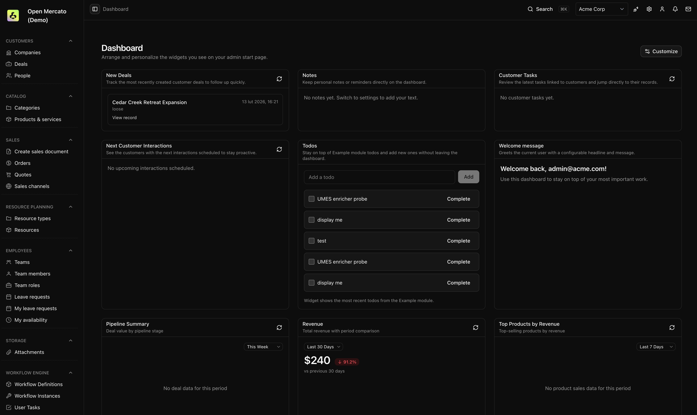
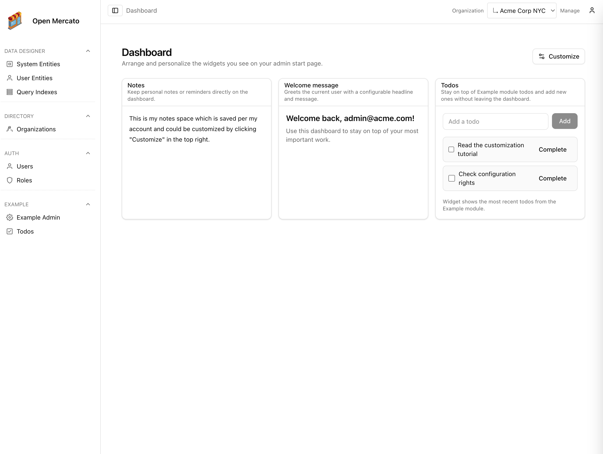
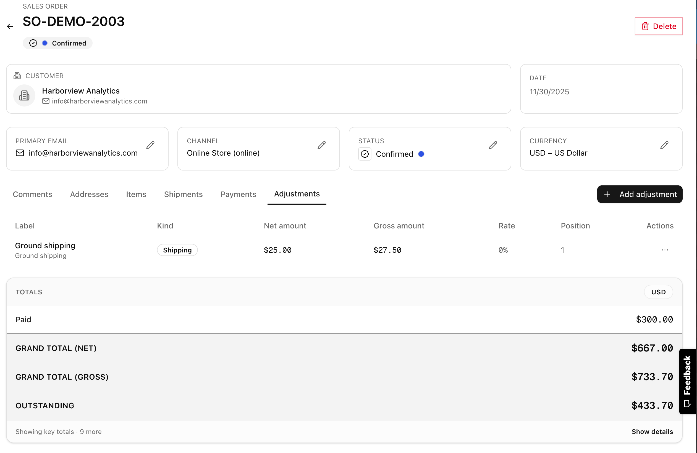
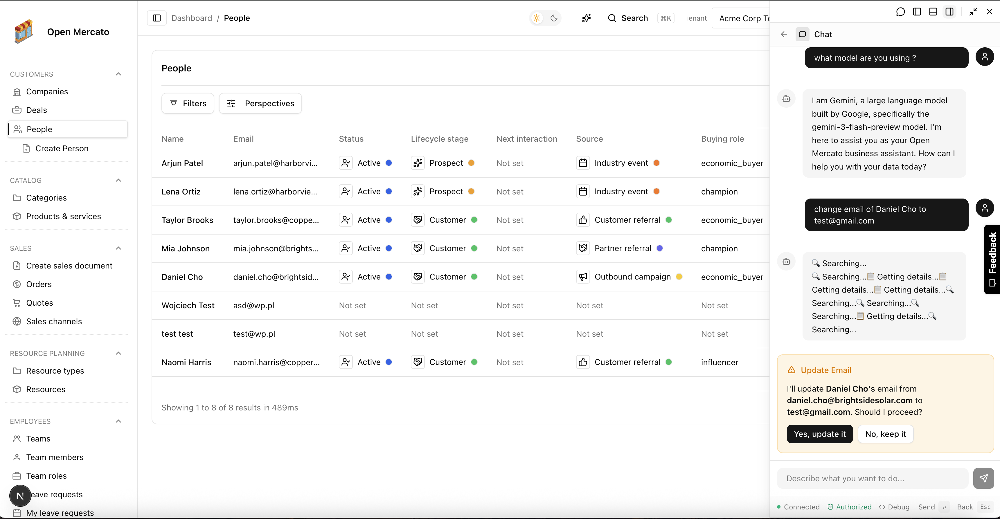

<p align="center">
  
</p>

# Open Mercato

[](LICENSE)
[](https://docs.openmercato.com/)
[](https://nextjs.org/)
[](https://github.com/open-mercato/official-modules)
[](https://github.com/open-mercato/skills)
[](https://github.com/open-mercato/cezar)

**Open Mercato - the AI-Engineering Foundation Framework.**

AI code assistants generate code. They don't decide where it goes, how it should be layered, or whether it stays consistent across 30 or 50 engineers in the team.

Open Mercato is the open-source foundation framework that solves it:

- **Architecture-aware AI harness** - agents know where in the project to place code, not just how to write it, they are provided with autonomous skills for everything from adding data table, Design-System coherent forms to implementing whole features with unit and integration tests,
- **Spec-first development** - specs ship with the repo, AI output becomes reproducible
- **Including AI harness and skills for human cooperation** - code review, ticketing flow and debugging
- **Ready-made CRM/ERP domain modules** - start at 80% done
- **Open-source, no lock-in** - full code ownership, no per-seat pricing trap
- **Teachable** - the whole team enters AI-assisted dev, not just 1–2 seniors

End with „almost ready apps”. Ship it pro, ship it fast. We’ve got you!

Built for CTOs who have already deployed Cursor/Copilot and noticed it isn't enough. Built for developers who want to build professional business apps and backends without constantly checking their back.

[Get started](#getting-started) · [Live demo](https://demo.openmercato.com) · [Documentation](https://docs.openmercato.com/) · [Contributing](CONTRIBUTING.md)

## Common use cases

- **CRM and sales operations.** Manage people, companies, opportunities, activities, quotations, orders, and organization-specific sales processes.
- **Commerce and ordering.** Build product catalogs, CPQ flows, B2B ordering portals, checkout and pay-link experiences, payment integrations, shipping, and fulfillment systems.
- **ERP and operational systems.** Coordinate warehouse management (WMS), resources, staff availability, production, service delivery, and other internal processes.
- **Customer and partner portals.** Provide self-service experiences with separate customer identities, granular portal permissions, configurable forms, and extensible navigation and widgets.
- **Workflow and document automation.** Model approvals, tasks, document lifecycles, and tenant-specific processes with workflows, business rules, and scheduled jobs.
- **After-sales and compliance.** Handle warranty and RMA claims, supplier recovery, EUDR evidence, risk assessment, and reporting.
- **Headless and vertical applications.** Use typed APIs, API keys, domain events, and webhooks to support web, mobile, and purpose-built operational software.

## Platform capabilities

- **Modular by design.** Add or override modules, pages, APIs, entities, services, components, widgets, and navigation through declared extension points and auto-discovery.
- **Extensible data and administration.** Combine code-defined entities with admin-managed custom entities and fields, dynamic forms, configurable data tables, shared dictionaries, and translations.
- **Tenant isolation and access control.** Scope data to tenants and organizations, model organization hierarchies, assign feature-based permissions to staff, and manage customer-portal access separately.
- **Automation and integration infrastructure.** Use workflows, business rules, domain events, scheduled jobs, background queues, progress tracking, data-sync adapters, Standard Webhooks, and notification or communication channels.
- **Search and data infrastructure.** Query base and custom fields through hybrid JSONB indexes, full-text, vector, and token search, with tag-based caching where appropriate.
- **Operational safeguards.** Field-level encryption, audit and action logs, optimistic locking for concurrent edits, mutation guards, and scoped integration credentials are built into the platform conventions.
- **AI inside the product.** Permission-scoped assistants can accept attachments, use allowlisted module tools, and work in contextual UI. Data-changing actions remain behind explicit approval, while prompts, models, policies, and budgets can be controlled per tenant.
- **Agent-assisted development.** Repository specifications, architecture instructions, reusable skills, a one-command starter, and a standalone-app generator help teams apply the same engineering process consistently.
- **Full code ownership.** Open Mercato Core is MIT-licensed, with no per-seat licensing or platform lock-in.

<p align="center">
  <a href="https://www.youtube.com/watch?v=53jsDjAXXhQ"></a>
</p>

## Demo and screenshots

<p align="center">
  <a href="https://demo.openmercato.com"></a>
</p>

<table width="100%">
  <tr>
    <td align="center" width="33%">
      <a href="./apps/docs/static/screenshots/open-mercato-dashboard.png"></a><br/>
      <strong>Dashboard</strong>
    </td>
    <td align="center" width="33%">
      <a href="./apps/docs/static/screenshots/open-mercato-orders-order-details.png"></a><br/>
      <strong>Order details</strong>
    </td>
    <td align="center" width="33%">
      <a href="./apps/docs/static/screenshots/open-mercato-ai-assistant-chat.png"></a><br/>
      <strong>AI Assistant</strong>
    </td>
  </tr>
</table>

[Browse the full screenshot gallery.](SCREENSHOTS.md)

## Getting started

With [Node.js](https://nodejs.org/en/download) installed, the quickest way to start is:

```bash
npx @open-mercato/starter
```

The starter clones the repository when needed, runs its `doctor` audit, handles corporate proxies and TLS interception, creates the environment file and secrets, starts the infrastructure containers, initializes the database, and launches the supervised development runtime. It is idempotent, so a stopped setup can be resumed by running it again.

Inside an existing clone, run `yarn om`. If Node.js is not available, use the no-admin launchers in [`packages/starter/platform/`](packages/starter/platform/): `start.cmd` on Windows or `start.sh` on macOS and Linux. A supported container runtime, such as [Docker Desktop](https://www.docker.com/products/docker-desktop/) or [Rancher Desktop](https://rancherdesktop.io), is detected and explained but is not installed automatically. See the [starter documentation](packages/starter/README.md) for details.

When startup completes, open [http://localhost:3000/backend](http://localhost:3000/backend). The initial credentials are printed in the terminal.

<details>
<summary><strong>Manual monorepo setup</strong></summary>

For macOS or Linux:

```bash
brew install node@24   # or: nvm install 24 && nvm use 24
corepack enable && corepack prepare yarn@4.12.0 --activate

git clone https://github.com/open-mercato/open-mercato.git
cd open-mercato && git checkout develop
yarn infra:up
cp apps/mercato/.env.example apps/mercato/.env
# Set DATABASE_URL, JWT_SECRET, and REDIS_URL in apps/mercato/.env
yarn dev:greenfield
```

For Windows PowerShell:

```powershell
# Install the Node.js 24 MSI, then open a new terminal
Set-ExecutionPolicy -ExecutionPolicy RemoteSigned -Scope CurrentUser
corepack enable; corepack prepare yarn@4.12.0 --activate

git clone https://github.com/open-mercato/open-mercato.git
cd open-mercato; git checkout develop
yarn infra:up
Copy-Item apps\mercato\.env.example apps\mercato\.env
# Set DATABASE_URL, JWT_SECRET, and REDIS_URL in apps\mercato\.env
yarn dev:greenfield
```

`yarn infra:up` starts PostgreSQL, Redis, and Meilisearch. Native PostgreSQL is also supported; see the platform-specific installation guides below.

</details>

<details>
<summary><strong>Create a standalone application</strong></summary>

For macOS or Linux:

```bash
brew install node@24   # or: nvm install 24 && nvm use 24
corepack enable && corepack prepare yarn@4.12.0 --activate

npx create-mercato-app my-app
cd my-app
docker compose up -d
# Set DATABASE_URL, JWT_SECRET, and REDIS_URL in .env
yarn setup
```

For Windows PowerShell as Administrator:

```powershell
# Install the Node.js 24 MSI, then open a new terminal
Set-ExecutionPolicy -ExecutionPolicy RemoteSigned -Scope CurrentUser
corepack enable; corepack prepare yarn@4.12.0 --activate

npx create-mercato-app my-app
cd my-app
docker compose up -d
# Set DATABASE_URL, JWT_SECRET, and REDIS_URL in .env
yarn setup
```

`docker compose up -d` starts PostgreSQL, Redis, and Meilisearch. `yarn setup` installs dependencies, seeds the database, and starts the application. Native PostgreSQL with pgAdmin can be used instead of the database container on Windows.

</details>

### Multiple local instances

Long-lived local instances can share a PostgreSQL server while using separate databases. Pass a database-name override to `yarn dev`, `yarn dev:greenfield`, or `yarn setup`:

```bash
# Use an explicit database name and offer to update .env (the default)
yarn dev:greenfield --database-name=my_db

# Derive the database name from the current directory
yarn dev --database-name

# Use the same option in a standalone application
yarn setup --database-name=client_a

# Apply the override to this process without changing .env
yarn dev --database-name=review_1720 --no-update-env
```

Without this option, behavior is unchanged: there is no prompt and `.env` is not modified. See the [monorepo installation guide](https://docs.openmercato.com/installation/monorepo) and [`yarn setup` documentation](https://docs.openmercato.com/installation/setup).

### Development watcher scope

`yarn dev` watches every workspace package by default. On smaller machines, the scope can be reduced. The selected watch mode is printed when the development runtime starts.

```bash
# Watch packages changed in the working tree or current branch
yarn dev --watch=auto-optimized
OM_WATCH_SCOPE=auto-optimized yarn dev

# Watch an explicit package set
OM_WATCH_SCOPE=env OM_WATCH_PACKAGES=core,ui yarn dev

# Watch the most frequently changed packages (default cap: 6)
yarn dev --watch=popular
```

Set `OM_WATCH_SCOPE=all` or use `--watch=all` to restore the full workspace. The [troubleshooting reference](https://docs.openmercato.com/appendix/troubleshooting) also documents `OM_WATCH_POPULAR_LIMIT` and the Git detection options.

## Architecture

Open Mercato uses the Next.js App Router, TypeScript, Zod, Awilix, MikroORM, and bcryptjs.

| Area | Design |
|---|---|
| Modules | Each feature lives under `src/modules/<module>`. Frontend and backend pages, APIs, CLI commands, translations, and database entities are auto-discovered. |
| Data | MikroORM entities and migrations belong to their modules rather than a global schema. Migrations are generated and applied per module. Most tenant-scoped entities carry `tenant_id` and `organization_id`. |
| Dependency injection | An Awilix container is constructed per request. Modules register and override services or components through `di.ts`. |
| Tenancy | The core `directory` module defines tenants and organizations, including organization hierarchies with role- and user-level visibility controls. |
| Security | Feature flags can be assigned per role and per user and combined with organization scoping. Zod validation, bcryptjs password hashing, JWT sessions, and route/API access controls are part of the framework. |
| Runtime | Hybrid JSONB indexing, caching, domain events, and persistent subscribers support extensible data and asynchronous work. |

See the [architecture overview](https://docs.openmercato.com/architecture/system-overview) for the complete model.

## Platform components

### Official Modules

The [Official Modules repository](https://github.com/open-mercato/official-modules) contains community-published extensions for Open Mercato. Each module is distributed as an npm package, installs with one command and no manual application wiring, and integrates through declared extension points rather than patches to the core platform. Modules can be copied into an application with `--eject` for full ownership. Submissions are reviewed by the core team before publication to npm.

The module system supports anything from a small UI widget to a vertical feature with its own entities, API routes, and administration pages.

### AI Assistant

Open Mercato includes focused assistants that run in the administration pages where their context is available. Assistants are scoped by module, permissions, and tool allowlists. Writes are staged behind an explicit approval card before data changes.

<table width="100%">
  <tr>
    <td align="center" width="50%"><a href="apps/docs/static/screenshots/open-mercato-ai-assistant-available-assistants.png"></a></td>
    <td align="center" width="50%"><a href="apps/docs/static/screenshots/open-mercato-ai-assistant-mutations-approvals.png"></a></td>
  </tr>
  <tr>
    <td style="text-align:center;">Global launcher</td>
    <td style="text-align:center;">Mutation approvals</td>
  </tr>
</table>

The global launcher lists the assistants available to the current user. Modules can also embed `<AiChat>` for contextual workflows such as customer-account exploration and catalog merchandising. Operators can adjust prompts, downgrade mutation policies, and disable individual tools per tenant without redeploying.

- [Overview](https://docs.openmercato.com/framework/ai-assistant/overview)
- [Configuration](https://docs.openmercato.com/framework/ai-assistant/settings)
- [User guide](https://docs.openmercato.com/user-guide/ai-assistant)
- [Legacy MCP assistant design](.ai/specs/implemented/SPEC-012-2026-01-27-ai-assistant-schema-discovery.md)

### Data encryption

Tenant-scoped field encryption protects PII and sensitive business data while retaining support for system and custom fields. Encryption maps are managed in the admin UI and database. MikroORM hooks encrypt values on write and decrypt them on read, while deterministic hashes such as `email_hash` remain available for lookups.

Vault/KMS, or a derived-key fallback, issues per-tenant data-encryption keys and caches them. AES-GCM wrappers store ciphertext at rest while CRUD operations and APIs continue to work with plaintext. See the [encryption guide](https://docs.openmercato.com/user-guide/encryption).

## Development workflow

### Specifications

New features and significant changes are designed in `.ai/specs/` before implementation. A specification records the intended behavior, architecture, integration coverage, and design decisions so that implementation and review have a shared reference.

1. Check `.ai/specs/` for an existing specification before starting a substantial change.
2. Add or update a specification using the `{YYYY-MM-DD}-{title}.md` naming convention.
3. Record implementation changes in the specification changelog.

See the [specification index](.ai/specs/README.md) and [maintenance guidelines](.ai/specs/AGENTS.md).

### Agent skills

The reusable engineering workflows developed alongside Open Mercato are published in [open-mercato/skills](https://github.com/open-mercato/skills). They cover specification writing, implementation, integration testing, code review, CI stabilization, pull-request delivery, and merge management, and are designed to remain technology-agnostic.

Install the shared collection with:

```bash
npx skills add open-mercato/skills --skill '*'
```

Inside this monorepo, install the committed local skills and the shared collection with:

```bash
yarn install-skills
```

The [skills documentation](.ai/skills/README.md) explains the tier system. The [local setup guide](https://docs.openmercato.com/installation/setup) explains when to install them.

### Tutorials and sandbox

<table width="100%">
  <tr>
    <td align="center" width="33%" valign="top">
      <a href="https://www.youtube.com/watch?v=y-lxRrAzbYc&t=1s"></a><br/>
      <strong>Use Open Mercato as a backend</strong><br/>
      Build a custom application on the CRM data model and generated APIs.
    </td>
    <td align="center" width="33%" valign="top">
      <a href="https://www.youtube.com/watch?v=fb47pmH6ojE&t=854s"></a><br/>
      <strong>Build a custom frontend</strong><br/>
      Connect a product-specific landing page to the Open Mercato backend.
    </td>
    <td align="center" width="33%" valign="top">
      <a href="https://sandboxes.openmercato.com"></a><br/>
      <strong>Launch a sandbox</strong><br/>
      Start Open Mercato with Claude Code, Codex, and Visual Studio Code in under 30 seconds.<br/>
      <a href="https://sandboxes.openmercato.com">Open the sandbox</a>
    </td>
  </tr>
</table>

## Installation and deployment guides

Open Mercato ships with separate Docker Compose configurations for hot-reload development and production. Each guide below includes prerequisites, infrastructure options, setup commands, and troubleshooting.

| Environment | Guide |
|---|---|
| Monorepo on macOS, Linux, or Windows | [Core development and full-platform setup](https://docs.openmercato.com/installation/monorepo) |
| Standalone application on macOS, Linux, or Windows | [Standalone setup](https://docs.openmercato.com/installation/standalone) |
| Windows with WSL2 | [WSL2 setup](https://docs.openmercato.com/installation/wsl2) |
| Containerized development | [Docker development](https://docs.openmercato.com/installation/docker) with hot reload and no local toolchain |
| Linux server | [VPS and production deployment](https://docs.openmercato.com/installation/vps), including security and backup guidance |
| VS Code Dev Container | [Dev Container setup](https://docs.openmercato.com/installation/devcontainer); 12 GB RAM is recommended |
| Railway | [One-click Railway deployment](https://docs.openmercato.com/installation/railway) |

<table width="100%">
  <tr>
    <td align="center" valign="top">
      <strong>Getting started with core contributions</strong><br/><br/>
      <a href="https://youtu.be/-ba8Bmc56EQ"></a>
    </td>
    <td align="center" valign="top">
      <strong>Building a standalone application on Linux or macOS</strong><br/><br/>
      <a href="https://www.youtube.com/watch?v=uJn42SLVyI0"></a>
    </td>
    <td align="center" valign="top">
      <strong>Installing Open Mercato on Windows</strong><br/><br/>
      <a href="https://www.youtube.com/watch?v=eX1SqfDPhkU"></a>
    </td>
  </tr>
</table>

## Release channels

- `latest` is the stable npm channel published from `main`.
- `develop` is the moving prerelease channel published on pushes to `develop`.
- Exact snapshot versions remain installable for debugging or rollback.
- Pull-request package previews are opt-in. Run the `Package Previews` workflow with the pull-request number, or use the `om-auto-publish-pr` skill or `gh workflow run`, to publish pkg.pr.new previews without publishing to npm.
- Run `NPM Snapshot Preview` manually only when the legacy npm canary snapshot and standalone validation path are required.

```bash
yarn add @open-mercato/core@develop
npx create-mercato-app@develop my-app
```

## Documentation

The complete documentation is at [docs.openmercato.com](https://docs.openmercato.com/):

- [Introduction](https://docs.openmercato.com/introduction/overview)
- [Installation](https://docs.openmercato.com/installation)
- [User guide](https://docs.openmercato.com/user-guide/overview)
- [Tutorials](https://docs.openmercato.com/tutorials/first-app)
- [Customization](https://docs.openmercato.com/customization/build-first-app)
- [Architecture](https://docs.openmercato.com/architecture/system-overview)
- [Framework](https://docs.openmercato.com/framework/modules/overview)
- [API reference](https://docs.openmercato.com/api/overview)
- [CLI reference](https://docs.openmercato.com/cli/overview)
- [Troubleshooting](https://docs.openmercato.com/appendix/troubleshooting)

## Contributing

Contributions of all sizes are welcome. Read [CONTRIBUTING.md](CONTRIBUTING.md) for the branching conventions (`main`, `develop`, and `feat/<feature>`), release process, and pull-request checklist, then browse the [open issues](https://github.com/open-mercato/open-mercato/issues).

1. Fork the repository and create a branch that describes the change.
2. Install dependencies with `yarn install` and initialize the application with `yarn mercato init`. Add `--no-examples` to omit demo CRM data, `--stresstest` to create thousands of synthetic records, or `--stresstest --lite` for high-volume contacts without the heavier fixtures.
3. Make the change and run the relevant validation, such as `yarn lint` and `yarn test`.
4. Open a pull request that references related issues and records the tests performed.

[AGENTS.md](AGENTS.md) contains the repository architecture and implementation conventions.

Join the team and other contributors in the [Open Mercato Discord community](https://discord.gg/f4qwPtJ3qA).

## Hall of Fame

The Open Mercato Agentic Hackathon was held in Sopot on 10–12 April 2026. Team MercatoMinds completed 36 pull requests and scored 378 points.

| Rank | Contributor | GitHub | Points | Pull requests |
|---:|---|---|---:|---:|
| 1 | Michał Strześniewski | [@strzesniewski](https://github.com/strzesniewski) | 106 | 9 |
| 2 | Wiktor Idzikowski | [@WXYZx](https://github.com/WXYZx) | 93 | 11 |
| 3 | Adam Kardasz | [@WH173-P0NY](https://github.com/WH173-P0NY) | 87 | 7 |
| 4 | Karol Roman | [@RMN-45](https://github.com/RMN-45) | 39 | 3 |
| 5 | Adam Kanigowski | [@AK-300codes](https://github.com/AK-300codes) | 29 | 3 |
| 6 | Tomasz Jeleszuk | [@Tomeckyyyy](https://github.com/Tomeckyyyy) | 24 | 3 |

## Sponsors

### Blacksmith

<a href="https://www.blacksmith.sh/">
  <picture>
    <source media="(prefers-color-scheme: dark)" srcset="https://raw.githubusercontent.com/useblacksmith/stickydisk/main/wordmark-white.svg" />
    <source media="(prefers-color-scheme: light)" srcset="https://raw.githubusercontent.com/useblacksmith/stickydisk/main/wordmark-black.svg" />
    
  </picture>
</a>

Open Mercato continuous integration runs on [Blacksmith](https://www.blacksmith.sh/).

### Catch The Tornado

<a href="https://catchthetornado.com/">
  
</a>

Open Mercato is supported by [Catch The Tornado](https://catchthetornado.com/).

## CLI Commands

Open Mercato lets module developers expose custom CLI commands for maintenance tasks. See the [CLI documentation](https://docs.openmercato.com/cli/overview) for details.

## Considering a project on Open Mercato?

If you're planning to build on Open Mercato, don’t go it alone.

### Certified Partner Agencies

**Reach out to us** - we will connect you with one of our Certified Partner Agencies. Our Partnership Program certifies software consultancies that actively use and contribute to Open Mercato.

Our mission is simple: ensure every Open Mercato deployment is successful, secure, and scalable.

## Enterprise Edition

Open Mercato Core is and always will be MIT-licensed and fully open source. Enterprise features are distributed in the `@open-mercato/enterprise` package under [`packages/enterprise`](packages/enterprise) and are outside the open-source license scope.

The Open Mercato Enterprise Subscription provides certification, expert review, and ongoing advisory support for production deployments. It includes:

- architecture and production-readiness review;
- a pre-deployment architecture audit and production approval before go-live;
- hosting, deployment, security, and quality guidance, including monthly reviews;
- a Customer Success Manager before go-live;
- a priority technical-support channel; and
- access to security patches and new features through Platform Continuity.

For implementation support, contact [info@openmercato.com](mailto:info@openmercato.com). Enterprise licensing details are also available in the [Enterprise package README](packages/enterprise/README.md).

## License

Open Mercato Core is available under the [MIT License](LICENSE).
