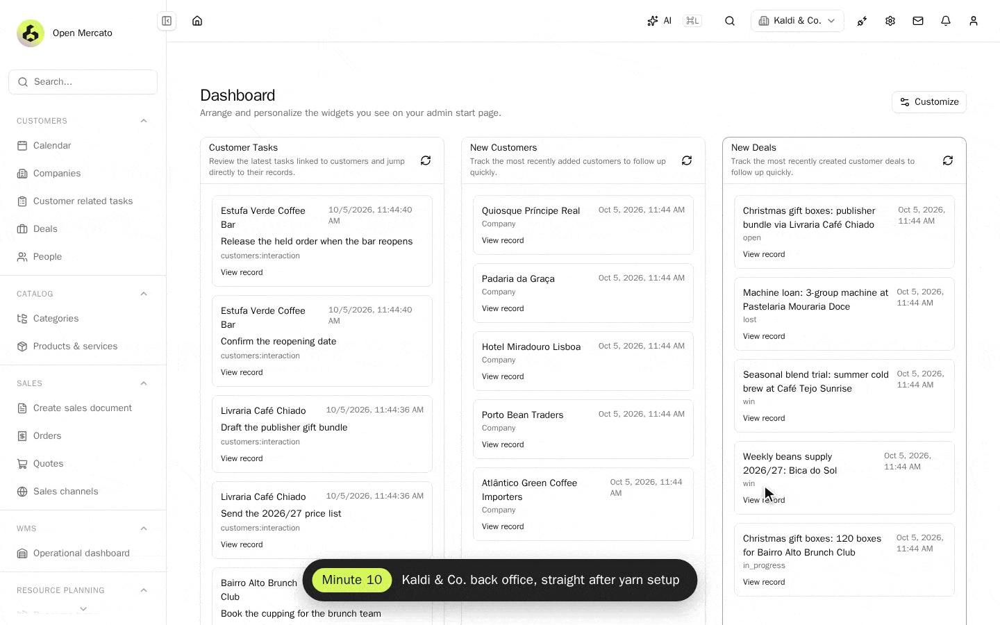
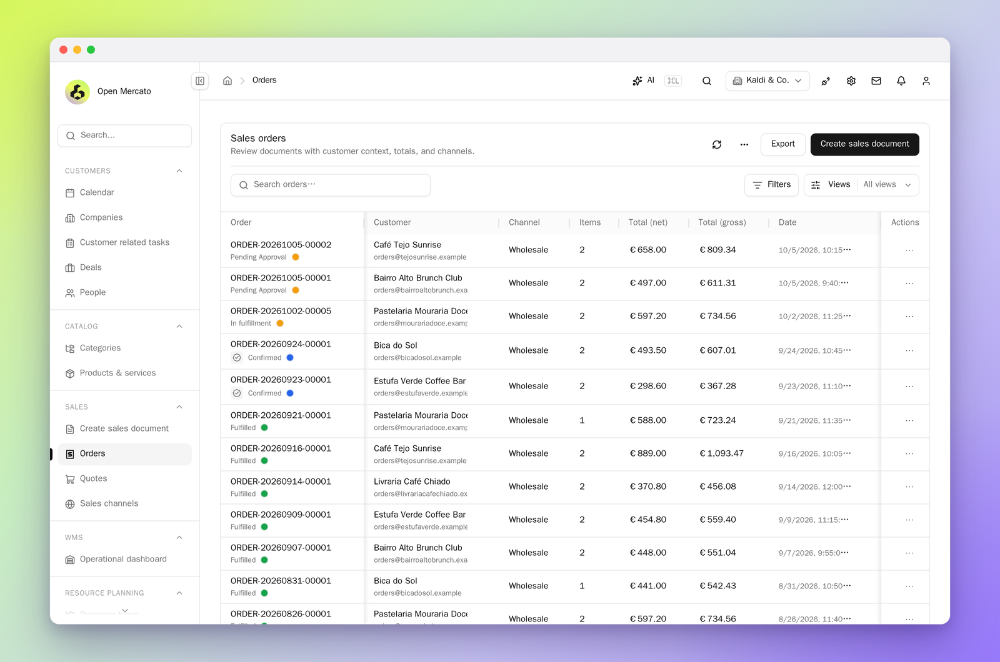
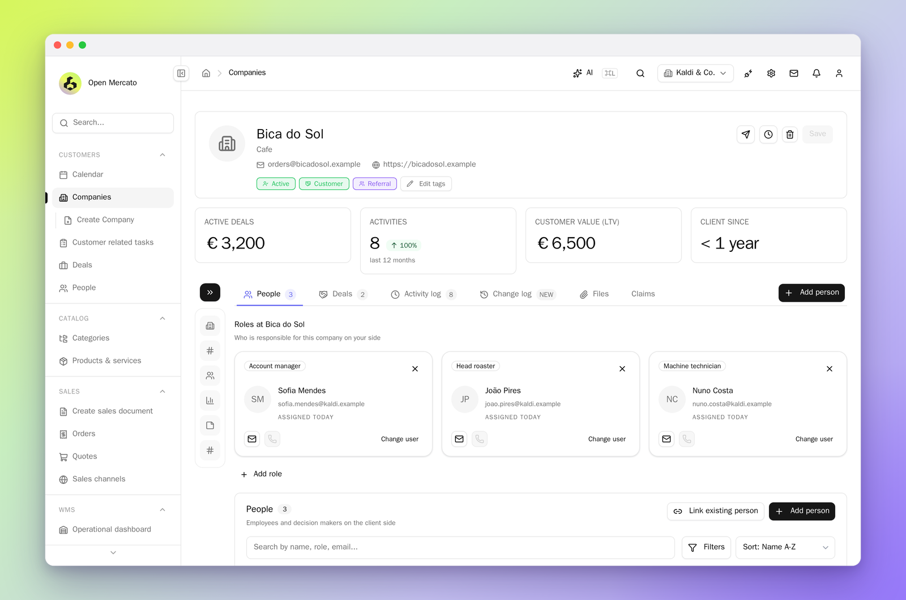
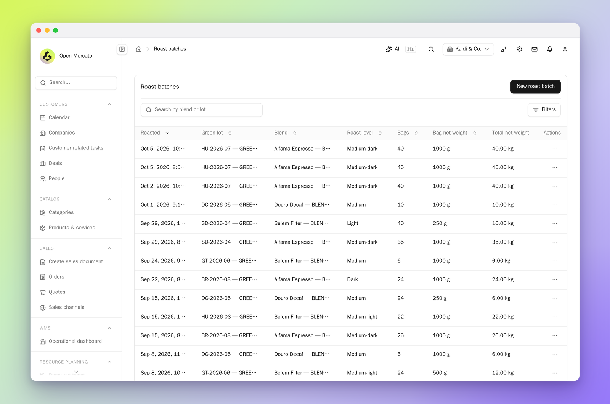
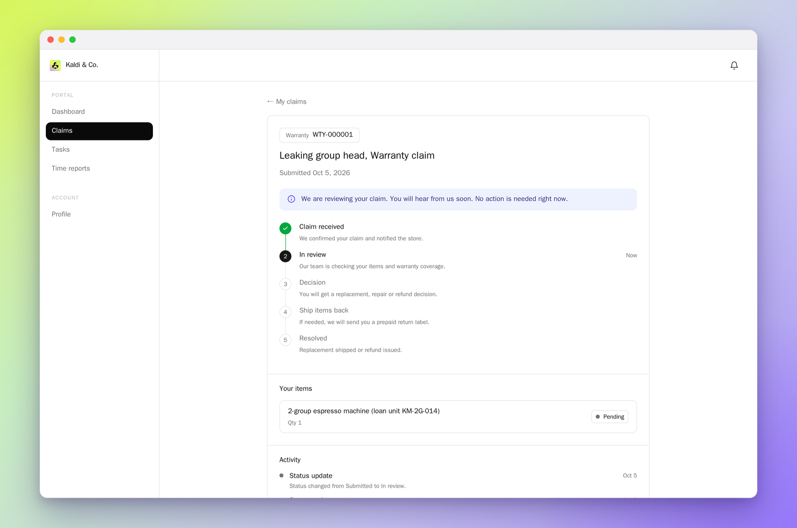
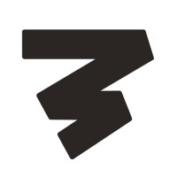

<p align="center"></p>

<h1 align="center">Open Mercato</h1>

<p align="center"><a href="./LICENSE">Open Mercato Core is MIT licensed</a></p>

<p align="center"><strong>Open Mercato - the AI-Engineering Foundation Framework.</strong> Start with 80% done.</p>

Open Mercato is an open-source TypeScript framework on Next.js and PostgreSQL. It ships ready business modules for CRM, ERP, commerce and more, so a new app starts as a working back office. It is built for AI coding agents: Claude Code, Codex and Cursor get the rules and skills that say where code goes, and [Cezar](#run-it-unattended-with-cezar) runs them unattended. It is for teams and developers building business apps and backends, and for business owners who want one.

```bash
npx create-mercato-app my-app
```

**No terminal?** [Open Mercato Cloud](https://openmercatocloud.com/) gives you the same app in the browser, with Claude Code, Codex and Cezar already inside (account required).

**Prefer to delegate?** Paste this line into Claude Code, Codex or Cursor:

```text
Read https://raw.githubusercontent.com/open-mercato/open-mercato/main/README.md and follow it for my project, stage by stage. Stop and ask me at every "You decide" and at every open question.
```

> [!NOTE]
> **For AI coding agents.** To build an app, scaffold it with `npx create-mercato-app <name> --preset <classic|empty|crm|wms> --agents <claude-code|codex|cursor> --init-git` and never clone this repository unless the human wants to change Open Mercato itself. If the request is ambiguous, such as "install this repo", ask that one question first. After scaffolding, the app's own `AGENTS.md` takes over and every task starts with `om-help`. Work one stage at a time: ask the **You decide** question and offer the bold default, do **Run**, confirm every **Done when** box. Stop at every "You decide" and at the spec's Open Questions.

<p align="center"><a href="#get-started">Quick start</a> · <a href="#no-terminal-open-mercato-cloud">Cloud</a> · <a href="#run-it-unattended-with-cezar">Cezar</a> · <a href="https://docs.openmercato.com/">Docs</a> · <a href="#learn-docs-and-videos">Tutorials and videos</a> · <a href="https://discord.gg/f4qwPtJ3qA">Discord</a> · <a href="CONTRIBUTING.md">Contributing</a></p>

<p align="center"></p>
<p align="center"><sub>Kaldi & Co. is a fictional specialty coffee roaster in Lisbon. The screens on this page are from the app built with the four stages below, with the roaster's own demo data loaded through the API.</sub></p>

## What is Open Mercato

AI code assistants generate code. They do not decide where it goes, how it is layered, or whether it stays consistent across 30 or 50 engineers in a team. Open Mercato gives them a foundation that does:

- **Architecture-aware AI harness.** Every app ships an `AGENTS.md` and skills that tell the agent where code, modules, data models and UI belong, how to troubleshoot and how to upgrade, from a data table or a design-system form up to a whole feature with unit and integration tests. The [open-mercato/skills](https://github.com/open-mercato/skills) collection adds code review, ticketing and debugging.
- **Spec-first.** Specs live next to the code in `.ai/specs/` and drive the agent's work: plan, approve, then implement.
- **Start with 80% done.** Dozens of business modules already work together: customers, catalog, sales, warehouse, portal, workflows and more ([what's in the box](#whats-in-the-box)).
- **Unattended when you want it.** Cezar runs the same skills in parallel, on a schedule or on GitHub events, and never merges on its own.
- **No lock-in.** You own the code. The core is MIT with no per-seat licence; enterprise modules are licensed separately.

Built for CTOs and team leads who already rolled out Cursor or Copilot and noticed it is not enough, and for developers who want to build professional business apps and backends without constantly checking their back.

## Get started

Pick your row. Everyone who builds an app goes through the same four stages, and each stage has the same shape: **You decide** (a question with a bold default), **Run** (commands or the exact prompt), **Done when** (checks you can tick), then a screenshot from the Kaldi run. The whole run, from `npx` to a working module with a business rule and a cafe login, took one agent evening: about 2 hours 10 minutes of wall time, the long parts being the first install and the module build.

| You are | Start with | Then |
|---|---|---|
| A business owner without a terminal | [Open Mercato Cloud](#no-terminal-open-mercato-cloud) | the **In the Cloud** line of each stage, or a [Certified Partner Agency](#community-and-support) |
| A developer | [Minute 10](#minute-10-a-running-back-office) in your terminal | Hour 1, Day 1, Month 1 |
| An AI coding agent | the note at the top of this page | every stage in order, stopping at each **You decide** |
| A core contributor | [Change Open Mercato itself](#change-open-mercato-itself) | [CONTRIBUTING.md](CONTRIBUTING.md) |

### No terminal: Open Mercato Cloud

[Open Mercato Cloud](https://openmercatocloud.com/) is a hosted trial workspace (Beta) with the app already initialised. Inside you get:

- the templates **crm**, **classic** or **empty**, demo users, a **View as** role switcher and a live preview;
- VS Code in the browser and a web terminal;
- Claude Code and Codex, on managed credits by default or on your own subscription (`claude auth login --claudeai`, `codex login --device-auth`);
- **Cezar**, preinstalled as the **AI Coding Agent** tab (Beta): the default way to drive the agent here;
- PostgreSQL and Redis. There is no Docker inside, and it is not production hosting.

Keep your work: run `gh auth login` in the web terminal, then use **Create repository** and **Create PR** in the portal, or **Export sandbox** (a tar with your workspace and a database dump). If sign-up says "Email registration is currently closed", you are on the waitlist. Watch the [Open Mercato Cloud tour](https://www.youtube.com/watch?v=0jdlGSlZusI), or follow the [video course for non-developers built on the sandbox (Polish only)](https://help.openmercatocloud.com/pl/).

### Minute 10: a running back office

**You decide:** which starter? **classic** (CRM, catalog, sales, warehouse, portal, demo data) · crm · wms · empty. Which agent? **the one you use**. Git, published to GitHub so agents can open pull requests? **yes, private** · later.

**Run** in a terminal. You need Node.js 24, Yarn through `corepack enable`, and Docker. On Windows use [WSL2](https://docs.openmercato.com/installation/wsl2) and see [Developing on Windows](CONTRIBUTING.md#developing-on-windows). All options: [installation guides](https://docs.openmercato.com/installation).

```bash
node -v && corepack enable && yarn -v && docker info   # preflight: v24.x, Yarn 4.x, Docker answers
npx create-mercato-app my-app --preset classic --agents <agent> --init-git
cd my-app
gh repo create --private --source=. --remote=origin --push   # if you chose GitHub; needs gh 2.82.1+ and jq
cp .env.example .env
docker compose up -d    # PostgreSQL 17 with pgvector, Redis 7, Meilisearch
yarn install            # the docs ask for it before the first setup (#6849)
yarn setup              # migrates, seeds demo data, starts the dev runtime and keeps running
```

`<agent>` is `claude-code`, `codex` or `cursor` (`github-copilot` is experimental). A plain `npx create-mercato-app my-app` asks the same three questions. Without a terminal it silently picks classic, claude-code and no git, so agents always pass the flags and run `yarn setup` in the background. If the preflight fails, offer Open Mercato Cloud instead. Without a GitHub remote, agents report "PR delivery unavailable" and work locally, phase by phase.

**In the Cloud:** [sign in or request access](https://app.openmercatocloud.com/signup) (registration may be closed, see the [waitlist note](#no-terminal-open-mercato-cloud)), create a sandbox from the **classic** template, wait until it shows Running, then click **Open app**.

**Done when**

- [ ] the box "App initialization complete" lists the logins: `admin@acme.com` / `secret`, also `superadmin@acme.com` and `employee@acme.com`
- [ ] you open `http://localhost:3000/backend` and sign in, credentials printed in the terminal (Cloud: **Open app**, then **View as** Admin). Open it as `localhost`, not `127.0.0.1` or the machine's IP: the dev server serves its scripts to `localhost` only, so other hosts get a page that never finishes loading (on a remote box, use an SSH tunnel)
- [ ] for agents: `curl -s -o /dev/null -w '%{http_code}' localhost:3000/login` prints `200` and `.agents/skills/om-help` exists (if not, run `yarn install-skills`)
- [ ] Customers lists demo companies and people, and Sales lists demo orders
- [ ] if you chose GitHub: `git remote -v` shows `origin`

In the Kaldi run this stage took about 11 minutes from `npx` to a working login (2 minutes of that was `yarn install`, 5 minutes `yarn setup`, on an 8-core Linux box with warm caches). Stuck? See [troubleshooting](https://docs.openmercato.com/appendix/troubleshooting).

<picture><source media="(prefers-color-scheme: dark)" srcset="./.github/readme/kaldi-orders-dark.png" /></picture>

<details>
<summary>Install guides per operating system, Docker and Dev Container</summary>

- Standalone app: [macOS](https://docs.openmercato.com/installation/standalone#macos) · [Linux](https://docs.openmercato.com/installation/standalone#linux) · [Windows](https://docs.openmercato.com/installation/standalone#windows), with the video [Building a standalone app on Linux and macOS](https://www.youtube.com/watch?v=uJn42SLVyI0)
- Monorepo, for core contributors: [macOS](https://docs.openmercato.com/installation/monorepo#macos) · [Linux](https://docs.openmercato.com/installation/monorepo#linux) · [Windows](https://docs.openmercato.com/installation/monorepo#windows)
- Windows: [WSL2 guide](https://docs.openmercato.com/installation/wsl2), [Developing on Windows](CONTRIBUTING.md#developing-on-windows) and the video [How to set up Open Mercato on Windows](https://www.youtube.com/watch?v=eX1SqfDPhkU)
- [Docker dev setup](https://docs.openmercato.com/installation/docker): hot reload, no local toolchain
- [Dev Container](https://docs.openmercato.com/installation/devcontainer): a VS Code environment, 12 GB RAM recommended

</details>

## Run it unattended with Cezar

Your app is running. Before you build on it, meet the tool that can do the building while you are away. [Cezar](https://github.com/open-mercato/cezar) is an open-source (MIT) orchestrator that runs coding agents as unattended tasks, with a live stream of every run. It works with seven agent CLIs: **Claude Code, Codex, GitHub Copilot CLI, Cursor Agent, OpenCode, Junie and pi**. It runs the om-* skills in parallel, on a schedule or on GitHub events; nothing merges on its own.

```bash
npx cezar-run                                        # cockpit at `http://localhost:4321`
npx cezar-run run "<task>"                           # one task, headless
npx cezar-run server-install --platform ubuntu-vps   # always on, 24/7 (or --platform macosx-ngrok)
```

- **What it does:** locally each task runs in its own git worktree. Automations start tasks on a schedule, when a GitHub PR is opened, on reviews or issues, or from Jira and Linear, and a task can spawn child tasks.
- **What it needs:** Node.js 20+ and one agent CLI that is already logged in. `git` and `gh` are optional; you need them for pull requests and the GitHub tab.
- **Where it runs:** in any repository (it is not specific to Open Mercato), on your laptop, on a server, or in Open Mercato Cloud as the **AI Coding Agent** tab (Beta).

You will hand it real work in [Month 1](#month-1-unattended-work-with-cezar-upgrades-production). See it first in the [Cezar demo video](https://www.youtube.com/watch?v=nNLJm9gArnE).

## Build the missing 20% with your agent

**Buy vs. build?** Now, you can have best of both. Use **Open Mercato** enterprise-ready business features like CRM, Sales, OMS, Encryption, and build the remaining **20&percnt;** that really makes the difference for your business. [Watch: Start with 80% done](https://www.youtube.com/watch?v=53jsDjAXXhQ)

Your app already knows how it is built. Start every task with **om-help**: `/om-help` in Claude Code, `$om-help` in Codex, or the sentence `Use om-help: <task>` in any agent. It only routes: it returns the ordered list of guides and skills, why each one is needed, the delivery shape and the smallest set of checks. It never writes code, plans your business or loads data.

### Hour 1: a route and a spec

**You decide:** what does your business need that the demo does not do? **Use the Kaldi & Co. example as it is** to see the flow, or describe your own business in two or three sentences. Kaldi's answer: "We buy green-coffee lots and roast three blends, Alfama Espresso, Belem Filter and Douro Decaf. We sell wholesale to about 40 cafes that order weekly. We lend espresso machines and send technicians, and every lot needs origin evidence under the EU deforestation rules."

**Run:** paste this into your agent.

```text
Use om-help: <your sentences>. Tell me which guides and skills this needs. Then write a spec with om-spec-writing for the first slice and stop at Open Questions. No code yet.
```

**In the Cloud:** open the **AI Coding Agent** tab and start a task with the same prompt, or run `claude` (or `codex`) in the web terminal and paste it there.

**Done when**

- [ ] om-help returned the ordered guides and skills and the checks to run (about 3 minutes in the Kaldi run)
- [ ] a spec exists at `.ai/specs/<date>-<slug>.md` (about 10 minutes)
- [ ] you answered every Open Question; the agent waits there until you do

In the Kaldi run, the om-help route plus the spec work mapped the business like this:

| Kaldi needs | Already in the box |
|---|---|
| Green-coffee lots and stock | Warehouse (wms) and Catalog |
| Suppliers and cafes | Customers |
| Three blends | Catalog |
| Weekly wholesale orders | Sales, plus the customer portal and customer accounts |
| Technicians | Staff and Planner (partial: no dispatch) |
| Machine repairs | Warranty claims (partial: not field service) |
| Origin evidence for every lot | EUDR |
| Purchasing and receiving, standing weekly orders, machine loans and service visits, a lot-to-evidence gate | Not yet (missing in the run) |
| **Roast batches: lot in, profile, bags out** | **Nothing. This is your 20%.** |

<picture><source media="(prefers-color-scheme: dark)" srcset="./.github/readme/kaldi-customers-dark.png" /></picture>

### Day 1: the missing 20% as a module

**You decide:** read the spec. **Approve it** · change it. Where should the work land? **locally, phase by phase** · as a pull request. If the spec still lists open questions, the agent refuses to build and asks you to answer them; "use the recommended defaults" is a valid answer.

**Run:** paste this into your agent.

```text
Implement the approved spec with om-implement-spec, phase by phase. Show me the SQL from yarn db:generate and ask me before yarn db:migrate. Then run the full check.
```

As a pull request instead: `/om-auto-implement-spec .ai/specs/<date>-<slug>.md` opens its own PR (needs the GitHub remote from Minute 10). Either way, this is what the agent runs, so you can follow along:

```bash
# creates src/modules/roast_batches/ and adds to src/modules.ts:
#   enabledModules.push({ id: 'roast_batches', from: '@app' })
yarn generate
yarn db:generate                    # writes the migration: review the SQL, the agent asks you
yarn db:migrate                     # only after your yes
yarn mercato auth sync-role-acls    # without it, even admin does not see the new page
# then stop and start `yarn dev` once: the running dev runtime does not pick up a new entity,
# and the new API answers 500 until it restarts (the menu entry can take up to 5 minutes, the role cache)
yarn generate && yarn typecheck && yarn lint && yarn ds:check && yarn test && yarn build
yarn test:integration:ephemeral     # integration tests, needs Docker
```

**In the Cloud:** the same prompt in the **AI Coding Agent** tab or the web terminal. PostgreSQL and Redis already run, so there is nothing to start, and the new page appears in the live preview.

> [!IMPORTANT]
> **Rules for agents in an app.** Never edit `node_modules` or `.mercato/generated/**`. Never run `yarn db:greenfield`, `yarn reinstall` or `yarn setup --reinstall` without asking. Ask before `yarn db:migrate`. Follow the app's `AGENTS.md`.

**Done when**

- [ ] **Roast batches** is in the admin menu with a list and a detail page
- [ ] its REST API appears under `/backend/docs` (served from `/api/docs/openapi`) and is guarded by the new permissions
- [ ] the full check above exits 0 (about 45 minutes in the Kaldi run, from approved spec to green module tests, including the restart above). In a fresh 0.8.0 app `yarn typecheck` reports errors in `src/modules/agent_examples`, which are not yours (fixed on `develop`, waiting for the next `create-mercato-app` release, see [#6321](https://github.com/open-mercato/open-mercato/issues/6321)); the module tests and build still pass

<picture><source media="(prefers-color-scheme: dark)" srcset="./.github/readme/kaldi-batches-dark.png" /></picture>

### Month 1: unattended work with Cezar, upgrades, production

**You decide:** what runs without you? **a review of every new pull request** · issues to pull requests · nothing yet. Where does production run? **Railway** · a VPS. Never in the Cloud sandbox.

**Run**

1. Finish the first slice with your agent:

   ```text
   Use om-help: add a business rule "Roasted stock below 20 kg: notify the head roaster" and give one cafe a login to the customer portal.
   ```

2. Hand the backlog to Cezar: run `npx cezar-run` in the app root and create one task per item, typed as you would to your agent: `/om-auto-fix-issue 123` (issue to PR), `/om-auto-create-pr "<brief>"` (one change as a PR), `/om-auto-review-pr <PR>` (review), `/om-auto-qa-pr <PR>` (QA in a browser). Add an automation that starts a review task when a GitHub PR is opened. For 24/7, use `npx cezar-run server-install --platform ubuntu-vps`. Filing issues from a plain description and the feature route of `/om-auto-fix-issue` without an existing spec need `yarn install-skills --with automation`.
3. You merge: read the PR, then `gh pr merge <number>`. Cezar and the skills your app ships never merge.
4. Upgrade:

   ```bash
   yarn up '@open-mercato/*' && yarn generate && yarn db:migrate   # agents ask before migrating
   yarn install-skills --update                                    # refresh the pinned skills
   yarn mercato agentic:init --update-harness                      # refresh the agent harness
   ```

   For a version jump, use the matching `om-auto-upgrade-<from>-to-<to>` skill (opt-in; `yarn install-skills --list` shows the tiers).
5. Ship: `yarn mercato deploy railway --dry-run`, then `yarn mercato deploy railway` (needs a Railway account token; the deploy checks `/api/healthz`; [Railway guide](https://docs.openmercato.com/deployment/railway)), or follow the [VPS guide](https://docs.openmercato.com/installation/vps).

**In the Cloud:** steps 1 and 2 run in the **AI Coding Agent** tab. For production, move the work out first with **Create repository** or **Export sandbox**, then deploy from the repository with steps 4 and 5.

**Done when**

- [ ] the rule is listed under Business rules and the cafe signs in to the portal, where it sees its own claims and tasks (about 3 minutes in the Kaldi run)
- [ ] Cezar shows each task with its pull request, and you merged only what you reviewed
- [ ] after an upgrade, the full check from Day 1 is green again
- [ ] your production domain answers

<picture><source media="(prefers-color-scheme: dark)" srcset="./.github/readme/kaldi-portal-dark.png" /></picture>

## Change Open Mercato itself

Only core contributors clone this repository. To build a product, use `npx create-mercato-app` above.

**You decide:** does the change touch `packages/enterprise/`? **No, it stays outside** · yes (stop: that folder is closed to external authors, the Enterprise Contribution Guard).

**Run** (plan for about 20 GB of disk and 16 GB of RAM):

```bash
git clone https://github.com/open-mercato/open-mercato.git && cd open-mercato && git checkout develop
npx @open-mercato/starter    # or `yarn om` inside the clone; manual steps are in CONTRIBUTING.md
yarn install-skills          # optional: this repo's local skills plus the shared collection
```

**Done when**

- [ ] `http://localhost:3000/backend` answers from the clone
- [ ] your branch starts from `develop` and your pull request targets `develop`

Manual setup, multiple local instances, watch scope, release channels, package previews and the spec process live in [CONTRIBUTING.md](CONTRIBUTING.md). Cezar works in the clone too: `npx cezar-run`.

## What's in the box

**Use cases**

- **Commerce:** B2B ordering portals, CPQ and quotes, commerce backends.
- **Headless backend:** use Open Mercato as a ready-made business backend with a fully custom frontend, through generated REST APIs with OpenAPI docs ([API reference](https://docs.openmercato.com/api/overview)).
- **CRM:** customers, deals and pipelines, flexible custom fields.
- **ERP:** orders, inventory (WMS), staff, resources and service delivery.
- **Self-service portals** for customers and partners, and **workflows** for custom data lifecycles per tenant or team.

**Modules in a classic app:** customers; catalog (products, variants, prices, offers); sales (channels, quotes, orders, invoices, shipments, payments); warehouse (locations, inventory lots, movements); customer accounts and portal; shipping carriers; notifications; staff (teams, members, time entries); planner (availability); resources (bookable capacity); warranty claims; EUDR due diligence; business rules; workflows; dashboards; attachments; documents; audit logs; translations; API keys and API docs. There is no manufacturing or purchasing module: that is the kind of 20% your agent builds. See the [module overview](https://docs.openmercato.com/framework/modules/overview).

**Highlights:** modules are auto-discovered and can be overridden without forking; custom entities and fields are managed live from the admin; multi-tenancy with organization trees; feature-based RBAC per role and per user; hybrid JSONB indexing and caching across base and custom fields; domain events with persistent subscribers, local or on Redis. **Stack:** Next.js (App Router), TypeScript, PostgreSQL, MikroORM, zod and Awilix.

**Architecture:** a module in `src/modules/<id>` bundles pages, APIs, CLI commands, translations and entities, and is auto-discovered. MikroORM keeps per-module entities and migrations, with no global schema. An Awilix DI container is built per request, and a module's `di.ts` registers or overrides services. Entities carry `tenant_id` and `organization_id`. Security comes as outcomes: role-based access per route and API, validated input, hashed passwords, JWT sessions and an audit log. Read the [Open Mercato architecture overview](https://docs.openmercato.com/architecture/system-overview).

**AI assistant:** focused assistants open inside the admin pages, scoped by module, permissions and tool allowlists, and every write is staged behind an approval card before data changes. Use the global launcher or embed `<AiChat>` in module pages; operators tune prompts, downgrade mutation policies and disable tools per tenant without redeploying. Read the [AI assistant overview](https://docs.openmercato.com/framework/ai-assistant/overview) and the [MCP server guide](https://docs.openmercato.com/framework/ai-assistant/mcp).

**Encryption:** tenant-scoped, field-level encryption that stays transparent to CRUD and APIs. Admins choose which system and custom columns are encrypted, and deterministic hashes keep lookups working. Read the [encryption guide](https://docs.openmercato.com/user-guide/encryption).

**Custom CLI and official modules:** modules can expose their own commands as `yarn mercato <module> <command>` ([CLI reference](https://docs.openmercato.com/cli/overview)). [Official modules](https://docs.openmercato.com/framework/modules/official-modules) add features without forking, and `yarn mercato eject --list` shows the modules you can copy into your app and own fully.

**Agent skills:** a new app ships 15 local skills from Open Mercato and 15 delivery skills from [open-mercato/skills](https://github.com/open-mercato/skills), pinned to a commit and installed for Claude Code, Codex or Cursor. The full collection is stack-agnostic and covers spec writing, autonomous PR creation, code review, CI stabilization, integration testing and merge management, and the om-* skills are moving there.

- In an app: `yarn install-skills --list` shows the tiers, `--with automation` adds the opt-in tier, `--update` refreshes the pin.
- In any other repository: `npx skills add open-mercato/skills --skill '*'`, then run the collection's one-time pipeline setup skill, as [its README](https://github.com/open-mercato/skills) describes.
- In this monorepo: `yarn install-skills`.

## Learn: docs and videos

**Docs** at [docs.openmercato.com](https://docs.openmercato.com/): [Installation](https://docs.openmercato.com/installation) · [Standalone app](https://docs.openmercato.com/installation/standalone) · [User guide](https://docs.openmercato.com/user-guide/overview) · [First app tutorial](https://docs.openmercato.com/tutorials/first-app) · [Customizing a standalone app](https://docs.openmercato.com/customization/standalone-app) · [Architecture](https://docs.openmercato.com/architecture/system-overview) · [Modules](https://docs.openmercato.com/framework/modules/overview) · [API reference](https://docs.openmercato.com/api/overview) · [CLI reference](https://docs.openmercato.com/cli/overview) · [Troubleshooting](https://docs.openmercato.com/appendix/troubleshooting). The docs do not cover Open Mercato Cloud, Cezar or the skills pipeline yet; this page does.

**Videos** on the [Open Mercato YouTube channel](https://www.youtube.com/@openmercato):

- [Start with 80% done with Open Mercato](https://www.youtube.com/watch?v=53jsDjAXXhQ) · [Building an app from scratch using autonomous skills](https://www.youtube.com/watch?v=y-lxRrAzbYc) · [Building a landing page with a custom, encrypted admin panel](https://www.youtube.com/watch?v=fb47pmH6ojE)
- [Building a standalone app on Linux and macOS](https://www.youtube.com/watch?v=uJn42SLVyI0) · [How to set up Open Mercato on Windows](https://www.youtube.com/watch?v=eX1SqfDPhkU) · [Open Mercato Cloud tour](https://www.youtube.com/watch?v=0jdlGSlZusI) · [Cezar demo](https://www.youtube.com/watch?v=nNLJm9gArnE)
- For non-developers: [Free video course for non-developers, built on Open Mercato Cloud (in Polish)](https://help.openmercatocloud.com/pl/)

## Community and support

- **Discord:** talk to the team and other builders on the [Open Mercato Discord](https://discord.gg/f4qwPtJ3qA).
- **Contributing:** contributions of all sizes are welcome, from fixes and docs to new modules. Read [CONTRIBUTING.md](CONTRIBUTING.md), open pull requests against the `develop` branch, and use [Issues](https://github.com/open-mercato/open-mercato/issues) or [Discussions](https://github.com/open-mercato/open-mercato/discussions). Refer to [AGENTS.md](AGENTS.md) for deeper guidance on architecture and conventions when extending modules.
- **Hall of Fame:** meet the [Open Mercato Agentic Hackathon champions](COMMUNITY.md#hall-of-fame).
- **Planning a project?** Do not go it alone: write to [info@openmercato.com](mailto:info@openmercato.com) and we will connect you with one of our **Certified Partner Agencies**. Our Partnership Program certifies software consultancies that actively use and contribute to Open Mercato.

**Supported by** [Blacksmith](https://www.blacksmith.sh/), whose GitHub Actions runners power Open Mercato's continuous integration, and by Catch The Tornado:

<a href="https://catchthetornado.com/"></a><br />
Open Mercato is proudly supported by [Catch The Tornado](https://catchthetornado.com/).

## License and enterprise

Open Mercato Core is and always will be MIT Licensed, fully Open Source. See [LICENSE](LICENSE).

Enterprise features ship in `@open-mercato/enterprise` ([packages/enterprise](packages/enterprise/README.md)) under a [commercial license](packages/enterprise/LICENSE.md) outside the MIT open-source scope; the **Enterprise Subscription** is described in the [enterprise README](packages/enterprise/README.md). Contact us to get support for your implementation: [info@openmercato.com](mailto:info@openmercato.com)
