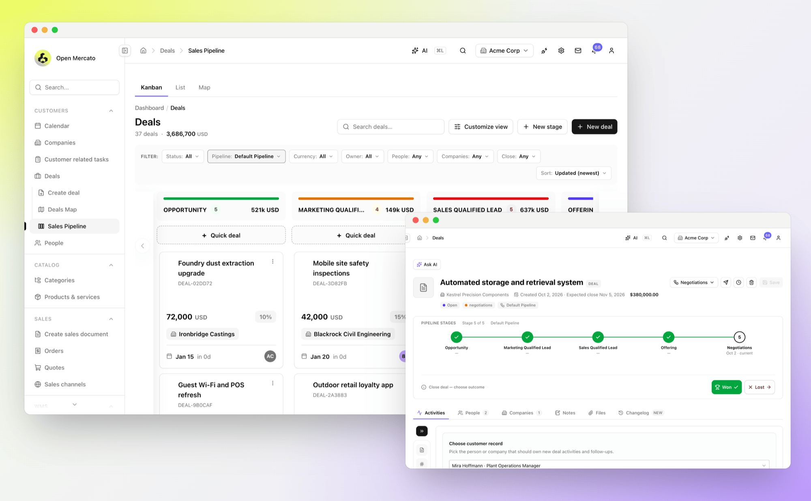
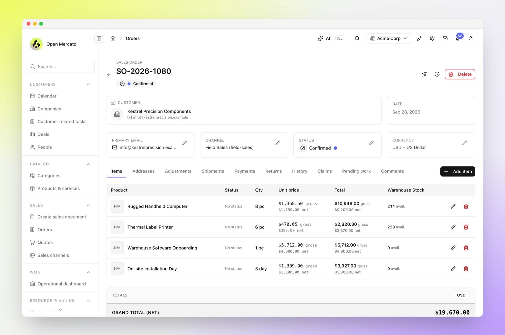
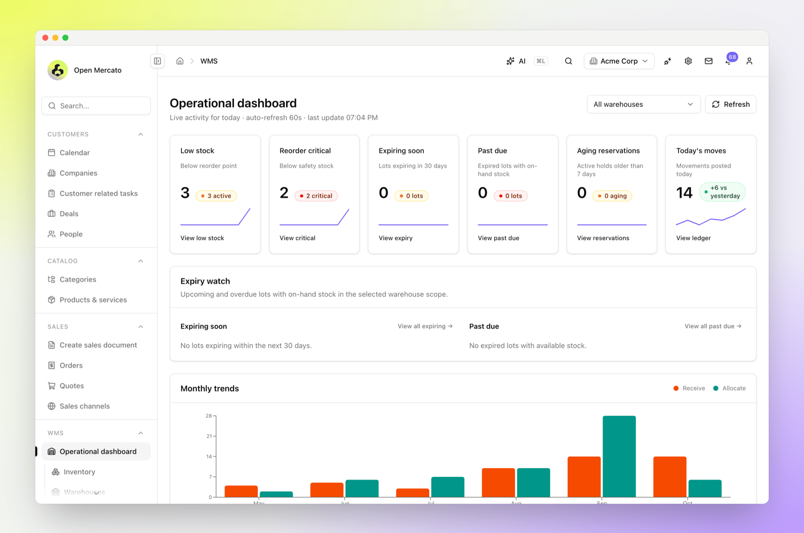
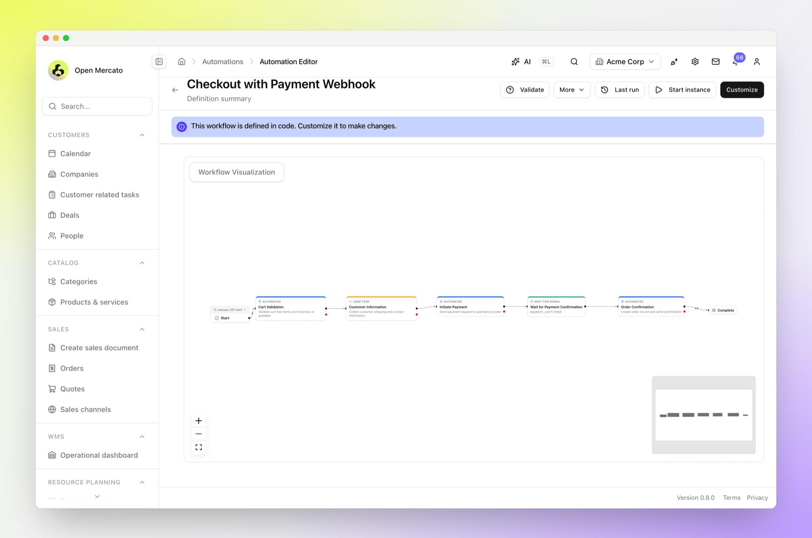
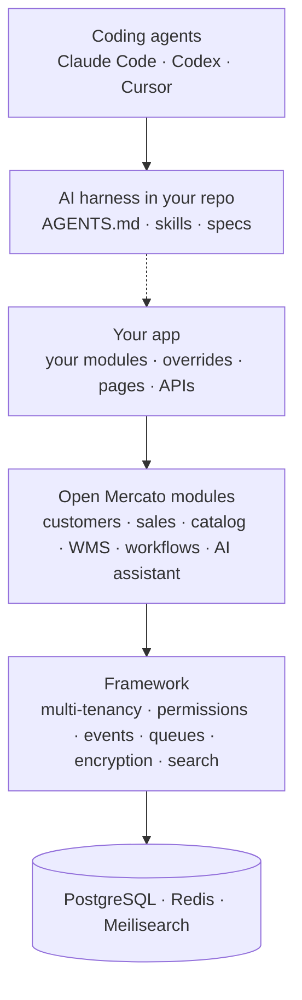

<p align="center">
  
</p>

<h1 align="center">Open Mercato</h1>

<p align="center">
  <strong>The open-source foundation for business software.</strong><br />
  A TypeScript framework with ready CRM, ERP and commerce modules, built for AI coding agents.<br />
  Start with 80% done. Build the rest with your agents.
</p>

<p align="center">
  <a href="#get-started">Quick start</a> ·
  <a href="https://docs.openmercato.com/">Docs</a> ·
  <a href="https://www.youtube.com/@openmercato">Videos</a> ·
  <a href="https://discord.gg/f4qwPtJ3qA">Discord</a> ·
  <a href="CONTRIBUTING.md">Contributing</a>
</p>

<p align="center">
  <a href="https://www.npmjs.com/package/create-mercato-app"></a>
  <a href="https://github.com/open-mercato/open-mercato/stargazers"></a>
  <a href="https://github.com/open-mercato/open-mercato/graphs/contributors"></a>
  <a href="LICENSE"></a>
</p>

```bash
npx create-mercato-app my-app
cd my-app && docker compose up -d && yarn install && yarn setup
```

Then open `http://localhost:3000/backend`. You need Node.js 24, Docker and Yarn (`corepack enable`). [Step by step](#build-your-own-app).

> [!NOTE]
> **For AI coding agents:** to build an app on Open Mercato, scaffold it with `npx create-mercato-app <name>` and do not clone this repository; then use the `om-help` skill in the new app to plan the work. Clone this repository only to change Open Mercato itself. If the request is ambiguous (for example "install this repo"), ask the user which one they mean.

<picture>
  <source media="(prefers-color-scheme: dark)" srcset="./.github/readme/hero-dark.png" />
  
</picture>

## What is Open Mercato?

Open Mercato is the AI-Engineering Foundation Framework: a TypeScript framework with ready business modules. You get customers, sales, catalog, warehouse, workflows, a customer portal and an AI assistant (bring your own LLM key) on day one, then add the part that makes your business different. Build a CRM, order management, a B2B portal, booking and scheduling, or the back office of a clinic, a warehouse or a service company.

- **Ready modules, not a blank page.** 40+ modules for customers, sales, catalog, warehouse, workflows and more are the "80% done". You write the part that is specific to your business.
- **Your code stays yours.** Your app is a normal repository. Open Mercato comes in as npm packages you can upgrade, and you extend or override any module without forking.
- **Made for AI coding agents.** Every new app ships with `AGENTS.md`, skills and a spec workflow, so Claude Code, Codex or Cursor put code where it belongs and follow one set of conventions.
- **Multi-tenant and secure by default.** Tenants and organization trees, role- and feature-based permissions, an audit log and field-level encryption.
- **Open source, MIT.** Next.js, PostgreSQL and MikroORM, with optional Redis and Meilisearch. Self-hosting costs only your infrastructure.

**Buy vs. build?** Now, you can have best of both. Use **Open Mercato** enterprise-ready business features like CRM, Sales, OMS, Encryption, and build the remaining **20%** that really makes the difference for your business.

▶️ [Watch: Start with 80% done](https://www.youtube.com/watch?v=53jsDjAXXhQ) (17 min)

### Is it for you?

| | Off-the-shelf SaaS | Build from scratch | Open Mercato |
|---|---|---|---|
| Fits your processes | You adapt to the tool | Fully | Fully |
| Business features on day one | Yes | No | Yes, 40+ modules |
| You own the code and data | No | Yes | Yes |
| License cost | Per seat | None | None for the MIT core |

**A good fit** when you need software shaped around how your business works, want to own the code and data, and have developers or an agency (with or without AI agents) to build the remaining part. **Not a fit** when an off-the-shelf product already covers your needs, or when you want a finished app without any development.

**Not a developer?** Follow the [video course](https://help.openmercatocloud.com/pl/) (in Polish), or ask [info@openmercato.com](mailto:info@openmercato.com) to introduce you to a partner agency.

**Project status:** Open Mercato is before 1.0. New releases ship every few weeks with [upgrade notes](UPGRADE_NOTES.md) and an `om-auto-upgrade-*` skill for your coding agent, and a release can include breaking changes. See the [changelog](CHANGELOG.md). More than 100 contributors and 20+ partner agencies build on it.

## Get started

### Build your own app

You need [Node.js 24](https://nodejs.org/en/download) (for example `nvm install 24`), Yarn through `corepack enable`, and Docker. On Windows, use [WSL2](https://docs.openmercato.com/installation/wsl2).

```bash
npx create-mercato-app my-app
cd my-app
docker compose up -d   # PostgreSQL, Redis, Meilisearch
yarn install
yarn setup             # migrates the database, adds demo data, starts the app
```

Open `http://localhost:3000/backend` and sign in with the login printed at the end of `yarn setup`. The first start compiles the app and takes a few minutes; 16 GB of RAM is recommended.

The wizard asks which AI coding tool you use and sets up its skills. Then ask your agent something like *"Use om-help. I want to build an app for…"*: the **`om-help`** skill maps what you want to the right guides and skills. More options: [installation guide](https://docs.openmercato.com/installation/standalone).

### Try it in the cloud

Prefer not to install anything? Start a sandbox on [Open Mercato Cloud](https://openmercatocloud.com/): a working app with demo data, plus Claude Code, Codex and VS Code in the browser. Free trial.

### Change Open Mercato itself

New contributors are welcome: docs, tests, translations, bug fixes and modules. The framework and core modules live in this monorepo; [CONTRIBUTING.md](CONTRIBUTING.md) covers the setup and the pull request rules, and [Discord](https://discord.gg/f4qwPtJ3qA) is the place to ask. Working with an AI agent here? Run `yarn install-skills` after cloning.

## See it in action

<p align="center">
  
</p>

<table>
  <tr>
    <td width="33%" align="center">
      <picture>
        <source media="(prefers-color-scheme: dark)" srcset="./.github/readme/orders-dark.png" />
        
      </picture>
      <br /><sub>Orders and quotes</sub>
    </td>
    <td width="33%" align="center">
      <picture>
        <source media="(prefers-color-scheme: dark)" srcset="./.github/readme/warehouse-dark.png" />
        
      </picture>
      <br /><sub>Warehouse</sub>
    </td>
    <td width="33%" align="center">
      <picture>
        <source media="(prefers-color-scheme: dark)" srcset="./.github/readme/workflow-dark.png" />
        
      </picture>
      <br /><sub>Workflows</sub>
    </td>
  </tr>
</table>

## What's in the box

| Area | Modules |
|---|---|
| Customers and sales | Customers (people, companies, deals, activities) · Sales (quotes, orders, fulfillment, billing) · Catalog (products, variants, pricing) · Checkout and pay links · Payments (Stripe) · Shipping carriers · Currencies |
| Self-service | Customer portal · Customer accounts |
| Operations | Warehouse (WMS) · Staff and teams · Resources and scheduling · Availability planner · Warranty and returns · EUDR compliance |
| Communication | Messages · Email channels (Gmail, IMAP, Resend, SES) · Push (APNs, FCM, Expo) · Notifications · Phone calls · Collaborative documents |
| Automation | Workflows · Business rules · Scheduled jobs · Events · Webhooks · Feature toggles |
| AI | AI assistant with MCP tools and approval before changes · Email-to-ERP agent |
| Data and integrations | Custom entities and fields · CSV import · Data sync · Akeneo PIM · API keys · Generated API docs · Full-text and vector search |
| Platform | Multi-tenant organizations · Roles and permissions · Audit log · Field-level encryption · Attachments · Translations · Dashboards |

Connect existing systems such as an ERP or accounting tool through the REST API (with generated OpenAPI docs), webhooks, data sync and CSV import. Add official modules with `yarn mercato module add @open-mercato/<name>`, or eject a module into your app to own its source (`yarn mercato eject --list`). See [modules](https://docs.openmercato.com/framework/modules/overview).

## How it works


```mermaid
flowchart TB
  agents["Coding agents<br/>Claude Code · Codex · Cursor"] --> harness["AI harness in your repo<br/>AGENTS.md · skills · specs"]
  harness -.-> app
  app["Your app<br/>your modules · overrides · pages · APIs"] --> modules["Open Mercato modules<br/>customers · sales · catalog · WMS · workflows · AI assistant"]
  modules --> framework["Framework<br/>multi-tenancy · permissions · events · queues · encryption · search"]
  framework --> infra[("PostgreSQL · Redis · Meilisearch")]
```

Your own code goes into modules in `src/modules/<id>/`, and the framework discovers each part automatically:

```text
src/modules/bookings/
  index.ts           module metadata
  data/entities.ts   database entities (MikroORM)
  api/               REST endpoints with OpenAPI
  backend/           admin pages
  acl.ts             permissions
  events.ts          events the module publishes
  i18n/              translations
```

A new app includes an example module to start from. Read the [architecture overview](https://docs.openmercato.com/architecture/system-overview) and the [first app tutorial](https://docs.openmercato.com/tutorials/first-app).

## Build with AI agents

A coding agent on a blank Next.js app has to invent multi-tenancy, permissions, an audit log, encryption and a place for every file. In an Open Mercato app those decisions are made and written down for the agent:

- **`AGENTS.md` with the rules:** where modules and entities go, tenant and organization scoping that fails closed, OpenAPI metadata on every route, no cross-module ORM relations, a spec before any new capability, and asking before migrations or credentials.
- **Skills for the work itself:** start with `om-help`; skills cover modules, data models, admin UI, troubleshooting and upgrades. Set up for Claude Code, Codex, Cursor or GitHub Copilot (the wizard asks, or pass `--agents`).
- **Skills for any repository:** spec writing, autonomous PRs, code review and CI fixes, on any stack: `npx skills add open-mercato/skills --skill '*'`. See how we use them here in [`AGENTS.md`](AGENTS.md).
- **Inside the product:** the [AI assistant](https://docs.openmercato.com/framework/ai-assistant/overview) (needs an LLM API key) works in the admin within the user's permissions, stages changes on an approval card before data is saved, and exposes tools over [MCP](https://docs.openmercato.com/framework/ai-assistant/mcp).
- **Many agents at once:** [Cezar](https://github.com/open-mercato/cezar), our open-source cockpit, runs Claude Code, Codex, GitHub Copilot CLI, Cursor CLI, Junie, OpenCode, pi and more in parallel, each task in its own git worktree, and nothing merges on its own. Run `npx cezar-run` inside a repository. [Watch the demo](https://www.youtube.com/watch?v=nNLJm9gArnE).

## Learn

| | |
|---|---|
| First app | [Tutorial](https://docs.openmercato.com/tutorials/first-app) · [Standalone app guide](https://docs.openmercato.com/customization/standalone-app) |
| Not a developer | [Build your own ERP with AI, no coding skills needed](https://help.openmercatocloud.com/pl/) (video course, in Polish) |
| Reference | [Architecture](https://docs.openmercato.com/architecture/system-overview) · [API](https://docs.openmercato.com/api/overview) · [CLI](https://docs.openmercato.com/cli/overview) · [User guide](https://docs.openmercato.com/user-guide/overview) |
| Run in production | [VPS](https://docs.openmercato.com/installation/vps) · [Docker](https://docs.openmercato.com/installation/docker) · [Railway](https://docs.openmercato.com/deployment/railway) |
| Videos | [YouTube channel](https://www.youtube.com/@openmercato) |

## Open source and Enterprise

Open Mercato Core is and always will be MIT licensed. Some features for larger organizations are available under a commercial [Enterprise license](packages/enterprise/README.md).

## Community

- **Questions and ideas:** [Discord](https://discord.gg/f4qwPtJ3qA) and [GitHub Discussions](https://github.com/open-mercato/open-mercato/discussions).
- **Contributing:** read [CONTRIBUTING.md](CONTRIBUTING.md). Pull requests go to the `develop` branch.
- **Planning a project?** 20+ certified partner agencies build on Open Mercato. Write to [info@openmercato.com](mailto:info@openmercato.com) to be introduced.
- **Security:** report vulnerabilities privately to [security@openmercato.com](mailto:security@openmercato.com), not in public issues. See [SECURITY.md](SECURITY.md).
- **Hackathon champions:** see the [Hall of Fame](COMMUNITY.md#hall-of-fame).

## Supported by

<a href="https://www.blacksmith.sh/"><picture><source media="(prefers-color-scheme: dark)" srcset="https://raw.githubusercontent.com/useblacksmith/stickydisk/main/wordmark-white.svg" /></picture></a>
&nbsp;&nbsp;&nbsp;
<a href="https://catchthetornado.com/"></a>

CI runs on [Blacksmith](https://www.blacksmith.sh/) runners. Open Mercato is supported by [Catch The Tornado](https://catchthetornado.com/).

## License

MIT, see [LICENSE](LICENSE). The `packages/enterprise` package has its own [commercial license](packages/enterprise/LICENSE.md).
