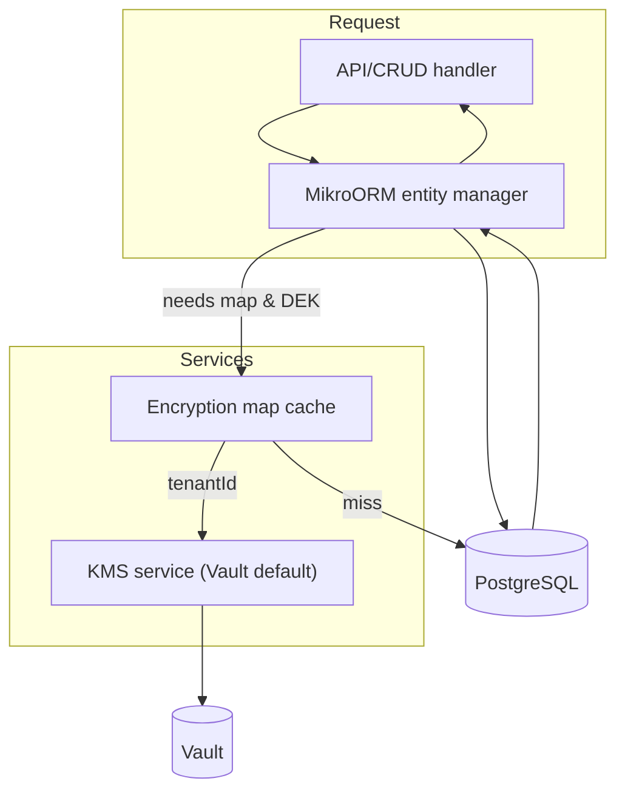

This document outlines the data-encryption architecture so module owners can wire it into MikroORM, custom-entity definitions, and the admin UI without breaking isomorphism. It follows the classic KMS + DEK split and keeps multi-tenant isolation as the primary constraint.

## Goals

- Encrypt tenant-scoped data at rest using AES-GCM with per-tenant data-encryption keys (DEKs).
- Let admins choose which system and custom-entity fields are encrypted; store these maps in the database and cache them aggressively.
- Make encryption transparent to MikroORM reads/writes and CRUD factories while remaining opt-out when Vault/KMS is down.
- Keep auth workable when email is encrypted by storing an email hash alongside the ciphertext for lookup during login.

## Components

- **Env toggle** – `TENANT_DATA_ENCRYPTION` (defaults to `yes`). When false, encryption hooks no-op but validation still runs so the system can be toggled on later.
- **KMS service (DI)** – `kmsService` resolves tenant keys. Default backend: HashiCorp Vault (per-tenant secret path). Interface supports future providers.
  - `getTenantDek(tenantId)` → resolves `tenant_key_<tenantId>` from KMS; caches in-memory with TTL + background refresh.
  - `createTenantDek(tenantId)` → generates random 256-bit key, stores at `tenant_key_<tenantId>`, returns material.
  - `isHealthy()` → signals whether the provider is reachable; encryption hooks log + warn when unhealthy.
- **DEK cache** – in-memory (per node) with LRU/TTL; optional Redis cache layer for multi-node coherence.
- **Encryption helper** – AES-GCM with random IV (12 bytes) and auth tag; payload format `base64(iv):base64(ciphertext):base64(tag):v1`. Includes `encrypt(value, dek)` and `decrypt(payload, dek)` plus deterministic `hashForLookup(value)` (SHA-256 hex) for email lookups.
- **Encryption map registry** – persisted configuration telling the runtime which entity fields are encrypted.
  - Stored in DB as part of the Entities module (per tenant/org) so admins can target **system entities** and **custom entities** alike.
  - Cached in the same cache layer as DEKs; invalidated when definitions change.
- **MikroORM hooks** – per-entity interceptor that:
  - On `beforeCreate/beforeUpdate`: finds mapped fields and replaces values with ciphertext (plus storing the clear-text hash where configured, e.g., `users.email_hash`).
  - On `afterFind`: decrypts mapped fields using the tenant DEK; falls back silently when encryption is disabled or KMS is unhealthy.
- **Auth adjustments** – `users` table gains `email_hash` (indexed) so login can query by hash even when `email` is encrypted.
- **Tenant bootstrap** – tenant creation flow generates and stores a DEK via `kmsService.createTenantDek` with the `tenant_key_<tenantId>` prefix.
- **Observability** – warning rows (or audit logs) emitted when KMS is unavailable; set `TENANT_DATA_ENCRYPTION_DEBUG=yes` to log map evaluation plus Vault KMS reads/writes.
- **Fallback path** – if Vault is unhealthy, the runtime uses a derived-key KMS when a fallback secret is provided (`TENANT_DATA_ENCRYPTION_FALLBACK_KEY` → `TENANT_DATA_ENCRYPTION_KEY` → `AUTH_SECRET/NEXTAUTH_SECRET`, dev default last); without any secret in production it becomes a noop KMS (ciphertext left plaintext).

## Environment variables

- `TENANT_DATA_ENCRYPTION` – master toggle (`yes` by default). Disables hooks when set to `no` but keeps validation in place.
- `TENANT_DATA_ENCRYPTION_DEBUG` – `yes` to surface map evaluation decisions, Vault cache hits/misses, and fallback selection in logs.
- `VAULT_ADDR`, `VAULT_TOKEN` – required for the HashiCorp Vault KMS provider.
- `VAULT_KV_PATH` – KV v2 mount for tenant keys; defaults to `secret/data`.
- Fallback secrets (used when Vault is down or missing): `TENANT_DATA_ENCRYPTION_FALLBACK_KEY`, then `TENANT_DATA_ENCRYPTION_KEY`, then `AUTH_SECRET`/`NEXTAUTH_SECRET` in dev; production without any secret falls back to the noop KMS.

## Data flow

### Write path

1. API/CRUD normalises payload, then MikroORM entity hooks run.
2. Hook loads the encryption map for `(tenantId, entity)` from cache; cache miss fetches from DB.
3. Hook resolves the tenant DEK from `kmsService` (cached).
4. For each mapped field:
   - Compute and set hash column if defined (e.g., `email_hash`).
   - Encrypt value via AES-GCM and replace the ORM field with ciphertext envelope.
5. ORM persists ciphertext; hashes remain plaintext for lookups and deduplication.

### Read path

1. MikroORM loads entities (ciphertext in encrypted columns).
2. Hook uses map + tenant DEK to decrypt mapped fields.
3. API/CRUD receives hydrated plaintext while the DB keeps ciphertext.

### Failure modes

- **KMS unreachable** – encryption layer logs a warning and (per requirements) continues without encryption; maps are still evaluated so we can re-enable later.
- **Decryption error** – returns masked values or null plus a warning log; never throws raw crypto errors to clients.

## Encryption maps

- Stored in Entities module tables alongside custom entity metadata; schema: `entity_id`, `fields[]`, `tenant_id`, `organization_id`, `is_active`, `created_at`.
- UI: extend Custom Entities editor to allow selecting system entities (e.g., `users`, `sales.order`, `sales.quote`, `customer_addresses`) and ticking which fields should be encrypted.
- Defaults (seeded): `users.email`, customer addresses (address fields), sales orders/quotes snapshot + personal data, customer notes, order/quote notes.
- Each map entry also marks optional hash columns for deterministic lookup (e.g., `users.email_hash`).

## Key management

- **DEK generation** – 32 random bytes, base64-encoded; stored under `tenant_key_<tenantId>` in Vault.
- **Rotation** – future addition: new version stored under suffix `tenant_key_<tenantId>_v2` with dual-read, single-write strategy; current design keeps a single active DEK per tenant.
- **Caching** – DEKs cached with TTL (e.g., 15 minutes) and proactive refresh on expiry; invalidated if KMS returns a new version.
- **Derived-key fallback** – when running without Vault, the derived KMS hashes the chosen secret to a root key (SHA-256) and produces per-tenant DEKs via `HMAC-SHA256(root, tenantId)`, encoded base64. The key stays stable for a tenant while the secret is unchanged.

## Integration points to implement

- KMS service interface + Vault implementation registered in DI (packages/shared → packages/core DI).
- AES-GCM helper library (shared) plus deterministic hashing utility.
- New Entities module tables and CRUD/UI to manage encryption maps (including system-entity selection).
- MikroORM interceptor/wrapper to encrypt/decrypt on save/load using tenantId from auth context.
- Auth adjustments: add `email_hash` column, populate on write, query by hash during login.
- Tenant bootstrap: generate + store DEK when `TENANT_DATA_ENCRYPTION` is enabled; warn otherwise.
- Health/warning surfacing: warning record when Vault unavailable; telemetry hooks around map cache misses and KMS failures.

## Operational notes

- Keep `TENANT_DATA_ENCRYPTION=yes` by default. Set `TENANT_DATA_ENCRYPTION=no` only for local dev or when KMS is down during incident response.
- Run `yarn db:generate` after updating entities to align migrations with schema changes (email hash, map storage).
- For multi-node setups, back the cache with Redis to avoid per-node misses when definitions change.
- Avoid encrypting fields used for joins or range queries; prefer hashing for equality lookups (e.g., email) and keep unencrypted derived columns only when strictly necessary.
