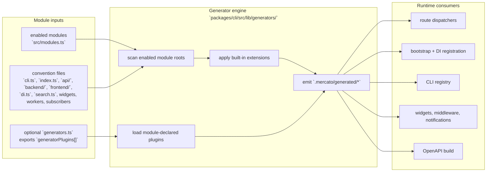

`yarn generate` is the registry compiler for Open Mercato. It scans enabled modules, applies built-in generator extensions, loads optional module-declared plugins, and emits the generated files consumed by routing, DI bootstrap, CLI dispatch, widgets, notifications, search, and other runtime registries.

## High-level flow



## Two extension layers

Open Mercato uses two additive extension layers during generation:

- **Built-in generator extensions** in `packages/cli/src/lib/generators/extensions/`
- **Module-declared generator plugins** exposed from a module's optional `generators.ts`

```mermaid
flowchart TD
  root["generator engine"]

  subgraph BuiltIn["Built-in extensions"]
    search["search"]
    notifications["notifications"]
    messages["messages"]
    ai["ai-tools"]
    events["events"]
    analytics["analytics"]
    enrichers["enrichers"]
    interceptors["interceptors"]
    guards["guards"]
    widgets["dashboard + injection widgets"]
    middleware["page middleware"]
    overrides["component overrides"]
    commands["command interceptors"]
  end

  subgraph Plugins["Module-declared plugins"]
    generators["`generators.ts`"]
    contract["`GeneratorPlugin` contract"]
    outputs["plugin-specific generated outputs"]
  end

  root --> BuiltIn
  root --> Plugins
  generators --> contract --> outputs
```

### Built-in extensions

These are framework-owned registries that every app can rely on without extra plugin authoring:

- search configs
- notifications and notification renderers
- payments client notification adapters
- notification handlers
- message types, objects, and client renderers
- AI tools
- events
- analytics widgets/config
- translatable fields
- enrichers
- interceptors
- component overrides
- inbox actions
- guards
- command interceptors
- frontend/backend page middleware
- dashboard widgets
- injection widgets and injection tables

### Module-declared plugins

Modules can extend generation without editing the generator package by exporting `generatorPlugins` from `generators.ts`.

Plugin contract summary:

| Field | Meaning |
| --- | --- |
| `id` | Unique registry/plugin family ID |
| `conventionFile` | Module-local file to scan for plugin entries |
| `importPrefix` | Prefix for generated import variable names |
| `configExpr(importName, moduleId)` | Expression that turns a discovered module file into one generated entry |
| `outputFileName` | Generated file produced by the plugin |
| `buildOutput(...)` | Function that renders the generated TypeScript source |
| `bootstrapRegistration` | Optional bootstrap-time registration contribution |

This is what keeps generator architecture additive: new registry families can ship as module-owned plugin definitions rather than as hard-coded cases in the root generator.

## Core generated files

These are the primary generated files emitted by the core generator pipeline.

| Generated file | Purpose |
| --- | --- |
| `modules.generated.ts` | Full discovered module graph, including rich runtime metadata used by framework registries and compatibility paths. |
| `modules.runtime.generated.ts` | Runtime-focused module registry used by the current lightweight bootstrap/runtime path. |
| `modules.app.generated.ts` | App bootstrap registry used by application startup without route-heavy coupling. |
| `modules.cli.generated.ts` | CLI module registry loaded by `yarn mercato` for module-owned commands. |
| `cli-modules.generated.ts` | Convenience export/wrapper around the generated CLI module list. |
| `bootstrap-modules.generated.ts` | Bootstrap-oriented module registry helpers used during startup assembly. |
| `bootstrap-registrations.generated.ts` | Generated bootstrap registration calls, including optional plugin-contributed registrations. |
| `entities.generated.ts` | MikroORM entity registry for discovered modules. |
| `entities.ids.generated.ts` | Stable generated entity ID constants. |
| `entity-fields-registry.ts` | Generated entity-fields registry used by encryption and related metadata consumers. |
| `di.generated.ts` | Discovered DI registrars for enabled modules. |
| `frontend-routes.generated.ts` | Frontend route manifest with lazy route-loading metadata. |
| `backend-routes.generated.ts` | Backend route manifest with lazy route-loading metadata. |
| `api-routes.generated.ts` | API route manifest with method/path metadata and lazy handlers. |
| `subscribers.generated.ts` | Legacy/generated subscriber registry compatibility file. |
| `openapi.generated.json` | Generated OpenAPI document built from discovered API routes and route metadata. |
| `module-package-sources.css` | Generated stylesheet that tracks module package source markers for runtime styling/diagnostics. |

## Built-in extension outputs

These generated files come from built-in generator extensions.

| Generated file | Source extension | Purpose |
| --- | --- | --- |
| `search.generated.ts` | search | Search module config registry. |
| `notifications.generated.ts` | notifications | Notification type registry. |
| `notifications.client.generated.ts` | notifications | Client-side notification renderers. |
| `payments.client.generated.ts` | notifications | Payment-related notification/client adapters. |
| `notification-handlers.generated.ts` | notifications | Reactive notification side-effect handlers. |
| `message-types.generated.ts` | messages | Message type registry. |
| `message-objects.generated.ts` | messages | Message object registry. |
| `messages.client.generated.ts` | messages | Client-side message object renderers/adapters. |
| `ai-tools.generated.ts` | ai-tools | AI/MCP tool registry. |
| `events.generated.ts` | events | Event definitions and event registry metadata. |
| `analytics.generated.ts` | analytics | Analytics/dashboard configuration registry. |
| `translations-fields.generated.ts` | translatable-fields | Translatable field declarations by module/entity. |
| `enrichers.generated.ts` | enrichers | Response enricher registry. |
| `interceptors.generated.ts` | interceptors | API interceptor registry. |
| `component-overrides.generated.ts` | component-overrides | UI component override registry. |
| `inbox-actions.generated.ts` | inbox-actions | Inbox action registry. |
| `guards.generated.ts` | guards | Mutation/page/runtime guard registry. |
| `command-interceptors.generated.ts` | command-interceptors | Command interceptor registry. |
| `frontend-middleware.generated.ts` | page-middleware | Frontend page middleware registry. |
| `backend-middleware.generated.ts` | page-middleware | Backend page middleware registry. |
| `dashboard-widgets.generated.ts` | dashboard-widgets | Dashboard widget registry. |
| `injection-widgets.generated.ts` | injection-widgets | Injection widget registry. |
| `injection-tables.generated.ts` | injection-widgets | Injection table/slot registry. |

## Why this architecture exists

- Module owners keep CLI, UI, API, and generation logic close to the same feature boundary.
- Disabling a module naturally removes its discovered registries and plugin output.
- Standalone apps and monorepos share the same mental model, even though one scans source trees and the other scans compiled package output.
- The generator remains additive: new registry families can be introduced without destabilizing the root CLI entrypoint.

## Relationship to cache CLI

The cache command is a normal `cli.ts` discovery case, not a generator plugin. It is documented separately in [Cache CLI architecture](./cache-cli). That page focuses on cache-specific runtime behavior, while this page documents the broader generator system that makes module-owned commands discoverable.
