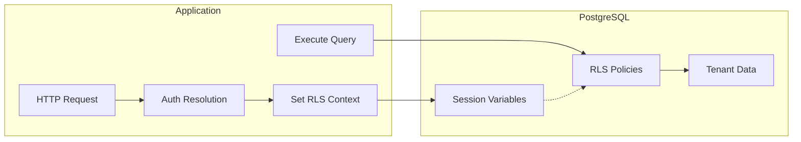

Row-Level Security (RLS) is a PostgreSQL feature that automatically filters database rows based on security policies. Open Mercato uses RLS as a defense-in-depth layer to enforce tenant isolation at the database level.

## Why RLS?

Open Mercato is a multi-tenant platform where each tenant's data must be completely isolated. While the application already filters queries by `tenant_id`, RLS provides an additional security layer:

| Layer | Mechanism | Protection |
|-------|-----------|------------|
| Application | WHERE clauses with `tenant_id` | Primary isolation |
| Database | RLS policies | Defense-in-depth |

With RLS enabled, even if application code accidentally omits a tenant filter, the database will automatically prevent cross-tenant data access.

## How It Works

### Session Variables

When a request comes in, the application sets PostgreSQL session variables:

```sql
-- Set by the application before queries
SELECT set_config('app.current_tenant_id', 'tenant-uuid-here', true);
```

### RLS Policies

Each tenant-scoped table has a policy that checks the session variable:

```sql
CREATE POLICY tenant_isolation ON orders
  USING (tenant_id = current_setting('app.current_tenant_id')::UUID);
```

### Automatic Filtering

All queries are now automatically filtered:

```sql
-- Before RLS: Manual filtering required
SELECT * FROM orders WHERE tenant_id = 'tenant-uuid';

-- With RLS: Automatic filtering
SELECT * FROM orders;  -- Only returns current tenant's orders
```

## Configuration

### Environment Variables

| Variable | Default | Description |
|----------|---------|-------------|
| `RLS_ENABLED` | `false` | Enable RLS context setting |
| `RLS_STRICT` | `false` | Fail queries if context not set (future) |

### Enabling RLS

1. **Run migrations** to create RLS policies:
   ```bash
   yarn db:migrate
   ```

2. **Enable RLS** in your environment:
   ```bash
   RLS_ENABLED=true
   ```

3. **Restart** the application

## Data Flow



1. Request arrives and authentication resolves the tenant
2. Application sets `app.current_tenant_id` session variable
3. Query executes against the database
4. RLS policy checks `tenant_id` against session variable
5. Only matching rows are returned

## Security Guarantees

### Secure by Default

If the tenant context is not set:
- **No rows are visible** to queries
- Prevents accidental data exposure
- Safe for connection pooling (transaction-scoped)

### System Data

Some tables have nullable `tenant_id` for system-wide records:
- System records (`tenant_id = NULL`) are visible to all authenticated users
- Tenant records require matching context

### What RLS Cannot Prevent

RLS is bypassed by:
- PostgreSQL superusers
- Direct database access with elevated privileges
- Backup operations (intentionally, for complete backups)

## Integration Points

RLS context is set automatically in:

1. **CRUD Factory** - For all API routes using `makeCrudRoute()`
2. **Query Engine** - For all queries via `BasicQueryEngine` and `HybridQueryEngine`

### Manual Context Setting

For custom database operations:

```typescript
import { setRlsContext, isRlsEnabled } from '@open-mercato/shared/lib/db/rls'

if (isRlsEnabled()) {
  const knex = em.getConnection().getKnex()
  await setRlsContext(knex, tenantId, organizationId)
}
```

## Troubleshooting

### No Rows Returned

Check if the RLS context is set:

```sql
SELECT current_setting('app.current_tenant_id', true);
```

If empty or NULL, the context wasn't set properly.

### Verify Tenant Data Exists

```sql
-- Temporarily bypass RLS (admin only)
SET row_security = off;
SELECT DISTINCT tenant_id FROM orders;
SET row_security = on;
```

### Check Policy Status

```sql
SELECT tablename, policyname, permissive, roles, cmd, qual
FROM pg_policies
WHERE schemaname = 'public';
```

## Best Practices

1. **Always use CRUD factory** for API routes - RLS context is set automatically
2. **Test with RLS enabled** in staging before production
3. **Monitor for access denials** in logs during rollout
4. **Keep application filtering** - RLS is defense-in-depth, not a replacement

## Related Documentation

- [System Overview](/docs/architecture/system-overview) - Overall architecture
- [Data Encryption](/docs/architecture/data-encryption) - Field-level encryption
- [RBAC Overview](/docs/framework/rbac/overview) - Role-based access control
