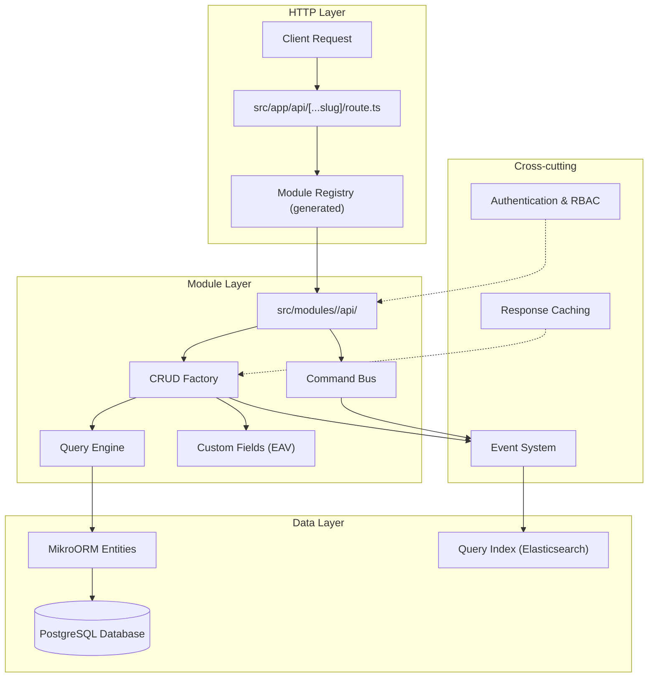

# API Development Guide

This guide provides a comprehensive overview of creating REST APIs in the open-mercato application. It covers the key components: CRUD factory, commands, query engine, custom fields, and OpenAPI generation.

## API Architecture Overview



## Core Components

### 1. CRUD Factory

The CRUD factory (`makeCrudRoute`) is the primary tool for creating REST APIs. It provides:

- **Automatic HTTP method handling** (GET, POST, PUT, DELETE)
- **Multi-tenant scoping** (organization and tenant filtering)
- **Query engine integration** for complex listing with filtering/sorting
- **Custom fields support** (EAV pattern)
- **Command bus integration** for mutations
- **Event emission** and search indexing
- **Caching** and performance optimizations
- **OpenAPI documentation generation**

#### Basic CRUD Factory Usage

```ts title="src/modules/example/api/todos/route.ts"
import { z } from "zod";
import { makeCrudRoute } from "@open-mercato/shared/lib/crud/factory";
import { TodoEntity } from "../../data/entities";
import { E } from "@open-mercato/core/generated/entities.ids.generated";

const querySchema = z.object({
  page: z.coerce.number().min(1).default(1),
  pageSize: z.coerce.number().min(1).max(100).default(50),
  search: z.string().optional(),
  status: z.string().optional(),
});

const routeMetadata = {
  GET: { requireAuth: true, requireFeatures: ["example.todos.view"] },
  POST: { requireAuth: true, requireFeatures: ["example.todos.create"] },
  PUT: { requireAuth: true, requireFeatures: ["example.todos.edit"] },
  DELETE: { requireAuth: true, requireFeatures: ["example.todos.delete"] },
};

export const metadata = routeMetadata;

const crud = makeCrudRoute({
  metadata: routeMetadata,
  orm: {
    entity: TodoEntity,
    // Automatic tenant/org scoping
  },
  list: {
    schema: querySchema,
    entityId: E.example.todo,
    fields: ["id", "title", "status", "created_at"],
    buildFilters: async (query, ctx) => {
      const filters: Record<string, any> = {};
      if (query.search) filters.title = { $ilike: `%${query.search}%` };
      if (query.status) filters.status = { $eq: query.status };
      return filters;
    },
  },
  actions: {
    create: { commandId: "example.todos.create" },
    update: { commandId: "example.todos.update" },
    delete: { commandId: "example.todos.delete" },
  },
});

export const { GET, POST, PUT, DELETE } = crud;
```

### 2. Commands (Business Logic)

Commands encapsulate business logic for mutations (Create, Update, Delete). They provide:

- **Transactional consistency** with snapshot/undo support
- **Audit logging** and operation tracking
- **Event emission** for side effects
- **Search index updates**
- **Custom field handling**

#### Command Structure

```ts title="src/modules/example/commands/todos.ts"
import { registerCommand } from "@open-mercato/shared/lib/commands";
import type { CommandHandler } from "@open-mercato/shared/lib/commands";
import {
  parseWithCustomFields,
  emitCrudSideEffects,
} from "@open-mercato/shared/lib/commands/helpers";

type CreateTodoInput = {
  title: string;
  description?: string;
  customFields?: Record<string, unknown>;
};

const createTodoCommand: CommandHandler<CreateTodoInput, { todoId: string }> = {
  id: "example.todos.create",
  async execute(rawInput, ctx) {
    // Parse input with custom fields support
    const { parsed, custom } = parseWithCustomFields(
      todoCreateSchema,
      rawInput
    );

    const em = ctx.container.resolve("em").fork();
    const todo = em.create(TodoEntity, {
      title: parsed.title,
      description: parsed.description,
      organizationId: parsed.organizationId,
      tenantId: parsed.tenantId,
    });

    em.persist(todo);
    await em.flush();

    // Handle custom fields
    if (Object.keys(custom).length > 0) {
      const de = ctx.container.resolve("dataEngine");
      await setCustomFieldsIfAny({
        dataEngine: de,
        entityId: E.example.todo,
        recordId: todo.id,
        organizationId: todo.organizationId,
        tenantId: todo.tenantId,
        values: custom,
        notify: true,
      });
    }

    // Emit events and update search index
    await emitCrudSideEffects({
      dataEngine: ctx.container.resolve("dataEngine"),
      action: "created",
      entity: todo,
      identifiers: {
        id: todo.id,
        organizationId: todo.organizationId,
        tenantId: todo.tenantId,
      },
      indexer: { entityType: E.example.todo },
    });

    return { todoId: todo.id };
  },
  // Snapshot for undo support
  captureAfter: async (input, result, ctx) => {
    // Return snapshot of created entity for undo
    return await loadTodoSnapshot(ctx.container.resolve("em"), result.todoId);
  },
  buildLog: async ({ result, ctx }) => {
    return {
      actionLabel: "Create todo",
      resourceKind: "example.todo",
      resourceId: result.todoId,
      // ... audit details
    };
  },
  undo: async ({ logEntry, ctx }) => {
    // Undo logic using snapshot
    const em = ctx.container.resolve("em").fork();
    const todoId = logEntry.resourceId;
    const todo = await em.findOne(TodoEntity, { id: todoId });
    if (todo) {
      await em.remove(todo).flush();
    }
  },
};

registerCommand(createTodoCommand);
```

### 3. Query Engine

The Query Engine provides advanced data retrieval capabilities:

- **Complex filtering** with JSON operators (`$ilike`, `$in`, `$gte`, etc.)
- **Multi-table joins** and relations
- **Custom field hydration** (EAV pattern)
- **Pagination and sorting**
- **Performance optimization**

#### Query Engine Integration

```ts
const crud = makeCrudRoute({
  // ...
  list: {
    entityId: E.customers.customer_person_profile,
    fields: [
      "id",
      "display_name",
      "primary_email",
      "cf:priority", // Custom field
      "cf:tags", // Another custom field
    ],
    buildFilters: async (query, ctx) => {
      const filters: Record<string, any> = { kind: { $eq: "person" } };

      // Text search
      if (query.search) {
        filters.display_name = { $ilike: `%${query.search}%` };
      }

      // Custom field filters
      const cfFilters = await buildCustomFieldFiltersFromQuery({
        entityIds: [E.customers.customer_entity],
        query,
        em: ctx.container.resolve("em"),
        tenantId: ctx.auth.tenantId,
      });
      Object.assign(filters, cfFilters);

      return filters;
    },
    customFieldSources: [
      {
        entityId: E.customers.customer_person_profile,
        table: "customer_people",
        alias: "person_profile",
        recordIdColumn: "id",
        join: { fromField: "id", toField: "entity_id" },
      },
    ],
    joins: [
      {
        alias: "tags",
        table: "customer_tag_assignments",
        from: { field: "id" },
        to: { field: "entity_id" },
        type: "left",
      },
    ],
  },
  // ...
});
```

### 4. Custom Fields (EAV Pattern)

Custom fields use Entity-Attribute-Value pattern for dynamic field support:

- **Runtime field definition** without schema changes
- **Multi-tenant field scoping**
- **Type safety** with validation
- **Search and filtering support**

#### Custom Field Integration

```ts
// In command - handle custom fields
const { parsed, custom } = parseWithCustomFields(schema, rawInput);

if (Object.keys(custom).length > 0) {
  await setCustomFieldsIfAny({
    dataEngine: de,
    entityId: E.example.todo,
    recordId: record.id,
    organizationId,
    tenantId,
    values: custom,
    notify: true,
  });
}

// In query - include custom fields
const crud = makeCrudRoute({
  list: {
    fields: ["id", "title", "cf:priority", "cf:tags"],
    customFieldSources: [
      {
        entityId: E.example.todo,
        table: "todos",
        recordIdColumn: "id",
      },
    ],
  },
});
```

### 5. OpenAPI Generation

Automatic OpenAPI specification generation from route definitions:

```ts title="openapi.ts"
export const createTodosCrudOpenApi = createCrudOpenApiFactory({
  defaultTag: "Todos",
});

export const openApi = createTodosCrudOpenApi({
  resourceName: "Todo",
  pluralName: "Todos",
  querySchema: listSchema,
  listResponseSchema: createPagedListResponseSchema(todoItemSchema),
  create: {
    schema: todoCreateSchema,
    responseSchema: createResponseSchema,
    description: "Creates a new todo item",
  },
  update: {
    schema: todoUpdateSchema,
    responseSchema: okResponseSchema,
    description: "Updates an existing todo item",
  },
});
```

## Step-by-Step API Creation Workflow

### Step 1: Define Data Model

Create MikroORM entities and validators:

```ts title="src/modules/example/data/entities.ts"
import { Entity, Property } from "@mikro-orm/postgresql";

@Entity({ tableName: "todos" })
export class TodoEntity {
  @Property({ primary: true })
  id: string;

  @Property()
  title: string;

  @Property({ nullable: true })
  description?: string;

  @Property()
  status: string;

  @Property()
  organizationId: string;

  @Property()
  tenantId: string;

  @Property()
  createdAt: Date;

  @Property({ nullable: true })
  updatedAt?: Date;
}
```

```ts title="src/modules/example/data/validators.ts"
import { z } from "zod";

export const todoCreateSchema = z.object({
  title: z.string().min(1).max(255),
  description: z.string().optional(),
  status: z.enum(["pending", "in_progress", "completed"]),
  organizationId: z.string().uuid(),
  tenantId: z.string().uuid(),
});

export const todoUpdateSchema = todoCreateSchema.partial().extend({
  id: z.string().uuid(),
});
```

### Step 2: Create Commands

Implement business logic with commands:

```ts title="src/modules/example/commands/todos.ts"
// Create, Update, Delete commands with snapshots and undo support
```

### Step 3: Create API Route

Use CRUD factory to wire everything together:

```ts title="src/modules/example/api/todos/route.ts"
// Full CRUD route with query engine, custom fields, commands
```

### Step 4: Add Custom Fields Support

Define custom entities in `ce.ts`:

```ts title="src/modules/example/ce.ts"
export const entities = [
  {
    id: E.example.todo,
    name: "Todo",
    fields: [
      {
        key: "priority",
        label: "Priority",
        kind: "select",
        options: ["low", "medium", "high"],
      },
    ],
  },
];
```

### Step 5: Configure ACL Features

Define module features in `acl.ts`:

```ts title="src/modules/example/acl.ts"
export const features = [
  "example.todos.view",
  "example.todos.create",
  "example.todos.edit",
  "example.todos.delete",
];
```

### Step 6: Generate and Test

```bash
# Generate module registry
npm run modules:prepare

# Run tests
npm test

# Generate database migrations
npm run db:generate
```

## Advanced Patterns

### Custom Endpoints

For non-CRUD operations:

```ts title="src/modules/example/api/todos/bulk-update/route.ts"
export async function POST(request: Request, { auth }: RequestContext) {
  const container = await createRequestContainer();
  const commandBus = container.resolve("commandBus");

  const body = await request.json();
  const results = await Promise.all(
    body.todos.map((todo) =>
      commandBus.execute("example.todos.update", { ...todo, auth })
    )
  );

  return NextResponse.json({ results });
}

export const metadata = {
  POST: {
    requireAuth: true,
    requireFeatures: ["example.todos.edit"],
  },
};
```

### Complex Queries with Joins

```ts
const crud = makeCrudRoute({
  list: {
    entityId: E.example.todo,
    fields: ["id", "title", "assignee.name"],
    joins: [
      {
        alias: "assignee",
        table: "users",
        from: { field: "assignee_user_id" },
        to: { field: "id" },
        type: "left",
      },
    ],
    buildFilters: async (query) => {
      // Filters can reference joined tables
      return {
        "assignee.name": { $ilike: `%${query.assigneeSearch}%` },
      };
    },
  },
});
```

### Event-Driven Architecture

Commands automatically emit events for side effects:

```ts
// Events are emitted automatically by commands
// Listen in subscribers
export default {
  event: "example.todo.created",
  persistent: true,
  handler: async (event, ctx) => {
    // Send notification, update cache, etc.
  },
};
```

## Best Practices

1. **Always use commands** for mutations - never direct ORM calls in routes
2. **Validate all inputs** with Zod schemas colocated with entities
3. **Respect tenant boundaries** - let the framework handle scoping
4. **Use custom fields** for user-extensible data
5. **Implement undo support** in commands for data safety
6. **Document APIs** with OpenAPI schemas for frontend integration
7. **Test thoroughly** - include command tests and API integration tests

## Troubleshooting

### Common Issues

- **"Entity not found"** - Check entity ID references in `E.generated.ts`
- **Custom fields not saving** - Ensure `ce.ts` exports custom entities
- **OpenAPI not generating** - Check route exports `openApi` constant
- **Commands not found** - Verify command registration and IDs
- **Tenant scoping issues** - Check `requireAuth` and organization context

### Performance Considerations

- Use **query engine** for complex lists with joins
- **Cache responses** with built-in caching (enabled by default)
- **Index custom fields** for searchable fields
- **Batch operations** for bulk updates
- **Profile slow queries** with `OM_PROFILE=*`
