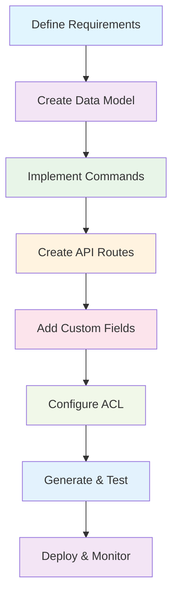

# Building API Modules

This workflow provides a practical, step-by-step guide to creating new APIs in open-mercato. We'll create a complete "Tasks" module as an example, covering all components from data model to API endpoints.

## Overview



## Step 1: Define Requirements

Start by understanding what you're building:

```typescript
// Example: Task Management Module
interface Task {
  id: string;
  title: string;
  description?: string;
  status: "todo" | "in_progress" | "done";
  priority: "low" | "medium" | "high";
  assigneeId?: string;
  dueDate?: Date;
  tags: string[];
  // Custom fields: budget, complexity, etc.
}
```

**Key Decisions:**

- What entities do you need?
- What custom fields should users be able to add?
- What operations (CRUD + business logic)?
- What integrations with other modules?

## Step 2: Create Data Model

### 2.1 Define MikroORM Entities

```ts title="packages/<pkg>/src/modules/tasks/data/entities.ts"
import {
  Entity,
  Property,
  ManyToOne,
  Collection,
  OneToMany,
} from "@mikro-orm/postgresql";
import { UserEntity } from "../../../auth/data/entities";

@Entity({ tableName: "tasks" })
export class TaskEntity {
  @Property({ primary: true })
  id: string;

  @Property()
  title: string;

  @Property({ nullable: true })
  description?: string;

  @Property()
  status: string;

  @Property()
  priority: string;

  @Property({ nullable: true })
  assigneeId?: string;

  @ManyToOne(() => UserEntity, { nullable: true })
  assignee?: UserEntity;

  @Property({ nullable: true })
  dueDate?: Date;

  @Property()
  organizationId: string;

  @Property()
  tenantId: string;

  @Property()
  createdAt: Date;

  @Property({ nullable: true })
  updatedAt?: Date;

  @Property({ nullable: true })
  deletedAt?: Date;

  // Relations
  @OneToMany(() => TaskCommentEntity, (comment) => comment.task)
  comments = new Collection<TaskCommentEntity>(this);

  @OneToMany(() => TaskTagAssignmentEntity, (assignment) => assignment.task)
  tagAssignments = new Collection<TaskTagAssignmentEntity>(this);
}

@Entity({ tableName: "task_comments" })
export class TaskCommentEntity {
  @Property({ primary: true })
  id: string;

  @ManyToOne(() => TaskEntity)
  task!: TaskEntity;

  @Property()
  body: string;

  @Property({ nullable: true })
  authorId?: string;

  @Property()
  organizationId: string;

  @Property()
  tenantId: string;

  @Property()
  createdAt: Date;
}

@Entity({ tableName: "task_tag_assignments" })
export class TaskTagAssignmentEntity {
  @Property({ primary: true })
  id: string;

  @ManyToOne(() => TaskEntity)
  task!: TaskEntity;

  @Property()
  tagId: string;

  @Property()
  organizationId: string;

  @Property()
  tenantId: string;
}
```

### 2.2 Create Zod Validators

```ts title="packages/<pkg>/src/modules/tasks/data/validators.ts"
import { z } from "zod";

// Base schemas
export const taskStatusSchema = z.enum(["todo", "in_progress", "done"]);
export const taskPrioritySchema = z.enum(["low", "medium", "high"]);

// Create schema
export const taskCreateSchema = z.object({
  title: z.string().min(1).max(255),
  description: z.string().optional(),
  status: taskStatusSchema.default("todo"),
  priority: taskPrioritySchema.default("medium"),
  assigneeId: z.string().uuid().optional(),
  dueDate: z.string().datetime().optional(),
  tags: z.array(z.string().uuid()).default([]),
  organizationId: z.string().uuid(),
  tenantId: z.string().uuid(),
});

// Update schema (partial)
export const taskUpdateSchema = taskCreateSchema
  .omit({ organizationId: true, tenantId: true })
  .partial()
  .extend({
    id: z.string().uuid(),
  });

// Comment schemas
export const commentCreateSchema = z.object({
  taskId: z.string().uuid(),
  body: z.string().min(1),
  organizationId: z.string().uuid(),
  tenantId: z.string().uuid(),
});
```

## Step 3: Implement Commands

### 3.1 Task Creation Command

```ts title="packages/<pkg>/src/modules/tasks/commands/tasks.ts"
import { registerCommand } from "@open-mercato/shared/lib/commands";
import type { CommandHandler } from "@open-mercato/shared/lib/commands";
import {
  parseWithCustomFields,
  emitCrudSideEffects,
  setCustomFieldsIfAny,
} from "@open-mercato/shared/lib/commands/helpers";
import { CrudHttpError } from "@open-mercato/shared/lib/crud/errors";
import { resolveTranslations } from "@open-mercato/shared/lib/i18n/server";
import { TaskEntity, TaskTagAssignmentEntity } from "../data/entities";
import { taskCreateSchema, taskUpdateSchema } from "../data/validators";
import {
  ensureOrganizationScope,
  ensureTenantScope,
  syncEntityTags,
} from "./shared";
import { E } from "@open-mercato/core/generated/entities.ids.generated";

type TaskCreateInput = z.infer<typeof taskCreateSchema>;
type TaskUpdateInput = z.infer<typeof taskUpdateSchema>;

const createTaskCommand: CommandHandler<TaskCreateInput, { taskId: string }> = {
  id: "tasks.tasks.create",
  async execute(rawInput, ctx) {
    const { parsed, custom } = parseWithCustomFields(
      taskCreateSchema,
      rawInput
    );
    ensureTenantScope(ctx, parsed.tenantId);
    ensureOrganizationScope(ctx, parsed.organizationId);

    const em = ctx.container.resolve("em").fork();

    const task = em.create(TaskEntity, {
      id: crypto.randomUUID(),
      title: parsed.title,
      description: parsed.description,
      status: parsed.status,
      priority: parsed.priority,
      assigneeId: parsed.assigneeId,
      dueDate: parsed.dueDate ? new Date(parsed.dueDate) : undefined,
      organizationId: parsed.organizationId,
      tenantId: parsed.tenantId,
      createdAt: new Date(),
    });

    em.persist(task);

    // Handle tags
    await syncEntityTags(em, task, parsed.tags);

    await em.flush();

    // Set custom fields
    if (Object.keys(custom).length > 0) {
      const de = ctx.container.resolve("dataEngine");
      await setCustomFieldsIfAny({
        dataEngine: de,
        entityId: E.tasks.task_entity,
        recordId: task.id,
        organizationId: parsed.organizationId,
        tenantId: parsed.tenantId,
        values: custom,
        notify: true,
      });
    }

    // Emit events and update search index
    await emitCrudSideEffects({
      dataEngine: ctx.container.resolve("dataEngine"),
      action: "created",
      entity: task,
      identifiers: {
        id: task.id,
        organizationId: parsed.organizationId,
        tenantId: parsed.tenantId,
      },
      indexer: { entityType: E.tasks.task_entity },
    });

    return { taskId: task.id };
  },

  captureAfter: async (input, result, ctx) => {
    // Return snapshot for undo support
    const em = ctx.container.resolve("em");
    const task = await em.findOne(TaskEntity, { id: result.taskId });
    return task ? { task } : {};
  },

  buildLog: async ({ result, ctx }) => {
    const { translate } = await resolveTranslations();
    return {
      actionLabel: translate("tasks.audit.create", "Create task"),
      resourceKind: "tasks.task",
      resourceId: result.taskId,
      tenantId: ctx.auth?.tenantId,
      organizationId: ctx.selectedOrganizationId,
      payload: { result },
    };
  },

  undo: async ({ logEntry, ctx }) => {
    const taskId = logEntry.resourceId;
    if (!taskId) return;

    const em = ctx.container.resolve("em").fork();
    const task = await em.findOne(TaskEntity, { id: taskId });
    if (task) {
      await em.remove(task).flush();
    }
  },
};
```

### 3.2 Task Update Command

```ts
const updateTaskCommand: CommandHandler<TaskUpdateInput, { taskId: string }> = {
  id: "tasks.tasks.update",
  async prepare(rawInput, ctx) {
    const { parsed } = parseWithCustomFields(taskUpdateSchema, rawInput);
    const em = ctx.container.resolve("em");
    const task = await em.findOne(TaskEntity, { id: parsed.id });
    return task ? { before: { task } } : {};
  },

  async execute(rawInput, ctx) {
    const { parsed, custom } = parseWithCustomFields(
      taskUpdateSchema,
      rawInput
    );
    const em = ctx.container.resolve("em").fork();

    const task = await em.findOne(TaskEntity, {
      id: parsed.id,
      deletedAt: null,
    });
    if (!task) {
      throw new CrudHttpError(404, { error: "Task not found" });
    }

    ensureTenantScope(ctx, task.tenantId);
    ensureOrganizationScope(ctx, task.organizationId);

    // Update fields
    if (parsed.title !== undefined) task.title = parsed.title;
    if (parsed.description !== undefined) task.description = parsed.description;
    if (parsed.status !== undefined) task.status = parsed.status;
    if (parsed.priority !== undefined) task.priority = parsed.priority;
    if (parsed.assigneeId !== undefined) task.assigneeId = parsed.assigneeId;
    if (parsed.dueDate !== undefined) {
      task.dueDate = parsed.dueDate ? new Date(parsed.dueDate) : undefined;
    }
    task.updatedAt = new Date();

    // Handle tags
    if (parsed.tags !== undefined) {
      await syncEntityTags(em, task, parsed.tags);
    }

    await em.flush();

    // Update custom fields
    if (custom && Object.keys(custom).length > 0) {
      const de = ctx.container.resolve("dataEngine");
      await setCustomFieldsIfAny({
        dataEngine: de,
        entityId: E.tasks.task_entity,
        recordId: task.id,
        organizationId: task.organizationId,
        tenantId: task.tenantId,
        values: custom,
        notify: true,
      });
    }

    await emitCrudSideEffects({
      dataEngine: ctx.container.resolve("dataEngine"),
      action: "updated",
      entity: task,
      identifiers: {
        id: task.id,
        organizationId: task.organizationId,
        tenantId: task.tenantId,
      },
      indexer: { entityType: E.tasks.task_entity },
    });

    return { taskId: task.id };
  },

  buildLog: async ({ ctx, snapshots }) => {
    const { translate } = await resolveTranslations();
    const before = snapshots.before?.task;
    if (!before) return null;

    const em = ctx.container.resolve("em");
    const after = await em.findOne(TaskEntity, { id: before.id });

    return {
      actionLabel: translate("tasks.audit.update", "Update task"),
      resourceKind: "tasks.task",
      resourceId: before.id,
      tenantId: before.tenantId,
      organizationId: before.organizationId,
      snapshotBefore: { task: before },
      snapshotAfter: after ? { task: after } : null,
      changes: buildChanges(before, after, ["title", "status", "priority"]),
    };
  },
};
```

### 3.3 Register Commands

```ts title="packages/<pkg>/src/modules/tasks/commands/index.ts"
import "./tasks";
import "./comments";
```

## Step 4: Create API Routes

### 4.1 Main Tasks Route

```ts title="packages/<pkg>/src/modules/tasks/api/tasks/route.ts"
import { z } from "zod";
import { makeCrudRoute } from "@open-mercato/shared/lib/crud/factory";
import { TaskEntity } from "../../data/entities";
import { E } from "@open-mercato/core/generated/entities.ids.generated";
import {
  buildCustomFieldFiltersFromQuery,
  extractAllCustomFieldEntries,
  splitCustomFieldPayload,
} from "@open-mercato/shared/lib/crud/custom-fields";
import { resolveTranslations } from "@open-mercato/shared/lib/i18n/server";
import { withScopedPayload } from "../utils";
import {
  createTasksCrudOpenApi,
  createPagedListResponseSchema,
  defaultOkResponseSchema,
} from "../openapi";

const listSchema = z
  .object({
    page: z.coerce.number().min(1).default(1),
    pageSize: z.coerce.number().min(1).max(100).default(50),
    search: z.string().optional(),
    status: z.string().optional(),
    priority: z.string().optional(),
    assigneeId: z.string().uuid().optional(),
    dueBefore: z.string().optional(),
    dueAfter: z.string().optional(),
    tags: z.string().optional(),
    sortField: z.string().optional(),
    sortDir: z.enum(["asc", "desc"]).optional(),
  })
  .passthrough();

const routeMetadata = {
  GET: { requireAuth: true, requireFeatures: ["tasks.tasks.view"] },
  POST: { requireAuth: true, requireFeatures: ["tasks.tasks.create"] },
  PUT: { requireAuth: true, requireFeatures: ["tasks.tasks.edit"] },
  DELETE: { requireAuth: true, requireFeatures: ["tasks.tasks.delete"] },
};

export const metadata = routeMetadata;

const crud = makeCrudRoute({
  metadata: routeMetadata,
  orm: {
    entity: TaskEntity,
    idField: "id",
    orgField: "organizationId",
    tenantField: "tenantId",
    softDeleteField: "deletedAt",
  },
  list: {
    schema: listSchema,
    entityId: E.tasks.task_entity,
    fields: [
      "id",
      "title",
      "description",
      "status",
      "priority",
      "assignee_id",
      "due_date",
      "organization_id",
      "tenant_id",
      "created_at",
      "updated_at",
      "cf:budget",
      "cf:estimated_hours",
    ],
    sortFieldMap: {
      title: "title",
      status: "status",
      priority: "priority",
      dueDate: "due_date",
      createdAt: "created_at",
    },
    buildFilters: async (query, ctx) => {
      const filters: Record<string, any> = {};

      if (query.search) {
        filters.title = { $ilike: `%${query.search}%` };
      }

      if (query.status) {
        filters.status = { $eq: query.status };
      }

      if (query.priority) {
        filters.priority = { $eq: query.priority };
      }

      if (query.assigneeId) {
        filters.assignee_id = { $eq: query.assigneeId };
      }

      // Date range filters
      if (query.dueBefore || query.dueAfter) {
        const range: any = {};
        if (query.dueAfter) range.$gte = new Date(query.dueAfter);
        if (query.dueBefore) range.$lte = new Date(query.dueBefore);
        filters.due_date = range;
      }

      // Tag filtering
      if (query.tags) {
        const tagIds = query.tags.split(",").filter(Boolean);
        if (tagIds.length > 0) {
          filters["tag_assignments.tag_id"] = { $in: tagIds };
        }
      }

      // Custom field filters
      if (ctx) {
        const cfFilters = await buildCustomFieldFiltersFromQuery({
          entityIds: [E.tasks.task_entity],
          query,
          em: ctx.container.resolve("em"),
          tenantId: ctx.auth?.tenantId ?? null,
        });
        Object.assign(filters, cfFilters);
      }

      return filters;
    },
    joins: [
      {
        alias: "tag_assignments",
        table: "task_tag_assignments",
        from: { field: "id" },
        to: { field: "task_id" },
        type: "left",
      },
    ],
    transformItem: (item) => {
      if (!item) return item;
      const cfEntries = extractAllCustomFieldEntries(item);
      return { ...item, ...cfEntries };
    },
    export: {
      enabled: true,
      formats: ["csv", "json"],
      filename: "tasks_export",
      columns: [
        { field: "id", header: "ID" },
        { field: "title", header: "Title" },
        { field: "status", header: "Status" },
        { field: "priority", header: "Priority" },
        { field: "due_date", header: "Due Date" },
        { field: "cf:budget", header: "Budget" },
      ],
    },
  },
  actions: {
    create: {
      commandId: "tasks.tasks.create",
      schema: z.object({}).passthrough(),
      mapInput: async ({ raw, ctx }) => {
        const { translate } = await resolveTranslations();
        const scoped = withScopedPayload(raw, ctx, translate);
        const { base, custom } = splitCustomFieldPayload(scoped);
        return Object.keys(custom).length
          ? { ...base, customFields: custom }
          : base;
      },
      response: ({ result }) => ({ id: result?.taskId }),
      status: 201,
    },
    update: {
      commandId: "tasks.tasks.update",
      schema: z.object({ id: z.string().uuid() }).passthrough(),
      mapInput: async ({ raw, ctx }) => {
        const { translate } = await resolveTranslations();
        const scoped = withScopedPayload(raw, ctx, translate);
        const { base, custom } = splitCustomFieldPayload(scoped);
        return Object.keys(custom).length
          ? { ...base, customFields: custom }
          : base;
      },
      response: () => ({ ok: true }),
    },
    delete: {
      commandId: "tasks.tasks.delete",
      mapInput: ({ parsed }) => ({ id: parsed.id }),
      response: () => ({ ok: true }),
    },
  },
});

export const { GET, POST, PUT, DELETE } = crud;
```

### 4.2 OpenAPI Specification

```ts title="packages/<pkg>/src/modules/tasks/api/openapi.ts"
import { z } from "zod";
import type { ZodTypeAny } from "zod";
import type { OpenApiRouteDoc } from "@open-mercato/shared/lib/openapi";
import {
  createCrudOpenApiFactory,
  createPagedListResponseSchema as createSharedPagedListResponseSchema,
  defaultCreateResponseSchema as sharedDefaultCreateResponseSchema,
  defaultOkResponseSchema as sharedDefaultOkResponseSchema,
} from "@open-mercato/shared/lib/openapi/crud";

export const defaultCreateResponseSchema = sharedDefaultCreateResponseSchema;
export const defaultOkResponseSchema = sharedDefaultOkResponseSchema;

export function createPagedListResponseSchema(itemSchema: ZodTypeAny) {
  return createSharedPagedListResponseSchema(itemSchema, {
    paginationMetaOptional: true,
  });
}

const buildTasksCrudOpenApi = createCrudOpenApiFactory({
  defaultTag: "Tasks",
  defaultCreateResponseSchema,
  defaultOkResponseSchema,
  makeListDescription: ({ pluralLower }) =>
    `Returns a paginated collection of ${pluralLower} scoped to the authenticated organization.`,
});

export function createTasksCrudOpenApi(options: any): OpenApiRouteDoc {
  return buildTasksCrudOpenApi(options);
}

const taskListItemSchema = z.object({
  id: z.string().uuid(),
  title: z.string(),
  description: z.string().nullable().optional(),
  status: z.string(),
  priority: z.string(),
  assignee_id: z.string().uuid().nullable().optional(),
  due_date: z.string().nullable().optional(),
  organization_id: z.string().uuid(),
  tenant_id: z.string().uuid(),
  created_at: z.string(),
  updated_at: z.string().nullable().optional(),
});

const taskCreateResponseSchema = z.object({
  id: z.string().uuid(),
});

// Export the OpenAPI spec for the main route
export const openApi = createTasksCrudOpenApi({
  resourceName: "Task",
  pluralName: "Tasks",
  querySchema: z.object({
    page: z.coerce.number().optional(),
    pageSize: z.coerce.number().optional(),
    search: z.string().optional(),
    status: z.string().optional(),
    priority: z.string().optional(),
    assigneeId: z.string().uuid().optional(),
    dueBefore: z.string().optional(),
    dueAfter: z.string().optional(),
    tags: z.string().optional(),
  }),
  listResponseSchema: createPagedListResponseSchema(taskListItemSchema),
  create: {
    schema: z.object({
      title: z.string(),
      description: z.string().optional(),
      status: z.enum(["todo", "in_progress", "done"]).optional(),
      priority: z.enum(["low", "medium", "high"]).optional(),
      assigneeId: z.string().uuid().optional(),
      dueDate: z.string().datetime().optional(),
      tags: z.array(z.string().uuid()).optional(),
    }),
    responseSchema: taskCreateResponseSchema,
    description: "Creates a new task with optional custom fields.",
  },
  update: {
    schema: z.object({
      id: z.string().uuid(),
      title: z.string().optional(),
      description: z.string().optional(),
      status: z.enum(["todo", "in_progress", "done"]).optional(),
      priority: z.enum(["low", "medium", "high"]).optional(),
      assigneeId: z.string().uuid().optional(),
      dueDate: z.string().datetime().optional(),
      tags: z.array(z.string().uuid()).optional(),
    }),
    responseSchema: defaultOkResponseSchema,
    description: "Updates an existing task.",
  },
  del: {
    schema: z.object({ id: z.string().uuid() }),
    responseSchema: defaultOkResponseSchema,
    description: "Deletes a task by id.",
  },
});
```

## Step 5: Add Custom Fields Support

### 5.1 Define Custom Entities

```ts title="packages/<pkg>/src/modules/tasks/ce.ts"
import { E } from "@open-mercato/core/generated/entities.ids.generated";

export const entities = [
  {
    id: E.tasks.task_entity,
    name: "Task",
    fields: [
      {
        key: "budget",
        label: "Budget",
        kind: "currency",
        required: false,
        description: "Estimated budget for the task",
      },
      {
        key: "estimated_hours",
        label: "Estimated Hours",
        kind: "number",
        required: false,
        description: "Estimated hours to complete the task",
      },
      {
        key: "complexity",
        label: "Complexity",
        kind: "select",
        options: ["simple", "medium", "complex"],
        required: false,
        description: "Task complexity level",
      },
      {
        key: "external_id",
        label: "External ID",
        kind: "text",
        required: false,
        description: "ID from external system",
      },
    ],
  },
];
```

## Step 6: Configure ACL Features

### 6.1 Define Module Features

```ts title="packages/<pkg>/src/modules/tasks/acl.ts"
export const features = [
  "tasks.tasks.view",
  "tasks.tasks.create",
  "tasks.tasks.edit",
  "tasks.tasks.delete",
  "tasks.comments.view",
  "tasks.comments.create",
  "tasks.comments.edit",
  "tasks.comments.delete",
];
```

### 6.2 Update Module Metadata

```ts title="packages/<pkg>/src/modules/tasks/index.ts"
export const metadata = {
  name: "Tasks",
  description: "Task management and tracking",
  version: "1.0.0",
};
```

## Step 7: Generate and Test

### 7.1 Generate Module Registry

```bash
# Generate module registry and entity IDs
yarn generate
```

### 7.2 Generate Database Migrations

```bash
# Generate migrations for new entities
yarn db:generate

# Apply migrations
yarn db:migrate
```

### 7.3 Run Tests

```ts title="packages/<pkg>/src/modules/tasks/api/__tests__/tasks.test.ts"
import { describe, it, expect } from "vitest";
import { createTestContext } from "@open-mercato/shared/lib/test";
import { executeCommand } from "@open-mercato/shared/lib/commands";

describe("tasks API", () => {
  const ctx = createTestContext();

  it("creates a task", async () => {
    const { result } = await executeCommand(
      "tasks.tasks.create",
      {
        title: "Test Task",
        description: "A test task",
        status: "todo",
        priority: "medium",
        organizationId: ctx.organizationId,
        tenantId: ctx.tenantId,
      },
      ctx
    );

    expect(result.taskId).toBeDefined();
  });

  it("lists tasks with filtering", async () => {
    // Test the GET endpoint
    const response = await ctx.request(
      "/api/tasks/tasks?status=todo&pageSize=10"
    );
    expect(response.status).toBe(200);

    const data = await response.json();
    expect(Array.isArray(data.items)).toBe(true);
  });

  it("updates a task", async () => {
    const createResult = await executeCommand(
      "tasks.tasks.create",
      {
        title: "Task to Update",
        organizationId: ctx.organizationId,
        tenantId: ctx.tenantId,
      },
      ctx
    );

    const { result } = await executeCommand(
      "tasks.tasks.update",
      {
        id: createResult.result.taskId,
        status: "in_progress",
      },
      ctx
    );

    expect(result.taskId).toBe(createResult.result.taskId);
  });
});
```

### 7.4 Test API Endpoints

```bash
# Run API tests
yarn test -- src/modules/tasks/api

# Test OpenAPI generation
yarn openapi:generate
```

## Step 8: Deploy and Monitor

### 8.1 Deploy Changes

```bash
# Build the application
yarn build

# Deploy to staging/production
# ... deployment commands ...
```

### 8.2 Monitor Performance

```bash
# Enable profiling
OM_PROFILE=tasks.* yarn dev

# Check for slow queries
# Monitor API response times
# Check error rates
```

## Common Patterns and Best Practices

### Error Handling

```ts
// Use CrudHttpError for consistent error responses
throw new CrudHttpError(400, {
  error: "Invalid task status transition",
  details: { current: "done", requested: "todo" },
});
```

### Validation

```ts
// Business rule validation in commands
if (input.status === "done" && !input.completedAt) {
  input.completedAt = new Date();
}
```

### Performance Optimization

```ts
// Use efficient queries
list: {
  fields: ['id', 'title'], // Only select needed fields
  // Use appropriate indexes in database
}
```

### Security

```ts
// Always scope to organization/tenant
ensureOrganizationScope(ctx, entity.organizationId);
ensureTenantScope(ctx, entity.tenantId);
```

## Troubleshooting

### Common Issues

1. **"Entity not found"** - Check that `E.tasks.task_entity` exists in generated files
2. **Custom fields not working** - Ensure `ce.ts` exports entities correctly
3. **OpenAPI not generating** - Verify route exports `openApi` constant
4. **Commands not registering** - Check command imports in `commands/index.ts`
5. **Tenant scoping errors** - Verify `tenantId` and `organizationId` are provided

### Debugging

```bash
# Enable detailed logging
DEBUG=crud:* yarn dev

# Check module registry
yarn generate --verbose

# Validate migrations
yarn db:migrate --dry-run
```

This workflow provides a complete guide to creating robust, scalable APIs in open-mercato with all the necessary components working together.
