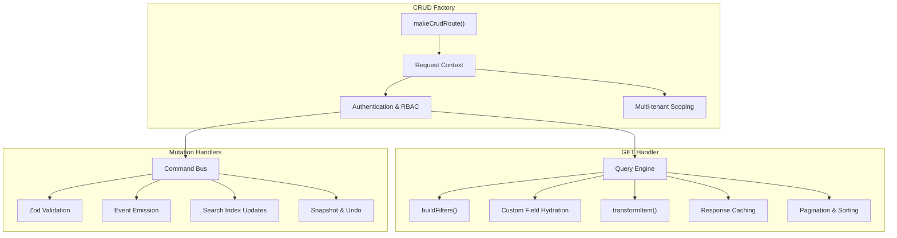

# CRUD API Factory

The CRUD factory (`makeCrudRoute`) is a powerful abstraction for building consistent, multi-tenant safe REST APIs. It integrates deeply with the open-mercato architecture to provide validation, security, performance, and extensibility.

## Architecture Overview



## Core Configuration

### ORM Configuration

```ts
const crud = makeCrudRoute({
  orm: {
    entity: CustomerEntity, // MikroORM entity class
    idField: "id", // Primary key field (default: 'id')
    orgField: "organizationId", // Organization scope field (default: 'organizationId')
    tenantField: "tenantId", // Tenant scope field (default: 'tenantId')
    softDeleteField: "deletedAt", // Soft delete field (default: 'deletedAt')
  },
  // ... rest of config
});
```

**Field Behavior:**

- `orgField: null` disables automatic organization scoping
- `tenantField: null` disables automatic tenant scoping
- `softDeleteField: null` disables implicit soft delete filtering

## Usage

Define a `route.ts` under `src/modules/<module>/api/<path>/route.ts` and use the factory.

### Modern Pattern (with Commands)

The recommended approach is to delegate mutations to [Commands](../commands/overview) and use the factory primarily for the `GET` (list) handler and wiring.

```ts title="src/modules/example/api/todos/route.ts"
import { z } from "zod";
import { makeCrudRoute } from "@open-mercato/shared/lib/crud/factory";
import { TodoEntity } from "../../data/entities";
import { E } from "@open-mercato/example/generated/entities.ids.generated";

const querySchema = z.object({
  page: z.coerce.number().min(1).default(1),
  pageSize: z.coerce.number().min(1).max(100).default(50),
  search: z.string().optional(),
});

const routeMetadata = {
  GET: { requireAuth: true, requireFeatures: ["example.todos.view"] },
  POST: { requireAuth: true, requireFeatures: ["example.todos.create"] },
  PUT: { requireAuth: true, requireFeatures: ["example.todos.edit"] },
  DELETE: { requireAuth: true, requireFeatures: ["example.todos.delete"] },
};

export const metadata = routeMetadata;

const crud = makeCrudRoute({
  metadata: routeMetadata,
  orm: {
    entity: TodoEntity,
    // defaults: idField: 'id', orgField: 'organizationId', tenantField: 'tenantId'
  },
  list: {
    schema: querySchema,
    entityId: E.example.todo,
    fields: ["id", "title", "status", "cf:priority"],
    sortFieldMap: { priority: "cf:priority" },
    buildFilters: async (query, ctx) => {
      // Return typed filters for QueryEngine
      const filters: any = {};
      if (query.search) filters.title = { $ilike: `%${query.search}%` };
      return filters;
    },
  },
  actions: {
    create: {
      commandId: "example.todos.create",
      schema: z.object({ title: z.string() }).passthrough(), // validation handled by command
    },
    update: {
      commandId: "example.todos.update",
    },
    delete: {
      commandId: "example.todos.delete",
    },
  },
});

export const { GET, POST, PUT, DELETE } = crud;
```

## Configuration Options

### `orm`

Configures the MikroORM entity binding.

- `entity`: The entity class.
- `idField`: Primary key field (default: `'id'`).
- `orgField`: Field for organization scope (default: `'organizationId'`). Pass `null` to disable.
- `tenantField`: Field for tenant scope (default: `'tenantId'`). Pass `null` to disable.
- `softDeleteField`: Field for soft deletes (default: `'deletedAt'`).

### List Configuration Deep Dive

The `list` configuration powers the GET endpoint using the Query Engine for advanced querying capabilities.

#### Basic List Configuration

```ts
list: {
  schema: z.object({
    page: z.coerce.number().min(1).default(1),
    pageSize: z.coerce.number().min(1).max(100).default(50),
    search: z.string().optional(),
    status: z.enum(['active', 'inactive']).optional(),
    createdFrom: z.string().optional(),
    createdTo: z.string().optional(),
    sortField: z.string().optional(),
    sortDir: z.enum(['asc', 'desc']).optional(),
  }),
  entityId: E.customers.customer_entity,
  fields: [
    'id',
    'display_name',
    'primary_email',
    'status',
    'created_at',
    'cf:priority',    // Custom field
    'cf:tags',        // Another custom field
  ],
}
```

#### Advanced Filtering with `buildFilters`

The `buildFilters` function transforms query parameters into Query Engine compatible filters:

```ts
buildFilters: async (query, ctx) => {
  const filters: Record<string, any> = {};

  // Basic field filters
  if (query.status) {
    filters.status = { $eq: query.status };
  }

  // Text search with ILIKE
  if (query.search) {
    filters.display_name = { $ilike: `%${query.search}%` };
  }

  // Date range filters
  if (query.createdFrom || query.createdTo) {
    const range: any = {};
    if (query.createdFrom) range.$gte = new Date(query.createdFrom);
    if (query.createdTo) range.$lte = new Date(query.createdTo);
    filters.created_at = range;
  }

  // Custom field filters (requires EM access)
  if (ctx) {
    const cfFilters = await buildCustomFieldFiltersFromQuery({
      entityIds: [E.customers.customer_entity],
      query,
      em: ctx.container.resolve("em"),
      tenantId: ctx.auth?.tenantId ?? null,
    });
    Object.assign(filters, cfFilters);
  }

  return filters;
};
```

**Supported Filter Operators:**

- `$eq` - Equal
- `$ne` - Not equal
- `$gt`, `$gte` - Greater than
- `$lt`, `$lte` - Less than
- `$in` - In array
- `$nin` - Not in array
- `$ilike` - Case-insensitive LIKE
- `$exists` - Field exists/null check

#### Custom Field Sources

For entities with custom fields in related tables:

```ts
customFieldSources: [
  {
    entityId: E.customers.customer_person_profile,
    table: "customer_people", // Table name
    alias: "person_profile", // Join alias
    recordIdColumn: "id", // Column in main table
    join: {
      fromField: "id", // Field in main table
      toField: "entity_id", // Field in joined table
    },
  },
];
```

#### Complex Joins

Define multi-table relationships:

```ts
joins: [
  {
    alias: "tag_assignments",
    table: "customer_tag_assignments",
    from: { field: "id" },
    to: { field: "entity_id" },
    type: "left", // 'left', 'inner', 'right'
  },
  {
    alias: "tags",
    table: "customer_tags",
    from: { field: "tag_assignments.tag_id" },
    to: { field: "id" },
    type: "left",
  },
];
```

#### Item Transformation

Post-process query results:

```ts
transformItem: (item) => {
  // Remove sensitive fields
  const { password, ...safe } = item;

  // Add computed fields
  return {
    ...safe,
    displayName: item.first_name + " " + item.last_name,
    isOverdue: item.due_date && new Date(item.due_date) < new Date(),
  };
};
```

#### Export Configuration

Enable CSV/JSON/XML export:

```ts
export: {
  enabled: true,
  formats: ['csv', 'json', 'xml'],
  filename: 'customers_export',
  columns: [
    { field: 'id', header: 'ID' },
    { field: 'display_name', header: 'Name' },
    { field: 'cf:priority', header: 'Priority' },
  ],
  batchSize: 1000,  // Process in batches for large exports
}
```

### Actions Configuration (Command Integration)

The `actions` configuration integrates with the Command Bus for business logic execution:

```ts
actions: {
  create: {
    commandId: 'customers.people.create',
    schema: z.object({}).passthrough(), // Validation before command
    mapInput: async ({ parsed, raw, ctx }) => {
      // Transform input before command execution
      const { translate } = await resolveTranslations()
      const scoped = withScopedPayload(raw, ctx, translate)
      const { base, custom } = splitCustomFieldPayload(scoped)
      return Object.keys(custom).length ? { ...base, customFields: custom } : base
    },
    response: ({ result }) => ({
      id: result?.entityId ?? result?.id ?? null,
      personId: result?.personId ?? null,
    }),
    status: 201,
  },
  update: {
    commandId: 'customers.people.update',
    schema: z.object({ id: z.string().uuid() }).passthrough(),
    mapInput: async ({ parsed, raw, ctx }) => {
      const { translate } = await resolveTranslations()
      const scoped = withScopedPayload(raw, ctx, translate)
      const { base, custom } = splitCustomFieldPayload(scoped)
      return Object.keys(custom).length ? { ...base, customFields: custom } : base
    },
    response: () => ({ ok: true }),
  },
  delete: {
    commandId: 'customers.people.delete',
    mapInput: ({ parsed }) => ({ id: parsed.id }),
    response: () => ({ ok: true }),
  },
}
```

#### Command Integration Benefits

1. **Transactional Consistency** - Commands handle all business logic in transactions
2. **Audit Logging** - Automatic operation logging with undo support
3. **Event Emission** - Commands emit events for side effects
4. **Search Indexing** - Automatic index updates
5. **Undo Support** - Full snapshot-based undo capabilities

### `events` & `indexer`

Controls side effects when **not** using Commands (Commands handle this internally).

- `events`: Emit standard `<module>.<entity>.<action>` events.
- `indexer`: Emit `query_index` events to keep the search index in sync.

## Hooks

Lifecycle hooks allow injecting logic before/after operations.

```ts
hooks: {
  beforeList: async (query, ctx) => { /* ... */ },
  afterList: async (response, ctx) => { /* ... */ },
  beforeCreate: async (input, ctx) => { /* ... */ },
  afterCreate: async (entity, ctx) => { /* ... */ },
  // ... update/delete hooks
}
```

## Response Caching

The CRUD factory includes sophisticated caching to improve performance:

### Cache Configuration

```ts
// Environment variables
ENABLE_CRUD_API_CACHE = true; // Enable caching globally
OM_CRUD_CACHE_DEBUG = true; // Debug cache hits/misses
```

### Cache Key Generation

Cache keys include:

- Resource path (`/api/customers/people`)
- Query parameters (sorted and serialized)
- Tenant ID
- Selected organization ID
- Organization scope (array of allowed org IDs)

```ts
// Example cache key structure
crud|customers.customer_entity|GET|/api/customers/people|tenant:123|selectedOrg:456|scope:456,789|query:page=1&pageSize=50&search=test
```

### Automatic Invalidation

Cache invalidation happens automatically when:

- Mutations occur via commands (CREATE, UPDATE, DELETE)
- Events are emitted with entity identifiers
- Cache tags match the mutated resource

### Cache Headers

Responses include cache status headers:

- `x-om-cache: hit|miss` - Cache status
- `x-om-partial-index` - Partial index warnings (JSON)

## Performance Features

### Profiling

Enable profiling for performance analysis:

```bash
# Enable profiling for all operations
OM_PROFILE=*

# Profile specific modules
OM_PROFILE=customers.*

# Profile CRUD operations only
OM_CRUD_PROFILE=true
```

### Query Optimization

The factory automatically:

- Uses Query Engine for complex queries (avoids N+1 problems)
- Implements cursor-based pagination
- Supports batch export operations
- Caches custom field definitions
- Parallelizes custom field loading

### Export Performance

For large datasets, exports use:

- Batch processing (default: 1000 records)
- Configurable batch sizes
- Memory-efficient streaming
- Background processing for very large exports

## Event System Integration

### Automatic Events

When using commands, events are emitted automatically:

- `customers.person.created`
- `customers.person.updated`
- `customers.person.deleted`

### Indexer Integration

Search index updates are handled automatically:

- Creates `query_index` events
- Supports partial index detection
- Updates related entities (e.g., when deleting a person, updates deal indexes)

## Security & Multi-tenancy

### Authentication & Authorization

```ts
metadata: {
  GET: {
    requireAuth: true,
    requireFeatures: ['customers.people.view'],
    requireRoles: ['admin'],  // Optional role requirements
  },
  POST: {
    requireAuth: true,
    requireFeatures: ['customers.people.create'],
  },
  // ...
}
```

### Organization Scoping

The factory automatically:

- Resolves organization context from authentication
- Applies organization filters to queries
- Validates organization access for mutations
- Supports cross-organization queries (admin only)

### Tenant Isolation

- **Hard requirement**: All queries must specify `tenantId`
- **Automatic scoping**: Tenant filters applied to all operations
- **Validation**: Commands validate tenant access

## Error Handling

### Built-in Error Types

- `CrudHttpError` - Structured API errors
- Zod validation errors - Automatic 400 responses
- Database constraint errors - Converted to user-friendly messages
- Authentication errors - 401 responses
- Authorization errors - 403 responses

### Error Response Format

```json
{
  "error": "Validation failed",
  "details": [
    {
      "field": "email",
      "message": "Invalid email format"
    }
  ]
}
```

## Hooks System

Lifecycle hooks allow injecting custom logic:

```ts
hooks: {
  beforeList: async (query, ctx) => {
    // Pre-processing query
    console.log('Listing with filters:', query)
  },
  afterList: async (response, ctx) => {
    // Post-processing response
    response.items.forEach(item => {
      item.processed = true
    })
  },
  beforeCreate: async (input, ctx) => {
    // Validate business rules
    if (input.priority === 'high' && !ctx.auth.roles.includes('manager')) {
      throw new CrudHttpError(403, { error: 'Insufficient permissions for high priority' })
    }
    return { ...input, createdBy: ctx.auth.sub }
  },
  afterCreate: async (entity, ctx) => {
    // Side effects
    await sendNotification(ctx.container, 'Task created', entity)
  },
  // Similar for update/delete
}
```

## Testing

### Unit Testing Commands

```ts
describe("customers.people.create", () => {
  it("creates person with custom fields", async () => {
    const { result } = await executeCommand("customers.people.create", {
      displayName: "John Doe",
      primaryEmail: "john@example.com",
      "cf:department": "Engineering",
    });

    expect(result.entityId).toBeDefined();
  });
});
```

### API Integration Testing

```ts
describe("GET /api/customers/people", () => {
  it("returns paginated results", async () => {
    const response = await app.request(
      "/api/customers/people?page=1&pageSize=10"
    );
    expect(response.status).toBe(200);

    const data = await response.json();
    expect(data.items).toHaveLength(10);
    expect(data.total).toBeGreaterThan(10);
  });
});
```

## Custom Fields

The factory seamlessly integrates with the EAV system:

1.  **Reads**: `list.fields` can include `cf:<key>` to fetch values. `customFieldSources` allow fetching fields from related profiles.
2.  **Writes**: Use `parseWithCustomFields` and `setCustomFieldsIfAny` helpers inside your command.
